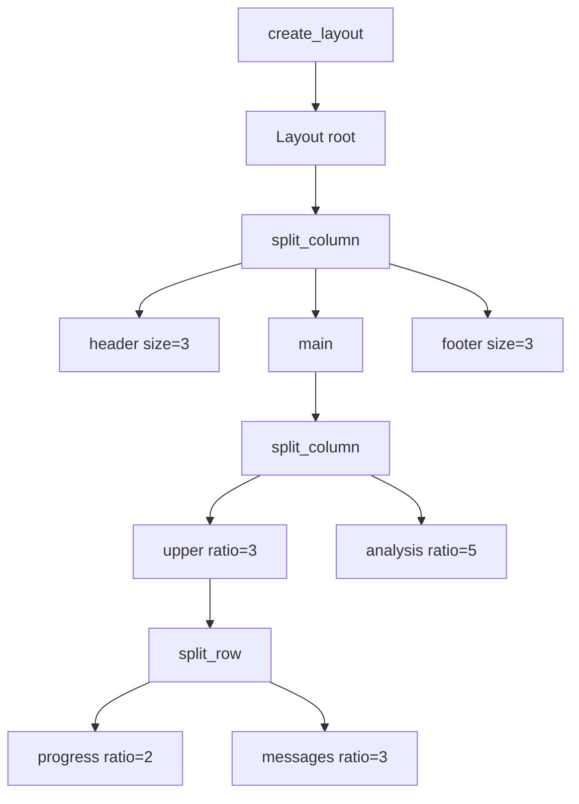
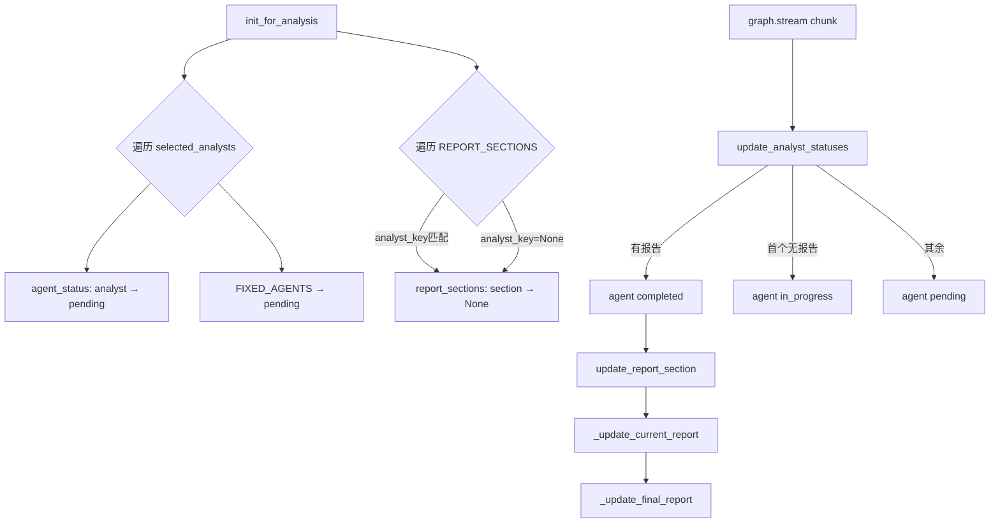
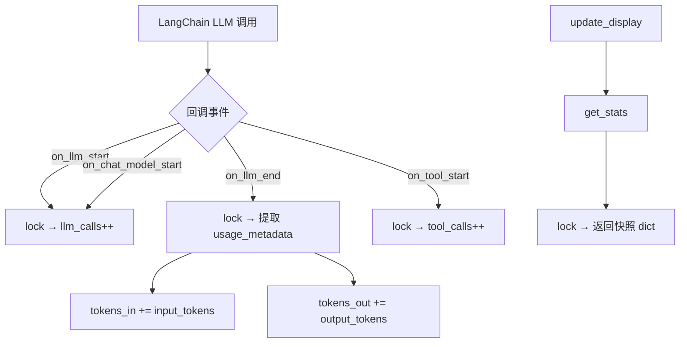

# PD-222.01 TradingAgents — Rich Live 实时终端仪表盘

> 文档编号：PD-222.01
> 来源：TradingAgents `cli/main.py` `cli/stats_handler.py` `cli/utils.py`
> GitHub：https://github.com/TauricResearch/TradingAgents.git
> 问题域：PD-222 实时 CLI 仪表盘 Realtime CLI Dashboard
> 状态：可复用方案

---

## 第 1 章 问题与动机（≥ 30 行）

### 1.1 核心问题

多 Agent 金融分析系统的一次完整运行涉及 10+ 个 Agent 的串行/并行执行，包括 Analyst Team、Research Team（Bull/Bear 辩论）、Trading Team、Risk Management（三方辩论）和 Portfolio Management 五个阶段。整个流程耗时数分钟到数十分钟，期间用户完全无法感知：

1. **当前哪个 Agent 在工作？** — 10+ Agent 的执行顺序和状态不透明
2. **LLM 调用了多少次？消耗了多少 Token？** — 成本不可见
3. **中间产出是什么？** — 各 Analyst 的报告、辩论过程、最终决策都在后台静默生成
4. **还要等多久？** — 没有进度指示，用户只能盲等

这不是简单的"打印日志"问题。传统的 `print()` 或 `logging` 会产生滚动式输出，无法同时展示多维度信息（进度 + 消息流 + 报告内容 + 统计数据）。需要一个**多面板实时仪表盘**，在固定布局中同步更新所有维度。

### 1.2 TradingAgents 的解法概述

TradingAgents 基于 Rich 库构建了一个 4 区域实时终端仪表盘：

1. **Layout 四区分割** — Header（标题）+ Progress（Agent 状态表）+ Messages（消息/工具调用流）+ Analysis（当前报告）+ Footer（统计栏），通过 `Layout.split_column/split_row` 实现嵌套分区（`cli/main.py:232-245`）
2. **MessageBuffer 状态中枢** — 全局单例对象，管理 Agent 状态机（pending→in_progress→completed）、消息队列（deque maxlen=100）、报告分段聚合、工具调用记录（`cli/main.py:43-227`）
3. **Live 上下文 4fps 刷新** — `Live(layout, refresh_per_second=4)` 包裹整个分析流程，每次 `graph.stream()` 产出 chunk 后调用 `update_display()` 刷新全部面板（`cli/main.py:986`）
4. **StatsCallbackHandler 线程安全统计** — 继承 LangChain `BaseCallbackHandler`，用 `threading.Lock` 保护 LLM 调用次数、工具调用次数、Token 用量的并发累加（`cli/stats_handler.py:9-76`）
5. **Decorator 模式持久化** — 用装饰器包装 MessageBuffer 的 `add_message`/`add_tool_call`/`update_report_section` 方法，在更新内存状态的同时写入磁盘日志和报告文件（`cli/main.py:944-981`）

### 1.3 设计思想

| 设计原则 | 具体实现 | 理由 | 替代方案 |
|----------|----------|------|----------|
| 数据与展示分离 | MessageBuffer 只管数据收集，update_display() 只管渲染 | 解耦后可独立测试、替换渲染层 | 直接在回调中 print（耦合严重） |
| 全局单例状态 | `message_buffer = MessageBuffer()` 模块级实例 | 多处回调需要写入同一状态，避免传参链 | 依赖注入（更灵活但更复杂） |
| 线程安全统计 | StatsCallbackHandler 用 threading.Lock 保护所有计数器 | LangChain 回调可能从不同线程触发 | asyncio.Lock（仅适用于异步场景） |
| 固定布局 vs 滚动日志 | Layout 分区 + Live 上下文 | 同时展示进度、消息、报告、统计四个维度 | 纯滚动日志（信息密度低） |
| 装饰器持久化 | 运行时动态包装 MessageBuffer 方法 | 不修改原始类，按需添加磁盘写入 | 子类继承（需要改实例化逻辑） |

---

## 第 2 章 源码实现分析（≥ 60 行，核心章节）

### 2.1 架构概览

TradingAgents CLI 仪表盘的整体架构是一个**事件驱动的单向数据流**：LangGraph 的 `stream()` 产出 chunk → 更新 MessageBuffer 状态 → 调用 `update_display()` 重绘 Layout → Rich Live 以 4fps 刷新终端。

```
┌─────────────────────────────────────────────────────────────────┐
│                    Rich Live Context (4fps)                      │
│  ┌───────────────────────────────────────────────────────────┐  │
│  │ Header: Welcome Banner                                     │  │
│  ├──────────────────────┬────────────────────────────────────┤  │
│  │ Progress Panel       │ Messages & Tools Panel             │  │
│  │ ┌──────────────────┐ │ ┌────────────────────────────────┐ │  │
│  │ │ Team │Agent│Status│ │ │ Time │ Type  │ Content        │ │  │
│  │ │──────│─────│──────│ │ │──────│───────│────────────────│ │  │
│  │ │Analyst│Mkt │ ✓   │ │ │14:23 │ Agent │ Bull analysis..│ │  │
│  │ │      │News│ ⟳   │ │ │14:22 │ Tool  │ get_price(AAPL)│ │  │
│  │ │Research│Bull│ ○  │ │ │14:21 │ System│ Selected: AAPL │ │  │
│  │ └──────────────────┘ │ └────────────────────────────────┘ │  │
│  ├──────────────────────┴────────────────────────────────────┤  │
│  │ Analysis Panel: Current Report (Markdown rendered)         │  │
│  ├───────────────────────────────────────────────────────────┤  │
│  │ Footer: Agents: 3/10 │ LLM: 12 │ Tools: 8 │ Tokens: 15k↑│  │
│  └───────────────────────────────────────────────────────────┘  │
└─────────────────────────────────────────────────────────────────┘
         ↑ update_display()
         │
    ┌────┴────┐
    │MessageBuffer│ ← graph.stream() chunks
    │ .agent_status    │    ← StatsCallbackHandler
    │ .messages (deque) │    ← classify_message_type()
    │ .tool_calls       │    ← save_*_decorator()
    │ .report_sections  │
    └─────────────┘
```

### 2.2 核心实现

#### 2.2.1 Layout 四区分割



对应源码 `cli/main.py:232-245`：

```python
def create_layout():
    layout = Layout()
    layout.split_column(
        Layout(name="header", size=3),
        Layout(name="main"),
        Layout(name="footer", size=3),
    )
    layout["main"].split_column(
        Layout(name="upper", ratio=3), Layout(name="analysis", ratio=5)
    )
    layout["upper"].split_row(
        Layout(name="progress", ratio=2), Layout(name="messages", ratio=3)
    )
    return layout
```

Layout 使用 `size`（固定行数）和 `ratio`（比例分配）两种策略：Header/Footer 固定 3 行，主区域按比例分配。`upper:analysis = 3:5` 让报告区域占更大空间，`progress:messages = 2:3` 让消息流比进度表宽。

#### 2.2.2 MessageBuffer 状态中枢



对应源码 `cli/main.py:43-138`：

```python
class MessageBuffer:
    FIXED_AGENTS = {
        "Research Team": ["Bull Researcher", "Bear Researcher", "Research Manager"],
        "Trading Team": ["Trader"],
        "Risk Management": ["Aggressive Analyst", "Neutral Analyst", "Conservative Analyst"],
        "Portfolio Management": ["Portfolio Manager"],
    }

    REPORT_SECTIONS = {
        "market_report": ("market", "Market Analyst"),
        "sentiment_report": ("social", "Social Analyst"),
        "news_report": ("news", "News Analyst"),
        "fundamentals_report": ("fundamentals", "Fundamentals Analyst"),
        "investment_plan": (None, "Research Manager"),
        "trader_investment_plan": (None, "Trader"),
        "final_trade_decision": (None, "Portfolio Manager"),
    }

    def __init__(self, max_length=100):
        self.messages = deque(maxlen=max_length)
        self.tool_calls = deque(maxlen=max_length)
        self.current_report = None
        self.final_report = None
        self.agent_status = {}
        self.report_sections = {}

    def get_completed_reports_count(self):
        count = 0
        for section in self.report_sections:
            if section not in self.REPORT_SECTIONS:
                continue
            _, finalizing_agent = self.REPORT_SECTIONS[section]
            has_content = self.report_sections.get(section) is not None
            agent_done = self.agent_status.get(finalizing_agent) == "completed"
            if has_content and agent_done:
                count += 1
        return count
```

关键设计：`REPORT_SECTIONS` 字典将每个报告段映射到 `(analyst_key, finalizing_agent)` 二元组。`analyst_key` 控制该段是否激活（`None` 表示始终激活），`finalizing_agent` 控制何时算"完成"——只有负责该报告的 Agent 状态变为 `completed` 且报告有内容时，才计入完成数。这防止了辩论中间轮次的临时内容被误计为完成。

#### 2.2.3 StatsCallbackHandler 线程安全统计



对应源码 `cli/stats_handler.py:9-76`：

```python
class StatsCallbackHandler(BaseCallbackHandler):
    def __init__(self) -> None:
        super().__init__()
        self._lock = threading.Lock()
        self.llm_calls = 0
        self.tool_calls = 0
        self.tokens_in = 0
        self.tokens_out = 0

    def on_llm_end(self, response: LLMResult, **kwargs: Any) -> None:
        try:
            generation = response.generations[0][0]
        except (IndexError, TypeError):
            return
        usage_metadata = None
        if hasattr(generation, "message"):
            message = generation.message
            if isinstance(message, AIMessage) and hasattr(message, "usage_metadata"):
                usage_metadata = message.usage_metadata
        if usage_metadata:
            with self._lock:
                self.tokens_in += usage_metadata.get("input_tokens", 0)
                self.tokens_out += usage_metadata.get("output_tokens", 0)

    def get_stats(self) -> Dict[str, Any]:
        with self._lock:
            return {
                "llm_calls": self.llm_calls,
                "tool_calls": self.tool_calls,
                "tokens_in": self.tokens_in,
                "tokens_out": self.tokens_out,
            }
```

`get_stats()` 在锁内返回一个快照 dict，避免读取时数据被并发修改。Token 提取通过 `response.generations[0][0].message.usage_metadata` 链式访问，兼容 LangChain 的 `AIMessage` 格式。

### 2.3 实现细节

#### 数据流：从 LangGraph Stream 到面板更新

核心循环在 `cli/main.py:1022-1123`，每个 chunk 触发三层处理：

1. **消息分类** — `classify_message_type()` (`cli/main.py:866-889`) 将 LangChain 消息分为 User/Agent/Data/Control 四类，用消息 ID 去重
2. **状态推进** — `update_analyst_statuses()` (`cli/main.py:790-822`) 根据 chunk 中的报告字段推断 Agent 状态转换
3. **面板重绘** — `update_display()` (`cli/main.py:255-459`) 读取 MessageBuffer 全部状态，重建所有 Panel 内容

Agent 状态转换遵循严格的阶段顺序：Analyst → Research（Bull/Bear 辩论）→ Trader → Risk（三方辩论）→ Portfolio Manager。每个阶段完成后自动将下一阶段的首个 Agent 设为 `in_progress`。

#### Decorator 持久化模式

`cli/main.py:944-981` 使用运行时装饰器为 MessageBuffer 添加磁盘写入能力：

```python
def save_message_decorator(obj, func_name):
    func = getattr(obj, func_name)
    @wraps(func)
    def wrapper(*args, **kwargs):
        func(*args, **kwargs)
        timestamp, message_type, content = obj.messages[-1]
        content = content.replace("\n", " ")
        with open(log_file, "a") as f:
            f.write(f"{timestamp} [{message_type}] {content}\n")
    return wrapper

message_buffer.add_message = save_message_decorator(message_buffer, "add_message")
```

这种"实例方法替换"模式避免了修改 MessageBuffer 类本身，保持了核心类的纯粹性。

#### Footer 统计栏

`cli/main.py:420-459` 的 Footer 聚合了五个维度的实时数据：
- `Agents: 3/10` — 从 `agent_status` 字典统计
- `LLM: 12` — 从 StatsCallbackHandler 获取
- `Tools: 8` — 同上
- `Tokens: 15.2k↑ 3.1k↓` — 同上，用 `format_tokens()` 格式化
- `⏱ 02:34` — 从 `start_time` 计算经过时间

---

## 第 3 章 迁移指南（≥ 40 行）

### 3.1 迁移清单

**阶段 1：基础框架（必须）**

- [ ] 安装依赖：`pip install rich`
- [ ] 创建 `DashboardBuffer` 类（对应 MessageBuffer），定义你的 Agent 列表和状态字段
- [ ] 创建 `create_layout()` 函数，根据你的面板需求定义分区
- [ ] 创建 `update_display()` 函数，从 Buffer 读取状态渲染各面板
- [ ] 在主循环中用 `Live(layout, refresh_per_second=4)` 包裹

**阶段 2：统计集成（推荐）**

- [ ] 创建 `StatsCallbackHandler` 继承你的框架回调基类（LangChain/LlamaIndex/自定义）
- [ ] 用 `threading.Lock` 保护所有计数器
- [ ] 在 Footer 面板展示统计数据

**阶段 3：持久化（可选）**

- [ ] 用装饰器模式为 Buffer 方法添加磁盘写入
- [ ] 消息日志写入 `.log` 文件
- [ ] 报告分段写入独立 `.md` 文件

### 3.2 适配代码模板

以下是一个可直接运行的最小仪表盘框架，适用于任何多步骤 Agent 系统：

```python
"""Minimal Rich Live Dashboard for Multi-Agent Systems."""
import time
import threading
from collections import deque
from rich.console import Console
from rich.layout import Layout
from rich.panel import Panel
from rich.table import Table
from rich.live import Live
from rich.spinner import Spinner
from rich import box


class DashboardBuffer:
    """Central state hub for dashboard data collection."""

    def __init__(self, agents: list[str], max_messages: int = 100):
        self.agent_status: dict[str, str] = {a: "pending" for a in agents}
        self.messages: deque = deque(maxlen=max_messages)
        self.current_output: str | None = None
        self._lock = threading.Lock()

    def update_agent(self, agent: str, status: str):
        with self._lock:
            if agent in self.agent_status:
                self.agent_status[agent] = status

    def add_message(self, msg_type: str, content: str):
        ts = time.strftime("%H:%M:%S")
        with self._lock:
            self.messages.append((ts, msg_type, content))

    def set_output(self, content: str):
        with self._lock:
            self.current_output = content

    def get_snapshot(self) -> dict:
        """Thread-safe snapshot of all state."""
        with self._lock:
            return {
                "agents": dict(self.agent_status),
                "messages": list(self.messages),
                "output": self.current_output,
            }


def create_dashboard_layout() -> Layout:
    """Create a 4-region layout: header, progress+messages, output, footer."""
    layout = Layout()
    layout.split_column(
        Layout(name="header", size=3),
        Layout(name="main"),
        Layout(name="footer", size=3),
    )
    layout["main"].split_column(
        Layout(name="upper", ratio=2),
        Layout(name="output", ratio=3),
    )
    layout["upper"].split_row(
        Layout(name="progress", ratio=2),
        Layout(name="messages", ratio=3),
    )
    return layout


def render_dashboard(layout: Layout, buf: DashboardBuffer, start_time: float):
    """Read buffer state and update all panels."""
    snap = buf.get_snapshot()

    # Header
    layout["header"].update(
        Panel("[bold]Multi-Agent Dashboard[/bold]", border_style="green")
    )

    # Progress table
    table = Table(show_header=True, header_style="bold magenta", box=box.SIMPLE_HEAD, expand=True)
    table.add_column("Agent", style="cyan", justify="center")
    table.add_column("Status", style="yellow", justify="center")
    for agent, status in snap["agents"].items():
        if status == "in_progress":
            cell = Spinner("dots", text="[blue]running[/blue]")
        else:
            color = {"pending": "yellow", "completed": "green", "error": "red"}.get(status, "white")
            cell = f"[{color}]{status}[/{color}]"
        table.add_row(agent, cell)
    layout["progress"].update(Panel(table, title="Progress", border_style="cyan"))

    # Messages
    msg_table = Table(show_header=True, header_style="bold", box=box.MINIMAL, expand=True)
    msg_table.add_column("Time", width=8)
    msg_table.add_column("Type", width=8)
    msg_table.add_column("Content", ratio=1)
    for ts, mt, content in reversed(snap["messages"]):
        msg_table.add_row(ts, mt, content[:120])
    layout["messages"].update(Panel(msg_table, title="Messages", border_style="blue"))

    # Output
    output_text = snap["output"] or "[italic]Waiting...[/italic]"
    layout["output"].update(Panel(output_text, title="Output", border_style="green"))

    # Footer
    done = sum(1 for s in snap["agents"].values() if s == "completed")
    total = len(snap["agents"])
    elapsed = time.time() - start_time
    layout["footer"].update(
        Panel(f"Agents: {done}/{total} | ⏱ {int(elapsed//60):02d}:{int(elapsed%60):02d}", border_style="grey50")
    )


# Usage example:
if __name__ == "__main__":
    agents = ["Researcher", "Analyst", "Writer", "Reviewer"]
    buf = DashboardBuffer(agents)
    layout = create_dashboard_layout()
    start = time.time()

    with Live(layout, refresh_per_second=4):
        for i, agent in enumerate(agents):
            buf.update_agent(agent, "in_progress")
            buf.add_message("System", f"{agent} started")
            render_dashboard(layout, buf, start)
            time.sleep(2)  # Simulate work
            buf.update_agent(agent, "completed")
            buf.set_output(f"Output from {agent}...")
            render_dashboard(layout, buf, start)
```

### 3.3 适用场景

| 场景 | 适用度 | 说明 |
|------|--------|------|
| 多 Agent 串行/并行流水线 | ⭐⭐⭐ | 核心场景，Agent 状态表 + 消息流完美匹配 |
| 单 Agent 长时间推理 | ⭐⭐ | 可简化为进度条 + 输出面板，Layout 略重 |
| 批量数据处理管道 | ⭐⭐⭐ | 将 Agent 替换为处理阶段，状态追踪逻辑通用 |
| Web 后端服务监控 | ⭐ | 终端仪表盘不适合服务端，应改用 Web UI |
| CI/CD 流水线可视化 | ⭐⭐ | 适合本地调试，但 CI 环境通常无交互终端 |

---

## 第 4 章 测试用例（≥ 20 行）

```python
"""Tests for Rich Live Dashboard components."""
import threading
import time
import pytest
from collections import deque
from unittest.mock import MagicMock, patch


class TestMessageBuffer:
    """Test MessageBuffer state management."""

    def setup_method(self):
        # Inline minimal MessageBuffer for testing
        from cli.main import MessageBuffer
        self.buf = MessageBuffer(max_length=10)

    def test_init_for_analysis_creates_correct_agents(self):
        self.buf.init_for_analysis(["market", "news"])
        assert "Market Analyst" in self.buf.agent_status
        assert "News Analyst" in self.buf.agent_status
        assert "Social Analyst" not in self.buf.agent_status
        # Fixed agents always present
        assert "Bull Researcher" in self.buf.agent_status
        assert "Trader" in self.buf.agent_status
        assert "Portfolio Manager" in self.buf.agent_status

    def test_init_for_analysis_creates_correct_report_sections(self):
        self.buf.init_for_analysis(["market"])
        assert "market_report" in self.buf.report_sections
        assert "sentiment_report" not in self.buf.report_sections
        # Non-analyst sections always present
        assert "investment_plan" in self.buf.report_sections
        assert "final_trade_decision" in self.buf.report_sections

    def test_agent_status_transitions(self):
        self.buf.init_for_analysis(["market"])
        assert self.buf.agent_status["Market Analyst"] == "pending"
        self.buf.update_agent_status("Market Analyst", "in_progress")
        assert self.buf.agent_status["Market Analyst"] == "in_progress"
        self.buf.update_agent_status("Market Analyst", "completed")
        assert self.buf.agent_status["Market Analyst"] == "completed"

    def test_message_deque_max_length(self):
        self.buf.init_for_analysis(["market"])
        for i in range(20):
            self.buf.add_message("System", f"msg-{i}")
        assert len(self.buf.messages) == 10  # max_length=10

    def test_completed_reports_requires_agent_done(self):
        self.buf.init_for_analysis(["market"])
        # Report has content but agent not completed
        self.buf.report_sections["market_report"] = "some content"
        assert self.buf.get_completed_reports_count() == 0
        # Now mark agent completed
        self.buf.update_agent_status("Market Analyst", "completed")
        assert self.buf.get_completed_reports_count() == 1

    def test_update_report_section_updates_current_report(self):
        self.buf.init_for_analysis(["market"])
        self.buf.update_report_section("market_report", "Analysis result")
        assert self.buf.current_report is not None
        assert "Market Analysis" in self.buf.current_report


class TestStatsCallbackHandler:
    """Test thread-safe statistics collection."""

    def setup_method(self):
        from cli.stats_handler import StatsCallbackHandler
        self.handler = StatsCallbackHandler()

    def test_llm_call_counting(self):
        self.handler.on_llm_start({}, ["prompt"])
        self.handler.on_llm_start({}, ["prompt2"])
        stats = self.handler.get_stats()
        assert stats["llm_calls"] == 2

    def test_tool_call_counting(self):
        self.handler.on_tool_start({}, "input")
        stats = self.handler.get_stats()
        assert stats["tool_calls"] == 1

    def test_thread_safety(self):
        """Concurrent increments should not lose counts."""
        def increment_many():
            for _ in range(1000):
                self.handler.on_llm_start({}, ["p"])

        threads = [threading.Thread(target=increment_many) for _ in range(4)]
        for t in threads:
            t.start()
        for t in threads:
            t.join()
        assert self.handler.get_stats()["llm_calls"] == 4000

    def test_get_stats_returns_snapshot(self):
        self.handler.on_llm_start({}, ["p"])
        snap1 = self.handler.get_stats()
        self.handler.on_llm_start({}, ["p"])
        snap2 = self.handler.get_stats()
        assert snap1["llm_calls"] == 1
        assert snap2["llm_calls"] == 2


class TestClassifyMessageType:
    """Test message classification logic."""

    def test_human_continue_is_control(self):
        from cli.main import classify_message_type
        from langchain_core.messages import HumanMessage
        msg = HumanMessage(content="Continue")
        msg_type, content = classify_message_type(msg)
        assert msg_type == "Control"

    def test_ai_message_is_agent(self):
        from cli.main import classify_message_type
        from langchain_core.messages import AIMessage
        msg = AIMessage(content="Analysis complete")
        msg_type, content = classify_message_type(msg)
        assert msg_type == "Agent"
        assert content == "Analysis complete"


class TestFormatTokens:
    """Test token formatting utility."""

    def test_small_number(self):
        from cli.main import format_tokens
        assert format_tokens(500) == "500"

    def test_thousands(self):
        from cli.main import format_tokens
        assert format_tokens(15200) == "15.2k"

    def test_exact_thousand(self):
        from cli.main import format_tokens
        assert format_tokens(1000) == "1.0k"
```

---

## 第 5 章 跨域关联

| 关联域 | 关系类型 | 说明 |
|--------|----------|------|
| PD-02 多 Agent 编排 | 依赖 | 仪表盘的 Agent 状态追踪直接依赖编排层的阶段划分（Analyst→Research→Trading→Risk→Portfolio），编排拓扑决定了 Progress 面板的分组和状态转换逻辑 |
| PD-11 可观测性 | 协同 | StatsCallbackHandler 是可观测性的终端展示层。LLM 调用次数、Token 用量、工具调用统计都属于 PD-11 的数据采集范畴，仪表盘是其消费端 |
| PD-06 记忆持久化 | 协同 | Decorator 模式将消息和报告持久化到磁盘（`.log` + `.md`），这是记忆持久化在 CLI 层的轻量实现 |
| PD-03 容错与重试 | 互补 | 仪表盘的 `error` 状态和消息流可以展示重试过程，但 TradingAgents 当前未实现 Agent 级重试，仪表盘只做状态展示不做恢复 |
| PD-07 质量检查 | 协同 | Research Team 的 Bull/Bear 辩论和 Risk Management 的三方辩论本质上是质量检查机制，仪表盘实时展示辩论轮次和最终裁决 |

---

## 第 6 章 来源文件索引

| 文件 | 行范围 | 关键实现 |
|------|--------|----------|
| `cli/main.py` | L43-L227 | MessageBuffer 类：Agent 状态管理、消息队列、报告分段聚合 |
| `cli/main.py` | L232-L245 | create_layout()：四区嵌套 Layout 定义 |
| `cli/main.py` | L255-L459 | update_display()：全面板渲染逻辑，Progress 表、Messages 表、Analysis 面板、Footer 统计 |
| `cli/main.py` | L462-L589 | get_user_selections()：分步交互式配置收集 |
| `cli/main.py` | L790-L822 | update_analyst_statuses()：基于报告状态推断 Agent 状态转换 |
| `cli/main.py` | L866-L897 | classify_message_type() + format_tool_args()：消息分类与格式化 |
| `cli/main.py` | L899-L1142 | run_analysis()：主循环，Live 上下文 + stream 处理 + 状态推进 |
| `cli/main.py` | L944-L981 | save_*_decorator()：运行时装饰器持久化模式 |
| `cli/stats_handler.py` | L9-L76 | StatsCallbackHandler：线程安全的 LLM/Tool/Token 统计回调 |
| `cli/utils.py` | L1-L329 | 交互式选择工具：questionary 封装的 ticker/date/analyst/model 选择器 |
| `cli/models.py` | L1-L11 | AnalystType 枚举定义 |
| `cli/announcements.py` | L1-L52 | 远程公告获取与 Rich Panel 展示 |
| `tradingagents/graph/propagation.py` | L11-L57 | Propagator：初始状态构建 + stream_mode="values" 配置 |

---

## 第 7 章 横向对比维度

> **重要：** 本章用于自动填充 Butcher Wiki 的横向对比表。

```json comparison_data
{
  "project": "TradingAgents",
  "dimensions": {
    "渲染框架": "Rich Layout + Live 上下文 4fps 刷新",
    "面板架构": "四区嵌套分割：Header/Progress+Messages/Analysis/Footer",
    "状态管理": "MessageBuffer 全局单例 + deque 有界队列",
    "统计采集": "LangChain BaseCallbackHandler + threading.Lock 线程安全",
    "持久化方式": "运行时 Decorator 包装，消息→log 报告→md",
    "交互模式": "questionary 分步收集 → Live 仪表盘 → 完成后 typer 交互"
  }
}
```

### 域元数据补充

```json domain_metadata
{
  "solution_summary": "TradingAgents 用 Rich Layout 四区分割 + MessageBuffer 全局状态中枢 + Live 4fps 刷新构建多 Agent 实时终端仪表盘，StatsCallbackHandler 线程安全采集 LLM/Token 统计",
  "description": "终端仪表盘需要解决多维度信息的固定布局同步刷新问题",
  "sub_problems": [
    "线程安全的 LLM/Token 统计采集",
    "运行时装饰器持久化消息与报告",
    "报告完成度的双条件判定（内容+Agent状态）"
  ],
  "best_practices": [
    "用 Decorator 模式为 Buffer 添加磁盘写入而不修改原始类",
    "get_stats() 在锁内返回快照 dict 避免读写竞争",
    "报告完成计数需同时检查内容存在和 finalizing_agent 状态"
  ]
}
```
