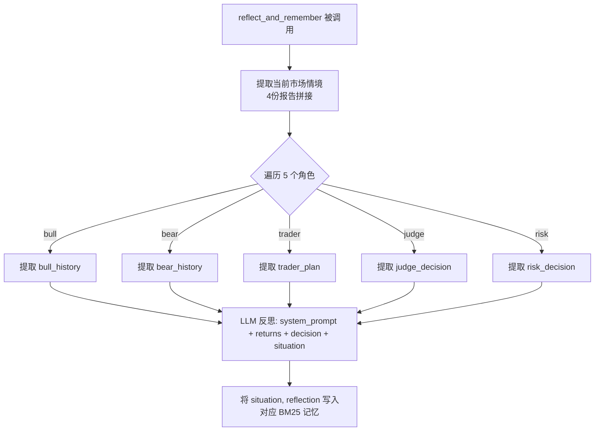
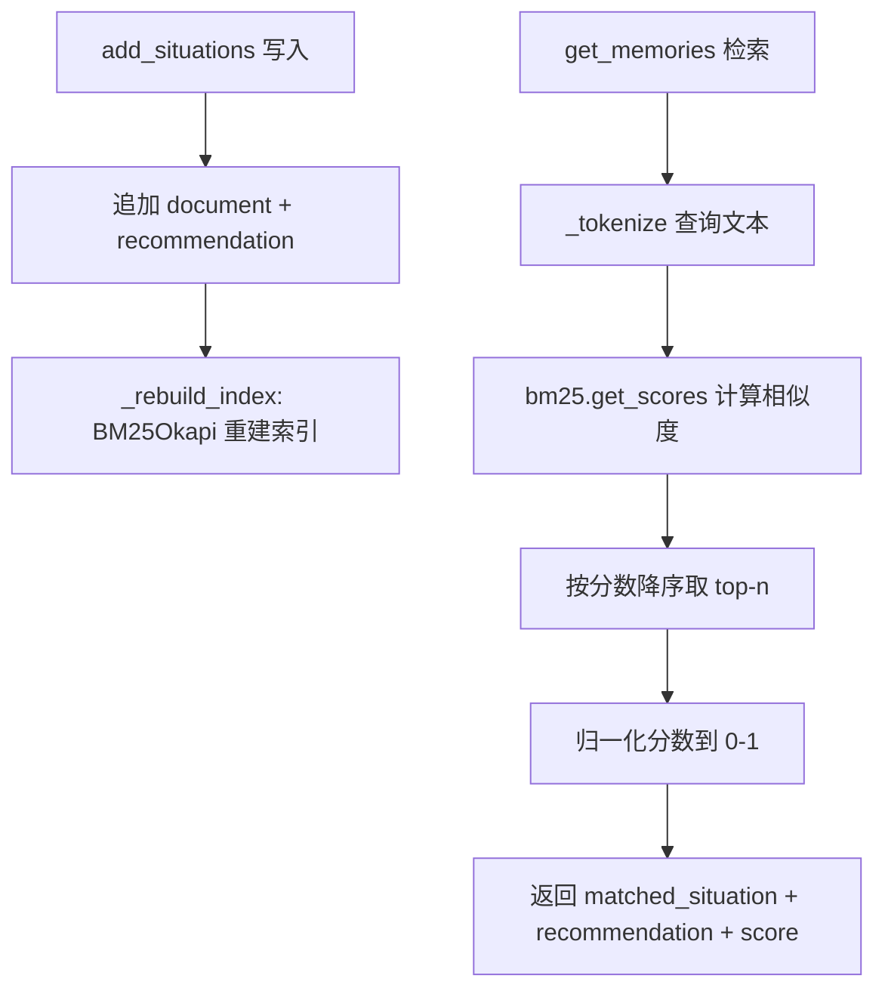

# PD-223.01 TradingAgents — 五角色 BM25 反思记忆闭环

> 文档编号：PD-223.01
> 来源：TradingAgents `tradingagents/graph/reflection.py`, `tradingagents/agents/utils/memory.py`
> GitHub：https://github.com/TauricResearch/TradingAgents.git
> 问题域：PD-223 反思学习机制 Reflection Learning
> 状态：可复用方案

---

## 第 1 章 问题与动机

### 1.1 核心问题

多 Agent 交易系统在连续决策场景中面临一个关键挑战：**同样的错误会反复出现**。Bull 分析师可能在连续多个交易日过度乐观，Trader 可能在相似市场环境下重复做出亏损决策，但系统没有机制让这些角色从历史错误中学习。

具体痛点：
- 每次交易决策是独立的，前一次的教训无法传递到下一次
- 5 个决策角色（bull/bear/trader/invest_judge/risk_manager）各有不同的认知偏差，需要独立纠偏
- 反思结果需要在"相似市场情境"下被检索出来，而非简单的时间序列回放
- 反思不能依赖向量数据库等外部服务，需要轻量级、离线可用的方案

### 1.2 TradingAgents 的解法概述

TradingAgents 实现了一套**交易后反思 → BM25 记忆存储 → 决策时检索注入**的闭环机制：

1. **Reflector 类**统一管理 5 个角色的反思流程（`reflection.py:7-121`），每个角色使用相同的反思 prompt 模板但输入不同的决策历史
2. **FinancialSituationMemory** 基于 BM25 算法实现纯本地记忆检索（`memory.py:12-98`），无需向量数据库或 API 调用
3. **5 个独立记忆实例**在 TradingAgentsGraph 初始化时创建（`trading_graph.py:98-102`），通过 GraphSetup 注入到对应 Agent 节点
4. **决策时自动检索**：每个 Agent 在执行前用当前市场情境查询 BM25 记忆，获取 top-2 相似情境的历史教训（如 `bull_researcher.py:19`）
5. **交易后批量反思**：`reflect_and_remember()` 方法在获得收益/亏损数据后，对 5 个角色逐一执行 LLM 反思并写入记忆（`trading_graph.py:263-279`）

### 1.3 设计思想

| 设计原则 | 具体实现 | 理由 | 替代方案 |
|----------|----------|------|----------|
| 角色隔离反思 | 5 个独立 FinancialSituationMemory 实例 | 避免 bull 的教训污染 bear 的记忆，每个角色有独立认知偏差 | 共享记忆池 + 角色标签过滤 |
| 轻量级检索 | BM25 词频匹配，无向量数据库 | 零外部依赖、离线可用、无 token 消耗 | FAISS/ChromaDB 向量检索 |
| 情境驱动检索 | 用 4 份市场报告拼接为查询 key | 确保检索到的是"相似市场环境"下的教训，而非时间相邻的教训 | 按时间窗口回放 |
| 统一反思模板 | 单一 system prompt 覆盖 4 维分析框架 | 保证反思质量一致性，减少 prompt 维护成本 | 每个角色定制反思 prompt |
| 延迟反思 | 交易后获得真实收益数据再反思 | 需要客观结果才能判断决策正确性 | 交易前自我评估 |

---

## 第 2 章 源码实现分析

### 2.1 架构概览

TradingAgents 的反思学习机制由三层组成：反思引擎（Reflector）、记忆存储（FinancialSituationMemory）、记忆消费（各 Agent 节点）。

```
┌─────────────────────────────────────────────────────────────────┐
│                    TradingAgentsGraph                            │
│                                                                 │
│  ┌──────────┐  ┌──────────┐  ┌──────────┐  ┌──────────┐       │
│  │bull_memory│  │bear_memory│  │trader_mem│  │judge_mem │  ...  │
│  │(BM25)    │  │(BM25)    │  │(BM25)    │  │(BM25)    │       │
│  └────┬─────┘  └────┬─────┘  └────┬─────┘  └────┬─────┘       │
│       │              │             │              │              │
│  ┌────▼─────┐  ┌────▼─────┐  ┌───▼──────┐  ┌───▼──────┐      │
│  │Bull      │  │Bear      │  │Trader    │  │Research  │       │
│  │Researcher│  │Researcher│  │          │  │Manager   │  ...  │
│  │(读取记忆)│  │(读取记忆)│  │(读取记忆)│  │(读取记忆)│       │
│  └──────────┘  └──────────┘  └──────────┘  └──────────┘       │
│       │              │             │              │              │
│       └──────────────┴─────────────┴──────────────┘              │
│                           │                                      │
│                    ┌──────▼──────┐                               │
│                    │ Reflector   │  ← reflect_and_remember()     │
│                    │ (LLM 反思)  │  ← 传入 returns_losses        │
│                    └─────────────┘                               │
└─────────────────────────────────────────────────────────────────┘
```

数据流闭环：
1. **决策阶段**：Agent 读取 BM25 记忆 → 注入 prompt → 生成决策
2. **执行阶段**：获得真实收益/亏损数据
3. **反思阶段**：Reflector 用 LLM 分析每个角色的决策 → 写入对应 BM25 记忆
4. **下一轮决策**：Agent 检索到上一轮的反思教训

### 2.2 核心实现

#### 2.2.1 Reflector 反思引擎



对应源码 `tradingagents/graph/reflection.py:7-121`：

```python
class Reflector:
    """Handles reflection on decisions and updating memory."""

    def __init__(self, quick_thinking_llm: ChatOpenAI):
        self.quick_thinking_llm = quick_thinking_llm
        self.reflection_system_prompt = self._get_reflection_prompt()

    def _extract_current_situation(self, current_state: Dict[str, Any]) -> str:
        """Extract the current market situation from the state."""
        curr_market_report = current_state["market_report"]
        curr_sentiment_report = current_state["sentiment_report"]
        curr_news_report = current_state["news_report"]
        curr_fundamentals_report = current_state["fundamentals_report"]
        return f"{curr_market_report}\n\n{curr_sentiment_report}\n\n{curr_news_report}\n\n{curr_fundamentals_report}"

    def _reflect_on_component(
        self, component_type: str, report: str, situation: str, returns_losses
    ) -> str:
        messages = [
            ("system", self.reflection_system_prompt),
            ("human", f"Returns: {returns_losses}\n\nAnalysis/Decision: {report}\n\nObjective Market Reports for Reference: {situation}"),
        ]
        result = self.quick_thinking_llm.invoke(messages).content
        return result

    def reflect_bull_researcher(self, current_state, returns_losses, bull_memory):
        situation = self._extract_current_situation(current_state)
        bull_debate_history = current_state["investment_debate_state"]["bull_history"]
        result = self._reflect_on_component("BULL", bull_debate_history, situation, returns_losses)
        bull_memory.add_situations([(situation, result)])
```

关键设计点：
- **统一反思 prompt**（`reflection.py:15-47`）：包含 4 个维度——Reasoning（判断正误）、Improvement（改进建议）、Summary（教训总结）、Query（精炼为 ≤1000 token 的检索 key）
- **situation 作为记忆 key**：4 份市场报告拼接后既作为 BM25 的文档索引，也作为后续检索的查询输入
- **reflection 作为记忆 value**：LLM 生成的反思结果存储为 recommendation，在后续检索时返回

#### 2.2.2 BM25 记忆存储与检索



对应源码 `tradingagents/agents/utils/memory.py:12-92`：

```python
class FinancialSituationMemory:
    def __init__(self, name: str, config: dict = None):
        self.name = name
        self.documents: List[str] = []       # 市场情境（BM25 索引文档）
        self.recommendations: List[str] = []  # 反思结果（检索返回值）
        self.bm25 = None

    def _tokenize(self, text: str) -> List[str]:
        tokens = re.findall(r'\b\w+\b', text.lower())
        return tokens

    def _rebuild_index(self):
        if self.documents:
            tokenized_docs = [self._tokenize(doc) for doc in self.documents]
            self.bm25 = BM25Okapi(tokenized_docs)
        else:
            self.bm25 = None

    def add_situations(self, situations_and_advice: List[Tuple[str, str]]):
        for situation, recommendation in situations_and_advice:
            self.documents.append(situation)
            self.recommendations.append(recommendation)
        self._rebuild_index()

    def get_memories(self, current_situation: str, n_matches: int = 1) -> List[dict]:
        if not self.documents or self.bm25 is None:
            return []
        query_tokens = self._tokenize(current_situation)
        scores = self.bm25.get_scores(query_tokens)
        top_indices = sorted(range(len(scores)), key=lambda i: scores[i], reverse=True)[:n_matches]
        max_score = max(scores) if max(scores) > 0 else 1
        results = []
        for idx in top_indices:
            normalized_score = scores[idx] / max_score if max_score > 0 else 0
            results.append({
                "matched_situation": self.documents[idx],
                "recommendation": self.recommendations[idx],
                "similarity_score": normalized_score,
            })
        return results
```

### 2.3 实现细节

**记忆注入方式**：每个 Agent 在决策前主动调用 `memory.get_memories(curr_situation, n_matches=2)` 获取 top-2 历史教训，然后拼接到 prompt 中。以 Bull Researcher 为例（`bull_researcher.py:19-23`）：

```python
curr_situation = f"{market_research_report}\n\n{sentiment_report}\n\n{news_report}\n\n{fundamentals_report}"
past_memories = memory.get_memories(curr_situation, n_matches=2)
past_memory_str = ""
for i, rec in enumerate(past_memories, 1):
    past_memory_str += rec["recommendation"] + "\n\n"
```

然后在 prompt 中注入：`Reflections from similar situations and lessons learned: {past_memory_str}`（`bull_researcher.py:41`）

**5 个记忆实例的创建与注入链路**（`trading_graph.py:98-102` → `setup.py:89-106`）：

```
TradingAgentsGraph.__init__()
  → 创建 5 个 FinancialSituationMemory 实例
  → 传入 GraphSetup 构造函数
  → GraphSetup.setup_graph() 中注入到各 Agent 工厂函数
    → create_bull_researcher(llm, bull_memory)
    → create_bear_researcher(llm, bear_memory)
    → create_trader(llm, trader_memory)
    → create_research_manager(llm, invest_judge_memory)
    → create_risk_manager(llm, risk_manager_memory)
```

**反思触发时机**：在 `main.py:31` 中，`reflect_and_remember(returns_losses)` 在 `propagate()` 之后手动调用，参数是该交易的实际收益/亏损值。这是一个**显式的外部触发**，而非自动化的。


---

## 第 3 章 迁移指南

### 3.1 迁移清单

**阶段 1：记忆存储层**
- [ ] 实现 `SituationMemory` 类，包含 BM25 索引、文档列表、推荐列表
- [ ] 安装依赖：`pip install rank-bm25`
- [ ] 实现 `add_situations()` 和 `get_memories()` 接口
- [ ] 为每个需要反思的角色创建独立记忆实例

**阶段 2：反思引擎**
- [ ] 设计反思 system prompt，包含 Reasoning / Improvement / Summary / Query 四个维度
- [ ] 实现 `Reflector` 类，为每个角色提取对应的决策历史
- [ ] 将反思结果写入对应角色的记忆实例

**阶段 3：记忆消费**
- [ ] 在每个 Agent 的决策函数中添加 `memory.get_memories()` 调用
- [ ] 将检索到的历史教训拼接到 Agent 的 prompt 中
- [ ] 调整 `n_matches` 参数控制注入的记忆数量（推荐 1-3 条）

**阶段 4：闭环集成**
- [ ] 在主循环中，决策执行后获取真实结果
- [ ] 调用 `reflect_and_remember(result)` 触发反思
- [ ] 验证下一轮决策时能检索到上一轮的反思

### 3.2 适配代码模板

以下是一个可直接复用的最小化反思记忆系统：

```python
"""Minimal reflection-memory loop, adapted from TradingAgents."""

from rank_bm25 import BM25Okapi
from typing import List, Tuple
import re


class RoleMemory:
    """BM25-based memory for a single agent role."""

    def __init__(self, role_name: str):
        self.role_name = role_name
        self.situations: List[str] = []
        self.reflections: List[str] = []
        self.bm25 = None

    def _tokenize(self, text: str) -> List[str]:
        return re.findall(r'\b\w+\b', text.lower())

    def add(self, situation: str, reflection: str):
        self.situations.append(situation)
        self.reflections.append(reflection)
        tokenized = [self._tokenize(doc) for doc in self.situations]
        self.bm25 = BM25Okapi(tokenized)

    def recall(self, query: str, top_k: int = 2) -> List[str]:
        if not self.bm25:
            return []
        scores = self.bm25.get_scores(self._tokenize(query))
        top_idx = sorted(range(len(scores)), key=lambda i: scores[i], reverse=True)[:top_k]
        return [self.reflections[i] for i in top_idx]


class ReflectionEngine:
    """Generates reflections for agent roles using LLM."""

    SYSTEM_PROMPT = (
        "You are reviewing a decision. Analyze: "
        "1) Was it correct? 2) What factors contributed? "
        "3) How to improve? 4) Summarize lessons in <200 words."
    )

    def __init__(self, llm):
        self.llm = llm

    def reflect(self, decision: str, context: str, outcome: str) -> str:
        messages = [
            ("system", self.SYSTEM_PROMPT),
            ("human", f"Outcome: {outcome}\nDecision: {decision}\nContext: {context}"),
        ]
        return self.llm.invoke(messages).content


# Usage pattern:
# 1. Create memories per role
# memories = {role: RoleMemory(role) for role in ["analyst", "trader", "reviewer"]}
#
# 2. Before decision: inject past lessons
# lessons = memories["analyst"].recall(current_context)
# prompt = f"...Past lessons: {lessons}..."
#
# 3. After outcome: reflect and store
# reflection = engine.reflect(decision, context, outcome)
# memories["analyst"].add(context, reflection)
```

### 3.3 适用场景

| 场景 | 适用度 | 说明 |
|------|--------|------|
| 多角色 Agent 连续决策 | ⭐⭐⭐ | 核心场景，每个角色独立积累经验 |
| 单 Agent 迭代优化 | ⭐⭐⭐ | 简化为单记忆实例即可 |
| 需要离线/低成本检索 | ⭐⭐⭐ | BM25 零 API 调用，纯本地计算 |
| 需要语义级相似度 | ⭐⭐ | BM25 是词频匹配，语义理解弱于向量检索 |
| 长期记忆（>1000 条） | ⭐ | BM25 全量重建索引，大规模时性能下降 |
| 跨角色经验共享 | ⭐ | 当前设计是严格隔离的，需额外实现共享层 |

---

## 第 4 章 测试用例

```python
"""Tests for the reflection-memory loop, based on TradingAgents patterns."""

import pytest
from rank_bm25 import BM25Okapi
import re
from typing import List, Tuple
from unittest.mock import MagicMock


class FinancialSituationMemory:
    """Simplified version for testing."""

    def __init__(self, name: str):
        self.name = name
        self.documents: List[str] = []
        self.recommendations: List[str] = []
        self.bm25 = None

    def _tokenize(self, text: str) -> List[str]:
        return re.findall(r'\b\w+\b', text.lower())

    def _rebuild_index(self):
        if self.documents:
            self.bm25 = BM25Okapi([self._tokenize(d) for d in self.documents])
        else:
            self.bm25 = None

    def add_situations(self, pairs: List[Tuple[str, str]]):
        for sit, rec in pairs:
            self.documents.append(sit)
            self.recommendations.append(rec)
        self._rebuild_index()

    def get_memories(self, query: str, n_matches: int = 1) -> List[dict]:
        if not self.bm25:
            return []
        scores = self.bm25.get_scores(self._tokenize(query))
        top = sorted(range(len(scores)), key=lambda i: scores[i], reverse=True)[:n_matches]
        mx = max(scores) if max(scores) > 0 else 1
        return [{"matched_situation": self.documents[i],
                 "recommendation": self.recommendations[i],
                 "similarity_score": scores[i] / mx} for i in top]

    def clear(self):
        self.documents, self.recommendations, self.bm25 = [], [], None


class TestFinancialSituationMemory:
    def test_empty_memory_returns_nothing(self):
        mem = FinancialSituationMemory("test")
        assert mem.get_memories("any query") == []

    def test_add_and_retrieve_single(self):
        mem = FinancialSituationMemory("test")
        mem.add_situations([("tech stocks volatile with rising rates", "reduce tech exposure")])
        results = mem.get_memories("tech sector volatility interest rates", n_matches=1)
        assert len(results) == 1
        assert results[0]["recommendation"] == "reduce tech exposure"
        assert results[0]["similarity_score"] > 0

    def test_retrieval_ranks_by_relevance(self):
        mem = FinancialSituationMemory("test")
        mem.add_situations([
            ("oil prices surging due to OPEC cuts", "buy energy stocks"),
            ("tech stocks crashing on rate hikes", "sell growth stocks"),
            ("gold rising as inflation fears grow", "hedge with commodities"),
        ])
        results = mem.get_memories("technology sector decline interest rate increase", n_matches=2)
        assert len(results) == 2
        # The tech-related memory should rank highest
        assert "sell growth" in results[0]["recommendation"] or "tech" in results[0]["matched_situation"]

    def test_clear_resets_memory(self):
        mem = FinancialSituationMemory("test")
        mem.add_situations([("situation", "advice")])
        mem.clear()
        assert mem.get_memories("situation") == []

    def test_multiple_memories_per_role_are_isolated(self):
        bull_mem = FinancialSituationMemory("bull")
        bear_mem = FinancialSituationMemory("bear")
        bull_mem.add_situations([("market up", "stay bullish")])
        bear_mem.add_situations([("market down", "stay bearish")])
        assert len(bull_mem.get_memories("market up")) == 1
        assert bull_mem.get_memories("market up")[0]["recommendation"] == "stay bullish"
        assert bear_mem.get_memories("market down")[0]["recommendation"] == "stay bearish"

    def test_n_matches_caps_results(self):
        mem = FinancialSituationMemory("test")
        mem.add_situations([
            ("a", "r1"), ("b", "r2"), ("c", "r3"), ("d", "r4"),
        ])
        assert len(mem.get_memories("a b c d", n_matches=2)) == 2

    def test_normalized_score_max_is_one(self):
        mem = FinancialSituationMemory("test")
        mem.add_situations([("exact match query", "advice")])
        results = mem.get_memories("exact match query", n_matches=1)
        assert results[0]["similarity_score"] == pytest.approx(1.0)


class TestReflectorIntegration:
    def test_reflect_writes_to_correct_memory(self):
        """Verify that reflection output is stored in the role's memory."""
        mock_llm = MagicMock()
        mock_llm.invoke.return_value = MagicMock(content="Lesson: should have sold earlier")

        bull_mem = FinancialSituationMemory("bull")
        state = {
            "market_report": "NVDA down 5%",
            "sentiment_report": "bearish sentiment",
            "news_report": "rate hike announced",
            "fundamentals_report": "PE ratio high",
            "investment_debate_state": {"bull_history": "argued for buy"},
        }
        situation = f"{state['market_report']}\n\n{state['sentiment_report']}\n\n{state['news_report']}\n\n{state['fundamentals_report']}"
        result = mock_llm.invoke([
            ("system", "reflection prompt"),
            ("human", f"Returns: -500\n\nAnalysis/Decision: argued for buy\n\nObjective Market Reports: {situation}"),
        ]).content
        bull_mem.add_situations([(situation, result)])

        retrieved = bull_mem.get_memories("NVDA declining bearish rate hike", n_matches=1)
        assert len(retrieved) == 1
        assert "sold earlier" in retrieved[0]["recommendation"]
```


---

## 第 5 章 跨域关联

| 关联域 | 关系类型 | 说明 |
|--------|----------|------|
| PD-06 记忆持久化 | 强依赖 | 反思结果的存储层。TradingAgents 的 BM25 记忆是纯内存的，重启后丢失；若需持久化需结合 PD-06 的存储方案 |
| PD-02 多 Agent 编排 | 协同 | 反思机制嵌入在 LangGraph DAG 的外层循环中，依赖编排框架提供的状态传递能力 |
| PD-07 质量检查 | 协同 | 反思本质上是一种事后质量检查，Reflector 的 4 维分析框架（Reasoning/Improvement/Summary/Query）可视为质量评估的变体 |
| PD-11 可观测性 | 协同 | 反思结果可作为可观测性数据源，追踪每个角色的决策质量趋势 |
| PD-01 上下文管理 | 潜在冲突 | 4 份市场报告 + 历史教训注入 prompt 会显著增加上下文长度，需注意 token 预算 |
| PD-12 推理增强 | 协同 | 反思记忆注入是一种经验驱动的推理增强，与 PD-12 的 CoT/多轮推理互补 |

---

## 第 6 章 来源文件索引

| 文件 | 行范围 | 关键实现 |
|------|--------|----------|
| `tradingagents/graph/reflection.py` | L7-L121 | Reflector 类：5 角色反思引擎，统一 system prompt，_reflect_on_component 核心方法 |
| `tradingagents/agents/utils/memory.py` | L12-L98 | FinancialSituationMemory：BM25 记忆存储，add_situations / get_memories / _rebuild_index |
| `tradingagents/graph/trading_graph.py` | L98-L102 | 5 个独立记忆实例创建 |
| `tradingagents/graph/trading_graph.py` | L263-L279 | reflect_and_remember() 入口：逐角色调用反思并写入记忆 |
| `tradingagents/graph/setup.py` | L89-L106 | GraphSetup 将记忆实例注入到 Agent 工厂函数 |
| `tradingagents/agents/researchers/bull_researcher.py` | L19-L23 | Bull Researcher 决策前检索记忆并注入 prompt |
| `tradingagents/agents/researchers/bear_researcher.py` | L19-L23 | Bear Researcher 决策前检索记忆并注入 prompt |
| `tradingagents/agents/trader/trader.py` | L15-L23 | Trader 决策前检索记忆并注入 prompt |
| `tradingagents/agents/managers/research_manager.py` | L15-L20 | Research Manager（invest_judge）检索记忆 |
| `tradingagents/agents/managers/risk_manager.py` | L18-L19 | Risk Manager 检索记忆 |
| `main.py` | L31 | reflect_and_remember 调用示例 |

---

## 第 7 章 横向对比维度

```json comparison_data
{
  "project": "TradingAgents",
  "dimensions": {
    "反思触发": "交易后显式调用，传入真实收益/亏损值",
    "反思粒度": "5 角色独立反思，每角色提取各自决策历史",
    "记忆检索": "BM25 词频匹配，4 份市场报告拼接为查询 key",
    "记忆注入": "top-2 历史教训拼接到 Agent prompt 尾部",
    "反思模板": "统一 4 维框架：Reasoning/Improvement/Summary/Query",
    "持久化": "纯内存，进程结束即丢失"
  }
}
```

### 域元数据补充

```json domain_metadata
{
  "solution_summary": "TradingAgents 用 Reflector 类对 5 个交易角色逐一执行 LLM 反思，将教训写入各自的 BM25 记忆，决策时按市场情境相似度检索 top-2 历史教训注入 prompt",
  "description": "交易后反思与情境驱动经验检索的闭环学习机制",
  "sub_problems": [
    "反思触发时机与外部信号（收益/亏损）的耦合",
    "BM25 词频匹配在金融术语场景下的检索精度"
  ],
  "best_practices": [
    "用统一反思模板保证多角色反思质量一致性",
    "将 4 份市场报告拼接为情境 key 确保检索语义对齐",
    "使用 quick_thinking_llm 执行反思以控制成本"
  ]
}
```

