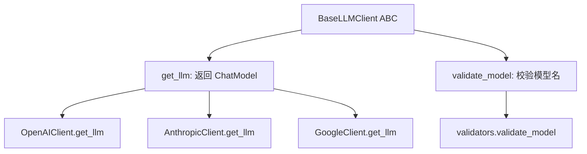
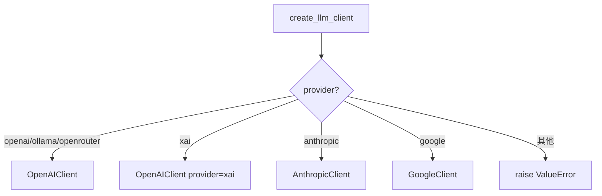
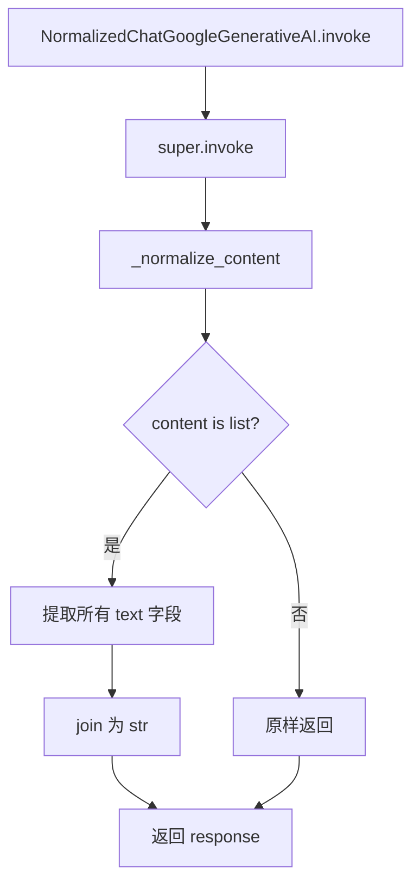
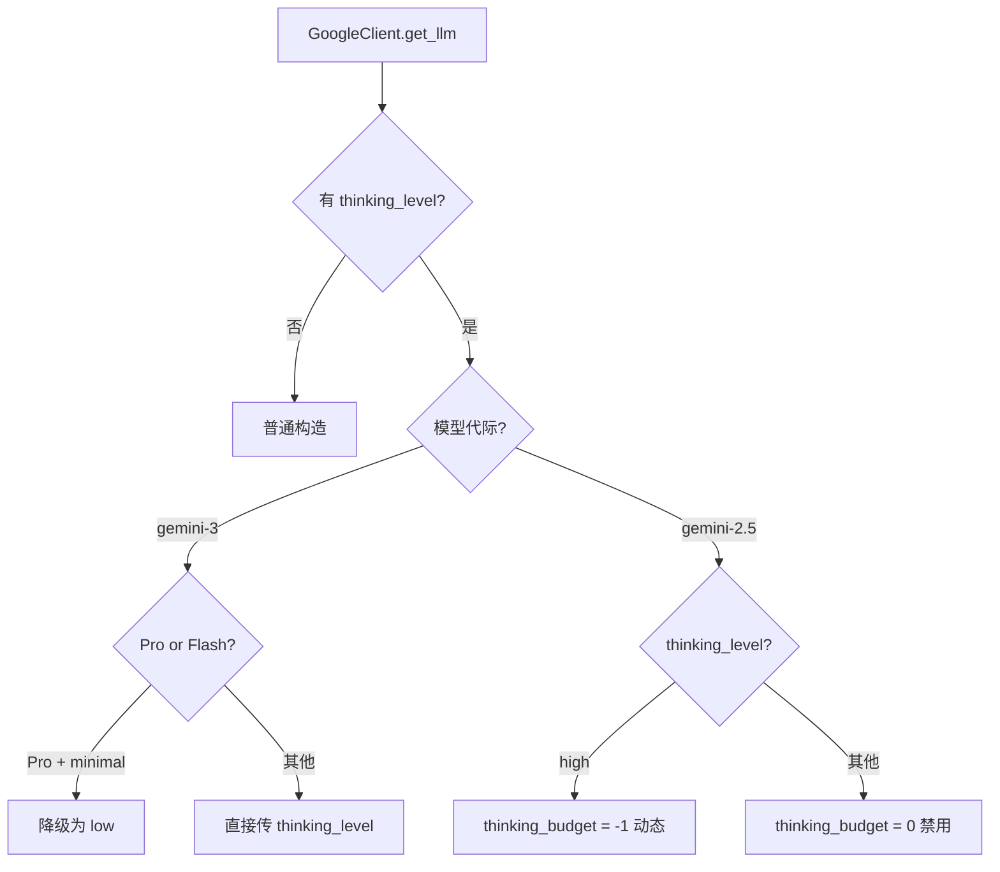

# PD-224.01 TradingAgents — BaseLLMClient 抽象基类与 Factory 多 Provider 统一适配

> 文档编号：PD-224.01
> 来源：TradingAgents `tradingagents/llm_clients/`
> GitHub：https://github.com/TauricResearch/TradingAgents.git
> 问题域：PD-224 多 LLM Provider 抽象 Multi-LLM Provider Abstraction
> 状态：可复用方案

---

## 第 1 章 问题与动机

### 1.1 核心问题

多 Agent 金融交易系统需要同时支持 OpenAI、Anthropic、Google、xAI、Ollama、OpenRouter 六大 LLM 提供商。每家 API 的认证方式、参数命名、输出格式、推理模型特殊限制各不相同。如果在业务代码中直接耦合某一家 SDK，切换 Provider 就意味着大面积改代码。

核心矛盾：
- OpenAI o1/o3/gpt-5 推理模型不支持 `temperature`/`top_p` 参数，传了会报错
- Google Gemini 3 返回 `content` 是 `list[dict]` 而非 `str`，下游解析会崩
- Gemini 3 Pro 和 Flash 的 thinking 参数名和可选值不同（`thinking_level` vs `thinking_budget`）
- xAI/OpenRouter/Ollama 都兼容 OpenAI 协议但 base_url 和 API key 来源不同
- 业务层（TradingAgentsGraph）不应关心这些差异

### 1.2 TradingAgents 的解法概述

1. **BaseLLMClient 抽象基类** (`base_client.py:5-21`)：定义 `get_llm()` + `validate_model()` 两个抽象方法，所有 Provider 必须实现
2. **Factory 函数分发** (`factory.py:9-43`)：`create_llm_client()` 按 provider 字符串路由到具体 Client 类，业务层只调这一个入口
3. **UnifiedChatOpenAI 参数剥离** (`openai_client.py:10-28`)：继承 ChatOpenAI，在 `__init__` 中自动检测推理模型并剥离不兼容参数
4. **NormalizedChatGoogleGenerativeAI 输出归一化** (`google_client.py:9-25`)：继承 ChatGoogleGenerativeAI，重写 `invoke()` 将 list 格式 content 归一化为 str
5. **白名单模型验证** (`validators.py:7-82`)：按 Provider 维护合法模型列表，Ollama/OpenRouter 放行所有模型

### 1.3 设计思想

| 设计原则 | 具体实现 | 理由 | 替代方案 |
|----------|----------|------|----------|
| 抽象基类统一接口 | `BaseLLMClient(ABC)` 定义 `get_llm()` / `validate_model()` | 业务层只依赖抽象，不依赖具体 Provider | 鸭子类型（无强制约束） |
| Factory 集中路由 | `create_llm_client()` 单入口 | 新增 Provider 只改 factory，不改调用方 | Registry 注册表（更灵活但更复杂） |
| 继承 + 重写修补 SDK 缺陷 | `UnifiedChatOpenAI` 继承 `ChatOpenAI` | 最小侵入，不 fork SDK | Wrapper 包装（多一层间接） |
| 参数白名单透传 | 每个 Client 显式列出可透传的 kwargs | 防止不兼容参数泄漏到 SDK | 全量透传（容易出错） |
| 宽松验证策略 | Ollama/OpenRouter 跳过验证 | 自定义模型名无法穷举 | 严格验证（阻碍自定义模型） |

---

## 第 2 章 源码实现分析

### 2.1 架构概览

```
┌─────────────────────────────────────────────────────────┐
│                  TradingAgentsGraph                      │
│  config["llm_provider"] + config["deep_think_llm"]      │
│                        │                                 │
│                        ▼                                 │
│              create_llm_client()                         │
│              (factory.py:9-43)                           │
│                        │                                 │
│         ┌──────────────┼──────────────┐                  │
│         ▼              ▼              ▼                  │
│   OpenAIClient   AnthropicClient  GoogleClient           │
│   (handles:      (handles:        (handles:              │
│    openai,        anthropic)       google)               │
│    xai,                                                  │
│    ollama,                                               │
│    openrouter)                                           │
│         │              │              │                  │
│         ▼              ▼              ▼                  │
│  UnifiedChat     ChatAnthropic   NormalizedChat          │
│  OpenAI                          GoogleGenerativeAI      │
│  (strips temp    (standard)      (normalizes list→str)   │
│   for o1/o3)                                             │
└─────────────────────────────────────────────────────────┘
         │              │              │
         └──────────────┼──────────────┘
                        ▼
              BaseLLMClient.get_llm() → LangChain ChatModel
```

所有 Client 继承 `BaseLLMClient`，通过 `get_llm()` 返回 LangChain 兼容的 ChatModel 实例。业务层（`TradingAgentsGraph`）只调用 `create_llm_client()` + `.get_llm()`，完全不感知具体 Provider。

### 2.2 核心实现

#### 2.2.1 抽象基类 — 两方法契约



对应源码 `tradingagents/llm_clients/base_client.py:1-21`：

```python
from abc import ABC, abstractmethod
from typing import Any, Optional

class BaseLLMClient(ABC):
    """Abstract base class for LLM clients."""

    def __init__(self, model: str, base_url: Optional[str] = None, **kwargs):
        self.model = model
        self.base_url = base_url
        self.kwargs = kwargs

    @abstractmethod
    def get_llm(self) -> Any:
        """Return the configured LLM instance."""
        pass

    @abstractmethod
    def validate_model(self) -> bool:
        """Validate that the model is supported by this client."""
        pass
```

基类只做三件事：存 model/base_url/kwargs，声明两个抽象方法。`kwargs` 用于透传 Provider 特有参数（如 `thinking_level`、`reasoning_effort`）。

#### 2.2.2 Factory 路由 — OpenAI 协议复用



对应源码 `tradingagents/llm_clients/factory.py:9-43`：

```python
def create_llm_client(
    provider: str,
    model: str,
    base_url: Optional[str] = None,
    **kwargs,
) -> BaseLLMClient:
    provider_lower = provider.lower()

    if provider_lower in ("openai", "ollama", "openrouter"):
        return OpenAIClient(model, base_url, provider=provider_lower, **kwargs)

    if provider_lower == "xai":
        return OpenAIClient(model, base_url, provider="xai", **kwargs)

    if provider_lower == "anthropic":
        return AnthropicClient(model, base_url, **kwargs)

    if provider_lower == "google":
        return GoogleClient(model, base_url, **kwargs)

    raise ValueError(f"Unsupported LLM provider: {provider}")
```

关键设计：OpenAI、Ollama、OpenRouter、xAI 四家都走 `OpenAIClient`，因为它们都兼容 OpenAI API 协议，只是 base_url 和 API key 不同。这把 6 个 Provider 收敛为 3 个 Client 类。

### 2.3 实现细节

#### 2.3.1 推理模型参数自动剥离

OpenAI 的 o1/o3/gpt-5 系列推理模型不支持 `temperature` 和 `top_p` 参数。`UnifiedChatOpenAI` 在构造时自动检测并剥离：

```mermaid
graph TD
    A[UnifiedChatOpenAI.__init__] --> B{_is_reasoning_model?}
    B -->|是: o1/o3/gpt-5| C[pop temperature, top_p]
    B -->|否: gpt-4o 等| D[保留所有参数]
    C --> E[super().__init__]
    D --> E
```

对应源码 `tradingagents/llm_clients/openai_client.py:10-28`：

```python
class UnifiedChatOpenAI(ChatOpenAI):
    """ChatOpenAI subclass that strips incompatible params for certain models."""

    def __init__(self, **kwargs):
        model = kwargs.get("model", "")
        if self._is_reasoning_model(model):
            kwargs.pop("temperature", None)
            kwargs.pop("top_p", None)
        super().__init__(**kwargs)

    @staticmethod
    def _is_reasoning_model(model: str) -> bool:
        model_lower = model.lower()
        return (
            model_lower.startswith("o1")
            or model_lower.startswith("o3")
            or "gpt-5" in model_lower
        )
```

#### 2.3.2 Gemini 输出格式归一化

Gemini 3 模型返回的 `response.content` 是 `list[dict]` 格式（如 `[{"type": "text", "text": "..."}]`），而非标准的 `str`。`NormalizedChatGoogleGenerativeAI` 重写 `invoke()` 做归一化：



对应源码 `tradingagents/llm_clients/google_client.py:9-28`：

```python
class NormalizedChatGoogleGenerativeAI(ChatGoogleGenerativeAI):
    """Gemini 3 models return content as list: [{'type': 'text', 'text': '...'}]
    This normalizes to string for consistent downstream handling."""

    def _normalize_content(self, response):
        content = response.content
        if isinstance(content, list):
            texts = [
                item.get("text", "") if isinstance(item, dict) and item.get("type") == "text"
                else item if isinstance(item, str) else ""
                for item in content
            ]
            response.content = "\n".join(t for t in texts if t)
        return response

    def invoke(self, input, config=None, **kwargs):
        return self._normalize_content(super().invoke(input, config, **kwargs))
```

#### 2.3.3 Gemini thinking 参数适配

Google 不同代际模型的 thinking 参数完全不同。`GoogleClient.get_llm()` 做了三路适配：



对应源码 `tradingagents/llm_clients/google_client.py:45-61`：

```python
thinking_level = self.kwargs.get("thinking_level")
if thinking_level:
    model_lower = self.model.lower()
    if "gemini-3" in model_lower:
        # Gemini 3 Pro doesn't support "minimal", use "low" instead
        if "pro" in model_lower and thinking_level == "minimal":
            thinking_level = "low"
        llm_kwargs["thinking_level"] = thinking_level
    else:
        # Gemini 2.5: map to thinking_budget
        llm_kwargs["thinking_budget"] = -1 if thinking_level == "high" else 0
```

#### 2.3.4 OpenAIClient 四 Provider 复用

`OpenAIClient` 通过 `provider` 字段区分四家兼容 OpenAI 协议的 Provider，在 `get_llm()` 中设置不同的 base_url 和 API key 来源：

对应源码 `tradingagents/llm_clients/openai_client.py:44-68`：

```python
def get_llm(self) -> Any:
    llm_kwargs = {"model": self.model}

    if self.provider == "xai":
        llm_kwargs["base_url"] = "https://api.x.ai/v1"
        api_key = os.environ.get("XAI_API_KEY")
        if api_key:
            llm_kwargs["api_key"] = api_key
    elif self.provider == "openrouter":
        llm_kwargs["base_url"] = "https://openrouter.ai/api/v1"
        api_key = os.environ.get("OPENROUTER_API_KEY")
        if api_key:
            llm_kwargs["api_key"] = api_key
    elif self.provider == "ollama":
        llm_kwargs["base_url"] = "http://localhost:11434/v1"
        llm_kwargs["api_key"] = "ollama"  # Ollama doesn't require auth
    elif self.base_url:
        llm_kwargs["base_url"] = self.base_url

    for key in ("timeout", "max_retries", "reasoning_effort", "api_key", "callbacks"):
        if key in self.kwargs:
            llm_kwargs[key] = self.kwargs[key]

    return UnifiedChatOpenAI(**llm_kwargs)
```

#### 2.3.5 业务层调用 — 双 LLM 策略

`TradingAgentsGraph` 通过配置创建 deep/quick 两个 LLM 实例，分别用于深度推理和快速响应：

对应源码 `tradingagents/graph/trading_graph.py:74-95`：

```python
# Initialize LLMs with provider-specific thinking configuration
llm_kwargs = self._get_provider_kwargs()

if self.callbacks:
    llm_kwargs["callbacks"] = self.callbacks

deep_client = create_llm_client(
    provider=self.config["llm_provider"],
    model=self.config["deep_think_llm"],
    base_url=self.config.get("backend_url"),
    **llm_kwargs,
)
quick_client = create_llm_client(
    provider=self.config["llm_provider"],
    model=self.config["quick_think_llm"],
    base_url=self.config.get("backend_url"),
    **llm_kwargs,
)

self.deep_thinking_llm = deep_client.get_llm()
self.quick_thinking_llm = quick_client.get_llm()
```

`_get_provider_kwargs()` (`trading_graph.py:133-148`) 根据 provider 类型注入特有参数：Google 注入 `thinking_level`，OpenAI 注入 `reasoning_effort`。

---

## 第 3 章 迁移指南

### 3.1 迁移清单

**阶段 1：基础抽象（1 个文件）**
- [ ] 创建 `BaseLLMClient` 抽象基类，定义 `get_llm()` + `validate_model()`
- [ ] 确定你需要支持的 Provider 列表

**阶段 2：Client 实现（每 Provider 1 个文件）**
- [ ] 实现 OpenAI Client（含 UnifiedChatOpenAI 推理模型参数剥离）
- [ ] 实现 Anthropic Client
- [ ] 实现 Google Client（含 NormalizedChatGoogleGenerativeAI 输出归一化）
- [ ] 如需 xAI/Ollama/OpenRouter，复用 OpenAI Client + provider 字段

**阶段 3：Factory + 验证（2 个文件）**
- [ ] 实现 `create_llm_client()` Factory 函数
- [ ] 实现 `validators.py` 模型白名单（可选）

**阶段 4：业务层接入**
- [ ] 将业务代码中的直接 SDK 调用替换为 `create_llm_client().get_llm()`
- [ ] 将 Provider 选择移入配置文件

### 3.2 适配代码模板

可直接复用的最小实现：

```python
from abc import ABC, abstractmethod
from typing import Any, Optional

class BaseLLMClient(ABC):
    def __init__(self, model: str, base_url: Optional[str] = None, **kwargs):
        self.model = model
        self.base_url = base_url
        self.kwargs = kwargs

    @abstractmethod
    def get_llm(self) -> Any:
        pass

    @abstractmethod
    def validate_model(self) -> bool:
        pass


def create_llm_client(provider: str, model: str, **kwargs) -> BaseLLMClient:
    """Factory: 按 provider 字符串路由到具体 Client。"""
    _registry = {
        "openai": "OpenAIClient",
        "anthropic": "AnthropicClient",
        "google": "GoogleClient",
    }
    # OpenAI 协议兼容 Provider 复用
    openai_compat = {"ollama", "openrouter", "xai"}
    p = provider.lower()
    if p in openai_compat:
        from .openai_client import OpenAIClient
        return OpenAIClient(model, provider=p, **kwargs)
    if p not in _registry:
        raise ValueError(f"Unsupported provider: {provider}")
    # 动态导入避免循环依赖
    import importlib
    mod = importlib.import_module(f".{p}_client", __package__)
    cls = getattr(mod, _registry[p])
    return cls(model, **kwargs)
```

### 3.3 适用场景

| 场景 | 适用度 | 说明 |
|------|--------|------|
| 多 Provider 切换的 Agent 系统 | ⭐⭐⭐ | 核心场景，一行配置切换 Provider |
| 单 Provider 但需推理模型兼容 | ⭐⭐⭐ | UnifiedChatOpenAI 单独可用 |
| LangChain 生态项目 | ⭐⭐⭐ | 直接继承 LangChain ChatModel |
| 非 LangChain 项目 | ⭐⭐ | 需替换 get_llm() 返回类型 |
| 需要流式输出的场景 | ⭐⭐ | 当前只重写了 invoke()，未覆盖 stream() |

---

## 第 4 章 测试用例

```python
import pytest
from unittest.mock import patch, MagicMock

# 假设已将 TradingAgents 的 llm_clients 模块复制到项目中

class TestBaseLLMClient:
    """测试抽象基类约束。"""

    def test_cannot_instantiate_abstract(self):
        from tradingagents.llm_clients.base_client import BaseLLMClient
        with pytest.raises(TypeError):
            BaseLLMClient(model="test")

    def test_subclass_must_implement_get_llm(self):
        from tradingagents.llm_clients.base_client import BaseLLMClient
        class IncompleteClient(BaseLLMClient):
            def validate_model(self) -> bool:
                return True
        with pytest.raises(TypeError):
            IncompleteClient(model="test")


class TestFactory:
    """测试 Factory 路由。"""

    def test_openai_provider(self):
        from tradingagents.llm_clients.factory import create_llm_client
        from tradingagents.llm_clients.openai_client import OpenAIClient
        client = create_llm_client("openai", "gpt-4o")
        assert isinstance(client, OpenAIClient)

    def test_ollama_reuses_openai_client(self):
        from tradingagents.llm_clients.factory import create_llm_client
        from tradingagents.llm_clients.openai_client import OpenAIClient
        client = create_llm_client("ollama", "llama3")
        assert isinstance(client, OpenAIClient)

    def test_unsupported_provider_raises(self):
        from tradingagents.llm_clients.factory import create_llm_client
        with pytest.raises(ValueError, match="Unsupported"):
            create_llm_client("unknown_provider", "model")

    def test_case_insensitive(self):
        from tradingagents.llm_clients.factory import create_llm_client
        from tradingagents.llm_clients.anthropic_client import AnthropicClient
        client = create_llm_client("Anthropic", "claude-sonnet-4-20250514")
        assert isinstance(client, AnthropicClient)


class TestUnifiedChatOpenAI:
    """测试推理模型参数剥离。"""

    def test_reasoning_model_strips_temperature(self):
        from tradingagents.llm_clients.openai_client import UnifiedChatOpenAI
        with patch.object(UnifiedChatOpenAI, '__init__', return_value=None) as mock_init:
            # 直接测试 _is_reasoning_model 静态方法
            assert UnifiedChatOpenAI._is_reasoning_model("o1-preview") is True
            assert UnifiedChatOpenAI._is_reasoning_model("o3-mini") is True
            assert UnifiedChatOpenAI._is_reasoning_model("gpt-5.2") is True
            assert UnifiedChatOpenAI._is_reasoning_model("gpt-4o") is False

    def test_non_reasoning_model_keeps_temperature(self):
        from tradingagents.llm_clients.openai_client import UnifiedChatOpenAI
        assert UnifiedChatOpenAI._is_reasoning_model("gpt-4o-mini") is False


class TestNormalizedGoogleClient:
    """测试 Gemini 输出归一化。"""

    def test_list_content_normalized_to_str(self):
        from tradingagents.llm_clients.google_client import NormalizedChatGoogleGenerativeAI
        client = MagicMock(spec=NormalizedChatGoogleGenerativeAI)
        client._normalize_content = NormalizedChatGoogleGenerativeAI._normalize_content.__get__(client)

        response = MagicMock()
        response.content = [{"type": "text", "text": "Hello"}, {"type": "text", "text": "World"}]
        result = client._normalize_content(response)
        assert result.content == "Hello\nWorld"

    def test_str_content_unchanged(self):
        from tradingagents.llm_clients.google_client import NormalizedChatGoogleGenerativeAI
        client = MagicMock(spec=NormalizedChatGoogleGenerativeAI)
        client._normalize_content = NormalizedChatGoogleGenerativeAI._normalize_content.__get__(client)

        response = MagicMock()
        response.content = "Already a string"
        result = client._normalize_content(response)
        assert result.content == "Already a string"


class TestValidators:
    """测试模型验证。"""

    def test_valid_openai_model(self):
        from tradingagents.llm_clients.validators import validate_model
        assert validate_model("openai", "gpt-5.2") is True

    def test_invalid_openai_model(self):
        from tradingagents.llm_clients.validators import validate_model
        assert validate_model("openai", "nonexistent-model") is False

    def test_ollama_accepts_any_model(self):
        from tradingagents.llm_clients.validators import validate_model
        assert validate_model("ollama", "any-custom-model") is True

    def test_openrouter_accepts_any_model(self):
        from tradingagents.llm_clients.validators import validate_model
        assert validate_model("openrouter", "anthropic/claude-3-opus") is True
```

---

## 第 5 章 跨域关联

| 关联域 | 关系类型 | 说明 |
|--------|----------|------|
| PD-03 容错与重试 | 协同 | `kwargs` 透传 `max_retries`/`timeout` 到各 Client，与重试策略配合 |
| PD-11 可观测性 | 协同 | `callbacks` 参数透传到 LLM 实例，支持 StatsCallback 成本追踪 |
| PD-02 多 Agent 编排 | 依赖 | TradingAgentsGraph 的 deep/quick 双 LLM 策略依赖本域的 Provider 抽象 |
| PD-12 推理增强 | 协同 | `reasoning_effort`（OpenAI）和 `thinking_level`（Google）通过本域的参数透传机制注入 |

---

## 第 6 章 来源文件索引

| 文件 | 行范围 | 关键实现 |
|------|--------|----------|
| `tradingagents/llm_clients/base_client.py` | L1-21 | BaseLLMClient 抽象基类定义 |
| `tradingagents/llm_clients/factory.py` | L1-43 | create_llm_client Factory 路由 |
| `tradingagents/llm_clients/openai_client.py` | L10-28 | UnifiedChatOpenAI 推理模型参数剥离 |
| `tradingagents/llm_clients/openai_client.py` | L31-72 | OpenAIClient 四 Provider 复用 |
| `tradingagents/llm_clients/google_client.py` | L9-28 | NormalizedChatGoogleGenerativeAI 输出归一化 |
| `tradingagents/llm_clients/google_client.py` | L31-65 | GoogleClient thinking 参数三路适配 |
| `tradingagents/llm_clients/anthropic_client.py` | L1-27 | AnthropicClient 标准实现 |
| `tradingagents/llm_clients/validators.py` | L7-82 | VALID_MODELS 白名单 + validate_model |
| `tradingagents/llm_clients/__init__.py` | L1-4 | 公开 API：BaseLLMClient + create_llm_client |
| `tradingagents/default_config.py` | L11-16 | LLM 配置项定义 |
| `tradingagents/graph/trading_graph.py` | L74-95 | 业务层双 LLM 创建调用 |
| `tradingagents/graph/trading_graph.py` | L133-148 | _get_provider_kwargs Provider 特有参数注入 |

---

## 第 7 章 横向对比维度

```json comparison_data
{
  "project": "TradingAgents",
  "dimensions": {
    "抽象层级": "ABC 抽象基类 + 3 个具体 Client 覆盖 6 Provider",
    "协议复用": "OpenAI 协议复用：openai/xai/ollama/openrouter 共享 OpenAIClient",
    "参数兼容": "UnifiedChatOpenAI 自动剥离推理模型不支持的 temperature/top_p",
    "输出归一化": "NormalizedChatGoogleGenerativeAI 将 Gemini list→str",
    "模型验证": "白名单验证 + Ollama/OpenRouter 放行策略",
    "thinking适配": "Gemini 3 Pro/Flash/2.5 三路 thinking 参数映射"
  }
}
```

### 域元数据补充

```json domain_metadata
{
  "solution_summary": "TradingAgents 用 BaseLLMClient ABC + Factory 统一 6 Provider，UnifiedChatOpenAI 自动剥离推理模型参数，NormalizedChatGoogleGenerativeAI 归一化 Gemini 输出格式",
  "description": "LangChain ChatModel 继承式修补与多代际模型 thinking 参数适配",
  "sub_problems": [
    "多代际模型 thinking/reasoning 参数命名差异适配",
    "OpenAI 协议兼容 Provider 的 base_url 与认证统一",
    "自定义模型名的宽松验证策略"
  ],
  "best_practices": [
    "继承 SDK ChatModel 重写 __init__/invoke 做最小侵入修补",
    "OpenAI 协议兼容 Provider 共享同一 Client 类减少代码重复",
    "参数白名单透传防止不兼容参数泄漏到 SDK"
  ]
}
```
