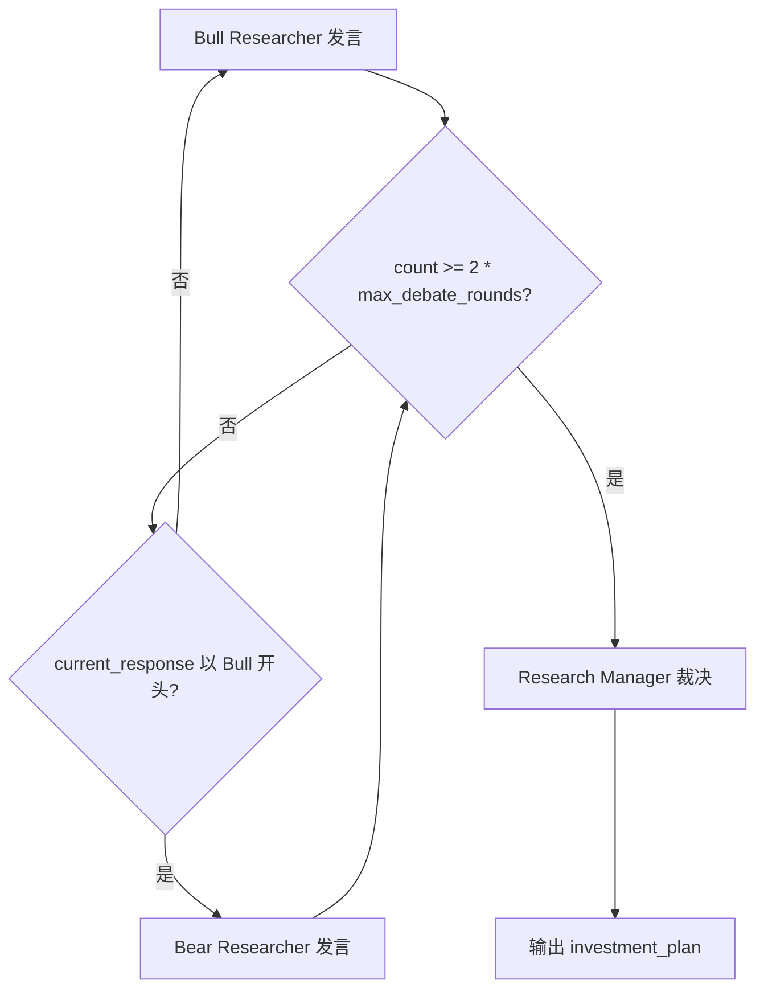
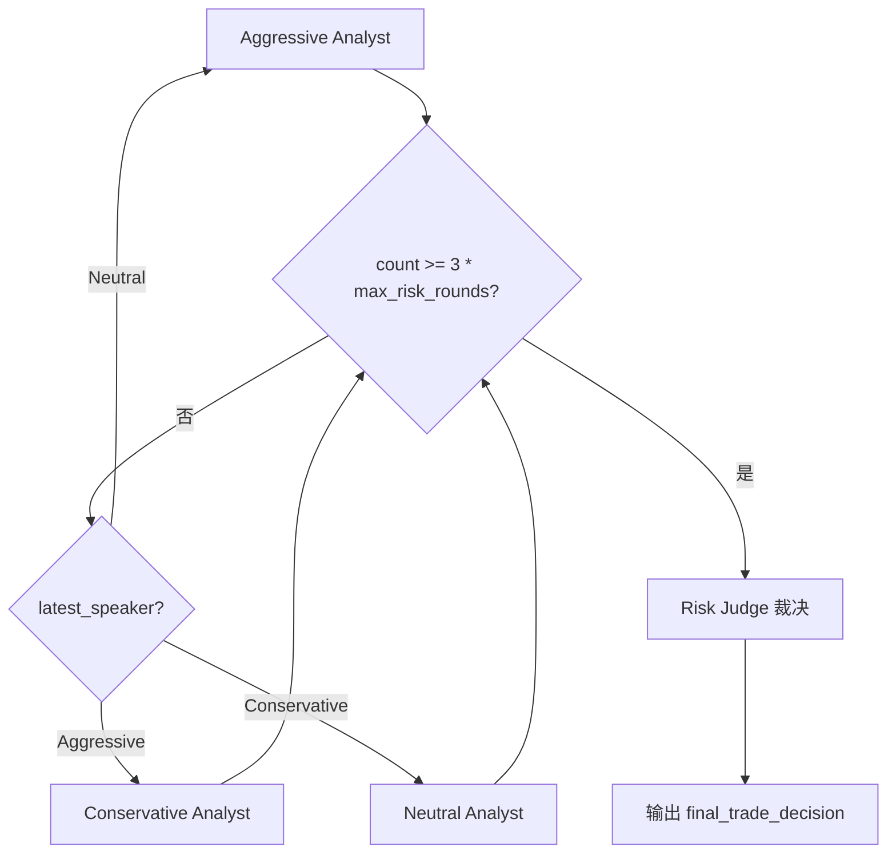

# PD-225.01 TradingAgents — 两层对抗辩论决策架构

> 文档编号：PD-225.01
> 来源：TradingAgents `tradingagents/graph/setup.py`, `tradingagents/graph/conditional_logic.py`
> GitHub：https://github.com/TauricResearch/TradingAgents.git
> 问题域：PD-225 对抗辩论决策 Adversarial Debate Decision
> 状态：可复用方案

---

## 第 1 章 问题与动机（≥ 30 行）

### 1.1 核心问题

在 LLM 驱动的决策系统中，单一 Agent 的输出容易受到 prompt 偏见、幻觉和过度自信的影响。当决策涉及高风险场景（如金融交易），单一视角的判断可能导致灾难性后果。核心挑战包括：

1. **单点偏见**：单个 LLM Agent 倾向于给出过于乐观或过于保守的建议，缺乏自我纠偏能力
2. **论证深度不足**：没有对手方质疑时，Agent 的推理往往停留在表面，缺乏对反面论据的考量
3. **风险评估维度单一**：投资决策需要同时考虑收益潜力和风险敞口，单一 Agent 难以兼顾
4. **决策可解释性差**：最终决策缺乏多方论证的支撑，难以追溯决策依据

### 1.2 TradingAgents 的解法概述

TradingAgents 设计了**两层对抗辩论**架构，将决策过程拆分为投资辩论和风险辩论两个独立阶段：

1. **投资辩论层（Bull vs Bear）**：Bull Researcher 和 Bear Researcher 围绕"是否投资"进行多轮对抗辩论，由 Research Manager 作为裁判综合裁决（`setup.py:89-97`）
2. **风险辩论层（Aggressive/Conservative/Neutral）**：三方风险分析师围绕 Trader 的投资计划进行多轮辩论，由 Risk Judge 最终裁决（`setup.py:101-106`）
3. **计数器终止控制**：通过 `count` 字段和 `max_debate_rounds` / `max_risk_discuss_rounds` 配置项精确控制辩论轮次（`conditional_logic.py:9-12`）
4. **BM25 记忆注入**：每个辩论角色在发言前检索历史相似场景的反思经验，实现跨决策学习（`bull_researcher.py:19-23`）
5. **LangGraph 条件边路由**：辩论流转通过 `should_continue_debate` 和 `should_continue_risk_analysis` 条件函数控制，基于 count 和 latest_speaker 决定下一个发言者（`conditional_logic.py:46-67`）

### 1.3 设计思想

| 设计原则 | 具体实现 | 理由 | 替代方案 |
|----------|----------|------|----------|
| 对立角色强制多样性 | Bull/Bear 二元对立 + Aggressive/Conservative/Neutral 三方博弈 | 确保每个决策都经过正反两面的充分论证 | 单 Agent 自我辩论（CoT）、随机采样多次 |
| 两层解耦 | 投资辩论（是否买）与风险辩论（怎么买）分离 | 关注点分离，投资判断和风险评估是不同维度的问题 | 单层辩论混合处理 |
| 计数器精确控制 | `count >= 2 * max_rounds`（2人）/ `count >= 3 * max_rounds`（3人） | 乘以参与人数确保每人发言相同轮次 | 基于内容收敛判断终止 |
| 裁判独立于辩手 | Research Manager 和 Risk Judge 不参与辩论，只做最终裁决 | 避免裁判立场被辩论过程污染 | 辩手之一兼任裁判 |
| 记忆驱动的论证改进 | BM25 检索历史反思注入 prompt | 辩手能从过去的错误中学习，避免重复犯错 | 无记忆的无状态辩论 |

---

## 第 2 章 源码实现分析（≥ 60 行，核心章节）

### 2.1 架构概览

TradingAgents 的完整决策流水线分为四个阶段，辩论机制覆盖后两个阶段：

```
┌─────────────────────────────────────────────────────────────────────┐
│                    TradingAgents 决策流水线                          │
├─────────────────────────────────────────────────────────────────────┤
│                                                                     │
│  阶段 1: 数据采集（并行）                                            │
│  ┌──────────┐ ┌──────────┐ ┌──────────┐ ┌──────────────┐          │
│  │ Market   │ │ Social   │ │ News     │ │ Fundamentals │          │
│  │ Analyst  │ │ Analyst  │ │ Analyst  │ │ Analyst      │          │
│  └────┬─────┘ └────┬─────┘ └────┬─────┘ └──────┬───────┘          │
│       └────────────┼────────────┼───────────────┘                  │
│                    ▼                                                │
│  阶段 2: 投资辩论（Bull vs Bear 循环）                               │
│  ┌──────────────────────────────────────────┐                      │
│  │  Bull ──→ Bear ──→ Bull ──→ Bear ──→ ... │ count 控制           │
│  └──────────────────┬───────────────────────┘                      │
│                     ▼                                               │
│  ┌──────────────────────────┐                                      │
│  │   Research Manager 裁决   │ → investment_plan                   │
│  └──────────────┬───────────┘                                      │
│                 ▼                                                   │
│  ┌──────────────────────┐                                          │
│  │      Trader 制定计划   │ → trader_investment_plan               │
│  └──────────┬───────────┘                                          │
│             ▼                                                      │
│  阶段 3: 风险辩论（三方循环）                                        │
│  ┌──────────────────────────────────────────────────────┐          │
│  │ Aggressive ──→ Conservative ──→ Neutral ──→ Agg ──→..│          │
│  └──────────────────────┬───────────────────────────────┘          │
│                         ▼                                          │
│  ┌──────────────────────────┐                                      │
│  │    Risk Judge 最终裁决    │ → final_trade_decision              │
│  └──────────────────────────┘                                      │
└─────────────────────────────────────────────────────────────────────┘
```

### 2.2 核心实现

#### 2.2.1 投资辩论层：Bull vs Bear 循环



对应源码 `tradingagents/graph/conditional_logic.py:46-55`：

```python
def should_continue_debate(self, state: AgentState) -> str:
    """Determine if debate should continue."""
    if (
        state["investment_debate_state"]["count"] >= 2 * self.max_debate_rounds
    ):  # 3 rounds of back-and-forth between 2 agents
        return "Research Manager"
    if state["investment_debate_state"]["current_response"].startswith("Bull"):
        return "Bear Researcher"
    return "Bull Researcher"
```

关键设计点：`count >= 2 * max_debate_rounds` 中的乘以 2 是因为 Bull 和 Bear 各发言一次 count 增加 2。当 `max_debate_rounds=1` 时，Bull 发言一次（count=1），Bear 发言一次（count=2），达到阈值后路由到 Research Manager。

Bull Researcher 的发言逻辑（`tradingagents/agents/researchers/bull_researcher.py:6-59`）：

```python
def create_bull_researcher(llm, memory):
    def bull_node(state) -> dict:
        investment_debate_state = state["investment_debate_state"]
        history = investment_debate_state.get("history", "")
        bull_history = investment_debate_state.get("bull_history", "")
        current_response = investment_debate_state.get("current_response", "")

        # BM25 记忆检索：从历史相似场景中获取反思经验
        curr_situation = f"{market_research_report}\n\n{sentiment_report}\n\n..."
        past_memories = memory.get_memories(curr_situation, n_matches=2)

        # 构建 prompt：角色定义 + 数据源 + 辩论历史 + 对手论点 + 历史反思
        prompt = f"""You are a Bull Analyst advocating for investing...
        Last bear argument: {current_response}
        Reflections from similar situations: {past_memory_str}"""

        response = llm.invoke(prompt)
        argument = f"Bull Analyst: {response.content}"

        # 更新辩论状态：追加历史、递增 count
        new_investment_debate_state = {
            "history": history + "\n" + argument,
            "bull_history": bull_history + "\n" + argument,
            "current_response": argument,
            "count": investment_debate_state["count"] + 1,
        }
        return {"investment_debate_state": new_investment_debate_state}
    return bull_node
```

#### 2.2.2 风险辩论层：三方循环路由



对应源码 `tradingagents/graph/conditional_logic.py:57-67`：

```python
def should_continue_risk_analysis(self, state: AgentState) -> str:
    """Determine if risk analysis should continue."""
    if (
        state["risk_debate_state"]["count"] >= 3 * self.max_risk_discuss_rounds
    ):  # 3 rounds of back-and-forth between 3 agents
        return "Risk Judge"
    if state["risk_debate_state"]["latest_speaker"].startswith("Aggressive"):
        return "Conservative Analyst"
    if state["risk_debate_state"]["latest_speaker"].startswith("Conservative"):
        return "Neutral Analyst"
    return "Aggressive Analyst"
```

三方循环的固定顺序是 Aggressive → Conservative → Neutral → Aggressive → ...，通过 `latest_speaker` 字段追踪上一个发言者，乘以 3 确保每人发言相同轮次。

### 2.3 实现细节

#### 辩论状态数据结构

两层辩论使用独立的 TypedDict 状态（`tradingagents/agents/utils/agent_states.py:11-47`）：

**InvestDebateState**（投资辩论）：
- `bull_history` / `bear_history`：各方独立历史（用于反思）
- `history`：完整辩论历史（传给裁判）
- `current_response`：最新发言（用于路由判断和对手引用）
- `judge_decision`：裁判裁决结果
- `count`：发言计数器

**RiskDebateState**（风险辩论）：
- `aggressive_history` / `conservative_history` / `neutral_history`：三方独立历史
- `latest_speaker`：最新发言者标识（用于三方循环路由）
- `current_aggressive_response` / `current_conservative_response` / `current_neutral_response`：三方最新发言（每个辩手可同时看到另外两方的最新论点）
- `count`：发言计数器

#### 裁判机制

Research Manager（`tradingagents/agents/managers/research_manager.py:5-55`）和 Risk Judge（`tradingagents/agents/managers/risk_manager.py:5-66`）共享相同的裁判模式：

1. 接收完整辩论历史 `history`
2. 通过 BM25 检索历史反思经验
3. 使用 `deep_thinking_llm`（而非辩手的 `quick_thinking_llm`）进行深度推理
4. 输出明确的 Buy/Sell/Hold 决策

这是一个重要的设计选择：裁判使用更强的模型（`setup.py:95-96` 和 `setup.py:104-105`），辩手使用更快的模型，平衡了质量与成本。

#### LangGraph 图构建

`setup.py:156-199` 中的条件边注册展示了辩论流转的完整接线：

```python
# 投资辩论：Bull 和 Bear 共享同一个条件函数
workflow.add_conditional_edges(
    "Bull Researcher",
    self.conditional_logic.should_continue_debate,
    {"Bear Researcher": "Bear Researcher", "Research Manager": "Research Manager"},
)
workflow.add_conditional_edges(
    "Bear Researcher",
    self.conditional_logic.should_continue_debate,
    {"Bull Researcher": "Bull Researcher", "Research Manager": "Research Manager"},
)

# 风险辩论：三方各自注册条件边，路由到下一个发言者或 Risk Judge
workflow.add_conditional_edges(
    "Aggressive Analyst",
    self.conditional_logic.should_continue_risk_analysis,
    {"Conservative Analyst": "Conservative Analyst", "Risk Judge": "Risk Judge"},
)
# ... Conservative → Neutral, Neutral → Aggressive 类似
```

---

## 第 3 章 迁移指南（≥ 40 行）

### 3.1 迁移清单

**阶段 1：定义辩论状态**
- [ ] 设计辩论状态 TypedDict，包含 `history`、各方独立历史、`current_response`、`count`、`judge_decision`
- [ ] 确定辩论参与方数量（2 方对立或 3 方博弈）
- [ ] 定义 `latest_speaker` 字段（3+ 方辩论时需要）

**阶段 2：实现辩手节点**
- [ ] 为每个角色创建工厂函数 `create_xxx(llm, memory?)`
- [ ] 在 prompt 中注入：角色定义 + 数据上下文 + 辩论历史 + 对手最新论点
- [ ] 每次发言后递增 `count`，更新 `history` 和角色独立历史
- [ ] （可选）集成记忆系统，注入历史反思经验

**阶段 3：实现裁判节点**
- [ ] 裁判接收完整辩论历史，不参与辩论过程
- [ ] 裁判使用更强的模型（deep_thinking_llm）
- [ ] 裁判输出明确的决策结果

**阶段 4：实现条件路由**
- [ ] 编写 `should_continue_debate` 函数：`count >= N * max_rounds` 时终止
- [ ] 2 方辩论：通过 `current_response` 前缀判断下一个发言者
- [ ] 3 方辩论：通过 `latest_speaker` 字段实现固定顺序循环
- [ ] 在 LangGraph/状态机中注册条件边

### 3.2 适配代码模板

以下是一个通用的两方对抗辩论模板，可直接复用：

```python
from typing import TypedDict, Annotated
from langgraph.graph import StateGraph, END

# Step 1: 定义辩论状态
class DebateState(TypedDict):
    pro_history: Annotated[str, "正方历史"]
    con_history: Annotated[str, "反方历史"]
    history: Annotated[str, "完整辩论历史"]
    current_response: Annotated[str, "最新发言"]
    judge_decision: Annotated[str, "裁判决策"]
    count: Annotated[int, "发言计数"]

# Step 2: 辩手工厂函数
def create_debater(llm, role: str, stance: str):
    def debater_node(state) -> dict:
        history = state["debate_state"]["history"]
        opponent_response = state["debate_state"]["current_response"]
        count = state["debate_state"]["count"]

        prompt = f"""You are the {role}, arguing {stance}.
Previous debate: {history}
Opponent's last argument: {opponent_response}
Respond with evidence-based arguments."""

        response = llm.invoke(prompt)
        argument = f"{role}: {response.content}"

        return {"debate_state": {
            "history": history + "\n" + argument,
            f"{role.lower()}_history": state["debate_state"].get(
                f"{role.lower()}_history", "") + "\n" + argument,
            "current_response": argument,
            "count": count + 1,
        }}
    return debater_node

# Step 3: 裁判工厂函数
def create_judge(llm):
    def judge_node(state) -> dict:
        history = state["debate_state"]["history"]
        prompt = f"""Evaluate this debate and make a decisive recommendation.
Debate: {history}
Provide: 1) Summary of key arguments 2) Your decision with rationale"""
        response = llm.invoke(prompt)
        return {"debate_state": {
            **state["debate_state"],
            "judge_decision": response.content,
        }}
    return judge_node

# Step 4: 条件路由
class DebateRouter:
    def __init__(self, max_rounds: int, num_participants: int = 2):
        self.max_rounds = max_rounds
        self.num_participants = num_participants

    def should_continue(self, state) -> str:
        debate = state["debate_state"]
        if debate["count"] >= self.num_participants * self.max_rounds:
            return "judge"
        # 2 方辩论：通过前缀判断
        if debate["current_response"].startswith("Pro"):
            return "con"
        return "pro"

# Step 5: 组装图
def build_debate_graph(pro_llm, con_llm, judge_llm, max_rounds=2):
    router = DebateRouter(max_rounds)
    workflow = StateGraph(dict)  # 替换为你的 AgentState

    workflow.add_node("pro", create_debater(pro_llm, "Pro", "in favor"))
    workflow.add_node("con", create_debater(con_llm, "Con", "against"))
    workflow.add_node("judge", create_judge(judge_llm))

    workflow.add_conditional_edges("pro", router.should_continue,
        {"con": "con", "judge": "judge"})
    workflow.add_conditional_edges("con", router.should_continue,
        {"pro": "pro", "judge": "judge"})
    workflow.add_edge("judge", END)

    return workflow.compile()
```

### 3.3 适用场景

| 场景 | 适用度 | 说明 |
|------|--------|------|
| 金融投资决策 | ⭐⭐⭐ | TradingAgents 的原生场景，Bull/Bear 对立天然适配 |
| 代码审查决策 | ⭐⭐⭐ | Approve vs Request Changes 两方辩论，Reviewer Lead 裁决 |
| 产品需求评审 | ⭐⭐ | 产品经理 vs 工程师 vs 设计师三方博弈，PM Lead 裁决 |
| 内容审核 | ⭐⭐ | 通过 vs 拒绝两方辩论，适合边界案例的深度审核 |
| 医疗诊断辅助 | ⭐⭐⭐ | 多科室会诊模式，不同专科医生辩论后由主治医师裁决 |
| 简单分类任务 | ⭐ | 过度设计，单 Agent 即可胜任 |

---

## 第 4 章 测试用例（≥ 20 行）

```python
import pytest
from unittest.mock import MagicMock, patch


class MockLLMResponse:
    """模拟 LLM 响应"""
    def __init__(self, content: str):
        self.content = content


class TestDebateTermination:
    """测试辩论终止条件"""

    def test_two_party_debate_terminates_after_max_rounds(self):
        """2 方辩论在 count >= 2 * max_rounds 时终止"""
        from tradingagents.graph.conditional_logic import ConditionalLogic
        logic = ConditionalLogic(max_debate_rounds=2)

        # count=4 (2人 * 2轮), 应终止
        state = {"investment_debate_state": {"count": 4, "current_response": "Bull..."}}
        assert logic.should_continue_debate(state) == "Research Manager"

    def test_two_party_debate_continues_when_under_limit(self):
        """2 方辩论在 count < 2 * max_rounds 时继续"""
        from tradingagents.graph.conditional_logic import ConditionalLogic
        logic = ConditionalLogic(max_debate_rounds=2)

        # count=2, Bull 刚说完 → 应轮到 Bear
        state = {"investment_debate_state": {"count": 2, "current_response": "Bull Analyst: ..."}}
        assert logic.should_continue_debate(state) == "Bear Researcher"

        # count=3, Bear 刚说完 → 应轮到 Bull
        state = {"investment_debate_state": {"count": 3, "current_response": "Bear Analyst: ..."}}
        assert logic.should_continue_debate(state) == "Bull Researcher"

    def test_three_party_risk_debate_rotation(self):
        """3 方风险辩论按固定顺序轮转"""
        from tradingagents.graph.conditional_logic import ConditionalLogic
        logic = ConditionalLogic(max_risk_discuss_rounds=2)

        # Aggressive 说完 → Conservative
        state = {"risk_debate_state": {"count": 1, "latest_speaker": "Aggressive"}}
        assert logic.should_continue_risk_analysis(state) == "Conservative Analyst"

        # Conservative 说完 → Neutral
        state = {"risk_debate_state": {"count": 2, "latest_speaker": "Conservative"}}
        assert logic.should_continue_risk_analysis(state) == "Neutral Analyst"

        # Neutral 说完 → Aggressive（新一轮）
        state = {"risk_debate_state": {"count": 3, "latest_speaker": "Neutral"}}
        assert logic.should_continue_risk_analysis(state) == "Aggressive Analyst"

    def test_three_party_risk_debate_terminates(self):
        """3 方辩论在 count >= 3 * max_rounds 时终止"""
        from tradingagents.graph.conditional_logic import ConditionalLogic
        logic = ConditionalLogic(max_risk_discuss_rounds=1)

        # count=3 (3人 * 1轮), 应终止
        state = {"risk_debate_state": {"count": 3, "latest_speaker": "Neutral"}}
        assert logic.should_continue_risk_analysis(state) == "Risk Judge"


class TestDebaterStateUpdate:
    """测试辩手状态更新"""

    def test_bull_researcher_increments_count(self):
        """Bull Researcher 发言后 count +1"""
        mock_llm = MagicMock()
        mock_llm.invoke.return_value = MockLLMResponse("I believe this stock will rise...")
        mock_memory = MagicMock()
        mock_memory.get_memories.return_value = []

        from tradingagents.agents.researchers.bull_researcher import create_bull_researcher
        bull_node = create_bull_researcher(mock_llm, mock_memory)

        state = {
            "investment_debate_state": {
                "history": "", "bull_history": "", "bear_history": "",
                "current_response": "", "count": 0,
            },
            "market_report": "test", "sentiment_report": "test",
            "news_report": "test", "fundamentals_report": "test",
        }
        result = bull_node(state)
        assert result["investment_debate_state"]["count"] == 1
        assert result["investment_debate_state"]["current_response"].startswith("Bull Analyst:")

    def test_aggressive_debator_tracks_latest_speaker(self):
        """Aggressive Debator 发言后 latest_speaker 更新为 Aggressive"""
        mock_llm = MagicMock()
        mock_llm.invoke.return_value = MockLLMResponse("High risk, high reward...")

        from tradingagents.agents.risk_mgmt.aggressive_debator import create_aggressive_debator
        agg_node = create_aggressive_debator(mock_llm)

        state = {
            "risk_debate_state": {
                "history": "", "aggressive_history": "", "conservative_history": "",
                "neutral_history": "", "latest_speaker": "",
                "current_aggressive_response": "", "current_conservative_response": "",
                "current_neutral_response": "", "count": 0,
            },
            "market_report": "test", "sentiment_report": "test",
            "news_report": "test", "fundamentals_report": "test",
            "trader_investment_plan": "Buy AAPL",
        }
        result = agg_node(state)
        assert result["risk_debate_state"]["latest_speaker"] == "Aggressive"
        assert result["risk_debate_state"]["count"] == 1


class TestJudgeDecision:
    """测试裁判决策"""

    def test_research_manager_outputs_judge_decision(self):
        """Research Manager 输出 judge_decision 字段"""
        mock_llm = MagicMock()
        mock_llm.invoke.return_value = MockLLMResponse("BUY - strong fundamentals")
        mock_memory = MagicMock()
        mock_memory.get_memories.return_value = []

        from tradingagents.agents.managers.research_manager import create_research_manager
        manager_node = create_research_manager(mock_llm, mock_memory)

        state = {
            "investment_debate_state": {
                "history": "Bull: buy\nBear: sell", "bull_history": "",
                "bear_history": "", "current_response": "", "count": 2,
            },
            "market_report": "test", "sentiment_report": "test",
            "news_report": "test", "fundamentals_report": "test",
        }
        result = manager_node(state)
        assert "judge_decision" in result["investment_debate_state"]
        assert result["investment_plan"] == "BUY - strong fundamentals"
```

---

## 第 5 章 跨域关联

| 关联域 | 关系类型 | 说明 |
|--------|----------|------|
| PD-02 多 Agent 编排 | 依赖 | 辩论机制本质上是一种特殊的多 Agent 编排模式，依赖 LangGraph StateGraph 的条件边路由实现辩手轮转 |
| PD-06 记忆持久化 | 协同 | Bull/Bear 辩手通过 BM25 记忆检索历史反思经验注入 prompt，辩论质量随记忆积累而提升 |
| PD-11 可观测性 | 协同 | `trading_graph.py:221-261` 的 `_log_state` 方法将完整辩论历史（bull_history/bear_history/judge_decision）持久化为 JSON，支持事后审计 |
| PD-01 上下文管理 | 依赖 | 辩论历史随轮次增长线性膨胀，每个辩手的 prompt 包含完整 history + 4 份研究报告，对上下文窗口有较高要求 |
| PD-12 推理增强 | 协同 | 裁判使用 deep_thinking_llm 进行深度推理，辩手使用 quick_thinking_llm 快速响应，双层 LLM 策略本身就是推理增强的一种实现 |
| PD-03 容错与重试 | 潜在需求 | 当前实现中辩手 LLM 调用无重试机制，若某轮发言失败会导致整个辩论链断裂 |

---

## 第 6 章 来源文件索引

| 文件 | 行范围 | 关键实现 |
|------|--------|----------|
| `tradingagents/graph/conditional_logic.py` | L6-L67 | ConditionalLogic 类：辩论终止条件 + 轮转路由 |
| `tradingagents/graph/setup.py` | L40-L202 | GraphSetup 类：LangGraph 图构建，辩论节点注册和条件边接线 |
| `tradingagents/agents/researchers/bull_researcher.py` | L6-L59 | Bull Researcher 工厂函数：看多立场 prompt + BM25 记忆注入 |
| `tradingagents/agents/researchers/bear_researcher.py` | L6-L61 | Bear Researcher 工厂函数：看空立场 prompt + BM25 记忆注入 |
| `tradingagents/agents/risk_mgmt/aggressive_debator.py` | L5-L55 | Aggressive Analyst：激进风险立场，三方辩论参与者 |
| `tradingagents/agents/risk_mgmt/conservative_debator.py` | L6-L58 | Conservative Analyst：保守风险立场，三方辩论参与者 |
| `tradingagents/agents/risk_mgmt/neutral_debator.py` | L5-L55 | Neutral Analyst：中立风险立场，三方辩论参与者 |
| `tradingagents/agents/managers/research_manager.py` | L5-L55 | Research Manager：投资辩论裁判，使用 deep_thinking_llm |
| `tradingagents/agents/managers/risk_manager.py` | L5-L66 | Risk Judge：风险辩论裁判，输出 final_trade_decision |
| `tradingagents/agents/utils/agent_states.py` | L11-L47 | InvestDebateState + RiskDebateState TypedDict 定义 |
| `tradingagents/graph/trading_graph.py` | L43-L131 | TradingAgentsGraph 主类：双 LLM 初始化 + 5 个记忆实例 |
| `tradingagents/graph/reflection.py` | L7-L121 | Reflector 类：辩论后反思，更新各角色记忆 |
| `tradingagents/default_config.py` | L19-L20 | max_debate_rounds / max_risk_discuss_rounds 默认配置 |
| `tradingagents/agents/utils/memory.py` | L12-L98 | FinancialSituationMemory：BM25 记忆检索系统 |

---

## 第 7 章 横向对比维度

```json comparison_data
{
  "project": "TradingAgents",
  "dimensions": {
    "辩论架构": "两层串行：2方投资辩论 → 3方风险辩论，各层独立裁判",
    "轮次控制": "count计数器 × 参与人数，配置化 max_rounds",
    "角色设计": "5辩手(Bull/Bear/Aggressive/Conservative/Neutral) + 2裁判",
    "裁判机制": "独立裁判不参与辩论，使用 deep_thinking_llm 深度推理",
    "记忆集成": "BM25检索历史反思经验注入辩手prompt，跨决策学习",
    "状态管理": "TypedDict双状态(InvestDebateState/RiskDebateState)独立追踪"
  }
}
```

```json domain_metadata
{
  "solution_summary": "TradingAgents 用两层串行辩论架构（2方投资辩论+3方风险辩论）配合独立裁判和BM25记忆注入实现对抗式决策",
  "description": "通过多层辩论解耦投资判断与风险评估，裁判独立于辩手确保公正性",
  "sub_problems": [
    "双层辩论的串行衔接与状态传递",
    "辩手与裁判的模型分级策略(quick vs deep)"
  ],
  "best_practices": [
    "裁判使用更强模型(deep_thinking_llm)而辩手用快速模型平衡质量与成本",
    "三方辩论用latest_speaker字段实现固定顺序循环路由"
  ]
}
```
