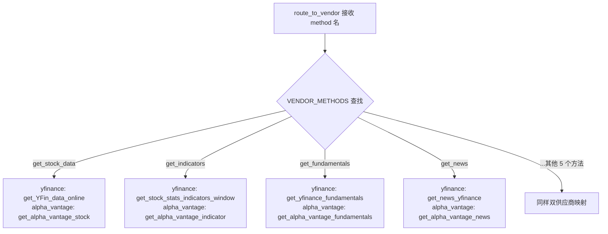
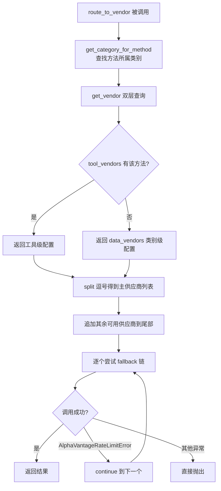

# PD-226.01 TradingAgents — 双层配置优先级数据源路由

> 文档编号：PD-226.01
> 来源：TradingAgents `tradingagents/dataflows/interface.py`
> GitHub：https://github.com/TauricResearch/TradingAgents.git
> 问题域：PD-226 数据源路由与抽象 Data Source Routing & Abstraction
> 状态：可复用方案

---

## 第 1 章 问题与动机

### 1.1 核心问题

金融数据 Agent 系统需要从多个外部数据供应商（yfinance、Alpha Vantage 等）获取行情、基本面、新闻等数据。不同供应商的 API 签名不同、限流策略不同、数据覆盖范围不同。如果每个 Agent 工具直接硬编码调用某个供应商，会导致：

1. **供应商锁定** — 切换数据源需要改动所有工具代码
2. **限流雪崩** — 单一供应商 rate limit 触发后整个系统瘫痪
3. **配置僵化** — 无法按工具粒度灵活选择最优供应商
4. **测试困难** — 工具与供应商实现紧耦合，无法 mock

TradingAgents 通过一个轻量的路由层解决了这些问题：Agent 工具只调用 `route_to_vendor("method_name", ...)`，路由层负责查配置、选供应商、构建 fallback 链。

### 1.2 TradingAgents 的解法概述

1. **VENDOR_METHODS 映射表** — 9 个数据方法 × 2 个供应商的函数指针矩阵（`interface.py:69-110`）
2. **双层配置优先级** — `tool_vendors`（工具级）> `data_vendors`（类别级），通过 `get_vendor()` 实现（`interface.py:119-132`）
3. **自动 fallback 链** — `route_to_vendor()` 将配置的主供应商排前面，其余可用供应商追加到尾部，逐个尝试（`interface.py:134-162`）
4. **仅限流触发降级** — 只有 `AlphaVantageRateLimitError` 才触发 fallback，其他异常直接抛出（`interface.py:159-160`）
5. **工具层完全解耦** — Agent 工具（如 `core_stock_tools.py`）只 import `route_to_vendor`，不感知任何供应商实现

### 1.3 设计思想

| 设计原则 | 具体实现 | 理由 | 替代方案 |
|----------|----------|------|----------|
| 间接层解耦 | `route_to_vendor()` 作为唯一调用入口 | 工具层与供应商实现零耦合 | 每个工具内部 if/else 判断供应商 |
| 配置驱动路由 | `data_vendors` + `tool_vendors` 双层 dict | 兼顾批量默认和精细覆盖 | 单层配置，无法按工具粒度控制 |
| 逗号分隔多主供应商 | `vendor_config.split(',')` 支持 `"yfinance,alpha_vantage"` | 用户可显式指定 fallback 顺序 | 只支持单供应商，fallback 隐式 |
| 选择性降级 | 只捕获 `AlphaVantageRateLimitError` | 避免数据错误被静默吞掉 | 捕获所有异常（会掩盖 bug） |
| 函数指针映射 | `VENDOR_METHODS[method][vendor]` 直接存函数引用 | O(1) 查找，无反射开销 | 字符串 → importlib 动态加载 |

---

## 第 2 章 源码实现分析

### 2.1 架构概览

TradingAgents 的数据流架构分为三层：Agent 工具层 → 路由层 → 供应商实现层。

```
┌─────────────────────────────────────────────────────────┐
│                    Agent 工具层                          │
│  core_stock_tools.py  fundamental_data_tools.py         │
│  technical_indicators_tools.py  news_data_tools.py      │
│         │              │              │                  │
│         └──────────────┼──────────────┘                  │
│                        ▼                                 │
│              route_to_vendor(method, *args)               │
└────────────────────────┬────────────────────────────────┘
                         │
┌────────────────────────▼────────────────────────────────┐
│                    路由层 (interface.py)                  │
│                                                          │
│  ┌──────────────┐  ┌──────────────┐  ┌───────────────┐  │
│  │ TOOLS_       │  │ VENDOR_      │  │ get_vendor()  │  │
│  │ CATEGORIES   │  │ METHODS      │  │ 双层配置查询   │  │
│  │ 4 类 9 工具   │  │ 9×2 函数矩阵 │  │               │  │
│  └──────┬───────┘  └──────┬───────┘  └───────┬───────┘  │
│         │                 │                   │          │
│         └─────────────────┼───────────────────┘          │
│                           ▼                              │
│              route_to_vendor() 构建 fallback 链           │
└────────────────────────┬────────────────────────────────┘
                         │
┌────────────────────────▼────────────────────────────────┐
│                  供应商实现层                             │
│                                                          │
│  ┌─────────────────┐        ┌──────────────────────┐    │
│  │   y_finance.py  │        │  alpha_vantage/       │    │
│  │  yfinance_news  │        │  alpha_vantage_stock  │    │
│  │  (yfinance SDK) │        │  alpha_vantage_common │    │
│  └─────────────────┘        │  (REST API + CSV)     │    │
│                              └──────────────────────┘    │
└──────────────────────────────────────────────────────────┘
```

### 2.2 核心实现

#### 2.2.1 VENDOR_METHODS 映射表



对应源码 `tradingagents/dataflows/interface.py:69-110`：

```python
VENDOR_METHODS = {
    "get_stock_data": {
        "alpha_vantage": get_alpha_vantage_stock,
        "yfinance": get_YFin_data_online,
    },
    "get_indicators": {
        "alpha_vantage": get_alpha_vantage_indicator,
        "yfinance": get_stock_stats_indicators_window,
    },
    "get_fundamentals": {
        "alpha_vantage": get_alpha_vantage_fundamentals,
        "yfinance": get_yfinance_fundamentals,
    },
    "get_balance_sheet": {
        "alpha_vantage": get_alpha_vantage_balance_sheet,
        "yfinance": get_yfinance_balance_sheet,
    },
    # ... 共 9 个方法，每个方法 2 个供应商实现
}
```

关键设计：映射表存储的是**函数引用**而非字符串，模块加载时即完成绑定，运行时零反射开销。

#### 2.2.2 双层配置优先级与 fallback 链构建



对应源码 `tradingagents/dataflows/interface.py:119-162`：

```python
def get_vendor(category: str, method: str = None) -> str:
    """Tool-level > category-level 配置优先级"""
    config = get_config()
    # 工具级优先
    if method:
        tool_vendors = config.get("tool_vendors", {})
        if method in tool_vendors:
            return tool_vendors[method]
    # 类别级兜底
    return config.get("data_vendors", {}).get(category, "default")

def route_to_vendor(method: str, *args, **kwargs):
    """路由 + fallback 链"""
    category = get_category_for_method(method)
    vendor_config = get_vendor(category, method)
    primary_vendors = [v.strip() for v in vendor_config.split(',')]

    # 构建 fallback 链：主供应商在前，其余追加
    all_available_vendors = list(VENDOR_METHODS[method].keys())
    fallback_vendors = primary_vendors.copy()
    for vendor in all_available_vendors:
        if vendor not in fallback_vendors:
            fallback_vendors.append(vendor)

    for vendor in fallback_vendors:
        if vendor not in VENDOR_METHODS[method]:
            continue
        vendor_impl = VENDOR_METHODS[method][vendor]
        impl_func = vendor_impl[0] if isinstance(vendor_impl, list) else vendor_impl
        try:
            return impl_func(*args, **kwargs)
        except AlphaVantageRateLimitError:
            continue  # 仅限流触发 fallback
    raise RuntimeError(f"No available vendor for '{method}'")
```

### 2.3 实现细节

**配置模块的全局单例模式** (`tradingagents/dataflows/config.py:1-31`)：

配置通过模块级 `_config` 变量实现单例，`get_config()` 返回 `.copy()` 防止外部修改污染全局状态。`set_config()` 使用 `dict.update()` 实现增量覆盖，用户只需传入想修改的字段。

**默认配置** (`tradingagents/default_config.py:24-33`)：

```python
"data_vendors": {
    "core_stock_apis": "yfinance",
    "technical_indicators": "yfinance",
    "fundamental_data": "yfinance",
    "news_data": "yfinance",
},
"tool_vendors": {
    # 空 dict，用户按需覆盖
},
```

默认全部使用 yfinance（免费、无需 API key），Alpha Vantage 作为付费备选。

**Agent 工具层的消费方式** (`tradingagents/agents/utils/core_stock_tools.py:1-22`)：

```python
from tradingagents.dataflows.interface import route_to_vendor

@tool
def get_stock_data(symbol, start_date, end_date) -> str:
    return route_to_vendor("get_stock_data", symbol, start_date, end_date)
```

工具层只有一行调用，完全不感知供应商存在。4 个工具模块（core_stock、fundamental_data、technical_indicators、news_data）共 9 个 `@tool` 函数，全部通过 `route_to_vendor` 路由。

**Alpha Vantage 限流检测** (`tradingagents/dataflows/alpha_vantage_common.py:38-83`)：

```python
class AlphaVantageRateLimitError(Exception):
    pass

def _make_api_request(function_name: str, params: dict) -> dict | str:
    response = requests.get(API_BASE_URL, params=api_params)
    response.raise_for_status()
    try:
        response_json = json.loads(response.text)
        if "Information" in response_json:
            info_message = response_json["Information"]
            if "rate limit" in info_message.lower() or "api key" in info_message.lower():
                raise AlphaVantageRateLimitError(...)
    except json.JSONDecodeError:
        pass  # CSV 响应是正常的
    return response.text
```

Alpha Vantage 的限流信号藏在 JSON 响应的 `Information` 字段中（而非 HTTP 429），需要解析响应体才能检测。

**本地数据缓存** (`tradingagents/dataflows/y_finance.py:187-267`)：

`_get_stock_stats_bulk()` 实现了文件级缓存：首次请求时下载 15 年历史数据并存为 CSV，后续请求直接读取本地文件。缓存路径由 `config["data_cache_dir"]` 控制。


---

## 第 3 章 迁移指南

### 3.1 迁移清单

**阶段 1：定义供应商接口**
- [ ] 确定你的数据方法列表（如 `get_price`、`get_news` 等）
- [ ] 为每个方法定义统一的函数签名（参数名、类型、返回值）
- [ ] 确保不同供应商的实现函数遵循相同签名

**阶段 2：构建路由层**
- [ ] 创建 `VENDOR_METHODS` 映射表，注册所有供应商实现
- [ ] 创建 `TOOLS_CATEGORIES` 分类表，将方法归入逻辑类别
- [ ] 实现 `get_vendor()` 双层配置查询
- [ ] 实现 `route_to_vendor()` 路由 + fallback 逻辑

**阶段 3：定义错误类型**
- [ ] 为每个供应商定义可降级的异常类型（如 `RateLimitError`）
- [ ] 在 `route_to_vendor` 的 except 子句中只捕获这些异常

**阶段 4：迁移工具层**
- [ ] 将所有工具函数改为调用 `route_to_vendor("method_name", ...)`
- [ ] 删除工具层对供应商模块的直接 import

### 3.2 适配代码模板

以下模板可直接复用，支持任意数量的供应商和方法：

```python
"""data_router.py — 通用数据源路由层"""
from typing import Callable, Dict, Any, Optional

class VendorRateLimitError(Exception):
    """所有供应商限流异常的基类"""
    pass

# 供应商方法注册表：method_name -> {vendor_name: callable}
VENDOR_METHODS: Dict[str, Dict[str, Callable]] = {}

# 方法分类表：category -> [method_names]
METHOD_CATEGORIES: Dict[str, list] = {}

# 配置：category-level 和 tool-level
_config = {
    "category_vendors": {},   # {"stock_data": "vendor_a"}
    "tool_vendors": {},       # {"get_price": "vendor_b"}  优先级更高
}

def register_vendor(method: str, vendor: str, func: Callable, category: str = "default"):
    """注册供应商实现"""
    if method not in VENDOR_METHODS:
        VENDOR_METHODS[method] = {}
    VENDOR_METHODS[method][vendor] = func
    METHOD_CATEGORIES.setdefault(category, [])
    if method not in METHOD_CATEGORIES[category]:
        METHOD_CATEGORIES[category].append(method)

def set_config(category_vendors: Optional[Dict] = None, tool_vendors: Optional[Dict] = None):
    """更新路由配置"""
    if category_vendors:
        _config["category_vendors"].update(category_vendors)
    if tool_vendors:
        _config["tool_vendors"].update(tool_vendors)

def _get_category(method: str) -> str:
    for cat, methods in METHOD_CATEGORIES.items():
        if method in methods:
            return cat
    return "default"

def _get_vendor_preference(method: str) -> list:
    """双层优先级：tool_vendors > category_vendors"""
    # 工具级
    if method in _config["tool_vendors"]:
        raw = _config["tool_vendors"][method]
        return [v.strip() for v in raw.split(",")]
    # 类别级
    category = _get_category(method)
    if category in _config["category_vendors"]:
        raw = _config["category_vendors"][category]
        return [v.strip() for v in raw.split(",")]
    return []

def route(method: str, *args, **kwargs) -> Any:
    """路由调用到供应商实现，自动 fallback"""
    if method not in VENDOR_METHODS:
        raise ValueError(f"Unknown method: {method}")

    preferred = _get_vendor_preference(method)
    all_vendors = list(VENDOR_METHODS[method].keys())

    # 构建 fallback 链：preferred 在前，其余追加
    chain = preferred.copy()
    for v in all_vendors:
        if v not in chain:
            chain.append(v)

    for vendor in chain:
        if vendor not in VENDOR_METHODS[method]:
            continue
        try:
            return VENDOR_METHODS[method][vendor](*args, **kwargs)
        except VendorRateLimitError:
            continue  # 仅限流触发降级

    raise RuntimeError(f"All vendors exhausted for '{method}'")
```

使用示例：

```python
# 注册供应商
from data_router import register_vendor, route, set_config

register_vendor("get_price", "vendor_a", vendor_a_get_price, category="stock")
register_vendor("get_price", "vendor_b", vendor_b_get_price, category="stock")

# 配置优先级
set_config(category_vendors={"stock": "vendor_a"})

# Agent 工具调用
result = route("get_price", "AAPL", "2024-01-01", "2024-12-31")
```

### 3.3 适用场景

| 场景 | 适用度 | 说明 |
|------|--------|------|
| 多数据供应商的金融 Agent | ⭐⭐⭐ | 完美匹配，直接复用 |
| 多 LLM Provider 路由 | ⭐⭐⭐ | 同样的映射表 + fallback 模式 |
| 多搜索引擎聚合 | ⭐⭐ | 适用，但可能需要结果合并而非 fallback |
| 单一数据源系统 | ⭐ | 过度设计，直接调用即可 |
| 需要结果融合的场景 | ⭐ | 本方案是 fallback 模式，不支持多源融合 |

---

## 第 4 章 测试用例

```python
import pytest
from unittest.mock import patch, MagicMock

class TestGetVendor:
    """测试双层配置优先级"""

    def test_tool_level_overrides_category(self):
        """工具级配置优先于类别级"""
        mock_config = {
            "data_vendors": {"fundamental_data": "yfinance"},
            "tool_vendors": {"get_fundamentals": "alpha_vantage"},
        }
        with patch("tradingagents.dataflows.interface.get_config", return_value=mock_config):
            from tradingagents.dataflows.interface import get_vendor
            result = get_vendor("fundamental_data", "get_fundamentals")
            assert result == "alpha_vantage"

    def test_category_level_fallback(self):
        """无工具级配置时使用类别级"""
        mock_config = {
            "data_vendors": {"core_stock_apis": "yfinance"},
            "tool_vendors": {},
        }
        with patch("tradingagents.dataflows.interface.get_config", return_value=mock_config):
            from tradingagents.dataflows.interface import get_vendor
            result = get_vendor("core_stock_apis", "get_stock_data")
            assert result == "yfinance"

    def test_comma_separated_vendors(self):
        """逗号分隔的多供应商配置"""
        mock_config = {
            "data_vendors": {"news_data": "alpha_vantage,yfinance"},
            "tool_vendors": {},
        }
        with patch("tradingagents.dataflows.interface.get_config", return_value=mock_config):
            from tradingagents.dataflows.interface import get_vendor
            result = get_vendor("news_data")
            assert result == "alpha_vantage,yfinance"


class TestRouteToVendor:
    """测试路由与 fallback"""

    def test_primary_vendor_success(self):
        """主供应商成功时直接返回"""
        mock_func = MagicMock(return_value="price_data")
        with patch.dict("tradingagents.dataflows.interface.VENDOR_METHODS",
                        {"get_stock_data": {"yfinance": mock_func}}):
            with patch("tradingagents.dataflows.interface.get_vendor", return_value="yfinance"):
                from tradingagents.dataflows.interface import route_to_vendor
                result = route_to_vendor("get_stock_data", "AAPL", "2024-01-01", "2024-12-31")
                assert result == "price_data"
                mock_func.assert_called_once()

    def test_rate_limit_triggers_fallback(self):
        """限流异常触发 fallback 到备选供应商"""
        from tradingagents.dataflows.alpha_vantage_common import AlphaVantageRateLimitError
        primary = MagicMock(side_effect=AlphaVantageRateLimitError("rate limit"))
        fallback = MagicMock(return_value="fallback_data")
        with patch.dict("tradingagents.dataflows.interface.VENDOR_METHODS",
                        {"get_stock_data": {"alpha_vantage": primary, "yfinance": fallback}}):
            with patch("tradingagents.dataflows.interface.get_vendor", return_value="alpha_vantage"):
                from tradingagents.dataflows.interface import route_to_vendor
                result = route_to_vendor("get_stock_data", "AAPL", "2024-01-01", "2024-12-31")
                assert result == "fallback_data"

    def test_non_rate_limit_error_propagates(self):
        """非限流异常不触发 fallback，直接抛出"""
        primary = MagicMock(side_effect=ValueError("bad symbol"))
        with patch.dict("tradingagents.dataflows.interface.VENDOR_METHODS",
                        {"get_stock_data": {"yfinance": primary, "alpha_vantage": MagicMock()}}):
            with patch("tradingagents.dataflows.interface.get_vendor", return_value="yfinance"):
                from tradingagents.dataflows.interface import route_to_vendor
                with pytest.raises(ValueError, match="bad symbol"):
                    route_to_vendor("get_stock_data", "INVALID", "2024-01-01", "2024-12-31")

    def test_all_vendors_exhausted(self):
        """所有供应商都限流时抛出 RuntimeError"""
        from tradingagents.dataflows.alpha_vantage_common import AlphaVantageRateLimitError
        v1 = MagicMock(side_effect=AlphaVantageRateLimitError("limit"))
        v2 = MagicMock(side_effect=AlphaVantageRateLimitError("limit"))
        with patch.dict("tradingagents.dataflows.interface.VENDOR_METHODS",
                        {"get_stock_data": {"yfinance": v1, "alpha_vantage": v2}}):
            with patch("tradingagents.dataflows.interface.get_vendor", return_value="yfinance"):
                from tradingagents.dataflows.interface import route_to_vendor
                with pytest.raises(RuntimeError, match="No available vendor"):
                    route_to_vendor("get_stock_data", "AAPL", "2024-01-01", "2024-12-31")
```


---

## 第 5 章 跨域关联

| 关联域 | 关系类型 | 说明 |
|--------|----------|------|
| PD-03 容错与重试 | 协同 | `route_to_vendor` 的 fallback 链本质是容错机制，仅限流触发降级是 PD-03 "选择性重试"原则的体现 |
| PD-04 工具系统 | 依赖 | Agent 工具层（`@tool` 装饰器）通过 `route_to_vendor` 间接调用供应商，路由层是工具系统的数据基础设施 |
| PD-11 可观测性 | 协同 | 当前实现缺少路由决策日志，建议在 `route_to_vendor` 中记录选择了哪个供应商、是否触发了 fallback |
| PD-01 上下文管理 | 间接 | 数据缓存（`data_cache_dir`）减少重复 API 调用，间接降低了 Agent 等待数据的上下文占用 |

---

## 第 6 章 来源文件索引

| 文件 | 行范围 | 关键实现 |
|------|--------|----------|
| `tradingagents/dataflows/interface.py` | L31-61 | TOOLS_CATEGORIES 分类定义（4 类 9 工具） |
| `tradingagents/dataflows/interface.py` | L63-110 | VENDOR_METHODS 映射表（9 方法 × 2 供应商） |
| `tradingagents/dataflows/interface.py` | L112-117 | get_category_for_method() 方法→类别查找 |
| `tradingagents/dataflows/interface.py` | L119-132 | get_vendor() 双层配置优先级 |
| `tradingagents/dataflows/interface.py` | L134-162 | route_to_vendor() 路由 + fallback 链 |
| `tradingagents/dataflows/config.py` | L1-31 | 全局配置单例（get_config/set_config） |
| `tradingagents/default_config.py` | L24-33 | 默认 data_vendors + tool_vendors 配置 |
| `tradingagents/dataflows/alpha_vantage_common.py` | L38-83 | AlphaVantageRateLimitError + API 请求封装 |
| `tradingagents/dataflows/y_finance.py` | L187-267 | _get_stock_stats_bulk() 文件级缓存 |
| `tradingagents/agents/utils/core_stock_tools.py` | L1-22 | Agent 工具层消费示例 |
| `tradingagents/agents/utils/fundamental_data_tools.py` | L1-77 | 4 个基本面工具全部通过 route_to_vendor |

---

## 第 7 章 横向对比维度

```json comparison_data
{
  "project": "TradingAgents",
  "dimensions": {
    "路由架构": "VENDOR_METHODS 函数指针矩阵 + route_to_vendor 单入口路由",
    "配置粒度": "双层优先级：tool_vendors(工具级) > data_vendors(类别级)",
    "降级策略": "仅 AlphaVantageRateLimitError 触发 fallback，其他异常直接抛出",
    "供应商扩展": "在 VENDOR_METHODS 中添加新 vendor 键值对即可，无需改路由逻辑",
    "缓存机制": "yfinance 侧 CSV 文件缓存 15 年历史数据，Alpha Vantage 侧无缓存"
  }
}
```

### 域元数据补充

```json domain_metadata
{
  "solution_summary": "TradingAgents 用 VENDOR_METHODS 函数指针矩阵 + get_vendor 双层配置优先级实现 9 个数据方法在 yfinance/Alpha Vantage 间的透明路由与限流降级",
  "description": "数据源路由需要平衡配置灵活性与降级安全性，避免静默吞掉非限流异常",
  "sub_problems": [
    "供应商 API 响应格式差异的统一适配（CSV vs JSON）",
    "限流信号检测（HTTP 429 vs 响应体内嵌错误信息）"
  ],
  "best_practices": [
    "函数指针矩阵替代字符串反射，模块加载时绑定实现",
    "逗号分隔配置值支持用户显式指定 fallback 顺序",
    "config.get_config() 返回 copy 防止外部修改污染全局状态"
  ]
}
```

