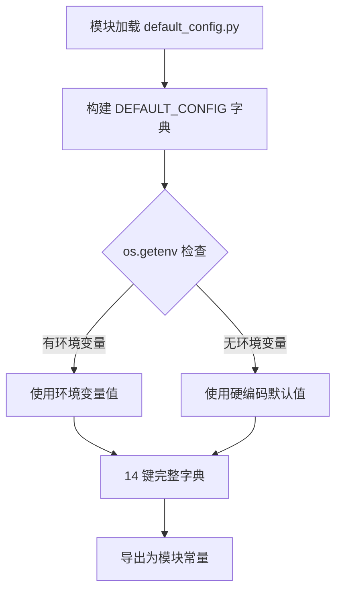
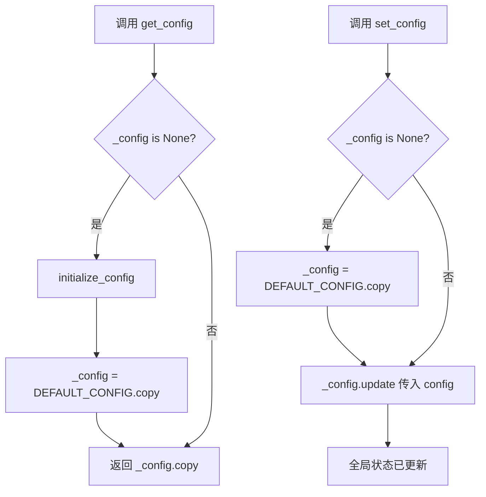
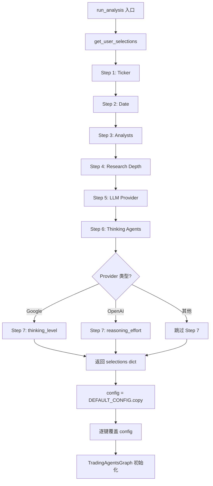

# PD-227.01 TradingAgents — 三层配置字典与全局单例管理

> 文档编号：PD-227.01
> 来源：TradingAgents `tradingagents/default_config.py` `tradingagents/dataflows/config.py` `cli/main.py`
> GitHub：https://github.com/TauricResearch/TradingAgents.git
> 问题域：PD-227 配置管理 Configuration Management
> 状态：可复用方案

---

## 第 1 章 问题与动机

### 1.1 核心问题

多 Agent 金融交易系统需要管理大量配置项：LLM 提供商与模型选择、辩论轮次、数据供应商路由、缓存目录、API 端点等。这些配置需要满足三个矛盾需求：

1. **开箱即用**：新用户 clone 后不改任何配置就能跑通
2. **灵活覆盖**：高级用户可以通过 CLI 交互、脚本参数、环境变量三种方式定制
3. **全局一致**：配置一旦确定，散布在 Analyst、Dataflow、Graph 等十几个模块中的代码都能读到同一份配置

传统做法（如 YAML 文件 + argparse）在 Agent 系统中面临特殊挑战：配置不仅控制应用行为，还控制 LLM 推理参数（thinking_level、reasoning_effort）和数据供应商路由（yfinance vs alpha_vantage），这些配置需要在运行时动态传播到深层模块。

### 1.2 TradingAgents 的解法概述

TradingAgents 采用"三层配置"架构，用纯 Python 字典实现零依赖配置管理：

1. **DEFAULT_CONFIG 字典**（`tradingagents/default_config.py:3-34`）— 不可变默认值层，包含全部 14 个配置键
2. **全局单例 get_config/set_config**（`tradingagents/dataflows/config.py:1-31`）— 模块级全局变量 `_config`，惰性初始化 + copy-on-read 防篡改
3. **CLI 交互式覆盖**（`cli/main.py:901-913`）— 7 步问答收集用户选择，copy DEFAULT_CONFIG 后逐键覆盖
4. **环境变量注入**（`.env.example` + `load_dotenv()`）— API Key 等敏感信息通过 .env 文件加载到 `os.environ`
5. **双层数据供应商路由**（`tradingagents/dataflows/interface.py:119-132`）— tool_vendors 优先于 data_vendors 的两级配置查找

### 1.3 设计思想

| 设计原则 | 具体实现 | 理由 | 替代方案 |
|----------|----------|------|----------|
| 零依赖配置 | 纯 Python dict，不用 Pydantic/YAML/TOML | Agent 系统依赖已够多，配置层不应再引入序列化库 | Pydantic Settings、Dynaconf |
| Copy-on-read | `get_config()` 返回 `_config.copy()`（`config.py:27`） | 防止下游模块意外修改全局配置 | 深拷贝（性能开销大）、冻结字典 |
| 惰性初始化 | `_config` 初始为 None，首次 get 时才 copy DEFAULT_CONFIG | 允许在 import 阶段不触发配置加载 | 模块加载时立即初始化 |
| 关注点分离 | API Key 走 .env，业务配置走 DEFAULT_CONFIG，CLI 走交互问答 | 敏感信息不进代码，业务默认值有明确来源 | 全部放 .env、全部放 YAML |
| 两级供应商路由 | tool_vendors > data_vendors 优先级 | 允许细粒度覆盖单个工具的数据源，同时保持分类级默认值 | 扁平化配置、每个工具独立配置 |

---

## 第 2 章 源码实现分析

### 2.1 架构概览

TradingAgents 的配置流从入口到消费端形成清晰的单向数据流：

```
┌──────────────────┐     ┌───────────────────┐     ┌──────────────────┐
│   .env 文件       │     │  DEFAULT_CONFIG    │     │  CLI 交互问答     │
│  (API Keys)      │     │  (业务默认值)       │     │  (用户选择)       │
└────────┬─────────┘     └────────┬──────────┘     └────────┬─────────┘
         │ load_dotenv()          │ .copy()                  │ 逐键覆盖
         ▼                        ▼                          ▼
┌─────────────────────────────────────────────────────────────────────┐
│                    config = DEFAULT_CONFIG.copy()                    │
│                    config["key"] = user_selection                    │
└────────────────────────────┬────────────────────────────────────────┘
                             │ TradingAgentsGraph(config=config)
                             ▼
┌─────────────────────────────────────────────────────────────────────┐
│              set_config(self.config)  →  全局 _config               │
│              trading_graph.py:66                                     │
└────────────────────────────┬────────────────────────────────────────┘
                             │ get_config()
              ┌──────────────┼──────────────┐
              ▼              ▼              ▼
        ┌──────────┐  ┌──────────┐  ┌──────────────┐
        │ Analysts │  │Dataflows │  │  interface.py │
        │get_config│  │get_config│  │ get_vendor()  │
        └──────────┘  └──────────┘  └──────────────┘
```

### 2.2 核心实现

#### 2.2.1 DEFAULT_CONFIG — 不可变默认值层



对应源码 `tradingagents/default_config.py:1-34`：

```python
import os

DEFAULT_CONFIG = {
    "project_dir": os.path.abspath(os.path.join(os.path.dirname(__file__), ".")),
    "results_dir": os.getenv("TRADINGAGENTS_RESULTS_DIR", "./results"),
    "data_cache_dir": os.path.join(
        os.path.abspath(os.path.join(os.path.dirname(__file__), ".")),
        "dataflows/data_cache",
    ),
    # LLM settings
    "llm_provider": "openai",
    "deep_think_llm": "gpt-5.2",
    "quick_think_llm": "gpt-5-mini",
    "backend_url": "https://api.openai.com/v1",
    # Provider-specific thinking configuration
    "google_thinking_level": None,
    "openai_reasoning_effort": None,
    # Debate and discussion settings
    "max_debate_rounds": 1,
    "max_risk_discuss_rounds": 1,
    "max_recur_limit": 100,
    # Data vendor configuration
    "data_vendors": {
        "core_stock_apis": "yfinance",
        "technical_indicators": "yfinance",
        "fundamental_data": "yfinance",
        "news_data": "yfinance",
    },
    "tool_vendors": {},
}
```

关键设计点：
- `results_dir` 使用 `os.getenv()` 支持环境变量覆盖（`default_config.py:5`），其他键使用硬编码默认值
- `data_vendors` 是嵌套字典，按数据类别分组（4 个类别），`tool_vendors` 为空字典预留工具级覆盖
- 所有路径使用 `os.path.abspath` 确保绝对路径（`default_config.py:4`）

#### 2.2.2 全局单例 — get_config/set_config



对应源码 `tradingagents/dataflows/config.py:1-31`：

```python
import tradingagents.default_config as default_config
from typing import Dict, Optional

_config: Optional[Dict] = None

def initialize_config():
    """Initialize the configuration with default values."""
    global _config
    if _config is None:
        _config = default_config.DEFAULT_CONFIG.copy()

def set_config(config: Dict):
    """Update the configuration with custom values."""
    global _config
    if _config is None:
        _config = default_config.DEFAULT_CONFIG.copy()
    _config.update(config)

def get_config() -> Dict:
    """Get the current configuration."""
    if _config is None:
        initialize_config()
    return _config.copy()

# Initialize with default config
initialize_config()
```

关键设计点：
- **惰性 + 急切双保险**：模块末尾调用 `initialize_config()`（`config.py:31`）确保 import 后即可用，`get_config()` 内部再检查一次防止 `_config` 被意外置 None
- **copy-on-read**：`get_config()` 返回 `_config.copy()`（`config.py:27`），防止调用方修改全局状态
- **set_config 是 update 语义**：`_config.update(config)`（`config.py:20`）只覆盖传入的键，未传入的键保留默认值

#### 2.2.3 CLI 交互式配置收集



对应源码 `cli/main.py:899-928`：

```python
def run_analysis():
    # First get all user selections
    selections = get_user_selections()

    # Create config with selected research depth
    config = DEFAULT_CONFIG.copy()
    config["max_debate_rounds"] = selections["research_depth"]
    config["max_risk_discuss_rounds"] = selections["research_depth"]
    config["quick_think_llm"] = selections["shallow_thinker"]
    config["deep_think_llm"] = selections["deep_thinker"]
    config["backend_url"] = selections["backend_url"]
    config["llm_provider"] = selections["llm_provider"].lower()
    config["google_thinking_level"] = selections.get("google_thinking_level")
    config["openai_reasoning_effort"] = selections.get("openai_reasoning_effort")

    # ...
    graph = TradingAgentsGraph(
        selected_analyst_keys,
        config=config,
        debug=True,
        callbacks=[stats_handler],
    )
```

CLI 使用 questionary 库提供交互式选择（`cli/utils.py:67-328`），每个 Provider 预定义了可选模型列表（如 OpenAI 6 个、Anthropic 5 个、Google 3 个），用户通过箭头键选择而非手动输入模型名。

### 2.3 实现细节

#### 配置传播的关键桥接点

`TradingAgentsGraph.__init__` 中的 `set_config(self.config)`（`trading_graph.py:66`）是整个配置系统的关键桥接点。它将入口层构建的 config 字典注入到 dataflows 模块的全局状态中，使得所有通过 `get_config()` 读取配置的下游模块（Analyst、Dataflow、Interface）都能获得一致的配置。

#### 双层数据供应商路由

`interface.py:119-132` 实现了 tool_vendors > data_vendors 的两级查找：

```python
def get_vendor(category: str, method: str = None) -> str:
    config = get_config()
    # Check tool-level configuration first
    if method:
        tool_vendors = config.get("tool_vendors", {})
        if method in tool_vendors:
            return tool_vendors[method]
    # Fall back to category-level configuration
    return config.get("data_vendors", {}).get(category, "default")
```

`route_to_vendor`（`interface.py:134-161`）进一步构建 fallback 链：主供应商失败时自动尝试备选供应商，但只有 `AlphaVantageRateLimitError` 才触发降级，其他异常直接抛出。

#### LLM 客户端工厂的配置消费

`llm_clients/factory.py:9-43` 的 `create_llm_client` 根据 `config["llm_provider"]` 路由到不同客户端实现（OpenAI/Anthropic/Google），同时将 xAI、Ollama、OpenRouter 统一映射到 OpenAI 兼容客户端。Provider 特定参数（thinking_level、reasoning_effort）通过 `_get_provider_kwargs()`（`trading_graph.py:133-148`）从 config 中提取并传递。

---

## 第 3 章 迁移指南

### 3.1 迁移清单

**阶段 1：基础配置层（1 个文件）**
- [ ] 创建 `config/defaults.py`，定义 `DEFAULT_CONFIG` 字典，包含所有配置键和默认值
- [ ] 对需要环境变量覆盖的键使用 `os.getenv("KEY", default)`

**阶段 2：全局单例（1 个文件）**
- [ ] 创建 `config/manager.py`，实现 `_config` 全局变量 + `get_config()`/`set_config()` 三件套
- [ ] `get_config()` 必须返回 `.copy()` 防止外部篡改
- [ ] 模块末尾调用 `initialize_config()` 确保 import 即可用

**阶段 3：入口层集成**
- [ ] 在应用入口（main.py / CLI）中 `DEFAULT_CONFIG.copy()` → 覆盖 → 传入核心类
- [ ] 核心类构造函数中调用 `set_config()` 完成全局传播
- [ ] 添加 `load_dotenv()` 支持 .env 文件

**阶段 4：下游消费**
- [ ] 所有需要配置的模块统一通过 `from config.manager import get_config` 获取
- [ ] 不要在模块中直接 import DEFAULT_CONFIG（除了入口层）

### 3.2 适配代码模板

#### 最小可运行配置系统（3 个文件）

**config/defaults.py**：

```python
import os

DEFAULT_CONFIG = {
    # 基础路径
    "project_dir": os.path.abspath(os.path.dirname(__file__)),
    "output_dir": os.getenv("APP_OUTPUT_DIR", "./output"),

    # LLM 设置
    "llm_provider": "openai",
    "model": "gpt-4o",
    "api_base_url": "https://api.openai.com/v1",

    # 业务参数
    "max_retries": 3,
    "timeout": 30,

    # 嵌套配置（支持分类级 + 工具级两层覆盖）
    "providers": {
        "search": "google",
        "embedding": "openai",
    },
    "tool_overrides": {},
}
```

**config/manager.py**：

```python
from typing import Dict, Optional
from .defaults import DEFAULT_CONFIG

_config: Optional[Dict] = None

def initialize_config():
    global _config
    if _config is None:
        _config = DEFAULT_CONFIG.copy()

def set_config(config: Dict):
    global _config
    if _config is None:
        _config = DEFAULT_CONFIG.copy()
    _config.update(config)

def get_config() -> Dict:
    if _config is None:
        initialize_config()
    return _config.copy()

def get_provider(category: str, tool: str = None) -> str:
    """两级供应商路由：tool_overrides > providers"""
    config = get_config()
    if tool:
        overrides = config.get("tool_overrides", {})
        if tool in overrides:
            return overrides[tool]
    return config.get("providers", {}).get(category, "default")

initialize_config()
```

**入口集成示例**：

```python
from dotenv import load_dotenv
from config.defaults import DEFAULT_CONFIG
from config.manager import set_config

load_dotenv()

# Copy + Override 模式
config = DEFAULT_CONFIG.copy()
config["llm_provider"] = "anthropic"
config["model"] = "claude-sonnet-4-20250514"
config["max_retries"] = 5

# 传入核心类，核心类构造函数中调用 set_config(config)
app = MyAgentApp(config=config)
```

### 3.3 适用场景

| 场景 | 适用度 | 说明 |
|------|--------|------|
| 多 Agent 系统配置 | ⭐⭐⭐ | 全局单例确保所有 Agent 读到一致配置 |
| CLI 工具配置 | ⭐⭐⭐ | 交互式问答 + DEFAULT_CONFIG 覆盖模式天然适合 |
| 多供应商路由 | ⭐⭐⭐ | 两级配置查找（tool > category）灵活且不过度设计 |
| 微服务配置 | ⭐⭐ | 全局单例在多进程场景下需要额外同步机制 |
| 需要配置校验的场景 | ⭐ | 纯字典无类型校验，需自行添加或改用 Pydantic |
| 需要热重载的场景 | ⭐ | set_config 可实现但无文件监听机制 |

---

## 第 4 章 测试用例

```python
import pytest
import os
from unittest.mock import patch


class TestDefaultConfig:
    """测试 DEFAULT_CONFIG 字典的完整性和默认值"""

    def test_all_required_keys_present(self):
        from tradingagents.default_config import DEFAULT_CONFIG
        required_keys = [
            "project_dir", "results_dir", "data_cache_dir",
            "llm_provider", "deep_think_llm", "quick_think_llm",
            "backend_url", "max_debate_rounds", "max_risk_discuss_rounds",
            "max_recur_limit", "data_vendors", "tool_vendors",
        ]
        for key in required_keys:
            assert key in DEFAULT_CONFIG, f"Missing key: {key}"

    def test_default_llm_provider_is_openai(self):
        from tradingagents.default_config import DEFAULT_CONFIG
        assert DEFAULT_CONFIG["llm_provider"] == "openai"

    def test_data_vendors_has_four_categories(self):
        from tradingagents.default_config import DEFAULT_CONFIG
        vendors = DEFAULT_CONFIG["data_vendors"]
        assert len(vendors) == 4
        assert "core_stock_apis" in vendors
        assert "news_data" in vendors

    def test_results_dir_respects_env_var(self):
        with patch.dict(os.environ, {"TRADINGAGENTS_RESULTS_DIR": "/custom/path"}):
            # 需要重新加载模块以触发 os.getenv
            import importlib
            import tradingagents.default_config as dc
            importlib.reload(dc)
            assert dc.DEFAULT_CONFIG["results_dir"] == "/custom/path"


class TestConfigSingleton:
    """测试 get_config/set_config 全局单例行为"""

    def setup_method(self):
        """每个测试前重置全局状态"""
        import tradingagents.dataflows.config as cfg
        cfg._config = None

    def test_get_config_returns_copy(self):
        from tradingagents.dataflows.config import get_config
        config1 = get_config()
        config2 = get_config()
        assert config1 == config2
        assert config1 is not config2  # 必须是不同对象

    def test_mutating_returned_config_does_not_affect_global(self):
        from tradingagents.dataflows.config import get_config
        config = get_config()
        config["llm_provider"] = "MUTATED"
        fresh = get_config()
        assert fresh["llm_provider"] != "MUTATED"

    def test_set_config_merges_not_replaces(self):
        from tradingagents.dataflows.config import get_config, set_config
        set_config({"llm_provider": "anthropic"})
        config = get_config()
        assert config["llm_provider"] == "anthropic"
        assert "max_debate_rounds" in config  # 其他键仍在

    def test_set_config_before_initialize(self):
        from tradingagents.dataflows.config import get_config, set_config
        import tradingagents.dataflows.config as cfg
        cfg._config = None  # 确保未初始化
        set_config({"llm_provider": "google"})
        config = get_config()
        assert config["llm_provider"] == "google"


class TestVendorRouting:
    """测试双层供应商路由"""

    def test_category_level_routing(self):
        from tradingagents.dataflows.interface import get_vendor
        from tradingagents.dataflows.config import set_config
        set_config({"data_vendors": {"core_stock_apis": "alpha_vantage"}, "tool_vendors": {}})
        assert get_vendor("core_stock_apis") == "alpha_vantage"

    def test_tool_level_overrides_category(self):
        from tradingagents.dataflows.interface import get_vendor
        from tradingagents.dataflows.config import set_config
        set_config({
            "data_vendors": {"core_stock_apis": "yfinance"},
            "tool_vendors": {"get_stock_data": "alpha_vantage"},
        })
        assert get_vendor("core_stock_apis", "get_stock_data") == "alpha_vantage"

    def test_fallback_to_default_when_category_missing(self):
        from tradingagents.dataflows.interface import get_vendor
        from tradingagents.dataflows.config import set_config
        set_config({"data_vendors": {}, "tool_vendors": {}})
        assert get_vendor("nonexistent_category") == "default"
```

---

## 第 5 章 跨域关联

| 关联域 | 关系类型 | 说明 |
|--------|----------|------|
| PD-02 多 Agent 编排 | 依赖 | 配置中的 `max_debate_rounds`、`max_risk_discuss_rounds` 直接控制辩论编排的迭代次数，`selected_analysts` 决定 Agent 拓扑 |
| PD-03 容错与重试 | 协同 | `interface.py` 的 `route_to_vendor` 基于配置构建 fallback 链，`AlphaVantageRateLimitError` 触发供应商降级 |
| PD-04 工具系统 | 依赖 | `data_vendors` 和 `tool_vendors` 配置直接决定工具调用路由到哪个供应商实现 |
| PD-06 记忆持久化 | 协同 | `data_cache_dir` 配置控制数据缓存位置，`results_dir` 控制分析结果和日志的持久化路径 |
| PD-11 可观测性 | 协同 | CLI 层的 `StatsCallbackHandler` 通过 config 中的 callbacks 机制注入，追踪 LLM 调用和 Token 消耗 |
| PD-12 推理增强 | 依赖 | `google_thinking_level` 和 `openai_reasoning_effort` 配置直接控制 LLM 推理深度 |

---

## 第 6 章 来源文件索引

| 文件 | 行范围 | 关键实现 |
|------|--------|----------|
| `tradingagents/default_config.py` | L1-L34 | DEFAULT_CONFIG 字典定义，14 个配置键 |
| `tradingagents/dataflows/config.py` | L1-L31 | 全局单例 _config + get_config/set_config/initialize_config |
| `cli/main.py` | L462-L589 | get_user_selections 7 步交互式配置收集 |
| `cli/main.py` | L899-L928 | run_analysis 中 DEFAULT_CONFIG.copy + 逐键覆盖 |
| `cli/utils.py` | L67-L328 | questionary 交互组件：select_analysts、select_llm_provider、select_*_thinking_agent |
| `tradingagents/graph/trading_graph.py` | L46-L92 | TradingAgentsGraph.__init__ 配置消费 + set_config 桥接 |
| `tradingagents/graph/trading_graph.py` | L133-L148 | _get_provider_kwargs Provider 特定参数提取 |
| `tradingagents/dataflows/interface.py` | L31-L61 | TOOLS_CATEGORIES 工具分类定义 |
| `tradingagents/dataflows/interface.py` | L69-L110 | VENDOR_METHODS 供应商实现映射表 |
| `tradingagents/dataflows/interface.py` | L119-L161 | get_vendor + route_to_vendor 双层路由 + fallback |
| `tradingagents/llm_clients/factory.py` | L9-L43 | create_llm_client 工厂函数，6 Provider 路由 |
| `.env.example` | L1-L6 | API Key 环境变量模板 |

---

## 第 7 章 横向对比维度

```json comparison_data
{
  "project": "TradingAgents",
  "dimensions": {
    "配置格式": "纯 Python 字典，零外部依赖",
    "配置层级": "三层：DEFAULT_CONFIG → 全局单例 → CLI 覆盖",
    "配置传播": "set_config 全局注入 + get_config copy-on-read",
    "环境变量": "dotenv 加载 API Key，os.getenv 单键覆盖",
    "供应商路由": "tool_vendors > data_vendors 两级优先级查找",
    "配置校验": "无类型校验，依赖 Python 运行时类型"
  }
}
```

### 域元数据补充

```json domain_metadata
{
  "solution_summary": "TradingAgents 用 DEFAULT_CONFIG 纯字典 + get_config/set_config 模块级单例实现三层配置传播，CLI 7 步交互覆盖默认值，interface.py 双层供应商路由",
  "description": "配置如何从入口层单向传播到深层模块的全局一致性问题",
  "sub_problems": [
    "Provider 特定参数的条件注入（thinking_level/reasoning_effort）",
    "双层供应商路由（工具级 > 分类级）"
  ],
  "best_practices": [
    "copy-on-read 防止下游模块篡改全局配置",
    "questionary 交互式选择替代手动输入模型名减少配置错误"
  ]
}
```
