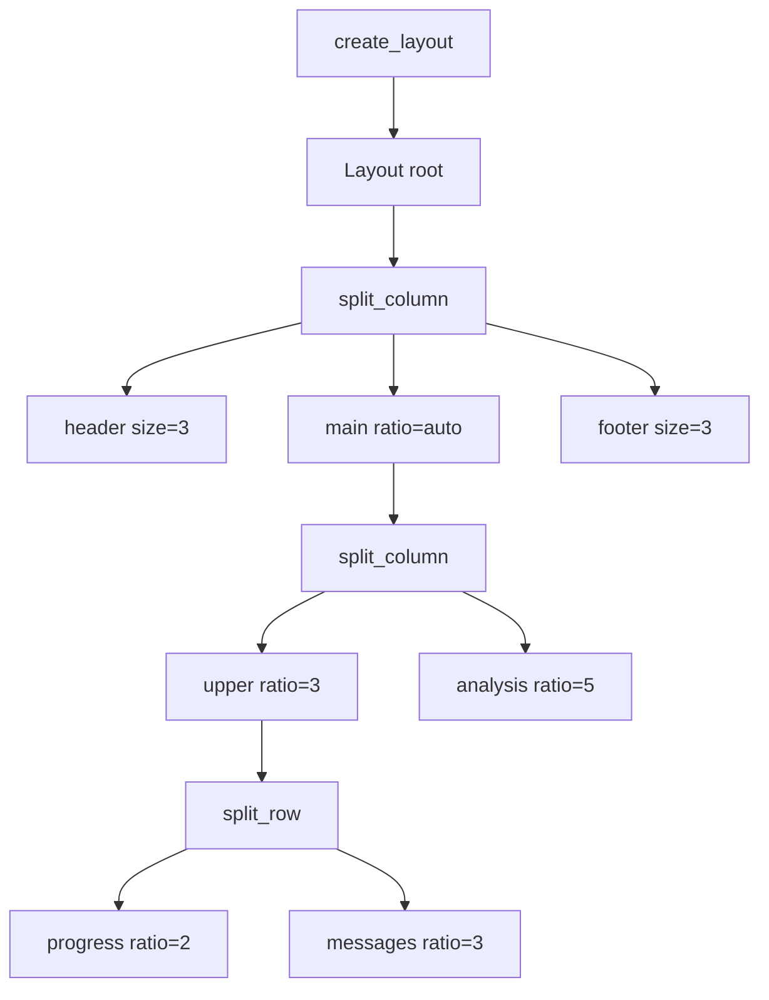
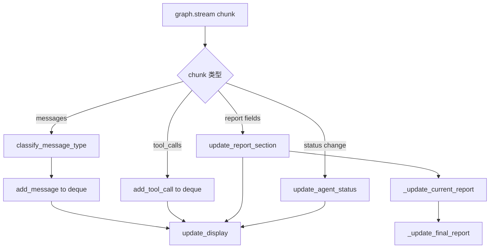
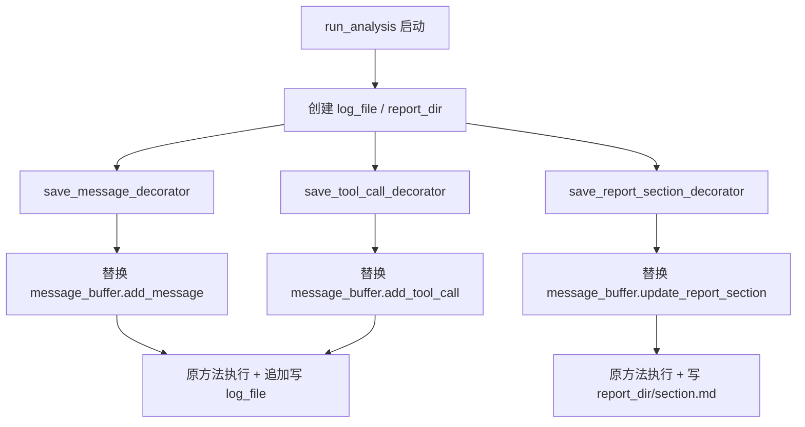

# PD-228.01 TradingAgents — Rich Live 交互式 CLI 仪表盘

> 文档编号：PD-228.01
> 来源：TradingAgents `cli/main.py` `cli/utils.py` `cli/stats_handler.py`
> GitHub：https://github.com/TauricResearch/TradingAgents.git
> 问题域：PD-228 交互式 CLI 界面 Interactive CLI Dashboard
> 状态：可复用方案

---

## 第 1 章 问题与动机

### 1.1 核心问题

多 Agent 系统的运行过程对用户来说是黑盒：多个 Agent 并行/串行执行，每个 Agent 产生消息、调用工具、生成报告，用户无法实时感知进度。传统的 `print()` 日志输出是线性的、不可回溯的，无法同时展示多维信息（Agent 状态、消息流、报告内容、统计数据）。

交互式 CLI 仪表盘需要解决三个核心矛盾：
1. **信息密度 vs 可读性** — Agent 系统产生大量异构数据（状态、消息、工具调用、报告），需要在有限终端空间内分区展示
2. **实时性 vs 稳定性** — 4fps 刷新率下，Spinner 动画、状态变更、消息追加必须线程安全且不闪烁
3. **运行时展示 vs 运行后消费** — 实时面板展示最新状态，但完整报告需要持久化到磁盘供后续阅读

### 1.2 TradingAgents 的解法概述

TradingAgents 构建了一个完整的 Rich Live TUI 仪表盘系统，核心要点：

1. **三区 Layout 分区架构** — Header/Main/Footer 三层，Main 再分 Progress+Messages（上）和 Analysis（下），形成 5 面板布局（`cli/main.py:232-245`）
2. **MessageBuffer 中央状态管理** — 单例 deque 缓冲区管理消息、工具调用、Agent 状态、报告分段，所有面板从同一数据源渲染（`cli/main.py:43-227`）
3. **装饰器模式双写** — 用 `functools.wraps` 装饰 MessageBuffer 的 `add_message`/`add_tool_call`/`update_report_section` 方法，每次状态变更同步写入磁盘日志（`cli/main.py:944-981`）
4. **StatsCallbackHandler 线程安全统计** — 继承 LangChain `BaseCallbackHandler`，用 `threading.Lock` 保护 LLM 调用数、工具调用数、token 用量的原子更新（`cli/stats_handler.py:9-76`）
5. **questionary 多步交互采集** — 7 步向导式用户输入（ticker → date → analysts → depth → provider → models → thinking config），每步用 Rich Panel 包装提示（`cli/main.py:462-589`，`cli/utils.py:14-328`）

### 1.3 设计思想

| 设计原则 | 具体实现 | 理由 | 替代方案 |
|----------|----------|------|----------|
| 单一数据源 | MessageBuffer 全局单例管理所有状态 | 避免多面板数据不一致 | 每个面板独立数据源（同步困难） |
| 声明式布局 | Layout.split_column/split_row 嵌套声明 | 布局逻辑与渲染逻辑分离 | 手动计算坐标（脆弱） |
| 非侵入式统计 | LangChain Callback 机制注入 StatsHandler | 不修改业务代码即可采集指标 | 在每个 Agent 内部埋点（耦合） |
| 装饰器双写 | wraps 装饰器拦截状态变更同步写磁盘 | 运行时展示与持久化解耦 | 在 MessageBuffer 内部硬编码 IO（职责混乱） |
| 渐进式交互 | questionary 分步采集 + Rich Panel 提示 | 降低用户认知负担 | 一次性命令行参数（不友好） |

---

## 第 2 章 源码实现分析

### 2.1 架构概览

TradingAgents CLI 的整体架构分为三层：交互采集层、实时展示层、数据持久化层。

```
┌─────────────────────────────────────────────────────────────┐
│                    CLI Entry (Typer app)                     │
├─────────────────────────────────────────────────────────────┤
│  Phase 1: User Input Collection                             │
│  ┌─────────────┐  ┌──────────────┐  ┌───────────────────┐  │
│  │ questionary  │  │ Rich Panel   │  │ Typer prompt      │  │
│  │ (checkbox/   │  │ (question    │  │ (simple text      │  │
│  │  select)     │  │  boxes)      │  │  input)           │  │
│  └─────────────┘  └──────────────┘  └───────────────────┘  │
├─────────────────────────────────────────────────────────────┤
│  Phase 2: Live Dashboard                                    │
│  ┌─────────────────────────────────────────────────────┐    │
│  │              Rich Live (4fps refresh)                │    │
│  │  ┌──────────────────────────────────────────────┐   │    │
│  │  │ Layout                                       │   │    │
│  │  │ ┌──────────────────────────────────────────┐ │   │    │
│  │  │ │ Header: Welcome banner                   │ │   │    │
│  │  │ ├──────────────────────────────────────────┤ │   │    │
│  │  │ │ Upper:                                   │ │   │    │
│  │  │ │ ┌─Progress──────┐ ┌─Messages & Tools──┐ │ │   │    │
│  │  │ │ │ Agent Table   │ │ Time|Type|Content  │ │ │   │    │
│  │  │ │ │ w/ Spinners   │ │ (newest first)     │ │ │   │    │
│  │  │ │ └───────────────┘ └────────────────────┘ │ │   │    │
│  │  │ │ ┌─Analysis───────────────────────────────┐│ │   │    │
│  │  │ │ │ Current Report (Markdown rendered)     ││ │   │    │
│  │  │ │ └────────────────────────────────────────┘│ │   │    │
│  │  │ ├──────────────────────────────────────────┤ │   │    │
│  │  │ │ Footer: Stats bar                        │ │   │    │
│  │  │ └──────────────────────────────────────────┘ │   │    │
│  │  └──────────────────────────────────────────────┘   │    │
│  └─────────────────────────────────────────────────────┘    │
├─────────────────────────────────────────────────────────────┤
│  Data Layer                                                 │
│  ┌──────────────┐  ┌────────────────┐  ┌────────────────┐  │
│  │ MessageBuffer │  │ StatsCallback  │  │ Disk Writer    │  │
│  │ (deque-based) │  │ (thread-safe)  │  │ (decorators)   │  │
│  └──────────────┘  └────────────────┘  └────────────────┘  │
└─────────────────────────────────────────────────────────────┘
```

### 2.2 核心实现

#### 2.2.1 Layout 分区构建



对应源码 `cli/main.py:232-245`：

```python
def create_layout():
    layout = Layout()
    layout.split_column(
        Layout(name="header", size=3),
        Layout(name="main"),
        Layout(name="footer", size=3),
    )
    layout["main"].split_column(
        Layout(name="upper", ratio=3), Layout(name="analysis", ratio=5)
    )
    layout["upper"].split_row(
        Layout(name="progress", ratio=2), Layout(name="messages", ratio=3)
    )
    return layout
```

Layout 使用固定 size（header/footer 各 3 行）+ ratio 比例分配（upper:analysis = 3:5，progress:messages = 2:3），确保终端窗口缩放时各区域按比例调整。

#### 2.2.2 MessageBuffer 中央状态管理



对应源码 `cli/main.py:43-117`：

```python
class MessageBuffer:
    FIXED_AGENTS = {
        "Research Team": ["Bull Researcher", "Bear Researcher", "Research Manager"],
        "Trading Team": ["Trader"],
        "Risk Management": ["Aggressive Analyst", "Neutral Analyst", "Conservative Analyst"],
        "Portfolio Management": ["Portfolio Manager"],
    }

    ANALYST_MAPPING = {
        "market": "Market Analyst",
        "social": "Social Analyst",
        "news": "News Analyst",
        "fundamentals": "Fundamentals Analyst",
    }

    REPORT_SECTIONS = {
        "market_report": ("market", "Market Analyst"),
        "sentiment_report": ("social", "Social Analyst"),
        "news_report": ("news", "News Analyst"),
        "fundamentals_report": ("fundamentals", "Fundamentals Analyst"),
        "investment_plan": (None, "Research Manager"),
        "trader_investment_plan": (None, "Trader"),
        "final_trade_decision": (None, "Portfolio Manager"),
    }

    def __init__(self, max_length=100):
        self.messages = deque(maxlen=max_length)
        self.tool_calls = deque(maxlen=max_length)
        self.current_report = None
        self.final_report = None
        self.agent_status = {}
        self.current_agent = None
        self.report_sections = {}
        self.selected_analysts = []
        self._last_message_id = None
```

关键设计：`deque(maxlen=100)` 自动淘汰旧消息，避免内存无限增长。`REPORT_SECTIONS` 字典将报告段与负责 Agent 绑定，`get_completed_reports_count()` 通过检查 Agent 状态（而非仅检查内容是否存在）来判断报告是否完成，防止辩论中间轮次被误计为完成（`cli/main.py:119-138`）。

#### 2.2.3 装饰器模式双写磁盘



对应源码 `cli/main.py:944-981`：

```python
def save_message_decorator(obj, func_name):
    func = getattr(obj, func_name)
    @wraps(func)
    def wrapper(*args, **kwargs):
        func(*args, **kwargs)
        timestamp, message_type, content = obj.messages[-1]
        content = content.replace("\n", " ")
        with open(log_file, "a") as f:
            f.write(f"{timestamp} [{message_type}] {content}\n")
    return wrapper

def save_report_section_decorator(obj, func_name):
    func = getattr(obj, func_name)
    @wraps(func)
    def wrapper(section_name, content):
        func(section_name, content)
        if section_name in obj.report_sections and obj.report_sections[section_name] is not None:
            content = obj.report_sections[section_name]
            if content:
                file_name = f"{section_name}.md"
                with open(report_dir / file_name, "w") as f:
                    f.write(content)
    return wrapper

message_buffer.add_message = save_message_decorator(message_buffer, "add_message")
message_buffer.add_tool_call = save_tool_call_decorator(message_buffer, "add_tool_call")
message_buffer.update_report_section = save_report_section_decorator(message_buffer, "update_report_section")
```

这种装饰器模式的精妙之处：MessageBuffer 本身不知道磁盘 IO 的存在，`run_analysis` 在运行时动态替换方法，实现了展示逻辑与持久化逻辑的完全解耦。报告段用 `"w"` 模式写入（覆盖），因为辩论过程中同一段会被多次更新。

### 2.3 实现细节

#### Agent 状态推断机制

TradingAgents 没有显式的 Agent 状态事件，而是从 `graph.stream` 的 chunk 数据中推断状态。`update_analyst_statuses` 函数（`cli/main.py:790-822`）按固定顺序遍历已选分析师，根据报告字段是否存在来推断状态：

- 有报告内容 → `completed`
- 第一个无报告的 → `in_progress`
- 其余 → `pending`

这种"推断式状态机"避免了在 Agent 内部埋状态上报代码，但依赖于 Agent 执行顺序的确定性。

#### Spinner 动画与 Live 刷新

Progress 面板中，`in_progress` 状态的 Agent 使用 `Spinner("dots")` 渲染动画（`cli/main.py:308-311`）。Rich Live 以 `refresh_per_second=4` 刷新（`cli/main.py:986`），Spinner 的帧率由 Rich 内部控制，与 Live 刷新率协调。

#### 消息去重

通过 `message._last_message_id` 跟踪最后处理的消息 ID（`cli/main.py:1028-1029`），避免 `graph.stream` 重复推送同一消息时产生重复日志。

#### Footer 统计栏数据流

```
StatsCallbackHandler.on_llm_start → llm_calls++
StatsCallbackHandler.on_llm_end → tokens_in/out += usage_metadata
StatsCallbackHandler.on_tool_start → tool_calls++
    ↓ get_stats() (thread-safe read)
update_display → footer: "Agents: 3/10 | LLM: 15 | Tools: 8 | Tokens: 12.5k↑ 3.2k↓ | Reports: 2/7 | ⏱ 02:34"
```

---

## 第 3 章 迁移指南

### 3.1 迁移清单

**阶段 1：基础 Layout 框架**
- [ ] 安装依赖：`pip install rich typer questionary`
- [ ] 创建 `create_layout()` 函数，定义 Header/Main/Footer 三层布局
- [ ] 实现 `update_display()` 函数，将数据渲染到各面板

**阶段 2：状态管理层**
- [ ] 实现 `MessageBuffer` 类，包含 deque 消息缓冲、agent_status 字典、report_sections 字典
- [ ] 定义 Agent 团队映射（FIXED_AGENTS）和报告段映射（REPORT_SECTIONS）
- [ ] 实现 `init_for_analysis()` 动态初始化（根据用户选择构建状态）

**阶段 3：统计回调**
- [ ] 实现 `StatsCallbackHandler`（继承框架的 Callback 基类）
- [ ] 用 `threading.Lock` 保护所有计数器
- [ ] 在 Footer 统计栏展示 LLM 调用数、工具调用数、token 用量

**阶段 4：持久化层**
- [ ] 实现装饰器模式双写（消息 → log 文件，报告段 → 独立 md 文件）
- [ ] 实现 `save_report_to_disk()` 分目录保存完整报告
- [ ] 实现 `display_complete_report()` 运行后全量展示

**阶段 5：交互采集**
- [ ] 用 questionary 实现多步向导（text/checkbox/select）
- [ ] 用 Rich Panel 包装每步提示信息

### 3.2 适配代码模板

以下是一个可直接运行的最小 Rich Live 仪表盘模板：

```python
"""Minimal Rich Live Dashboard Template — 可直接运行"""
import time
import threading
from collections import deque
from rich.console import Console
from rich.layout import Layout
from rich.panel import Panel
from rich.table import Table
from rich.live import Live
from rich.spinner import Spinner
from rich import box

console = Console()


class DashboardBuffer:
    """中央状态管理器 — 所有面板从此读取数据"""

    def __init__(self, agents: list[str], max_messages: int = 50):
        self.messages = deque(maxlen=max_messages)
        self.agent_status: dict[str, str] = {a: "pending" for a in agents}
        self.current_output: str | None = None
        self.stats = {"calls": 0, "tokens_in": 0, "tokens_out": 0}
        self._lock = threading.Lock()

    def add_message(self, msg_type: str, content: str):
        ts = time.strftime("%H:%M:%S")
        with self._lock:
            self.messages.append((ts, msg_type, content))

    def set_agent_status(self, agent: str, status: str):
        with self._lock:
            if agent in self.agent_status:
                self.agent_status[agent] = status

    def update_stats(self, calls: int = 0, tokens_in: int = 0, tokens_out: int = 0):
        with self._lock:
            self.stats["calls"] += calls
            self.stats["tokens_in"] += tokens_in
            self.stats["tokens_out"] += tokens_out


def create_layout() -> Layout:
    layout = Layout()
    layout.split_column(
        Layout(name="header", size=3),
        Layout(name="main"),
        Layout(name="footer", size=3),
    )
    layout["main"].split_column(
        Layout(name="upper", ratio=3),
        Layout(name="output", ratio=5),
    )
    layout["upper"].split_row(
        Layout(name="agents", ratio=2),
        Layout(name="messages", ratio=3),
    )
    return layout


def render(layout: Layout, buf: DashboardBuffer, start: float):
    # Header
    layout["header"].update(
        Panel("[bold green]My Agent Dashboard[/bold green]", border_style="green")
    )

    # Agent status table
    tbl = Table(show_header=True, header_style="bold magenta", box=box.SIMPLE_HEAD, expand=True)
    tbl.add_column("Agent", style="cyan", width=20)
    tbl.add_column("Status", style="yellow", width=15)
    for agent, status in buf.agent_status.items():
        if status == "in_progress":
            cell = Spinner("dots", text="[blue]running[/blue]")
        else:
            color = {"pending": "yellow", "completed": "green", "error": "red"}.get(status, "white")
            cell = f"[{color}]{status}[/{color}]"
        tbl.add_row(agent, cell)
    layout["agents"].update(Panel(tbl, title="Agents", border_style="cyan"))

    # Messages
    msg_tbl = Table(show_header=True, header_style="bold magenta", box=box.MINIMAL, expand=True)
    msg_tbl.add_column("Time", width=8)
    msg_tbl.add_column("Type", width=8)
    msg_tbl.add_column("Content", ratio=1)
    for ts, mt, content in list(buf.messages)[-10:]:
        msg_tbl.add_row(ts, mt, content[:120])
    layout["messages"].update(Panel(msg_tbl, title="Messages", border_style="blue"))

    # Output
    layout["output"].update(
        Panel(buf.current_output or "[dim]Waiting...[/dim]", title="Output", border_style="green")
    )

    # Footer stats
    elapsed = time.time() - start
    s = buf.stats
    layout["footer"].update(
        Panel(f"Calls: {s['calls']} | Tokens: {s['tokens_in']}↑ {s['tokens_out']}↓ | ⏱ {int(elapsed//60):02d}:{int(elapsed%60):02d}",
              border_style="grey50")
    )


# --- Usage Example ---
if __name__ == "__main__":
    agents = ["Researcher", "Analyst", "Writer"]
    buf = DashboardBuffer(agents)
    layout = create_layout()
    start = time.time()

    with Live(layout, refresh_per_second=4) as live:
        for i, agent in enumerate(agents):
            buf.set_agent_status(agent, "in_progress")
            buf.add_message("System", f"{agent} started")
            render(layout, buf, start)
            time.sleep(2)  # Simulate work
            buf.set_agent_status(agent, "completed")
            buf.current_output = f"# {agent} Report\nAnalysis complete."
            buf.update_stats(calls=3, tokens_in=1500, tokens_out=500)
            render(layout, buf, start)

    console.print("[bold green]Done![/bold green]")
```

### 3.3 适用场景

| 场景 | 适用度 | 说明 |
|------|--------|------|
| 多 Agent 编排系统 CLI | ⭐⭐⭐ | 核心场景，多 Agent 状态 + 消息 + 报告同时展示 |
| 单 Agent 长任务监控 | ⭐⭐⭐ | 简化为 2 面板（状态 + 输出），仍然有效 |
| CI/CD 流水线可视化 | ⭐⭐ | 适合阶段式进度展示，但缺少并行任务支持 |
| 数据处理 ETL 监控 | ⭐⭐ | 适合展示处理进度和统计，但报告面板可能不需要 |
| Web 服务（非终端） | ⭐ | Rich 是终端库，Web 场景需要改用 WebSocket + 前端框架 |

---

## 第 4 章 测试用例

```python
"""Tests for TradingAgents CLI Dashboard components."""
import time
import threading
from collections import deque
from unittest.mock import MagicMock, patch
import pytest


class TestMessageBuffer:
    """Test MessageBuffer central state management."""

    def setup_method(self):
        """Create a fresh MessageBuffer for each test."""
        # Inline minimal MessageBuffer for testing
        self.buffer = self._create_buffer()

    def _create_buffer(self):
        class MessageBuffer:
            FIXED_AGENTS = {
                "Research Team": ["Bull Researcher", "Bear Researcher", "Research Manager"],
                "Trading Team": ["Trader"],
            }
            ANALYST_MAPPING = {"market": "Market Analyst", "news": "News Analyst"}
            REPORT_SECTIONS = {
                "market_report": ("market", "Market Analyst"),
                "news_report": ("news", "News Analyst"),
                "investment_plan": (None, "Research Manager"),
            }

            def __init__(self):
                self.messages = deque(maxlen=100)
                self.tool_calls = deque(maxlen=100)
                self.agent_status = {}
                self.report_sections = {}
                self.selected_analysts = []
                self.current_report = None
                self.final_report = None
                self._last_message_id = None

            def init_for_analysis(self, selected_analysts):
                self.selected_analysts = [a.lower() for a in selected_analysts]
                self.agent_status = {}
                for key in self.selected_analysts:
                    if key in self.ANALYST_MAPPING:
                        self.agent_status[self.ANALYST_MAPPING[key]] = "pending"
                for agents in self.FIXED_AGENTS.values():
                    for agent in agents:
                        self.agent_status[agent] = "pending"
                self.report_sections = {}
                for section, (key, _) in self.REPORT_SECTIONS.items():
                    if key is None or key in self.selected_analysts:
                        self.report_sections[section] = None

            def add_message(self, msg_type, content):
                ts = time.strftime("%H:%M:%S")
                self.messages.append((ts, msg_type, content))

            def update_agent_status(self, agent, status):
                if agent in self.agent_status:
                    self.agent_status[agent] = status

            def get_completed_reports_count(self):
                count = 0
                for section in self.report_sections:
                    if section not in self.REPORT_SECTIONS:
                        continue
                    _, finalizing_agent = self.REPORT_SECTIONS[section]
                    has_content = self.report_sections.get(section) is not None
                    agent_done = self.agent_status.get(finalizing_agent) == "completed"
                    if has_content and agent_done:
                        count += 1
                return count

        return MessageBuffer()

    def test_init_for_analysis_filters_agents(self):
        """Only selected analysts appear in agent_status."""
        self.buffer.init_for_analysis(["market"])
        assert "Market Analyst" in self.buffer.agent_status
        assert "News Analyst" not in self.buffer.agent_status
        # Fixed agents always present
        assert "Bull Researcher" in self.buffer.agent_status
        assert "Trader" in self.buffer.agent_status

    def test_init_for_analysis_filters_report_sections(self):
        """Only relevant report sections are initialized."""
        self.buffer.init_for_analysis(["market"])
        assert "market_report" in self.buffer.report_sections
        assert "news_report" not in self.buffer.report_sections
        # Non-analyst sections always present
        assert "investment_plan" in self.buffer.report_sections

    def test_message_deque_maxlen(self):
        """Messages beyond maxlen are automatically dropped."""
        for i in range(150):
            self.buffer.add_message("Test", f"msg-{i}")
        assert len(self.buffer.messages) == 100
        assert self.buffer.messages[-1][2] == "msg-149"

    def test_completed_reports_require_agent_done(self):
        """Report not counted as complete until finalizing agent is completed."""
        self.buffer.init_for_analysis(["market"])
        self.buffer.report_sections["market_report"] = "Some content"
        # Agent still pending — report should NOT count
        assert self.buffer.get_completed_reports_count() == 0
        # Now mark agent as completed
        self.buffer.update_agent_status("Market Analyst", "completed")
        assert self.buffer.get_completed_reports_count() == 1

    def test_update_agent_status_ignores_unknown(self):
        """Unknown agents are silently ignored."""
        self.buffer.init_for_analysis(["market"])
        self.buffer.update_agent_status("NonExistent Agent", "completed")
        assert "NonExistent Agent" not in self.buffer.agent_status


class TestStatsCallbackHandler:
    """Test thread-safe statistics collection."""

    def test_thread_safety(self):
        """Concurrent increments produce correct totals."""

        class StatsHandler:
            def __init__(self):
                self._lock = threading.Lock()
                self.llm_calls = 0
                self.tool_calls = 0

            def on_llm_start(self):
                with self._lock:
                    self.llm_calls += 1

            def on_tool_start(self):
                with self._lock:
                    self.tool_calls += 1

            def get_stats(self):
                with self._lock:
                    return {"llm_calls": self.llm_calls, "tool_calls": self.tool_calls}

        handler = StatsHandler()
        threads = []
        for _ in range(100):
            t1 = threading.Thread(target=handler.on_llm_start)
            t2 = threading.Thread(target=handler.on_tool_start)
            threads.extend([t1, t2])
            t1.start()
            t2.start()
        for t in threads:
            t.join()

        stats = handler.get_stats()
        assert stats["llm_calls"] == 100
        assert stats["tool_calls"] == 100


class TestFormatTokens:
    """Test token formatting utility."""

    def test_small_numbers(self):
        def format_tokens(n):
            if n >= 1000:
                return f"{n/1000:.1f}k"
            return str(n)

        assert format_tokens(500) == "500"
        assert format_tokens(0) == "0"

    def test_large_numbers(self):
        def format_tokens(n):
            if n >= 1000:
                return f"{n/1000:.1f}k"
            return str(n)

        assert format_tokens(1000) == "1.0k"
        assert format_tokens(12500) == "12.5k"
        assert format_tokens(999) == "999"
```

---

## 第 5 章 跨域关联

| 关联域 | 关系类型 | 说明 |
|--------|----------|------|
| PD-11 可观测性 | 强协同 | StatsCallbackHandler 是可观测性的 CLI 展示层，LLM 调用数/token 用量直接在 Footer 统计栏展示。PD-11 关注数据采集与持久化，PD-228 关注实时可视化 |
| PD-02 多 Agent 编排 | 依赖 | 仪表盘的 Agent 状态面板依赖编排层提供的执行顺序和状态变更信号。TradingAgents 通过 `graph.stream` chunk 推断状态，编排模式决定了状态推断逻辑 |
| PD-06 记忆持久化 | 协同 | 装饰器双写机制将运行时消息和报告持久化到磁盘，是记忆持久化在 CLI 层的体现。`save_report_to_disk` 按 5 阶段分目录保存完整报告 |
| PD-09 Human-in-the-Loop | 协同 | questionary 多步向导是 HITL 的前置交互形式。用户选择分析师、研究深度、LLM 提供商等参数，直接影响后续 Agent 编排 |
| PD-07 质量检查 | 间接 | `get_completed_reports_count()` 通过检查 Agent 完成状态（而非仅内容存在）来判断报告完成度，是一种轻量级质量门控 |

---

## 第 6 章 来源文件索引

| 文件 | 行范围 | 关键实现 |
|------|--------|----------|
| `cli/main.py` | L1-32 | 导入声明：Rich 全家桶（Live, Layout, Panel, Spinner, Table, Markdown, Text, Tree, Align, Rule）+ Typer + deque |
| `cli/main.py` | L43-227 | MessageBuffer 类：deque 消息缓冲、Agent 状态管理、报告分段管理、完成度计算 |
| `cli/main.py` | L232-245 | `create_layout()`：5 面板 Layout 声明式构建 |
| `cli/main.py` | L255-459 | `update_display()`：Header/Progress/Messages/Analysis/Footer 五面板渲染逻辑 |
| `cli/main.py` | L462-589 | `get_user_selections()`：7 步向导式用户输入采集 |
| `cli/main.py` | L616-703 | `save_report_to_disk()`：5 阶段分目录报告持久化 |
| `cli/main.py` | L706-764 | `display_complete_report()`：运行后全量报告展示 |
| `cli/main.py` | L790-822 | `update_analyst_statuses()`：推断式 Agent 状态机 |
| `cli/main.py` | L824-897 | 消息分类与格式化工具函数 |
| `cli/main.py` | L899-1142 | `run_analysis()`：主流程（配置 → 装饰器注入 → Live 循环 → stream 处理） |
| `cli/main.py` | L944-981 | 装饰器模式双写：save_message_decorator / save_tool_call_decorator / save_report_section_decorator |
| `cli/stats_handler.py` | L1-76 | StatsCallbackHandler：线程安全的 LLM/Tool 调用统计与 token 用量追踪 |
| `cli/utils.py` | L1-91 | questionary 交互：ticker 输入、日期验证、分析师多选（checkbox） |
| `cli/utils.py` | L93-328 | questionary 交互：研究深度选择、LLM 提供商选择、模型选择、推理配置 |
| `cli/models.py` | L1-11 | AnalystType 枚举定义 |
| `cli/announcements.py` | L1-51 | 远程公告获取与展示（带超时降级） |
| `cli/config.py` | L1-6 | CLI 配置常量（公告 URL、超时） |

---

## 第 7 章 横向对比维度

```json comparison_data
{
  "project": "TradingAgents",
  "dimensions": {
    "布局架构": "Rich Layout 5面板嵌套：Header + Progress/Messages + Analysis + Footer",
    "刷新机制": "Rich Live 4fps 全局刷新，Spinner 动画内置帧率协调",
    "状态管理": "MessageBuffer 全局单例 + deque(maxlen=100) 自动淘汰",
    "统计采集": "LangChain BaseCallbackHandler + threading.Lock 线程安全计数",
    "持久化策略": "装饰器模式双写：运行时 deque 展示 + 同步追加写磁盘日志",
    "交互采集": "questionary 7步向导 + Rich Panel 提示框包装",
    "状态推断": "从 graph.stream chunk 字段推断 Agent 状态，无显式状态事件"
  }
}
```

### 域元数据补充

```json domain_metadata
{
  "solution_summary": "TradingAgents 用 Rich Live 4fps 刷新 5 面板 Layout，MessageBuffer 单例管理 Agent 状态/消息/报告，装饰器双写同步持久化，questionary 7 步向导采集用户配置",
  "description": "CLI 仪表盘需要平衡信息密度、刷新稳定性与运行后数据消费三个维度",
  "sub_problems": [
    "多步向导式用户配置采集与验证",
    "运行后完整报告的分目录持久化与全量展示"
  ],
  "best_practices": [
    "questionary checkbox/select + Rich Panel 组合实现分步交互",
    "StatsCallbackHandler 非侵入式统计注入（LangChain Callback 机制）",
    "deque(maxlen) 自动淘汰旧消息防止内存泄漏",
    "推断式状态机：从数据流 chunk 字段推断 Agent 状态，避免业务代码埋点"
  ]
}
```
