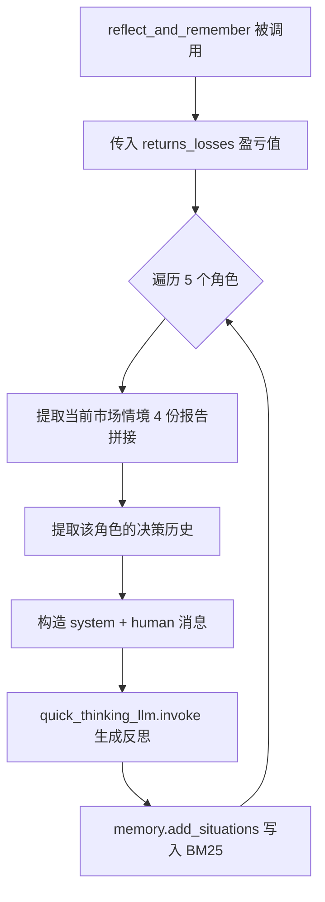
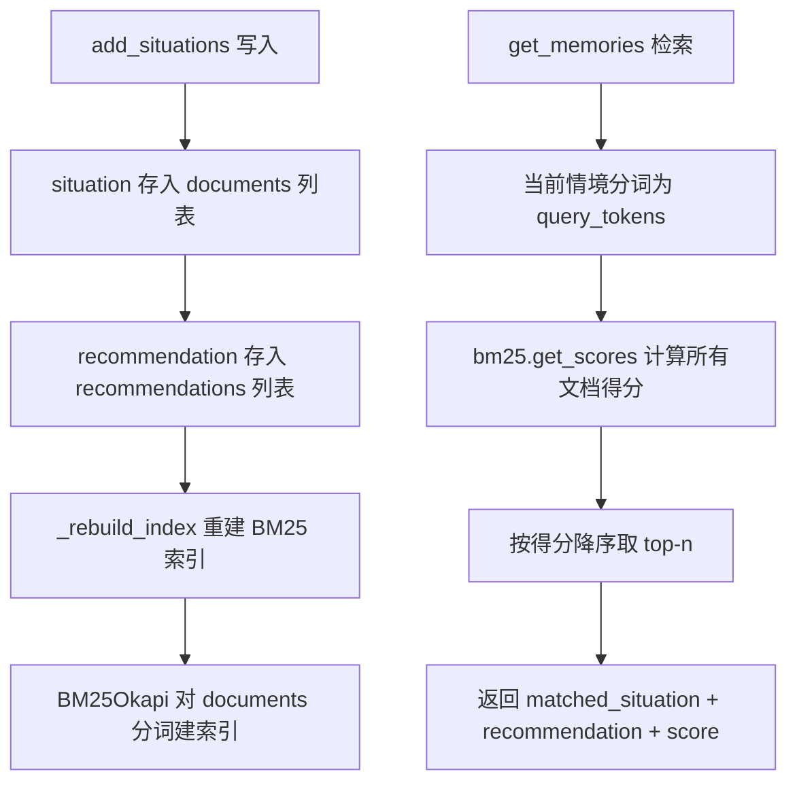

# PD-229.01 TradingAgents — 五角色 BM25 反思记忆闭环

> 文档编号：PD-229.01
> 来源：TradingAgents `tradingagents/graph/reflection.py`, `tradingagents/agents/utils/memory.py`
> GitHub：https://github.com/TauricResearch/TradingAgents.git
> 问题域：PD-229 经验反思学习 Experience Reflection & Learning
> 状态：可复用方案

---

## 第 1 章 问题与动机

### 1.1 核心问题

Agent 系统在多轮决策中会反复犯同样的错误。以交易场景为例，一个 Agent 在某种市场情境下做出了错误的买入决策导致亏损，但下次遇到类似情境时，由于没有"记忆"，它会再次犯同样的错误。

核心挑战：
- **无状态决策**：每轮决策独立，不从历史中学习
- **归因困难**：决策涉及多个角色（研究员、交易员、风控），错误归因到哪个角色？
- **经验检索**：历史经验如何在新情境中被高效召回？
- **角色隔离**：不同角色的反思经验不应混淆（Bull 的教训不该影响 Bear 的判断）

### 1.2 TradingAgents 的解法概述

TradingAgents 实现了一套完整的"交易后反思 → 记忆存储 → 情境检索 → 决策注入"闭环：

1. **Reflector 统一反思引擎**：交易完成后，`Reflector` 类将交易结果（盈亏数值）、当时的市场报告、各角色的决策历史一起输入 LLM，生成结构化反思总结（`reflection.py:7-121`）
2. **五角色独立记忆**：Bull/Bear/Trader/InvestJudge/RiskManager 各维护独立的 `FinancialSituationMemory` 实例，反思结果按角色分别写入（`trading_graph.py:98-102`）
3. **BM25 词法检索**：使用 BM25Okapi 算法做情境相似度匹配，无需向量数据库或 Embedding API，纯本地离线运行（`memory.py:7-98`）
4. **Prompt 注入式召回**：每个角色在决策时，将当前市场情境作为 query 检索 top-2 历史反思，直接拼入 prompt 的 `past_memories` 字段（`bull_researcher.py:19-23`）
5. **盈亏驱动触发**：反思由外部调用 `reflect_and_remember(returns_losses)` 触发，传入实际盈亏数值作为反思的客观依据（`trading_graph.py:263-279`）

### 1.3 设计思想

| 设计原则 | 具体实现 | 理由 | 替代方案 |
|----------|----------|------|----------|
| 角色隔离记忆 | 5 个独立 FinancialSituationMemory 实例 | 避免 Bull 的乐观教训污染 Bear 的风险判断 | 共享记忆池 + 角色标签过滤 |
| 词法检索优先 | BM25Okapi 替代向量检索 | 零 API 成本、离线可用、金融术语匹配精准 | FAISS/Chroma 向量检索 |
| LLM 生成反思 | Reflector 用 quick_thinking_llm 生成 | 反思需要推理能力，不是简单摘要 | 规则模板填充 |
| 结果驱动反思 | 传入 returns_losses 数值 | 客观盈亏是唯一可靠的反馈信号 | 自评估（LLM 自己判断对错） |
| Prompt 注入召回 | 检索结果直接拼入角色 prompt | 实现简单，无需修改 Agent 架构 | RAG 中间件层 |

---

## 第 2 章 源码实现分析

### 2.1 架构概览

TradingAgents 的反思学习系统由三个核心组件构成：Reflector（反思引擎）、FinancialSituationMemory（BM25 记忆库）、以及各角色 Agent 中的记忆检索逻辑。

```
┌─────────────────────────────────────────────────────────────────┐
│                    TradingAgentsGraph                            │
│                                                                 │
│  ┌──────────┐  ┌──────────┐  ┌──────────┐  ┌──────────┐       │
│  │ Bull     │  │ Bear     │  │ Trader   │  │ Risk Mgr │  ...   │
│  │ Researcher│  │ Researcher│  │          │  │          │       │
│  └────┬─────┘  └────┬─────┘  └────┬─────┘  └────┬─────┘       │
│       │              │              │              │             │
│       ▼              ▼              ▼              ▼             │
│  ┌──────────┐  ┌──────────┐  ┌──────────┐  ┌──────────┐       │
│  │bull_memory│  │bear_memory│  │trader_mem│  │risk_mem  │       │
│  │(BM25)    │  │(BM25)    │  │(BM25)    │  │(BM25)    │       │
│  └────┬─────┘  └────┬─────┘  └────┬─────┘  └────┬─────┘       │
│       │              │              │              │             │
│       └──────────────┴──────────────┴──────────────┘             │
│                              ▲                                   │
│                              │ reflect_and_remember(returns)     │
│                       ┌──────┴──────┐                            │
│                       │  Reflector  │                            │
│                       │ (LLM 反思)  │                            │
│                       └─────────────┘                            │
└─────────────────────────────────────────────────────────────────┘
```

数据流闭环：
```
交易决策 → 市场执行 → 盈亏结果 → Reflector 反思 → BM25 记忆写入
    ▲                                                      │
    └──── 下次决策时 BM25 检索 top-2 历史反思 ◄────────────┘
```

### 2.2 核心实现

#### 2.2.1 Reflector 反思引擎



对应源码 `tradingagents/graph/reflection.py:7-121`：

```python
class Reflector:
    """Handles reflection on decisions and updating memory."""

    def __init__(self, quick_thinking_llm: ChatOpenAI):
        self.quick_thinking_llm = quick_thinking_llm
        self.reflection_system_prompt = self._get_reflection_prompt()

    def _reflect_on_component(
        self, component_type: str, report: str, situation: str, returns_losses
    ) -> str:
        """Generate reflection for a component."""
        messages = [
            ("system", self.reflection_system_prompt),
            (
                "human",
                f"Returns: {returns_losses}\n\nAnalysis/Decision: {report}\n\n"
                f"Objective Market Reports for Reference: {situation}",
            ),
        ]
        result = self.quick_thinking_llm.invoke(messages).content
        return result

    def reflect_bull_researcher(self, current_state, returns_losses, bull_memory):
        situation = self._extract_current_situation(current_state)
        bull_debate_history = current_state["investment_debate_state"]["bull_history"]
        result = self._reflect_on_component(
            "BULL", bull_debate_history, situation, returns_losses
        )
        bull_memory.add_situations([(situation, result)])
```

关键设计点：
- **统一反思模板**：`_get_reflection_prompt()` 定义了 4 段式反思结构——Reasoning（归因）、Improvement（改进建议）、Summary（教训总结）、Query（精炼关键词）（`reflection.py:15-47`）
- **角色分派方法**：5 个 `reflect_*` 方法结构相同，区别仅在于提取的决策历史字段不同（`reflection.py:73-121`）
- **情境 = 4 报告拼接**：`_extract_current_situation` 将 market/sentiment/news/fundamentals 四份报告拼接为情境字符串（`reflection.py:49-56`）

#### 2.2.2 BM25 记忆存储与检索



对应源码 `tradingagents/agents/utils/memory.py:12-92`：

```python
class FinancialSituationMemory:
    def __init__(self, name: str, config: dict = None):
        self.name = name
        self.documents: List[str] = []       # 情境文本
        self.recommendations: List[str] = [] # 反思建议
        self.bm25 = None

    def _tokenize(self, text: str) -> List[str]:
        tokens = re.findall(r'\b\w+\b', text.lower())
        return tokens

    def _rebuild_index(self):
        if self.documents:
            tokenized_docs = [self._tokenize(doc) for doc in self.documents]
            self.bm25 = BM25Okapi(tokenized_docs)

    def add_situations(self, situations_and_advice: List[Tuple[str, str]]):
        for situation, recommendation in situations_and_advice:
            self.documents.append(situation)
            self.recommendations.append(recommendation)
        self._rebuild_index()

    def get_memories(self, current_situation: str, n_matches: int = 1) -> List[dict]:
        if not self.documents or self.bm25 is None:
            return []
        query_tokens = self._tokenize(current_situation)
        scores = self.bm25.get_scores(query_tokens)
        top_indices = sorted(
            range(len(scores)), key=lambda i: scores[i], reverse=True
        )[:n_matches]
        results = []
        max_score = max(scores) if max(scores) > 0 else 1
        for idx in top_indices:
            normalized_score = scores[idx] / max_score if max_score > 0 else 0
            results.append({
                "matched_situation": self.documents[idx],
                "recommendation": self.recommendations[idx],
                "similarity_score": normalized_score,
            })
        return results
```

### 2.3 实现细节

#### 记忆注入模式

每个角色 Agent 在决策时都遵循相同的记忆检索-注入模式。以 Bull Researcher 为例（`bull_researcher.py:18-23`）：

```python
curr_situation = f"{market_research_report}\n\n{sentiment_report}\n\n{news_report}\n\n{fundamentals_report}"
past_memories = memory.get_memories(curr_situation, n_matches=2)

past_memory_str = ""
for i, rec in enumerate(past_memories, 1):
    past_memory_str += rec["recommendation"] + "\n\n"
```

然后在 prompt 中注入：
```
Reflections from similar situations and lessons learned: {past_memory_str}
You must also address reflections and learn from lessons and mistakes you made in the past.
```

这个模式在 5 个角色中完全一致：
- `bull_researcher.py:19` — Bull 检索 top-2
- `bear_researcher.py:19` — Bear 检索 top-2
- `trader.py:16` — Trader 检索 top-2
- `research_manager.py:16` — Research Manager 检索 top-2
- `risk_manager.py:19` — Risk Manager 检索 top-2

#### 反思触发时机

反思不是自动触发的，而是由外部回测循环显式调用（`trading_graph.py:263-279`）：

```python
def reflect_and_remember(self, returns_losses):
    """Reflect on decisions and update memory based on returns."""
    self.reflector.reflect_bull_researcher(
        self.curr_state, returns_losses, self.bull_memory
    )
    self.reflector.reflect_bear_researcher(
        self.curr_state, returns_losses, self.bear_memory
    )
    self.reflector.reflect_trader(
        self.curr_state, returns_losses, self.trader_memory
    )
    self.reflector.reflect_invest_judge(
        self.curr_state, returns_losses, self.invest_judge_memory
    )
    self.reflector.reflect_risk_manager(
        self.curr_state, returns_losses, self.risk_manager_memory
    )
```

调用方式（`main.py:31`）：
```python
ta.reflect_and_remember(1000)  # parameter is the position returns
```

#### 反思 Prompt 的 4 段式结构

`reflection.py:17-47` 定义的 system prompt 要求 LLM 输出 4 个部分：

1. **Reasoning** — 判断决策正确/错误，分析 8 个维度的贡献因素（市场情报、技术指标、价格走势、新闻、情绪、基本面等）
2. **Improvement** — 对错误决策提出具体修正建议（如"将 HOLD 改为 BUY"）
3. **Summary** — 总结教训，强调跨情境的可迁移性
4. **Query** — 将教训压缩为 ≤1000 token 的精炼句子，便于后续检索


---

## 第 3 章 迁移指南

### 3.1 迁移清单

**阶段 1：记忆基础设施（1 个文件）**
- [ ] 实现 `SituationMemory` 类，包含 BM25 索引、add/get/clear 方法
- [ ] 安装依赖：`pip install rank-bm25`
- [ ] 为每个需要学习的角色创建独立记忆实例

**阶段 2：反思引擎（1 个文件）**
- [ ] 实现 `Reflector` 类，定义 4 段式反思 system prompt
- [ ] 为每个角色实现 `reflect_<role>` 方法
- [ ] 确定反思触发时机（交易后/任务完成后/错误发生后）

**阶段 3：记忆注入（修改各角色 Agent）**
- [ ] 在每个角色的决策函数中添加 `memory.get_memories()` 调用
- [ ] 将检索结果拼入 prompt 的指定位置
- [ ] 在 prompt 中添加"必须参考历史教训"的指令

**阶段 4：闭环集成**
- [ ] 在主循环中添加 `reflect_and_remember()` 调用
- [ ] 传入客观结果指标（盈亏/成功率/错误数等）
- [ ] 可选：添加记忆持久化（序列化到磁盘）

### 3.2 适配代码模板

#### 通用记忆类（可直接复用）

```python
"""通用 BM25 经验记忆，适用于任何需要从历史中学习的 Agent 系统。"""

from rank_bm25 import BM25Okapi
from typing import List, Tuple, Dict
import re
import json
from pathlib import Path


class ExperienceMemory:
    """BM25-based experience memory for agent reflection learning."""

    def __init__(self, name: str, persist_path: str = None):
        self.name = name
        self.persist_path = persist_path
        self.situations: List[str] = []
        self.reflections: List[str] = []
        self.bm25 = None

        if persist_path and Path(persist_path).exists():
            self._load()

    def _tokenize(self, text: str) -> List[str]:
        return re.findall(r'\b\w+\b', text.lower())

    def _rebuild_index(self):
        if self.situations:
            tokenized = [self._tokenize(s) for s in self.situations]
            self.bm25 = BM25Okapi(tokenized)
        else:
            self.bm25 = None

    def add(self, situation: str, reflection: str):
        """Add a situation-reflection pair and rebuild index."""
        self.situations.append(situation)
        self.reflections.append(reflection)
        self._rebuild_index()
        if self.persist_path:
            self._save()

    def recall(self, current_situation: str, top_k: int = 2) -> List[Dict]:
        """Retrieve top-k most similar past reflections."""
        if not self.situations or self.bm25 is None:
            return []
        query_tokens = self._tokenize(current_situation)
        scores = self.bm25.get_scores(query_tokens)
        top_indices = sorted(
            range(len(scores)), key=lambda i: scores[i], reverse=True
        )[:top_k]
        max_score = max(scores) if max(scores) > 0 else 1
        return [
            {
                "situation": self.situations[i],
                "reflection": self.reflections[i],
                "score": scores[i] / max_score if max_score > 0 else 0,
            }
            for i in top_indices
            if scores[i] > 0  # 过滤零分匹配
        ]

    def _save(self):
        data = {"situations": self.situations, "reflections": self.reflections}
        Path(self.persist_path).write_text(json.dumps(data, ensure_ascii=False))

    def _load(self):
        data = json.loads(Path(self.persist_path).read_text())
        self.situations = data["situations"]
        self.reflections = data["reflections"]
        self._rebuild_index()


class Reflector:
    """Generic reflection engine that generates structured reflections via LLM."""

    SYSTEM_PROMPT = """You are reviewing a decision made by an agent.
Given the outcome (success/failure metrics) and the context at decision time,
generate a structured reflection with:
1. Reasoning: Was the decision correct? What factors contributed?
2. Improvement: What should be done differently next time?
3. Summary: Key lessons that apply to similar future situations.
4. Query: A concise (<200 tokens) searchable summary of the lesson."""

    def __init__(self, llm):
        self.llm = llm

    def reflect(self, context: str, decision: str, outcome: str) -> str:
        """Generate a reflection given context, decision, and outcome."""
        messages = [
            ("system", self.SYSTEM_PROMPT),
            ("human", f"Outcome: {outcome}\n\nDecision: {decision}\n\nContext: {context}"),
        ]
        return self.llm.invoke(messages).content
```

#### 集成示例

```python
# 初始化：每个角色一个记忆实例
memories = {
    role: ExperienceMemory(role, f"data/memory_{role}.json")
    for role in ["planner", "executor", "reviewer"]
}
reflector = Reflector(llm)

# 决策时：检索历史教训
def make_decision(role: str, current_context: str, llm):
    past = memories[role].recall(current_context, top_k=2)
    lessons = "\n".join(r["reflection"] for r in past) or "No past lessons."
    prompt = f"Context: {current_context}\n\nPast lessons:\n{lessons}\n\nMake your decision:"
    return llm.invoke(prompt)

# 任务完成后：反思并记忆
def reflect_and_remember(role: str, context: str, decision: str, outcome: str):
    reflection = reflector.reflect(context, decision, outcome)
    memories[role].add(context, reflection)
```

### 3.3 适用场景

| 场景 | 适用度 | 说明 |
|------|--------|------|
| 多轮交易/决策系统 | ⭐⭐⭐ | 天然适配，盈亏是最佳反馈信号 |
| 代码生成 Agent | ⭐⭐⭐ | 编译/测试结果作为客观反馈，错误模式可检索复用 |
| 客服/对话 Agent | ⭐⭐ | 用户满意度作为反馈，但情境相似度匹配较难 |
| 单次任务 Agent | ⭐ | 无多轮循环，记忆无法积累 |
| 实时低延迟系统 | ⭐⭐ | BM25 检索很快，但 LLM 反思有延迟 |

---

## 第 4 章 测试用例

```python
import pytest
from unittest.mock import MagicMock


class TestFinancialSituationMemory:
    """Tests for BM25-based memory system."""

    def setup_method(self):
        # 需要 rank_bm25 包
        from tradingagents.agents.utils.memory import FinancialSituationMemory
        self.memory = FinancialSituationMemory("test_memory")

    def test_empty_memory_returns_empty(self):
        """空记忆库检索应返回空列表。"""
        results = self.memory.get_memories("any situation", n_matches=2)
        assert results == []

    def test_add_and_retrieve_single(self):
        """添加一条记忆后应能检索到。"""
        self.memory.add_situations([
            ("high inflation rising rates", "go defensive, buy utilities")
        ])
        results = self.memory.get_memories("inflation is rising", n_matches=1)
        assert len(results) == 1
        assert "defensive" in results[0]["recommendation"]
        assert results[0]["similarity_score"] > 0

    def test_retrieve_top_k_ordering(self):
        """检索结果应按相似度降序排列。"""
        self.memory.add_situations([
            ("tech sector crash with high volatility", "reduce tech exposure"),
            ("oil prices surging due to geopolitical tension", "buy energy stocks"),
            ("tech earnings beat expectations", "increase tech allocation"),
        ])
        results = self.memory.get_memories("tech stocks volatile", n_matches=2)
        assert len(results) == 2
        assert results[0]["similarity_score"] >= results[1]["similarity_score"]

    def test_clear_memory(self):
        """清空记忆后检索应返回空。"""
        self.memory.add_situations([("situation", "advice")])
        self.memory.clear()
        assert self.memory.get_memories("situation") == []

    def test_rebuild_index_on_add(self):
        """每次添加后 BM25 索引应重建。"""
        self.memory.add_situations([("first situation", "first advice")])
        assert self.memory.bm25 is not None
        old_bm25 = self.memory.bm25
        self.memory.add_situations([("second situation", "second advice")])
        assert self.memory.bm25 is not old_bm25  # 新索引对象

    def test_normalized_score_range(self):
        """相似度分数应在 0-1 范围内。"""
        self.memory.add_situations([
            ("market crash", "sell everything"),
            ("market boom", "buy aggressively"),
        ])
        results = self.memory.get_memories("market crash panic", n_matches=2)
        for r in results:
            assert 0 <= r["similarity_score"] <= 1


class TestReflector:
    """Tests for the Reflector reflection engine."""

    def setup_method(self):
        from tradingagents.graph.reflection import Reflector
        self.mock_llm = MagicMock()
        self.mock_llm.invoke.return_value = MagicMock(
            content="Reflection: The BUY decision was incorrect due to..."
        )
        self.reflector = Reflector(self.mock_llm)

    def test_reflect_bull_researcher_calls_llm(self):
        """Bull 反思应调用 LLM 并写入记忆。"""
        state = {
            "market_report": "market up",
            "sentiment_report": "positive",
            "news_report": "good news",
            "fundamentals_report": "strong",
            "investment_debate_state": {"bull_history": "Bull argued BUY"},
        }
        mock_memory = MagicMock()
        self.reflector.reflect_bull_researcher(state, -500, mock_memory)

        self.mock_llm.invoke.assert_called_once()
        mock_memory.add_situations.assert_called_once()
        args = mock_memory.add_situations.call_args[0][0]
        assert len(args) == 1
        assert "market up" in args[0][0]  # situation 包含市场报告

    def test_reflect_all_five_roles(self):
        """reflect_and_remember 应对 5 个角色都执行反思。"""
        state = {
            "market_report": "m", "sentiment_report": "s",
            "news_report": "n", "fundamentals_report": "f",
            "investment_debate_state": {
                "bull_history": "b", "bear_history": "br",
                "judge_decision": "j",
            },
            "trader_investment_plan": "t",
            "risk_debate_state": {"judge_decision": "r"},
        }
        memories = [MagicMock() for _ in range(5)]
        self.reflector.reflect_bull_researcher(state, 100, memories[0])
        self.reflector.reflect_bear_researcher(state, 100, memories[1])
        self.reflector.reflect_trader(state, 100, memories[2])
        self.reflector.reflect_invest_judge(state, 100, memories[3])
        self.reflector.reflect_risk_manager(state, 100, memories[4])

        for mem in memories:
            mem.add_situations.assert_called_once()

    def test_reflection_prompt_structure(self):
        """反思 system prompt 应包含 4 段式结构关键词。"""
        prompt = self.reflector.reflection_system_prompt
        assert "Reasoning" in prompt
        assert "Improvement" in prompt
        assert "Summary" in prompt
        assert "Query" in prompt
```


---

## 第 5 章 跨域关联

| 关联域 | 关系类型 | 说明 |
|--------|----------|------|
| PD-06 记忆持久化 | 强依赖 | 反思结果需要持久化存储，BM25 记忆库是 PD-06 的具体实现；当前实现为内存存储，重启丢失 |
| PD-02 多 Agent 编排 | 协同 | 反思闭环依赖多 Agent 编排提供的角色分工，每个角色独立反思需要编排层分配独立记忆实例 |
| PD-07 质量检查 | 协同 | 反思本质上是一种事后质量检查，Reflector 的 4 段式结构可视为 QA 的延伸 |
| PD-08 搜索与检索 | 依赖 | BM25 检索是 PD-08 搜索能力的内部应用，用于从记忆库中检索相似情境 |
| PD-11 可观测性 | 协同 | 反思结果可作为可观测性数据源，追踪各角色的学习曲线和错误模式演变 |
| PD-12 推理增强 | 协同 | 历史教训注入 prompt 是一种推理增强手段，通过经验补充 LLM 的推理上下文 |

---

## 第 6 章 来源文件索引

| 文件 | 行范围 | 关键实现 |
|------|--------|----------|
| `tradingagents/graph/reflection.py` | L7-L13 | Reflector 类定义与初始化 |
| `tradingagents/graph/reflection.py` | L15-L47 | 4 段式反思 system prompt |
| `tradingagents/graph/reflection.py` | L49-L56 | `_extract_current_situation` 情境提取 |
| `tradingagents/graph/reflection.py` | L58-L71 | `_reflect_on_component` 核心反思方法 |
| `tradingagents/graph/reflection.py` | L73-L121 | 5 个角色的反思分派方法 |
| `tradingagents/agents/utils/memory.py` | L12-L26 | FinancialSituationMemory 类定义 |
| `tradingagents/agents/utils/memory.py` | L27-L34 | `_tokenize` BM25 分词 |
| `tradingagents/agents/utils/memory.py` | L36-L42 | `_rebuild_index` 索引重建 |
| `tradingagents/agents/utils/memory.py` | L44-L55 | `add_situations` 写入记忆 |
| `tradingagents/agents/utils/memory.py` | L57-L92 | `get_memories` BM25 检索 |
| `tradingagents/agents/researchers/bull_researcher.py` | L6-L59 | Bull Researcher 记忆检索与 prompt 注入 |
| `tradingagents/agents/researchers/bear_researcher.py` | L6-L61 | Bear Researcher 记忆检索与 prompt 注入 |
| `tradingagents/agents/trader/trader.py` | L6-L46 | Trader 记忆检索与决策 |
| `tradingagents/agents/managers/research_manager.py` | L5-L55 | Research Manager 记忆检索与投资计划 |
| `tradingagents/agents/managers/risk_manager.py` | L5-L66 | Risk Manager 记忆检索与风控决策 |
| `tradingagents/graph/trading_graph.py` | L98-L102 | 5 个独立记忆实例初始化 |
| `tradingagents/graph/trading_graph.py` | L122 | Reflector 实例化 |
| `tradingagents/graph/trading_graph.py` | L263-L279 | `reflect_and_remember` 统一反思入口 |
| `main.py` | L31 | 反思调用示例 |

---

## 第 7 章 横向对比维度

```json comparison_data
{
  "project": "TradingAgents",
  "dimensions": {
    "反思触发机制": "外部显式调用，传入盈亏数值作为客观反馈",
    "反思生成方式": "LLM 4段式结构化反思（归因→改进→总结→精炼）",
    "经验存储引擎": "BM25Okapi 词法索引，纯内存，无向量数据库",
    "记忆隔离策略": "五角色独立实例，Bull/Bear/Trader/Judge/Risk 互不污染",
    "经验注入方式": "Prompt 拼接注入 top-2 历史反思到角色决策 prompt",
    "持久化能力": "无持久化，进程重启记忆丢失"
  }
}
```

### 域元数据补充

```json domain_metadata
{
  "solution_summary": "TradingAgents 用 Reflector 类对 5 个角色分别生成 4 段式 LLM 反思，写入各自独立的 BM25 记忆库，决策时检索 top-2 相似情境教训注入 prompt",
  "description": "交易后反思与经验闭环：从结果反馈到记忆积累再到决策改进的完整循环",
  "sub_problems": [
    "反思触发时机选择（同步/异步/批量）",
    "记忆库冷启动问题（无历史时的决策质量）",
    "BM25 vs 向量检索的精度-成本权衡"
  ],
  "best_practices": [
    "4段式反思 prompt（归因→改进→总结→精炼）确保输出结构化可检索",
    "客观结果指标（盈亏值）作为反思输入，避免 LLM 自评估偏差"
  ]
}
```

