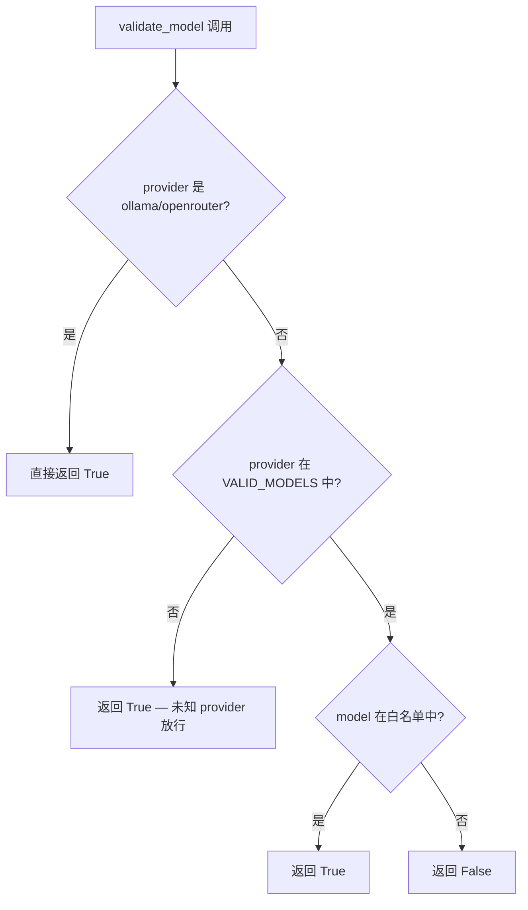
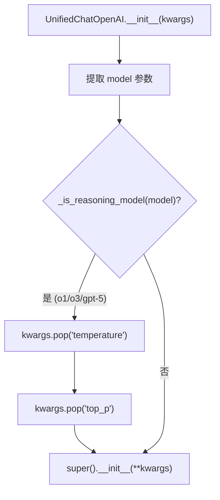
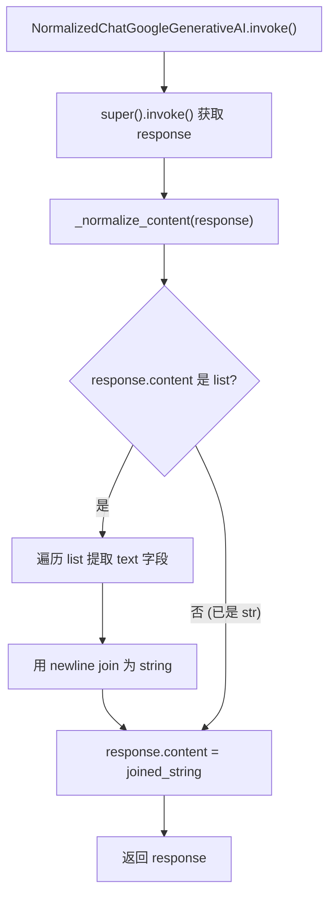

# PD-230.01 TradingAgents — 模型白名单与推理模型兼容层

> 文档编号：PD-230.01
> 来源：TradingAgents `tradingagents/llm_clients/`
> GitHub：https://github.com/TauricResearch/TradingAgents.git
> 问题域：PD-230 模型验证与兼容 Model Validation & Compatibility
> 状态：可复用方案

---

## 第 1 章 问题与动机

### 1.1 核心问题

多 LLM Provider 系统面临三类兼容性陷阱：

1. **模型名拼写错误静默失败** — 用户传入 `gpt-4o-mni`（少一个 i），Provider API 返回 404 或随机降级到默认模型，排查成本极高。
2. **推理模型参数不兼容** — OpenAI o1/o3/gpt-5 系列不支持 `temperature`/`top_p` 参数，传入会直接报错 400；但常规模型又需要这些参数。调用方不应关心这种差异。
3. **输出格式不一致** — Gemini 3 系列返回 `content` 为 `list[dict]` 格式（`[{"type": "text", "text": "..."}]`），而其他所有模型返回 `str`。下游代码如果假设 `content` 是字符串就会崩溃。

这三个问题的共同特征：**Provider 之间的差异不应泄漏到业务层**。

### 1.2 TradingAgents 的解法概述

TradingAgents 采用三层防御架构：

1. **白名单验证层** (`validators.py:7-82`) — 按 Provider 维护 `VALID_MODELS` 字典，对 OpenAI/Anthropic/Google/xAI 做模型名校验，对 Ollama/OpenRouter 等开放平台放行
2. **参数自动剥离层** (`openai_client.py:10-28`) — `UnifiedChatOpenAI` 子类在 `__init__` 中检测推理模型前缀（o1/o3/gpt-5），自动 pop 掉 `temperature`/`top_p`
3. **输出格式归一化层** (`google_client.py:9-28`) — `NormalizedChatGoogleGenerativeAI` 子类覆写 `invoke()`，将 Gemini 3 的 list 格式 content 拼接为 string
4. **思维参数映射层** (`google_client.py:45-59`) — 将统一的 `thinking_level` 配置映射为 Gemini 3 的 `thinking_level` 或 Gemini 2.5 的 `thinking_budget`，并处理 Pro/Flash 的参数差异
5. **工厂路由层** (`factory.py:9-43`) — `create_llm_client()` 按 provider 字符串路由到对应 Client 子类，统一入口

### 1.3 设计思想

| 设计原则 | 具体实现 | 理由 | 替代方案 |
|----------|----------|------|----------|
| 子类覆写而非外部包装 | `UnifiedChatOpenAI(ChatOpenAI)` 在 `__init__` 中剥离参数 | 对调用方完全透明，无需修改任何使用 ChatOpenAI 的代码 | 外部 wrapper 函数（需要改调用点） |
| 白名单而非黑名单 | `VALID_MODELS` 枚举所有合法模型 | 新模型必须显式添加，防止拼写错误静默通过 | 正则匹配（`gpt-*` 会放过拼写错误） |
| 开放平台豁免 | Ollama/OpenRouter 直接返回 True | 这些平台模型名由用户自定义，无法预知 | 统一校验（会误拦自定义模型） |
| 前缀匹配检测推理模型 | `model.startswith("o1") or model.startswith("o3")` | 推理模型系列有明确前缀规律，简单可靠 | 维护推理模型白名单（维护成本高） |
| invoke 覆写归一化 | 覆写 `invoke()` 而非 `_generate()` | invoke 是 LangChain 的标准调用入口，覆盖面最广 | 后处理中间件（增加调用链复杂度） |

---

## 第 2 章 源码实现分析

### 2.1 架构概览

TradingAgents 的 LLM 客户端体系采用经典的 **抽象工厂 + 模板方法** 模式：

```
┌─────────────────────────────────────────────────────────┐
│                   create_llm_client()                    │
│                    (factory.py:9)                        │
│  provider ──→ OpenAIClient / AnthropicClient / Google   │
└──────────┬──────────────┬──────────────┬────────────────┘
           │              │              │
    ┌──────▼──────┐ ┌────▼─────┐ ┌──────▼──────┐
    │ OpenAIClient│ │Anthropic │ │GoogleClient │
    │  (openai_   │ │ Client   │ │ (google_    │
    │  client.py) │ │          │ │  client.py) │
    └──────┬──────┘ └────┬─────┘ └──────┬──────┘
           │              │              │
    ┌──────▼──────┐      │       ┌──────▼──────────────┐
    │ UnifiedChat │      │       │ NormalizedChat       │
    │ OpenAI      │      │       │ GoogleGenerativeAI   │
    │ (剥离推理   │      │       │ (list→str 归一化)    │
    │  模型参数)  │      │       └──────────────────────┘
    └─────────────┘      │
                         │
              ┌──────────▼──────────┐
              │   validators.py     │
              │  VALID_MODELS 白名单 │
              └─────────────────────┘
```

关键设计：每个 Client 子类内部包装一个 LangChain Chat 模型的**增强子类**，在构造或调用阶段注入兼容逻辑，对外暴露标准的 `get_llm()` 接口。

### 2.2 核心实现

#### 2.2.1 模型白名单验证



对应源码 `tradingagents/llm_clients/validators.py:7-82`：

```python
VALID_MODELS = {
    "openai": [
        # GPT-5 series (2025)
        "gpt-5.2", "gpt-5.1", "gpt-5", "gpt-5-mini", "gpt-5-nano",
        # GPT-4.1 series (2025)
        "gpt-4.1", "gpt-4.1-mini", "gpt-4.1-nano",
        # o-series reasoning models
        "o4-mini", "o3", "o3-mini", "o1", "o1-preview",
        # GPT-4o series (legacy but still supported)
        "gpt-4o", "gpt-4o-mini",
    ],
    "anthropic": [
        "claude-opus-4-5", "claude-sonnet-4-5", "claude-haiku-4-5",
        "claude-opus-4-1-20250805", "claude-sonnet-4-20250514",
        "claude-3-7-sonnet-20250219",
        "claude-3-5-haiku-20241022", "claude-3-5-sonnet-20241022",
    ],
    "google": [
        "gemini-3-pro-preview", "gemini-3-flash-preview",
        "gemini-2.5-pro", "gemini-2.5-flash", "gemini-2.5-flash-lite",
        "gemini-2.0-flash", "gemini-2.0-flash-lite",
    ],
    "xai": [
        "grok-4-1-fast", "grok-4-1-fast-reasoning",
        "grok-4-1-fast-non-reasoning",
        "grok-4", "grok-4-0709",
        "grok-4-fast-reasoning", "grok-4-fast-non-reasoning",
    ],
}

def validate_model(provider: str, model: str) -> bool:
    provider_lower = provider.lower()
    if provider_lower in ("ollama", "openrouter"):
        return True
    if provider_lower not in VALID_MODELS:
        return True
    return model in VALID_MODELS[provider_lower]
```

#### 2.2.2 推理模型参数自动剥离



对应源码 `tradingagents/llm_clients/openai_client.py:10-28`：

```python
class UnifiedChatOpenAI(ChatOpenAI):
    """ChatOpenAI subclass that strips incompatible params for certain models."""

    def __init__(self, **kwargs):
        model = kwargs.get("model", "")
        if self._is_reasoning_model(model):
            kwargs.pop("temperature", None)
            kwargs.pop("top_p", None)
        super().__init__(**kwargs)

    @staticmethod
    def _is_reasoning_model(model: str) -> bool:
        model_lower = model.lower()
        return (
            model_lower.startswith("o1")
            or model_lower.startswith("o3")
            or "gpt-5" in model_lower
        )
```

#### 2.2.3 Gemini 输出格式归一化



对应源码 `tradingagents/llm_clients/google_client.py:9-28`：

```python
class NormalizedChatGoogleGenerativeAI(ChatGoogleGenerativeAI):
    """Gemini 3 models return content as list: [{'type': 'text', 'text': '...'}]
    This normalizes to string for consistent downstream handling."""

    def _normalize_content(self, response):
        content = response.content
        if isinstance(content, list):
            texts = [
                item.get("text", "") if isinstance(item, dict) and item.get("type") == "text"
                else item if isinstance(item, str) else ""
                for item in content
            ]
            response.content = "\n".join(t for t in texts if t)
        return response

    def invoke(self, input, config=None, **kwargs):
        return self._normalize_content(super().invoke(input, config, **kwargs))
```

### 2.3 实现细节

#### 思维参数跨模型映射

`GoogleClient.get_llm()` (`google_client.py:45-59`) 实现了一套精细的思维参数映射逻辑：

- **Gemini 3 Pro**: 支持 `thinking_level` = `"low"` | `"high"`（不支持 `"minimal"`，自动降级为 `"low"`）
- **Gemini 3 Flash**: 支持 `thinking_level` = `"minimal"` | `"low"` | `"medium"` | `"high"`
- **Gemini 2.5 系列**: 使用不同参数名 `thinking_budget`，`"high"` 映射为 `-1`（动态），其他映射为 `0`（禁用）

这种映射在 `TradingAgentsGraph._get_provider_kwargs()` (`trading_graph.py:133-148`) 中由统一配置 `google_thinking_level` 驱动，业务层只需设置一个字符串值。

#### 工厂路由与 Provider 复用

`create_llm_client()` (`factory.py:29-43`) 将 6 个 provider 映射到 3 个 Client 类：
- `openai` / `ollama` / `openrouter` → `OpenAIClient`（通过 `provider` 参数区分 base_url 和 API key）
- `xai` → `OpenAIClient`（xAI 兼容 OpenAI API 格式）
- `anthropic` → `AnthropicClient`
- `google` → `GoogleClient`

这意味着 OpenAI 兼容的 Provider 只需一个 Client 类，通过构造参数差异化。


---

## 第 3 章 迁移指南

### 3.1 迁移清单

**阶段 1：基础设施（必须）**

- [ ] 创建 `validators.py`，按你支持的 Provider 填充 `VALID_MODELS` 白名单
- [ ] 创建 `BaseLLMClient` 抽象基类，定义 `get_llm()` 和 `validate_model()` 接口
- [ ] 创建 `create_llm_client()` 工厂函数，按 provider 字符串路由

**阶段 2：兼容层（按需）**

- [ ] 如果使用 OpenAI o-series/gpt-5：创建 `UnifiedChatOpenAI` 子类，在 `__init__` 中剥离推理模型不兼容参数
- [ ] 如果使用 Gemini 3：创建 `NormalizedChatGoogleGenerativeAI` 子类，覆写 `invoke()` 归一化 list→str
- [ ] 如果使用 Gemini 思维模式：在 Client 中实现 `thinking_level` → `thinking_budget` 的参数映射

**阶段 3：集成（可选）**

- [ ] 在 `get_llm()` 中调用 `validate_model()` 并发出 warning（当前 TradingAgents 的 TODO 中也标记了这一点）
- [ ] 统一 API key 参数名（当前各 Client 不一致：`api_key` vs `google_api_key`）

### 3.2 适配代码模板

以下是一个可直接复用的最小实现，覆盖白名单 + 推理模型剥离 + 输出归一化：

```python
"""llm_compat.py — 多 Provider LLM 兼容层（可直接复用）"""
import warnings
from abc import ABC, abstractmethod
from typing import Any, Optional

from langchain_openai import ChatOpenAI
from langchain_google_genai import ChatGoogleGenerativeAI


# ── 1. 模型白名单 ──────────────────────────────────────
VALID_MODELS: dict[str, list[str]] = {
    "openai": ["gpt-5.2", "gpt-5", "gpt-5-mini", "o3", "o3-mini", "gpt-4o"],
    "google": ["gemini-3-pro-preview", "gemini-2.5-pro", "gemini-2.5-flash"],
    # 按需扩展...
}

OPEN_PROVIDERS = {"ollama", "openrouter"}  # 不校验模型名


def validate_model(provider: str, model: str) -> bool:
    p = provider.lower()
    if p in OPEN_PROVIDERS or p not in VALID_MODELS:
        return True
    return model in VALID_MODELS[p]


# ── 2. 推理模型参数剥离 ────────────────────────────────
REASONING_PREFIXES = ("o1", "o3", "o4")
REASONING_KEYWORDS = ("gpt-5",)


class SafeChatOpenAI(ChatOpenAI):
    """自动剥离推理模型不兼容的 temperature/top_p 参数。"""

    def __init__(self, **kwargs):
        model = kwargs.get("model", "").lower()
        if any(model.startswith(p) for p in REASONING_PREFIXES) or \
           any(k in model for k in REASONING_KEYWORDS):
            kwargs.pop("temperature", None)
            kwargs.pop("top_p", None)
        super().__init__(**kwargs)


# ── 3. Gemini 输出归一化 ───────────────────────────────
class NormalizedGemini(ChatGoogleGenerativeAI):
    """将 Gemini 3 的 list 格式 content 归一化为 string。"""

    def _normalize(self, response):
        if isinstance(response.content, list):
            texts = []
            for item in response.content:
                if isinstance(item, dict) and item.get("type") == "text":
                    texts.append(item.get("text", ""))
                elif isinstance(item, str):
                    texts.append(item)
            response.content = "\n".join(t for t in texts if t)
        return response

    def invoke(self, input, config=None, **kwargs):
        return self._normalize(super().invoke(input, config, **kwargs))


# ── 4. 工厂函数 ───────────────────────────────────────
def create_llm(provider: str, model: str, **kwargs) -> Any:
    if not validate_model(provider, model):
        warnings.warn(f"Model '{model}' not in {provider} whitelist")

    if provider in ("openai", "ollama", "openrouter", "xai"):
        return SafeChatOpenAI(model=model, **kwargs)
    elif provider == "google":
        return NormalizedGemini(model=model, **kwargs)
    else:
        raise ValueError(f"Unsupported provider: {provider}")
```

### 3.3 适用场景

| 场景 | 适用度 | 说明 |
|------|--------|------|
| 多 Provider LLM 应用 | ⭐⭐⭐ | 核心场景，白名单 + 参数剥离 + 输出归一化三件套 |
| 单 Provider 但含推理模型 | ⭐⭐⭐ | 只需 UnifiedChatOpenAI 子类即可 |
| LangChain 生态项目 | ⭐⭐⭐ | 直接继承 LangChain Chat 模型类，零侵入 |
| 非 LangChain 项目 | ⭐⭐ | 思路可复用，但子类继承需改为 wrapper 模式 |
| 仅使用 OpenRouter 等聚合平台 | ⭐ | 聚合平台已处理兼容性，白名单价值降低 |

---

## 第 4 章 测试用例

```python
"""test_model_compat.py — 基于 TradingAgents 真实接口的测试"""
import pytest
from unittest.mock import patch, MagicMock


# ── 白名单验证测试 ─────────────────────────────────────
class TestValidateModel:
    """对应 validators.py:69-82"""

    def test_valid_openai_model(self):
        from tradingagents.llm_clients.validators import validate_model
        assert validate_model("openai", "gpt-5.2") is True

    def test_invalid_openai_model(self):
        from tradingagents.llm_clients.validators import validate_model
        assert validate_model("openai", "gpt-4o-mni") is False  # 拼写错误

    def test_ollama_always_valid(self):
        from tradingagents.llm_clients.validators import validate_model
        assert validate_model("ollama", "any-custom-model") is True

    def test_openrouter_always_valid(self):
        from tradingagents.llm_clients.validators import validate_model
        assert validate_model("openrouter", "meta-llama/llama-3") is True

    def test_unknown_provider_passes(self):
        from tradingagents.llm_clients.validators import validate_model
        assert validate_model("unknown_provider", "any-model") is True

    def test_xai_valid_model(self):
        from tradingagents.llm_clients.validators import validate_model
        assert validate_model("xai", "grok-4") is True


# ── 推理模型检测测试 ───────────────────────────────────
class TestReasoningModelDetection:
    """对应 openai_client.py:21-28"""

    def test_o1_is_reasoning(self):
        from tradingagents.llm_clients.openai_client import UnifiedChatOpenAI
        assert UnifiedChatOpenAI._is_reasoning_model("o1") is True
        assert UnifiedChatOpenAI._is_reasoning_model("o1-preview") is True

    def test_o3_is_reasoning(self):
        from tradingagents.llm_clients.openai_client import UnifiedChatOpenAI
        assert UnifiedChatOpenAI._is_reasoning_model("o3") is True
        assert UnifiedChatOpenAI._is_reasoning_model("o3-mini") is True

    def test_gpt5_is_reasoning(self):
        from tradingagents.llm_clients.openai_client import UnifiedChatOpenAI
        assert UnifiedChatOpenAI._is_reasoning_model("gpt-5.2") is True
        assert UnifiedChatOpenAI._is_reasoning_model("gpt-5-mini") is True

    def test_gpt4o_is_not_reasoning(self):
        from tradingagents.llm_clients.openai_client import UnifiedChatOpenAI
        assert UnifiedChatOpenAI._is_reasoning_model("gpt-4o") is False
        assert UnifiedChatOpenAI._is_reasoning_model("gpt-4.1") is False


# ── 输出归一化测试 ─────────────────────────────────────
class TestNormalizeContent:
    """对应 google_client.py:16-25"""

    def test_list_content_normalized_to_string(self):
        from tradingagents.llm_clients.google_client import NormalizedChatGoogleGenerativeAI
        instance = NormalizedChatGoogleGenerativeAI.__new__(NormalizedChatGoogleGenerativeAI)
        mock_response = MagicMock()
        mock_response.content = [
            {"type": "text", "text": "Hello"},
            {"type": "text", "text": "World"},
        ]
        result = instance._normalize_content(mock_response)
        assert result.content == "Hello\nWorld"

    def test_string_content_unchanged(self):
        from tradingagents.llm_clients.google_client import NormalizedChatGoogleGenerativeAI
        instance = NormalizedChatGoogleGenerativeAI.__new__(NormalizedChatGoogleGenerativeAI)
        mock_response = MagicMock()
        mock_response.content = "Already a string"
        result = instance._normalize_content(mock_response)
        assert result.content == "Already a string"

    def test_mixed_list_content(self):
        from tradingagents.llm_clients.google_client import NormalizedChatGoogleGenerativeAI
        instance = NormalizedChatGoogleGenerativeAI.__new__(NormalizedChatGoogleGenerativeAI)
        mock_response = MagicMock()
        mock_response.content = [
            {"type": "text", "text": "Part 1"},
            "raw string item",
            {"type": "image", "url": "..."},  # 非 text 类型，应被忽略
        ]
        result = instance._normalize_content(mock_response)
        assert result.content == "Part 1\nraw string item"
```


---

## 第 5 章 跨域关联

| 关联域 | 关系类型 | 说明 |
|--------|----------|------|
| PD-03 容错与重试 | 协同 | 白名单验证是容错的第一道防线——在 API 调用前拦截无效模型名，避免浪费重试预算 |
| PD-12 推理增强 | 依赖 | 推理模型（o1/o3/gpt-5）的参数剥离是使用推理增强能力的前提；`reasoning_effort` 参数透传也在此层处理 |
| PD-11 可观测性 | 协同 | `callbacks` 参数在所有 Client 的 `get_llm()` 中统一透传，为 StatsCallback 等可观测性组件提供注入点 |
| PD-04 工具系统 | 协同 | 工厂模式 `create_llm_client()` 与工具系统的 Provider 路由思路一致——按字符串标识分发到具体实现 |

---

## 第 6 章 来源文件索引

| 文件 | 行范围 | 关键实现 |
|------|--------|----------|
| `tradingagents/llm_clients/validators.py` | L1-L83 | VALID_MODELS 白名单字典 + validate_model() 校验函数 |
| `tradingagents/llm_clients/openai_client.py` | L10-L28 | UnifiedChatOpenAI 推理模型参数剥离子类 |
| `tradingagents/llm_clients/openai_client.py` | L31-L73 | OpenAIClient 多 Provider 路由（OpenAI/xAI/Ollama/OpenRouter） |
| `tradingagents/llm_clients/google_client.py` | L9-L28 | NormalizedChatGoogleGenerativeAI 输出归一化子类 |
| `tradingagents/llm_clients/google_client.py` | L37-L65 | GoogleClient 思维参数映射（thinking_level → thinking_budget） |
| `tradingagents/llm_clients/base_client.py` | L1-L22 | BaseLLMClient 抽象基类定义 |
| `tradingagents/llm_clients/factory.py` | L9-L43 | create_llm_client() 工厂路由函数 |
| `tradingagents/llm_clients/anthropic_client.py` | L9-L27 | AnthropicClient 实现 |
| `tradingagents/graph/trading_graph.py` | L74-L95 | TradingAgentsGraph 中 LLM 客户端创建与 provider kwargs 注入 |
| `tradingagents/graph/trading_graph.py` | L133-L148 | _get_provider_kwargs() 统一配置到 Provider 特定参数的映射 |
| `tradingagents/default_config.py` | L11-L17 | LLM 配置项定义（provider/model/thinking 参数） |

---

## 第 7 章 横向对比维度

```json comparison_data
{
  "project": "TradingAgents",
  "dimensions": {
    "验证策略": "VALID_MODELS 白名单字典，按 Provider 枚举合法模型名，开放平台豁免",
    "参数兼容": "UnifiedChatOpenAI 子类 __init__ 前缀匹配推理模型，自动 pop temperature/top_p",
    "输出归一化": "NormalizedChatGoogleGenerativeAI 覆写 invoke()，list→str 拼接",
    "思维参数映射": "统一 thinking_level 配置，按模型系列映射为 thinking_level 或 thinking_budget",
    "Provider 复用": "6 个 provider 映射到 3 个 Client 类，OpenAI 兼容系共用 OpenAIClient"
  }
}
```

```json domain_metadata
{
  "solution_summary": "TradingAgents 通过 VALID_MODELS 白名单 + UnifiedChatOpenAI 推理模型参数剥离 + NormalizedChatGoogleGenerativeAI 输出归一化三层防御，实现 6 Provider 跨模型兼容",
  "description": "LLM 子类覆写模式实现零侵入的 Provider 差异屏蔽",
  "sub_problems": [
    "思维参数跨代际映射（同 Provider 不同代模型参数名不同）",
    "开放平台（Ollama/OpenRouter）的白名单豁免策略"
  ],
  "best_practices": [
    "子类覆写 __init__/invoke 而非外部 wrapper，对调用方完全透明",
    "工厂函数复用 Client 类覆盖多个 OpenAI 兼容 Provider"
  ]
}
```

