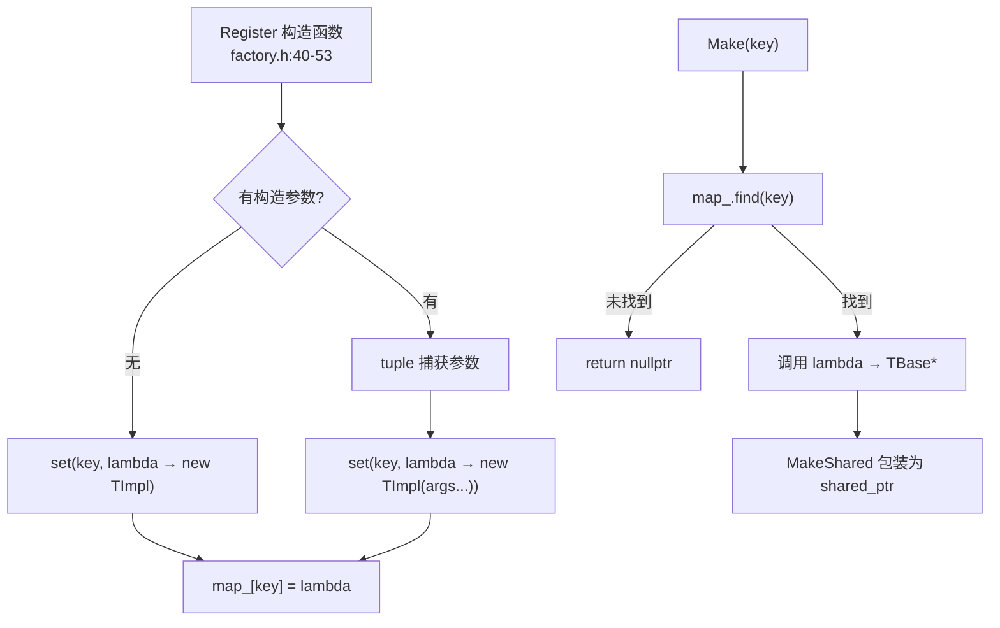
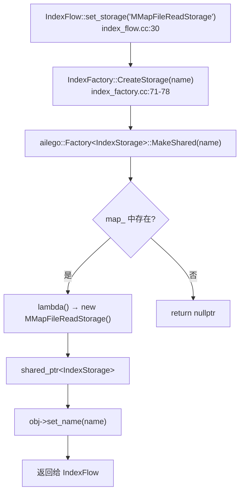

# PD-231.01 zvec — C++ 模板工厂与编译期宏自动注册系统

> 文档编号：PD-231.01
> 来源：zvec `src/include/zvec/ailego/pattern/factory.h`
> GitHub：https://github.com/alibaba/zvec.git
> 问题域：PD-231 插件工厂注册系统 Plugin Factory Registry
> 状态：可复用方案

---

## 第 1 章 问题与动机

### 1.1 核心问题

向量检索引擎需要管理大量可替换组件——距离度量（Metric）、索引构建器（Builder）、搜索器（Searcher）、存储后端（Storage）等。这些组件有以下特征：

1. **数量多**：zvec 管理 14 类组件（Metric/Logger/Dumper/Storage/Converter/Reformer/Trainer/Builder/Searcher/Streamer/Reducer/Cluster/StreamerReducer/Refiner），每类下有多个具体实现
2. **按名称动态创建**：上层业务通过字符串名称（如 `"SquaredEuclidean"`、`"MMapFileReadStorage"`）选择组件，不直接依赖具体类
3. **频繁扩展**：新增一种距离度量或存储后端不应修改工厂代码
4. **编译期安全**：注册错误应在编译期暴露，而非运行时崩溃

如果用传统的 `if-else` 或 `switch-case` 分发，每新增一个组件就要修改工厂函数，违反开闭原则，且容易遗漏。

### 1.2 zvec 的解法概述

zvec 采用两层工厂架构：

1. **底层通用工厂** `ailego::Factory<TBase>`（`factory.h:30-164`）：C++ 模板单例工厂，提供 `Register`/`Make`/`Has`/`Classes` 四个核心能力
2. **宏注册** `AILEGO_FACTORY_REGISTER`（`factory.h:167-169`）：一行宏在 `.cc` 文件末尾完成编译期自动注册，利用静态变量初始化机制
3. **领域工厂** `IndexFactory`（`index_factory.h:37-170`）：面向业务的静态方法集合，为 14 类组件提供类型安全的 `Create/Has/All` 三件套
4. **领域宏** `INDEX_FACTORY_REGISTER_*`（`index_factory.h:173-284`）：每类组件一对宏（普通注册 + 别名注册），封装 `AILEGO_FACTORY_REGISTER` 并固定基类参数
5. **别名 + 构造参数传递**：同一实现类可注册多个名称，并在注册时传入不同构造参数（如 `CosineReformer` 注册为 6 个不同精度的别名，`cosine_reformer.cc:267-284`）

### 1.3 设计思想

| 设计原则 | 具体实现 | 理由 | 替代方案 |
|----------|----------|------|----------|
| 编译期注册 | 静态变量 `Register` 构造函数触发 `Factory::set()` | 链接即注册，无需手动维护列表 | 运行时 `init()` 函数集中注册 |
| 模板单例 | `Factory<TBase>` 每个基类一个独立注册表 | 类型隔离，Metric 和 Searcher 的注册表互不干扰 | 全局统一注册表 + 类型标签 |
| 宏封装 | `AILEGO_FACTORY_REGISTER` 生成唯一静态变量名 | 一行代码完成注册，降低出错概率 | 手动构造 `Register<Impl>` 对象 |
| 别名机制 | `_ALIAS` 宏允许名称与类名不同 | 同一实现不同配置可注册多个名称 | 每个配置写一个子类 |
| 构造参数转发 | `Register` 构造函数接受变参并用 `tuple` 存储 | 注册时绑定参数，创建时自动传入 | 创建后再调用 `configure()` |

---

## 第 2 章 源码实现分析

### 2.1 架构概览

```
┌─────────────────────────────────────────────────────────────────┐
│                     IndexFactory (领域门面)                       │
│  CreateMetric / CreateBuilder / CreateSearcher / ... (14 类)     │
│  HasMetric / HasBuilder / HasSearcher / ...                      │
│  AllMetrics / AllBuilders / AllSearchers / ...                    │
└──────────────────────────┬──────────────────────────────────────┘
                           │ 委托
┌──────────────────────────▼──────────────────────────────────────┐
│              ailego::Factory<TBase> (模板单例工厂)                │
│                                                                  │
│  ┌─────────────┐   ┌──────────────────────────────────────┐     │
│  │  Instance()  │──→│ map_: {name → lambda() → TBase*}     │     │
│  │  (static     │   │   "SquaredEuclidean" → []{new ...}   │     │
│  │   singleton) │   │   "Cosine"           → []{new ...}   │     │
│  └─────────────┘   │   "InnerProduct"      → []{new ...}   │     │
│                     └──────────────────────────────────────┘     │
│                                                                  │
│  Make(key) ──→ map_.find(key) ──→ lambda() ──→ TBase*           │
│  MakeShared(key) ──→ shared_ptr<TBase>(Make(key))               │
│  Has(key) ──→ map_.find(key) != end                             │
│  Classes() ──→ iterate map_ keys                                │
└──────────────────────────▲──────────────────────────────────────┘
                           │ 编译期注册
┌──────────────────────────┴──────────────────────────────────────┐
│  AILEGO_FACTORY_REGISTER(Name, Base, Impl, args...)              │
│  展开为:                                                         │
│  static Factory<Base>::Register<Impl>                            │
│      __ailegoFactoryRegister_Name("Name", args...);              │
│                                                                  │
│  Register 构造函数 → Factory::Instance()->set("Name", lambda)    │
└─────────────────────────────────────────────────────────────────┘
```

### 2.2 核心实现

#### 2.2.1 通用模板工厂 `ailego::Factory<TBase>`



对应源码 `src/include/zvec/ailego/pattern/factory.h:30-169`：

```cpp
template <typename TBase>
class Factory {
 public:
  template <typename TImpl, typename = typename std::enable_if<
                                std::is_base_of<TBase, TImpl>::value>::type>
  class Register {
   public:
    // 无参注册：factory.h:40-42
    Register(const char *key) {
      Factory::Instance()->set(key, [] { return Register::Construct(); });
    }
    // 带参注册：factory.h:45-53 — tuple 捕获变参
    template <typename... TArgs>
    Register(const char *key, TArgs &&...args) {
      std::tuple<TArgs...> tuple(std::forward<TArgs>(args)...);
      Factory::Instance()->set(key, [tuple] {
        return Register::Construct(
            tuple, typename TupleIndexMaker<sizeof...(TArgs)>::Type());
      });
    }
   protected:
    // TupleIndex 展开：factory.h:57-68
    template <size_t N, size_t... I>
    struct TupleIndexMaker : TupleIndexMaker<N - 1, N - 1, I...> {};
    template <size_t... I>
    struct TupleIndexMaker<0, I...> { typedef TupleIndex<I...> Type; };
    // 实际构造：factory.h:72-80
    template <typename... TArgs, size_t... I>
    static TImpl *Construct(const std::tuple<TArgs...> &tuple, TupleIndex<I...>) {
      return new (std::nothrow) TImpl(std::get<I>(tuple)...);
    }
    static TImpl *Construct(void) { return new (std::nothrow) TImpl(); }
  };

  static TBase *Make(const char *key) { return Factory::Instance()->produce(key); }
  static std::shared_ptr<TBase> MakeShared(const char *key) {
    return std::shared_ptr<TBase>(Factory::Make(key));
  }
  static bool Has(const char *key) { return Factory::Instance()->has(key); }
  static std::vector<std::string> Classes(void) { return Factory::Instance()->classes(); }

 protected:
  static Factory *Instance(void) {   // factory.h:113-116 — 函数局部静态单例
    static Factory factory;
    return (&factory);
  }
  // map_ 使用 const char* 作为 key，要求静态字符串：factory.h:163
  std::map<const char *, std::function<TBase *()>, KeyComparer> map_;
};

// 宏注册：factory.h:167-169
#define AILEGO_FACTORY_REGISTER(__NAME__, __BASE__, __IMPL__, ...) \
  static ailego::Factory<__BASE__>::Register<__IMPL__>             \
      __ailegoFactoryRegister_##__NAME__(#__NAME__, ##__VA_ARGS__)
```

关键设计点：
- `std::is_base_of` SFINAE 约束（`factory.h:35-36`）确保只有 `TBase` 的子类才能注册
- `new (std::nothrow)` 避免构造失败抛异常（`factory.h:74,79`）
- `KeyComparer` 用 `strcmp` 比较 `const char*`（`factory.h:155-159`），要求 key 必须是静态字符串（宏展开的字符串字面量满足此要求）

#### 2.2.2 领域工厂 `IndexFactory` 的统一三件套



对应源码 `src/core/framework/index_factory.cc:71-86`：

```cpp
IndexStorage::Pointer IndexFactory::CreateStorage(const std::string &name) {
  IndexStorage::Pointer obj =
      ailego::Factory<IndexStorage>::MakeShared(name.c_str());
  if (obj) {
    obj->set_name(name);  // IndexModule::set_name 是 friend 方法
  }
  return obj;
}

bool IndexFactory::HasStorage(const std::string &name) {
  return ailego::Factory<IndexStorage>::Has(name.c_str());
}

std::vector<std::string> IndexFactory::AllStorages(void) {
  return ailego::Factory<IndexStorage>::Classes();
}
```

14 类组件全部遵循相同的 `Create/Has/All` 三件套模式（`index_factory.cc:20-258`），唯一区别是模板参数 `TBase` 不同。

#### 2.2.3 别名注册与构造参数传递

对应源码 `src/core/quantizer/cosine_reformer.cc:267-284`：

```cpp
// 同一个 CosineReformer 类，注册 6 个不同名称，传入不同精度参数
INDEX_FACTORY_REGISTER_REFORMER_ALIAS(CosineNormalizeReformer, CosineReformer,
                                      IndexMeta::DataType::DT_FP32);
INDEX_FACTORY_REGISTER_REFORMER_ALIAS(CosineFp16Reformer, CosineReformer,
                                      IndexMeta::DataType::DT_FP16);
INDEX_FACTORY_REGISTER_REFORMER_ALIAS(CosineInt8Reformer, CosineReformer,
                                      IndexMeta::DataType::DT_INT8);
INDEX_FACTORY_REGISTER_REFORMER_ALIAS(CosineInt4Reformer, CosineReformer,
                                      IndexMeta::DataType::DT_INT4);
```

宏展开后等价于：
```cpp
static ailego::Factory<IndexReformer>::Register<CosineReformer>
    __ailegoFactoryRegister_CosineInt8Reformer("CosineInt8Reformer",
                                                IndexMeta::DataType::DT_INT8);
```

`Register` 构造函数将 `DT_INT8` 捕获到 `tuple` 中，创建时自动传给 `CosineReformer(DataType)` 构造函数。

### 2.3 实现细节

**基类层次结构**（`index_module.h:24-64`）：

```
IndexModule (name_, revision_, set_name friend IndexFactory)
├── IndexMetric (距离度量)
├── IndexStorage (存储后端)
├── IndexConverter (数据转换)
├── IndexReformer (查询变换)
├── IndexLogger (日志)
├── IndexDumper (持久化)
└── IndexRunner
    ├── IndexBuilder (索引构建)
    ├── IndexSearcher (搜索)
    ├── IndexStreamer (流式处理)
    ├── IndexTrainer (训练)
    ├── IndexReducer (归约)
    ├── IndexCluster (聚类)
    ├── IndexStreamerReducer (流式归约)
    └── IndexRefiner (精排)
```

`IndexModule` 的 `set_name` 声明为 `friend struct IndexFactory`（`index_module.h:48`），确保只有工厂能设置组件名称，外部代码无法篡改。

**消费端模式**（`index_flow.cc:28-42`）：

```cpp
int IndexFlow::set_storage(const std::string &name, const ailego::Params &params) {
  storage_ = IndexFactory::CreateStorage(name);  // 按名称创建
  if (!storage_) {
    LOG_ERROR("Failed to create a index storage with name: %s", name.c_str());
    return IndexError_NoExist;
  }
  int ret = storage_->init(params);  // 统一初始化接口
  if (ret < 0) {
    storage_ = nullptr;
    return ret;
  }
  return 0;
}
```

模式固定：`Create → null check → init(params) → error check`，所有 14 类组件的消费方式一致。

---

## 第 3 章 迁移指南

### 3.1 迁移清单

**阶段 1：基础工厂（1 个文件）**
- [ ] 复制 `ailego::Factory<TBase>` 模板类到项目中（约 170 行，零外部依赖）
- [ ] 复制 `AILEGO_FACTORY_REGISTER` 宏定义
- [ ] 确认编译器支持 C++11（`std::tuple`、变参模板、`std::function`）

**阶段 2：定义基类体系**
- [ ] 为每类可替换组件定义抽象基类（含 `typedef std::shared_ptr<Base> Pointer`）
- [ ] 基类声明 `friend struct YourFactory` 以保护 `set_name` 等内部方法

**阶段 3：领域工厂 + 领域宏**
- [ ] 创建领域工厂 struct，为每类组件提供 `Create/Has/All` 三件套
- [ ] 为每类组件定义 `YOUR_FACTORY_REGISTER_XXX` 和 `YOUR_FACTORY_REGISTER_XXX_ALIAS` 宏

**阶段 4：注册具体实现**
- [ ] 在每个 `.cc` 文件末尾用宏注册实现类
- [ ] 需要别名时使用 `_ALIAS` 宏并传入构造参数

### 3.2 适配代码模板

以下是一个可直接编译运行的 C++ 迁移模板：

```cpp
// === plugin_factory.h ===
#pragma once
#include <cstring>
#include <functional>
#include <map>
#include <memory>
#include <string>
#include <tuple>
#include <vector>

// 通用模板工厂（直接复用 zvec ailego::Factory 设计）
template <typename TBase>
class PluginFactory {
 public:
  template <typename TImpl,
            typename = typename std::enable_if<
                std::is_base_of<TBase, TImpl>::value>::type>
  class Register {
   public:
    Register(const char *key) {
      PluginFactory::Instance()->set(key, [] {
        return new (std::nothrow) TImpl();
      });
    }
    template <typename... TArgs>
    Register(const char *key, TArgs &&...args) {
      auto tuple = std::make_tuple(std::forward<TArgs>(args)...);
      PluginFactory::Instance()->set(key, [tuple] {
        return ConstructFromTuple(
            tuple,
            std::make_index_sequence<sizeof...(TArgs)>{});
      });
    }
   private:
    template <typename Tuple, size_t... I>
    static TImpl *ConstructFromTuple(const Tuple &t,
                                     std::index_sequence<I...>) {
      return new (std::nothrow) TImpl(std::get<I>(t)...);
    }
  };

  static TBase *Make(const char *key) {
    return PluginFactory::Instance()->produce(key);
  }
  static std::shared_ptr<TBase> MakeShared(const char *key) {
    return std::shared_ptr<TBase>(Make(key));
  }
  static bool Has(const char *key) {
    return PluginFactory::Instance()->has(key);
  }
  static std::vector<std::string> Classes() {
    return PluginFactory::Instance()->classes();
  }

 protected:
  static PluginFactory *Instance() {
    static PluginFactory factory;
    return &factory;
  }
  template <typename TFunc>
  void set(const char *key, TFunc &&func) { map_[key] = std::forward<TFunc>(func); }
  TBase *produce(const char *key) {
    auto it = map_.find(key);
    return it != map_.end() ? it->second() : nullptr;
  }
  bool has(const char *key) { return map_.find(key) != map_.end(); }
  std::vector<std::string> classes() const {
    std::vector<std::string> v;
    for (auto &kv : map_) v.push_back(kv.first);
    return v;
  }

 private:
  struct KeyCmp {
    bool operator()(const char *a, const char *b) const {
      return std::strcmp(a, b) < 0;
    }
  };
  std::map<const char *, std::function<TBase *()>, KeyCmp> map_;
};

#define PLUGIN_FACTORY_REGISTER(__NAME__, __BASE__, __IMPL__, ...) \
  static PluginFactory<__BASE__>::Register<__IMPL__>               \
      __pluginFactoryReg_##__NAME__(#__NAME__, ##__VA_ARGS__)
```

使用示例：

```cpp
// === metric_base.h ===
struct Metric {
  using Pointer = std::shared_ptr<Metric>;
  virtual ~Metric() = default;
  virtual float compute(const float *a, const float *b, size_t dim) = 0;
};

// === euclidean_metric.cc ===
#include "metric_base.h"
#include "plugin_factory.h"
#include <cmath>

class EuclideanMetric : public Metric {
 public:
  float compute(const float *a, const float *b, size_t dim) override {
    float sum = 0;
    for (size_t i = 0; i < dim; ++i) sum += (a[i] - b[i]) * (a[i] - b[i]);
    return std::sqrt(sum);
  }
};
PLUGIN_FACTORY_REGISTER(Euclidean, Metric, EuclideanMetric);

// === main.cc ===
auto metric = PluginFactory<Metric>::MakeShared("Euclidean");
float a[] = {1, 0}, b[] = {0, 1};
printf("dist = %f\n", metric->compute(a, b, 2));  // 1.414214
```

### 3.3 适用场景

| 场景 | 适用度 | 说明 |
|------|--------|------|
| C++ 插件系统（编译期已知所有插件） | ⭐⭐⭐ | 完美匹配，零运行时开销 |
| 向量数据库/搜索引擎组件管理 | ⭐⭐⭐ | zvec 原生场景 |
| 需要按配置文件名称创建对象 | ⭐⭐⭐ | 字符串 → 对象的标准需求 |
| 需要运行时动态加载 .so/.dll | ⭐ | 不适用，需要 dlopen + 额外机制 |
| Python/TypeScript 等动态语言 | ⭐ | 这些语言有更简单的注册方式（装饰器/元类） |
| 需要热更新/卸载插件 | ⭐ | 静态注册无法卸载，需要改用动态注册表 |

---

## 第 4 章 测试用例

```cpp
#include <cassert>
#include <cstring>
#include <iostream>
#include "plugin_factory.h"

// === 测试基类 ===
struct Animal {
  using Pointer = std::shared_ptr<Animal>;
  virtual ~Animal() = default;
  virtual const char *speak() = 0;
};

// === 测试实现 ===
class Dog : public Animal {
 public:
  const char *speak() override { return "Woof"; }
};
PLUGIN_FACTORY_REGISTER(Dog, Animal, Dog);

class Cat : public Animal {
 public:
  const char *speak() override { return "Meow"; }
};
PLUGIN_FACTORY_REGISTER(Cat, Animal, Cat);

// === 带参数的实现 ===
class ParamAnimal : public Animal {
 public:
  ParamAnimal(int legs = 4) : legs_(legs) {}
  const char *speak() override { return legs_ == 2 ? "Tweet" : "Moo"; }
  int legs() const { return legs_; }
 private:
  int legs_;
};
PLUGIN_FACTORY_REGISTER(Bird, Animal, ParamAnimal, 2);
PLUGIN_FACTORY_REGISTER(Cow, Animal, ParamAnimal, 4);

// === 测试函数 ===
void test_basic_create() {
  auto dog = PluginFactory<Animal>::MakeShared("Dog");
  assert(dog != nullptr);
  assert(std::strcmp(dog->speak(), "Woof") == 0);
  std::cout << "[PASS] test_basic_create\n";
}

void test_has() {
  assert(PluginFactory<Animal>::Has("Dog") == true);
  assert(PluginFactory<Animal>::Has("Cat") == true);
  assert(PluginFactory<Animal>::Has("Fish") == false);
  std::cout << "[PASS] test_has\n";
}

void test_classes_enumeration() {
  auto classes = PluginFactory<Animal>::Classes();
  assert(classes.size() >= 4);  // Dog, Cat, Bird, Cow
  std::cout << "[PASS] test_classes_enumeration (found " << classes.size() << " classes)\n";
}

void test_unknown_returns_nullptr() {
  auto ptr = PluginFactory<Animal>::MakeShared("NonExistent");
  assert(ptr == nullptr);
  std::cout << "[PASS] test_unknown_returns_nullptr\n";
}

void test_constructor_args() {
  auto bird = PluginFactory<Animal>::MakeShared("Bird");
  assert(bird != nullptr);
  assert(std::strcmp(bird->speak(), "Tweet") == 0);
  auto cow = PluginFactory<Animal>::MakeShared("Cow");
  assert(std::strcmp(cow->speak(), "Moo") == 0);
  std::cout << "[PASS] test_constructor_args\n";
}

void test_type_isolation() {
  // Animal 工厂不应影响其他类型的工厂
  struct Robot {
    using Pointer = std::shared_ptr<Robot>;
    virtual ~Robot() = default;
  };
  assert(PluginFactory<Robot>::Has("Dog") == false);
  assert(PluginFactory<Robot>::Classes().empty());
  std::cout << "[PASS] test_type_isolation\n";
}

int main() {
  test_basic_create();
  test_has();
  test_classes_enumeration();
  test_unknown_returns_nullptr();
  test_constructor_args();
  test_type_isolation();
  std::cout << "\nAll tests passed!\n";
  return 0;
}
```

---

## 第 5 章 跨域关联

| 关联域 | 关系类型 | 说明 |
|--------|----------|------|
| PD-04 工具系统 | 协同 | 工厂模式是工具系统的底层支撑——Agent 的工具注册本质上也是"按名称创建实例"，zvec 的 Factory 模式可直接用于 Tool Registry |
| PD-02 多 Agent 编排 | 协同 | 编排器需要按名称创建不同类型的 Agent/Worker，工厂模式提供统一的创建入口 |
| PD-10 中间件管道 | 协同 | 管道中的中间件组件可通过工厂按名称创建和组装，实现配置驱动的管道构建 |
| PD-06 记忆持久化 | 弱关联 | 存储后端（如 zvec 的 IndexStorage）通过工厂创建，不同持久化策略可作为工厂的不同实现 |

---

## 第 6 章 来源文件索引

| 文件 | 行范围 | 关键实现 |
|------|--------|----------|
| `src/include/zvec/ailego/pattern/factory.h` | L30-L169 | 通用模板工厂 `Factory<TBase>` + `Register` 内部类 + `AILEGO_FACTORY_REGISTER` 宏 |
| `src/include/zvec/core/framework/index_factory.h` | L37-L170 | `IndexFactory` 领域工厂 struct，14 类组件的 Create/Has/All 声明 |
| `src/include/zvec/core/framework/index_factory.h` | L173-L284 | 14 对 `INDEX_FACTORY_REGISTER_*` / `INDEX_FACTORY_REGISTER_*_ALIAS` 领域宏 |
| `src/core/framework/index_factory.cc` | L20-L258 | `IndexFactory` 全部 42 个静态方法实现（14 类 × 3 方法） |
| `src/include/zvec/core/framework/index_module.h` | L24-L64 | `IndexModule` 基类，`friend struct IndexFactory` 保护 `set_name` |
| `src/include/zvec/core/framework/index_runner.h` | L33-L740 | `IndexRunner` 中间基类（Builder/Searcher/Streamer 等的父类） |
| `src/core/framework/index_flow.cc` | L28-L42 | 消费端模式：`CreateStorage → null check → init → error check` |
| `src/core/quantizer/cosine_reformer.cc` | L267-L284 | 别名注册 + 构造参数传递的典型用例（6 个 CosineReformer 变体） |
| `src/core/metric/euclidean_metric.cc` | L1091-L1094 | Metric 注册示例（SquaredEuclidean / Euclidean / Sparse 变体） |
| `src/core/utility/memory_read_storage.cc` | L246 | Storage 注册示例 |

---

## 第 7 章 横向对比维度

```json comparison_data
{
  "project": "zvec",
  "dimensions": {
    "注册机制": "C++ 模板 + 宏展开静态变量，编译期自动注册",
    "组件类型数": "14 类组件（Metric/Builder/Searcher/Storage 等），每类独立注册表",
    "别名支持": "ALIAS 宏支持同一实现注册多个名称并传入不同构造参数",
    "类型安全": "std::is_base_of SFINAE 编译期约束 + friend 保护 set_name",
    "发现能力": "Classes() 枚举所有已注册名称，Has() 按名称查询存在性",
    "内存管理": "MakeShared/MakeUnique 返回智能指针，new(nothrow) 防异常"
  }
}
```

### 域元数据补充

```json domain_metadata
{
  "solution_summary": "zvec 用 C++ 模板单例工厂 + AILEGO_FACTORY_REGISTER 宏实现 14 类组件的编译期自动注册，支持别名和构造参数转发",
  "description": "C++ 编译期静态注册与模板元编程在工厂模式中的工程实践",
  "sub_problems": [
    "同一实现类多别名注册与构造参数绑定",
    "const char* 静态字符串 key 的生命周期与比较语义",
    "模板单例工厂的跨编译单元初始化顺序保证"
  ],
  "best_practices": [
    "用 SFINAE is_base_of 约束注册类型防止误注册",
    "用 friend 声明保护工厂专属的内部设置方法",
    "用 new(nothrow) 避免工厂创建时抛异常导致崩溃"
  ]
}
```
