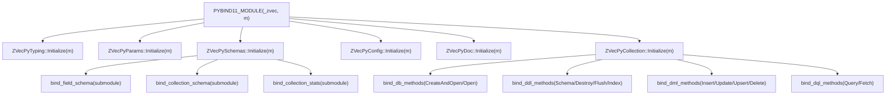
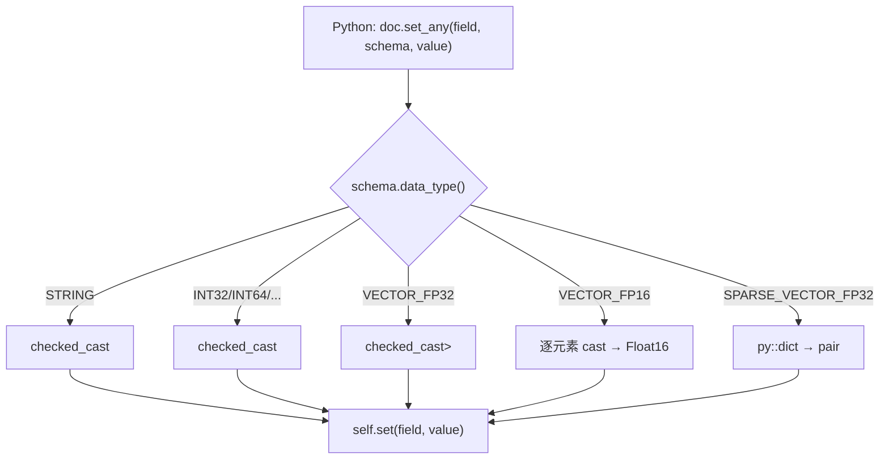
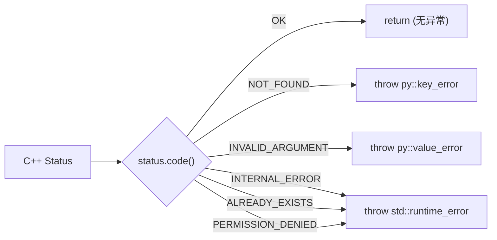

# PD-232.01 zvec — pybind11 双层 Schema 驱动跨语言绑定

> 文档编号：PD-232.01
> 来源：zvec `src/binding/python/`, `python/zvec/model/convert.py`, `python/zvec/zvec.py`
> GitHub：https://github.com/alibaba/zvec.git
> 问题域：PD-232 C++/Python 跨语言绑定 Cross-Language Binding
> 状态：可复用方案

---

## 第 1 章 问题与动机（≥ 30 行）

### 1.1 核心问题

向量数据库引擎的核心计算（HNSW 索引构建、距离矩阵运算、量化压缩）必须用 C++ 实现以获得极致性能，但用户侧 API 需要提供 Python 接口以融入 ML/AI 生态。这带来三个工程挑战：

1. **类型系统鸿沟**：C++ 的强类型（`int32_t`, `float`, `std::vector<ailego::Float16>`）与 Python 的动态类型之间需要安全、高效的双向转换，尤其是 20+ 种数据类型（标量、数组、稠密向量、稀疏向量）的全覆盖。
2. **对象生命周期管理**：C++ 对象（`Collection::Ptr`, `Doc::Ptr`）使用 `shared_ptr` 管理，Python 侧有 GC，两者的生命周期必须正确对齐，否则会出现悬垂指针或内存泄漏。
3. **异常跨语言传播**：C++ 的 `Status` 错误码体系需要映射为 Python 的 `KeyError`/`ValueError`/`RuntimeError` 等原生异常，让 Python 用户能用 `try/except` 自然处理错误。

### 1.2 zvec 的解法概述

zvec 采用"双层架构"解决跨语言绑定问题：

1. **C++ 绑定层**（`src/binding/python/`）：6 个 pybind11 模块化初始化器，按职责分离（Typing/Params/Schema/Config/Doc/Collection），通过 `PYBIND11_MODULE(_zvec, m)` 统一注册（`binding.cc:23`）
2. **Python 包装层**（`python/zvec/`）：纯 Python 类（`Doc`, `Collection`, `FieldSchema`, `VectorSchema`）持有 `_cpp_obj` 引用，提供 Pythonic API + 类型验证 + 扩展接口（Protocol）
3. **Schema 驱动转换**：`convert.py` 的 `convert_to_cpp_doc` / `convert_to_py_doc` 以 `CollectionSchema` 为元数据，按字段逐一做类型安全的双向转换
4. **异常映射层**：`throw_if_error()` 将 C++ `StatusCode` 映射为 Python 原生异常类型（`python_collection.cc:21-38`）
5. **Protocol 扩展体系**：Python 层用 `@runtime_checkable Protocol` 定义 `DenseEmbeddingFunction` / `SparseEmbeddingFunction` 接口，C++ 层不感知扩展实现

### 1.3 设计思想

| 设计原则 | 具体实现 | 理由 | 替代方案 |
|----------|----------|------|----------|
| 模块化绑定注册 | 6 个 `ZVecPy*::Initialize(m)` 分别绑定不同子系统 | 单文件绑定会导致 3000+ 行不可维护 | 单文件 PYBIND11_MODULE |
| Schema 驱动类型分发 | `set_any`/`get_any` 按 `DataType` switch-case 分发 20+ 类型 | 避免为每种类型写独立绑定函数 | 模板特化 + 类型擦除 |
| 双层包装 | C++ 暴露 `_zvec._Collection`，Python 包装为 `zvec.Collection` | Python 层可加验证/转换/扩展逻辑 | 直接暴露 C++ 类 |
| Protocol 扩展接口 | `DenseEmbeddingFunction(Protocol[MD])` 定义嵌入函数接口 | 用户可自定义嵌入函数而不修改 C++ | ABC 抽象基类 |
| 异常语义映射 | `NOT_FOUND→KeyError`, `INVALID_ARGUMENT→ValueError` | Python 用户期望原生异常类型 | 统一 RuntimeError |

---

## 第 2 章 源码实现分析（≥ 60 行，核心章节）

### 2.1 架构概览

zvec 的跨语言绑定采用三层架构：C++ 核心引擎 → pybind11 绑定层 → Python 包装层。

```
┌─────────────────────────────────────────────────────────────────┐
│                    Python 用户 API (zvec.*)                      │
│  zvec.init() → zvec.create_and_open() → collection.insert()    │
├─────────────────────────────────────────────────────────────────┤
│              Python 包装层 (python/zvec/)                        │
│  Collection ──holds──→ _Collection (C++ Ptr)                    │
│  Doc ←──convert──→ _Doc                                         │
│  FieldSchema ──holds──→ _FieldSchema                            │
│  CollectionSchema ──holds──→ _CollectionSchema                  │
│  Protocol: DenseEmbeddingFunction / SparseEmbeddingFunction     │
├─────────────────────────────────────────────────────────────────┤
│              pybind11 绑定层 (src/binding/python/)               │
│  binding.cc → PYBIND11_MODULE(_zvec, m)                         │
│    ├── ZVecPyTyping::Initialize     (枚举: DataType, MetricType)│
│    ├── ZVecPyParams::Initialize     (参数: HnswIndexParam, ...)│
│    ├── ZVecPySchemas::Initialize    (Schema: Field, Collection) │
│    ├── ZVecPyConfig::Initialize     (全局配置: Initialize())    │
│    ├── ZVecPyDoc::Initialize        (文档: _Doc, set_any/get_any)│
│    └── ZVecPyCollection::Initialize (集合: CRUD + DDL + DQL)    │
├─────────────────────────────────────────────────────────────────┤
│              C++ 核心引擎 (src/core/, src/ailego/)               │
│  Collection, Doc, HNSW, Flat, IVF, SQL Filter Engine            │
└─────────────────────────────────────────────────────────────────┘
```

### 2.2 核心实现

#### 2.2.1 模块化绑定注册入口



对应源码 `src/binding/python/binding.cc:22-33`：
```cpp
namespace zvec {
PYBIND11_MODULE(_zvec, m) {
  m.doc() = "Zvec core module";

  ZVecPyTyping::Initialize(m);
  ZVecPyParams::Initialize(m);
  ZVecPySchemas::Initialize(m);
  ZVecPyConfig::Initialize(m);
  ZVecPyDoc::Initialize(m);
  ZVecPyCollection::Initialize(m);
}
}  // namespace zvec
```

每个 `Initialize` 方法负责一个子系统的绑定，例如 `ZVecPyCollection` 将 Collection 的方法按 DDL/DML/DQL 三类分组绑定（`python_collection.cc:50-55`）。

#### 2.2.2 Schema 驱动的类型安全转换

这是 zvec 跨语言绑定最核心的设计。`_Doc.set_any()` 接收 `(field_name, FieldSchema, py::object)` 三元组，根据 Schema 中的 `DataType` 做 switch-case 分发，覆盖 20+ 种类型。



对应源码 `src/binding/python/model/python_doc.cc:77-214`：
```cpp
doc.def(
    "set_any",
    [](Doc &self, const std::string &field, const FieldSchema &field_schema,
       const py::object &obj) -> bool {
      if (obj.is_none()) {
        if (field_schema.nullable()) {
          self.set_null(field);
          return true;
        }
        throw py::value_error("Field '" + field +
                              "': expected non-nullable type");
      }
      switch (field_schema.data_type()) {
        case DataType::STRING:
          return self.set(field,
                          checked_cast<std::string>(obj, field, "STRING"));
        case DataType::VECTOR_FP16: {
          const auto value = checked_cast<py::list>(
              obj, field, "VECTOR_FP16 (list of numbers)");
          std::vector<ailego::Float16> new_value;
          new_value.reserve(value.size());
          for (const auto &item : value) {
            new_value.emplace_back(item.cast<float>());
          }
          return self.set(field, new_value);
        }
        case DataType::SPARSE_VECTOR_FP32: {
          const auto sparse_dict =
              checked_cast<py::dict>(obj, field, "SPARSE_VECTOR_FP32 (dict)");
          std::vector<uint32_t> indices;
          std::vector<float> values;
          for (const auto &item : sparse_dict) {
            indices.push_back(item.first.cast<uint32_t>());
            values.push_back(item.second.cast<float>());
          }
          return self.set(field, std::pair{std::move(indices), std::move(values)});
        }
        // ... 20+ 类型分支
      }
    });
```

关键设计点：
- `checked_cast<T>` 模板（`python_doc.cc:22-32`）在类型不匹配时抛出带字段名和期望类型的 `py::type_error`，错误信息精确到字段级别
- `VECTOR_FP16` 需要逐元素从 `float` 转为 `ailego::Float16`，因为 Python 没有原生 FP16 类型
- 稀疏向量用 `py::dict` 表示（`{index: weight}`），C++ 侧转为 `pair<vector<uint32_t>, vector<float>>`

#### 2.2.3 异常跨语言映射



对应源码 `src/binding/python/model/python_collection.cc:21-38`：
```cpp
inline void throw_if_error(const Status &status) {
  switch (status.code()) {
    case StatusCode::OK:
      return;
    case StatusCode::NOT_FOUND:
      throw py::key_error(status.message());
    case StatusCode::INVALID_ARGUMENT:
      throw py::value_error(status.message());
    case StatusCode::INTERNAL_ERROR:
    case StatusCode::ALREADY_EXISTS:
    case StatusCode::NOT_SUPPORTED:
    case StatusCode::PERMISSION_DENIED:
    case StatusCode::FAILED_PRECONDITION:
    case StatusCode::UNKNOWN:
    default:
      throw std::runtime_error(status.message());
  }
}
```

配合 `unwrap_expected` 模板（`python_collection.cc:41-48`），将 `tl::expected<T, Status>` 自动解包或抛异常，所有 DML/DQL 方法都通过这个模式处理错误。

### 2.3 实现细节

#### Python 包装层的 `_from_core` 工厂模式

Python 类不直接暴露 C++ 构造函数，而是通过 `_from_core` 类方法从 C++ 对象构造 Python 包装：

```python
# python/zvec/model/collection.py:58-67
@classmethod
def _from_core(cls, core_collection: _Collection) -> Collection:
    if not core_collection:
        raise ValueError("Collection is None")
    inst = cls.__new__(cls)
    inst._obj = core_collection
    schema = CollectionSchema._from_core(core_collection.Schema())
    inst._schema = schema
    inst._querier = QueryExecutorFactory.create(schema)
    return inst
```

这个模式贯穿整个 Python 层：`FieldSchema._from_core`（`field_schema.py:116-122`）、`VectorSchema._from_core`（`field_schema.py:241-245`）、`CollectionSchema._from_core`（`collection_schema.py:151-157`）。好处是：
- Python 构造函数做参数验证（如 `data_type not in SUPPORT_SCALAR_DATA_TYPE` 检查）
- `_from_core` 跳过验证，直接包装已验证的 C++ 对象
- 用户永远不需要接触 `_zvec` 前缀的内部类

#### convert.py 的双向转换桥梁

`convert_to_cpp_doc`（`convert.py:20-46`）将 Python `Doc` 转为 C++ `_Doc`：
- 遍历 `doc.fields` 和 `doc.vectors`，通过 `collection_schema.field(k)` 查找对应的 `FieldSchema`
- 调用 `_doc.set_any(k, field_schema._get_object(), v)` 触发 C++ 侧的类型分发

`convert_to_py_doc`（`convert.py:49-54`）将 C++ `_Doc` 转为 Python `Doc`：
- 调用 `doc.get_all(collection_schema._get_object())` 一次性获取 `(id, score, fields, vectors)` 四元组
- 通过 `Doc._from_tuple(data_tuple)` 构造 Python 对象，其中向量自动从 `np.ndarray` 转为 `list`（`doc.py:166-170`）

#### QueryExecutor 策略模式

`QueryExecutorFactory`（`query_executor.py:299-307`）根据 Schema 中向量字段数量选择执行器：
- 0 个向量字段 → `NoVectorQueryExecutor`
- 1 个向量字段 → `SingleVectorQueryExecutor`
- 多个向量字段 → `MultiVectorQueryExecutor`（要求 ReRanker）

执行器的 `execute` 方法用 `@final` 装饰器锁定模板方法流程：validate → build → execute → merge_rerank。


---

## 第 3 章 迁移指南（≥ 40 行）

### 3.1 迁移清单

将 zvec 的跨语言绑定模式迁移到自己的 C++/Python 项目，分三个阶段：

**阶段 1：C++ 绑定层搭建**
- [ ] 安装 pybind11（`pip install pybind11` 或 CMake `FetchContent`）
- [ ] 创建 `src/binding/python/` 目录，按子系统拆分绑定文件
- [ ] 编写 `binding.cc` 入口，用 `PYBIND11_MODULE` 注册模块
- [ ] 为每个 C++ 类编写 `ZVecPy*::Initialize(m)` 静态方法
- [ ] 实现 `throw_if_error` 异常映射函数

**阶段 2：Python 包装层构建**
- [ ] 创建 Python 包，每个 C++ 类对应一个 Python 包装类
- [ ] 实现 `_from_core` 类方法和 `_get_object` 访问器
- [ ] 编写 `convert.py` 双向转换函数
- [ ] 用 `Protocol` 定义扩展接口

**阶段 3：类型安全与测试**
- [ ] 实现 `checked_cast<T>` 模板，确保类型错误有清晰的错误信息
- [ ] 为所有数据类型编写双向转换测试（参考 `test_convert.py`）
- [ ] 添加 pickle 支持（`py::pickle`）以支持多进程场景

### 3.2 适配代码模板

#### 模板 1：模块化绑定注册

```cpp
// binding.cc — 入口文件
#include "py_model.h"
#include "py_config.h"
#include "py_engine.h"

namespace myproject {
PYBIND11_MODULE(_myproject, m) {
  m.doc() = "MyProject core module";
  PyModel::Initialize(m);
  PyConfig::Initialize(m);
  PyEngine::Initialize(m);
}
}
```

#### 模板 2：异常映射 + unwrap_expected

```cpp
// py_common.h — 异常映射工具
#include <pybind11/pybind11.h>
namespace py = pybind11;

inline void throw_if_error(const Status &status) {
  switch (status.code()) {
    case StatusCode::OK: return;
    case StatusCode::NOT_FOUND:
      throw py::key_error(status.message());
    case StatusCode::INVALID_ARGUMENT:
      throw py::value_error(status.message());
    default:
      throw std::runtime_error(status.message());
  }
}

template <typename T>
T unwrap(const Expected<T, Status> &exp) {
  if (exp.has_value()) return exp.value();
  throw_if_error(exp.error());
  return T{};  // unreachable
}
```

#### 模板 3：Python 双层包装类

```python
# python/myproject/model/entity.py
from _myproject import _Entity

class Entity:
    """Pythonic wrapper over C++ _Entity."""

    def __init__(self, name: str, value: float):
        # Python 构造函数做参数验证
        if not isinstance(name, str):
            raise TypeError("name must be str")
        self._cpp_obj = _Entity(name, value)

    @classmethod
    def _from_core(cls, core_obj: _Entity) -> "Entity":
        """从 C++ 对象构造，跳过验证。"""
        inst = cls.__new__(cls)
        inst._cpp_obj = core_obj
        return inst

    def _get_object(self) -> _Entity:
        """暴露内部 C++ 对象给转换层。"""
        return self._cpp_obj

    @property
    def name(self) -> str:
        return self._cpp_obj.name
```

#### 模板 4：Schema 驱动双向转换

```python
# python/myproject/model/convert.py
from _myproject import _Entity

def to_cpp(py_obj: Entity, schema: Schema) -> _Entity:
    cpp_obj = _Entity()
    for field_name, value in py_obj.fields.items():
        field_schema = schema.field(field_name)
        if not field_schema:
            raise ValueError(f"{field_name} not in schema")
        cpp_obj.set_any(field_name, field_schema._get_object(), value)
    return cpp_obj

def to_python(cpp_obj: _Entity, schema: Schema) -> Entity:
    data_tuple = cpp_obj.get_all(schema._get_object())
    return Entity._from_tuple(data_tuple)
```

### 3.3 适用场景

| 场景 | 适用度 | 说明 |
|------|--------|------|
| C++ 高性能引擎 + Python SDK | ⭐⭐⭐ | 最佳场景，zvec 的核心用例 |
| 向量数据库/搜索引擎 Python 绑定 | ⭐⭐⭐ | 多类型数据（标量+向量+稀疏）的 Schema 驱动转换 |
| ML 推理引擎 Python 接口 | ⭐⭐⭐ | 需要 numpy 互操作和多数据类型支持 |
| 简单 C++ 库的 Python 绑定 | ⭐⭐ | 如果类型简单，双层架构可能过度设计 |
| 纯 Python 项目 | ⭐ | 不适用，无 C++ 组件 |

---

## 第 4 章 测试用例（≥ 20 行）

基于 zvec 的 `test_convert.py` 模式，以下测试覆盖跨语言绑定的关键路径：

```python
import math
import pytest


class TestSchemaDriverConversion:
    """测试 Schema 驱动的双向类型转换。"""

    def test_scalar_roundtrip(self):
        """标量字段 Python→C++→Python 往返转换。"""
        schema = CollectionSchema(
            name="test",
            fields=[
                FieldSchema("name", DataType.STRING),
                FieldSchema("age", DataType.INT32),
                FieldSchema("score", DataType.DOUBLE),
                FieldSchema("active", DataType.BOOL),
            ],
        )
        doc = Doc(
            id="1",
            fields={"name": "Alice", "age": 30, "score": 95.5, "active": True},
        )
        cpp_doc = convert_to_cpp_doc(doc, schema)
        py_doc = convert_to_py_doc(cpp_doc, schema)

        assert py_doc.id == "1"
        assert py_doc.field("name") == "Alice"
        assert py_doc.field("age") == 30
        assert math.isclose(py_doc.field("score"), 95.5, rel_tol=1e-6)
        assert py_doc.field("active") is True

    def test_dense_vector_roundtrip(self):
        """稠密向量 FP32 往返转换。"""
        schema = CollectionSchema(
            name="test",
            vectors=[VectorSchema("emb", DataType.VECTOR_FP32, dimension=4)],
        )
        doc = Doc(id="v1", vectors={"emb": [0.1, 0.2, 0.3, 0.4]})
        cpp_doc = convert_to_cpp_doc(doc, schema)
        py_doc = convert_to_py_doc(cpp_doc, schema)

        for i in range(4):
            assert math.isclose(
                py_doc.vector("emb")[i], doc.vector("emb")[i], rel_tol=1e-6
            )

    def test_sparse_vector_roundtrip(self):
        """稀疏向量 dict 格式往返转换。"""
        schema = CollectionSchema(
            name="test",
            vectors=[VectorSchema("sparse", DataType.SPARSE_VECTOR_FP32)],
        )
        doc = Doc(id="s1", vectors={"sparse": {10: 1.5, 42: 2.7, 100: 0.3}})
        cpp_doc = convert_to_cpp_doc(doc, schema)
        py_doc = convert_to_py_doc(cpp_doc, schema)

        for k, v in doc.vector("sparse").items():
            assert math.isclose(py_doc.vector("sparse")[k], v, rel_tol=1e-1)

    def test_type_mismatch_raises_typeerror(self):
        """类型不匹配时应抛出 TypeError 而非段错误。"""
        schema = CollectionSchema(
            name="test",
            fields=[FieldSchema("age", DataType.INT32)],
        )
        doc = Doc(id="1", fields={"age": "not_a_number"})
        with pytest.raises(TypeError):
            convert_to_cpp_doc(doc, schema)

    def test_field_not_in_schema_raises_valueerror(self):
        """字段不在 Schema 中时应抛出 ValueError。"""
        schema = CollectionSchema(
            name="test",
            fields=[FieldSchema("name", DataType.STRING)],
        )
        doc = Doc(id="1", fields={"unknown_field": "value"})
        with pytest.raises(ValueError, match="not found in collection schema"):
            convert_to_cpp_doc(doc, schema)

    def test_nullable_field_accepts_none(self):
        """nullable 字段接受 None 值。"""
        schema = CollectionSchema(
            name="test",
            fields=[FieldSchema("tag", DataType.STRING, nullable=True)],
        )
        doc = Doc(id="1", fields={"tag": None})
        cpp_doc = convert_to_cpp_doc(doc, schema)
        assert cpp_doc is not None


class TestExceptionMapping:
    """测试 C++ Status → Python 异常的映射。"""

    def test_not_found_raises_keyerror(self):
        """NOT_FOUND 状态码映射为 KeyError。"""
        # 当 Fetch 不存在的 ID 时，应抛出 KeyError
        pass  # 需要实际 Collection 实例

    def test_invalid_argument_raises_valueerror(self):
        """INVALID_ARGUMENT 映射为 ValueError。"""
        # 当传入非法参数时，应抛出 ValueError
        pass  # 需要实际 Collection 实例
```


---

## 第 5 章 跨域关联

| 关联域 | 关系类型 | 说明 |
|--------|----------|------|
| PD-04 工具系统 | 协同 | pybind11 绑定层本质上是"工具注册"——将 C++ 能力注册为 Python 可调用的工具。zvec 的模块化 Initialize 模式可复用于 Agent 工具系统的插件注册 |
| PD-03 容错与重试 | 协同 | `throw_if_error` + `unwrap_expected` 模式是跨语言容错的基础设施。C++ 的 `Status` 错误码体系通过异常映射层传递到 Python，使 Python 侧可以用标准 try/except 做重试 |
| PD-01 上下文管理 | 依赖 | 向量数据的类型转换（FP16/FP32/INT8/Sparse）直接影响上下文窗口的内存占用。zvec 的 `checked_cast` + Schema 驱动转换确保数据在跨语言传递时不会因类型错误导致内存膨胀 |
| PD-08 搜索与检索 | 协同 | `QueryExecutor` 策略模式（No/Single/Multi Vector）是搜索系统的 Python 入口。跨语言绑定的质量直接决定搜索 API 的可用性和性能 |
| PD-11 可观测性 | 协同 | `ZVecPyConfig::Initialize` 将日志配置从 Python dict 传递到 C++ `GlobalConfig`，是跨语言可观测性的配置通道 |

---

## 第 6 章 来源文件索引

| 文件 | 行范围 | 关键实现 |
|------|--------|----------|
| `src/binding/python/binding.cc` | L22-L33 | PYBIND11_MODULE 入口，6 个子系统注册 |
| `src/binding/python/model/python_doc.cc` | L22-L32 | `checked_cast<T>` 类型安全转换模板 |
| `src/binding/python/model/python_doc.cc` | L77-L214 | `set_any` 20+ 类型 switch-case 分发 |
| `src/binding/python/model/python_doc.cc` | L306-L451 | `get_all` 批量获取四元组 |
| `src/binding/python/model/python_collection.cc` | L21-L48 | `throw_if_error` + `unwrap_expected` 异常映射 |
| `src/binding/python/model/python_collection.cc` | L50-L71 | Collection 绑定 + pickle 支持 |
| `src/binding/python/model/python_collection.cc` | L166-L193 | DML 方法绑定（Insert/Update/Upsert/Delete） |
| `src/binding/python/model/schema/python_schema.cc` | L31-L84 | FieldSchema 绑定 + pickle |
| `src/binding/python/model/schema/python_schema.cc` | L86-L138 | CollectionSchema 绑定 + return_value_policy |
| `src/binding/python/model/common/python_config.cc` | L59-L187 | 全局配置 Initialize，dict→ConfigData 转换 |
| `python/zvec/model/convert.py` | L20-L54 | 双向转换：convert_to_cpp_doc / convert_to_py_doc |
| `python/zvec/model/doc.py` | L26-L173 | Python Doc 类，`_from_tuple` 工厂方法 |
| `python/zvec/model/collection.py` | L44-L379 | Python Collection 包装，DDL/DML/DQL 全覆盖 |
| `python/zvec/model/schema/field_schema.py` | L63-L301 | FieldSchema + VectorSchema 双层包装 |
| `python/zvec/model/schema/collection_schema.py` | L28-L216 | CollectionSchema 包装 + 字段名唯一性校验 |
| `python/zvec/executor/query_executor.py` | L119-L307 | QueryExecutor ABC + Factory 策略模式 |
| `python/zvec/extension/embedding_function.py` | L22-L148 | Protocol 定义：Dense/Sparse EmbeddingFunction |
| `python/zvec/zvec.py` | L29-L227 | 顶层 API：init/create_and_open/open |
| `python/zvec/common/constants.py` | L20-L34 | 类型别名：VectorType, DenseVectorType, Embeddable |
| `python/tests/test_convert.py` | L14-L585 | 双向转换全类型测试（标量/数组/稠密/稀疏） |

---

## 第 7 章 横向对比维度

```json comparison_data
{
  "project": "zvec",
  "dimensions": {
    "绑定技术": "pybind11 PYBIND11_MODULE，6 个模块化 Initialize 注册器",
    "类型转换": "Schema 驱动 switch-case 分发 20+ 类型，checked_cast 模板",
    "包装模式": "双层架构：C++ _zvec 内部模块 + Python zvec 包装层",
    "异常传播": "StatusCode→Python 原生异常映射（KeyError/ValueError/RuntimeError）",
    "扩展机制": "Python Protocol + @runtime_checkable 定义嵌入函数接口",
    "序列化支持": "py::pickle 支持 Collection/FieldSchema/Doc 的多进程序列化"
  }
}
```

### 域元数据补充

```json domain_metadata
{
  "solution_summary": "zvec 用 pybind11 模块化注册 + Schema 驱动 switch-case 分发 20+ 类型，Python 双层包装（_from_core 工厂 + Protocol 扩展接口）实现高性能向量数据库跨语言绑定",
  "description": "高性能计算引擎的 Python SDK 设计模式，含多数据类型安全转换与扩展接口",
  "sub_problems": [
    "多数据类型（20+）的统一分发与 Schema 驱动转换",
    "pickle 序列化支持多进程场景",
    "Python 构造验证与 C++ _from_core 跳过验证的双路径设计"
  ],
  "best_practices": [
    "模块化绑定注册：按子系统拆分 Initialize 方法避免单文件膨胀",
    "checked_cast 模板提供字段级类型错误信息",
    "unwrap_expected 模板统一处理 C++ expected 类型的错误解包"
  ]
}
```
