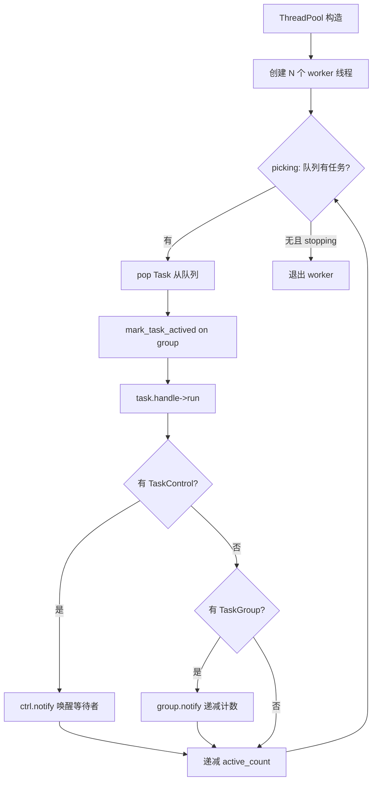
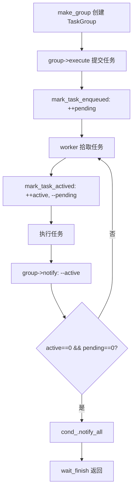

# PD-233.01 zvec — ailego::ThreadPool 带 TaskGroup 的双线程池并发执行

> 文档编号：PD-233.01
> 来源：zvec `src/include/zvec/ailego/parallel/thread_pool.h`
> GitHub：https://github.com/alibaba/zvec.git
> 问题域：PD-233 线程池与并发执行 Thread Pool & Concurrent Execution
> 状态：可复用方案

---

## 第 1 章 问题与动机

### 1.1 核心问题

向量数据库引擎面临两类截然不同的并发负载：

1. **查询负载**（低延迟、高吞吐）：多个 segment 的向量检索需要并行执行，每个查询要求毫秒级响应
2. **后台优化负载**（高吞吐、可容忍延迟）：segment merge、索引重建等 I/O 密集型操作

如果两类任务共享同一线程池，后台 merge 操作会抢占查询线程，导致查询延迟飙升（P99 尾延迟恶化）。同时，在容器化部署环境中，线程数需要感知 cgroup CPU 限制，而非宿主机核数。

### 1.2 zvec 的解法概述

zvec 通过 ailego 基础库实现了一套完整的线程池方案：

1. **ailego::ThreadPool** — 自研线程池，支持 TaskGroup 分组等待、TaskControl 同步执行、CPU 核绑定（`thread_pool.h:31-399`）
2. **GlobalResource 单例** — 通过 Singleton 模式管理 query/optimize 两个独立线程池，`std::call_once` 保证线程安全初始化（`global_resource.cc:21-31`）
3. **CgroupUtil 容器感知** — 自动检测 cgroup v1/v2 CPU 限制作为线程池大小默认值（`config.cc:37-40`）
4. **Closure 类型擦除** — 模板化的回调封装，支持成员函数指针、lambda、自由函数统一入队（`closure.h:524-527`）
5. **Python 层 ThreadPoolExecutor** — 多向量查询时通过 `concurrent.futures` 实现并行，环境变量控制并发度（`query_executor.py:122,196`）

### 1.3 设计思想

| 设计原则 | 具体实现 | 理由 | 替代方案 |
|----------|----------|------|----------|
| 负载隔离 | query_thread_pool / optimize_thread_pool 物理分离 | 避免后台 merge 抢占查询线程 | 单池 + 优先级队列（无法硬隔离） |
| 容器感知 | CgroupUtil::getCpuLimit() 作为默认线程数 | 容器内 hardware_concurrency() 返回宿主机核数，会过度创建线程 | 硬编码线程数（不适应弹性伸缩） |
| 任务分组 | TaskGroup 支持 enqueue + wait_finish 批量等待 | 多 segment 并行查询需要等待全部完成再合并 | CountDownLatch（不支持动态追加任务） |
| 同步执行 | execute_and_wait 通过 TaskControl 阻塞等待单任务完成 | 某些场景需要同步语义但仍在池中执行 | 直接在调用线程执行（无法利用核绑定） |
| CPU 亲和性 | pthread_setaffinity_np 按 i % hc 绑核 | 减少 L1/L2 cache miss，向量计算密集场景收益显著 | 不绑核（NUMA 架构下性能不稳定） |

---

## 第 2 章 源码实现分析

### 2.1 架构概览

zvec 的线程池体系分为三层：基础设施层（ailego 库）、资源管理层（GlobalResource）、业务使用层（QueryPlanner / SegmentNode / Python QueryExecutor）。

```
┌─────────────────────────────────────────────────────────┐
│                    业务使用层                              │
│  ┌──────────────┐  ┌──────────────┐  ┌────────────────┐ │
│  │ QueryPlanner │  │ SegmentNode  │  │ QueryExecutor  │ │
│  │  (C++ SQL)   │  │ (C++ Arrow)  │  │   (Python)     │ │
│  └──────┬───────┘  └──────┬───────┘  └───────┬────────┘ │
│         │                 │                   │          │
├─────────┼─────────────────┼───────────────────┼──────────┤
│         │     资源管理层    │                   │          │
│  ┌──────▼─────────────────▼──────┐   ┌───────▼────────┐ │
│  │     GlobalResource (单例)      │   │ThreadPoolExec- │ │
│  │  ┌──────────┐ ┌─────────────┐ │   │  utor (stdlib) │ │
│  │  │query_pool│ │optimize_pool│ │   └────────────────┘ │
│  │  └────┬─────┘ └──────┬──────┘ │                      │
│  └───────┼──────────────┼────────┘                      │
│          │              │                                │
├──────────┼──────────────┼────────────────────────────────┤
│          │  基础设施层    │                                │
│  ┌───────▼──────────────▼────────┐                      │
│  │    ailego::ThreadPool          │                      │
│  │  ┌──────────┐ ┌─────────────┐ │                      │
│  │  │TaskGroup │ │TaskControl  │ │                      │
│  │  │(批量等待) │ │(同步等待)   │ │                      │
│  │  └──────────┘ └─────────────┘ │                      │
│  │  ┌──────────┐ ┌─────────────┐ │                      │
│  │  │Closure   │ │CPU Binding  │ │                      │
│  │  │(类型擦除) │ │(核亲和性)   │ │                      │
│  │  └──────────┘ └─────────────┘ │                      │
│  └───────────────────────────────┘                      │
└─────────────────────────────────────────────────────────┘
```

### 2.2 核心实现

#### 2.2.1 ThreadPool 工作线程与任务拾取



对应源码 `src/ailego/parallel/thread_pool.cc:52-130`：

```cpp
// 构造函数：创建 size 个工作线程，可选 CPU 绑定
ThreadPool::ThreadPool(uint32_t size, bool binding) {
  for (uint32_t i = 0u; i < size; ++i) {
    pool_.emplace_back(&ThreadPool::worker, this);
  }
  if (binding) {
    this->bind();
  }
}

// worker 主循环：从队列拾取任务并执行
void ThreadPool::worker(void) {
  ++worker_count_;
  ThreadPool::Task task;
  while (this->picking(&task)) {
    task.handle->run();
    task.handle = nullptr;
    if (task.control) { task.control->notify(); }
    if (task.group) { task.group->notify(); task.group = nullptr; }
    std::lock_guard<std::mutex> lock(wait_mutex_);
    if (--active_count_ == 0 && pending_count_ == 0) {
      finished_cond_.notify_all();
    }
  }
  std::lock_guard<std::mutex> lock(wait_mutex_);
  if (--worker_count_ == 0) { stopped_cond_.notify_all(); }
}

// picking：条件变量等待，有任务或 stopping 时唤醒
bool ThreadPool::picking(ThreadPool::Task *task) {
  std::unique_lock<std::mutex> latch(queue_mutex_);
  work_cond_.wait(latch, [this]() { return (pending_count_ > 0 || stopping_); });
  if (stopping_) return false;
  auto &head = queue_.front();
  task->control = head.control;
  task->group = std::move(head.group);
  task->handle = std::move(head.handle);
  queue_.pop();
  if (task->group) { task->group->mark_task_actived(); }
  std::unique_lock<std::mutex> lock(wait_mutex_);
  ++active_count_;
  --pending_count_;
  return true;
}
```

#### 2.2.2 TaskGroup 分组等待机制



对应源码 `src/include/zvec/ailego/parallel/thread_pool.h:35-134`：

```cpp
class TaskGroup : public std::enable_shared_from_this<TaskGroup> {
 public:
  // 同步执行：提交任务并阻塞等待该任务完成
  template <typename... TArgs>
  void execute_and_wait(TArgs &&...args) {
    ThreadPool::TaskControl ctrl;
    pool_->enqueue_and_wake(Closure::New(std::forward<TArgs>(args)...),
                            this->shared_from_this(), &ctrl);
    ctrl.wait();
  }

  // 等待组内所有任务完成
  void wait_finish(void) {
    std::unique_lock<std::mutex> lock(mutex_);
    cond_.wait(lock, [this]() { return this->is_finished(); });
  }

  bool is_finished(void) const {
    return (active_count_ == 0 && pending_count_ == 0);
  }

 protected:
  void mark_task_enqueued(void) { ++pending_count_; }
  void mark_task_actived(void) {
    std::lock_guard<std::mutex> lock(mutex_);
    ++active_count_; --pending_count_;
  }
  void notify(void) {
    std::lock_guard<std::mutex> lock(mutex_);
    if (--active_count_ == 0 && pending_count_ == 0) {
      cond_.notify_all();
    }
  }

 private:
  ThreadPool *pool_{nullptr};
  std::atomic_uint active_count_{0};
  std::atomic_uint pending_count_{0};
  std::mutex mutex_{};
  std::condition_variable cond_{};
};
```

### 2.3 实现细节

#### GlobalResource 双线程池初始化

`src/db/common/global_resource.cc:21-31` 使用 `std::call_once` 保证线程安全的一次性初始化：

```cpp
void GlobalResource::initialize() {
  static std::once_flag flag;
  std::call_once(flag, [this]() mutable {
    this->query_thread_pool_.reset(
        new ailego::ThreadPool(GlobalConfig::Instance().query_thread_count()));
    this->optimize_thread_pool_.reset(
        new ailego::ThreadPool(GlobalConfig::Instance().optimize_thread_count()));
  });
}
```

线程数默认值来自 `CgroupUtil::getCpuLimit()`（`config.cc:37,40`），在容器环境中读取 cgroup CPU 配额而非 `hardware_concurrency()`。

#### CPU 核绑定

`src/ailego/parallel/thread_pool.cc:20-31` 在 Linux 上通过 `pthread_setaffinity_np` 实现：

```cpp
static inline void BindThreads(std::vector<std::thread> &pool) {
  uint32_t hc = std::thread::hardware_concurrency();
  if (hc > 1) {
    cpu_set_t mask;
    for (size_t i = 0u; i < pool.size(); ++i) {
      CPU_ZERO(&mask);
      CPU_SET(i % hc, &mask);
      pthread_setaffinity_np(pool[i].native_handle(), sizeof(mask), &mask);
    }
  }
}
```

#### 业务层使用：QueryPlanner 多 Segment 并行

`src/db/sqlengine/planner/query_planner.cc:427-429` 获取查询线程池，传给 SegmentNode 实现多 segment 并行查询：

```cpp
ailego::ThreadPool *pool = GlobalResource::Instance().query_thread_pool();
auto recall_node = std::make_shared<SegmentNode>(std::move(segment_plans), pool);
```

#### 业务层使用：Python 多向量并行查询

`python/zvec/executor/query_executor.py:186-211` 在多向量查询时使用 `ThreadPoolExecutor`：

```python
def _do_execute(self, vectors, collection):
    if len(vectors) == 1 or self._concurrency == 1:
        # 单向量或并发度为1时串行执行
        results = {}
        for query in vectors:
            docs = collection.Query(query)
            results[query.field_name] = [convert_to_py_doc(doc, self._schema) for doc in docs]
        return results

    # 多向量并行执行
    results = {}
    with ThreadPoolExecutor(max_workers=self._concurrency) as executor:
        future_to_query = {
            executor.submit(collection.Query, query): query.field_name
            for query in vectors
        }
        for future in as_completed(future_to_query):
            field_name = future_to_query[future]
            docs = future.result()
            results[field_name] = [convert_to_py_doc(doc, self._schema) for doc in docs]
    return results
```

并发度通过环境变量 `ZVEC_QUERY_CONCURRENCY` 控制（`query_executor.py:122`）。


---

## 第 3 章 迁移指南

### 3.1 迁移清单

**阶段 1：基础线程池**
- [ ] 实现带 condition_variable 的任务队列线程池
- [ ] 支持 enqueue（入队不唤醒）和 enqueue_and_wake（入队并唤醒）两种模式
- [ ] 实现 wait_finish（等待所有任务完成）和 stop/wait_stop（优雅关闭）

**阶段 2：TaskGroup 分组等待**
- [ ] 实现 TaskGroup，支持 pending_count / active_count 双计数器
- [ ] 实现 group->wait_finish() 等待组内所有任务完成
- [ ] 实现 execute_and_wait 同步执行语义（通过 TaskControl）

**阶段 3：全局资源管理**
- [ ] 实现 Singleton + std::call_once 的全局线程池管理
- [ ] 分离 query_thread_pool 和 optimize_thread_pool
- [ ] 集成 cgroup 感知的线程数自动配置

**阶段 4：CPU 亲和性（可选）**
- [ ] Linux 平台实现 pthread_setaffinity_np 核绑定
- [ ] 非 Linux 平台提供空实现（编译期条件编译）

### 3.2 适配代码模板

以下是一个可直接复用的 Python 版双线程池 + TaskGroup 实现：

```python
import os
import threading
from concurrent.futures import ThreadPoolExecutor, Future, as_completed
from dataclasses import dataclass, field
from typing import Callable, Any, Optional


class TaskGroup:
    """任务分组，支持批量提交 + 等待全部完成"""

    def __init__(self, executor: ThreadPoolExecutor):
        self._executor = executor
        self._futures: list[Future] = []
        self._lock = threading.Lock()

    def submit(self, fn: Callable, *args, **kwargs) -> Future:
        future = self._executor.submit(fn, *args, **kwargs)
        with self._lock:
            self._futures.append(future)
        return future

    def wait_finish(self) -> list[Any]:
        """等待所有任务完成，返回结果列表"""
        results = []
        for future in as_completed(self._futures):
            results.append(future.result())
        return results

    @property
    def pending_count(self) -> int:
        with self._lock:
            return sum(1 for f in self._futures if not f.done())


class DualThreadPoolManager:
    """双线程池管理器：查询池 + 优化池，单例模式"""

    _instance: Optional['DualThreadPoolManager'] = None
    _lock = threading.Lock()

    def __init__(self, query_workers: int = 0, optimize_workers: int = 0):
        cpu_count = self._detect_cpu_limit()
        self._query_pool = ThreadPoolExecutor(
            max_workers=query_workers or cpu_count,
            thread_name_prefix="query"
        )
        self._optimize_pool = ThreadPoolExecutor(
            max_workers=optimize_workers or cpu_count,
            thread_name_prefix="optimize"
        )

    @classmethod
    def instance(cls, **kwargs) -> 'DualThreadPoolManager':
        if cls._instance is None:
            with cls._lock:
                if cls._instance is None:
                    cls._instance = cls(**kwargs)
        return cls._instance

    @property
    def query_pool(self) -> ThreadPoolExecutor:
        return self._query_pool

    @property
    def optimize_pool(self) -> ThreadPoolExecutor:
        return self._optimize_pool

    def make_query_group(self) -> TaskGroup:
        return TaskGroup(self._query_pool)

    def make_optimize_group(self) -> TaskGroup:
        return TaskGroup(self._optimize_pool)

    @staticmethod
    def _detect_cpu_limit() -> int:
        """容器感知的 CPU 核数检测"""
        # 优先读取 cgroup v2
        try:
            with open("/sys/fs/cgroup/cpu.max") as f:
                quota, period = f.read().strip().split()
                if quota != "max":
                    return max(1, int(quota) // int(period))
        except (FileNotFoundError, ValueError):
            pass
        # 回退到 cgroup v1
        try:
            with open("/sys/fs/cgroup/cpu/cpu.cfs_quota_us") as f:
                quota = int(f.read().strip())
            with open("/sys/fs/cgroup/cpu/cpu.cfs_period_us") as f:
                period = int(f.read().strip())
            if quota > 0:
                return max(1, quota // period)
        except (FileNotFoundError, ValueError):
            pass
        # 回退到 os.cpu_count()
        return os.cpu_count() or 4

    def shutdown(self):
        self._query_pool.shutdown(wait=True)
        self._optimize_pool.shutdown(wait=True)
```

### 3.3 适用场景

| 场景 | 适用度 | 说明 |
|------|--------|------|
| 向量数据库查询引擎 | ⭐⭐⭐ | 多 segment 并行查询 + 后台 merge 隔离，完美匹配 |
| Agent 多工具并行调用 | ⭐⭐⭐ | TaskGroup 等待全部工具返回后再汇总 |
| 批量 embedding 计算 | ⭐⭐ | 查询池处理在线请求，优化池处理离线批量 |
| 单一 Web 服务 | ⭐ | 通常框架自带线程池，无需自建 |

---

## 第 4 章 测试用例

基于 zvec 真实测试（`tests/ailego/parallel/thread_pool_test.cc`）改写的 Python 版本：

```python
import threading
import time
import pytest
from concurrent.futures import ThreadPoolExecutor, as_completed


class TaskGroup:
    """简化版 TaskGroup 用于测试"""
    def __init__(self, executor):
        self._executor = executor
        self._futures = []

    def submit(self, fn, *args):
        self._futures.append(self._executor.submit(fn, *args))

    def wait_finish(self):
        return [f.result() for f in as_completed(self._futures)]

    @property
    def is_finished(self):
        return all(f.done() for f in self._futures)


class TestThreadPoolBasic:
    """对应 thread_pool_test.cc:TEST(ThreadPool, General)"""

    def test_execute_10000_tasks(self):
        count = threading.atomic = {"value": 0}
        lock = threading.Lock()

        def task():
            with lock:
                count["value"] += 1

        with ThreadPoolExecutor(max_workers=4) as pool:
            futures = [pool.submit(task) for _ in range(10000)]
            for f in as_completed(futures):
                f.result()

        assert count["value"] == 10000

    def test_execute_and_wait_synchronous(self):
        """对应 thread_pool_test.cc:TEST(ThreadPool, ExecuteAndWait)"""
        results = []

        with ThreadPoolExecutor(max_workers=4) as pool:
            for i in range(100):
                assert len(results) == i
                future = pool.submit(lambda: results.append(1))
                future.result()  # 同步等待
                assert len(results) == i + 1


class TestTaskGroup:
    """对应 thread_pool_test.cc:TEST(ThreadPool, TaskGroup)"""

    def test_group_wait_finish(self):
        count = {"value": 0}
        lock = threading.Lock()

        with ThreadPoolExecutor(max_workers=4) as pool:
            group = TaskGroup(pool)
            for _ in range(12):
                def batch_task():
                    inner_group = TaskGroup(pool)
                    for _ in range(12):
                        def inner():
                            time.sleep(0.001)
                            with lock:
                                count["value"] += 1
                        inner_group.submit(inner)
                    inner_group.wait_finish()
                group.submit(batch_task)
            group.wait_finish()

        assert count["value"] == 144

    def test_group_reuse(self):
        """对应 thread_pool_test.cc:TEST(ThreadPool, TaskGroup2)"""
        with ThreadPoolExecutor(max_workers=4) as pool:
            group = TaskGroup(pool)
            for _ in range(100):
                count = {"value": 0}
                lock = threading.Lock()
                for _ in range(10):
                    def inc():
                        with lock:
                            count["value"] += 1
                    group.submit(inc)
                group.wait_finish()
                assert count["value"] == 10
                group._futures.clear()  # 重置 group


class TestDualPoolIsolation:
    """测试查询池和优化池的隔离性"""

    def test_pools_are_independent(self):
        query_pool = ThreadPoolExecutor(max_workers=2, thread_name_prefix="query")
        optimize_pool = ThreadPoolExecutor(max_workers=2, thread_name_prefix="opt")

        query_threads = set()
        optimize_threads = set()

        def record_query():
            query_threads.add(threading.current_thread().name)
            time.sleep(0.01)

        def record_optimize():
            optimize_threads.add(threading.current_thread().name)
            time.sleep(0.01)

        q_futures = [query_pool.submit(record_query) for _ in range(10)]
        o_futures = [optimize_pool.submit(record_optimize) for _ in range(10)]

        for f in q_futures + o_futures:
            f.result()

        # 验证两个池的线程完全不重叠
        assert query_threads.isdisjoint(optimize_threads)
        assert all("query" in t for t in query_threads)
        assert all("opt" in t for t in optimize_threads)

        query_pool.shutdown()
        optimize_pool.shutdown()
```


---

## 第 5 章 跨域关联

| 关联域 | 关系类型 | 说明 |
|--------|----------|------|
| PD-02 多 Agent 编排 | 协同 | TaskGroup 的分组等待模式可直接用于多 Agent 并行执行后汇总结果 |
| PD-01 上下文管理 | 协同 | 线程池大小受容器 CPU 限制，与上下文窗口的 token 预算类似，都是资源约束下的调度问题 |
| PD-11 可观测性 | 依赖 | active_count / pending_count / worker_count 提供了线程池级别的可观测指标 |
| PD-03 容错与重试 | 协同 | TaskControl 的同步等待可用于实现带超时的重试（当前实现无超时，需扩展） |

---

## 第 6 章 来源文件索引

| 文件 | 行范围 | 关键实现 |
|------|--------|----------|
| `src/include/zvec/ailego/parallel/thread_pool.h` | L31-L399 | ThreadPool 完整定义，含 TaskGroup、TaskControl、Task 结构体 |
| `src/ailego/parallel/thread_pool.cc` | L20-L131 | CPU 绑定实现、worker 主循环、picking 任务拾取 |
| `src/include/zvec/ailego/pattern/closure.h` | L524-L527 | Closure/ClosureHandler 类型擦除定义 |
| `src/include/zvec/ailego/pattern/singleton.h` | L24-L48 | C++11 线程安全 Singleton 模板 |
| `src/db/common/global_resource.h` | L22-L39 | GlobalResource 单例，持有 query/optimize 双线程池 |
| `src/db/common/global_resource.cc` | L21-L31 | std::call_once 初始化双线程池 |
| `src/db/common/config.cc` | L37-L40 | CgroupUtil 获取 CPU 限制作为线程数默认值 |
| `src/db/common/cgroup_util.h` | L39-L99 | 容器 CPU/内存限制检测工具类 |
| `src/db/sqlengine/planner/query_planner.cc` | L427-L429 | 查询线程池注入 SegmentNode |
| `src/db/sqlengine/planner/segment_node.h` | L29-L53 | SegmentNode 持有 ThreadPool 指针实现多 segment 并行 |
| `python/zvec/executor/query_executor.py` | L119-L211 | Python 层 ThreadPoolExecutor 多向量并行查询 |
| `src/db/index/segment/segment_helper.cc` | L634,L679 | optimize_thread_pool 用于 segment merge |
| `tests/ailego/parallel/thread_pool_test.cc` | L1-L163 | 完整测试：General、ExecuteAndWait、WaitFinish、TaskGroup |

---

## 第 7 章 横向对比维度

```json comparison_data
{
  "project": "zvec",
  "dimensions": {
    "线程池实现": "自研 ailego::ThreadPool，C++ condition_variable + atomic 计数器",
    "任务分组": "TaskGroup 内嵌类，shared_ptr 引用计数 + pending/active 双计数器",
    "同步原语": "TaskControl 单任务同步等待 + TaskGroup 批量等待 + 全局 wait_finish",
    "资源隔离": "GlobalResource 单例管理 query/optimize 两个物理隔离线程池",
    "容器感知": "CgroupUtil 读取 cgroup v1/v2 CPU 配额作为线程数默认值",
    "CPU亲和性": "Linux pthread_setaffinity_np 按 i%hc 轮询绑核",
    "多语言支持": "C++ 核心层 + Python ThreadPoolExecutor 上层封装"
  }
}
```

### 域元数据补充

```json domain_metadata
{
  "solution_summary": "zvec 用 ailego::ThreadPool 自研线程池支持 TaskGroup 分组等待与 CPU 核绑定，GlobalResource 单例管理 query/optimize 双池物理隔离，CgroupUtil 容器感知自动配置线程数",
  "description": "数据库引擎中查询与后台任务的线程池物理隔离与容器化适配",
  "sub_problems": [
    "Closure 类型擦除统一回调接口",
    "std::call_once 线程安全延迟初始化",
    "多语言层（C++/Python）并发模型一致性"
  ],
  "best_practices": [
    "用 CgroupUtil 替代 hardware_concurrency 适配容器环境",
    "TaskGroup 的 pending+active 双计数器避免 wait_finish 提前返回",
    "Python 层通过环境变量控制并发度实现运行时可调"
  ]
}
```
