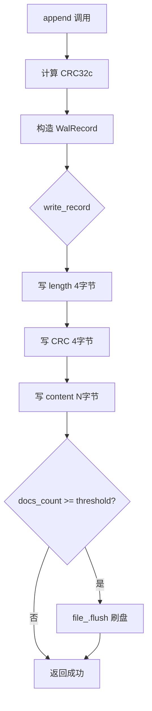
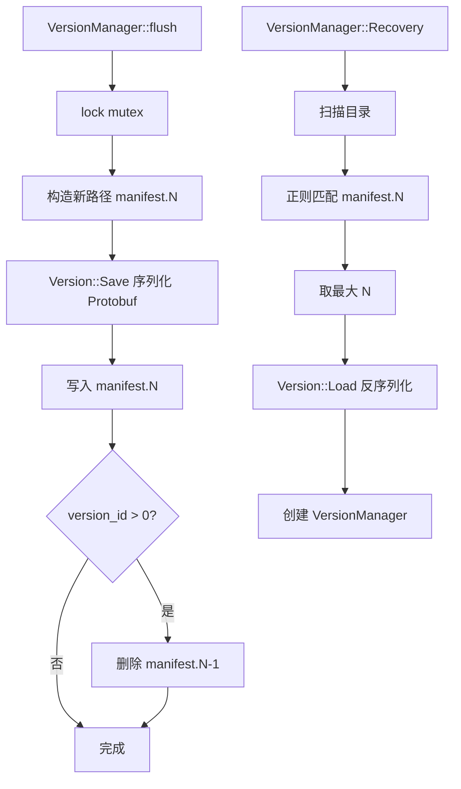
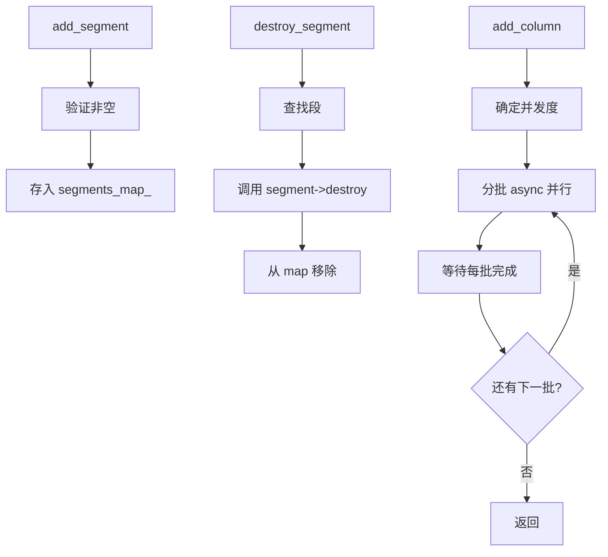

# PD-234.01 zvec — WAL 段管理与 Protobuf 版本快照

> 文档编号：PD-234.01
> 来源：zvec `src/db/index/storage/wal/`, `src/db/index/segment/`, `src/db/index/common/version_manager.h`
> GitHub：https://github.com/alibaba/zvec.git
> 问题域：PD-234 WAL 持久化与段管理
> 状态：可复用方案

---

## 第 1 章 问题与动机

### 1.1 核心问题

向量数据库在写入路径上面临三个关键挑战：

1. **写入原子性**：单条或批量写入操作必须保证要么全部成功、要么可回放恢复，不能出现半写状态
2. **多段生命周期管理**：随着数据量增长，需要将数据分散到多个段（Segment）中，每个段有独立的创建、持久化、合并（Compact）、销毁生命周期
3. **元数据版本一致性**：Schema 变更、段增删、索引创建等操作都需要原子地更新元数据快照，崩溃后能恢复到最近一致状态

这三个问题在向量数据库场景下尤为突出，因为向量索引构建耗时长、数据量大，任何中间状态的不一致都可能导致索引损坏或数据丢失。

### 1.2 zvec 的解法概述

zvec 采用三层持久化架构来解决上述问题：

1. **WalFile 抽象层**：通过 `WalFile` 纯虚基类 + `LocalWalFile` 本地实现，提供 CRC32c 校验的追加写日志，支持可配置的自动 flush 阈值（`local_wal_file.cc:27-48`）
2. **SegmentManager 容器**：用 `unordered_map<SegmentID, Segment::Ptr>` 管理多段，提供 add/remove/destroy 生命周期操作，列变更时通过 `std::async` 并行处理所有段（`segment_manager.cc:84-115`）
3. **VersionManager + Protobuf Manifest**：将 Schema、所有段元数据、写入段状态序列化为 `proto::Manifest`，通过递增版本号文件（`manifest.{N}`）实现原子切换，恢复时取最大版本号（`version_manager.cc:188-238`）
4. **CollectionImpl 编排层**：在 `collection.cc` 中将 WAL、Segment、Version 三层串联，实现 create → recovery → write → flush → compact 完整生命周期（`collection.cc:283-304`）
5. **DeleteStore + RoaringBitmap**：用 `ConcurrentRoaringBitmap64` 追踪已删除文档 ID，支持序列化/反序列化和增量修改检测（`delete_store.h:74-94`）

### 1.3 设计思想

| 设计原则 | 具体实现 | 理由 | 替代方案 |
|----------|----------|------|----------|
| WAL 与存储分离 | WalFile 纯虚基类，LocalWalFile 为本地实现 | 可扩展为分布式 WAL（如 S3 WAL） | 直接写文件，无抽象层 |
| CRC 校验每条记录 | append 时计算 CRC32c，read 时验证 | 检测磁盘位翻转和部分写入 | 仅校验文件头 |
| Protobuf 序列化版本 | Version 通过 proto::Manifest 序列化 | 跨语言兼容、向前兼容 | JSON/自定义二进制格式 |
| 版本号递增文件 | manifest.0, manifest.1, ... 写新删旧 | 原子切换，崩溃安全 | 单文件覆盖写 |
| 段内 Block 分层 | SegmentMeta 区分 persisted_blocks 和 writing_forward_block | 读写分离，持久化块只读 | 单一块列表 |
| 并行列操作 | SegmentManager::add_column 用 std::async 并行 | 多段列变更加速 | 串行遍历 |

---

## 第 2 章 源码实现分析

### 2.1 架构概览

zvec 的持久化架构分为四层，从上到下依次为 Collection → Segment → Storage → WAL：

```
┌─────────────────────────────────────────────────────────┐
│                   CollectionImpl                         │
│  ┌──────────┐  ┌───────────────┐  ┌──────────────────┐  │
│  │ IDMap    │  │ VersionManager│  │  DeleteStore     │  │
│  │(RocksDB) │  │ (Protobuf)   │  │ (RoaringBitmap)  │  │
│  └──────────┘  └───────────────┘  └──────────────────┘  │
│  ┌──────────────────────────────────────────────────┐   │
│  │              SegmentManager                       │   │
│  │  ┌─────────┐  ┌─────────┐  ┌─────────────────┐  │   │
│  │  │Segment 0│  │Segment 1│  │ writing_segment  │  │   │
│  │  │(sealed) │  │(sealed) │  │   (active)       │  │   │
│  │  └─────────┘  └─────────┘  └─────────────────┘  │   │
│  └──────────────────────────────────────────────────┘   │
│  ┌──────────────────────────────────────────────────┐   │
│  │  Storage Layer                                    │   │
│  │  ┌────────────┐ ┌──────────┐ ┌────────────────┐  │   │
│  │  │ WalFile    │ │ mmap     │ │ BufferPool     │  │   │
│  │  │(CRC32c)   │ │ Forward  │ │ Forward        │  │   │
│  │  └────────────┘ └──────────┘ └────────────────┘  │   │
│  └──────────────────────────────────────────────────┘   │
└─────────────────────────────────────────────────────────┘
```

### 2.2 核心实现

#### 2.2.1 WAL 记录格式与 CRC 校验



对应源码 `src/db/index/storage/wal/local_wal_file.cc:27-48`：

```cpp
int LocalWalFile::append(std::string &&data) {
  WalRecord record;
  record.length_ = data.size();
  record.crc_ = ailego::Crc32c::Hash(
      reinterpret_cast<const void *>(data.data()), record.length_, 0);
  record.content_ = std::forward<std::string>(data);

  if (write_record(record) < 0) {
    WLOG_ERROR("Wal write record error. record.length_[%zu]",
               (size_t)record.length_);
    return -1;
  }
  // if max_docs_wal_flush_ is 0, no need flush
  if (max_docs_wal_flush_ != 0 && docs_count_ >= max_docs_wal_flush_) {
    if (!file_.flush()) {
      WLOG_ERROR("Wal flush error. docs_count_[%zu] max_docs_wal_flush_[%zu]",
                 (size_t)docs_count_, (size_t)max_docs_wal_flush_);
    }
    docs_count_ = 0;
  }
  return 0;
}
```

WAL 记录的物理布局为 `[length:4B][crc:4B][content:NB]`，每条记录最大 4MB（`MAX_RECORD_SIZE`）。写入时通过 `file_mutex_` 保证线程安全（`local_wal_file.cc:165`），读取时通过 CRC 验证数据完整性（`local_wal_file.cc:50-66`）。

WAL 文件头为 64 字节对齐的 `WalHeader`（`local_wal_file.h:31-34`），包含版本号和 7 个保留字段，通过 `static_assert` 编译期保证对齐。

#### 2.2.2 VersionManager 的 Protobuf 持久化与崩溃恢复



对应源码 `src/db/index/common/version_manager.cc:279-298`：

```cpp
Status VersionManager::flush() {
  std::lock_guard lock(mtx_);

  std::string current_path;
  if (version_id_ != 0) {
    current_path =
        FileHelper::MakeFilePath(path_, FileID::MANIFEST_FILE, version_id_ - 1);
  }

  auto s = Version::Save(
      FileHelper::MakeFilePath(path_, FileID::MANIFEST_FILE, version_id_++),
      current_version_);
  CHECK_RETURN_STATUS(s);

  if (!current_path.empty()) {
    FileHelper::RemoveFile(current_path);
  }

  return Status::OK();
}
```

关键设计：先写新版本文件再删旧版本文件。如果在写新文件后、删旧文件前崩溃，恢复时会找到两个 manifest 文件，取最大版本号即可。如果在写新文件过程中崩溃，旧文件仍完整可用。

Recovery 流程（`version_manager.cc:188-238`）通过正则 `^manifest\.(\d+)$` 扫描目录，找到最大版本号的 manifest 文件，反序列化为 `Version` 对象。

#### 2.2.3 SegmentManager 的段生命周期与并行列操作



对应源码 `src/db/index/segment/segment_manager.cc:84-115`：

```cpp
Status SegmentManager::add_column(const FieldSchema::Ptr &column_schema,
                                  const std::string &expression,
                                  int concurrency) {
  if (concurrency <= 0) {
    concurrency = static_cast<int>(std::thread::hardware_concurrency());
  }

  std::vector<std::future<Status>> futures;
  std::vector<std::pair<SegmentID, Segment::Ptr>> segments(
      segments_map_.begin(), segments_map_.end());

  for (size_t i = 0; i < segments.size(); i += concurrency) {
    size_t end = std::min(i + concurrency, segments.size());
    for (size_t j = i; j < end; ++j) {
      auto &segment = segments[j].second;
      futures.emplace_back(std::async(std::launch::async, [&]() -> Status {
        return segment->add_column(column_schema, expression,
                                   AddColumnOptions{concurrency});
      }));
    }

    for (auto it = futures.begin(); it != futures.end(); ++it) {
      Status status = it->get();
      if (!status.ok()) {
        return status;
      }
    }
    futures.clear();
  }

  return Status::OK();
}
```

段的排序通过 `min_doc_id` 实现（`segment_manager.cc:58-68`），保证查询时可以用二分查找定位文档所在段（`collection.cc:1846-1865`）。

### 2.3 实现细节

**段切换流程**：当 `writing_segment_` 的文档数达到 `max_doc_count_per_segment` 时，触发 `switch_to_new_segment_for_writing`（`collection.cc:1480-1515`）：
1. 调用 `writing_segment_->dump()` 将当前段持久化
2. 将旧段加入 `segment_manager_`
3. 创建新的 writing segment
4. 更新 Version 并 flush

**Compact 流程**（`collection.cc:786-922`）：
- 根据删除比例（`COMPACT_DELETE_RATIO_THRESHOLD`）决定是否需要 rebuild
- 构建 CompactTask，使用临时段 ID 避免冲突
- 执行完成后在写锁保护下原子更新 Version
- 先 rename 临时段目录为正式段目录，再更新 manifest

**DeleteStore**（`delete_store.h:74-94`）：
- 使用 `ConcurrentRoaringBitmap64` 高效存储已删除文档 ID
- `modified_since_last_flush_` 标记追踪增量修改
- `make_filter()` 返回 `IndexFilter` 接口，空 bitmap 时返回 nullptr 避免无谓过滤

---

## 第 3 章 迁移指南

### 3.1 迁移清单

**阶段 1：WAL 层（1 个文件）**
- [ ] 实现 `WalFile` 抽象接口（append / prepare_for_read / next / open / close / flush / remove）
- [ ] 实现 `LocalWalFile`：64 字节对齐文件头 + `[length:4B][crc:4B][content:NB]` 记录格式
- [ ] 集成 CRC32c 库（可用 `crc32c` crate / `crc32c` npm 包 / `google/crc32c` C 库）
- [ ] 实现可配置的自动 flush 阈值（`max_docs_wal_flush`）

**阶段 2：Version 层（2 个文件）**
- [ ] 定义 Version 数据结构：schema + persisted_segment_metas + writing_segment_meta + next_segment_id
- [ ] 实现 Protobuf/JSON 序列化（定义 Manifest proto 或等效 schema）
- [ ] 实现 VersionManager：线程安全的 get/apply/flush，递增版本号文件命名
- [ ] 实现 Recovery：扫描目录找最大版本号 manifest 文件

**阶段 3：Segment 层（3 个文件）**
- [ ] 定义 SegmentMeta：persisted_blocks + writing_forward_block + indexed_vector_fields
- [ ] 实现 SegmentManager：add/remove/destroy + 按 min_doc_id 排序
- [ ] 实现段切换逻辑：dump 当前段 → 加入 manager → 创建新段 → 更新 Version

**阶段 4：Collection 编排层**
- [ ] 实现 create 流程：初始化 IDMap + DeleteStore + VersionManager + writing_segment
- [ ] 实现 recovery 流程：VersionManager::Recovery → 恢复段 → 恢复 IDMap/DeleteStore
- [ ] 实现 Compact 流程：构建 CompactTask → 执行 → 原子更新 Version

### 3.2 适配代码模板

以下为 Python 版本的 WAL + VersionManager 核心模板，可直接运行：

```python
import struct
import os
import json
import glob
import re
from dataclasses import dataclass, field, asdict
from typing import Optional
from zlib import crc32


# ─── WAL Layer ───

WAL_HEADER_SIZE = 64
WAL_VERSION = 0
LENGTH_SIZE = 4
CRC_SIZE = 4
MAX_RECORD_SIZE = 4 * 1024 * 1024  # 4MB


class WalFile:
    """Write-Ahead Log with CRC32 integrity check."""

    def __init__(self, path: str):
        self.path = path
        self._file = None
        self._max_docs_flush = 0
        self._docs_count = 0

    def open(self, create_new: bool = False, max_docs_flush: int = 0):
        self._max_docs_flush = max_docs_flush
        if create_new:
            self._file = open(self.path, "wb+")
            header = struct.pack("<Q", WAL_VERSION) + b"\x00" * (WAL_HEADER_SIZE - 8)
            self._file.write(header)
        else:
            self._file = open(self.path, "ab+")

    def append(self, data: bytes) -> None:
        crc = crc32(data) & 0xFFFFFFFF
        length = len(data)
        self._file.write(struct.pack("<I", length))
        self._file.write(struct.pack("<I", crc))
        self._file.write(data)
        self._docs_count += 1
        if self._max_docs_flush > 0 and self._docs_count >= self._max_docs_flush:
            self._file.flush()
            os.fsync(self._file.fileno())
            self._docs_count = 0

    def read_all(self):
        """Generator that yields validated records."""
        self._file.seek(WAL_HEADER_SIZE)
        while True:
            length_bytes = self._file.read(LENGTH_SIZE)
            if len(length_bytes) < LENGTH_SIZE:
                break
            length = struct.unpack("<I", length_bytes)[0]
            if length == 0 or length > MAX_RECORD_SIZE:
                break
            crc_bytes = self._file.read(CRC_SIZE)
            if len(crc_bytes) < CRC_SIZE:
                break
            expected_crc = struct.unpack("<I", crc_bytes)[0]
            content = self._file.read(length)
            if len(content) < length:
                break
            actual_crc = crc32(content) & 0xFFFFFFFF
            if actual_crc != expected_crc:
                break  # CRC mismatch, stop replay
            yield content

    def flush(self):
        if self._file:
            self._file.flush()
            os.fsync(self._file.fileno())

    def close(self):
        if self._file:
            self._file.close()
            self._file = None

    def remove(self):
        self.close()
        if os.path.exists(self.path):
            os.remove(self.path)


# ─── Version Layer ───

@dataclass
class SegmentMeta:
    id: int
    min_doc_id: int = 0
    max_doc_id: int = 0
    doc_count: int = 0
    persisted: bool = False


@dataclass
class Version:
    schema: dict = field(default_factory=dict)
    persisted_segments: list = field(default_factory=list)
    writing_segment: Optional[SegmentMeta] = None
    next_segment_id: int = 0

    def save(self, path: str):
        data = {
            "schema": self.schema,
            "persisted_segments": [asdict(s) for s in self.persisted_segments],
            "writing_segment": asdict(self.writing_segment) if self.writing_segment else None,
            "next_segment_id": self.next_segment_id,
        }
        with open(path, "w") as f:
            json.dump(data, f)

    @classmethod
    def load(cls, path: str) -> "Version":
        with open(path) as f:
            data = json.load(f)
        v = cls()
        v.schema = data["schema"]
        v.persisted_segments = [SegmentMeta(**s) for s in data["persisted_segments"]]
        if data["writing_segment"]:
            v.writing_segment = SegmentMeta(**data["writing_segment"])
        v.next_segment_id = data["next_segment_id"]
        return v


class VersionManager:
    """Thread-safe version manager with crash-safe manifest rotation."""

    MANIFEST_PREFIX = "manifest"

    def __init__(self, path: str, version: Version, version_id: int = 0):
        self.path = path
        self._version = version
        self._version_id = version_id

    @classmethod
    def create(cls, path: str, version: Version) -> "VersionManager":
        return cls(path, version)

    @classmethod
    def recovery(cls, path: str) -> "VersionManager":
        pattern = re.compile(rf"^{cls.MANIFEST_PREFIX}\.(\d+)$")
        max_id = -1
        for fname in os.listdir(path):
            m = pattern.match(fname)
            if m:
                vid = int(m.group(1))
                if vid > max_id:
                    max_id = vid
        if max_id < 0:
            raise FileNotFoundError(f"No manifest found in {path}")
        version = Version.load(os.path.join(path, f"{cls.MANIFEST_PREFIX}.{max_id}"))
        return cls(path, version, max_id + 1)

    def get_current_version(self) -> Version:
        return self._version

    def apply(self, version: Version):
        self._version = version

    def flush(self):
        old_path = None
        if self._version_id > 0:
            old_path = os.path.join(
                self.path, f"{self.MANIFEST_PREFIX}.{self._version_id - 1}"
            )
        new_path = os.path.join(
            self.path, f"{self.MANIFEST_PREFIX}.{self._version_id}"
        )
        self._version.save(new_path)
        self._version_id += 1
        if old_path and os.path.exists(old_path):
            os.remove(old_path)
```

### 3.3 适用场景

| 场景 | 适用度 | 说明 |
|------|--------|------|
| 向量数据库写入路径 | ⭐⭐⭐ | 完全匹配：WAL + 段管理 + 版本快照 |
| 嵌入式 KV 存储 | ⭐⭐⭐ | WAL + Manifest 模式是 LSM-Tree 标配 |
| Agent 记忆持久化 | ⭐⭐ | 可简化为 WAL + 单版本文件 |
| 日志收集系统 | ⭐⭐ | WAL 追加写 + CRC 校验直接可用 |
| 实时流处理 checkpoint | ⭐ | 需要额外的 exactly-once 语义 |

---

## 第 4 章 测试用例

```python
import os
import tempfile
import struct
import pytest
from zlib import crc32


class TestWalFile:
    """基于 zvec WalFile 接口设计的测试用例。"""

    def setup_method(self):
        self.tmpdir = tempfile.mkdtemp()
        self.wal_path = os.path.join(self.tmpdir, "test.wal")

    def test_append_and_read(self):
        """正常路径：写入多条记录后全部读回。"""
        wal = WalFile(self.wal_path)
        wal.open(create_new=True)
        records = [b"hello", b"world", b"test data " * 100]
        for r in records:
            wal.append(r)
        wal.flush()

        read_records = list(wal.read_all())
        assert read_records == records
        wal.close()

    def test_crc_corruption_detection(self):
        """边界情况：篡改 CRC 后读取应停止。"""
        wal = WalFile(self.wal_path)
        wal.open(create_new=True)
        wal.append(b"good record")
        wal.append(b"bad record")
        wal.close()

        # 篡改第二条记录的 CRC
        with open(self.wal_path, "r+b") as f:
            f.seek(64 + 4 + 4 + len(b"good record") + 4)  # 跳到第二条 CRC
            f.write(b"\xff\xff\xff\xff")

        wal2 = WalFile(self.wal_path)
        wal2.open(create_new=False)
        records = list(wal2.read_all())
        assert len(records) == 1  # 只能读到第一条
        assert records[0] == b"good record"
        wal2.close()

    def test_auto_flush_threshold(self):
        """自动 flush 阈值触发。"""
        wal = WalFile(self.wal_path)
        wal.open(create_new=True, max_docs_flush=2)
        wal.append(b"record1")
        assert wal._docs_count == 1
        wal.append(b"record2")
        assert wal._docs_count == 0  # 达到阈值后重置
        wal.close()

    def test_empty_wal_read(self):
        """空 WAL 文件读取返回空。"""
        wal = WalFile(self.wal_path)
        wal.open(create_new=True)
        records = list(wal.read_all())
        assert records == []
        wal.close()

    def test_max_record_size_guard(self):
        """超大记录的长度字段防护。"""
        wal = WalFile(self.wal_path)
        wal.open(create_new=True)
        # 手动写入一个 length 超过 MAX_RECORD_SIZE 的假记录
        wal._file.write(struct.pack("<I", 5 * 1024 * 1024))  # 5MB > 4MB limit
        wal._file.write(struct.pack("<I", 0))
        wal._file.flush()
        records = list(wal.read_all())
        assert records == []  # 应该拒绝读取
        wal.close()


class TestVersionManager:
    """基于 zvec VersionManager 接口设计的测试用例。"""

    def setup_method(self):
        self.tmpdir = tempfile.mkdtemp()

    def test_create_and_flush(self):
        """正常路径：创建 → flush → 文件存在。"""
        v = Version(schema={"dim": 128}, next_segment_id=1)
        vm = VersionManager.create(self.tmpdir, v)
        vm.flush()
        assert os.path.exists(os.path.join(self.tmpdir, "manifest.0"))

    def test_recovery(self):
        """崩溃恢复：flush 两次后 recovery 取最新版本。"""
        v1 = Version(schema={"dim": 128}, next_segment_id=1)
        vm = VersionManager.create(self.tmpdir, v1)
        vm.flush()

        v2 = Version(schema={"dim": 256}, next_segment_id=2)
        vm.apply(v2)
        vm.flush()

        # manifest.0 应已被删除，只剩 manifest.1
        assert not os.path.exists(os.path.join(self.tmpdir, "manifest.0"))
        assert os.path.exists(os.path.join(self.tmpdir, "manifest.1"))

        vm2 = VersionManager.recovery(self.tmpdir)
        recovered = vm2.get_current_version()
        assert recovered.schema == {"dim": 256}
        assert recovered.next_segment_id == 2

    def test_recovery_no_manifest(self):
        """降级行为：无 manifest 文件时抛异常。"""
        with pytest.raises(FileNotFoundError):
            VersionManager.recovery(self.tmpdir)

    def test_version_with_segments(self):
        """段元数据序列化/反序列化。"""
        seg = SegmentMeta(id=0, min_doc_id=0, max_doc_id=99, doc_count=100, persisted=True)
        v = Version(
            schema={"dim": 128},
            persisted_segments=[seg],
            writing_segment=SegmentMeta(id=1, min_doc_id=100),
            next_segment_id=2,
        )
        vm = VersionManager.create(self.tmpdir, v)
        vm.flush()

        vm2 = VersionManager.recovery(self.tmpdir)
        recovered = vm2.get_current_version()
        assert len(recovered.persisted_segments) == 1
        assert recovered.persisted_segments[0].doc_count == 100
        assert recovered.writing_segment.id == 1
```

---

## 第 5 章 跨域关联

| 关联域 | 关系类型 | 说明 |
|--------|----------|------|
| PD-01 上下文管理 | 协同 | WAL 的 `max_docs_wal_flush` 阈值控制类似上下文窗口的缓冲区大小管理 |
| PD-03 容错与重试 | 依赖 | WAL CRC 校验 + Version 递增文件是容错的基础设施；崩溃恢复依赖 VersionManager::Recovery |
| PD-06 记忆持久化 | 协同 | Version 的 Protobuf Manifest 模式可直接用于 Agent 记忆的版本化持久化 |
| PD-07 质量检查 | 协同 | CRC32c 校验是数据质量的底层保障；Compact 时的删除比例阈值是质量驱动的优化决策 |
| PD-11 可观测性 | 协同 | WAL 和 VersionManager 中大量 LOG_INFO/LOG_ERROR 调用提供了操作级可观测性 |

---

## 第 6 章 来源文件索引

| 文件 | 行范围 | 关键实现 |
|------|--------|----------|
| `src/db/index/storage/wal/wal_file.h` | L27-L66 | WalFile 抽象接口 + WalOptions |
| `src/db/index/storage/wal/local_wal_file.h` | L31-L96 | WalHeader 64B 对齐 + WalRecord + LocalWalFile 类定义 |
| `src/db/index/storage/wal/local_wal_file.cc` | L27-L243 | append/next/open/close/flush/write_record/read_record 完整实现 |
| `src/db/index/common/version_manager.h` | L28-L238 | Version 数据结构 + VersionManager 线程安全包装 |
| `src/db/index/common/version_manager.cc` | L36-L298 | Protobuf 序列化/反序列化 + Recovery 扫描 + flush 版本轮转 |
| `src/db/index/segment/segment_manager.h` | L21-L54 | SegmentManager 接口定义 |
| `src/db/index/segment/segment_manager.cc` | L26-L157 | add/remove/destroy/get_segments + 并行 add_column |
| `src/db/index/segment/segment.h` | L42-L180 | Segment 抽象接口（CreateAndOpen/Open/flush/dump/destroy） |
| `src/db/index/common/meta.h` | L32-L433 | BlockMeta + SegmentMeta 元数据结构 |
| `src/db/index/common/delete_store.h` | L27-L149 | DeleteStore + ConcurrentRoaringBitmap64 删除追踪 |
| `src/db/collection.cc` | L283-L304 | Collection::Open 创建/恢复分支 |
| `src/db/collection.cc` | L632-L688 | recovery 流程 |
| `src/db/collection.cc` | L786-L922 | Optimize/Compact 流程 |
| `src/db/collection.cc` | L1480-L1515 | switch_to_new_segment_for_writing 段切换 |

---

## 第 7 章 横向对比维度

```json comparison_data
{
  "project": "zvec",
  "dimensions": {
    "WAL 记录格式": "length(4B)+CRC32c(4B)+content，单条最大 4MB，64B 对齐文件头",
    "段生命周期": "SegmentManager unordered_map 管理，按 min_doc_id 排序，支持并行列操作",
    "版本快照管理": "Protobuf Manifest 递增文件（manifest.N），写新删旧，崩溃取最大版本号",
    "刷盘策略": "可配置 max_docs_wal_flush 阈值自动 flush，0 表示不自动刷盘",
    "崩溃恢复": "正则扫描 manifest 目录取最大版本号，逐段 Open 恢复 + IDMap/DeleteStore 重建",
    "删除追踪": "ConcurrentRoaringBitmap64 + 增量修改标记，make_filter 空 bitmap 返回 nullptr",
    "并发控制": "mutex 保护 WAL 写入和 Version 操作，shared_mutex 分离读写锁，file_lock 进程级互斥"
  }
}
```

### 域元数据补充

```json domain_metadata
{
  "solution_summary": "zvec 用 CRC32c 校验的 WAL 追加写 + Protobuf Manifest 递增版本文件 + SegmentManager 多段生命周期管理，实现向量数据库的崩溃安全持久化",
  "description": "面向向量数据库的写入路径持久化，涵盖 WAL 完整性校验与多段并行列操作",
  "sub_problems": [
    "进程级文件锁与读写模式隔离",
    "段切换时的 dump-seal-create 三步原子操作",
    "Compact 时临时段 ID 与目录 rename 原子切换"
  ],
  "best_practices": [
    "Manifest 写新删旧保证崩溃安全",
    "ConcurrentRoaringBitmap 高效追踪删除状态",
    "并行 std::async 加速多段列变更"
  ]
}
```
