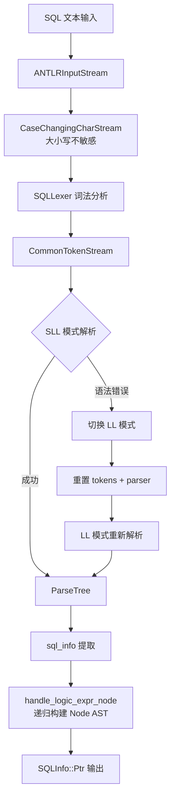
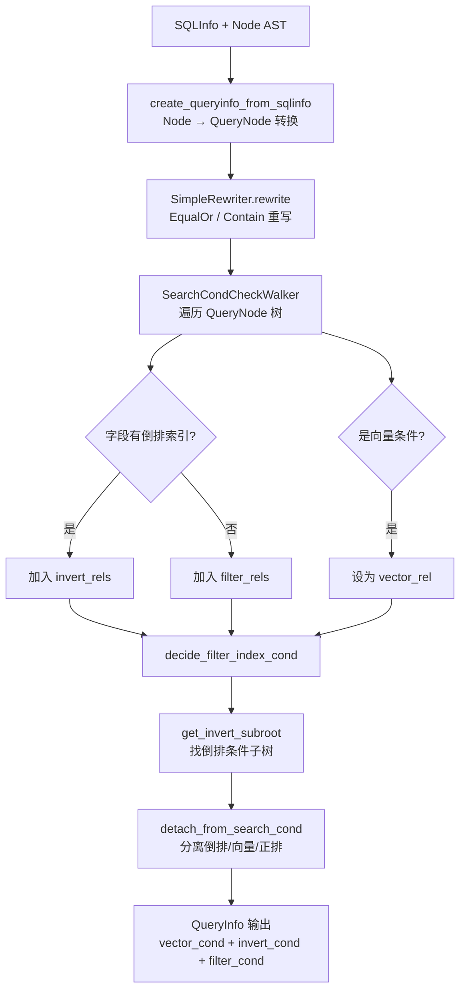
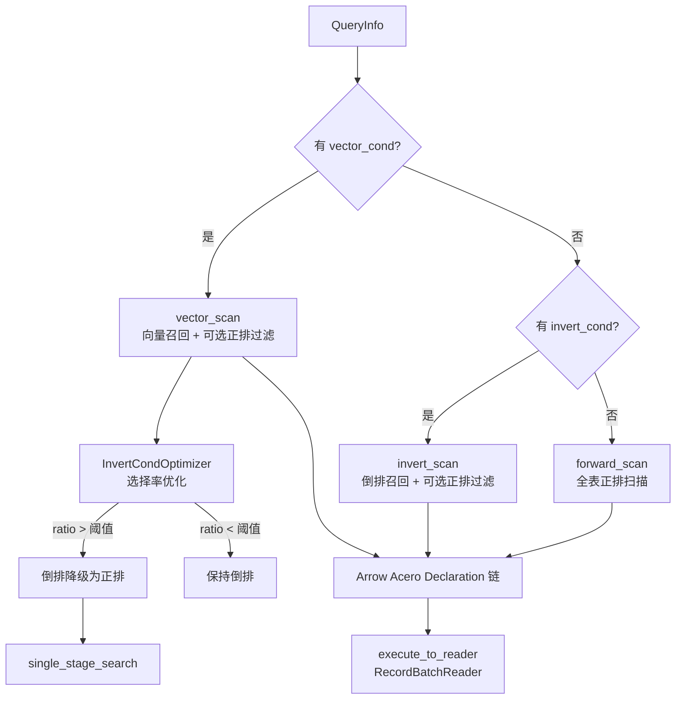
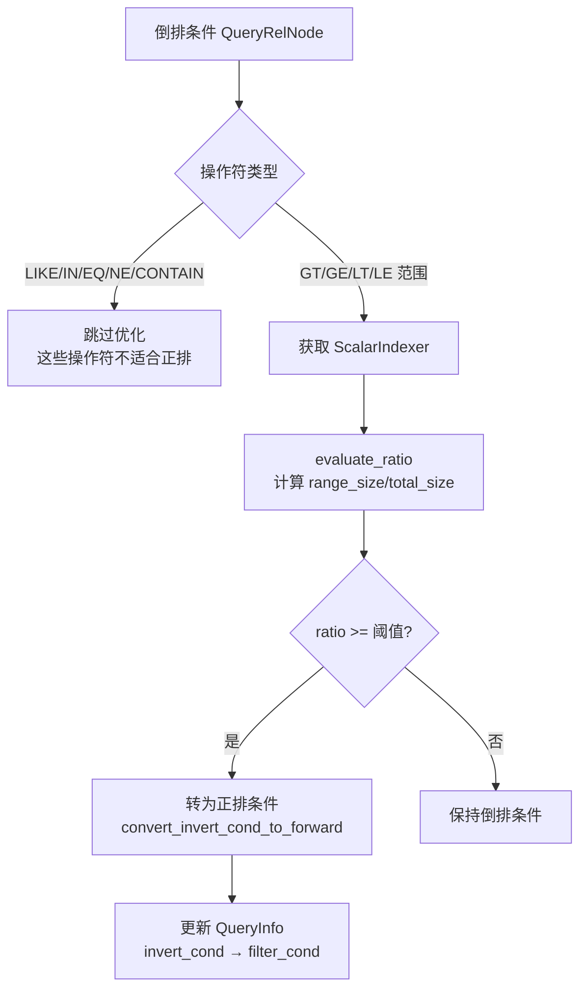

# PD-235.01 zvec — ANTLR SQL 引擎与三策略物理执行计划

> 文档编号：PD-235.01
> 来源：zvec `src/db/sqlengine/`
> GitHub：https://github.com/alibaba/zvec.git
> 问题域：PD-235 SQL 过滤引擎 SQL Filter Engine
> 状态：可复用方案

---

## 第 1 章 问题与动机（≥ 30 行）

### 1.1 核心问题

向量数据库需要在海量向量检索的同时支持标量过滤。用户期望用类 SQL 语法表达复杂的混合查询——既包含向量相似度搜索，又包含标量字段的精确匹配、范围过滤、IN 列表、LIKE 模糊匹配等。核心挑战在于：

1. **SQL 解析的完整性**：需要支持 WHERE 子句中的 AND/OR 逻辑组合、嵌套括号、向量字面量 `[1.0, 2.0, ...]` 等非标准 SQL 语法
2. **语义分析的正确性**：解析后的 AST 需要与 Collection Schema 绑定，区分哪些条件走倒排索引、哪些走正排扫描、哪些是向量搜索
3. **执行计划的高效性**：根据条件类型和数据分布，自动选择 vector_scan / invert_scan / forward_scan 三种物理扫描策略
4. **选择率优化**：当倒排索引条件匹配比例过高时（如 `age > 10` 匹配 90% 数据），倒排扫描反而比正排扫描慢，需要自动降级

### 1.2 zvec 的解法概述

zvec 内嵌了一个完整的三层 SQL 引擎，从 SQL 文本到物理执行计划全链路自研：

1. **ANTLR 生成的 SQL 解析器**：用 `SQLParser.g4` 定义向量数据库专用 SQL 语法，ANTLR 自动生成 C++ 词法/语法分析器，`ZVecSQLParser` 将 ANTLR ParseTree 转换为内部 AST（`Node` 树）（`src/db/sqlengine/parser/zvec_sql_parser.cc:35-92`）
2. **QueryAnalyzer 语义分析**：将 Parser 层的 `Node` 树转换为 `QueryNode` 树，同时完成 schema 校验、条件分类（vector/invert/forward）、查询重写（`SimpleRewriter`）（`src/db/sqlengine/analyzer/query_analyzer.cc:66-194`）
3. **QueryPlanner 物理计划生成**：根据 QueryInfo 中的条件分类，选择 `vector_scan` / `invert_scan` / `forward_scan` 三种策略之一，生成 Arrow Acero `Declaration` 执行计划（`src/db/sqlengine/planner/query_planner.cc:331-342`）
4. **InvertCondOptimizer 选择率优化**：通过 `evaluate_ratio()` 评估倒排条件的选择率，超过阈值时自动将倒排条件降级为正排过滤（`src/db/sqlengine/planner/optimizer.cc:32-95`）
5. **Arrow Acero 执行引擎**：最终的物理计划是 Arrow Acero 的 `Declaration` 链，利用 Arrow 的列式计算能力执行过滤、排序、投影等操作

### 1.3 设计思想

| 设计原则 | 具体实现 | 理由 | 替代方案 |
|----------|----------|------|----------|
| 三层解耦 | Parser → Analyzer → Planner 严格分层 | 每层职责单一，Parser 不感知 Schema，Analyzer 不感知物理存储 | 单层直接从 SQL 生成执行计划（耦合度高） |
| ANTLR 生成解析器 | `.g4` 语法文件 + 自动生成 C++ 代码 | 语法变更只需改 `.g4`，无需手写递归下降 | 手写 Parser（灵活但维护成本高） |
| 双 AST 设计 | Parser 层 `Node` 树 → Analyzer 层 `QueryNode` 树 | `Node` 只读不可变，`QueryNode` 可被 Optimizer 修改 | 单 AST + 标记位（容易出错） |
| 选择率驱动优化 | `evaluate_ratio()` 评估倒排命中比例 | 高选择率时倒排扫描退化为全表扫描，正排更快 | 固定策略（无法适应数据分布） |
| Arrow Acero 执行 | 物理计划编译为 `Declaration` 链 | 复用 Arrow 的列式计算、SIMD 优化、零拷贝 | 自研执行引擎（开发成本高） |
| SLL → LL 降级解析 | 先用 SLL 模式解析，失败后切换 LL | SLL 更快，LL 更准确，兼顾性能和正确性 | 直接用 LL（性能损失） |

---

## 第 2 章 源码实现分析（≥ 60 行，核心章节）

### 2.1 架构概览

zvec SQL 引擎的整体架构是经典的三层编译器流水线，外加一个基于选择率的优化器：

```
┌─────────────────────────────────────────────────────────────────┐
│                     SQLEngineImpl (入口)                         │
│  sqlengine_impl.cc:52 execute() / :93 execute_group_by()        │
└──────────┬──────────────────────────────────────────────────────┘
           │ parse_request()
           ▼
┌──────────────────────┐    ┌──────────────────────┐
│   Parser Layer       │    │   ANTLR Generated    │
│  ZVecSQLParser       │◄───│  SQLLexer + SQLParser│
│  zvec_sql_parser.cc  │    │  SQLParser.g4        │
└──────────┬───────────┘    └──────────────────────┘
           │ SQLInfo (Node AST)
           ▼
┌──────────────────────┐    ┌──────────────────────┐
│   Analyzer Layer     │    │   SimpleRewriter     │
│  QueryAnalyzer       │◄───│  EqualOrRewriteRule  │
│  query_analyzer.cc   │    │  ContainRewriteRule  │
└──────────┬───────────┘    └──────────────────────┘
           │ QueryInfo (QueryNode AST + 条件分类)
           ▼
┌──────────────────────┐    ┌──────────────────────┐
│   Planner Layer      │    │  InvertCondOptimizer │
│  QueryPlanner        │◄───│  ratio_rule()        │
│  query_planner.cc    │    │  evaluate_ratio()    │
└──────────┬───────────┘    └──────────────────────┘
           │ PlanInfo (Arrow Acero Declaration)
           ▼
┌──────────────────────────────────────────────────┐
│   Execution Layer (Arrow Acero)                   │
│  source → filter → project → order_by → fetch    │
│  + 自定义 Op: CheckNotFiltered, Contain, FetchVec│
└──────────────────────────────────────────────────┘
```

### 2.2 核心实现

#### 2.2.1 ANTLR SQL 解析与 SLL/LL 降级



对应源码 `src/db/sqlengine/parser/zvec_sql_parser.cc:35-92`：

```cpp
SQLInfo::Ptr ZVecSQLParser::parse(const std::string &query,
                                  bool need_formatted_tree) {
  try {
    ANTLRInputStream input(query);
    CaseChangingCharStream in(&input, true);  // 大小写不敏感
    SQLLexer lexer(&in);
    CommonTokenStream tokens(&lexer);
    SQLParser parser(&tokens);

    // 替换错误监听器
    ErrorVerboseListener lexer_error_listener;
    lexer.removeErrorListeners();
    lexer.addErrorListener((ANTLRErrorListener *)&lexer_error_listener);
    ErrorVerboseListener parser_error_listener;
    parser.removeErrorListeners();
    parser.addErrorListener((ANTLRErrorListener *)&parser_error_listener);

    ParseTree *tree = parser.compilation_unit();

    // SLL 失败时降级到 LL
    if (lexer.getNumberOfSyntaxErrors() > 0 ||
        parser.getNumberOfSyntaxErrors() > 0) {
      LOG_INFO("SLL failed. using LL");
      tokens.reset();
      parser.reset();
      parser.getInterpreter<ParserATNSimulator>()->setPredictionMode(
          PredictionMode::LL);
      tree = parser.compilation_unit();
    }
    // ... 错误检查 + sql_info 提取
    SQLInfo::Ptr sqlInfo = sql_info(tree);
    return sqlInfo;
  } catch (std::exception &e) {
    err_msg_ = "parse error [" + std::string(e.what()) + "]";
    return nullptr;
  }
}
```

#### 2.2.2 QueryAnalyzer 条件分类与三路分离



对应源码 `src/db/sqlengine/analyzer/query_analyzer.cc:259-316`：

```cpp
Status QueryAnalyzer::decide_filter_index_cond(
    const CollectionSchema &schema,
    const SearchCondCheckWalker &search_cond_check_walker,
    QueryInfo *query_info) {
  const std::vector<QueryRelNode *> &filter_rels =
      search_cond_check_walker.filter_rels();
  const std::vector<QueryRelNode *> &invert_rels =
      search_cond_check_walker.invert_rels();
  QueryRelNode *vector_rel = search_cond_check_walker.vector_rel();

  // 倒排条件：找到同一子树下的所有倒排条件，整体分离
  if (invert_rels.size() > 0) {
    QueryNode *invert_subroot =
        get_invert_subroot(query_info->search_cond().get());
    if (invert_subroot != nullptr) {
      query_info->set_invert_cond(
          invert_subroot->detach_from_search_cond(query_info));
    }
  }

  // 向量条件：从搜索条件中分离，不允许在 OR 下
  if (vector_rel != nullptr) {
    if (vector_rel->or_ancestor()) {
      return Status::InvalidArgument(
          "vector condition must NOT be OR ancestor.");
    }
    // ... check_and_convert_vector
    vector_rel->detach_from_search_cond(query_info);
    query_info->set_vector_cond_info(std::move(vector_cond_info));
  }

  // 剩余条件作为正排过滤
  if (query_info->search_cond() != nullptr && filter_rels.size() != 0) {
    query_info->set_filter_cond(query_info->search_cond());
  }
  query_info->set_search_cond(nullptr);
  return Status::OK();
}
```

#### 2.2.3 QueryPlanner 三策略物理计划生成



对应源码 `src/db/sqlengine/planner/query_planner.cc:344-424`：

```cpp
Result<PlanInfo::Ptr> QueryPlanner::make_physical_plan(
    const std::vector<Segment::Ptr> &segments, const std::string &,
    std::vector<sqlengine::QueryInfo::Ptr> *query_infos) {
  QueryInfo *query_info = (*query_infos)[0].get();
  int topn = query_info->query_topn();
  auto vector_cond = query_info->vector_cond_info();

  // 创建选择率优化器
  Optimizer::Ptr optimizer =
      InvertCondOptimizer::CreateInvertCondOptimizer(schema_);

  for (int idx = 0; idx < num_segments; ++idx) {
    auto &segment = segments[idx];
    auto &segment_query_info = (*query_infos)[idx];
    bool only_invert_before_opt =
        segment_query_info->invert_cond() != nullptr &&
        segment_query_info->filter_cond() == nullptr;

    // 优化器可能将倒排条件转为正排
    if (optimizer) {
      optimizer->optimize(segment.get(), segment_query_info.get());
    }

    bool only_forward_after_opt =
        segment_query_info->invert_cond() == nullptr &&
        segment_query_info->filter_cond() != nullptr;
    // 优化前只有倒排、优化后只有正排 → 单阶段搜索
    bool single_stage_search =
        only_invert_before_opt && only_forward_after_opt;

    // 三策略选择
    Result<PlanInfo::Ptr> seg_plan;
    if (query_info->vector_cond_info()) {
      seg_plan = vector_scan(segment, std::move(segment_query_info),
                             std::move(forward_filter), single_stage_search);
    } else if (query_info->invert_cond()) {
      seg_plan = invert_scan(segment, std::move(segment_query_info),
                             std::move(forward_filter));
    } else {
      seg_plan = forward_scan(segment, std::move(segment_query_info),
                              std::move(forward_filter));
    }
    // ...
  }
}
```

#### 2.2.4 InvertCondOptimizer 选择率评估



对应源码 `src/db/sqlengine/planner/optimizer.cc:32-95`：

```cpp
bool InvertCondOptimizer::ratio_rule(Segment *segment,
                                     QueryRelNode *invert_cond) {
  if (invert_cond == nullptr) return false;

  // LIKE/IN/EQ/NE/CONTAIN 操作符不做选择率优化
  if (invert_cond->op() == QueryNodeOp::Q_LIKE ||
      invert_cond->op() == QueryNodeOp::Q_IN ||
      invert_cond->op() == QueryNodeOp::Q_CONTAIN_ANY ||
      invert_cond->op() == QueryNodeOp::Q_CONTAIN_ALL ||
      invert_cond->op() == QueryNodeOp::Q_EQ ||
      invert_cond->op() == QueryNodeOp::Q_NE) {
    return false;
  }

  const std::string column_name = invert_cond->left()->text();
  auto invert_column_reader = segment->get_scalar_indexer(column_name);
  CompareOp oper = InvertSearch::query_nodeop2search_op(invert_cond->op());
  std::string invert_term = invert_cond->right()->text();

  float invert_to_forward_scan_ratio =
      GlobalConfig::Instance().invert_to_forward_scan_ratio();

  uint64_t total_size = 0, range_size = 0;
  Status status = invert_column_reader->evaluate_ratio(
      invert_term, oper, &total_size, &range_size);

  float ratio = (total_size > 0) ? (range_size * 1.0) / total_size : 0.0;
  return ratio >= invert_to_forward_scan_ratio;  // true = 应转正排
}
```

### 2.3 实现细节

**ANTLR 语法设计要点**（`src/db/sqlengine/antlr/SQLParser.g4`）：

- 支持向量字面量 `VECTOR` 和矩阵 `matrix` 类型，这是标准 SQL 没有的
- `relation_expr` 支持 `CONTAIN_ALL` / `CONTAIN_ANY` 操作符，用于数组字段的包含查询
- `logic_expr` 支持 `AND` / `OR` 逻辑组合和括号嵌套
- `function_call` 支持 `array_length()` 等内置函数

**双 AST 转换**：Parser 层的 `Node`（只读）→ Analyzer 层的 `QueryNode`（可变），通过 `create_querynode_from_node()` 递归转换（`query_analyzer.cc:406-491`）。`QueryNode` 增加了 `is_invert()` / `is_forward()` 标记、`or_ancestor` 追踪、`detach_from_search_cond()` 子树分离等能力。

**Arrow Acero 自定义算子**：zvec 注册了三个自定义 Acero 算子（`src/db/sqlengine/planner/op_register.cc`）：
- `CheckNotFilteredOp`：检查文档是否被删除过滤器标记
- `ContainOp`：实现 `CONTAIN_ALL` / `CONTAIN_ANY` 的数组包含语义
- `FetchVectorOp`：从向量索引中按 row_id 获取向量数据

**多 Segment 并行**：当 Collection 有多个 Segment 时，每个 Segment 独立生成执行计划，通过 `SegmentNode` 汇聚结果，使用 `GlobalResource::query_thread_pool()` 线程池并行执行（`query_planner.cc:427-449`）。

---

## 第 3 章 迁移指南（≥ 40 行）

### 3.1 迁移清单

**阶段 1：SQL 解析层**
- [ ] 定义领域专用 ANTLR `.g4` 语法文件（参考 `SQLParser.g4` 的 `relation_expr` 和 `vector_expr` 扩展）
- [ ] 实现 `CaseChangingCharStream` 支持大小写不敏感解析
- [ ] 实现 `ErrorVerboseListener` 收集详细错误信息
- [ ] 实现 SLL → LL 降级策略（先快后准）
- [ ] 定义内部 AST 节点类型（`Node`, `ConstantNode`, `IDNode`, `FuncNode` 等）

**阶段 2：语义分析层**
- [ ] 实现 `QueryAnalyzer`，将 Parser AST 转换为 Query AST
- [ ] 实现 `SearchCondCheckWalker`，遍历条件树并分类（vector/invert/forward）
- [ ] 实现 `SimpleRewriter`，支持查询重写规则（如 `a=1 OR a=2` → `a IN (1,2)`）
- [ ] 实现条件子树分离逻辑（`detach_from_search_cond`）

**阶段 3：执行计划层**
- [ ] 实现 `QueryPlanner`，根据条件分类选择扫描策略
- [ ] 实现 `InvertCondOptimizer`，基于选择率的倒排→正排降级
- [ ] 将过滤条件编译为 Arrow Compute Expression
- [ ] 注册自定义 Arrow Acero 算子

### 3.2 适配代码模板

以下是一个简化的 Python 版三策略查询规划器模板，展示核心决策逻辑：

```python
from dataclasses import dataclass, field
from enum import Enum, auto
from typing import Optional
import pyarrow as pa
import pyarrow.compute as pc

class ScanStrategy(Enum):
    VECTOR_SCAN = auto()
    INVERT_SCAN = auto()
    FORWARD_SCAN = auto()

@dataclass
class QueryConditions:
    vector_cond: Optional[dict] = None
    invert_cond: Optional[dict] = None
    filter_cond: Optional[dict] = None

@dataclass
class PlanInfo:
    strategy: ScanStrategy
    filter_expr: Optional[pc.Expression] = None
    topn: int = 20

class SelectivityOptimizer:
    """基于选择率的倒排→正排降级优化器"""

    def __init__(self, threshold: float = 0.5):
        self.threshold = threshold

    def should_degrade(self, index_reader, column: str,
                       op: str, value) -> bool:
        """评估倒排条件的选择率，决定是否降级为正排"""
        # 跳过精确匹配类操作符
        if op in ('eq', 'ne', 'in', 'like', 'contain_all', 'contain_any'):
            return False
        total, matched = index_reader.evaluate_ratio(column, op, value)
        if total == 0:
            return False
        ratio = matched / total
        return ratio >= self.threshold

class QueryPlanner:
    """三策略查询规划器"""

    def __init__(self, schema, optimizer: Optional[SelectivityOptimizer] = None):
        self.schema = schema
        self.optimizer = optimizer or SelectivityOptimizer()

    def make_plan(self, conditions: QueryConditions,
                  segment) -> PlanInfo:
        # 选择率优化：可能将 invert_cond 降级为 filter_cond
        if conditions.invert_cond and self.optimizer:
            self._optimize_invert(conditions, segment)

        # 三策略选择
        if conditions.vector_cond:
            return self._vector_scan_plan(conditions)
        elif conditions.invert_cond:
            return self._invert_scan_plan(conditions)
        else:
            return self._forward_scan_plan(conditions)

    def _optimize_invert(self, cond: QueryConditions, segment):
        """选择率优化：高选择率的倒排条件降级为正排"""
        if self.optimizer.should_degrade(
            segment.index_reader,
            cond.invert_cond['column'],
            cond.invert_cond['op'],
            cond.invert_cond['value']
        ):
            # 倒排 → 正排降级
            if cond.filter_cond is None:
                cond.filter_cond = cond.invert_cond
            else:
                cond.filter_cond = {
                    'op': 'and',
                    'left': cond.filter_cond,
                    'right': cond.invert_cond
                }
            cond.invert_cond = None

    def _vector_scan_plan(self, cond: QueryConditions) -> PlanInfo:
        return PlanInfo(strategy=ScanStrategy.VECTOR_SCAN)

    def _invert_scan_plan(self, cond: QueryConditions) -> PlanInfo:
        return PlanInfo(strategy=ScanStrategy.INVERT_SCAN)

    def _forward_scan_plan(self, cond: QueryConditions) -> PlanInfo:
        return PlanInfo(strategy=ScanStrategy.FORWARD_SCAN)
```

### 3.3 适用场景

| 场景 | 适用度 | 说明 |
|------|--------|------|
| 向量数据库 SQL 过滤 | ⭐⭐⭐ | 核心场景，混合向量+标量查询 |
| 时序数据库查询引擎 | ⭐⭐⭐ | 三策略选择思路可直接复用 |
| 搜索引擎过滤层 | ⭐⭐ | 倒排/正排切换逻辑可借鉴 |
| 通用 OLAP 查询 | ⭐ | 语法较简单，不支持 JOIN/子查询 |
| Agent 工具参数解析 | ⭐⭐ | ANTLR 语法定义 + AST 转换模式可复用 |

---

## 第 4 章 测试用例（≥ 20 行）

```python
import pytest
from unittest.mock import MagicMock, patch
from query_planner import (
    QueryPlanner, QueryConditions, SelectivityOptimizer,
    ScanStrategy, PlanInfo
)


class TestSelectivityOptimizer:
    """选择率优化器测试"""

    def test_skip_exact_match_ops(self):
        """精确匹配操作符不做选择率优化"""
        optimizer = SelectivityOptimizer(threshold=0.5)
        index_reader = MagicMock()
        # EQ/NE/IN/LIKE/CONTAIN 应跳过
        for op in ('eq', 'ne', 'in', 'like', 'contain_all', 'contain_any'):
            assert optimizer.should_degrade(index_reader, 'col', op, 1) is False

    def test_low_selectivity_keep_invert(self):
        """低选择率（< 阈值）保持倒排扫描"""
        optimizer = SelectivityOptimizer(threshold=0.5)
        index_reader = MagicMock()
        index_reader.evaluate_ratio.return_value = (1000, 100)  # 10%
        assert optimizer.should_degrade(index_reader, 'age', 'gt', 50) is False

    def test_high_selectivity_degrade_to_forward(self):
        """高选择率（>= 阈值）降级为正排扫描"""
        optimizer = SelectivityOptimizer(threshold=0.5)
        index_reader = MagicMock()
        index_reader.evaluate_ratio.return_value = (1000, 900)  # 90%
        assert optimizer.should_degrade(index_reader, 'age', 'gt', 10) is True

    def test_empty_index_no_degrade(self):
        """空索引不降级"""
        optimizer = SelectivityOptimizer(threshold=0.5)
        index_reader = MagicMock()
        index_reader.evaluate_ratio.return_value = (0, 0)
        assert optimizer.should_degrade(index_reader, 'age', 'gt', 10) is False


class TestQueryPlanner:
    """三策略查询规划器测试"""

    def setup_method(self):
        self.schema = MagicMock()
        self.planner = QueryPlanner(self.schema)
        self.segment = MagicMock()

    def test_vector_cond_selects_vector_scan(self):
        """有向量条件时选择 vector_scan"""
        cond = QueryConditions(
            vector_cond={'field': 'embedding', 'vector': [1.0, 2.0]},
            invert_cond={'column': 'status', 'op': 'eq', 'value': 'active'},
            filter_cond=None
        )
        plan = self.planner.make_plan(cond, self.segment)
        assert plan.strategy == ScanStrategy.VECTOR_SCAN

    def test_invert_only_selects_invert_scan(self):
        """只有倒排条件时选择 invert_scan"""
        cond = QueryConditions(
            vector_cond=None,
            invert_cond={'column': 'category', 'op': 'eq', 'value': 'tech'},
            filter_cond=None
        )
        plan = self.planner.make_plan(cond, self.segment)
        assert plan.strategy == ScanStrategy.INVERT_SCAN

    def test_filter_only_selects_forward_scan(self):
        """只有正排条件时选择 forward_scan"""
        cond = QueryConditions(
            vector_cond=None,
            invert_cond=None,
            filter_cond={'column': 'price', 'op': 'gt', 'value': 100}
        )
        plan = self.planner.make_plan(cond, self.segment)
        assert plan.strategy == ScanStrategy.FORWARD_SCAN

    def test_invert_degradation_to_forward(self):
        """高选择率倒排条件降级为正排后，走 forward_scan"""
        optimizer = SelectivityOptimizer(threshold=0.3)
        planner = QueryPlanner(self.schema, optimizer)
        self.segment.index_reader.evaluate_ratio.return_value = (1000, 900)
        cond = QueryConditions(
            vector_cond=None,
            invert_cond={'column': 'age', 'op': 'gt', 'value': 5},
            filter_cond=None
        )
        plan = planner.make_plan(cond, self.segment)
        # 倒排被降级，应走 forward_scan
        assert plan.strategy == ScanStrategy.FORWARD_SCAN
        assert cond.invert_cond is None
        assert cond.filter_cond is not None
```

---

## 第 5 章 跨域关联

| 关联域 | 关系类型 | 说明 |
|--------|----------|------|
| PD-08 搜索与检索 | 协同 | SQL 过滤引擎是搜索检索的核心组件，倒排索引扫描直接服务于搜索场景 |
| PD-01 上下文管理 | 依赖 | SQL 查询的 LIMIT 子句和 topN 控制直接影响返回结果量，间接影响上下文窗口 |
| PD-11 可观测性 | 协同 | `Profiler` 贯穿 parse → analyze → plan → execute 全链路，每阶段有 `open_stage/close_stage` 计时 |
| PD-04 工具系统 | 协同 | SQL 引擎可作为 Agent 工具系统的底层查询能力，Agent 通过 SQL 过滤检索知识库 |
| PD-03 容错与重试 | 协同 | SLL → LL 降级解析是解析层的容错策略；`evaluate_ratio` 失败时 fallback 保持倒排 |

---

## 第 6 章 来源文件索引

| 文件 | 行范围 | 关键实现 |
|------|--------|----------|
| `src/db/sqlengine/antlr/SQLParser.g4` | L1-L211 | ANTLR SQL 语法定义，含向量字面量和 CONTAIN 操作符 |
| `src/db/sqlengine/parser/zvec_sql_parser.cc` | L35-L92 | SLL/LL 降级解析，ANTLR ParseTree → Node AST |
| `src/db/sqlengine/parser/zvec_sql_parser.cc` | L213-L237 | `handle_logic_expr_node` 递归构建 AND/OR 逻辑树 |
| `src/db/sqlengine/parser/zvec_sql_parser.cc` | L254-L331 | `handle_rel_expr_node` 处理关系表达式（EQ/NE/GT/LT/IN/LIKE/CONTAIN/NULL） |
| `src/db/sqlengine/analyzer/query_analyzer.cc` | L66-L194 | `analyze()` 主流程：schema 校验 + 条件分类 + 重写 + 分离 |
| `src/db/sqlengine/analyzer/query_analyzer.cc` | L259-L316 | `decide_filter_index_cond` 三路条件分离核心逻辑 |
| `src/db/sqlengine/analyzer/query_analyzer.cc` | L406-L491 | `create_querynode_from_node` Node → QueryNode 递归转换 |
| `src/db/sqlengine/analyzer/query_node_walker.h` | L29-L96 | `SearchCondCheckWalker` 条件遍历与分类 |
| `src/db/sqlengine/analyzer/simple_rewriter.h` | L19-L61 | `SimpleRewriter` + `EqualOrRewriteRule` + `ContainRewriteRule` |
| `src/db/sqlengine/planner/query_planner.cc` | L141-L302 | `create_filter_node` 将 QueryNode 编译为 Arrow Compute Expression |
| `src/db/sqlengine/planner/query_planner.cc` | L331-L449 | `make_plan` / `make_physical_plan` 三策略选择 + 多 Segment 并行 |
| `src/db/sqlengine/planner/query_planner.cc` | L452-L516 | `forward_scan` 正排扫描计划生成 |
| `src/db/sqlengine/planner/query_planner.cc` | L518-L559 | `vector_scan` 向量召回计划生成 |
| `src/db/sqlengine/planner/query_planner.cc` | L561-L617 | `invert_scan` 倒排召回计划生成 |
| `src/db/sqlengine/planner/optimizer.cc` | L32-L95 | `ratio_rule` 选择率评估 |
| `src/db/sqlengine/planner/optimizer.cc` | L274-L291 | `optimize` 主流程：find_subroot_by_rule + apply_optimize_result |
| `src/db/sqlengine/planner/doc_filter.h` | L29-L69 | `DocFilter` 文档过滤器，组合删除过滤 + 倒排过滤 + 正排过滤 |
| `src/db/sqlengine/planner/plan_info.h` | L26-L45 | `PlanInfo` 封装 Arrow Acero Declaration + Schema |
| `src/db/sqlengine/sqlengine.h` | L24-L42 | `SQLEngine` 抽象接口：execute + execute_group_by |
| `src/db/sqlengine/sqlengine_impl.cc` | L52-L77 | `execute` 主流程：parse → plan → execute → fill_result |
| `src/db/sqlengine/sqlengine_impl.cc` | L179-L196 | `search_by_query_info` 调用 Planner 生成计划并执行 |

---

## 第 7 章 横向对比维度

```json comparison_data
{
  "project": "zvec",
  "dimensions": {
    "解析技术": "ANTLR 生成 C++ 解析器，SLL→LL 双模式降级",
    "条件分类": "SearchCondCheckWalker 三路分离：vector/invert/forward",
    "执行引擎": "Arrow Acero Declaration 链 + 3 个自定义算子",
    "优化策略": "InvertCondOptimizer 基于 evaluate_ratio 选择率降级",
    "扫描策略": "vector_scan / invert_scan / forward_scan 三策略自动选择",
    "查询重写": "SimpleRewriter 规则引擎：EqualOr 合并 + Contain 重写"
  }
}
```

### 域元数据补充

```json domain_metadata
{
  "solution_summary": "zvec 用 ANTLR 生成 SQL 解析器，经 QueryAnalyzer 三路条件分离后由 QueryPlanner 基于选择率自动选择 vector_scan/invert_scan/forward_scan 策略，编译为 Arrow Acero 执行计划",
  "description": "内嵌 SQL 引擎的完整编译器流水线设计，从语法定义到物理执行计划",
  "sub_problems": [
    "Arrow Acero 自定义算子注册与执行",
    "多 Segment 并行执行计划合并",
    "查询重写规则引擎（EqualOr/Contain 合并）"
  ],
  "best_practices": [
    "SLL→LL 双模式降级兼顾解析性能与正确性",
    "双 AST 设计隔离只读语法树与可变查询树",
    "将过滤条件编译为 Arrow Compute Expression 复用列式计算"
  ]
}
```
