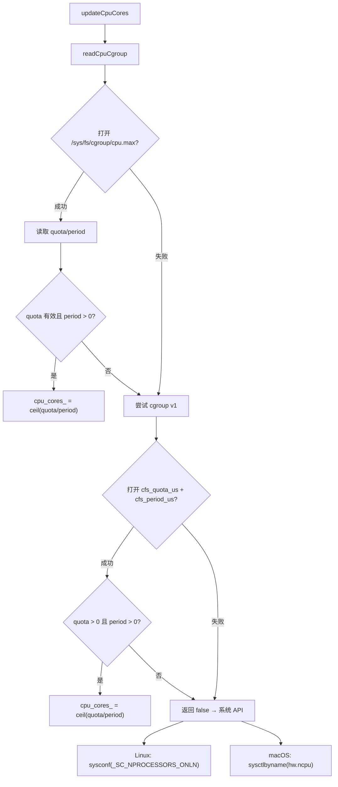
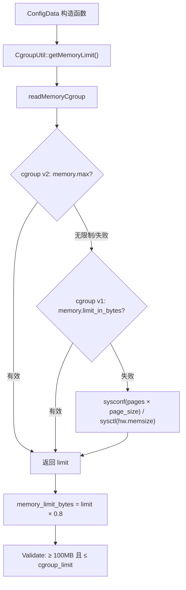
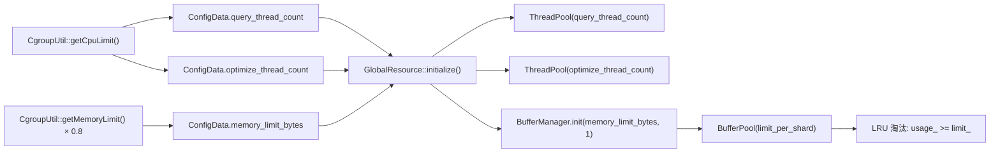

# PD-236.01 zvec — CgroupUtil 容器感知资源自适应

> 文档编号：PD-236.01
> 来源：zvec `src/db/common/cgroup_util.cc`
> GitHub：https://github.com/alibaba/zvec.git
> 问题域：PD-236 容器感知资源管理 Container-Aware Resource Management
> 状态：可复用方案

---

## 第 1 章 问题与动机

### 1.1 核心问题

在 Docker/K8s 环境中，进程通过 `sysconf(_SC_NPROCESSORS_ONLN)` 或 `sysinfo()` 获取的 CPU 和内存信息是**宿主机**的物理资源，而非容器被分配的资源限制。这导致：

- 线程池创建过多线程（如宿主机 64 核但容器只分配 4 核），引发严重的上下文切换开销
- 内存分配超出容器 cgroup 限制，触发 OOM Killer 被强制杀死
- 向量数据库的 BufferManager 缓存池设置过大，导致容器内存压力

对于 zvec 这样的向量数据库，查询和索引构建都是 CPU/内存密集型操作，资源误判直接影响稳定性和性能。

### 1.2 zvec 的解法概述

zvec 通过一个静态工具类 `CgroupUtil` 实现容器感知资源探测，核心策略：

1. **cgroup 优先探测**：先尝试读取 cgroup v2（`/sys/fs/cgroup/cpu.max`），失败后降级到 cgroup v1（`/sys/fs/cgroup/cpu/cpu.cfs_quota_us`），最后才用系统 API（`cgroup_util.cc:103-141`）
2. **80% 安全水位**：内存限制默认取 cgroup 限制的 80%（`constants.h:23`），为系统进程和 GC 预留空间
3. **线程数 = CPU 配额**：查询线程池和优化线程池大小直接等于 cgroup CPU 核数（`config.cc:37-40`）
4. **配置校验硬上限**：用户自定义内存不能超过 cgroup 探测值，防止 OOM（`config.cc:48-51`）
5. **跨平台降级**：macOS 通过 `sysctl`/`mach` API 获取资源，Linux 非容器环境用 `sysconf`（`cgroup_util.cc:87-101`）

### 1.3 设计思想

| 设计原则 | 具体实现 | 理由 | 替代方案 |
|----------|----------|------|----------|
| cgroup 优先降级链 | v2 → v1 → 系统 API | 兼容所有 Linux 内核版本（v2 需 4.5+） | 只支持 v2（放弃旧内核） |
| 惰性单次初始化 | `initialized_` 静态标志位 | 避免重复读取文件系统 | 每次调用都探测（性能差） |
| 80% 安全水位 | `DEFAULT_MEMORY_LIMIT_RATIO = 0.8f` | 为内核页缓存和系统进程预留 20% | 100% 使用（OOM 风险高） |
| 硬上限校验 | `Validate()` 拒绝超过 cgroup 限制的配置 | 防止用户误配导致 OOM | 静默截断（用户无感知） |
| 编译期平台分支 | `#if defined(PLATFORM_LINUX)` / `PLATFORM_MACOS` | 零运行时开销的跨平台 | 运行时检测（多一层间接） |

---

## 第 2 章 源码实现分析

### 2.1 架构概览

zvec 的容器感知资源管理分为三层：探测层（CgroupUtil）、配置层（GlobalConfig）、消费层（GlobalResource）。

```
┌─────────────────────────────────────────────────────────┐
│                    消费层 (GlobalResource)                │
│  ┌──────────────────┐  ┌──────────────────┐             │
│  │ query_thread_pool │  │optimize_thread_pool│            │
│  │  (N = cpu_cores)  │  │  (N = cpu_cores)  │            │
│  └────────┬─────────┘  └────────┬─────────┘             │
│           │                      │                       │
│  ┌────────┴──────────────────────┴─────────┐             │
│  │         BufferManager.init(limit, 1)     │             │
│  │         limit = memory_limit_bytes       │             │
│  └──────────────────────────────────────────┘             │
├─────────────────────────────────────────────────────────┤
│                    配置层 (GlobalConfig)                  │
│  ConfigData {                                            │
│    memory_limit_bytes = CgroupUtil::getMemoryLimit()     │
│                         × 0.8                            │
│    query_thread_count = CgroupUtil::getCpuLimit()        │
│    optimize_thread_count = CgroupUtil::getCpuLimit()     │
│  }                                                       │
│  Validate(): memory ∈ [100MB, cgroup_limit]              │
├─────────────────────────────────────────────────────────┤
│                    探测层 (CgroupUtil)                    │
│  ┌─────────┐    ┌─────────┐    ┌──────────────┐         │
│  │cgroup v2│───→│cgroup v1│───→│ 系统 API      │         │
│  │cpu.max  │    │cfs_quota│    │sysconf/sysctl │         │
│  │mem.max  │    │mem.limit│    │hw.memsize     │         │
│  └─────────┘    └─────────┘    └──────────────┘         │
└─────────────────────────────────────────────────────────┘
```

### 2.2 核心实现

#### 2.2.1 CPU 配额探测：cgroup v2 → v1 降级链



对应源码 `src/db/common/cgroup_util.cc:103-141`：

```cpp
bool CgroupUtil::readCpuCgroup() {
#if defined(PLATFORM_LINUX)
  // cgroup v2
  std::ifstream file("/sys/fs/cgroup/cpu.max");
  if (file.is_open()) {
    uint64_t quota, period;
    char slash;
    file >> quota >> slash >> period;
    file.close();

    if (quota != std::numeric_limits<uint64_t>::max() && quota != 0 &&
        period > 0) {
      cpu_cores_ =
          static_cast<int>(std::ceil(static_cast<double>(quota) / period));
      return true;
    } else {
      return false;
    }
  }

  // cgroup v1
  std::ifstream quota_file("/sys/fs/cgroup/cpu/cpu.cfs_quota_us");
  std::ifstream period_file("/sys/fs/cgroup/cpu/cpu.cfs_period_us");

  if (quota_file.is_open() && period_file.is_open()) {
    long long quota, period;
    quota_file >> quota;
    period_file >> period;
    quota_file.close();
    period_file.close();

    if (quota > 0 && period > 0) {
      cpu_cores_ =
          static_cast<int>(std::ceil(static_cast<double>(quota) / period));
      return true;
    }
  }
#endif
  return false;
}
```

关键细节：
- cgroup v2 的 `cpu.max` 格式为 `quota period`（如 `400000 100000` 表示 4 核），用 `ceil(quota/period)` 向上取整（`cgroup_util.cc:115-116`）
- cgroup v1 的 `cfs_quota_us = -1` 表示无限制，此时 `quota > 0` 判断会跳过（`cgroup_util.cc:134`）
- `ZVEC_CGROUP_MEMORY_UNLIMITED`（`9223372036854771712ULL`）是 cgroup 的"无限制"魔数，必须特殊处理（`cgroup_util.cc:27`）

#### 2.2.2 内存限制探测与 80% 安全水位



对应源码 `src/db/common/config.cc:33-51`：

```cpp
GlobalConfig::ConfigData::ConfigData()
    : memory_limit_bytes(CgroupUtil::getMemoryLimit() *
                         DEFAULT_MEMORY_LIMIT_RATIO),
      log_config(std::make_shared<ConsoleLogConfig>()),
      query_thread_count(CgroupUtil::getCpuLimit()),
      invert_to_forward_scan_ratio(0.9),
      brute_force_by_keys_ratio(0.1),
      optimize_thread_count(CgroupUtil::getCpuLimit()) {}

Status GlobalConfig::Validate(const ConfigData &config) const {
  if (config.memory_limit_bytes < MIN_MEMORY_LIMIT_BYTES) {
    return Status::InvalidArgument("memory_limit_bytes must be greater than ",
                                   MIN_MEMORY_LIMIT_BYTES);
  }
  if (config.memory_limit_bytes > CgroupUtil::getMemoryLimit()) {
    return Status::InvalidArgument("memory_limit_bytes must be less than ",
                                   CgroupUtil::getMemoryLimit());
  }
  // ...
}
```

### 2.3 实现细节

#### 资源探测到线程池的完整数据流



`GlobalResource::initialize()`（`global_resource.cc:21-31`）使用 `std::call_once` 确保线程安全的单次初始化：

```cpp
void GlobalResource::initialize() {
  static std::once_flag flag;
  std::call_once(flag, [this]() mutable {
    this->query_thread_pool_.reset(
        new ailego::ThreadPool(GlobalConfig::Instance().query_thread_count()));
    this->optimize_thread_pool_.reset(new ailego::ThreadPool(
        GlobalConfig::Instance().optimize_thread_count()));
    ailego::BufferManager::Instance().init(
        GlobalConfig::Instance().memory_limit_bytes(), 1);
  });
}
```

BufferManager 的 LRU 淘汰机制（`buffer_manager.cc:378-400`）在 `pin_at_IDLE` 时检查 `usage_ >= limit_`，当内存使用达到上限时从 LRU 尾部淘汰最久未使用的缓冲区。这个 `limit_` 正是由 cgroup 探测值 × 0.8 传入的。

#### macOS 内存使用量探测

macOS 没有 cgroup，通过 Mach 内核 API 获取 VM 统计信息（`cgroup_util.cc:322-343`）：

```cpp
uint64_t CgroupUtil::getMacOSMemoryUsage() {
  mach_port_t host_port = mach_host_self();
  mach_msg_type_number_t host_size =
      sizeof(vm_statistics64_data_t) / sizeof(integer_t);
  vm_size_t page_size;
  vm_statistics64_data_t vm_stat;

  if (host_page_size(host_port, &page_size) != KERN_SUCCESS) return 0;
  if (host_statistics64(host_port, HOST_VM_INFO64, (host_info64_t)&vm_stat,
                        &host_size) != KERN_SUCCESS) return 0;

  uint64_t used_memory =
      ((vm_stat.active_count + vm_stat.inactive_count + vm_stat.wire_count) *
       page_size);
  return used_memory;
}
```

#### 线程绑核（CPU Affinity）

ThreadPool 支持可选的 CPU 绑核（`thread_pool.cc:20-31`），在 Linux 上通过 `pthread_setaffinity_np` 将线程绑定到特定 CPU 核心，减少跨核调度开销：

```cpp
static inline void BindThreads(std::vector<std::thread> &pool) {
  uint32_t hc = std::thread::hardware_concurrency();
  if (hc > 1) {
    cpu_set_t mask;
    for (size_t i = 0u; i < pool.size(); ++i) {
      CPU_ZERO(&mask);
      CPU_SET(i % hc, &mask);
      pthread_setaffinity_np(pool[i].native_handle(), sizeof(mask), &mask);
    }
  }
}
```

---

## 第 3 章 迁移指南

### 3.1 迁移清单

**阶段 1：基础 cgroup 探测（1 个文件）**

- [ ] 创建 `CgroupDetector` 类，实现 cgroup v2 → v1 → 系统 API 降级链
- [ ] 定义 `CGROUP_MEMORY_UNLIMITED` 魔数常量
- [ ] 实现 `getCpuLimit()` 和 `getMemoryLimit()` 静态方法
- [ ] 添加编译期平台分支（`__linux__` / `__APPLE__`）

**阶段 2：配置集成（修改现有配置系统）**

- [ ] 在配置默认值中使用 `CgroupDetector` 探测结果
- [ ] 添加 `MEMORY_LIMIT_RATIO` 常量（建议 0.8）
- [ ] 在配置校验中添加 cgroup 上限检查
- [ ] 确保线程池大小默认等于 CPU 配额

**阶段 3：资源消费层适配**

- [ ] 线程池初始化使用配置中的线程数
- [ ] 内存池/缓存池使用配置中的内存限制
- [ ] 添加运行时资源监控（CPU 使用率、内存使用量）

### 3.2 适配代码模板

以下是一个可直接复用的 C++ cgroup 探测器实现：

```cpp
// cgroup_detector.h — 容器感知资源探测器
#pragma once
#include <cstdint>
#include <cmath>
#include <fstream>
#include <limits>
#include <string>

#if defined(__APPLE__)
#include <sys/sysctl.h>
#include <mach/mach.h>
#elif defined(__linux__)
#include <sys/sysinfo.h>
#include <unistd.h>
#endif

class CgroupDetector {
public:
    struct Resources {
        int cpu_cores;
        uint64_t memory_bytes;
        bool is_containerized;
    };

    static Resources detect() {
        Resources res{};
        res.is_containerized = detectCpu(res.cpu_cores);
        detectMemory(res.memory_bytes, res.is_containerized);
        return res;
    }

    static uint64_t safeMemoryLimit(double ratio = 0.8) {
        Resources res = detect();
        return static_cast<uint64_t>(res.memory_bytes * ratio);
    }

private:
    static constexpr uint64_t CGROUP_UNLIMITED = 9223372036854771712ULL;

    static bool detectCpu(int& cores) {
#if defined(__linux__)
        // cgroup v2: /sys/fs/cgroup/cpu.max
        std::ifstream v2("/sys/fs/cgroup/cpu.max");
        if (v2.is_open()) {
            uint64_t quota, period;
            char sep;
            v2 >> quota >> sep >> period;
            if (quota != std::numeric_limits<uint64_t>::max() &&
                quota != 0 && period > 0) {
                cores = static_cast<int>(
                    std::ceil(static_cast<double>(quota) / period));
                return true;
            }
        }
        // cgroup v1: /sys/fs/cgroup/cpu/cpu.cfs_quota_us
        std::ifstream q("/sys/fs/cgroup/cpu/cpu.cfs_quota_us");
        std::ifstream p("/sys/fs/cgroup/cpu/cpu.cfs_period_us");
        if (q.is_open() && p.is_open()) {
            long long quota, period;
            q >> quota; p >> period;
            if (quota > 0 && period > 0) {
                cores = static_cast<int>(
                    std::ceil(static_cast<double>(quota) / period));
                return true;
            }
        }
        cores = sysconf(_SC_NPROCESSORS_ONLN);
        if (cores <= 0) cores = 1;
#elif defined(__APPLE__)
        int c; size_t len = sizeof(c);
        if (sysctlbyname("hw.ncpu", &c, &len, nullptr, 0) == 0)
            cores = c;
        else
            cores = 1;
#endif
        return false;
    }

    static void detectMemory(uint64_t& mem, bool& containerized) {
#if defined(__linux__)
        // cgroup v2
        std::ifstream v2("/sys/fs/cgroup/memory.max");
        if (v2.is_open()) {
            uint64_t limit; v2 >> limit;
            if (limit != std::numeric_limits<uint64_t>::max() &&
                limit != 0 && limit != CGROUP_UNLIMITED) {
                mem = limit; containerized = true; return;
            }
        }
        // cgroup v1
        std::ifstream v1("/sys/fs/cgroup/memory/memory.limit_in_bytes");
        if (v1.is_open()) {
            uint64_t limit; v1 >> limit;
            if (limit < std::numeric_limits<uint64_t>::max() &&
                limit != CGROUP_UNLIMITED) {
                mem = limit; containerized = true; return;
            }
        }
        // 物理内存
        long pages = sysconf(_SC_PHYS_PAGES);
        long page_size = sysconf(_SC_PAGE_SIZE);
        mem = (pages > 0 && page_size > 0)
            ? static_cast<uint64_t>(pages) * page_size : 0;
#elif defined(__APPLE__)
        uint64_t m; size_t len = sizeof(m);
        mem = (sysctlbyname("hw.memsize", &m, &len, nullptr, 0) == 0) ? m : 0;
#endif
    }
};
```

### 3.3 适用场景

| 场景 | 适用度 | 说明 |
|------|--------|------|
| Docker/K8s 部署的数据库 | ⭐⭐⭐ | 核心场景，防止 OOM 和线程过载 |
| 容器化的 ML 推理服务 | ⭐⭐⭐ | GPU 之外的 CPU/内存资源同样需要感知 |
| Sidecar 模式的嵌入式引擎 | ⭐⭐⭐ | 与主服务共享 cgroup，资源更紧张 |
| 裸机部署的高性能服务 | ⭐⭐ | 无 cgroup 限制时降级到系统 API，仍有价值 |
| 桌面应用 / CLI 工具 | ⭐ | 通常不在容器中，但 macOS 分支仍可用 |

---

## 第 4 章 测试用例

```cpp
#include <gtest/gtest.h>
#include "cgroup_detector.h"

class CgroupDetectorTest : public ::testing::Test {};

// 测试基本探测功能
TEST_F(CgroupDetectorTest, DetectReturnsSaneValues) {
    auto res = CgroupDetector::detect();
    EXPECT_GT(res.cpu_cores, 0) << "CPU cores must be positive";
    EXPECT_GT(res.memory_bytes, 0) << "Memory must be positive";
}

// 测试 CPU 核数不超过物理核数
TEST_F(CgroupDetectorTest, CpuCoresNotExceedPhysical) {
    auto res = CgroupDetector::detect();
    int physical = std::thread::hardware_concurrency();
    if (physical > 0) {
        EXPECT_LE(res.cpu_cores, physical * 2)
            << "CPU cores should not wildly exceed physical cores";
    }
}

// 测试安全内存限制
TEST_F(CgroupDetectorTest, SafeMemoryLimitAppliesRatio) {
    auto res = CgroupDetector::detect();
    uint64_t safe = CgroupDetector::safeMemoryLimit(0.8);
    // 允许浮点误差
    EXPECT_NEAR(safe, static_cast<uint64_t>(res.memory_bytes * 0.8), 4096);
}

// 测试最小内存下限
TEST_F(CgroupDetectorTest, MinimumMemoryLimit) {
    constexpr uint64_t MIN_MEMORY = 100 * 1024 * 1024;  // 100MB
    uint64_t safe = CgroupDetector::safeMemoryLimit(0.8);
    // 在正常机器上，80% 内存应远大于 100MB
    EXPECT_GT(safe, MIN_MEMORY);
}

// 测试不同 ratio 参数
TEST_F(CgroupDetectorTest, DifferentRatios) {
    uint64_t r50 = CgroupDetector::safeMemoryLimit(0.5);
    uint64_t r80 = CgroupDetector::safeMemoryLimit(0.8);
    uint64_t r100 = CgroupDetector::safeMemoryLimit(1.0);
    EXPECT_LT(r50, r80);
    EXPECT_LT(r80, r100);
}

// 测试容器环境检测标志
TEST_F(CgroupDetectorTest, ContainerDetectionFlag) {
    auto res = CgroupDetector::detect();
    // 在 CI/CD 容器中应为 true，裸机上为 false
    // 这里只验证字段可访问
    (void)res.is_containerized;
    SUCCEED();
}
```

---

## 第 5 章 跨域关联

| 关联域 | 关系类型 | 说明 |
|--------|----------|------|
| PD-01 上下文管理 | 协同 | 内存限制直接影响 LLM 上下文窗口可缓存的 token 数量 |
| PD-02 多 Agent 编排 | 协同 | CPU 核数决定可并行运行的 Agent/Worker 数量上限 |
| PD-05 沙箱隔离 | 依赖 | cgroup 本身就是容器沙箱的资源隔离机制 |
| PD-11 可观测性 | 协同 | `getCpuUsage()` 和 `getMemoryUsage()` 提供运行时监控数据 |

---

## 第 6 章 来源文件索引

| 文件 | 行范围 | 关键实现 |
|------|--------|----------|
| `src/db/common/cgroup_util.h` | L39-L99 | CgroupUtil 类定义，静态方法声明 |
| `src/db/common/cgroup_util.cc` | L30-L40 | `initialize()` 惰性初始化 |
| `src/db/common/cgroup_util.cc` | L103-L141 | `readCpuCgroup()` cgroup v2/v1 CPU 探测 |
| `src/db/common/cgroup_util.cc` | L168-L201 | `readMemoryCgroup()` cgroup v2/v1 内存探测 |
| `src/db/common/cgroup_util.cc` | L244-L318 | `getCurrentMemoryUsage()` 运行时内存使用量 |
| `src/db/common/cgroup_util.cc` | L322-L343 | `getMacOSMemoryUsage()` macOS Mach API |
| `src/db/common/constants.h` | L23-L25 | `DEFAULT_MEMORY_LIMIT_RATIO=0.8`, `MIN_MEMORY_LIMIT_BYTES=100MB` |
| `src/db/common/config.cc` | L33-L40 | ConfigData 构造函数，cgroup 值注入默认配置 |
| `src/db/common/config.cc` | L42-L51 | `Validate()` 内存上下限校验 |
| `src/db/common/global_resource.cc` | L21-L31 | `initialize()` 线程池和 BufferManager 初始化 |
| `src/ailego/parallel/thread_pool.cc` | L20-L31 | `BindThreads()` CPU 绑核 |
| `src/ailego/buffer/buffer_manager.cc` | L549-L560 | `BufferManager::init()` 分片内存池初始化 |
| `src/ailego/buffer/buffer_manager.cc` | L375-L400 | `pin_at_IDLE()` LRU 淘汰逻辑 |

---

## 第 7 章 横向对比维度

```json comparison_data
{
  "project": "zvec",
  "dimensions": {
    "cgroup 版本支持": "v2 → v1 双版本降级链，含 UNLIMITED 魔数过滤",
    "内存限制策略": "cgroup 限制 × 0.8 安全水位 + Validate 硬上限校验",
    "跨平台资源探测": "Linux cgroup/sysconf + macOS sysctl/mach 编译期分支",
    "线程池适配": "查询池 + 优化池双线程池，大小 = cgroup CPU 配额",
    "内存池集成": "BufferManager 分片 LRU 池，limit 由 cgroup 探测值驱动",
    "CPU 绑核": "pthread_setaffinity_np 可选绑核，减少跨核调度"
  }
}
```

### 域元数据补充

```json domain_metadata
{
  "solution_summary": "zvec 通过 CgroupUtil 静态工具类实现 cgroup v2→v1→系统API 三级降级探测，以 80% 安全水位驱动双线程池和 LRU BufferManager 的容器自适应配置",
  "description": "向量数据库场景下 cgroup 探测与内存池/线程池的端到端集成",
  "sub_problems": [
    "cgroup UNLIMITED 魔数识别与过滤",
    "线程池大小与 CPU 配额的自动对齐",
    "BufferManager LRU 淘汰阈值与 cgroup 内存限制联动"
  ],
  "best_practices": [
    "配置校验层拒绝超过 cgroup 探测值的用户自定义内存",
    "使用 std::call_once 确保资源初始化的线程安全单次执行",
    "CPU 绑核作为可选优化，通过 pthread_setaffinity_np 减少跨核调度"
  ]
}
```
