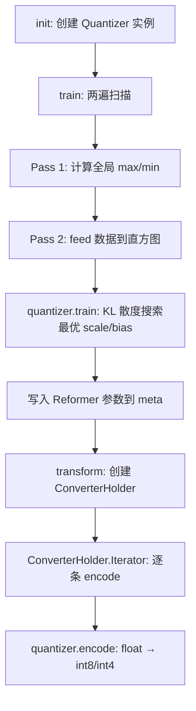

# PD-237.01 zvec — 多级向量量化 Converter/Reformer 双组件体系

> 文档编号：PD-237.01
> 来源：zvec `src/core/quantizer/`, `src/ailego/algorithm/`
> GitHub：https://github.com/alibaba/zvec.git
> 问题域：PD-237 向量量化压缩 Vector Quantization
> 状态：可复用方案

---

## 第 1 章 问题与动机

### 1.1 核心问题

向量检索系统中，原始 FP32 向量占用大量内存和带宽。一个 128 维 FP32 向量占 512 字节，十亿级数据集需要 ~500GB 内存。量化压缩是降低存储和加速距离计算的核心手段，但面临三个工程挑战：

1. **多种量化精度需求并存**：不同场景对精度/压缩率的权衡不同——粗排可用 Binary（32x 压缩），精排需要 INT8（4x 压缩），某些场景 FP16（2x 压缩）即可
2. **编码与解码的非对称性**：索引构建时做编码（Converter），查询时做解码/变换（Reformer），两者的接口和生命周期完全不同
3. **距离度量适配**：量化后的距离计算需要适配——INT8 用整数 SIMD 指令，Binary 用 Hamming 距离，MIPS 需要空间变换

### 1.2 zvec 的解法概述

zvec 设计了一套 Converter/Reformer 双组件体系，通过工厂注册模式实现多种量化器的即插即用：

1. **Converter（编码器）**：负责索引构建阶段的 train → transform 流水线，将 FP32 向量编码为目标精度（`integer_quantizer_converter.cc:141-362`）
2. **Reformer（解码器）**：负责查询阶段的 query transform 和 score normalize，将查询向量转换为与索引同精度的表示（`integer_quantizer_reformer.cc:29-272`）
3. **Entropy-based 量化训练**：使用 KL 散度最小化寻找最优量化阈值，而非简单的 min-max 线性映射（`integer_quantizer.cc:130-200`）
4. **RecordQuantizer 统一编码**：Streaming 模式下的逐记录量化，附带 scale/bias/sum 等元数据用于距离修正（`record_quantizer.h:24-83`）
5. **INDEX_FACTORY_REGISTER 宏注册**：所有量化器通过工厂宏自注册，支持别名映射（`integer_quantizer_converter.cc:596-609`）

### 1.3 设计思想

| 设计原则 | 具体实现 | 理由 | 替代方案 |
|----------|----------|------|----------|
| 编解码分离 | Converter 和 Reformer 独立类，各自有 init/transform 生命周期 | 索引构建和查询是不同阶段，参数传递通过 meta 序列化 | 单一 Quantizer 类同时负责编解码（耦合度高） |
| 模板策略模式 | `IntegerQuantizerConverter<Quantizer>` 模板参数化不同精度 | INT8/INT4 共享 train/transform 逻辑，仅量化算法不同 | 每种精度写独立类（代码重复） |
| 信息论最优量化 | KL 散度搜索最优阈值，而非 min-max 线性映射 | 数据分布通常非均匀，entropy-based 方法保留更多信息 | 简单 min-max 映射（精度损失大） |
| 逐记录元数据附带 | 每个量化向量尾部附带 scale/bias/sum/squared_sum | Streaming 模式下每条记录独立量化，需要独立的反量化参数 | 全局共享 scale/bias（精度差） |
| 工厂自注册 | `INDEX_FACTORY_REGISTER_CONVERTER_ALIAS` 宏在编译期注册 | 新增量化器只需一行宏，无需修改工厂代码 | 手动在工厂中 if-else 注册（维护成本高） |

---

## 第 2 章 源码实现分析

### 2.1 架构概览

zvec 的量化子系统分为三层：算法层（ailego）、框架层（core/quantizer）、注册层（index_factory）。

```
┌─────────────────────────────────────────────────────────────────┐
│                     Index Factory (注册表)                       │
│  INDEX_FACTORY_REGISTER_CONVERTER_ALIAS(Int8QuantizerConverter,  │
│    IntegerQuantizerConverter<EntropyInt8Quantizer>, DT_INT8)     │
├─────────────────────────────────────────────────────────────────┤
│              Framework Layer (core/quantizer/)                   │
│  ┌──────────────────────┐    ┌──────────────────────┐           │
│  │  IndexConverter      │    │  IndexReformer       │           │
│  │  ├─ init(meta,params)│    │  ├─ init(params)     │           │
│  │  ├─ train(holder)    │    │  ├─ transform(query) │           │
│  │  ├─ transform(holder)│    │  ├─ convert(record)  │           │
│  │  └─ result() → Holder│    │  └─ normalize(score) │           │
│  └──────────────────────┘    └──────────────────────┘           │
│         ▲                            ▲                          │
│  ┌──────┴──────────────┐    ┌────────┴─────────────┐           │
│  │ IntegerQuantizer-   │    │ IntegerQuantizer-    │           │
│  │ Converter<Q>        │    │ Reformer<Q>          │           │
│  │ IntegerStreaming-   │    │ IntegerStreaming-    │           │
│  │ Converter           │    │ Reformer             │           │
│  │ HalfFloatConverter  │    │ HalfFloatReformer    │           │
│  │ BinaryConverter     │    │ BinaryReformer       │           │
│  │ MipsConverter       │    │ MipsReformer         │           │
│  │ CosineConverter     │    │ CosineReformer       │           │
│  └─────────────────────┘    └──────────────────────┘           │
├─────────────────────────────────────────────────────────────────┤
│              Algorithm Layer (ailego/algorithm/)                 │
│  ┌──────────────────────────────────────────────────┐           │
│  │ EntropyIntegerQuantizer<T, RANGE_MIN, RANGE_MAX> │           │
│  │  ├─ EntropyInt8Quantizer  [-127, 127]            │           │
│  │  ├─ EntropyInt4Quantizer  [-8, 7]                │           │
│  │  ├─ EntropyInt16Quantizer [-32767, 32767]        │           │
│  │  └─ EntropyUInt8Quantizer [0, 255]               │           │
│  │ BinaryQuantizer (threshold-based 1-bit)          │           │
│  └──────────────────────────────────────────────────┘           │
└─────────────────────────────────────────────────────────────────┘
```

### 2.2 核心实现

#### 2.2.1 Entropy-based 量化训练（KL 散度最优阈值搜索）

```mermaid
graph TD
    A[feed: 收集训练数据] --> B[构建直方图 histogram]
    B --> C{遍历候选阈值 threshold}
    C --> D[截断分布 P = hist 在 threshold 内]
    D --> E[量化分布 Q = 合并 bins 到 target_bins]
    E --> F[展开 Q 回原始分辨率]
    F --> G[平滑 P 和 Q 消除零值]
    G --> H[计算 KL 散度 D_KL P||Q]
    H --> I{散度最小?}
    I -->|否| C
    I -->|是| J[记录最优 threshold]
    J --> K[计算 scale = target_bins/2/threshold]
    K --> L[计算 bias 偏移]
```

对应源码 `src/ailego/algorithm/integer_quantizer.cc:130-200`：

```cpp
static inline size_t ComputeThreshold(const std::vector<uint32_t> &hist,
                                      const size_t target_bins) {
  std::vector<float> P_distribution(hist.size());
  size_t zero_point_index = hist.size() / 2;
  size_t start_bin = target_bins / 2;
  size_t end_bin = hist.size() / 2;
  double min_divergence = std::numeric_limits<double>::max();
  size_t target_threshold = end_bin;

  for (size_t threshold = start_bin; threshold <= end_bin; ++threshold) {
    // 截断 P 分布到 [-threshold, threshold]
    P_distribution.resize(threshold * 2);
    // ... 量化到 target_bins，展开回原始分辨率
    std::vector<float> Q_distribution(target_bins, 0);
    // ... 合并 bins
    ExpandCandidateDistribution(hist, Q_distribution, threshold,
                                &Q_expand_distribution);
    MakeSmooth(P_distribution);
    MakeSmooth(Q_expand_distribution);
    double divergence = ComputeKlDivergence(P_distribution, Q_expand_distribution);
    if (divergence < min_divergence) {
      min_divergence = divergence;
      target_threshold = threshold;
    }
  }
  return target_threshold;
}
```

该算法参考了 NVIDIA TensorRT 的 INT8 量化校准方法（GTC 2017），核心思想是：不直接用数据的 min/max 做线性映射，而是搜索一个最优截断阈值，使量化后的分布与原始分布的 KL 散度最小。

#### 2.2.2 IntegerQuantizerConverter 的 train → transform 流水线



对应源码 `src/core/quantizer/integer_quantizer_converter.cc:209-318`：

```cpp
int train(IndexHolder::Pointer holder) override {
    // step1: compute max/min value (两遍扫描支持 multipass)
    if (holder->multipass()) {
      auto iter = holder->create_iterator();
      float max = -std::numeric_limits<float>::max();
      float min = std::numeric_limits<float>::max();
      for (; iter->is_valid(); iter->next()) {
        const float *vec = reinterpret_cast<const float *>(iter->data());
        for (size_t i = 0; i < meta_.dimension(); ++i) {
          max = std::max(max, vec[i]);
          min = std::min(min, vec[i]);
        }
      }
      quantizer_->set_max(max);
      quantizer_->set_min(min);
      // step2: feed quantizer with training data
      iter = holder->create_iterator();
      for (; iter->is_valid(); iter->next()) {
        quantizer_->feed(reinterpret_cast<const float *>(iter->data()),
                         meta_.dimension());
      }
    }
    // step3: train quantizer (KL divergence)
    if (!quantizer_->train()) {
      return IndexError_Runtime;
    }
    // 将 scale/bias 写入 Reformer 参数
    ailego::Params reformer_params;
    reformer_params.set(P_NAME(REFORMER_SCALE), quantizer_->scale());
    reformer_params.set(P_NAME(REFORMER_BIAS), quantizer_->bias());
    meta_.set_reformer("Int8QuantizerReformer", 0, reformer_params);
    return 0;
}
```

#### 2.2.3 RecordQuantizer 逐记录 Streaming 量化

```mermaid
graph TD
    A[输入: float 向量 dim 维] --> B[计算 min/max]
    B --> C{数据类型?}
    C -->|INT8| D["scale = 254/(max-min), bias = -min*scale-127"]
    C -->|INT4| E["scale = 15/(max-min), bias = -min*scale-8"]
    C -->|FP16| F[直接 FloatHelper::ToFP16]
    D --> G[逐元素: round float*scale+bias → int8]
    E --> H[两两打包: hi<<4 | lo&0xF → uint8]
    G --> I[附带元数据: 1/scale, -bias/scale, sum, squared_sum]
    H --> I
    I --> J[输出: 量化向量 + 4 float 元数据]
```

对应源码 `src/core/quantizer/record_quantizer.h:24-83`：

```cpp
static inline void quantize_record(const float *vec, size_t dim,
                                   IndexMeta::DataType type,
                                   bool is_euclidean, void *out) {
  if (type == IndexMeta::DataType::DT_INT8) {
    float scale = 254 / std::max(max - min, epsilon);
    float bias = -min * scale - 127;
    for (size_t i = 0; i < dim; ++i) {
      float v = vec[i] * scale + bias;
      (reinterpret_cast<int8_t *>(out))[i] = static_cast<int8_t>(std::round(v));
    }
    // 附带元数据用于距离修正
    extras[0] = 1.0f / scale;       // 反量化 scale
    extras[1] = -bias / scale;       // 反量化 bias
    extras[2] = sum;                 // 量化后求和（用于 IP 距离修正）
    extras[3] = squared_sum;         // 量化后平方和（用于 L2 距离修正）
  }
}
```

### 2.3 实现细节

**MIPS 到欧氏距离的空间变换**：`mips_converter.cc:29-63` 实现了两种 MIPS→L2 变换：
- **RepeatedQuadraticInjection**：将 d 维向量扩展到 d+m 维，附加 m 个 `0.5 - ||x||²` 维度，使内积最近邻等价于欧氏最近邻
- **SphericalInjection**：附加 1 个 `1 - sqrt(1 - ||x||²)` 维度，更紧凑但要求 `||x|| ≤ 1`

**距离度量自动切换**：`binary_converter.cc:152-163` 中 BinaryConverter 在 init 时自动将 InnerProduct 度量切换为 Hamming 度量，因为二值化后内积等价于 Hamming 距离的线性变换。

**INT4 打包编码**：`integer_quantizer.cc:402-411` 中 INT4 将两个 4-bit 值打包到一个 uint8_t 中（`hi << 4 | lo & 0xF`），维度必须为偶数。

**工厂注册宏**：`integer_quantizer_converter.cc:596-609` 通过 `INDEX_FACTORY_REGISTER_CONVERTER_ALIAS` 宏在编译期将量化器注册到全局工厂，支持按名称字符串查找。


---

## 第 3 章 迁移指南

### 3.1 迁移清单

**阶段 1：算法层移植（核心量化算法）**
- [ ] 移植 `EntropyIntegerQuantizer` 模板类（`integer_quantizer.h`）
- [ ] 移植 KL 散度训练逻辑（`integer_quantizer.cc` 的 `ComputeThreshold`、`MakeSmooth`、`ComputeKlDivergence`）
- [ ] 移植 `BinaryQuantizer` 类（`binary_quantizer.h/cc`）
- [ ] 移植 `FloatHelper::ToFP16/ToFP32` 半精度转换工具

**阶段 2：框架层移植（Converter/Reformer 接口）**
- [ ] 定义 `IndexConverter` 抽象接口：`init → train → transform → result`
- [ ] 定义 `IndexReformer` 抽象接口：`init → transform(query) → normalize(score)`
- [ ] 实现 `RecordQuantizer::quantize_record` 逐记录量化（含元数据附带）
- [ ] 实现 `RecordQuantizer::unquantize_record` 反量化

**阶段 3：注册层移植（工厂模式）**
- [ ] 实现 `INDEX_FACTORY_REGISTER_CONVERTER_ALIAS` 宏或等价的注册机制
- [ ] 实现按名称字符串查找 Converter/Reformer 的工厂方法
- [ ] 通过 `IndexMeta` 序列化 Converter 参数传递给 Reformer

### 3.2 适配代码模板

以下是一个可运行的 Python 版 Entropy-based INT8 量化器，移植自 zvec 的核心算法：

```python
import numpy as np
from typing import Tuple

class EntropyInt8Quantizer:
    """移植自 zvec ailego::EntropyInt8Quantizer 的 Python 实现"""

    RANGE_MIN, RANGE_MAX = -127, 127

    def __init__(self, histogram_bins: int = 4096):
        self.histogram_bins = histogram_bins
        self.scale = 0.0
        self.bias = 0.0
        self.histogram = None
        self._hist_interval = 1.0
        self._left_boundary = 0.0

    def feed(self, vectors: np.ndarray):
        """收集训练数据到直方图"""
        flat = vectors.flatten()
        if self.histogram is None:
            self._left_boundary = flat.min()
            data_range = flat.max() - flat.min()
            self._hist_interval = data_range / self.histogram_bins
            self.histogram = np.zeros(self.histogram_bins, dtype=np.int64)

        indices = ((flat - self._left_boundary) / self._hist_interval).astype(int)
        indices = np.clip(indices, 0, self.histogram_bins - 1)
        for idx in indices:
            self.histogram[idx] += 1

    def train(self) -> Tuple[float, float]:
        """KL 散度搜索最优量化阈值，返回 (scale, bias)"""
        target_bins = self.RANGE_MAX - self.RANGE_MIN  # 254
        zero_point = len(self.histogram) // 2
        best_threshold, min_div = zero_point, float('inf')

        for threshold in range(target_bins // 2, zero_point + 1):
            p = self.histogram[zero_point - threshold:zero_point + threshold].astype(float)
            # 量化到 target_bins
            q_coarse = np.zeros(target_bins)
            ratio = len(p) / target_bins
            for i in range(target_bins):
                start, end = int(i * ratio), int((i + 1) * ratio)
                q_coarse[i] = p[start:end].sum()
            # 展开回原始分辨率
            q_expand = np.repeat(q_coarse / ratio, int(ratio))[:len(p)]
            # 平滑 + KL 散度
            p_smooth = np.where(p == 0, 1e-7, p)
            p_smooth /= p_smooth.sum()
            q_smooth = np.where(q_expand == 0, 1e-7, q_expand)
            q_smooth /= q_smooth.sum()
            div = np.sum(p_smooth * np.log(p_smooth / q_smooth))
            if div < min_div:
                min_div, best_threshold = div, threshold

        threshold_val = (best_threshold + 0.5) * self._hist_interval
        self.scale = (target_bins / 2) / threshold_val
        self.bias = -self._left_boundary - (self.histogram_bins // 2) * self._hist_interval
        return self.scale, self.bias

    def encode(self, vectors: np.ndarray) -> np.ndarray:
        """FP32 → INT8 编码"""
        quantized = np.round((vectors + self.bias) * self.scale)
        return np.clip(quantized, self.RANGE_MIN, self.RANGE_MAX).astype(np.int8)

    def decode(self, quantized: np.ndarray) -> np.ndarray:
        """INT8 → FP32 解码"""
        return quantized.astype(np.float32) / self.scale - self.bias
```

以下是 Converter/Reformer 双组件框架的 Python 移植：

```python
from abc import ABC, abstractmethod
from dataclasses import dataclass
from typing import Dict, Any

@dataclass
class QuantizerMeta:
    """量化元数据，Converter 写入，Reformer 读取"""
    data_type: str          # "int8", "int4", "fp16", "binary"
    dimension: int
    converter_name: str
    reformer_name: str
    params: Dict[str, Any]  # scale, bias, metric 等

class IndexConverter(ABC):
    @abstractmethod
    def init(self, meta: QuantizerMeta, params: dict) -> int: ...
    @abstractmethod
    def train(self, data: np.ndarray) -> int: ...
    @abstractmethod
    def transform(self, data: np.ndarray) -> np.ndarray: ...

class IndexReformer(ABC):
    @abstractmethod
    def init(self, params: dict) -> int: ...
    @abstractmethod
    def transform_query(self, query: np.ndarray) -> np.ndarray: ...
    @abstractmethod
    def normalize_score(self, query: np.ndarray, scores: np.ndarray) -> np.ndarray: ...

# 工厂注册表
_CONVERTER_REGISTRY: Dict[str, type] = {}
_REFORMER_REGISTRY: Dict[str, type] = {}

def register_converter(name: str):
    def decorator(cls):
        _CONVERTER_REGISTRY[name] = cls
        return cls
    return decorator

def register_reformer(name: str):
    def decorator(cls):
        _REFORMER_REGISTRY[name] = cls
        return cls
    return decorator
```

### 3.3 适用场景

| 场景 | 适用度 | 说明 |
|------|--------|------|
| 向量数据库索引构建 | ⭐⭐⭐ | 核心场景，INT8/INT4 量化显著降低内存 |
| Embedding 模型推理加速 | ⭐⭐⭐ | FP16 半精度转换可直接复用 |
| 大规模 ANN 检索 | ⭐⭐⭐ | Binary 量化 + Hamming 距离适合粗排 |
| 实时在线量化（Streaming） | ⭐⭐ | RecordQuantizer 逐记录量化适合流式场景 |
| 小数据集精确检索 | ⭐ | 数据量小时量化收益不明显 |

---

## 第 4 章 测试用例

```python
import numpy as np
import pytest

class TestEntropyInt8Quantizer:
    """基于 zvec EntropyInt8Quantizer 真实函数签名的测试"""

    def setup_method(self):
        self.quantizer = EntropyInt8Quantizer(histogram_bins=2048)
        np.random.seed(42)
        self.train_data = np.random.randn(10000, 128).astype(np.float32)
        self.quantizer.feed(self.train_data)
        self.quantizer.train()

    def test_encode_decode_roundtrip(self):
        """正常路径：编码后解码，误差应在可接受范围"""
        original = self.train_data[:100]
        encoded = self.quantizer.encode(original)
        decoded = self.quantizer.decode(encoded)
        # INT8 量化误差应 < 5% (相对于数据范围)
        max_error = np.abs(original - decoded).max()
        data_range = original.max() - original.min()
        assert max_error / data_range < 0.05, f"Max relative error {max_error/data_range:.4f} > 5%"

    def test_encode_output_range(self):
        """编码输出应在 [-127, 127] 范围内"""
        encoded = self.quantizer.encode(self.train_data[:100])
        assert encoded.dtype == np.int8
        assert encoded.min() >= -127
        assert encoded.max() <= 127

    def test_compression_ratio(self):
        """INT8 量化应实现 4x 压缩"""
        original_bytes = self.train_data[:100].nbytes  # FP32: 4 bytes/element
        encoded = self.quantizer.encode(self.train_data[:100])
        encoded_bytes = encoded.nbytes  # INT8: 1 byte/element
        ratio = original_bytes / encoded_bytes
        assert ratio == 4.0

    def test_edge_case_constant_vector(self):
        """边界情况：常量向量（max == min）"""
        constant = np.ones((10, 128), dtype=np.float32) * 3.14
        q = EntropyInt8Quantizer()
        q.feed(constant)
        # 常量向量 scale 可能为 inf，应优雅处理
        q.train()
        encoded = q.encode(constant)
        assert not np.any(np.isnan(encoded))

    def test_edge_case_zero_vector(self):
        """边界情况：全零向量"""
        zeros = np.zeros((10, 128), dtype=np.float32)
        encoded = self.quantizer.encode(zeros)
        decoded = self.quantizer.decode(encoded)
        assert np.allclose(decoded, zeros, atol=0.1)


class TestRecordQuantizer:
    """基于 zvec RecordQuantizer::quantize_record 的测试"""

    def test_int8_quantize_with_metadata(self):
        """INT8 逐记录量化应附带 4 个 float 元数据"""
        vec = np.random.randn(128).astype(np.float32)
        # 模拟 quantize_record 的 INT8 路径
        min_val, max_val = vec.min(), vec.max()
        epsilon = np.finfo(np.float32).eps
        scale = 254 / max(max_val - min_val, epsilon)
        bias = -min_val * scale - 127
        quantized = np.round(vec * scale + bias).astype(np.int8)
        # 元数据
        extras = np.array([1.0/scale, -bias/scale, float(quantized.sum()),
                          float((vec * scale + bias).astype(np.float32) ** 2).sum()])
        assert len(extras) == 4
        # 反量化验证
        decoded = quantized.astype(np.float32) * extras[0] + extras[1]
        assert np.allclose(vec, decoded, atol=0.05)

    def test_int4_packing(self):
        """INT4 两两打包到 uint8"""
        dim = 8
        vec = np.array([0.1, -0.2, 0.3, -0.4, 0.5, -0.6, 0.7, -0.8], dtype=np.float32)
        min_val, max_val = vec.min(), vec.max()
        scale = 15 / max(max_val - min_val, np.finfo(np.float32).eps)
        bias = -min_val * scale - 8
        packed = np.zeros(dim // 2, dtype=np.uint8)
        for i in range(0, dim, 2):
            lo = int(np.round(vec[i] * scale + bias)) & 0xF
            hi = int(np.round(vec[i+1] * scale + bias)) & 0xF
            packed[i // 2] = (hi << 4) | lo
        assert packed.shape == (4,)  # 8 维 → 4 字节
```


---

## 第 5 章 跨域关联

| 关联域 | 关系类型 | 说明 |
|--------|----------|------|
| PD-08 搜索与检索 | 协同 | 量化压缩是 ANN 检索的前置步骤，量化精度直接影响召回率 |
| PD-01 上下文管理 | 协同 | Embedding 向量的量化压缩可减少 LLM 上下文中的向量存储开销 |
| PD-04 工具系统 | 协同 | 量化器通过工厂注册模式实现即插即用，与工具系统的注册机制设计理念一致 |
| PD-11 可观测性 | 依赖 | Converter 的 `Stats` 统计（trained_count, transformed_count, costtime）提供量化过程的可观测数据 |
| PD-03 容错与重试 | 协同 | 量化训练失败（如常量向量导致 scale=inf）需要优雅降级到无量化模式 |

---

## 第 6 章 来源文件索引

| 文件 | 行范围 | 关键实现 |
|------|--------|----------|
| `src/core/quantizer/integer_quantizer_converter.cc` | L29-L135 | IntegerQuantizerConverterHolder 模板类（编码迭代器） |
| `src/core/quantizer/integer_quantizer_converter.cc` | L140-L362 | IntegerQuantizerConverter 模板类（train/transform 流水线） |
| `src/core/quantizer/integer_quantizer_converter.cc` | L367-L594 | IntegerStreamingConverter（逐记录 Streaming 量化） |
| `src/core/quantizer/integer_quantizer_converter.cc` | L596-L609 | INDEX_FACTORY_REGISTER 宏注册 Int8/Int4 Converter |
| `src/core/quantizer/integer_quantizer_reformer.cc` | L29-L272 | IntegerQuantizerReformer 模板类（查询变换 + 分数归一化） |
| `src/core/quantizer/integer_quantizer_reformer.cc` | L277-L468 | IntegerStreamingReformer（Streaming 模式 Reformer） |
| `src/core/quantizer/record_quantizer.h` | L21-L128 | RecordQuantizer 静态类（quantize_record / unquantize_record） |
| `src/core/quantizer/quantizer_params.h` | L18-L131 | 所有量化器参数名常量定义 |
| `src/core/quantizer/half_float_converter.cc` | L22-L118 | HalfFloatHolder（FP32→FP16 转换迭代器） |
| `src/core/quantizer/half_float_converter.cc` | L122-L187 | HalfFloatConverter（FP16 编码器） |
| `src/core/quantizer/binary_converter.cc` | L25-L128 | BinaryConverterHolder（二值化编码迭代器） |
| `src/core/quantizer/binary_converter.cc` | L132-L226 | BinaryConverter（二值化编码器，InnerProduct→Hamming） |
| `src/core/quantizer/mips_converter.cc` | L29-L63 | MIPS 空间变换函数（RepeatedQuadraticInjection / SphericalInjection） |
| `src/core/quantizer/mips_converter.cc` | L453-L655 | MipsConverter（MIPS→L2 变换 + 训练 L2 norm） |
| `src/core/quantizer/cosine_converter.cc` | L29-L225 | CosineConverterHolder（余弦归一化 + 多精度输出） |
| `src/ailego/algorithm/integer_quantizer.h` | L27-L131 | EntropyIntegerQuantizer 模板基类 |
| `src/ailego/algorithm/integer_quantizer.cc` | L27-L69 | MakeSmooth + ComputeKlDivergence（KL 散度计算） |
| `src/ailego/algorithm/integer_quantizer.cc` | L130-L200 | ComputeThreshold（最优量化阈值搜索） |
| `src/ailego/algorithm/integer_quantizer.cc` | L348-L362 | EntropyInt8Quantizer::encode/decode |
| `src/ailego/algorithm/binary_quantizer.h` | L25-L66 | BinaryQuantizer 类定义 |
| `src/ailego/math/euclidean_distance_matrix_int8.cc` | L1-L60 | INT8 SIMD 距离计算（SSE/AVX2 加速） |

---

## 第 7 章 横向对比维度

```json comparison_data
{
  "project": "zvec",
  "dimensions": {
    "量化精度": "INT4/INT8/FP16/Binary 四级精度，模板参数化统一实现",
    "训练算法": "Entropy-based KL 散度最优阈值搜索（参考 TensorRT INT8 校准）",
    "编解码架构": "Converter/Reformer 双组件分离，通过 IndexMeta 序列化参数传递",
    "距离适配": "自动切换度量（IP→Hamming, MIPS→L2），SIMD 加速 INT8 距离计算",
    "Streaming 支持": "RecordQuantizer 逐记录独立量化，附带 scale/bias/sum 元数据",
    "注册机制": "INDEX_FACTORY_REGISTER 宏编译期自注册，支持别名映射"
  }
}
```

### 域元数据补充

```json domain_metadata
{
  "solution_summary": "zvec 用 Converter/Reformer 双组件体系 + Entropy-based KL 散度训练实现 INT4/INT8/FP16/Binary 四级量化，通过工厂宏自注册和 SIMD 加速距离计算",
  "description": "量化器的编解码分离架构与距离度量自动适配",
  "sub_problems": [
    "MIPS 到欧氏距离的空间变换",
    "逐记录 Streaming 量化的元数据附带",
    "量化器工厂注册与按名称查找"
  ],
  "best_practices": [
    "KL 散度搜索最优阈值比 min-max 线性映射精度更高",
    "Converter/Reformer 分离使索引构建和查询阶段可独立演进",
    "INT4 两两打包到 uint8 可在 INT8 基础上再减 50% 内存"
  ]
}
```
