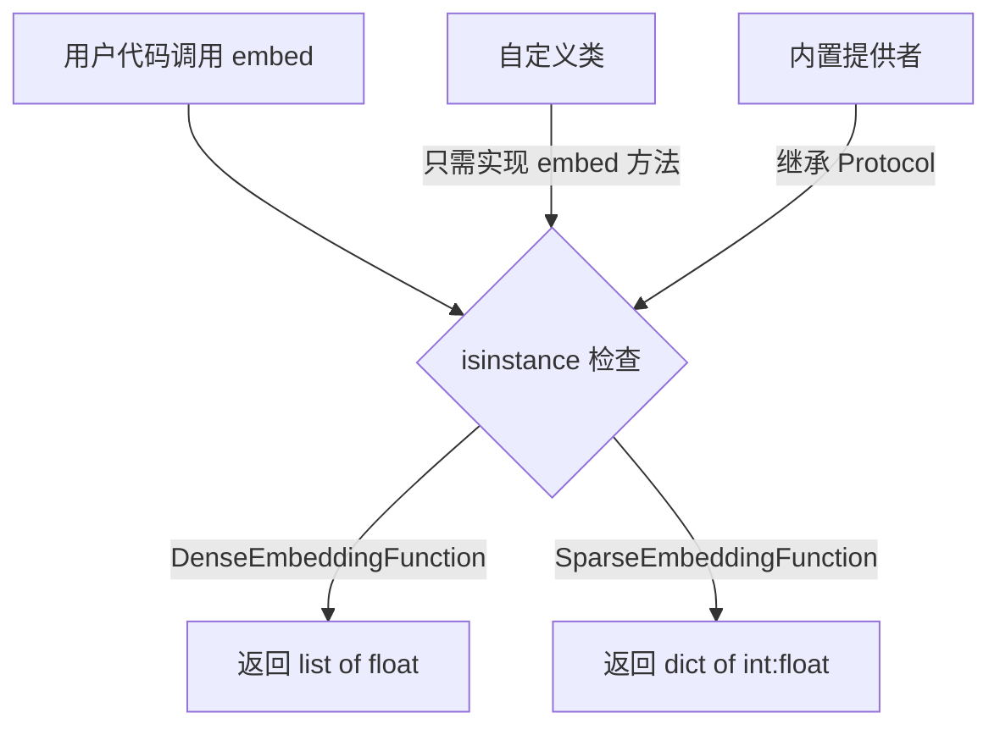
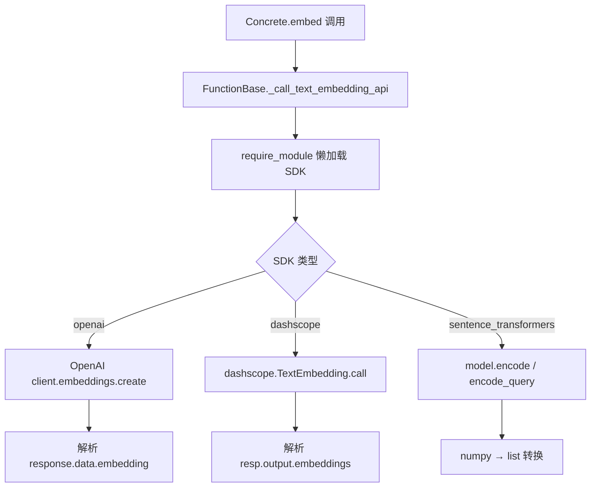

# PD-238.01 zvec — Protocol 多提供者 Embedding 抽象

> 文档编号：PD-238.01
> 来源：zvec `python/zvec/extension/embedding_function.py`
> GitHub：https://github.com/alibaba/zvec.git
> 问题域：PD-238 Embedding 提供者抽象 Embedding Provider Abstraction
> 状态：可复用方案

---

## 第 1 章 问题与动机

### 1.1 核心问题

向量数据库需要将文本/图像/音频转换为向量，但嵌入模型的提供者众多（OpenAI、Qwen/DashScope、Jina、SentenceTransformer 本地模型、BM25），每家 API 协议不同、SDK 不同、认证方式不同。如果在业务代码中硬编码某一提供者，切换模型就要改大量代码。

核心挑战：
- Dense 向量（`list[float]`）和 Sparse 向量（`dict[int, float]`）是两种完全不同的数据结构，需要统一抽象
- 云端 API（OpenAI/Qwen/Jina）和本地模型（SentenceTransformer/BM25）的初始化、调用、依赖管理差异巨大
- 可选依赖（openai、dashscope、sentence-transformers、dashtext）不应成为安装时的硬依赖

### 1.2 zvec 的解法概述

1. **Protocol 而非 ABC 定义接口** — `DenseEmbeddingFunction` 和 `SparseEmbeddingFunction` 使用 `@runtime_checkable Protocol[MD]`，只要求实现 `embed()` 方法，允许鸭子类型（`embedding_function.py:22-84`）
2. **三层继承体系** — Protocol 接口 → FunctionBase 基类（API 连接/响应处理）→ 具体 Embedding 类（embed 实现），职责清晰分离（如 `OpenAIFunctionBase` → `OpenAIDenseEmbedding`）
3. **泛型多模态支持** — `Protocol[MD]` 中 `MD = TypeVar("MD", bound=Embeddable)` 支持 TEXT/IMAGE/AUDIO 三种输入类型（`constants.py:25-33`）
4. **`require_module` 懒加载** — 可选依赖在首次使用时才导入，失败时给出 `pip install` 提示（`tool/util.py:20-63`）
5. **LRU 缓存 + 类级模型缓存** — API 调用结果用 `@lru_cache(maxsize=10)` 缓存；本地 SPLADE 模型用类变量 `_model_cache` 跨实例共享（`sentence_transformer_embedding_function.py:513`）

### 1.3 设计思想

| 设计原则 | 具体实现 | 理由 | 替代方案 |
|----------|----------|------|----------|
| 结构化子类型 | `@runtime_checkable Protocol` | 允许鸭子类型，用户类无需显式继承即可满足接口 | ABC 强制继承，耦合度高 |
| 单方法接口 | 只要求 `embed(input: MD) -> VectorType` | 最小接口原则，降低实现门槛 | 多方法接口（embed_batch, embed_async 等） |
| 三层分离 | Protocol → Base → Concrete | Base 层复用 API 连接逻辑，Concrete 层只关注数据转换 | 扁平继承，每个类自己处理 API |
| 懒加载依赖 | `require_module()` 延迟导入 | 避免安装时拉入所有 SDK，按需加载 | extras_require 分组安装 |
| 双缓存策略 | LRU 缓存 API 结果 + ClassVar 缓存本地模型 | API 调用昂贵需缓存；本地模型内存大需共享 | 无缓存或全局单例 |

---

## 第 2 章 源码实现分析

### 2.1 架构概览

zvec 的 Embedding 提供者抽象采用三层架构，Protocol 定义接口契约，FunctionBase 封装 API 通信，具体类实现 embed 逻辑：

```
┌─────────────────────────────────────────────────────────────────┐
│                    Protocol 层（接口契约）                        │
│  DenseEmbeddingFunction[MD]    SparseEmbeddingFunction[MD]      │
│  ┌─────────────────────┐       ┌──────────────────────────┐     │
│  │ embed(MD)->list[float]│      │ embed(MD)->dict[int,float]│    │
│  └─────────────────────┘       └──────────────────────────┘     │
├─────────────────────────────────────────────────────────────────┤
│                   FunctionBase 层（API 通信）                     │
│  OpenAIFunctionBase   QwenFunctionBase   JinaFunctionBase       │
│  SentenceTransformerFunctionBase                                 │
│  ┌──────────────────────────────────────────────────────┐       │
│  │ _get_client() / _get_connection() / _get_model()     │       │
│  │ _call_text_embedding_api()                            │       │
│  │ require_module() 懒加载                                │       │
│  └──────────────────────────────────────────────────────┘       │
├─────────────────────────────────────────────────────────────────┤
│                  Concrete 层（具体实现）                          │
│  OpenAIDenseEmbedding     QwenDenseEmbedding                    │
│  JinaDenseEmbedding       QwenSparseEmbedding                   │
│  DefaultLocalDenseEmbedding  DefaultLocalSparseEmbedding        │
│  BM25EmbeddingFunction                                          │
└─────────────────────────────────────────────────────────────────┘
```

### 2.2 核心实现

#### 2.2.1 Protocol 接口定义



对应源码 `python/zvec/extension/embedding_function.py:14-84`：

```python
from typing import Protocol, runtime_checkable

@runtime_checkable
class DenseEmbeddingFunction(Protocol[MD]):
    """Protocol for dense vector embedding functions."""

    @abstractmethod
    def embed(self, input: MD) -> DenseVectorType:
        """Generate a dense embedding vector for the input data."""
        ...

@runtime_checkable
class SparseEmbeddingFunction(Protocol[MD]):
    """Abstract base class for sparse vector embedding functions."""

    @abstractmethod
    def embed(self, input: MD) -> SparseVectorType:
        """Generate a sparse embedding for the input data."""
        ...
```

关键设计：`@runtime_checkable` 使得 `isinstance(obj, DenseEmbeddingFunction)` 在运行时可用，而 `Protocol` 允许结构化子类型——任何实现了 `embed()` 方法的类都自动满足接口，无需显式继承。

#### 2.2.2 FunctionBase 三层 API 封装



对应源码 `python/zvec/extension/openai_function.py:81-149`（OpenAI 为例）：

```python
class OpenAIFunctionBase:
    _MODEL_DIMENSIONS: ClassVar[dict[str, int]] = {
        "text-embedding-3-small": 1536,
        "text-embedding-3-large": 3072,
        "text-embedding-ada-002": 1536,
    }

    def __init__(self, model: str, api_key: Optional[str] = None,
                 base_url: Optional[str] = None):
        self._model = model
        self._api_key = api_key or os.environ.get("OPENAI_API_KEY")
        if not self._api_key:
            raise ValueError(
                "OpenAI API key is required. Please provide 'api_key' parameter "
                "or set the 'OPENAI_API_KEY' environment variable."
            )

    def _get_client(self):
        openai = require_module("openai")
        if self._base_url:
            return openai.OpenAI(api_key=self._api_key, base_url=self._base_url)
        return openai.OpenAI(api_key=self._api_key)

    def _call_text_embedding_api(self, input: TEXT,
                                  dimension: Optional[int] = None) -> list:
        client = self._get_client()
        params = {"model": self.model, "input": input}
        if dimension is not None:
            params["dimensions"] = dimension
        response = client.embeddings.create(**params)
        return response.data[0].embedding
```

每个 FunctionBase 遵循相同模式：`_get_client/connection/model` → `_call_*_api` → 解析响应。差异仅在 SDK 调用方式。

#### 2.2.3 require_module 懒加载

对应源码 `python/zvec/tool/util.py:20-63`：

```python
def require_module(module: str, mitigation: Optional[str] = None) -> Any:
    try:
        return importlib.import_module(module)
    except ImportError as e:
        package = mitigation or module
        msg = f"Required package '{package}' is not installed. "
        if "." in module:
            top_level = module.split(".", maxsplit=1)[0]
            msg += f"Module '{module}' is part of '{top_level}', "
            msg += f"please pip install '{mitigation or top_level}'."
        else:
            msg += f"Please pip install '{package}'."
        raise ImportError(msg) from e
```

### 2.3 实现细节

**多继承组合模式**：每个具体 Embedding 类同时继承 FunctionBase（API 能力）和 Protocol（接口契约），如 `OpenAIDenseEmbedding(OpenAIFunctionBase, DenseEmbeddingFunction[TEXT])`（`openai_embedding_function.py:24`）。

**API 密钥三级回退**：构造函数参数 → 环境变量（`OPENAI_API_KEY` / `DASHSCOPE_API_KEY` / `JINA_API_KEY`）→ 抛出 ValueError。每个 FunctionBase 使用不同的环境变量名（`openai_function.py:67`、`qwen_function.py:61`、`jina_function.py:88`）。

**维度自动推断**：`ClassVar[dict[str, int]]` 存储每个模型的默认维度，用户不指定 dimension 时自动查表（`openai_function.py:44-48`、`jina_function.py:48-51`）。

**Jina 复用 OpenAI SDK**：Jina API 兼容 OpenAI 协议，`JinaFunctionBase` 通过设置 `base_url="https://api.jina.ai/v1"` 复用 `openai.OpenAI` 客户端（`jina_function.py:45, 122-123`），并通过 `extra_body` 传递 task 参数（`jina_function.py:154-155`）。

**SPLADE 类级缓存**：`DefaultLocalSparseEmbedding` 使用 `_model_cache: ClassVar[dict] = {}` 在类级别缓存模型，key 为 `(model_name, model_source, device)` 元组，多个实例（query/document encoding_type 不同）共享同一模型（`sentence_transformer_embedding_function.py:513, 830-837`）。

**数据流：Qwen Sparse 解析**（`qwen_embedding_function.py:514-537`）：
```
API 返回 → output.embeddings[0].sparse_embedding
→ [{index: 10, value: 0.5, token: "机器"}, ...]
→ 过滤 val > 0 → {10: 0.5, 245: 0.8, ...}
→ dict(sorted(...)) 按索引排序
```

---

## 第 3 章 迁移指南

### 3.1 迁移清单

**阶段 1：定义 Protocol 接口**
- [ ] 创建 `DenseEmbeddingFunction` 和 `SparseEmbeddingFunction` Protocol 类
- [ ] 定义 `DenseVectorType = Union[list[float], list[int], np.ndarray]` 和 `SparseVectorType = dict[int, float]` 类型别名
- [ ] 使用 `@runtime_checkable` 装饰器支持运行时类型检查

**阶段 2：实现 FunctionBase 基类**
- [ ] 为每个提供者创建 FunctionBase（API 连接 + 响应解析）
- [ ] 实现 `require_module()` 懒加载工具函数
- [ ] 统一 API 密钥管理：构造参数 → 环境变量 → ValueError

**阶段 3：实现具体 Embedding 类**
- [ ] 每个类多继承 FunctionBase + Protocol
- [ ] 在 `embed()` 方法上添加 `@lru_cache(maxsize=10)`
- [ ] 本地模型使用类级 `_model_cache: ClassVar[dict]` 共享实例

### 3.2 适配代码模板

以下代码可直接复用，实现一个最小化的 Protocol + 多提供者 Embedding 系统：

```python
from __future__ import annotations
import importlib
import os
from abc import abstractmethod
from functools import lru_cache
from typing import Any, ClassVar, Optional, Protocol, TypeVar, Union, runtime_checkable

import numpy as np

# ── 类型定义 ──
DenseVectorType = Union[list[float], list[int], np.ndarray]
SparseVectorType = dict[int, float]
TEXT = str
Embeddable = Optional[Union[TEXT, str, bytes, np.ndarray]]
MD = TypeVar("MD", bound=Embeddable, contravariant=True)


# ── 懒加载工具 ──
def require_module(module: str, mitigation: Optional[str] = None) -> Any:
    try:
        return importlib.import_module(module)
    except ImportError as e:
        package = mitigation or module.split(".", maxsplit=1)[0]
        raise ImportError(
            f"Required package '{package}' is not installed. "
            f"Please pip install '{package}'."
        ) from e


# ── Protocol 接口 ──
@runtime_checkable
class DenseEmbeddingFunction(Protocol[MD]):
    @abstractmethod
    def embed(self, input: MD) -> DenseVectorType: ...

@runtime_checkable
class SparseEmbeddingFunction(Protocol[MD]):
    @abstractmethod
    def embed(self, input: MD) -> SparseVectorType: ...


# ── FunctionBase 示例（OpenAI） ──
class OpenAIFunctionBase:
    _MODEL_DIMS: ClassVar[dict[str, int]] = {
        "text-embedding-3-small": 1536,
        "text-embedding-3-large": 3072,
    }

    def __init__(self, model: str, api_key: Optional[str] = None,
                 base_url: Optional[str] = None):
        self._model = model
        self._api_key = api_key or os.environ.get("OPENAI_API_KEY")
        self._base_url = base_url
        if not self._api_key:
            raise ValueError("API key required: set OPENAI_API_KEY or pass api_key")

    def _get_client(self):
        openai = require_module("openai")
        return openai.OpenAI(api_key=self._api_key,
                             **({"base_url": self._base_url} if self._base_url else {}))

    def _call_embedding_api(self, text: str, dimension: Optional[int] = None) -> list:
        client = self._get_client()
        params = {"model": self._model, "input": text}
        if dimension is not None:
            params["dimensions"] = dimension
        resp = client.embeddings.create(**params)
        return resp.data[0].embedding


# ── Concrete Embedding ──
class OpenAIDenseEmbedding(OpenAIFunctionBase, DenseEmbeddingFunction[TEXT]):
    def __init__(self, model: str = "text-embedding-3-small",
                 dimension: Optional[int] = None, **kwargs):
        super().__init__(model=model, **kwargs)
        self.dimension = dimension or self._MODEL_DIMS.get(model, 1536)
        self._custom_dim = dimension

    @lru_cache(maxsize=10)
    def embed(self, input: TEXT) -> DenseVectorType:
        if not isinstance(input, str) or not input.strip():
            raise ValueError("Input must be a non-empty string")
        return self._call_embedding_api(input.strip(), self._custom_dim)


# ── 使用示例 ──
# emb = OpenAIDenseEmbedding(api_key="sk-...")
# vec = emb.embed("Hello world")
# assert isinstance(emb, DenseEmbeddingFunction)  # True (runtime_checkable)
```

### 3.3 适用场景

| 场景 | 适用度 | 说明 |
|------|--------|------|
| 向量数据库多模型支持 | ⭐⭐⭐ | 核心场景，zvec 的原生设计目标 |
| RAG 系统嵌入层 | ⭐⭐⭐ | Dense + Sparse 混合检索，直接复用 Protocol |
| 多云 API 适配 | ⭐⭐⭐ | OpenAI/Qwen/Jina 三家 API 已内置，base_url 支持自定义端点 |
| 本地离线嵌入 | ⭐⭐ | SentenceTransformer + BM25 覆盖，但仅支持文本 |
| 图像/音频嵌入 | ⭐ | Protocol 泛型支持 IMAGE/AUDIO，但当前无内置实现 |

---

## 第 4 章 测试用例

```python
import pytest
from unittest.mock import MagicMock, patch
from typing import Protocol, runtime_checkable


# ── 测试 Protocol 鸭子类型 ──
class TestProtocolDuckTyping:
    """验证 Protocol 的结构化子类型行为"""

    def test_custom_class_satisfies_dense_protocol(self):
        """自定义类无需继承即可满足 DenseEmbeddingFunction"""
        class MyEmbedding:
            def embed(self, input: str) -> list[float]:
                return [0.1, 0.2, 0.3]

        from zvec.extension import DenseEmbeddingFunction
        emb = MyEmbedding()
        assert isinstance(emb, DenseEmbeddingFunction)
        assert emb.embed("test") == [0.1, 0.2, 0.3]

    def test_custom_class_satisfies_sparse_protocol(self):
        """自定义类无需继承即可满足 SparseEmbeddingFunction"""
        class MySparseEmbedding:
            def embed(self, input: str) -> dict[int, float]:
                return {0: 0.5, 42: 1.2}

        from zvec.extension import SparseEmbeddingFunction
        emb = MySparseEmbedding()
        assert isinstance(emb, SparseEmbeddingFunction)

    def test_class_without_embed_fails_protocol(self):
        """缺少 embed 方法的类不满足 Protocol"""
        class NotAnEmbedding:
            def encode(self, input: str) -> list[float]:
                return [0.1]

        from zvec.extension import DenseEmbeddingFunction
        assert not isinstance(NotAnEmbedding(), DenseEmbeddingFunction)


# ── 测试 require_module 懒加载 ──
class TestRequireModule:
    def test_existing_module(self):
        from zvec.tool import require_module
        os_mod = require_module("os")
        assert hasattr(os_mod, "path")

    def test_missing_module_raises_with_hint(self):
        from zvec.tool import require_module
        with pytest.raises(ImportError, match="pip install"):
            require_module("nonexistent_package_xyz")

    def test_mitigation_hint(self):
        from zvec.tool import require_module
        with pytest.raises(ImportError, match="my_package"):
            require_module("nonexistent_xyz", mitigation="my_package")


# ── 测试 API 密钥回退 ──
class TestApiKeyFallback:
    def test_openai_env_fallback(self, monkeypatch):
        monkeypatch.setenv("OPENAI_API_KEY", "sk-test-123")
        from zvec.extension import OpenAIFunctionBase
        base = OpenAIFunctionBase(model="text-embedding-3-small")
        assert base._api_key == "sk-test-123"

    def test_openai_no_key_raises(self, monkeypatch):
        monkeypatch.delenv("OPENAI_API_KEY", raising=False)
        from zvec.extension import OpenAIFunctionBase
        with pytest.raises(ValueError, match="API key is required"):
            OpenAIFunctionBase(model="text-embedding-3-small")

    def test_qwen_env_fallback(self, monkeypatch):
        monkeypatch.setenv("DASHSCOPE_API_KEY", "dk-test-456")
        from zvec.extension import QwenFunctionBase
        base = QwenFunctionBase(model="text-embedding-v4")
        assert base._api_key == "dk-test-456"


# ── 测试 embed 输入校验 ──
class TestEmbedInputValidation:
    @pytest.fixture
    def mock_openai_emb(self, monkeypatch):
        monkeypatch.setenv("OPENAI_API_KEY", "sk-test")
        from zvec.extension import OpenAIDenseEmbedding
        emb = OpenAIDenseEmbedding(model="text-embedding-3-small")
        return emb

    def test_empty_input_raises(self, mock_openai_emb):
        with pytest.raises((TypeError, ValueError)):
            mock_openai_emb.embed("")

    def test_whitespace_input_raises(self, mock_openai_emb):
        with pytest.raises(ValueError, match="empty or whitespace"):
            mock_openai_emb.embed("   ")

    def test_non_string_input_raises(self, mock_openai_emb):
        with pytest.raises(TypeError, match="str"):
            mock_openai_emb.embed(123)
```

---

## 第 5 章 跨域关联

| 关联域 | 关系类型 | 说明 |
|--------|----------|------|
| PD-08 搜索与检索 | 协同 | Embedding 是向量检索的前置步骤，zvec 的 Dense+Sparse 双 Protocol 直接服务于混合检索场景 |
| PD-04 工具系统 | 协同 | `require_module` 懒加载模式可复用于工具系统的可选依赖管理 |
| PD-01 上下文管理 | 依赖 | Embedding 维度和模型选择影响上下文窗口的 token 预算分配 |
| PD-03 容错与重试 | 协同 | 各 FunctionBase 的 `_call_*_api` 方法包含异常分类（APIError vs 网络错误），可接入重试策略 |
| PD-11 可观测性 | 协同 | LRU 缓存命中率、API 调用延迟、维度校验失败等指标可接入可观测性系统 |

---

## 第 6 章 来源文件索引

| 文件 | 行范围 | 关键实现 |
|------|--------|----------|
| `python/zvec/extension/embedding_function.py` | L14-147 | Protocol 接口定义：DenseEmbeddingFunction + SparseEmbeddingFunction |
| `python/zvec/extension/openai_function.py` | L23-149 | OpenAI FunctionBase：API 密钥管理 + client 创建 + embedding API 调用 |
| `python/zvec/extension/openai_embedding_function.py` | L24-238 | OpenAIDenseEmbedding：LRU 缓存 + 维度校验 + 多继承组合 |
| `python/zvec/extension/qwen_function.py` | L24-187 | Qwen/DashScope FunctionBase：TextEmbedding + TextReRank 双 API |
| `python/zvec/extension/qwen_embedding_function.py` | L24-537 | QwenDenseEmbedding + QwenSparseEmbedding：dense/sparse 双输出类型 |
| `python/zvec/extension/jina_function.py` | L23-182 | Jina FunctionBase：复用 OpenAI SDK + task 参数 + Matryoshka 维度 |
| `python/zvec/extension/jina_embedding_function.py` | L24-240 | JinaDenseEmbedding：task-specific embedding + 维度校验 |
| `python/zvec/extension/sentence_transformer_function.py` | L21-151 | SentenceTransformer FunctionBase：HuggingFace/ModelScope 双源加载 |
| `python/zvec/extension/sentence_transformer_embedding_function.py` | L25-840 | DefaultLocalDense/SparseEmbedding：SPLADE 类级缓存 + 手动 fallback |
| `python/zvec/extension/bm25_embedding_function.py` | L24-375 | BM25EmbeddingFunction：DashText SDK + 自定义语料训练 |
| `python/zvec/tool/util.py` | L20-63 | require_module：懒加载 + pip install 提示 |
| `python/zvec/common/constants.py` | L14-33 | 类型定义：DenseVectorType, SparseVectorType, TEXT/IMAGE/AUDIO, MD TypeVar |
| `python/zvec/extension/__init__.py` | L14-53 | 统一导出：所有 Embedding + Reranker 类 |

---

## 第 7 章 横向对比维度

```json comparison_data
{
  "project": "zvec",
  "dimensions": {
    "接口定义": "@runtime_checkable Protocol[MD] 泛型，单方法 embed()，鸭子类型",
    "提供者数量": "5 家：OpenAI/Qwen/Jina/SentenceTransformer/BM25",
    "Dense-Sparse统一": "双 Protocol 分离，Qwen 同时提供 Dense+Sparse 实现",
    "依赖管理": "require_module 懒加载，按需导入，友好错误提示",
    "缓存策略": "LRU 缓存 API 结果 + ClassVar 类级缓存本地模型",
    "多模态支持": "泛型 MD 支持 TEXT/IMAGE/AUDIO，当前仅 TEXT 有实现",
    "API兼容复用": "Jina 复用 OpenAI SDK 通过 base_url 切换端点"
  }
}
```

### 域元数据补充

```json domain_metadata
{
  "solution_summary": "zvec 用 @runtime_checkable Protocol[MD] 泛型定义 Dense/Sparse 双接口，三层继承（Protocol→FunctionBase→Concrete）封装 OpenAI/Qwen/Jina/SentenceTransformer/BM25 五大提供者，require_module 懒加载可选依赖",
  "description": "嵌入提供者的可选依赖懒加载与本地模型类级缓存共享",
  "sub_problems": [
    "本地模型跨实例内存共享（SPLADE 类级缓存）",
    "OpenAI 兼容协议复用（Jina 通过 base_url 复用 OpenAI SDK）",
    "BM25 自定义语料训练与内置编码器切换"
  ],
  "best_practices": [
    "require_module 懒加载：延迟导入可选 SDK 并给出 pip install 提示",
    "ClassVar 类级模型缓存：多实例共享同一本地模型减少内存",
    "ClassVar 维度查表：_MODEL_DIMENSIONS 存储模型默认维度自动推断"
  ]
}
```
