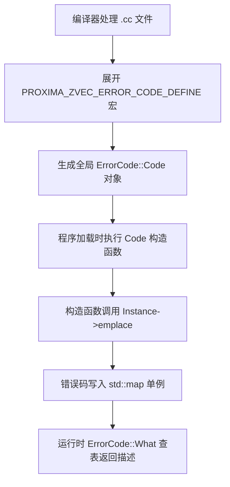
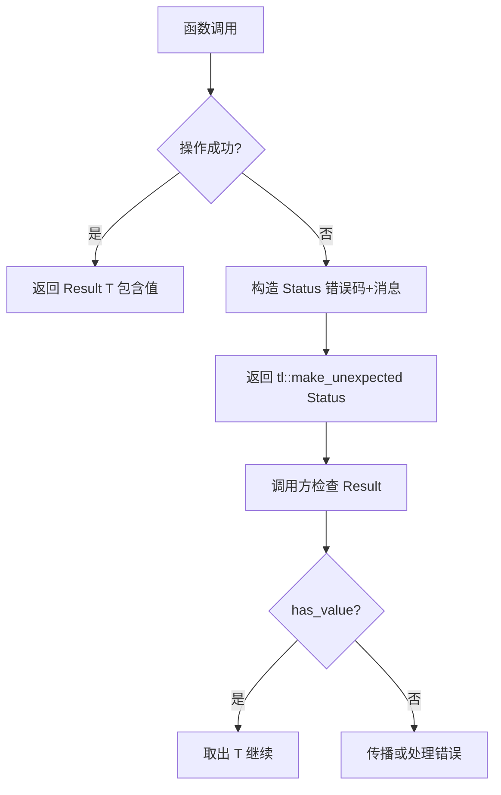

# PD-239.01 zvec — 双层错误码注册表与 Result<T> 函数式错误传播

> 文档编号：PD-239.01
> 来源：zvec `src/db/common/error_code.h` `src/include/zvec/db/status.h`
> GitHub：https://github.com/alibaba/zvec.git
> 问题域：PD-239 错误码体系 Error Code System
> 状态：可复用方案

---

## 第 1 章 问题与动机

### 1.1 核心问题

向量数据库系统涉及多层组件（存储引擎、索引构建、SQL 解析、RPC 通信、集群调度），每层都有独立的失败模式。如果错误码散落在各模块中，会导致：

1. **遗漏注册**：新增错误码忘记注册到全局表，运行时查不到描述
2. **语义模糊**：C++ 层的 int 错误码传到 Python 层后丢失语义
3. **传播冗余**：每个函数都要写 `if (ret != 0) return ret` 的样板代码
4. **异常安全**：数据库引擎不适合用 C++ 异常（性能开销 + 跨语言边界不安全）

zvec 的解法是构建**双层错误体系**：底层用宏驱动的编译期自注册 ErrorCode（覆盖 70+ 细粒度错误），上层用 `Status` + `Result<T>`（Rust 风格 expected）实现函数式错误传播。

### 1.2 zvec 的解法概述

1. **ErrorCode 单例注册表**：`ErrorCode::Code` 构造函数在全局变量初始化阶段自动将自身注册到 `ErrorCode::Instance()` 的 `std::map` 中（`error_code.h:32-33`）
2. **宏驱动零遗漏**：`PROXIMA_ZVEC_ERROR_CODE_DEFINE` 宏同时定义全局 `Code` 对象和引用变量，编译器保证链接时注册（`error_code.h:94-97`）
3. **分段编号体系**：0-999 内建、1000-1999 通用错误、2000-2999 客户端校验、5000+ 调度错误，按职责域划分（`error_code.cc:19-149`）
4. **Status + Result<T> 上层抽象**：11 种 StatusCode 枚举 + `tl::expected<T, Status>` 模板，API 层返回 `Result<Ptr>` 强制调用方处理错误（`status.h:24,31-43`）
5. **pybind11 跨语言映射**：StatusCode 枚举和 Status 类通过 pybind11 完整暴露给 Python，含工厂方法和 `__repr__`（`python_type.cc:137-224`）

### 1.3 设计思想

| 设计原则 | 具体实现 | 理由 | 替代方案 |
|----------|----------|------|----------|
| 编译期自注册 | Code 构造函数调用 `Instance()->emplace(this)` | 全局变量初始化保证注册，无运行时遗漏 | 手动注册表（易遗漏） |
| 双层错误模型 | ErrorCode（细粒度 int）+ Status（语义枚举） | 底层需要 70+ 错误码区分，API 层只需 11 种语义 | 单层错误码（要么太粗要么太细） |
| 函数式错误传播 | `Result<T> = tl::expected<T, Status>` | 编译期强制处理错误，无异常开销 | C++ 异常（跨语言不安全）/ errno（易忽略） |
| 宏消除样板 | `CHECK_RETURN_STATUS` / `CHECK_RETURN_STATUS_EXPECTED` | 一行宏替代 3 行 if-return | 手写 if-return（冗余） |
| 负值编码 | `Code(int val, ...) : value_(-val)` 存储为负数 | 与 0=Success 正交，避免与正数返回值冲突 | 正数编码（与 size_t 返回值冲突） |

---

## 第 2 章 源码实现分析

### 2.1 架构概览

zvec 的错误体系分为三层：底层 ErrorCode 注册表、中层 Status/Result 抽象、上层 Python 绑定。

```
┌─────────────────────────────────────────────────────────┐
│                    Python SDK 层                         │
│  StatusCode 枚举 ←→ Status 类（pybind11 绑定）          │
│  python_type.cc:137-224                                  │
├─────────────────────────────────────────────────────────┤
│                  C++ API 层（Status + Result<T>）        │
│  status.h: StatusCode(11种) + Status + Result<T>        │
│  Collection::CreateAndOpen() → Result<Ptr>              │
│  Collection::Flush() → Status                           │
├─────────────────────────────────────────────────────────┤
│               C++ 内核层（ErrorCode 注册表）             │
│  error_code.h: ErrorCode 单例 + Code 自注册             │
│  error_code.cc: 70+ DEFINE 宏调用                       │
│  typedef.h: CHECK_STATUS / CHECK_RETURN_STATUS 宏       │
├─────────────────────────────────────────────────────────┤
│               基础设施层                                 │
│  expected.hpp: tl::expected<T,E>（Rust Result 移植）    │
│  string_helper.h: 变参字符串拼接                        │
└─────────────────────────────────────────────────────────┘
```

### 2.2 核心实现

#### 2.2.1 ErrorCode 单例注册表与宏自注册



对应源码 `src/db/common/error_code.h:25-97`：

```cpp
class ErrorCode {
 public:
  class Code {
   public:
    // 构造即注册：全局变量初始化时自动调用
    Code(int val, const char *str) : value_(-val), desc_(str) {
      ErrorCode::Instance()->emplace(this);  // 关键：自注册到单例
    }
    operator int() const { return (this->value_); }
    int value() const { return (this->value_); }
    const char *desc() const { return (this->desc_); }
   private:
    int value_;
    const char *desc_;
  };

  static const char *What(int val);  // 运行时查表

 protected:
  static ErrorCode *Instance(void) {
    static ErrorCode error;  // Meyer's Singleton
    return (&error);
  }

 private:
  std::map<int, const ErrorCode::Code *> map_;  // 注册表
};

// 宏：同时定义 Code 对象 + 引用变量（防止链接器优化掉）
#define PROXIMA_ZVEC_ERROR_CODE_DEFINE(__NAME__, __VAL__, __DESC__)        \
  const zvec::ErrorCode::Code ErrorCode_##__NAME__((__VAL__), (__DESC__)); \
  const zvec::ErrorCode::Code &_ErrorCode_##__VAL__##_Register(            \
      ErrorCode_##__NAME__)
```

宏展开示例：`PROXIMA_ZVEC_ERROR_CODE_DEFINE(RuntimeError, 1000, "Runtime Error")` 生成：
- 全局对象 `ErrorCode_RuntimeError(1000, "Runtime Error")` — 构造时自注册
- 引用变量 `_ErrorCode_1000_Register` — 防止链接器因"未使用"而剥离该对象

#### 2.2.2 Status 类与 Result<T> 函数式错误传播



对应源码 `src/include/zvec/db/status.h:22-175`：

```cpp
// Rust 风格 Result 类型别名
template <typename T>
using Result = tl::expected<T, Status>;

enum class StatusCode {
  OK = 0, NOT_FOUND, ALREADY_EXISTS, INVALID_ARGUMENT,
  PERMISSION_DENIED, FAILED_PRECONDITION, RESOURCE_EXHAUSTED,
  UNAVAILABLE, INTERNAL_ERROR, NOT_SUPPORTED, UNKNOWN
};

class Status {
 public:
  Status() noexcept : code_(StatusCode::OK) {}
  Status(StatusCode code, const std::string &msg) : code_(code), msg_(msg) {}

  bool ok() const noexcept { return code_ == StatusCode::OK; }
  StatusCode code() const noexcept { return code_; }
  const std::string &message() const noexcept { return msg_; }

  // 变参模板工厂：Status::NotFound("path ", path, " not exist")
  template <typename... Args>
  static Status NotFound(Args &&...args) {
    return Status(StatusCode::NOT_FOUND, concat(std::forward<Args>(args)...));
  }
  // InternalError, InvalidArgument, PermissionDenied 等同理...

 private:
  template <typename... Args>
  static std::string concat(Args &&...args) {
    return ailego::StringHelper::Concat(std::forward<Args>(args)...);
  }
  StatusCode code_;
  std::string msg_;
};
```

实际使用示例 `src/db/index/common/version_manager.cc:188-228`：

```cpp
Result<VersionManager::Ptr> VersionManager::Recovery(const std::string &path) {
  if (!fs::exists(path)) {
    return tl::make_unexpected(
        Status::NotFound("path ", path, " does not exist"));
  }
  if (!fs::is_directory(path)) {
    return tl::make_unexpected(
        Status::InvalidArgument("path", path, " is not a directory"));
  }
  // ...
  auto s = Version::Load(version_path, &version);
  CHECK_RETURN_STATUS_EXPECTED(s);  // 宏：if (!s.ok()) return unexpected(s)
  // ...
}
```

### 2.3 实现细节

#### 错误传播宏体系

`src/db/common/typedef.h:108-173` 定义了一套分层宏，覆盖不同返回类型：

| 宏 | 返回类型 | 用途 |
|----|----------|------|
| `CHECK_STATUS(s, expect)` | `ErrorCode::Code` | 旧式 int 错误码函数 |
| `CHECK_RETURN_STATUS(s)` | `Status` | 新式 Status 返回函数 |
| `CHECK_RETURN_STATUS_EXPECTED(s)` | `Result<T>` | expected 返回函数 |
| `CHECK_DESTROY_RETURN_STATUS_EXPECTED(s, e)` | `Result<T>` | 带销毁状态检查 |

#### 分段编号规范

| 范围 | 类别 | 数量 | 示例 |
|------|------|------|------|
| 0-999 | 内建 | 1 | Success(0) |
| 1000-1999 | 通用运行时 | 32 | RuntimeError, Timeout, RpcError |
| 2000-2999 | 客户端校验 | 58 | EmptyCollectionName, InvalidDimension |
| 5000-5999 | 调度器 | 3 | UnreadyQueue, ScheduleError |

#### Python 绑定映射

`src/binding/python/typing/python_type.cc:137-224` 通过 pybind11 将 C++ 的 StatusCode 和 Status 完整暴露：

```cpp
py::enum_<StatusCode>(m, "StatusCode")
    .value("OK", StatusCode::OK)
    .value("NOT_FOUND", StatusCode::NOT_FOUND)
    // ... 11 种枚举值

py::class_<Status>(m, "Status")
    .def(py::init<>())
    .def(py::init<StatusCode, const std::string &>())
    .def("ok", &Status::ok)
    .def_static("InvalidArgument", [](const std::string &msg) {
        return Status::InvalidArgument(msg);
    })
    .def("__repr__", [](const Status &self) {
        return "{\"code\":" + std::to_string(static_cast<int>(self.code())) + ...;
    });
```

Python 侧通过 `python/zvec/typing/__init__.py` 重导出 `Status` 和 `StatusCode`。


---

## 第 3 章 迁移指南

### 3.1 迁移清单

**阶段 1：ErrorCode 自注册表（1-2 天）**
- [ ] 定义 `ErrorCode` 单例类 + 内嵌 `Code` 类
- [ ] 实现 `DEFINE` / `DECLARE` / `ACCESS` 三个宏
- [ ] 按业务域规划编号段（预留间隔）
- [ ] 在 `.cc` 文件中用 DEFINE 宏注册所有错误码

**阶段 2：Status + Result<T>（2-3 天）**
- [ ] 引入 `tl::expected`（header-only，直接复制 `expected.hpp`）
- [ ] 定义 `StatusCode` 枚举（参考 gRPC 状态码子集）
- [ ] 实现 `Status` 类 + 变参模板工厂方法
- [ ] 定义 `Result<T> = tl::expected<T, Status>`
- [ ] 编写 `CHECK_RETURN_STATUS` / `CHECK_RETURN_STATUS_EXPECTED` 宏

**阶段 3：跨语言绑定（1-2 天）**
- [ ] pybind11 绑定 StatusCode 枚举 + Status 类
- [ ] 确保 `__repr__` 输出 JSON 格式便于调试
- [ ] Python 包 `__init__.py` 重导出

### 3.2 适配代码模板

#### 模板 1：ErrorCode 自注册表（C++）

```cpp
// error_registry.h
#pragma once
#include <map>
#include <string>

class ErrorRegistry {
 public:
  class Code {
   public:
    Code(int val, const char* desc) : value_(val), desc_(desc) {
      ErrorRegistry::Instance()->Register(this);
    }
    int value() const { return value_; }
    const char* desc() const { return desc_; }
    operator int() const { return value_; }
   private:
    int value_;
    const char* desc_;
  };

  static const char* What(int val) {
    return Instance()->Lookup(val);
  }

 private:
  static ErrorRegistry* Instance() {
    static ErrorRegistry reg;
    return &reg;
  }
  void Register(const Code* code) {
    codes_.emplace(code->value(), code);
  }
  const char* Lookup(int val) const {
    auto it = codes_.find(val);
    return it != codes_.end() ? it->second->desc() : "Unknown";
  }
  std::map<int, const Code*> codes_;
};

#define ERROR_CODE_DEFINE(NAME, VAL, DESC) \
  const ErrorRegistry::Code kError_##NAME((VAL), (DESC)); \
  const ErrorRegistry::Code& _ErrorRef_##VAL##_Reg(kError_##NAME)

#define ERROR_CODE_DECLARE(NAME) \
  extern const ErrorRegistry::Code kError_##NAME

#define ERROR_CODE(NAME) kError_##NAME
```

#### 模板 2：Status + Result<T>（C++17）

```cpp
// status.h
#pragma once
#include <string>
#include <expected>  // C++23, 或用 tl::expected

enum class StatusCode {
  OK = 0, NOT_FOUND, INVALID_ARGUMENT, INTERNAL_ERROR,
  PERMISSION_DENIED, UNAVAILABLE, UNKNOWN
};

class Status {
 public:
  Status() noexcept : code_(StatusCode::OK) {}
  Status(StatusCode code, std::string msg) : code_(code), msg_(std::move(msg)) {}

  bool ok() const noexcept { return code_ == StatusCode::OK; }
  StatusCode code() const noexcept { return code_; }
  const std::string& message() const noexcept { return msg_; }

  static Status OK() noexcept { return {}; }

  template <typename... Args>
  static Status NotFound(Args&&... args) {
    return {StatusCode::NOT_FOUND, concat(std::forward<Args>(args)...)};
  }
  template <typename... Args>
  static Status InvalidArgument(Args&&... args) {
    return {StatusCode::INVALID_ARGUMENT, concat(std::forward<Args>(args)...)};
  }

 private:
  template <typename... Args>
  static std::string concat(Args&&... args) {
    std::ostringstream oss;
    (oss << ... << std::forward<Args>(args));
    return oss.str();
  }
  StatusCode code_;
  std::string msg_;
};

template <typename T>
using Result = std::expected<T, Status>;  // C++23

// 错误传播宏
#define RETURN_IF_ERROR(expr) \
  do { auto _s = (expr); if (!_s.ok()) return _s; } while(0)

#define RETURN_IF_ERROR_EXPECTED(expr) \
  do { auto _s = (expr); if (!_s.ok()) return std::unexpected(_s); } while(0)
```

### 3.3 适用场景

| 场景 | 适用度 | 说明 |
|------|--------|------|
| C++ 数据库/存储引擎 | ⭐⭐⭐ | 完美匹配：大量错误类型 + 无异常要求 |
| C++ 微服务 RPC 框架 | ⭐⭐⭐ | gRPC 风格 StatusCode 天然适配 |
| C++/Python 混合项目 | ⭐⭐⭐ | pybind11 绑定模式可直接复用 |
| 纯 Python 项目 | ⭐⭐ | Python 有原生异常，Result 模式非主流 |
| 嵌入式 C 项目 | ⭐⭐ | 需改为 C 风格，但自注册思路可用 |
| 前端/Node.js | ⭐ | JS/TS 有异常 + discriminated union，不需要宏 |

---

## 第 4 章 测试用例

```cpp
#include <gtest/gtest.h>
#include "error_registry.h"
#include "status.h"

// === ErrorCode 注册表测试 ===

// 在测试文件中定义错误码（模拟 error_code.cc）
ERROR_CODE_DEFINE(TestSuccess, 0, "Success");
ERROR_CODE_DEFINE(TestNotFound, 1001, "Not Found");
ERROR_CODE_DEFINE(TestInvalidArg, 2001, "Invalid Argument");

class ErrorCodeTest : public ::testing::Test {};

TEST_F(ErrorCodeTest, AutoRegistration) {
  // 编译期定义的错误码应自动注册到单例
  EXPECT_STREQ(ErrorRegistry::What(0), "Success");
  EXPECT_STREQ(ErrorRegistry::What(1001), "Not Found");
  EXPECT_STREQ(ErrorRegistry::What(2001), "Invalid Argument");
}

TEST_F(ErrorCodeTest, UnknownCodeReturnsDefault) {
  EXPECT_STREQ(ErrorRegistry::What(99999), "Unknown");
}

TEST_F(ErrorCodeTest, CodeImplicitConversion) {
  int val = ERROR_CODE(TestNotFound);
  EXPECT_EQ(val, 1001);
}

// === Status + Result<T> 测试 ===

class StatusTest : public ::testing::Test {};

TEST_F(StatusTest, DefaultIsOK) {
  Status s;
  EXPECT_TRUE(s.ok());
  EXPECT_EQ(s.code(), StatusCode::OK);
}

TEST_F(StatusTest, FactoryMethods) {
  auto s = Status::NotFound("key ", "abc", " missing");
  EXPECT_FALSE(s.ok());
  EXPECT_EQ(s.code(), StatusCode::NOT_FOUND);
  EXPECT_EQ(s.message(), "key abc missing");
}

TEST_F(StatusTest, Equality) {
  EXPECT_EQ(Status::OK(), Status::OK());
  EXPECT_NE(Status::NotFound("a"), Status::NotFound("b"));
  EXPECT_NE(Status::NotFound("a"), Status::InvalidArgument("a"));
}

// === Result<T> 函数式传播测试 ===

Result<int> SafeDivide(int a, int b) {
  if (b == 0) return std::unexpected(Status::InvalidArgument("division by zero"));
  return a / b;
}

Result<int> ChainedCompute(int a, int b) {
  auto r = SafeDivide(a, b);
  if (!r.has_value()) return r;  // 传播错误
  return r.value() + 1;
}

TEST(ResultTest, SuccessPath) {
  auto r = SafeDivide(10, 2);
  ASSERT_TRUE(r.has_value());
  EXPECT_EQ(r.value(), 5);
}

TEST(ResultTest, ErrorPath) {
  auto r = SafeDivide(10, 0);
  ASSERT_FALSE(r.has_value());
  EXPECT_EQ(r.error().code(), StatusCode::INVALID_ARGUMENT);
}

TEST(ResultTest, ErrorPropagation) {
  auto r = ChainedCompute(10, 0);
  ASSERT_FALSE(r.has_value());
  EXPECT_EQ(r.error().message(), "division by zero");
}

TEST(ResultTest, SuccessPropagation) {
  auto r = ChainedCompute(10, 2);
  ASSERT_TRUE(r.has_value());
  EXPECT_EQ(r.value(), 6);  // 10/2 + 1
}
```


---

## 第 5 章 跨域关联

| 关联域 | 关系类型 | 说明 |
|--------|----------|------|
| PD-03 容错与重试 | 协同 | ErrorCode 中的 `NeedRetry`(1030)、`Timeout`(1028) 直接驱动重试策略；Status 的 `UNAVAILABLE` 和 `RESOURCE_EXHAUSTED` 是重试判断依据 |
| PD-04 工具系统 | 协同 | 工具调用返回 `Result<T>` 统一错误处理，工具注册失败用 ErrorCode 报告 |
| PD-11 可观测性 | 依赖 | `CHECK_STATUS` 宏内嵌 `LOG_ERROR` 调用，错误码是日志结构化字段的基础；`Status.__repr__` 输出 JSON 便于日志采集 |
| PD-07 质量检查 | 协同 | 2000-2999 段的客户端校验错误码（EmptyCollectionName、InvalidDimension 等）本质是输入质量检查的结果编码 |

---

## 第 6 章 来源文件索引

| 文件 | 行范围 | 关键实现 |
|------|--------|----------|
| `src/db/common/error_code.h` | L25-97 | ErrorCode 单例类 + Code 自注册 + DEFINE/DECLARE/ACCESS 三宏 |
| `src/db/common/error_code.cc` | L19-153 | 70+ 错误码 DEFINE 注册 + What() 实现 |
| `src/include/zvec/db/status.h` | L22-179 | StatusCode 枚举 + Status 类 + Result<T> 别名 + 变参工厂 |
| `src/db/common/status.cc` | L21-55 | GetDefaultMessage 映射 + operator<< + operator== |
| `src/db/common/typedef.h` | L108-173 | CHECK_STATUS / CHECK_RETURN_STATUS / CHECK_RETURN_STATUS_EXPECTED 宏族 |
| `src/binding/python/typing/python_type.cc` | L137-224 | pybind11 绑定 StatusCode 枚举 + Status 类 + 工厂方法 |
| `python/zvec/typing/__init__.py` | L16-32 | Python 层重导出 Status, StatusCode |
| `src/include/zvec/ailego/pattern/expected.hpp` | 全文 | tl::expected<T,E> 实现（Sy Brand, CC0） |
| `src/include/zvec/db/collection.h` | L38-106 | Collection API 使用 Result<Ptr> 和 Status 的典型消费者 |
| `src/db/index/common/version_manager.cc` | L188-232 | Result<T> + tl::make_unexpected + CHECK_RETURN_STATUS_EXPECTED 实战用法 |

---

## 第 7 章 横向对比维度

```json comparison_data
{
  "project": "zvec",
  "dimensions": {
    "注册机制": "宏驱动编译期自注册，Code 构造函数写入 Meyer's Singleton map",
    "错误分类": "四段编号（内建/通用/校验/调度）覆盖 70+ 错误码",
    "传播模型": "双层：底层 int ErrorCode + 上层 Result<T>=tl::expected<T,Status>",
    "跨语言映射": "pybind11 完整绑定 StatusCode 枚举 + Status 工厂方法到 Python",
    "样板消除": "CHECK_RETURN_STATUS 系列宏，按返回类型分 Status/Expected 两族"
  }
}
```

### 域元数据补充

```json domain_metadata
{
  "solution_summary": "zvec 用宏驱动 Code 构造函数自注册到 Meyer's Singleton 实现 70+ 错误码零遗漏，上层用 tl::expected<T,Status> 实现 Rust 风格函数式错误传播，pybind11 完整映射到 Python",
  "description": "错误码体系需同时解决注册完整性、传播效率和跨语言一致性三个子问题",
  "sub_problems": [
    "错误传播样板代码消除（宏族设计）",
    "双层错误模型的粒度选择（细粒度 int vs 语义枚举）"
  ],
  "best_practices": [
    "用引用变量防止链接器优化掉全局自注册对象",
    "Status 工厂用变参模板实现零开销字符串拼接",
    "按返回类型分族设计 CHECK 宏（Status 返回 vs expected 返回）"
  ]
}
```
