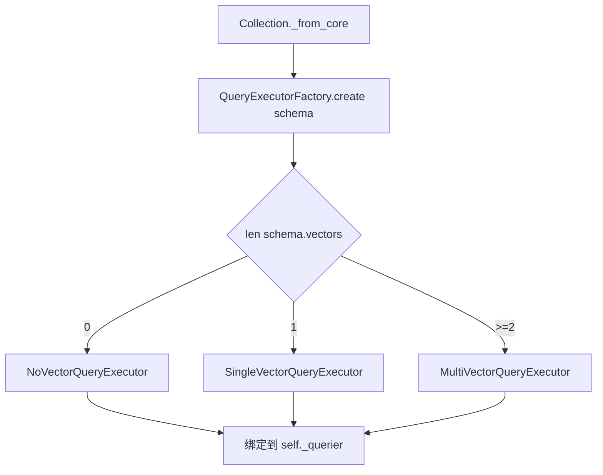
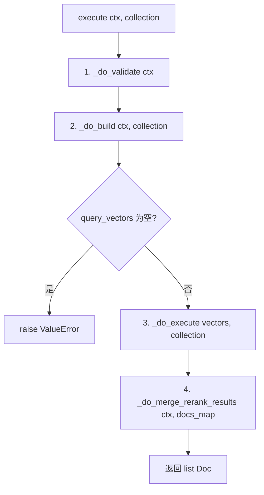
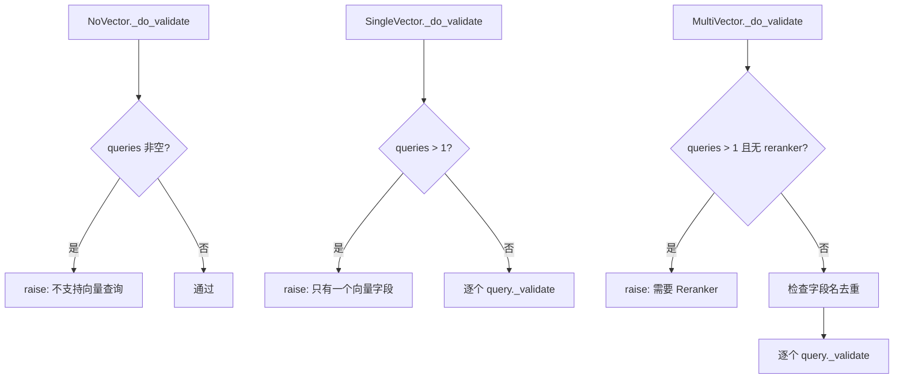

# PD-240.01 zvec — QueryExecutorFactory 三策略查询执行器流水线

> 文档编号：PD-240.01
> 来源：zvec `python/zvec/executor/query_executor.py`
> GitHub：https://github.com/alibaba/zvec.git
> 问题域：PD-240 查询执行器策略 Query Executor Strategy
> 状态：可复用方案

---

## 第 1 章 问题与动机

### 1.1 核心问题

向量数据库的查询场景差异巨大：有的 collection 没有向量字段（纯标量过滤），有的只有一个向量字段（经典 ANN 搜索），有的有多个向量字段（多模态检索需要融合排序）。如果用一个统一的查询执行器处理所有场景，会导致：

1. **无效校验**：纯标量查询不需要检查向量参数，单向量查询不需要检查重排序器
2. **性能浪费**：单向量查询不需要线程池并行执行
3. **用户心智负担**：用户需要手动判断自己的 schema 属于哪种类型，选择对应的查询方式
4. **错误延迟暴露**：多向量查询忘记传 reranker 时，直到结果融合阶段才报错

核心矛盾：**查询执行的复杂度应该由 schema 决定，而不是由用户决定**。

### 1.2 zvec 的解法概述

zvec 用经典的 Factory + Strategy 模式，在 collection 打开时一次性决定执行器类型，后续所有查询零决策开销：

1. **Schema 驱动的 Factory**：`QueryExecutorFactory.create()` 检查 `schema.vectors` 长度，自动返回 NoVector / SingleVector / MultiVector 三种执行器之一（`query_executor.py:299-307`）
2. **四阶段 Template Method**：基类 `QueryExecutor.execute()` 用 `@final` 装饰器锁定 validate → build → execute → merge/rerank 四步流水线（`query_executor.py:228-238`）
3. **渐进式继承链**：`NoVector → SingleVector → MultiVector` 逐层叠加能力，每层只覆写必要的方法（`query_executor.py:241-296`）
4. **强制 Reranker 约束**：MultiVector 执行器在 validate 阶段就强制要求 reranker，fail-fast 而非 fail-late（`query_executor.py:283-284`）
5. **环境变量控制并发**：`ZVEC_QUERY_CONCURRENCY` 控制 ThreadPoolExecutor 的 worker 数，默认串行（`query_executor.py:122`）

### 1.3 设计思想

| 设计原则 | 具体实现 | 理由 | 替代方案 |
|----------|----------|------|----------|
| Schema 驱动选择 | Factory 根据 `len(schema.vectors)` 分发 | 用户无需关心执行器类型，schema 即契约 | 用户手动指定执行器类型 |
| Template Method | `execute()` 用 `@final` 锁定四步流水线 | 子类只能覆写步骤，不能跳过或重排 | 每个子类自行实现完整 execute |
| 渐进式继承 | Multi 继承 Single 继承 NoVector | 避免代码重复，每层只加新能力 | 组合模式（更灵活但更复杂） |
| Fail-Fast 校验 | MultiVector 在 validate 阶段检查 reranker | 错误在流水线最早阶段暴露 | 在 merge 阶段才检查 |
| 环境变量并发控制 | `ZVEC_QUERY_CONCURRENCY` 默认 1 | 生产环境可调优，开发环境默认安全 | 构造函数参数传入 |

---

## 第 2 章 源码实现分析

### 2.1 架构概览

zvec 的查询执行器体系由三层组成：Factory 层（选择策略）、Executor 层（执行流水线）、Reranker 层（结果融合）。

```
┌─────────────────────────────────────────────────────────────┐
│                    Collection.query()                        │
│                 python/zvec/model/collection.py:331          │
└──────────────────────┬──────────────────────────────────────┘
                       │ 构建 QueryContext
                       ▼
┌─────────────────────────────────────────────────────────────┐
│              QueryExecutorFactory.create()                   │
│           python/zvec/executor/query_executor.py:299         │
│                                                             │
│   len(vectors)==0 → NoVectorQueryExecutor                   │
│   len(vectors)==1 → SingleVectorQueryExecutor               │
│   len(vectors)>=2 → MultiVectorQueryExecutor                │
└──────────────────────┬──────────────────────────────────────┘
                       │ 在 Collection._from_core() 时绑定
                       ▼
┌─────────────────────────────────────────────────────────────┐
│           QueryExecutor.execute() [@final]                   │
│           python/zvec/executor/query_executor.py:228         │
│                                                             │
│   1. _do_validate(ctx)     ← 子类覆写                       │
│   2. _do_build(ctx, coll)  ← 子类覆写                       │
│   3. _do_execute(vectors, coll)  ← 基类实现，支持并行        │
│   4. _do_merge_rerank_results(ctx, docs_map)                │
└──────────────────────┬──────────────────────────────────────┘
                       │ 多向量时调用
                       ▼
┌─────────────────────────────────────────────────────────────┐
│              RerankFunction (ABC)                            │
│     python/zvec/extension/rerank_function.py:22              │
│                                                             │
│   ├── RrfReRanker    (Reciprocal Rank Fusion)               │
│   ├── WeightedReRanker (加权分数归一化)                      │
│   ├── QwenReRanker   (LLM 语义重排)                         │
│   └── DefaultLocalReRanker (本地模型重排)                    │
└─────────────────────────────────────────────────────────────┘
```

### 2.2 核心实现

#### 2.2.1 Factory 自动选择执行器



对应源码 `python/zvec/executor/query_executor.py:299-307`：

```python
class QueryExecutorFactory:
    @staticmethod
    def create(schema: CollectionSchema) -> QueryExecutor:
        vectors = schema.vectors
        if len(vectors) == 0:
            return NoVectorQueryExecutor(schema)
        if len(vectors) == 1:
            return SingleVectorQueryExecutor(schema)
        return MultiVectorQueryExecutor(schema)
```

Factory 在 `Collection._from_core()` 中被调用（`python/zvec/model/collection.py:66`）：

```python
@classmethod
def _from_core(cls, core_collection: _Collection) -> Collection:
    inst = cls.__new__(cls)
    inst._obj = core_collection
    schema = CollectionSchema._from_core(core_collection.Schema())
    inst._schema = schema
    inst._querier = QueryExecutorFactory.create(schema)  # 一次绑定
    return inst
```

#### 2.2.2 四阶段 Template Method 流水线



对应源码 `python/zvec/executor/query_executor.py:227-238`：

```python
@final
def execute(self, ctx: QueryContext, collection: _Collection) -> list[Doc]:
    # 1. validate query
    self._do_validate(ctx)
    # 2. build query vector
    query_vectors = self._do_build(ctx, collection)
    if not query_vectors:
        raise ValueError("No query to execute")
    # 3. execute query
    docs = self._do_execute(query_vectors, collection)
    # 4. merge and rerank result
    return self._do_merge_rerank_results(ctx, docs)
```

`@final` 装饰器确保子类不能覆写 `execute()`，只能覆写四个 `_do_*` 钩子方法。

#### 2.2.3 三层继承链的 validate 差异



对应源码 `python/zvec/executor/query_executor.py:245-291`：

```python
# NoVectorQueryExecutor._do_validate (L245-247)
def _do_validate(self, ctx: QueryContext) -> None:
    if len(ctx.queries) > 0:
        raise ValueError("Collection does not support query with vector or id")

# SingleVectorQueryExecutor._do_validate (L259-265)
def _do_validate(self, ctx: QueryContext) -> None:
    if len(ctx.queries) > 1:
        raise ValueError(
            "Collection has only one vector field, cannot query with multiple vectors"
        )
    for query in ctx.queries:
        query._validate()

# MultiVectorQueryExecutor._do_validate (L282-291)
def _do_validate(self, ctx: QueryContext) -> None:
    if len(ctx.queries) > 1 and ctx.reranker is None:
        raise ValueError("Reranker is required for multi-vector query")
    seen_fields = set()
    for query in ctx.queries:
        query._validate()
        field = query.field_name
        if field in seen_fields:
            raise ValueError(f"Query field name '{field}' appears more than once")
        seen_fields.add(field)
```

### 2.3 实现细节

#### 并行执行与 ThreadPoolExecutor

`_do_execute` 方法根据查询数量和并发配置决定串行还是并行（`query_executor.py:179-211`）：

- 单查询或 `ZVEC_QUERY_CONCURRENCY=1` 时串行执行
- 多查询且并发 > 1 时用 `ThreadPoolExecutor` + `as_completed` 并行

结果以 `dict[str, list[Doc]]` 返回，key 是向量字段名，value 是该字段的查询结果。

#### Reranker 融合策略

`_do_merge_rerank_results` 的逻辑（`query_executor.py:213-225`）：

- 单结果集 + 无 reranker 或 RRF/Weighted reranker → 直接返回（无需融合）
- 单结果集 + 自定义 reranker → 调用 reranker
- 多结果集 → 必须调用 reranker（validate 阶段已保证 reranker 存在）

RRF 公式：`score(d) = Σ 1/(k + rank + 1)`，k 默认 60（`multi_vector_reranker.py:60`）

WeightedReRanker 对不同 metric 做归一化（`multi_vector_reranker.py:167-173`）：
- L2: `1 - 2·atan(score)/π`
- IP: `0.5 + atan(score)/π`
- COSINE: `1 - score/2`

---

## 第 3 章 迁移指南

### 3.1 迁移清单

**阶段 1：核心抽象（必须）**

- [ ] 定义 `QueryContext` 数据类，封装 topk / filter / queries / reranker 等查询参数
- [ ] 定义 `QueryExecutor` 抽象基类，包含 `_do_validate` / `_do_build` / `_do_execute` / `_do_merge_rerank` 四个钩子
- [ ] 实现 `execute()` 方法并用 `@final` 锁定流水线顺序
- [ ] 实现 `QueryExecutorFactory.create(schema)` 静态方法

**阶段 2：策略实现（按需）**

- [ ] 实现 NoVector 执行器（纯标量过滤场景）
- [ ] 实现 SingleVector 执行器（经典 ANN 场景）
- [ ] 实现 MultiVector 执行器（多模态融合场景）

**阶段 3：Reranker 扩展（可选）**

- [ ] 定义 `RerankFunction` 抽象基类
- [ ] 实现 RRF Reranker（无需分数，基于排名融合）
- [ ] 实现 Weighted Reranker（基于分数加权融合）
- [ ] 集成外部 Reranker（如 Qwen、Jina、本地模型）

### 3.2 适配代码模板

以下模板可直接复用，实现一个最小化的 Factory + Strategy 查询执行器：

```python
from __future__ import annotations
from abc import ABC, abstractmethod
from typing import Optional, final
from concurrent.futures import ThreadPoolExecutor, as_completed
from dataclasses import dataclass


@dataclass
class QueryContext:
    """查询上下文，封装所有查询参数"""
    topk: int = 10
    filter: Optional[str] = None
    vector_queries: list = None  # list[VectorQuery]
    reranker: Optional[object] = None

    def __post_init__(self):
        self.vector_queries = self.vector_queries or []


class QueryExecutor(ABC):
    """查询执行器基类，定义 validate-build-execute-rerank 四阶段流水线"""

    def __init__(self, schema: dict, concurrency: int = 1):
        self._schema = schema
        self._concurrency = max(1, concurrency)

    @abstractmethod
    def _do_validate(self, ctx: QueryContext) -> None:
        """校验查询参数是否合法"""
        ...

    @abstractmethod
    def _do_build(self, ctx: QueryContext) -> list[dict]:
        """构建底层查询对象"""
        ...

    def _do_execute(self, queries: list[dict], engine) -> dict[str, list]:
        """执行查询，支持并行"""
        if len(queries) <= 1 or self._concurrency == 1:
            return {q["field"]: engine.search(q) for q in queries}

        results = {}
        with ThreadPoolExecutor(max_workers=self._concurrency) as pool:
            futures = {pool.submit(engine.search, q): q["field"] for q in queries}
            for future in as_completed(futures):
                results[futures[future]] = future.result()
        return results

    def _do_merge_rerank(self, ctx: QueryContext, results: dict[str, list]) -> list:
        """融合多路结果并重排序"""
        if len(results) == 1:
            return next(iter(results.values()))
        if ctx.reranker:
            return ctx.reranker.rerank(results)
        raise ValueError("Multiple result sets require a reranker")

    @final
    def execute(self, ctx: QueryContext, engine) -> list:
        self._do_validate(ctx)
        queries = self._do_build(ctx)
        if not queries:
            raise ValueError("No query to execute")
        results = self._do_execute(queries, engine)
        return self._do_merge_rerank(ctx, results)


class NoVectorExecutor(QueryExecutor):
    def _do_validate(self, ctx: QueryContext) -> None:
        if ctx.vector_queries:
            raise ValueError("Schema has no vector fields")

    def _do_build(self, ctx: QueryContext) -> list[dict]:
        return [{"field": "__scalar__", "filter": ctx.filter, "topk": ctx.topk}]


class SingleVectorExecutor(QueryExecutor):
    def _do_validate(self, ctx: QueryContext) -> None:
        if len(ctx.vector_queries) > 1:
            raise ValueError("Schema has only one vector field")

    def _do_build(self, ctx: QueryContext) -> list[dict]:
        if not ctx.vector_queries:
            return [{"field": "__scalar__", "filter": ctx.filter, "topk": ctx.topk}]
        return [{"field": q.field_name, "vector": q.vector, "topk": ctx.topk,
                 "filter": ctx.filter} for q in ctx.vector_queries]


class MultiVectorExecutor(QueryExecutor):
    def _do_validate(self, ctx: QueryContext) -> None:
        if len(ctx.vector_queries) > 1 and ctx.reranker is None:
            raise ValueError("Reranker required for multi-vector query")
        fields = [q.field_name for q in ctx.vector_queries]
        if len(fields) != len(set(fields)):
            raise ValueError("Duplicate vector field names")

    def _do_build(self, ctx: QueryContext) -> list[dict]:
        if not ctx.vector_queries:
            return [{"field": "__scalar__", "filter": ctx.filter, "topk": ctx.topk}]
        return [{"field": q.field_name, "vector": q.vector, "topk": ctx.topk,
                 "filter": ctx.filter} for q in ctx.vector_queries]


class QueryExecutorFactory:
    @staticmethod
    def create(schema: dict) -> QueryExecutor:
        n_vectors = len(schema.get("vectors", []))
        if n_vectors == 0:
            return NoVectorExecutor(schema)
        if n_vectors == 1:
            return SingleVectorExecutor(schema)
        return MultiVectorExecutor(schema)
```

### 3.3 适用场景

| 场景 | 适用度 | 说明 |
|------|--------|------|
| 向量数据库 SDK 查询层 | ⭐⭐⭐ | 完美匹配：schema 驱动 + 多策略 + rerank |
| RAG 检索管道 | ⭐⭐⭐ | 多向量（dense + sparse）融合检索 |
| 多模态搜索引擎 | ⭐⭐⭐ | 图像向量 + 文本向量并行查询 + 融合 |
| 单一 ANN 搜索服务 | ⭐⭐ | 可用但 Factory 层略显多余 |
| 纯标量数据库查询 | ⭐ | 不需要策略模式，直接查询即可 |

---

## 第 4 章 测试用例

```python
import pytest
from unittest.mock import MagicMock, patch


class FakeSchema:
    """模拟 CollectionSchema"""
    def __init__(self, n_vectors: int):
        self.vectors = [MagicMock(name=f"vec_{i}") for i in range(n_vectors)]


class TestQueryExecutorFactory:
    """测试 Factory 根据 schema 自动选择执行器"""

    def test_no_vector_schema(self):
        schema = FakeSchema(n_vectors=0)
        executor = QueryExecutorFactory.create(schema)
        assert isinstance(executor, NoVectorQueryExecutor)

    def test_single_vector_schema(self):
        schema = FakeSchema(n_vectors=1)
        executor = QueryExecutorFactory.create(schema)
        assert isinstance(executor, SingleVectorQueryExecutor)

    def test_multi_vector_schema(self):
        schema = FakeSchema(n_vectors=3)
        executor = QueryExecutorFactory.create(schema)
        assert isinstance(executor, MultiVectorQueryExecutor)


class TestNoVectorExecutor:
    """测试纯标量查询执行器"""

    def test_rejects_vector_queries(self):
        schema = FakeSchema(n_vectors=0)
        executor = NoVectorQueryExecutor(schema)
        ctx = QueryContext(topk=10, queries=[MagicMock()])
        with pytest.raises(ValueError, match="does not support query with vector"):
            executor._do_validate(ctx)

    def test_accepts_empty_queries(self):
        schema = FakeSchema(n_vectors=0)
        executor = NoVectorQueryExecutor(schema)
        ctx = QueryContext(topk=10, queries=[])
        executor._do_validate(ctx)  # 不应抛异常


class TestSingleVectorExecutor:
    """测试单向量查询执行器"""

    def test_rejects_multiple_vectors(self):
        schema = FakeSchema(n_vectors=1)
        executor = SingleVectorQueryExecutor(schema)
        ctx = QueryContext(topk=10, queries=[MagicMock(), MagicMock()])
        with pytest.raises(ValueError, match="only one vector field"):
            executor._do_validate(ctx)


class TestMultiVectorExecutor:
    """测试多向量查询执行器"""

    def test_requires_reranker_for_multi_query(self):
        schema = FakeSchema(n_vectors=2)
        executor = MultiVectorQueryExecutor(schema)
        q1 = MagicMock(field_name="vec_0")
        q2 = MagicMock(field_name="vec_1")
        ctx = QueryContext(topk=10, queries=[q1, q2], reranker=None)
        with pytest.raises(ValueError, match="Reranker is required"):
            executor._do_validate(ctx)

    def test_rejects_duplicate_field_names(self):
        schema = FakeSchema(n_vectors=2)
        executor = MultiVectorQueryExecutor(schema)
        q1 = MagicMock(field_name="vec_0")
        q2 = MagicMock(field_name="vec_0")
        ctx = QueryContext(topk=10, queries=[q1, q2], reranker=MagicMock())
        with pytest.raises(ValueError, match="appears more than once"):
            executor._do_validate(ctx)

    def test_accepts_single_query_without_reranker(self):
        schema = FakeSchema(n_vectors=2)
        executor = MultiVectorQueryExecutor(schema)
        q1 = MagicMock(field_name="vec_0")
        ctx = QueryContext(topk=10, queries=[q1], reranker=None)
        executor._do_validate(ctx)  # 单查询不强制 reranker


class TestRrfReRanker:
    """测试 RRF 融合排序"""

    def test_rrf_score_formula(self):
        reranker = RrfReRanker(topn=5, rank_constant=60)
        # rank=0 → 1/(60+0+1) = 1/61
        assert abs(reranker._rrf_score(0) - 1/61) < 1e-9
        # rank=1 → 1/(60+1+1) = 1/62
        assert abs(reranker._rrf_score(1) - 1/62) < 1e-9

    def test_rrf_combines_two_lists(self):
        reranker = RrfReRanker(topn=2, rank_constant=60)
        doc_a = MagicMock(id="a", _replace=lambda **kw: MagicMock(id="a", **kw))
        doc_b = MagicMock(id="b", _replace=lambda **kw: MagicMock(id="b", **kw))
        results = {"field1": [doc_a, doc_b], "field2": [doc_b, doc_a]}
        merged = reranker.rerank(results)
        # 两个文档在两个列表中都出现，RRF 分数相同
        assert len(merged) == 2


class TestWeightedReRanker:
    """测试加权归一化排序"""

    def test_l2_normalization(self):
        import math
        reranker = WeightedReRanker(topn=5, metric=MetricType.L2)
        # L2: 1 - 2*atan(score)/pi
        score = 1.0
        expected = 1.0 - 2 * math.atan(1.0) / math.pi  # = 0.5
        assert abs(reranker._normalize_score(score, MetricType.L2) - expected) < 1e-9
```

---

## 第 5 章 跨域关联

| 关联域 | 关系类型 | 说明 |
|--------|----------|------|
| PD-08 搜索与检索 | 协同 | 查询执行器是搜索管道的核心执行层，Reranker 是检索质量的关键环节 |
| PD-04 工具系统 | 协同 | Factory 模式与工具注册表模式同构：schema 驱动选择 ≈ 工具名驱动分发 |
| PD-02 多 Agent 编排 | 类比 | MultiVector 并行查询 + 结果融合 ≈ 多 Agent 并行执行 + 结果汇总 |
| PD-10 中间件管道 | 类比 | validate → build → execute → rerank 四阶段流水线 ≈ 中间件管道模式 |
| PD-01 上下文管理 | 依赖 | 查询结果的 topk 和 output_fields 控制直接影响下游上下文窗口大小 |

---

## 第 6 章 来源文件索引

| 文件 | 行范围 | 关键实现 |
|------|--------|----------|
| `python/zvec/executor/query_executor.py` | L38-43 | DTYPE_MAP 向量类型映射 |
| `python/zvec/executor/query_executor.py` | L63-117 | QueryContext 查询上下文数据类 |
| `python/zvec/executor/query_executor.py` | L119-238 | QueryExecutor 基类 + @final execute 流水线 |
| `python/zvec/executor/query_executor.py` | L241-253 | NoVectorQueryExecutor 纯标量执行器 |
| `python/zvec/executor/query_executor.py` | L255-275 | SingleVectorQueryExecutor 单向量执行器 |
| `python/zvec/executor/query_executor.py` | L278-296 | MultiVectorQueryExecutor 多向量执行器 |
| `python/zvec/executor/query_executor.py` | L299-307 | QueryExecutorFactory 工厂方法 |
| `python/zvec/model/collection.py` | L58-67 | Collection._from_core 绑定执行器 |
| `python/zvec/model/collection.py` | L331-379 | Collection.query 入口方法 |
| `python/zvec/extension/rerank_function.py` | L22-69 | RerankFunction 抽象基类 |
| `python/zvec/extension/multi_vector_reranker.py` | L26-88 | RrfReRanker RRF 融合排序 |
| `python/zvec/extension/multi_vector_reranker.py` | L91-174 | WeightedReRanker 加权归一化排序 |
| `python/zvec/model/param/vector_query.py` | L25-81 | VectorQuery 查询参数 dataclass |
| `python/zvec/model/schema/collection_schema.py` | L28-216 | CollectionSchema 含 vectors 属性 |

---

## 第 7 章 横向对比维度

> 本章用于自动填充 Butcher Wiki 的横向对比表。

```json comparison_data
{
  "project": "zvec",
  "dimensions": {
    "策略选择机制": "Factory 根据 schema.vectors 长度自动分发三种执行器",
    "流水线模式": "@final Template Method 锁定 validate-build-execute-rerank 四阶段",
    "并行能力": "ThreadPoolExecutor + as_completed，ZVEC_QUERY_CONCURRENCY 环境变量控制",
    "继承体系": "NoVector → SingleVector → MultiVector 渐进式继承链",
    "Reranker 架构": "RerankFunction ABC + RRF/Weighted/LLM 三类内置实现",
    "校验策略": "Fail-Fast：MultiVector 在 validate 阶段强制要求 Reranker"
  }
}
```

### 域元数据补充

```json domain_metadata
{
  "solution_summary": "zvec 用 QueryExecutorFactory 根据 schema 向量字段数自动分发 NoVector/SingleVector/MultiVector 三种执行器，@final Template Method 锁定四阶段流水线",
  "description": "查询执行器的策略选择、流水线编排与多路结果融合",
  "sub_problems": [
    "向量类型到 numpy dtype 的安全转换",
    "ID 查询与向量查询的统一抽象",
    "距离度量归一化（L2/IP/COSINE 到 0-1 区间）"
  ],
  "best_practices": [
    "@final 装饰器锁定流水线顺序，子类只能覆写钩子不能跳步",
    "环境变量控制并发度，默认串行保证安全",
    "渐进式继承链避免代码重复，每层只叠加新能力"
  ]
}
```
