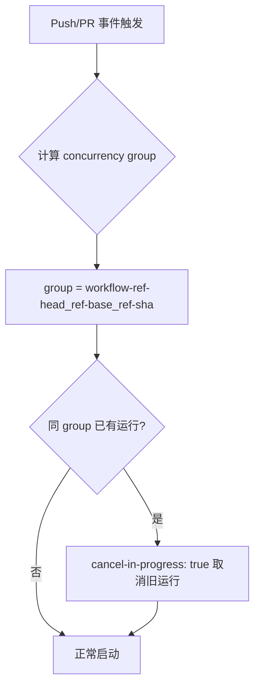
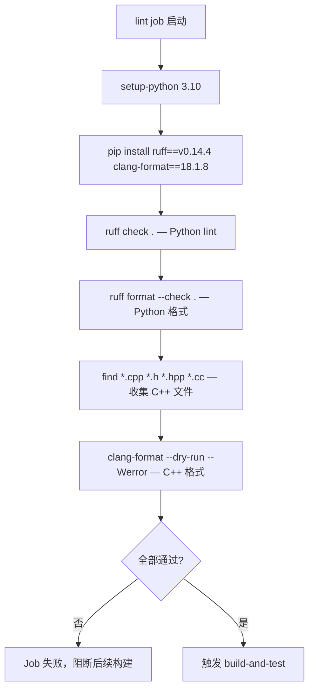
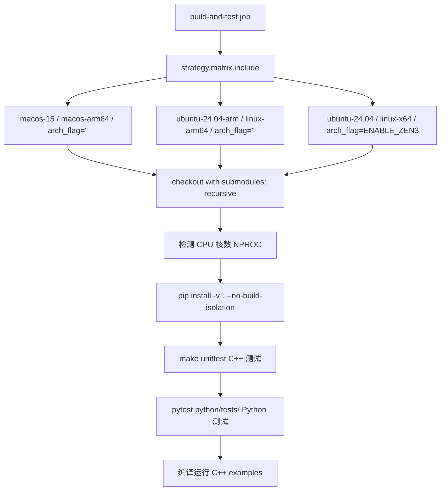

# PD-241.01 zvec — 多平台矩阵构建与持续基准测试

> 文档编号：PD-241.01
> 来源：zvec `.github/workflows/main.yml`, `.github/workflows/build_wheel.yml`, `.github/workflows/continuous_bench.yml`
> GitHub：https://github.com/alibaba/zvec.git
> 问题域：PD-241 CI/CD 多平台构建 Multi-Platform CI/CD Build
> 状态：可复用方案

---

## 第 1 章 问题与动机

### 1.1 核心问题

C++ 与 Python 混合项目（pybind11 绑定）的 CI/CD 面临三重挑战：

1. **跨平台编译差异**：Linux x64/ARM64 与 macOS ARM64 的编译器行为、CPU 指令集（如 AVX/ZEN3）、链接器标志各不相同，同一份 CMake 配置无法直接通用
2. **双语言测试覆盖**：C++ 单元测试（GTest + CTest）和 Python 测试（pytest）需要在同一构建产物上分别运行，且覆盖率需要合并上报
3. **性能回归检测**：向量数据库对 QPS/Recall/P99 延迟极度敏感，每次 commit 都可能引入性能回归，需要自动化基准测试 + 指标推送

### 1.2 zvec 的解法概述

zvec 通过 5 个 GitHub Actions workflow 文件构建了完整的 CI/CD 体系：

1. **lint → build-and-test 两阶段门控**：`main.yml:24-25` 定义 lint job 作为快速失败前哨，`main.yml:72` 的 build-and-test 通过 `needs: lint` 依赖确保代码质量检查通过后才启动耗时的编译
2. **三平台矩阵 + 架构特定标志**：`main.yml:77-91` 使用 `strategy.matrix.include` 显式列出 macos-arm64、linux-arm64、linux-x64 三个平台，linux-x64 额外传入 `ENABLE_ZEN3` 编译标志
3. **cibuildwheel 跨版本 wheel 打包**：`pyproject.toml:159-179` 配置 cibuildwheel 构建 cp310/cp311/cp312 三个 Python 版本的 wheel，区分 manylinux_2_28 和 macOS arm64
4. **Nightly 双语言覆盖率合并**：`nightly_coverage.yml:59-93` 用 COVERAGE 构建类型编译 C++，同时运行 pytest-cov 和 lcov/gcov，最终合并上传 Codecov
5. **持续基准测试 + Prometheus 推送**：`continuous_bench.yml` + `scripts/run_vdb.sh` 在自托管 runner 上运行 VectorDBBench，将 QPS/Recall/P99 指标推送到 Prometheus Pushgateway

### 1.3 设计思想

| 设计原则 | 具体实现 | 理由 | 替代方案 |
|----------|----------|------|----------|
| 快速失败 | lint job 独立运行，build-and-test 依赖 lint 通过 | 代码格式/风格问题在 30s 内发现，避免浪费 3 平台编译资源 | 所有检查放在同一 job（慢） |
| 显式矩阵 | `matrix.include` 逐平台列出而非 `os: [ubuntu, macos]` | 每个平台有独特的 arch_flag，显式列出更可控 | 隐式矩阵 + 条件判断（难维护） |
| 双语言 lint | Ruff（Python）+ clang-format（C++）在同一 job | 统一代码质量门控，一次 checkout 检查两种语言 | 分开两个 lint job（多余开销） |
| 构建类型分离 | Release（日常）vs COVERAGE（nightly）通过 cmake.build-type 切换 | 覆盖率插桩有性能开销，不应影响日常 CI | 始终开启覆盖率（拖慢 CI） |
| 自托管 runner | 基准测试和 wheel 构建使用 self-hosted runner | 性能基准需要固定硬件环境，GitHub-hosted runner 性能不稳定 | 全部使用 GitHub-hosted（基准不可靠） |

---

## 第 2 章 源码实现分析

### 2.1 架构概览

zvec 的 CI/CD 由 5 个 workflow 文件组成，形成三层流水线架构：

```
┌─────────────────────────────────────────────────────────────────┐
│                    Layer 1: 每次 PR/Push                         │
│  main.yml                                                       │
│  ┌──────────┐     ┌─────────────────────────────────────────┐   │
│  │   lint    │────→│  build-and-test (3 平台并行)             │   │
│  │ Ruff +    │     │  ┌──────────┐┌──────────┐┌──────────┐  │   │
│  │ clang-fmt │     │  │macos-arm64││linux-arm64││linux-x64 │  │   │
│  └──────────┘     │  └──────────┘└──────────┘└──────────┘  │   │
│                    └─────────────────────────────────────────┘   │
├─────────────────────────────────────────────────────────────────┤
│                    Layer 2: Nightly                              │
│  nightly_coverage.yml                                           │
│  ┌──────────────────────────────────────────────────────────┐   │
│  │ COVERAGE build → C++ unittest + pytest-cov → Codecov     │   │
│  └──────────────────────────────────────────────────────────┘   │
├─────────────────────────────────────────────────────────────────┤
│                    Layer 3: 手动触发 / Push to main              │
│  build_wheel.yml / build_test_wheel.yml / continuous_bench.yml  │
│  ┌──────────────┐  ┌──────────────┐  ┌──────────────────────┐  │
│  │ cibuildwheel  │  │ TestPyPI     │  │ VectorDBBench        │  │
│  │ → PyPI 发布   │  │ 预发布验证    │  │ → Prometheus 推送    │  │
│  └──────────────┘  └──────────────┘  └──────────────────────┘  │
└─────────────────────────────────────────────────────────────────┘
```

### 2.2 核心实现

#### 2.2.1 并发控制与智能去重



对应源码 `.github/workflows/main.yml:15-17`：

```yaml
concurrency:
  group: ${{ github.workflow }}-${{ github.ref }}-${{ github.head_ref || '' }}-${{ github.base_ref || '' }}-${{ github.ref != 'refs/heads/main' || github.sha }}
  cancel-in-progress: true
```

这个 concurrency group 设计精妙：对 PR 分支，同一 PR 的多次 push 会取消旧运行；对 main 分支，每次 push 的 SHA 不同所以不会互相取消。`github.ref != 'refs/heads/main' || github.sha` 这个表达式在 main 分支时求值为 SHA（每次不同），在 PR 分支时求值为 `true`（固定值），从而实现差异化并发策略。

#### 2.2.2 双语言 Lint 门控



对应源码 `.github/workflows/main.yml:24-69`：

```yaml
  lint:
    name: Code Quality Checks
    runs-on: ubuntu-24.04
    steps:
      - name: Install linting tools
        run: |
          python -m pip install --upgrade pip \
            ruff==v0.14.4 \
            clang-format==18.1.8
      - name: Run Ruff Linter
        run: python -m ruff check .
      - name: Run clang-format Check
        run: |
          CPP_FILES=$(find . -type f \( -name "*.cpp" -o -name "*.h" -o -name "*.hpp" -o -name "*.cc" -o -name "*.cxx" \) \
            ! -path "./build/*" ! -path "./tests/*" ! -path "./scripts/*" \
            ! -path "./thirdparty/*" ! -path "./.git/*")
          clang-format --dry-run --Werror $CPP_FILES
```

关键细节：clang-format 的文件收集通过 `find` 命令排除了 `build/`、`tests/`、`thirdparty/` 等目录，避免检查生成代码和第三方代码。Ruff 的排除规则则在 `pyproject.toml:186-192` 中配置。

#### 2.2.3 三平台矩阵构建



对应源码 `.github/workflows/main.yml:77-165`：

```yaml
    strategy:
      fail-fast: false
      matrix:
        include:
          - os: macos-15
            platform: macos-arm64
            arch_flag: ""
          - os: ubuntu-24.04-arm
            platform: linux-arm64
            arch_flag: ""
          - os: ubuntu-24.04
            platform: linux-x64
            arch_flag: "--config-settings='cmake.define.ENABLE_ZEN3=\"ON\"'"
```

`fail-fast: false` 确保一个平台失败不会取消其他平台的构建，这对于排查平台特定问题至关重要。`ENABLE_ZEN3` 标志针对 GitHub-hosted runner 的 AMD EPYC 7T83 CPU 启用 ZEN3 指令集优化（`main.yml:89-91` 的 FIXME 注释表明这是临时方案）。

### 2.3 实现细节

#### cibuildwheel 配置与 PyPI 发布流水线

`pyproject.toml:159-179` 定义了 cibuildwheel 的核心配置：

```toml
[tool.cibuildwheel]
build = ["cp310-*", "cp311-*", "cp312-*"]
build-frontend = "build"
test-requires = ["pytest", "numpy"]
build-verbosity = 1

[tool.cibuildwheel.linux]
archs = ["auto"]
test-command = "cd {project} && pytest python/tests -v --tb=short"
manylinux-x86_64-image = "manylinux_2_28"
manylinux-aarch64-image = "manylinux_2_28"
skip = ["*-manylinux_i686", "*-musllinux*"]

[tool.cibuildwheel.macos]
archs = ["arm64"]
environment = { MACOSX_DEPLOYMENT_TARGET = "11.0" }
```

wheel 构建使用 self-hosted runner（`build_wheel.yml:11` 的 `runs-on: linux_x64`），构建完成后通过 twine 发布到 PyPI，并在独立 venv 中执行冒烟测试验证安装（`build_wheel.yml:47-57`）。

#### Nightly 覆盖率双通道合并

`nightly_coverage.yml:59-93` 实现了 C++ 和 Python 覆盖率的合并上传：

- C++ 覆盖率：通过 `cmake.build-type=COVERAGE` 启用 `--coverage` 编译标志（定义在 `cmake/bazel.cmake:428-434`），运行测试后用 `scripts/gcov.sh` 收集 lcov 数据
- Python 覆盖率：`pytest --cov=zvec --cov-report=xml` 生成 coverage.xml
- 合并上传：`codecov-action@v5` 同时上传 `proxima-zvec-filtered.lcov.info` 和 `coverage.xml`，使用 `flags: python,cpp,nightly` 标记

`scripts/gcov.sh:11` 的过滤列表排除了 `tests/`、`thirdparty/`、`deps/` 等目录，确保覆盖率只统计核心代码。

#### 持续基准测试与 Prometheus 集成

`scripts/run_vdb.sh` 是基准测试的核心脚本，运行在自托管 runner `vdbbench` 上：

- 测试矩阵：4 种量化类型（int8/int4/fp16/fp32）× 3 种数据集（768D1M/768D10M/1536D500K）= 12 组测试
- 参数调优：不同数据集使用不同的 HNSW 参数（m、ef-search），大数据集启用 refiner
- 指标推送：将 QPS、Recall、P99 延迟、加载时间格式化为 Prometheus 文本格式，通过 curl 推送到 Pushgateway（`run_vdb.sh:86`）
- 标签体系：每条指标携带 case_type、dataset_desc、db_label、commit、date、quantize_type 六维标签，支持多维度查询


---

## 第 3 章 迁移指南

### 3.1 迁移清单

**阶段 1：基础 CI（1 个 workflow 文件）**

- [ ] 创建 `.github/workflows/main.yml`，包含 lint + build-and-test 两个 job
- [ ] 配置 concurrency group 防止重复运行
- [ ] 设置 `permissions: contents: read` 最小权限
- [ ] 配置 `paths-ignore: ['**.md']` 跳过文档变更

**阶段 2：多平台矩阵（扩展 main.yml）**

- [ ] 在 build-and-test 中添加 `strategy.matrix.include`，列出目标平台
- [ ] 为每个平台配置特定的 `arch_flag`（如 x86 的 AVX/ZEN3 标志）
- [ ] 设置 `fail-fast: false` 确保所有平台独立运行
- [ ] 添加 CPU 核数自动检测（macOS 用 `sysctl`，Linux 用 `nproc`）

**阶段 3：Wheel 打包与发布（新增 workflow）**

- [ ] 在 `pyproject.toml` 中配置 `[tool.cibuildwheel]` 节
- [ ] 创建 `build_wheel.yml`，使用 cibuildwheel 构建 + twine 发布
- [ ] 添加发布后冒烟测试（独立 venv 安装验证）
- [ ] 可选：创建 `build_test_wheel.yml` 用于 TestPyPI 预发布

**阶段 4：覆盖率与基准测试（新增 workflow）**

- [ ] 创建 `nightly_coverage.yml`，配置 COVERAGE 构建类型
- [ ] 编写 gcov 收集脚本，过滤第三方代码
- [ ] 配置 Codecov 上传，合并 C++ 和 Python 覆盖率
- [ ] 可选：创建 `continuous_bench.yml` + Prometheus Pushgateway 集成

### 3.2 适配代码模板

#### 模板 1：双语言 lint + 三平台矩阵构建

```yaml
# .github/workflows/ci.yml
name: CI

on:
  push:
    branches: [main]
    paths-ignore: ['**.md']
  pull_request:
    branches: [main]
    paths-ignore: ['**.md']

concurrency:
  group: ${{ github.workflow }}-${{ github.ref }}-${{ github.head_ref || '' }}-${{ github.base_ref || '' }}-${{ github.ref != 'refs/heads/main' || github.sha }}
  cancel-in-progress: true

permissions:
  contents: read

jobs:
  lint:
    name: Code Quality
    runs-on: ubuntu-latest
    steps:
      - uses: actions/checkout@v4
      - uses: actions/setup-python@v5
        with:
          python-version: '3.10'
          cache: pip
          cache-dependency-path: pyproject.toml
      - name: Python lint
        run: |
          pip install ruff
          ruff check .
          ruff format --check .
      - name: C++ format check
        run: |
          pip install clang-format
          CPP_FILES=$(find . -type f \( -name "*.cpp" -o -name "*.h" \) \
            ! -path "./build/*" ! -path "./thirdparty/*")
          [ -z "$CPP_FILES" ] || clang-format --dry-run --Werror $CPP_FILES

  build-and-test:
    name: Build (${{ matrix.platform }})
    needs: lint
    runs-on: ${{ matrix.os }}
    strategy:
      fail-fast: false
      matrix:
        include:
          - os: ubuntu-latest
            platform: linux-x64
            cmake_flags: ""
          - os: ubuntu-24.04-arm
            platform: linux-arm64
            cmake_flags: ""
          - os: macos-latest
            platform: macos-arm64
            cmake_flags: ""
    steps:
      - uses: actions/checkout@v4
        with:
          submodules: recursive
      - uses: actions/setup-python@v5
        with:
          python-version: '3.10'
          cache: pip
      - name: Detect CPU cores
        run: |
          if [[ "$RUNNER_OS" == "macOS" ]]; then
            echo "NPROC=$(sysctl -n hw.ncpu)" >> $GITHUB_ENV
          else
            echo "NPROC=$(nproc)" >> $GITHUB_ENV
          fi
      - name: Build
        run: |
          pip install -v . --no-build-isolation ${{ matrix.cmake_flags }}
        env:
          CMAKE_BUILD_PARALLEL_LEVEL: ${{ env.NPROC }}
      - name: C++ Tests
        run: cd build && make unittest -j$NPROC
      - name: Python Tests
        run: pytest python/tests/
```

#### 模板 2：cibuildwheel 配置（pyproject.toml 片段）

```toml
[tool.cibuildwheel]
build = ["cp310-*", "cp311-*", "cp312-*"]
build-frontend = "build"
test-requires = ["pytest", "numpy"]

[tool.cibuildwheel.linux]
archs = ["auto"]
test-command = "cd {project} && pytest tests/ -v --tb=short"
manylinux-x86_64-image = "manylinux_2_28"
manylinux-aarch64-image = "manylinux_2_28"
skip = ["*-manylinux_i686", "*-musllinux*"]

[tool.cibuildwheel.macos]
archs = ["arm64"]
environment = { MACOSX_DEPLOYMENT_TARGET = "11.0" }
```

### 3.3 适用场景

| 场景 | 适用度 | 说明 |
|------|--------|------|
| C++/Python 混合项目（pybind11/nanobind） | ⭐⭐⭐ | 完美匹配，双语言 lint + 测试 + wheel 打包全覆盖 |
| 纯 Python 项目 | ⭐⭐ | lint + 矩阵构建可用，去掉 C++ 相关步骤即可 |
| 性能敏感的数据库/引擎项目 | ⭐⭐⭐ | 持续基准测试 + Prometheus 推送方案直接可用 |
| 纯 C++ 项目（无 Python 绑定） | ⭐⭐ | 矩阵构建和 clang-format 可用，去掉 wheel 打包 |
| 需要 GPU 测试的项目 | ⭐ | 需要额外配置 CUDA runner，zvec 的 cmake/bazel.cmake 已有 CUDA 支持但 CI 未启用 |

---

## 第 4 章 测试用例

```python
"""
测试 zvec CI/CD 配置的关键行为。
基于 GitHub Actions workflow 文件的结构验证。
"""
import yaml
import tomllib
from pathlib import Path
import pytest


class TestWorkflowStructure:
    """验证 main.yml workflow 的结构正确性"""

    @pytest.fixture
    def main_workflow(self):
        with open(".github/workflows/main.yml") as f:
            return yaml.safe_load(f)

    def test_lint_job_exists_and_runs_first(self, main_workflow):
        """lint job 必须存在且不依赖其他 job"""
        jobs = main_workflow["jobs"]
        assert "lint" in jobs
        assert "needs" not in jobs["lint"]

    def test_build_depends_on_lint(self, main_workflow):
        """build-and-test 必须依赖 lint 通过"""
        jobs = main_workflow["jobs"]
        assert jobs["build-and-test"]["needs"] == "lint"

    def test_three_platform_matrix(self, main_workflow):
        """必须覆盖 3 个平台"""
        matrix = main_workflow["jobs"]["build-and-test"]["strategy"]["matrix"]["include"]
        platforms = {item["platform"] for item in matrix}
        assert platforms == {"macos-arm64", "linux-arm64", "linux-x64"}

    def test_fail_fast_disabled(self, main_workflow):
        """fail-fast 必须关闭，确保所有平台独立运行"""
        strategy = main_workflow["jobs"]["build-and-test"]["strategy"]
        assert strategy["fail-fast"] is False

    def test_concurrency_cancel_in_progress(self, main_workflow):
        """并发控制必须启用 cancel-in-progress"""
        assert main_workflow["concurrency"]["cancel-in-progress"] is True

    def test_minimal_permissions(self, main_workflow):
        """权限必须最小化"""
        assert main_workflow["permissions"]["contents"] == "read"


class TestCibuildwheelConfig:
    """验证 cibuildwheel 配置"""

    @pytest.fixture
    def pyproject(self):
        with open("pyproject.toml", "rb") as f:
            return tomllib.load(f)

    def test_python_versions_covered(self, pyproject):
        """必须覆盖 3.10-3.12"""
        builds = pyproject["tool"]["cibuildwheel"]["build"]
        assert "cp310-*" in builds
        assert "cp311-*" in builds
        assert "cp312-*" in builds

    def test_skip_32bit_and_musl(self, pyproject):
        """必须跳过 32 位和 musllinux"""
        skip = pyproject["tool"]["cibuildwheel"]["linux"]["skip"]
        assert any("i686" in s for s in skip)
        assert any("musllinux" in s for s in skip)

    def test_manylinux_2_28(self, pyproject):
        """必须使用 manylinux_2_28 镜像"""
        linux = pyproject["tool"]["cibuildwheel"]["linux"]
        assert linux["manylinux-x86_64-image"] == "manylinux_2_28"
        assert linux["manylinux-aarch64-image"] == "manylinux_2_28"


class TestCoverageConfig:
    """验证覆盖率配置"""

    @pytest.fixture
    def codecov_config(self):
        with open(".github/codecov.yml") as f:
            return yaml.safe_load(f)

    def test_thirdparty_ignored(self, codecov_config):
        """第三方代码必须排除在覆盖率之外"""
        assert "thirdparty/" in codecov_config["ignore"]

    def test_tests_ignored(self, codecov_config):
        """测试代码本身不计入覆盖率"""
        assert "tests/" in codecov_config["ignore"]

    def test_gcov_branch_detection(self, codecov_config):
        """gcov 必须启用条件分支和循环检测"""
        gcov = codecov_config["parsers"]["gcov"]["branch_detection"]
        assert gcov["conditional"] is True
        assert gcov["loop"] is True
```


---

## 第 5 章 跨域关联

| 关联域 | 关系类型 | 说明 |
|--------|----------|------|
| PD-07 质量检查 | 协同 | lint job 是代码质量门控的 CI 实现，Ruff 规则集（pyproject.toml:195-217）定义了 20+ 检查类别 |
| PD-11 可观测性 | 协同 | 持续基准测试的 Prometheus 指标推送是运行时可观测性的延伸，QPS/Recall/P99 指标可接入 Grafana 仪表盘 |
| PD-05 沙箱隔离 | 依赖 | wheel 发布后的冒烟测试在独立 venv 中运行（build_wheel.yml:50-57），确保安装隔离性 |

---

## 第 6 章 来源文件索引

| 文件 | 行范围 | 关键实现 |
|------|--------|----------|
| `.github/workflows/main.yml` | L1-L165 | 主 CI workflow：lint + 三平台矩阵构建测试 |
| `.github/workflows/main.yml` | L15-L17 | 智能并发控制 concurrency group |
| `.github/workflows/main.yml` | L24-L69 | 双语言 lint job（Ruff + clang-format） |
| `.github/workflows/main.yml` | L77-L91 | 三平台矩阵定义（含 ENABLE_ZEN3 标志） |
| `.github/workflows/build_wheel.yml` | L1-L108 | cibuildwheel 构建 + PyPI 发布 + 冒烟测试 |
| `.github/workflows/build_test_wheel.yml` | L1-L104 | TestPyPI 预发布验证 |
| `.github/workflows/nightly_coverage.yml` | L1-L94 | Nightly 双语言覆盖率合并上传 |
| `.github/workflows/nightly_coverage.yml` | L59-L68 | COVERAGE 构建类型配置 |
| `.github/workflows/continuous_bench.yml` | L1-L26 | 持续基准测试 workflow 入口 |
| `.github/workflows/scripts/run_vdb.sh` | L1-L87 | VectorDBBench 运行脚本 + Prometheus 推送 |
| `pyproject.toml` | L159-L179 | cibuildwheel 构建配置 |
| `pyproject.toml` | L183-L266 | Ruff lint 规则集 |
| `cmake/bazel.cmake` | L412-L434 | COVERAGE 构建类型编译标志定义 |
| `cmake/bazel.cmake` | L316-L322 | unittest 自定义 target 定义 |
| `scripts/gcov.sh` | L1-L42 | lcov 覆盖率收集与过滤脚本 |
| `.github/codecov.yml` | L1-L32 | Codecov 配置（精度、分支检测、忽略规则） |
| `.github/dependabot.yml` | L1-L18 | GitHub Actions 依赖自动更新 |
| `CMakeLists.txt` | L44-L61 | Python 绑定构建与 macOS strip 禁用 |

---

## 第 7 章 横向对比维度

```json comparison_data
{
  "project": "zvec",
  "dimensions": {
    "构建触发策略": "PR/Push/merge_group 三触发 + paths-ignore 跳过文档 + 智能并发去重",
    "平台矩阵": "显式 include 三平台（linux-x64/arm64 + macOS-arm64）+ 架构特定编译标志",
    "代码质量门控": "Ruff 20+ 规则集 + clang-format 双语言 lint，独立 job 快速失败",
    "Wheel 打包": "cibuildwheel cp310-312 + manylinux_2_28 + self-hosted runner + PyPI/TestPyPI 双通道",
    "覆盖率体系": "Nightly COVERAGE 构建 + lcov/gcov + pytest-cov 双语言合并上传 Codecov",
    "基准测试": "自托管 runner + VectorDBBench 12 组矩阵 + Prometheus Pushgateway 指标推送",
    "依赖管理": "Dependabot 周一自动更新 GitHub Actions + 版本锁定（ruff/clang-format/cibuildwheel）"
  }
}
```

### 域元数据补充

```json domain_metadata
{
  "solution_summary": "zvec 用 5 个 GitHub Actions workflow 实现 lint 快速失败门控 + 三平台显式矩阵构建 + cibuildwheel 跨版本 wheel 打包 + Nightly 双语言覆盖率合并 + VectorDBBench 持续基准测试 Prometheus 推送",
  "description": "C++/Python 混合项目的全生命周期 CI/CD 与性能回归检测",
  "sub_problems": [
    "Nightly 双语言覆盖率合并（C++ lcov + Python pytest-cov）",
    "持续基准测试指标推送与性能回归检测",
    "self-hosted runner 与 GitHub-hosted runner 混合调度",
    "TestPyPI 预发布验证流程"
  ],
  "best_practices": [
    "智能并发 group 区分 PR 分支与 main 分支取消策略",
    "COVERAGE 构建类型与 Release 分离避免插桩开销影响日常 CI",
    "Dependabot 自动更新 GitHub Actions 依赖版本"
  ]
}
```

