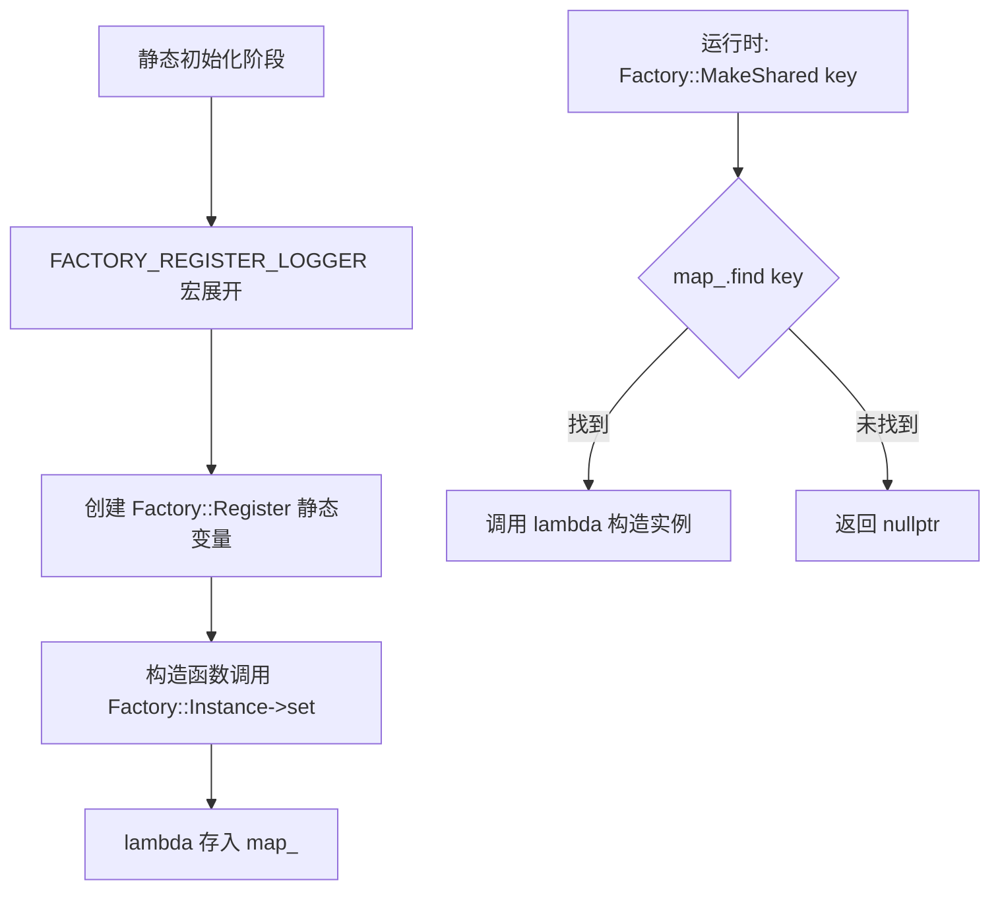
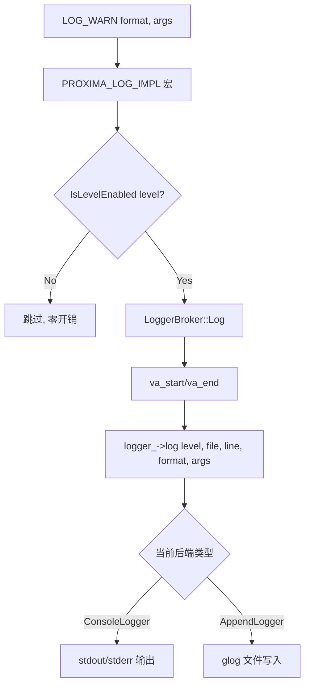
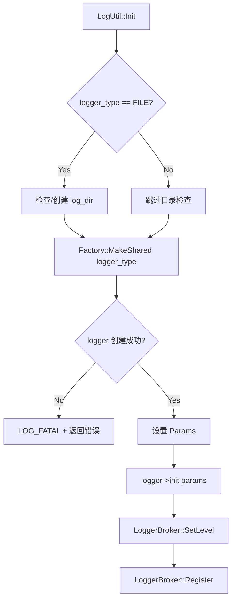

# PD-242.01 zvec — Factory 可插拔日志与 LoggerBroker 单例分发

> 文档编号：PD-242.01
> 来源：zvec `src/include/zvec/ailego/logger/logger.h`, `src/ailego/logger/logger.cc`, `src/db/common/glogger.h`
> GitHub：https://github.com/alibaba/zvec.git
> 问题域：PD-242 日志系统 Pluggable Logging
> 状态：可复用方案

---

## 第 1 章 问题与动机

### 1.1 核心问题

高性能向量数据库引擎需要一套灵活的日志系统，满足以下需求：

1. **多后端切换**：开发阶段用 Console 输出，生产环境切换到文件日志（glog），无需改代码
2. **全局级别控制**：在高并发场景下，日志级别判断必须极低开销（热路径上的 `if` 检查）
3. **跨语言一致性**：C++ 核心引擎与 Python SDK 需要共享同一套日志级别和类型定义
4. **文件轮转与清理**：生产环境日志文件需要按大小轮转、按过期天数自动清理
5. **安全关闭**：进程退出时必须 flush 并关闭日志文件，防止数据丢失

### 1.2 zvec 的解法概述

zvec 通过 ailego 基础库实现了一套三层日志架构：

1. **Logger 抽象接口** — 定义 `init/cleanup/log` 三个纯虚方法，所有后端实现此接口（`logger.h:74-114`）
2. **Factory 模式注册** — 通过 `FACTORY_REGISTER_LOGGER` 宏将 ConsoleLogger/AppendLogger 注册到全局工厂，运行时按字符串名称创建实例（`factory.h:167-169`）
3. **LoggerBroker 静态单例** — 全局唯一的日志分发器，持有当前 Logger 实例和日志级别，所有 `LOG_*` 宏最终调用 `LoggerBroker::Log()`（`logger.h:118-172`）
4. **宏级别短路** — `PROXIMA_LOG_IMPL` 宏在调用 `Log()` 前先检查 `IsLevelEnabled()`，避免不必要的 va_list 构造（`logger.h:32-37`）
5. **Python 枚举映射** — Python 层通过 `LogLevel`/`LogType` IntEnum 暴露配置，`zvec.init()` 将枚举转为字符串传递给 C++ 层（`enum.py:21-62`）

### 1.3 设计思想

| 设计原则 | 具体实现 | 理由 | 替代方案 |
|----------|----------|------|----------|
| 接口隔离 | Logger 纯虚基类仅 3 个方法 | 最小化后端实现负担，ConsoleLogger 仅 30 行 | 继承 spdlog/glog 基类（耦合第三方） |
| 静态分发 | LoggerBroker 全静态方法 + 删除构造函数 | 零实例化开销，全局唯一保证 | Singleton 模板（多一层间接） |
| 编译期注册 | FACTORY_REGISTER_LOGGER 宏在静态初始化期注册 | 新增后端只需一行宏，无需修改注册表 | 手动 if-else 链（违反 OCP） |
| 宏级别短路 | `IsLevelEnabled()` 在宏内先判断 | 热路径上避免 va_list 构造和函数调用 | 函数内判断（多一次函数调用开销） |
| 跨语言枚举对齐 | C++ const int 与 Python IntEnum 值一一对应 | 配置从 Python 传到 C++ 无需转换表 | Protobuf 枚举（引入额外依赖） |

---

## 第 2 章 源码实现分析

### 2.1 架构概览

zvec 日志系统的整体架构分为三层：宏层（调用入口）、Broker 层（分发）、Backend 层（实际输出）。

```
┌─────────────────────────────────────────────────────────┐
│                    调用层 (Macros)                        │
│  LOG_DEBUG / LOG_INFO / LOG_WARN / LOG_ERROR / LOG_FATAL │
│         ↓ PROXIMA_LOG_IMPL 宏展开                        │
│  if (IsLevelEnabled(level)) → LoggerBroker::Log(...)     │
└──────────────────────┬──────────────────────────────────┘
                       │
┌──────────────────────▼──────────────────────────────────┐
│              LoggerBroker (静态单例分发器)                 │
│  ┌─────────────────┐  ┌──────────────────┐              │
│  │ logger_level_   │  │ logger_ (shared)  │              │
│  │ (static int)    │  │ (Logger::Pointer) │              │
│  └─────────────────┘  └────────┬─────────┘              │
│  Register() / Unregister() / SetLevel()                  │
└──────────────────────┬──────────────────────────────────┘
                       │ logger_->log(level, file, line, ...)
          ┌────────────┴────────────┐
          ▼                         ▼
┌─────────────────┐     ┌──────────────────────┐
│  ConsoleLogger  │     │   AppendLogger       │
│  (stdout/stderr)│     │   (glog 文件后端)     │
│  logger.cc:33   │     │   glogger.h:38       │
└─────────────────┘     └──────────────────────┘
          ↑                         ↑
    FACTORY_REGISTER          FACTORY_REGISTER
    (编译期自动注册)           (编译期自动注册)
```

### 2.2 核心实现

#### Factory 模式：编译期自动注册



对应源码 `src/include/zvec/ailego/pattern/factory.h:30-169`：

```cpp
template <typename TBase>
class Factory {
 public:
  template <typename TImpl, typename = typename std::enable_if<
                                std::is_base_of<TBase, TImpl>::value>::type>
  class Register {
   public:
    Register(const char *key) {
      Factory::Instance()->set(key, [] { return Register::Construct(); });
    }
   protected:
    static TImpl *Construct(void) {
      return new (std::nothrow) TImpl();
    }
  };

  static std::shared_ptr<TBase> MakeShared(const char *key) {
    return std::shared_ptr<TBase>(Factory::Make(key));
  }

  static bool Has(const char *key) {
    return Factory::Instance()->has(key);
  }

 protected:
  static Factory *Instance(void) {
    static Factory factory;  // 单例
    return (&factory);
  }

  std::map<const char *, std::function<TBase *()>, KeyComparer> map_;
};

// 注册宏
#define AILEGO_FACTORY_REGISTER(__NAME__, __BASE__, __IMPL__, ...) \
  static ailego::Factory<__BASE__>::Register<__IMPL__>             \
      __ailegoFactoryRegister_##__NAME__(#__NAME__, ##__VA_ARGS__)
```

注册一个新后端只需一行：`FACTORY_REGISTER_LOGGER(ConsoleLogger);`（`logger.cc:73`）

#### LoggerBroker：静态单例分发



对应源码 `src/include/zvec/ailego/logger/logger.h:118-172`：

```cpp
class LoggerBroker {
 public:
  static Logger::Pointer Register(Logger::Pointer logger) {
    Logger::Pointer ret = std::move(logger_);
    logger_ = std::move(logger);
    return ret;  // 返回旧 logger，支持链式替换
  }

  static int Register(Logger::Pointer logger, const ailego::Params &params) {
    if (logger_) {
      logger_->cleanup();  // 先清理旧后端
    }
    logger_ = std::move(logger);
    return logger_->init(params);
  }

  static bool IsLevelEnabled(int level) {
    return logger_level_ <= level && logger_;  // 双条件短路
  }

  __attribute__((format(printf, 4, 5)))
  static void Log(int level, const char *file, int line,
                  const char *format, ...) {
    if (IsLevelEnabled(level)) {
      va_list args;
      va_start(args, format);
      logger_->log(level, file, line, format, args);
      va_end(args);
    }
  }

 private:
  LoggerBroker(void) = delete;  // 禁止实例化
  static int logger_level_;
  static Logger::Pointer logger_;
};
```

默认初始化（`logger.cc:67-70`）：
- `logger_level_` 初始化为 `LEVEL_WARN`（生产安全默认值）
- `logger_` 初始化为 `new ConsoleLogger`（零配置即可用）


### 2.3 实现细节

#### ConsoleLogger：开发环境默认后端

ConsoleLogger（`logger.cc:33-64`）实现极简：
- DEBUG/INFO → `std::cout`（标准输出）
- WARN/ERROR/FATAL → `std::cerr`（标准错误）
- 日志格式：`[LEVEL timestamp thread_id file:line] message`
- 使用 8KB 栈缓冲区（`char buffer[8192]`），避免堆分配
- `std::flush` 保证每条日志立即可见

#### AppendLogger：glog 文件后端

AppendLogger（`glogger.h:38-97`）封装 Google glog：
- `init()` 检查 glog 是否已初始化（`IsGoogleLoggingInitialized()`），防止重复初始化
- 通过 `FLAGS_log_dir`/`FLAGS_max_log_size` 配置文件路径和大小限制
- `FLAGS_stderrthreshold = GLOG_FATAL` 避免 WARN/ERROR 重复输出到 stderr
- `google::EnableLogCleaner(overdue_days)` 启用过期日志自动清理
- `cleanup()` 调用 `DisableLogCleaner()` + `ShutdownGoogleLogging()` 安全关闭
- 日志级别映射：zvec DEBUG/INFO → glog INFO，zvec WARN → glog WARNING，zvec ERROR → glog ERROR

#### LogUtil：高层初始化门面

LogUtil（`logger.h:27-73`，即 `src/db/common/logger.h`）提供一站式初始化：



对应源码 `src/db/common/logger.h:29-68`：

```cpp
class LogUtil {
 public:
  static Status Init(const std::string &log_dir, const std::string &log_file,
                     int log_level, const std::string &logger_type,
                     int log_file_size, int log_overdue_days) {
    if (logger_type == FILE_LOG_TYPE_NAME) {
      if (log_dir.empty() || log_file.empty()) {
        return Status::InvalidArgument("log_dir or log_file is empty");
      }
      if (!ailego::File::IsExist(log_dir)) {
        ailego::File::MakePath(log_dir);
      }
    }
    auto logger =
        ailego::Factory<ailego::Logger>::MakeShared(logger_type.c_str());
    if (!logger) {
      LOG_FATAL("Invalid logger_type[%s]", logger_type.c_str());
      return Status::InvalidArgument("Invalid logger_type: ", logger_type);
    }
    ailego::Params params;
    if (logger_type == FILE_LOG_TYPE_NAME) {
      params.set("proxima.file.logger.log_dir", log_dir);
      params.set("proxima.file.logger.log_file", log_file);
      params.set("proxima.file.logger.file_size", log_file_size);
      params.set("proxima.file.logger.overdue_days", log_overdue_days);
    }
    int ret = logger->init(params);
    if (ret != 0) {
      return Status::InternalError(ErrorCode::What(ret));
    }
    zvec::ailego::LoggerBroker::SetLevel(log_level);
    zvec::ailego::LoggerBroker::Register(logger);
    return Status::OK();
  }
};
```

#### atexit 安全关闭

`GlobalConfig::Initialize()`（`config.cc:109-132`）在初始化日志后注册 `atexit(ExitLogHandler)`，确保进程退出时调用 `LogUtil::Shutdown()` → `LoggerBroker::Unregister()` → logger 析构 → glog `ShutdownGoogleLogging()`。

#### Python 层跨语言配置

Python SDK（`zvec.py:31-143`）通过 `LogLevel`/`LogType` 枚举暴露配置：

```python
# python/zvec/typing/enum.py:21-62
class LogLevel(IntEnum):
    DEBUG = 0
    INFO = 1
    WARN = 2
    WARNING = 2  # Python logging 兼容别名
    ERROR = 3
    FATAL = 4

class LogType(IntEnum):
    CONSOLE = 0
    FILE = 1
```

`zvec.init()` 接受 `log_type: LogType` 和 `log_level: LogLevel` 参数，做类型校验后将枚举名称（字符串）传递给 C++ 层。

---

## 第 3 章 迁移指南

### 3.1 迁移清单

**阶段 1：核心抽象（必须）**
- [ ] 定义 Logger 接口（init/cleanup/log 三方法）
- [ ] 实现 LoggerBroker 静态分发器（Register/Unregister/SetLevel/Log/IsLevelEnabled）
- [ ] 定义 LOG_* 宏，内含级别短路检查
- [ ] 实现 ConsoleLogger 默认后端

**阶段 2：Factory 注册（推荐）**
- [ ] 实现泛型 Factory 模板（或使用已有 DI 框架）
- [ ] 用 FACTORY_REGISTER 宏注册各后端
- [ ] 实现 LogUtil 门面类，封装 Factory 创建 + 初始化流程

**阶段 3：文件后端（按需）**
- [ ] 实现 FileLogger（可封装 spdlog/glog/自研）
- [ ] 支持文件大小轮转 + 过期天数清理
- [ ] 注册 atexit 清理钩子

**阶段 4：跨语言（按需）**
- [ ] Python/Go 层定义对齐的枚举
- [ ] 初始化函数接受枚举参数，转换后传递给 C++ 层

### 3.2 适配代码模板

以下是一个可直接复用的 C++ 可插拔日志系统骨架：

```cpp
#include <cstdarg>
#include <cstdio>
#include <functional>
#include <iostream>
#include <map>
#include <memory>
#include <string>

// ---- Logger 接口 ----
struct Logger {
    using Ptr = std::shared_ptr<Logger>;
    enum Level { DEBUG = 0, INFO, WARN, ERROR, FATAL };

    virtual ~Logger() = default;
    virtual int init(const std::map<std::string, std::string>& params) = 0;
    virtual int cleanup() = 0;
    virtual void log(int level, const char* file, int line,
                     const char* fmt, va_list args) = 0;

    static const char* level_str(int l) {
        static const char* s[] = {"DEBUG", " INFO", " WARN", "ERROR", "FATAL"};
        return (l < 5) ? s[l] : "";
    }
};

// ---- LoggerBroker 静态分发 ----
class LogBroker {
public:
    static void Register(Logger::Ptr p) { logger_ = std::move(p); }
    static void Unregister() { logger_.reset(); }
    static void SetLevel(int l) { level_ = l; }
    static bool Enabled(int l) { return level_ <= l && logger_; }

    __attribute__((format(printf, 4, 5)))
    static void Log(int l, const char* f, int line, const char* fmt, ...) {
        if (!Enabled(l)) return;
        va_list a; va_start(a, fmt); logger_->log(l, f, line, fmt, a); va_end(a);
    }
private:
    LogBroker() = delete;
    inline static int level_ = Logger::WARN;
    inline static Logger::Ptr logger_;
};

// ---- 宏 ----
#define MY_LOG(level, fmt, ...) \
    do { if (LogBroker::Enabled(level)) \
        LogBroker::Log(level, __FILE__, __LINE__, fmt, ##__VA_ARGS__); \
    } while(0)

#define LOG_D(fmt, ...) MY_LOG(Logger::DEBUG, fmt, ##__VA_ARGS__)
#define LOG_I(fmt, ...) MY_LOG(Logger::INFO,  fmt, ##__VA_ARGS__)
#define LOG_W(fmt, ...) MY_LOG(Logger::WARN,  fmt, ##__VA_ARGS__)
#define LOG_E(fmt, ...) MY_LOG(Logger::ERROR, fmt, ##__VA_ARGS__)

// ---- ConsoleLogger 实现 ----
struct ConsoleLogger : Logger {
    int init(const std::map<std::string, std::string>&) override { return 0; }
    int cleanup() override { return 0; }
    void log(int level, const char* file, int line,
             const char* fmt, va_list args) override {
        char buf[4096];
        vsnprintf(buf, sizeof(buf), fmt, args);
        auto& out = (level <= INFO) ? std::cout : std::cerr;
        out << "[" << level_str(level) << " " << file << ":" << line << "] "
            << buf << "\n" << std::flush;
    }
};
```

### 3.3 适用场景

| 场景 | 适用度 | 说明 |
|------|--------|------|
| C++ 高性能引擎/数据库 | ⭐⭐⭐ | 宏级别短路 + 静态分发，热路径零开销 |
| 需要运行时切换日志后端 | ⭐⭐⭐ | Factory 按名称创建，配置驱动切换 |
| 跨语言 SDK（C++ + Python） | ⭐⭐⭐ | 枚举值对齐，Python 层薄封装 |
| 微服务/云原生应用 | ⭐⭐ | 可行但 spdlog/structured logging 更主流 |
| 纯 Python 项目 | ⭐ | 直接用 Python logging 模块更合适 |

---

## 第 4 章 测试用例

基于 zvec 真实测试（`tests/ailego/logger/logger_test.cc`）的模式：

```cpp
#include <gtest/gtest.h>

// 测试 Factory 注册
TEST(PluggableLogger, FactoryRegistration) {
    // ConsoleLogger 应在编译期自动注册
    ASSERT_TRUE(Factory<Logger>::Has("ConsoleLogger"));
    // 未注册的名称返回 false
    ASSERT_FALSE(Factory<Logger>::Has("NonExistLogger"));
}

// 测试级别过滤
TEST(PluggableLogger, LevelFiltering) {
    LogBroker::Register(std::make_shared<ConsoleLogger>());

    // 设置级别为 WARN，DEBUG/INFO 应被过滤
    LogBroker::SetLevel(Logger::WARN);
    ASSERT_FALSE(LogBroker::Enabled(Logger::DEBUG));
    ASSERT_FALSE(LogBroker::Enabled(Logger::INFO));
    ASSERT_TRUE(LogBroker::Enabled(Logger::WARN));
    ASSERT_TRUE(LogBroker::Enabled(Logger::ERROR));

    // 设置级别为 DEBUG，所有级别都应启用
    LogBroker::SetLevel(Logger::DEBUG);
    ASSERT_TRUE(LogBroker::Enabled(Logger::DEBUG));
}

// 测试 Unregister 后日志静默
TEST(PluggableLogger, UnregisterSilence) {
    LogBroker::Register(std::make_shared<ConsoleLogger>());
    LogBroker::SetLevel(Logger::DEBUG);
    ASSERT_TRUE(LogBroker::Enabled(Logger::FATAL));

    LogBroker::Unregister();
    // logger_ 为 nullptr，所有级别都应禁用
    ASSERT_FALSE(LogBroker::Enabled(Logger::FATAL));
}

// 测试多线程并发日志（参考 logger_test.cc:51-59）
TEST(PluggableLogger, ConcurrentLogging) {
    LogBroker::Register(std::make_shared<ConsoleLogger>());
    LogBroker::SetLevel(Logger::DEBUG);

    std::vector<std::thread> threads;
    for (int i = 0; i < 20; ++i) {
        threads.emplace_back([i] {
            LOG_I("Thread %d logging", i);
        });
    }
    for (auto& t : threads) t.join();
    // 不崩溃即通过（ConsoleLogger 的 cout/cerr 是线程安全的）
}

// 测试后端热切换
TEST(PluggableLogger, HotSwap) {
    auto console = std::make_shared<ConsoleLogger>();
    LogBroker::Register(console);

    // 切换到另一个后端
    auto console2 = std::make_shared<ConsoleLogger>();
    LogBroker::Register(console2);

    // 旧后端引用计数应为 1（仅 console 变量持有）
    ASSERT_EQ(console.use_count(), 1);
}
```

Python 层测试（参考 `tests/detail/test_db_config.py:218-307`）：

```python
import pytest
import zvec
from zvec import LogLevel, LogType

class TestLogConfig:
    def test_console_logger_default(self):
        """默认应使用 Console + WARN 级别"""
        zvec.init(log_type=LogType.CONSOLE)

    def test_log_level_enum_validation(self):
        """log_level 必须是 LogLevel 枚举"""
        with pytest.raises(TypeError):
            zvec.init(log_level="WARN")
        with pytest.raises(TypeError):
            zvec.init(log_level=123)

    def test_log_type_enum_validation(self):
        """log_type 必须是 LogType 枚举"""
        with pytest.raises(TypeError):
            zvec.init(log_type="FILE")

    def test_file_logger_creates_dir(self, tmp_path):
        """FILE 模式应自动创建日志目录"""
        log_dir = str(tmp_path / "logs")
        zvec.init(
            log_type=LogType.FILE,
            log_level=LogLevel.DEBUG,
            log_dir=log_dir,
            log_basename="test.log",
        )
        assert (tmp_path / "logs").exists()
```


---

## 第 5 章 跨域关联

| 关联域 | 关系类型 | 说明 |
|--------|----------|------|
| PD-11 可观测性 | 协同 | 日志系统是可观测性三支柱之一，LoggerBroker 的级别控制和文件轮转直接影响运维可观测能力 |
| PD-04 工具系统 | 协同 | Factory 模式是 zvec 的通用工具注册机制，Logger 和 Index 引擎共用同一套 Factory 模板 |
| PD-03 容错与重试 | 依赖 | 容错逻辑中的错误日志依赖 LOG_ERROR/LOG_FATAL 宏，日志系统是容错可见性的基础 |
| PD-06 记忆持久化 | 协同 | AppendLogger 的文件轮转策略（大小 + 过期天数）与持久化存储的生命周期管理思路一致 |
| PD-01 上下文管理 | 弱关联 | 日志级别动态调整可视为运行时上下文的一部分，影响系统行为但不影响业务逻辑 |

---

## 第 6 章 来源文件索引

| 文件 | 行范围 | 关键实现 |
|------|--------|----------|
| `src/include/zvec/ailego/logger/logger.h` | L22-29 | FACTORY_REGISTER_LOGGER 宏定义 |
| `src/include/zvec/ailego/logger/logger.h` | L31-37 | PROXIMA_LOG_IMPL 级别短路宏 |
| `src/include/zvec/ailego/logger/logger.h` | L74-114 | Logger 纯虚基类（init/cleanup/log） |
| `src/include/zvec/ailego/logger/logger.h` | L118-172 | LoggerBroker 静态单例分发器 |
| `src/ailego/logger/logger.cc` | L33-64 | ConsoleLogger 实现（stdout/stderr 分流） |
| `src/ailego/logger/logger.cc` | L67-73 | 默认级别 WARN + 默认 ConsoleLogger 初始化 |
| `src/include/zvec/ailego/pattern/factory.h` | L30-169 | 泛型 Factory 模板 + 编译期注册宏 |
| `src/db/common/glogger.h` | L38-97 | AppendLogger（glog 文件后端封装） |
| `src/db/common/logger.h` | L27-73 | LogUtil 门面类（Factory 创建 + 初始化） |
| `src/include/zvec/db/config.h` | L24-82 | 日志配置常量 + LogConfig/FileLogConfig 结构体 |
| `src/db/common/config.cc` | L29-31 | atexit(ExitLogHandler) 注册 |
| `src/db/common/config.cc` | L109-132 | GlobalConfig::Initialize 日志初始化流程 |
| `python/zvec/typing/enum.py` | L21-62 | Python LogLevel/LogType 枚举定义 |
| `python/zvec/zvec.py` | L31-143 | Python init() 日志参数校验与传递 |
| `tests/ailego/logger/logger_test.cc` | L1-67 | 日志系统单元测试（级别过滤 + 多线程） |

---

## 第 7 章 横向对比维度

```json comparison_data
{
  "project": "zvec",
  "dimensions": {
    "后端注册": "Factory 模板 + 编译期宏注册，运行时按字符串名称创建",
    "分发机制": "LoggerBroker 全静态方法，删除构造函数，零实例化",
    "级别控制": "宏内 IsLevelEnabled 短路，热路径避免 va_list 构造",
    "文件轮转": "glog 封装，FLAGS_max_log_size 大小轮转 + EnableLogCleaner 过期清理",
    "跨语言支持": "Python IntEnum 与 C++ const int 值对齐，init() 枚举校验后传字符串",
    "安全关闭": "atexit 注册 ExitLogHandler → Unregister → glog ShutdownGoogleLogging"
  }
}
```

### 域元数据补充

```json domain_metadata
{
  "solution_summary": "zvec 通过 ailego::Factory 模板编译期注册 ConsoleLogger/AppendLogger，LoggerBroker 全静态分发器实现宏级别短路和运行时后端热切换",
  "description": "C++ 高性能场景下宏级别短路与编译期 Factory 注册的日志架构",
  "sub_problems": [
    "glog 封装与级别映射差异处理",
    "多线程环境下日志输出的线程安全保证"
  ],
  "best_practices": [
    "宏内先检查 IsLevelEnabled 再构造 va_list，热路径零开销",
    "Factory 编译期注册新后端只需一行宏，符合开闭原则",
    "默认 ConsoleLogger + WARN 级别，零配置即可用"
  ]
}
```
