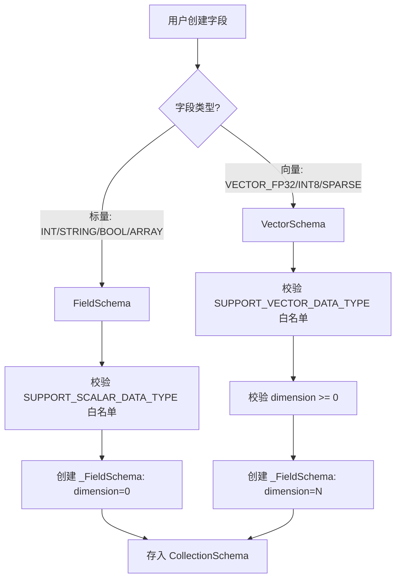
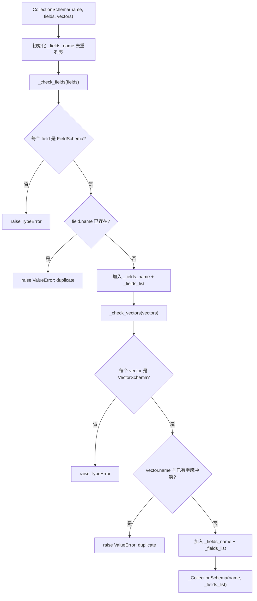
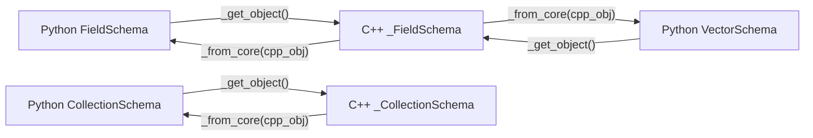

# PD-243.01 zvec — Schema 驱动双层数据模型与运行时 DDL

> 文档编号：PD-243.01
> 来源：zvec `python/zvec/model/schema/collection_schema.py`, `python/zvec/model/schema/field_schema.py`, `src/include/zvec/db/schema.h`
> GitHub：https://github.com/alibaba/zvec.git
> 问题域：PD-243 Schema 驱动数据模型 Schema-Driven Data Model
> 状态：可复用方案

---

## 第 1 章 问题与动机

### 1.1 核心问题

向量数据库需要同时管理两种本质不同的数据列：标量字段（ID、标签、时间戳等结构化数据）和向量字段（高维嵌入、稀疏向量等用于相似性搜索的数据）。这两类字段在存储布局、索引策略、序列化方式上完全不同，但又必须在同一个 Collection 中协同工作。

如果没有统一的 Schema 层来约束和驱动，会出现以下问题：
- 标量字段和向量字段的类型校验分散在各处，容易遗漏
- 运行时修改表结构（加列、删列、改列）缺乏原子性保障
- Python 层与 C++ 高性能层之间的数据模型不一致，导致序列化/反序列化 bug
- 索引参数与字段类型的匹配关系没有强制约束

### 1.2 zvec 的解法概述

zvec 采用 **CollectionSchema 作为单一事实来源（Single Source of Truth）** 的设计，核心要点：

1. **双类型字段体系**：Python 层严格区分 `FieldSchema`（标量列）和 `VectorSchema`（向量列），各自有独立的类型白名单和索引参数类型（`field_schema.py:34-60`）
2. **C++ 统一底层**：两种 Python Schema 在 C++ 层统一为同一个 `FieldSchema` 类，通过 `dimension` 和 `data_type` 区分标量/向量（`schema.h:30-275`）
3. **双向映射协议**：`_from_core()` 和 `_get_object()` 构成 Python↔C++ 的双向桥接，确保两层数据模型始终同步（`field_schema.py:116-125`）
4. **运行时 DDL**：支持 `add_column`/`drop_column`/`alter_column` 三种 DDL 操作，每次操作后自动刷新 Schema 快照（`collection.py:156-230`）
5. **构造时全量校验**：CollectionSchema 构造时检查字段名唯一性（跨标量和向量），类型合法性，索引参数匹配性（`collection_schema.py:70-149`）

### 1.3 设计思想

| 设计原则 | 具体实现 | 理由 | 替代方案 |
|----------|----------|------|----------|
| 类型安全分离 | Python 层 FieldSchema/VectorSchema 双类各自校验白名单 | 防止用户将向量类型传给标量字段 | 单一 Schema 类 + 运行时 if/else 判断 |
| C++ 统一存储 | 底层只有一个 FieldSchema，通过 dimension>0 判断向量 | 减少 C++ 层复杂度，统一序列化路径 | C++ 也拆两个类 |
| 双向映射协议 | `_from_core(cpp_obj)` + `_get_object() -> cpp_obj` | 保证 Python 包装器与 C++ 核心始终一致 | 纯 Python 实现（性能差） |
| 构造时校验 | CollectionSchema.__init__ 中全量检查名称唯一性和类型 | Fail-fast，避免运行时才发现 Schema 冲突 | 延迟校验（插入时才检查） |
| DDL 后自动刷新 | 每次 DDL 操作后 `self._schema = CollectionSchema._from_core(self._obj.Schema())` | 保证 Python 层 Schema 快照与 C++ 层一致 | 手动刷新（容易遗忘） |

---

## 第 2 章 源码实现分析

### 2.1 架构概览

zvec 的 Schema 驱动数据模型采用三层架构：

```
┌─────────────────────────────────────────────────────────────┐
│                    Python 用户 API 层                        │
│  CollectionSchema(name, fields=[FieldSchema], vectors=[VectorSchema])  │
│       ↓ _get_object()          ↑ _from_core()               │
├─────────────────────────────────────────────────────────────┤
│                  pybind11 绑定层                             │
│  _CollectionSchema ←→ CollectionSchema (C++)                │
│  _FieldSchema      ←→ FieldSchema (C++)                     │
├─────────────────────────────────────────────────────────────┤
│                    C++ 核心存储层                             │
│  FieldSchema { name_, data_type_, dimension_, nullable_,    │
│                index_params_ }                               │
│  CollectionSchema { name_, fields_[], fields_map_{} }       │
│       ↓                                                      │
│  Collection::AddColumn / DropColumn / AlterColumn (DDL)     │
└─────────────────────────────────────────────────────────────┘
```

### 2.2 核心实现

#### 2.2.1 双类型字段体系 — FieldSchema vs VectorSchema



对应源码 `python/zvec/model/schema/field_schema.py:34-60`（类型白名单定义）：

```python
SUPPORT_VECTOR_DATA_TYPE = [
    DataType.VECTOR_FP16,
    DataType.VECTOR_FP32,
    DataType.VECTOR_FP64,
    DataType.VECTOR_INT8,
    DataType.SPARSE_VECTOR_FP16,
    DataType.SPARSE_VECTOR_FP32,
]

SUPPORT_SCALAR_DATA_TYPE = [
    DataType.INT32,
    DataType.INT64,
    DataType.UINT32,
    DataType.UINT64,
    DataType.FLOAT,
    DataType.DOUBLE,
    DataType.STRING,
    DataType.BOOL,
    DataType.ARRAY_INT32,
    # ... 共 16 种标量类型
]
```

对应源码 `python/zvec/model/schema/field_schema.py:89-114`（FieldSchema 构造器）：

```python
class FieldSchema:
    def __init__(
        self,
        name: str,
        data_type: DataType,
        nullable: bool = False,
        index_param: Optional[InvertIndexParam] = None,
    ):
        if data_type not in SUPPORT_SCALAR_DATA_TYPE:
            raise ValueError(
                f"schema validate failed: scalar_field's data_type must be one of "
                f"{', '.join(str(dt) for dt in SUPPORT_SCALAR_DATA_TYPE)}, "
                f"but field[{name}]'s data_type is {data_type}"
            )
        self._cpp_obj = _FieldSchema(
            name=name, data_type=data_type, dimension=0,
            nullable=nullable, index_param=index_param,
        )
```

#### 2.2.2 CollectionSchema 构造时全量校验



对应源码 `python/zvec/model/schema/collection_schema.py:59-81`：

```python
class CollectionSchema:
    def __init__(
        self,
        name: str,
        fields: Optional[Union[FieldSchema, list[FieldSchema]]] = None,
        vectors: Optional[Union[VectorSchema, list[VectorSchema]]] = None,
    ):
        _fields_name: list[str] = []
        _fields_list: list[_FieldSchema] = []
        self._check_fields(fields, _fields_name, _fields_list)
        self._check_vectors(vectors, _fields_name, _fields_list)
        self._cpp_obj = _CollectionSchema(name=name, fields=_fields_list)
```

关键设计：`_fields_name` 列表在 `_check_fields` 和 `_check_vectors` 之间共享，确保标量字段名和向量字段名不会冲突（`collection_schema.py:143-147`）。

#### 2.2.3 双向映射协议 _from_core / _get_object



对应源码 `python/zvec/model/schema/field_schema.py:116-125`：

```python
@classmethod
def _from_core(cls, core_field_schema: _FieldSchema):
    if core_field_schema is None:
        raise ValueError("schema validate failed: field schema is None")
    inst = cls.__new__(cls)       # 跳过 __init__ 校验
    inst._cpp_obj = core_field_schema  # 直接绑定 C++ 对象
    return inst

def _get_object(self) -> _FieldSchema:
    return self._cpp_obj
```

`_from_core` 使用 `cls.__new__(cls)` 跳过 `__init__` 的校验逻辑——因为从 C++ 层返回的对象已经通过了 C++ 层的校验，无需重复验证。这是跨语言绑定中的常见优化模式。

### 2.3 实现细节

#### C++ 层统一 FieldSchema

C++ 层不区分标量和向量，统一用一个 `FieldSchema` 类（`schema.h:30-275`）：

```cpp
class FieldSchema {
 private:
  std::string name_;
  DataType data_type_{DataType::UNDEFINED};
  bool nullable_{false};
  uint32_t dimension_{0U};          // 向量维度，标量为 0
  IndexParams::Ptr index_params_;   // 多态索引参数
};
```

通过静态方法判断字段类型（`schema.h:187-198`）：

```cpp
static bool is_dense_vector_field(DataType type) {
    return type >= DataType::VECTOR_BINARY32 && type <= DataType::VECTOR_INT16;
}
static bool is_sparse_vector_field(DataType type) {
    return type >= DataType::SPARSE_VECTOR_FP16 &&
           type <= DataType::SPARSE_VECTOR_FP32;
}
```

#### CollectionSchema 的双索引结构

C++ 层 CollectionSchema 同时维护有序列表和哈希映射（`schema.h:389-392`）：

```cpp
FieldSchemaPtrList fields_{};      // 保持插入顺序
FieldSchemaPtrMap fields_map_{};   // O(1) 按名查找
```

#### 运行时 DDL 与 Schema 自动刷新

每次 DDL 操作后，Python 层自动从 C++ 层重新获取 Schema 快照（`collection.py:173-174`）：

```python
def add_column(self, field_schema, expression="", option=AddColumnOption()):
    self._obj.AddColumn(field_schema._get_object(), expression, option)
    self._schema = CollectionSchema._from_core(self._obj.Schema())  # 自动刷新
```

`alter_column` 支持两种原子操作：仅重命名、仅修改 Schema，且限制只能操作标量数值列（`collection.py:209-211`）。

#### pybind11 绑定层的 Pickle 支持

Schema 对象支持 Python pickle 序列化（`python_schema.cc:58-83`），使得 Schema 可以跨进程传递：

```cpp
.def(py::pickle(
    [](const FieldSchema &self) {
      return py::make_tuple(self.name(), self.data_type(),
                            self.dimension(), self.nullable(),
                            self.index_params() ? py::cast(self.index_params())
                                                : py::none());
    },
    [](py::tuple t) { /* 反序列化 */ }));
```

---

## 第 3 章 迁移指南

### 3.1 迁移清单

**阶段 1：定义类型系统**
- [ ] 定义 DataType 枚举，明确区分标量类型和向量类型
- [ ] 为标量和向量分别定义类型白名单
- [ ] 定义索引参数基类和各索引类型子类（HNSW、IVF、Flat、Invert）

**阶段 2：实现双类型 Schema**
- [ ] 实现 FieldSchema 类（标量字段，dimension=0）
- [ ] 实现 VectorSchema 类（向量字段，dimension>0）
- [ ] 两者共享底层存储结构，Python 层分离校验逻辑
- [ ] 实现 `_from_core()` / `_get_object()` 双向映射协议

**阶段 3：实现 CollectionSchema**
- [ ] 构造时全量校验：字段名唯一性（跨标量+向量）、类型合法性
- [ ] 提供 `field(name)` / `vector(name)` 按名查找
- [ ] 提供 `fields` / `vectors` 属性分类返回

**阶段 4：实现运行时 DDL**
- [ ] `add_column(schema, expression)` — 支持表达式填充已有行
- [ ] `drop_column(name)` — 删除列
- [ ] `alter_column(old_name, new_name, new_schema)` — 重命名或修改类型
- [ ] 每次 DDL 后自动刷新 Schema 快照

### 3.2 适配代码模板

以下是一个可直接复用的 Schema 驱动数据模型骨架：

```python
from __future__ import annotations
from enum import IntEnum
from typing import Optional, Union
from dataclasses import dataclass, field


class DataType(IntEnum):
    """统一类型枚举，标量和向量共用"""
    # 标量类型
    INT32 = 4
    INT64 = 5
    FLOAT = 8
    DOUBLE = 9
    STRING = 2
    BOOL = 3
    # 向量类型
    VECTOR_FP32 = 23
    VECTOR_INT8 = 26
    SPARSE_VECTOR_FP32 = 31


SCALAR_TYPES = {DataType.INT32, DataType.INT64, DataType.FLOAT,
                DataType.DOUBLE, DataType.STRING, DataType.BOOL}
VECTOR_TYPES = {DataType.VECTOR_FP32, DataType.VECTOR_INT8,
                DataType.SPARSE_VECTOR_FP32}


@dataclass(frozen=True)
class IndexParam:
    """索引参数基类"""
    pass


@dataclass(frozen=True)
class HnswParam(IndexParam):
    m: int = 50
    ef_construction: int = 500


@dataclass(frozen=True)
class FlatParam(IndexParam):
    pass


@dataclass(frozen=True)
class FieldSchema:
    """标量字段 Schema"""
    name: str
    data_type: DataType
    nullable: bool = False
    index_param: Optional[IndexParam] = None

    def __post_init__(self):
        if self.data_type not in SCALAR_TYPES:
            raise ValueError(f"FieldSchema requires scalar type, got {self.data_type}")


@dataclass(frozen=True)
class VectorSchema:
    """向量字段 Schema"""
    name: str
    data_type: DataType
    dimension: int = 0
    index_param: IndexParam = field(default_factory=FlatParam)

    def __post_init__(self):
        if self.data_type not in VECTOR_TYPES:
            raise ValueError(f"VectorSchema requires vector type, got {self.data_type}")
        if self.dimension < 0:
            raise ValueError("dimension must be >= 0")


class CollectionSchema:
    """Collection Schema — 单一事实来源"""

    def __init__(
        self,
        name: str,
        fields: Optional[Union[FieldSchema, list[FieldSchema]]] = None,
        vectors: Optional[Union[VectorSchema, list[VectorSchema]]] = None,
    ):
        self.name = name
        self._fields: dict[str, FieldSchema] = {}
        self._vectors: dict[str, VectorSchema] = {}
        self._all_names: set[str] = set()

        for f in (fields if isinstance(fields, list) else [fields] if fields else []):
            self._add_field(f)
        for v in (vectors if isinstance(vectors, list) else [vectors] if vectors else []):
            self._add_vector(v)

    def _add_field(self, f: FieldSchema):
        if f.name in self._all_names:
            raise ValueError(f"Duplicate field name: {f.name}")
        self._all_names.add(f.name)
        self._fields[f.name] = f

    def _add_vector(self, v: VectorSchema):
        if v.name in self._all_names:
            raise ValueError(f"Duplicate field name: {v.name}")
        self._all_names.add(v.name)
        self._vectors[v.name] = v

    def field(self, name: str) -> Optional[FieldSchema]:
        return self._fields.get(name)

    def vector(self, name: str) -> Optional[VectorSchema]:
        return self._vectors.get(name)

    @property
    def fields(self) -> list[FieldSchema]:
        return list(self._fields.values())

    @property
    def vectors(self) -> list[VectorSchema]:
        return list(self._vectors.values())


# --- 运行时 DDL Mixin ---
class DDLMixin:
    """为 Collection 提供运行时 Schema 变更能力"""

    def add_column(self, field_schema: FieldSchema, expression: str = ""):
        # 1. 执行底层 DDL
        self._engine.add_column(field_schema, expression)
        # 2. 自动刷新 Schema 快照
        self._schema = self._engine.get_schema()

    def drop_column(self, field_name: str):
        self._engine.drop_column(field_name)
        self._schema = self._engine.get_schema()

    def alter_column(self, old_name: str, new_name: str = None,
                     new_schema: FieldSchema = None):
        self._engine.alter_column(old_name, new_name or "", new_schema)
        self._schema = self._engine.get_schema()
```

### 3.3 适用场景

| 场景 | 适用度 | 说明 |
|------|--------|------|
| 向量数据库 Schema 管理 | ⭐⭐⭐ | 完美匹配：标量+向量双类型字段 |
| 多模态数据存储 | ⭐⭐⭐ | 不同模态数据可映射为不同类型的向量列 |
| Python/C++ 混合系统 | ⭐⭐⭐ | _from_core/_get_object 双向映射模式可直接复用 |
| 纯 Python ORM | ⭐⭐ | 可借鉴构造时校验和类型白名单，但不需要跨语言映射 |
| 运行时表结构变更 | ⭐⭐⭐ | DDL + 自动刷新模式适用于任何需要在线 Schema 演进的系统 |
| 静态 Schema 系统 | ⭐ | 如果 Schema 不变，过度设计 |

---

## 第 4 章 测试用例

基于 zvec 真实测试（`python/tests/test_schema.py`）改编的可运行测试：

```python
import pytest
from dataclasses import FrozenInstanceError


class TestFieldSchema:
    """标量字段 Schema 测试"""

    def test_default_creation(self):
        field = FieldSchema("age", DataType.INT32)
        assert field.name == "age"
        assert field.data_type == DataType.INT32
        assert field.nullable is False
        assert field.index_param is None

    def test_with_index_param(self):
        field = FieldSchema("price", DataType.FLOAT, nullable=True)
        assert field.nullable is True

    def test_reject_vector_type(self):
        with pytest.raises(ValueError, match="scalar type"):
            FieldSchema("bad", DataType.VECTOR_FP32)

    def test_immutability(self):
        field = FieldSchema("id", DataType.INT64)
        with pytest.raises(FrozenInstanceError):
            field.name = "new_name"


class TestVectorSchema:
    """向量字段 Schema 测试"""

    def test_default_with_flat_index(self):
        vec = VectorSchema("emb", DataType.VECTOR_FP32, dimension=128)
        assert vec.dimension == 128
        assert isinstance(vec.index_param, FlatParam)

    def test_custom_hnsw_index(self):
        vec = VectorSchema(
            "emb", DataType.VECTOR_INT8, dimension=512,
            index_param=HnswParam(m=16, ef_construction=200)
        )
        assert vec.index_param.m == 16

    def test_reject_scalar_type(self):
        with pytest.raises(ValueError, match="vector type"):
            VectorSchema("bad", DataType.STRING, dimension=128)

    def test_negative_dimension(self):
        with pytest.raises(ValueError, match="dimension"):
            VectorSchema("bad", DataType.VECTOR_FP32, dimension=-1)


class TestCollectionSchema:
    """CollectionSchema 构造校验测试"""

    def test_single_field_and_vector(self):
        schema = CollectionSchema(
            name="test",
            fields=FieldSchema("id", DataType.INT64),
            vectors=VectorSchema("emb", DataType.VECTOR_FP32, dimension=128),
        )
        assert schema.name == "test"
        assert len(schema.fields) == 1
        assert len(schema.vectors) == 1
        assert schema.field("id").data_type == DataType.INT64
        assert schema.vector("emb").dimension == 128

    def test_multi_fields(self):
        schema = CollectionSchema(
            name="multi",
            fields=[
                FieldSchema("id", DataType.INT64),
                FieldSchema("name", DataType.STRING),
            ],
            vectors=[
                VectorSchema("dense", DataType.VECTOR_FP32, dimension=128),
                VectorSchema("sparse", DataType.SPARSE_VECTOR_FP32),
            ],
        )
        assert len(schema.fields) == 2
        assert len(schema.vectors) == 2

    def test_duplicate_name_rejected(self):
        with pytest.raises(ValueError, match="Duplicate"):
            CollectionSchema(
                name="dup",
                fields=FieldSchema("emb", DataType.INT64),
                vectors=VectorSchema("emb", DataType.VECTOR_FP32, dimension=128),
            )

    def test_cross_type_duplicate_rejected(self):
        """标量字段名和向量字段名不能冲突"""
        with pytest.raises(ValueError, match="Duplicate"):
            CollectionSchema(
                name="cross",
                fields=[FieldSchema("x", DataType.INT32)],
                vectors=[VectorSchema("x", DataType.VECTOR_FP32, dimension=64)],
            )
```

---

## 第 5 章 跨域关联

| 关联域 | 关系类型 | 说明 |
|--------|----------|------|
| PD-04 工具系统 | 协同 | Schema 定义了数据模型，工具系统（如 SQL 过滤引擎）依赖 Schema 进行类型推断和查询优化 |
| PD-06 记忆持久化 | 协同 | Schema 驱动的 Collection 是向量记忆的持久化载体，Schema 变更（DDL）影响记忆存储结构 |
| PD-08 搜索与检索 | 依赖 | 向量检索依赖 VectorSchema 中定义的索引参数（HNSW/IVF/Flat）和度量类型（L2/IP/COSINE） |
| PD-01 上下文管理 | 协同 | Schema 中的 dimension 字段约束了向量维度，间接影响上下文窗口中嵌入的大小 |
| PD-03 容错与重试 | 协同 | DDL 操作（alter_column）可能触发数据迁移，需要容错机制保障原子性 |

---

## 第 6 章 来源文件索引

| 文件 | 行范围 | 关键实现 |
|------|--------|----------|
| `python/zvec/model/schema/field_schema.py` | L34-L60 | 标量/向量类型白名单定义 |
| `python/zvec/model/schema/field_schema.py` | L63-L178 | FieldSchema 类：构造校验、_from_core、_get_object |
| `python/zvec/model/schema/field_schema.py` | L180-L301 | VectorSchema 类：维度校验、默认 FlatIndex |
| `python/zvec/model/schema/collection_schema.py` | L28-L216 | CollectionSchema：全量校验、字段查找、_from_core |
| `python/zvec/model/schema/collection_schema.py` | L83-L149 | _check_fields/_check_vectors 校验逻辑 |
| `python/zvec/model/doc.py` | L26-L174 | Doc 类：fields/vectors 双字典、numpy 自动转换 |
| `python/zvec/model/collection.py` | L156-L230 | 运行时 DDL：add_column/drop_column/alter_column |
| `src/include/zvec/db/schema.h` | L30-L275 | C++ FieldSchema：统一存储、类型判断静态方法 |
| `src/include/zvec/db/schema.h` | L283-L395 | C++ CollectionSchema：双索引结构（list+map） |
| `src/include/zvec/db/collection.h` | L77-L87 | C++ Collection DDL 虚接口 |
| `src/binding/python/model/schema/python_schema.cc` | L31-L84 | pybind11 FieldSchema 绑定 + pickle 支持 |
| `src/binding/python/model/schema/python_schema.cc` | L86-L138 | pybind11 CollectionSchema 绑定 |
| `src/include/zvec/db/index_params.h` | L27-L315 | 索引参数多态体系：Invert/HNSW/IVF/Flat |
| `python/tests/test_schema.py` | L34-L233 | Schema 单元测试：字段创建、只读性、集合校验 |

---

## 第 7 章 横向对比维度

```json comparison_data
{
  "project": "zvec",
  "dimensions": {
    "Schema 定义方式": "Python 双类 FieldSchema/VectorSchema + C++ 统一 FieldSchema",
    "类型系统": "22 种 DataType 枚举，标量 16 种 + 向量 6 种，编译时白名单校验",
    "索引参数模型": "多态 IndexParams 基类，4 种子类（HNSW/IVF/Flat/Invert）",
    "跨语言映射": "pybind11 双向协议 _from_core/_get_object + pickle 序列化",
    "DDL 能力": "add/drop/alter column，表达式填充 + 自动 Schema 刷新",
    "校验策略": "构造时全量校验：名称唯一性（跨标量向量）+ 类型白名单"
  }
}
```

### 域元数据补充

```json domain_metadata
{
  "solution_summary": "zvec 以 Python 双类 FieldSchema/VectorSchema 分离校验 + C++ 统一 FieldSchema 存储，通过 pybind11 _from_core/_get_object 双向映射，支持 add/drop/alter column 运行时 DDL 与自动 Schema 刷新",
  "description": "跨语言绑定场景下 Schema 双向映射与运行时 DDL 的工程实践",
  "sub_problems": [
    "Schema 对象的跨进程序列化（pickle/protobuf）",
    "DDL 操作的并发控制与原子性保障",
    "索引参数与字段类型的多态匹配约束"
  ],
  "best_practices": [
    "_from_core 跳过 __init__ 校验避免跨语言重复验证",
    "DDL 操作后自动刷新 Schema 快照保证两层一致性",
    "C++ 层用 list+map 双索引兼顾有序遍历和 O(1) 查找"
  ]
}
```
