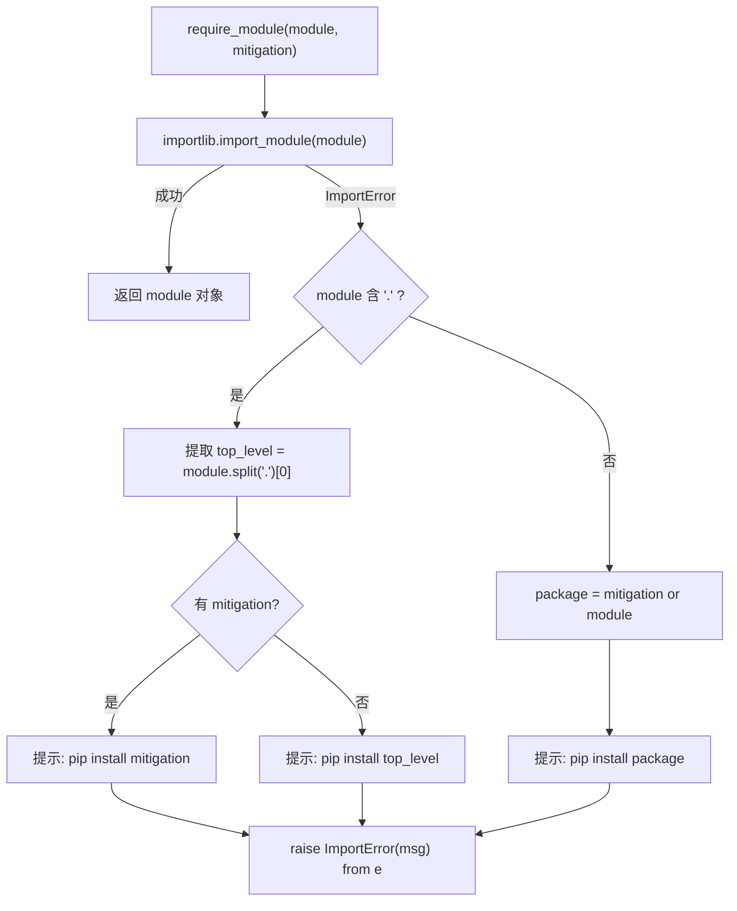
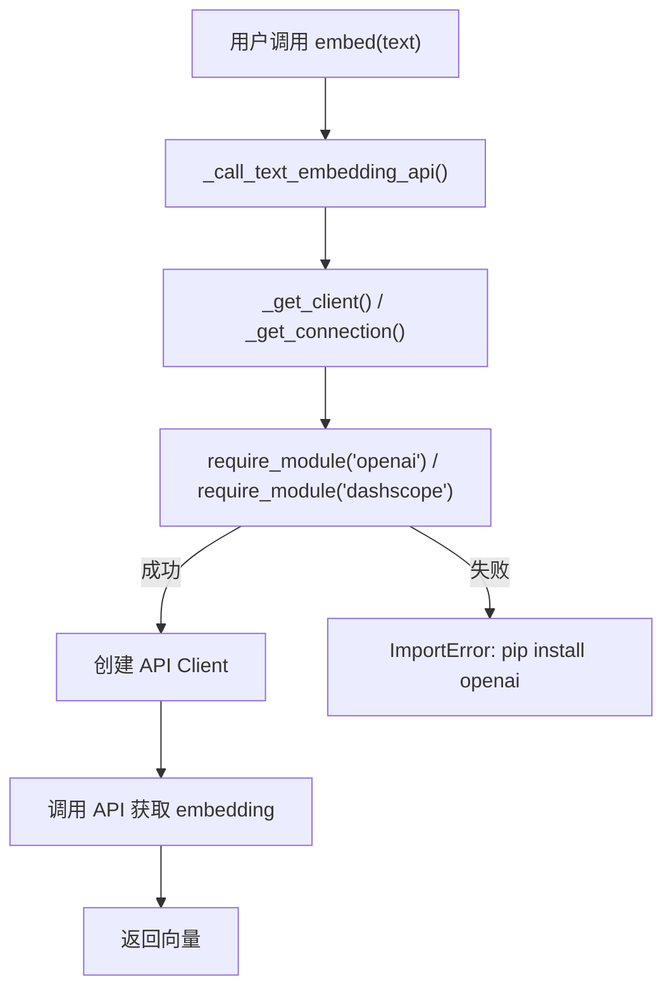

# PD-244.01 zvec — require_module 统一懒加载与可选依赖按需导入

> 文档编号：PD-244.01
> 来源：zvec `python/zvec/tool/util.py`
> GitHub：https://github.com/alibaba/zvec.git
> 问题域：PD-244 懒加载依赖管理 Lazy Dependency Loading
> 状态：可复用方案

---

## 第 1 章 问题与动机（≥ 30 行）

### 1.1 核心问题

向量数据库 SDK 需要支持多种 Embedding 后端（OpenAI、DashScope/Qwen、Jina、SentenceTransformers、DashText BM25），但用户通常只使用其中一两种。如果将所有后端的依赖都写入 `dependencies`，会导致：

1. **安装体积膨胀** — `sentence_transformers` 拉取 PyTorch 全家桶（>2GB），`dashtext` 需要特定 Python 版本，`openai` 和 `dashscope` 各有自己的依赖树
2. **环境冲突** — 不同后端的依赖可能互相冲突（如 numpy 版本要求不同）
3. **安装失败** — 某些包在特定平台不可用（dashtext 仅支持 Python 3.10-3.12），导致整个 SDK 无法安装
4. **用户困惑** — 用户只想用 OpenAI Embedding，却被要求安装一堆不相关的包

核心矛盾：**SDK 需要支持多后端，但不能强制用户安装所有后端的依赖。**

### 1.2 zvec 的解法概述

zvec 采用"核心最小化 + 按需懒加载"策略：

1. **`pyproject.toml` 仅声明 `numpy` 为唯一核心依赖** — 安装 `pip install zvec` 只拉取 numpy（`pyproject.toml:37-39`）
2. **`require_module()` 统一懒加载入口** — 所有可选依赖通过同一个工具函数延迟导入（`python/zvec/tool/util.py:20-63`）
3. **在方法级别而非模块级别导入** — 每个 Extension 的 `_get_client()` / `_get_model()` / `__init__()` 内部才调用 `require_module()`，而非文件顶部 import
4. **精确的 pip install 提示** — 导入失败时自动推断包名，给出可直接复制的安装命令
5. **`mitigation` 参数处理包名≠模块名** — 如 `require_module("pyarrow.parquet", mitigation="pyarrow")`，解决模块名与 pip 包名不一致的问题

### 1.3 设计思想

| 设计原则 | 具体实现 | 理由 | 替代方案 |
|----------|----------|------|----------|
| 核心依赖最小化 | `dependencies = ["numpy >=1.23"]` 仅一个核心依赖 | 向量计算必须用 numpy，其他都是可选的 | extras_require 分组（用户需记住组名） |
| 统一懒加载入口 | `require_module()` 单函数封装 `importlib.import_module` | 所有 Extension 用同一套错误处理逻辑 | 每个 Extension 自己 try/except（重复代码） |
| 方法级延迟导入 | `_get_client()` 内部调用 `require_module("openai")` | 只在真正使用时才触发导入 | 模块级 import（导入即报错） |
| 精确错误提示 | 自动从模块名推断 pip 包名 + mitigation 覆盖 | 用户可直接复制命令安装 | 泛泛的 "please install dependencies" |
| 异常链保留 | `raise ImportError(msg) from e` | 保留原始异常栈便于调试 | 吞掉原始异常 |

---

## 第 2 章 源码实现分析（≥ 60 行，核心章节）

### 2.1 架构概览

zvec 的懒加载架构分三层：工具层（require_module）、Extension 基类层（4 个 FunctionBase）、具体实现层（10+ 个 Embedding/ReRanker 类）。

```
┌─────────────────────────────────────────────────────────────┐
│                    用户代码                                   │
│  bm25 = BM25EmbeddingFunction(language="zh")                │
│  vec = bm25.embed("查询文本")                                │
└──────────────────────┬──────────────────────────────────────┘
                       │ 调用 embed()
┌──────────────────────▼──────────────────────────────────────┐
│              Extension 具体实现层                              │
│  BM25EmbeddingFunction / OpenAIDenseEmbedding / ...         │
│  __init__() 或 _get_client() 中调用 require_module()         │
└──────────────────────┬──────────────────────────────────────┘
                       │ require_module("dashtext") / ("openai") / ...
┌──────────────────────▼──────────────────────────────────────┐
│              Extension 基类层                                 │
│  OpenAIFunctionBase / QwenFunctionBase /                     │
│  SentenceTransformerFunctionBase / JinaFunctionBase          │
│  封装 API 连接 + 响应解析                                     │
└──────────────────────┬──────────────────────────────────────┘
                       │ importlib.import_module(module)
┌──────────────────────▼──────────────────────────────────────┐
│              工具层 require_module()                          │
│  python/zvec/tool/util.py                                   │
│  统一懒加载 + 错误提示 + 异常链                                │
└─────────────────────────────────────────────────────────────┘
```

### 2.2 核心实现

#### 2.2.1 require_module — 懒加载核心函数



对应源码 `python/zvec/tool/util.py:20-63`：

```python
def require_module(module: str, mitigation: Optional[str] = None) -> Any:
    """Import a Python module and raise a user-friendly error if it is not available."""
    try:
        return importlib.import_module(module)
    except ImportError as e:
        package = mitigation or module
        msg = f"Required package '{package}' is not installed. "
        if "." in module:
            top_level = module.split(".", maxsplit=1)[0]
            msg += f"Module '{module}' is part of '{top_level}', "
            if mitigation:
                msg += f"please pip install '{mitigation}'."
            else:
                msg += f"please pip install '{top_level}'."
        else:
            msg += f"Please pip install '{package}'."
        raise ImportError(msg) from e
```

关键设计点：
- **`mitigation` 参数**（`util.py:20`）：解决 pip 包名与 Python 模块名不一致的问题（如 `pyarrow.parquet` → `pip install pyarrow`）
- **子模块自动推断**（`util.py:54-60`）：`"os.nonexistent_submodule"` 自动提取 `"os"` 作为安装提示
- **异常链 `from e`**（`util.py:63`）：保留原始 ImportError 的完整栈信息

#### 2.2.2 Extension 基类中的懒加载模式



**OpenAI 后端** — 在 `_get_client()` 中懒加载（`python/zvec/extension/openai_function.py:81-94`）：

```python
class OpenAIFunctionBase:
    def _get_client(self):
        """Get OpenAI client instance."""
        openai = require_module("openai")  # 懒加载：仅在调用时导入
        if self._base_url:
            return openai.OpenAI(api_key=self._api_key, base_url=self._base_url)
        return openai.OpenAI(api_key=self._api_key)
```

**DashScope/Qwen 后端** — 在 `_get_connection()` 中懒加载（`python/zvec/extension/qwen_function.py:73-84`）：

```python
class QwenFunctionBase:
    def _get_connection(self):
        """Establish connection to DashScope API."""
        dashscope = require_module("dashscope")  # 懒加载
        dashscope.api_key = self._api_key
        return dashscope
```

**SentenceTransformers 后端** — 在 `_get_model()` 中懒加载 + 模型缓存（`python/zvec/extension/sentence_transformer_function.py:91-140`）：

```python
class SentenceTransformerFunctionBase:
    def _get_model(self):
        if self._model is not None:
            return self._model  # 缓存：只加载一次
        sentence_transformers = require_module("sentence_transformers")
        if self._model_source == "modelscope":
            require_module("modelscope")  # 双重懒加载：ModelScope 也是可选的
            from modelscope.hub.snapshot_download import snapshot_download
            model_dir = snapshot_download(self._model_name)
            self._model = sentence_transformers.SentenceTransformer(model_dir, ...)
        else:
            self._model = sentence_transformers.SentenceTransformer(self._model_name, ...)
        return self._model
```

**BM25/DashText 后端** — 在 `__init__()` 中懒加载（`python/zvec/extension/bm25_embedding_function.py:207`）：

```python
class BM25EmbeddingFunction(SparseEmbeddingFunction[TEXT]):
    def __init__(self, corpus=None, encoding_type="query", language="zh", ...):
        self._dashtext = require_module("dashtext")  # 构造时懒加载
        self._build_encoder()
```

### 2.3 实现细节

**依赖隔离策略** — `pyproject.toml:37-39` 与 `47-78`：

zvec 的 `dependencies` 仅包含 `numpy`，所有 Embedding 后端依赖都不在其中。甚至 `[project.optional-dependencies]` 中也没有定义 `openai`/`dashscope` 等分组——这是有意为之：zvec 认为这些是用户自己的依赖，不需要 SDK 来管理版本。

```
dependencies = ["numpy >=1.23"]  # 唯一核心依赖

[project.optional-dependencies]
test = ["pytest >=8.0", ...]     # 仅开发/测试依赖
docs = ["mkdocs >=1.5", ...]     # 仅文档依赖
dev = ["ruff >=0.4", ...]        # 仅开发依赖
# 注意：没有 openai/dashscope/sentence_transformers 分组！
```

**Ruff 配置配合懒加载** — `pyproject.toml:258-260`：

```toml
"python/zvec/extension/**" = [
    "PLC0415",  # Import outside top-level (dynamic imports in _get_model)
]
```

zvec 专门在 Ruff 配置中为 extension 目录禁用了 `PLC0415`（非顶层导入）规则，因为懒加载模式天然需要在函数内部 import。

**公共 API 导出** — `python/zvec/__init__.py:78`：

`require_module` 被导出为公共 API（`__all__` 中包含），用户可以直接 `import zvec; np = zvec.require_module("numpy")` 来复用这个工具函数。


---

## 第 3 章 迁移指南（≥ 40 行）

### 3.1 迁移清单

**阶段 1：创建 require_module 工具函数**

- [ ] 在项目中创建 `utils/lazy_import.py`（或类似路径）
- [ ] 实现 `require_module(module, mitigation=None)` 函数
- [ ] 添加单元测试覆盖：成功导入、失败提示、子模块推断、mitigation 覆盖

**阶段 2：改造现有 import 为懒加载**

- [ ] 识别项目中所有可选依赖（非核心功能所需的第三方包）
- [ ] 将模块级 `import xxx` 改为方法级 `require_module("xxx")`
- [ ] 对于需要缓存的重量级模块（如 ML 模型），添加实例级缓存（`self._model`）
- [ ] 更新 Linter 配置，为懒加载目录禁用"非顶层导入"规则

**阶段 3：精简 pyproject.toml**

- [ ] 将可选依赖从 `dependencies` 移除
- [ ] 可选：创建 `[project.optional-dependencies]` 分组（如 `pip install mylib[openai]`）
- [ ] 更新安装文档，说明各功能所需的额外依赖

### 3.2 适配代码模板

以下代码可直接复用，无需修改：

```python
"""lazy_import.py — 可选依赖懒加载工具"""
from __future__ import annotations

import importlib
from typing import Any, Optional


def require_module(module: str, mitigation: Optional[str] = None) -> Any:
    """延迟导入模块，失败时给出精确的 pip install 提示。

    Args:
        module: 完整模块名，如 "numpy" 或 "pandas.io.parquet"
        mitigation: 自定义 pip 包名（当模块名≠包名时使用）

    Returns:
        导入的模块对象

    Raises:
        ImportError: 模块不可用时，附带安装命令提示

    Examples:
        >>> np = require_module("numpy")
        >>> pq = require_module("pyarrow.parquet", mitigation="pyarrow")
    """
    try:
        return importlib.import_module(module)
    except ImportError as e:
        package = mitigation or module
        msg = f"Required package '{package}' is not installed. "
        if "." in module:
            top_level = module.split(".", maxsplit=1)[0]
            msg += f"Module '{module}' is part of '{top_level}', "
            msg += f"please pip install '{mitigation or top_level}'."
        else:
            msg += f"Please pip install '{package}'."
        raise ImportError(msg) from e
```

**使用示例 — 带缓存的懒加载基类：**

```python
class EmbeddingProviderBase:
    """可选 Embedding 后端基类，延迟加载 SDK。"""

    def __init__(self, api_key: str):
        self._api_key = api_key
        self._client = None  # 延迟初始化

    def _get_client(self):
        if self._client is None:
            openai = require_module("openai")
            self._client = openai.OpenAI(api_key=self._api_key)
        return self._client

    def embed(self, text: str) -> list[float]:
        client = self._get_client()  # 首次调用时才导入 openai
        response = client.embeddings.create(model="text-embedding-3-small", input=text)
        return response.data[0].embedding
```

### 3.3 适用场景

| 场景 | 适用度 | 说明 |
|------|--------|------|
| SDK/库支持多后端 | ⭐⭐⭐ | 最典型场景：向量库、LLM 框架、数据处理库 |
| CLI 工具可选功能 | ⭐⭐⭐ | 如 rich 美化输出、tqdm 进度条等可选增强 |
| 插件系统 | ⭐⭐ | 插件依赖按需加载，但插件系统通常有更复杂的注册机制 |
| 单一后端应用 | ⭐ | 如果只有一个后端，直接写 dependencies 更简单 |
| 性能敏感的热路径 | ⭐ | importlib 有微小开销，热路径应在启动时预加载 |

---

## 第 4 章 测试用例（≥ 20 行）

基于 zvec 真实测试（`python/tests/test_util.py`）改编的通用测试套件：

```python
"""test_lazy_import.py — require_module 测试套件"""
from __future__ import annotations

from unittest.mock import MagicMock, patch

import pytest
from your_project.utils.lazy_import import require_module


class TestRequireModuleSuccess:
    """正常导入路径"""

    def test_import_stdlib_module(self):
        module = require_module("os")
        assert module is not None
        assert hasattr(module, "path")

    def test_import_submodule(self):
        module = require_module("os.path")
        assert module is not None
        assert hasattr(module, "join")

    @patch("importlib.import_module")
    def test_returns_imported_module(self, mock_import):
        mock_module = MagicMock()
        mock_import.return_value = mock_module
        result = require_module("test_module")
        mock_import.assert_called_once_with("test_module")
        assert result is mock_module


class TestRequireModuleFailure:
    """导入失败 + 错误提示"""

    def test_missing_module_shows_pip_hint(self):
        with pytest.raises(ImportError, match="pip install 'nonexistent_module'"):
            require_module("nonexistent_module")

    def test_mitigation_overrides_package_name(self):
        with pytest.raises(ImportError, match="pip install 'custom_package'"):
            require_module("nonexistent.submodule", mitigation="custom_package")

    def test_submodule_extracts_top_level(self):
        with pytest.raises(ImportError, match="part of 'os'"):
            require_module("os.nonexistent_submodule")

    def test_preserves_exception_chain(self):
        with pytest.raises(ImportError) as exc_info:
            require_module("nonexistent_module")
        assert exc_info.value.__cause__ is not None


class TestRequireModuleDegradation:
    """降级行为"""

    def test_none_mitigation_uses_module_name(self):
        with pytest.raises(ImportError, match="pip install 'fake_pkg'"):
            require_module("fake_pkg", mitigation=None)

    @patch("importlib.import_module")
    def test_wraps_original_error(self, mock_import):
        original = ImportError("Original error")
        mock_import.side_effect = original
        with pytest.raises(ImportError) as exc_info:
            require_module("some_module")
        assert exc_info.value.__cause__ is original
```


---

## 第 5 章 跨域关联

| 关联域 | 关系类型 | 说明 |
|--------|----------|------|
| PD-04 工具系统 | 协同 | 懒加载是工具/插件系统的基础能力——Extension 注册时不需要依赖就位，只在实际调用时才检查 |
| PD-03 容错与重试 | 协同 | require_module 的 ImportError 是一种"快速失败"容错，配合 mitigation 提示实现优雅降级 |
| PD-11 可观测性 | 依赖 | 可在 require_module 中埋点记录哪些可选依赖被实际使用，辅助依赖治理 |
| PD-10 中间件管道 | 协同 | 中间件可按需加载：只有启用某个中间件时才导入其依赖 |

---

## 第 6 章 来源文件索引

| 文件 | 行范围 | 关键实现 |
|------|--------|----------|
| `python/zvec/tool/util.py` | L20-L63 | `require_module()` 核心函数定义 |
| `python/zvec/tool/__init__.py` | L16-L18 | `require_module` 导出 |
| `python/zvec/__init__.py` | L78, L148 | 公共 API 导出 `require_module` |
| `python/zvec/extension/openai_function.py` | L81-L94 | OpenAI 后端懒加载 `_get_client()` |
| `python/zvec/extension/qwen_function.py` | L73-L84 | DashScope 后端懒加载 `_get_connection()` |
| `python/zvec/extension/sentence_transformer_function.py` | L91-L140 | SentenceTransformers 懒加载 + 模型缓存 `_get_model()` |
| `python/zvec/extension/bm25_embedding_function.py` | L207 | DashText BM25 构造时懒加载 |
| `python/zvec/extension/jina_function.py` | L113-L123 | Jina 后端复用 openai 包懒加载 |
| `python/zvec/extension/embedding_function.py` | L22-L147 | Protocol 基类定义（不含懒加载，纯接口） |
| `pyproject.toml` | L37-L39, L47-L78 | 核心依赖最小化 + optional-dependencies 分组 |
| `pyproject.toml` | L258-L260 | Ruff PLC0415 豁免配置 |
| `python/tests/test_util.py` | L25-L89 | require_module 完整测试套件 |

---

## 第 7 章 横向对比维度

```json comparison_data
{
  "project": "zvec",
  "dimensions": {
    "懒加载机制": "require_module 单函数封装 importlib.import_module，方法级延迟导入",
    "错误提示": "自动推断 pip 包名 + mitigation 参数覆盖，支持子模块 top_level 提取",
    "依赖声明": "pyproject.toml 仅 numpy 一个核心依赖，可选后端完全不声明",
    "缓存策略": "实例级 self._model/_client 缓存 + BM25 embed 方法 lru_cache(maxsize=10)",
    "后端数量": "5 个后端（OpenAI/DashScope/Jina/SentenceTransformers/DashText），10+ Extension 类"
  }
}
```

### 域元数据补充

```json domain_metadata
{
  "solution_summary": "zvec 用 require_module 单函数封装 importlib 实现 5 个 Embedding 后端的按需懒加载，pyproject.toml 仅声明 numpy 为唯一核心依赖",
  "description": "SDK 多后端场景下通过方法级延迟导入实现安装体积与功能覆盖的平衡",
  "sub_problems": [
    "pip 包名与 Python 模块名不一致的映射",
    "Linter 规则与懒加载模式的冲突处理",
    "重量级模型的实例级缓存与首次加载延迟"
  ],
  "best_practices": [
    "将 require_module 导出为公共 API 供用户复用",
    "Ruff/Linter 为懒加载目录豁免 PLC0415 规则",
    "API 客户端实例级缓存避免重复创建连接"
  ]
}
```
