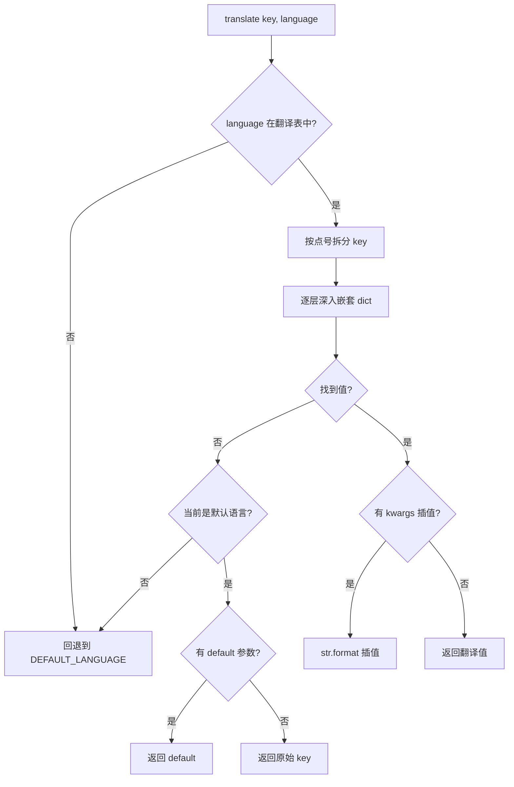
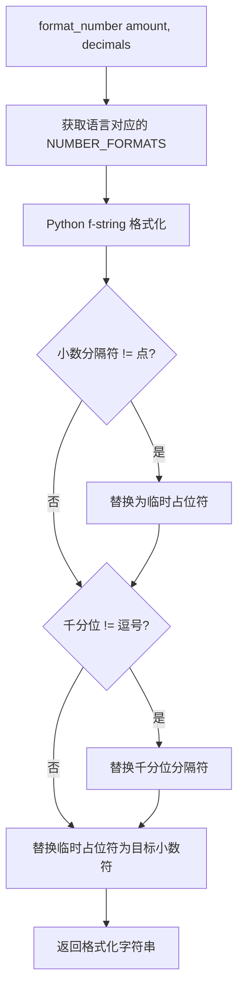
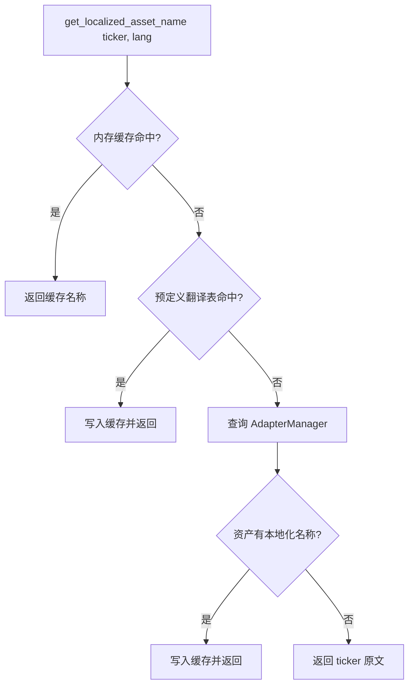

# PD-245.01 ValueCell — 前后端三层 i18n 与金融术语本地化

> 文档编号：PD-245.01
> 来源：ValueCell `python/valuecell/server/services/i18n_service.py`
> GitHub：https://github.com/ValueCell-ai/valuecell.git
> 问题域：PD-245 国际化 (i18n)
> 状态：可复用方案

---

## 第 1 章 问题与动机

### 1.1 核心问题

金融应用的国际化远比普通 Web 应用复杂。除了 UI 文本翻译，还需要处理：

- **金融术语本地化**：同一支股票在不同市场有不同名称（NVIDIA → 英伟达 / 輝達）
- **数字格式差异**：千分位分隔符、小数点符号因地区而异
- **货币符号与精度**：USD 用 `$`、CNY 用 `¥`、JPY 无小数位
- **日期时间格式**：美式 MM/DD/YYYY vs 中式 YYYY年MM月DD日 vs 日式 YYYY/MM/DD
- **前后端双系统同步**：前端 React i18next 与后端 Python I18nService 需要保持语言一致
- **市值单位本地化**：英文用 B/T，中文用 十亿/万亿

ValueCell 作为一个多 Agent 金融平台，面向全球用户（en/zh_CN/zh_TW/ja），需要在前端 UI、后端 API、资产适配器三个层面实现完整的国际化。

### 1.2 ValueCell 的解法概述

1. **三层 i18n 架构**：前端 i18next + 后端 I18nService + 资产适配器 AssetI18nService，各层职责分明（`frontend/src/i18n/index.ts:1-35`、`python/valuecell/server/services/i18n_service.py:123-298`、`python/valuecell/adapters/assets/i18n_integration.py:18-477`）
2. **常量驱动的格式化配置**：所有日期/时间/货币/数字格式集中在 `constants.py` 中按语言映射，新增语言只需加一行配置（`python/valuecell/config/constants.py:41-76`）
3. **双翻译文件体系**：前端 4 语言 JSON（en/zh_CN/zh_TW/ja）+ 后端 5 语言 JSON（en-US/en-GB/zh-Hans/zh-Hant/ja-JP），前端用 i18next 的 `{{var}}` 插值，后端用 Python `str.format(**kwargs)` 插值（`frontend/src/i18n/locales/en.json`、`python/configs/locales/en-US.json`）
4. **语言→时区自动映射**：设置语言时自动推导默认时区（zh_CN → Asia/Shanghai），减少用户配置步骤（`python/valuecell/server/config/i18n.py:41-51`）
5. **RESTful i18n API**：完整的 12 端点 API 路由，支持语言检测、翻译查询、格式化服务、用户偏好持久化（`python/valuecell/server/api/routers/i18n.py:44-462`）

### 1.3 设计思想

| 设计原则 | 具体实现 | 理由 | 替代方案 |
|----------|----------|------|----------|
| 关注点分离 | 前端 UI 翻译、后端业务翻译、资产名称翻译三层独立 | 金融术语翻译逻辑与 UI 翻译完全不同，混在一起会导致翻译文件膨胀 | 单一翻译文件统管所有 |
| 常量集中管理 | 日期/货币/数字格式全部在 constants.py 中定义 | 新增语言只需修改一个文件，避免格式化逻辑散落各处 | 每个 Service 自行定义格式 |
| 全局单例 + 懒初始化 | `get_i18n_service()` / `get_i18n_config()` 懒加载 | 避免循环导入，确保全局状态一致 | 依赖注入框架 |
| Accept-Language 自动检测 | 解析 HTTP 头 + 浏览器 navigator.language 映射 | 首次访问即匹配用户语言，零配置体验 | 强制用户手动选择 |
| 预定义资产翻译 + 缓存 | 硬编码常见股票/加密货币名称 + 内存缓存 | 高频资产名称查询无需 API 调用，毫秒级响应 | 每次查询翻译 API |

---

## 第 2 章 源码实现分析

### 2.1 架构概览

ValueCell 的 i18n 体系分为三个独立层，通过全局单例串联：

```
┌─────────────────────────────────────────────────────────────────┐
│                        前端 (React/i18next)                      │
│  settings-store.ts ──→ i18n/index.ts ──→ locales/{lang}.json    │
│  (Zustand 持久化)      (i18next 初始化)    (4 语言翻译文件)        │
└──────────────────────────────┬──────────────────────────────────┘
                               │ HTTP API (Accept-Language / X-User-ID)
┌──────────────────────────────▼──────────────────────────────────┐
│                     后端 API 层 (FastAPI)                        │
│  routers/i18n.py ──→ I18nService ──→ TranslationManager         │
│  (12 个 RESTful 端点)  (翻译+格式化)   (JSON 文件加载+点号查找)    │
│                          │                                       │
│                     I18nConfig                                   │
│                  (日期/数字/货币格式化)                             │
└──────────────────────────────┬──────────────────────────────────┘
                               │ get_i18n_service() 全局单例
┌──────────────────────────────▼──────────────────────────────────┐
│                   资产适配器层 (Domain)                           │
│  AssetI18nService ──→ 预定义翻译表 + AdapterManager              │
│  (资产名称本地化)      (股票/加密货币名称缓存)                      │
│  i18n_utils.py ──→ 浏览器语言检测 / 时区工具 / 复数化             │
└─────────────────────────────────────────────────────────────────┘
```

### 2.2 核心实现

#### 2.2.1 TranslationManager — 点号嵌套 key 查找与语言回退



对应源码 `python/valuecell/server/services/i18n_service.py:50-92`：

```python
class TranslationManager:
    def get_translation(
        self, language: str, key: str, default: Optional[str] = None, **kwargs
    ) -> str:
        if language not in self._translations:
            language = DEFAULT_LANGUAGE

        translations = self._translations.get(language, {})

        # Support dot notation for nested keys
        keys = key.split(".")
        value = translations

        try:
            for k in keys:
                value = value[k]
        except (KeyError, TypeError):
            # Fallback to default language
            if language != DEFAULT_LANGUAGE:
                return self.get_translation(
                    DEFAULT_LANGUAGE, key, default=default, **kwargs
                )
            if default is not None:
                return default
            return key  # Return key if no translation found

        # Format string with provided variables
        if isinstance(value, str) and kwargs:
            try:
                return value.format(**kwargs)
            except (KeyError, ValueError):
                return value

        return str(value)
```

关键设计点：
- **递归回退**：非默认语言找不到 key 时递归调用自身用 DEFAULT_LANGUAGE 重试（`i18n_service.py:77-80`）
- **三级降级**：目标语言 → 默认语言 → default 参数 → 原始 key
- **安全插值**：`format(**kwargs)` 失败时静默返回原始模板，不抛异常（`i18n_service.py:88-90`）

#### 2.2.2 I18nConfig — 常量驱动的本地化格式化



对应源码 `python/valuecell/server/config/i18n.py:140-165`：

```python
def format_number(self, number: float, decimal_places: int = 2) -> str:
    number_config = self.get_number_format()
    decimal_sep = number_config["decimal"]
    thousands_sep = number_config["thousands"]

    # Format with specified decimal places
    formatted = f"{number:,.{decimal_places}f}"

    # Replace separators if different from default
    if decimal_sep != ".":
        formatted = formatted.replace(".", "DECIMAL_TEMP")
    if thousands_sep != ",":
        formatted = formatted.replace(",", thousands_sep)
    if decimal_sep != ".":
        formatted = formatted.replace("DECIMAL_TEMP", decimal_sep)

    return formatted
```

格式化配置集中在 `python/valuecell/config/constants.py:41-76`：

```python
DATE_FORMATS: Dict[str, str] = {
    "en": "%m/%d/%Y",
    "zh_CN": "%Y年%m月%d日",
    "zh_TW": "%Y年%m月%d日",
    "ja": "%Y/%m/%d",
}

CURRENCY_SYMBOLS: Dict[str, str] = {
    "en": "$",
    "zh_CN": "¥",
    "zh_TW": "HK$",
    "ja": "¥",
}
```

#### 2.2.3 AssetI18nService — 金融资产名称本地化



对应源码 `python/valuecell/adapters/assets/i18n_integration.py:145-190`：

```python
def get_localized_asset_name(
    self, ticker: str, language: Optional[str] = None
) -> str:
    if language is None:
        config = get_i18n_config()
        language = config.language

    # Check cache first
    if ticker in self._name_cache and language in self._name_cache[ticker]:
        return self._name_cache[ticker][language]

    # Check predefined translations
    if ticker in self._predefined_translations:
        translations = self._predefined_translations[ticker]
        if language in translations:
            if ticker not in self._name_cache:
                self._name_cache[ticker] = {}
            self._name_cache[ticker][language] = translations[language]
            return translations[language]

    # Try to get from asset data
    try:
        asset = self.adapter_manager.get_asset_info(ticker)
        if asset:
            name = asset.get_localized_name(language)
            if name:
                if ticker not in self._name_cache:
                    self._name_cache[ticker] = {}
                self._name_cache[ticker][language] = name
                return name
    except Exception as e:
        logger.warning(f"Could not fetch asset info for {ticker}: {e}")

    # Fallback to ticker
    return ticker
```

### 2.3 实现细节

**前端语言持久化与同步**（`frontend/src/store/settings-store.ts:29-66`）：

- Zustand store + `persist` 中间件将语言偏好存入 localStorage
- `getLanguage()` 函数解析 `navigator.language`，映射 `zh-Hans` → `zh_CN`、`zh-Hant` → `zh_TW`
- `setLanguage` action 同时更新 store 和调用 `i18n.changeLanguage(language)`

**前端 i18next 初始化**（`frontend/src/i18n/index.ts:19-33`）：

- `saveMissing: true` + `missingKeyHandler` 在开发模式下打印缺失 key
- `fallbackLng: DEFAULT_LANGUAGE` 确保缺失翻译回退到英文
- `escapeValue: false` 因为 React 已自带 XSS 防护

**后端 Accept-Language 检测**（`python/valuecell/utils/i18n_utils.py:20-77`）：

- 解析 HTTP `Accept-Language` 头的 quality 值并排序
- 处理浏览器 locale 到内部 locale 的映射：`zh-CN` / `zh-Hans` → `zh_CN`，`zh-TW` / `zh-HK` / `zh-Hant` → `zh_TW`
- 支持 IP 地理位置检测用户区域（`detect_user_region` 调用 ipapi.co）

**语言→时区自动映射**（`python/valuecell/server/config/i18n.py:82-89`）：

```python
def set_language(self, language: str) -> None:
    self._language = self._validate_language(language)
    # Auto-update timezone if it was auto-selected
    if not os.getenv("TIMEZONE"):
        self._timezone = LANGUAGE_TIMEZONE_MAPPING.get(
            self._language, DEFAULT_TIMEZONE
        )
```

设置语言时，如果用户没有显式设置时区（无 `TIMEZONE` 环境变量），自动根据 `LANGUAGE_TIMEZONE_MAPPING` 推导时区。


---

## 第 3 章 迁移指南

### 3.1 迁移清单

**阶段 1：基础 i18n 框架（后端）**

- [ ] 创建 `config/constants.py`，定义 `SUPPORTED_LANGUAGES`、`DATE_FORMATS`、`CURRENCY_SYMBOLS`、`NUMBER_FORMATS` 等常量映射
- [ ] 实现 `I18nConfig` 类，封装语言/时区验证、日期/数字/货币格式化
- [ ] 实现 `TranslationManager`，支持 JSON 文件加载 + 点号嵌套 key 查找 + 语言回退
- [ ] 实现 `I18nService` 全局单例，组合 TranslationManager + I18nConfig
- [ ] 创建后端翻译 JSON 文件（至少 en + 一个目标语言）

**阶段 2：前端 i18n 集成**

- [ ] 安装 `i18next` + `react-i18next`
- [ ] 创建前端翻译 JSON 文件，按功能模块组织嵌套 key
- [ ] 在状态管理中持久化语言偏好（Zustand persist / localStorage）
- [ ] 实现浏览器语言自动检测（`navigator.language` 映射）

**阶段 3：领域特定本地化（可选）**

- [ ] 实现领域实体名称本地化服务（如 AssetI18nService）
- [ ] 构建预定义翻译表 + 内存缓存
- [ ] 实现货币金额格式化（含币种符号 + 精度 + 单位缩写）

**阶段 4：API 层**

- [ ] 创建 i18n RESTful API 路由（语言切换、翻译查询、格式化服务）
- [ ] 实现 Accept-Language 头解析与浏览器语言检测
- [ ] 实现用户级 i18n 偏好存储

### 3.2 适配代码模板

#### 后端 TranslationManager（可直接复用）

```python
import json
from pathlib import Path
from typing import Any, Dict, List, Optional

class TranslationManager:
    """JSON 翻译文件管理器，支持点号嵌套 key 和语言回退。"""

    def __init__(
        self,
        locale_dir: Path,
        supported_languages: List[str],
        default_language: str = "en",
    ):
        self._locale_dir = locale_dir
        self._default_language = default_language
        self._supported_languages = supported_languages
        self._translations: Dict[str, Dict[str, Any]] = {}
        self._load_all()

    def _load_all(self) -> None:
        for lang in self._supported_languages:
            path = self._locale_dir / f"{lang}.json"
            if path.exists():
                with open(path, "r", encoding="utf-8") as f:
                    self._translations[lang] = json.load(f)
            else:
                self._translations[lang] = {}

    def t(
        self,
        key: str,
        language: Optional[str] = None,
        default: Optional[str] = None,
        **kwargs,
    ) -> str:
        lang = language or self._default_language
        if lang not in self._translations:
            lang = self._default_language

        # 点号嵌套查找
        value = self._translations.get(lang, {})
        for k in key.split("."):
            if isinstance(value, dict):
                value = value.get(k)
            else:
                value = None
                break

        if value is None:
            # 语言回退
            if lang != self._default_language:
                return self.t(key, self._default_language, default, **kwargs)
            return default if default is not None else key

        result = str(value)
        if kwargs:
            try:
                result = result.format(**kwargs)
            except (KeyError, ValueError):
                pass
        return result

    def reload(self) -> None:
        self._translations.clear()
        self._load_all()
```

#### 前端 i18next 初始化模板

```typescript
import i18n from "i18next";
import { initReactI18next } from "react-i18next";
import en from "./locales/en.json";
import zhCN from "./locales/zh_CN.json";

const DEFAULT_LANGUAGE = "en";
const SUPPORTED = ["en", "zh_CN", "zh_TW", "ja"] as const;

// 浏览器语言映射
function detectLanguage(): string {
  if (typeof navigator === "undefined") return DEFAULT_LANGUAGE;
  const map: Record<string, string> = {
    "zh-Hans": "zh_CN", "zh-CN": "zh_CN",
    "zh-Hant": "zh_TW", "zh-TW": "zh_TW",
    "ja-JP": "ja",
  };
  return map[navigator.language] ?? DEFAULT_LANGUAGE;
}

const resources = { en: { translation: en }, zh_CN: { translation: zhCN } };

i18n.use(initReactI18next).init({
  resources,
  lng: detectLanguage(),
  fallbackLng: DEFAULT_LANGUAGE,
  interpolation: { escapeValue: false },
  saveMissing: process.env.NODE_ENV === "development",
  missingKeyHandler: (_lngs, _ns, key) => {
    console.warn(`[i18n] Missing key: ${key}`);
  },
});

export default i18n;
```

### 3.3 适用场景

| 场景 | 适用度 | 说明 |
|------|--------|------|
| 金融/交易平台 | ⭐⭐⭐ | 完美匹配：资产名称本地化 + 货币格式化 + 多市场时区 |
| 多语言 SaaS 应用 | ⭐⭐⭐ | 三层架构 + RESTful API 可直接复用 |
| 电商平台 | ⭐⭐ | 货币格式化有用，但资产翻译层不需要 |
| 纯前端应用 | ⭐⭐ | 只需前端 i18next 层，后端层可省略 |
| 内部工具 | ⭐ | 通常单语言即可，i18n 投入产出比低 |

---

## 第 4 章 测试用例

```python
import json
import tempfile
from datetime import datetime
from pathlib import Path
from unittest.mock import patch

import pytest
import pytz


class TestTranslationManager:
    """测试 TranslationManager 的核心翻译逻辑。"""

    @pytest.fixture
    def locale_dir(self, tmp_path):
        """创建临时翻译文件。"""
        en_data = {
            "common": {"yes": "Yes", "no": "No"},
            "units": {"trillion": "T", "billion": "B"},
            "app": {"version": "Version {version}"},
        }
        zh_data = {
            "common": {"yes": "是", "no": "否"},
            "units": {"trillion": "万亿", "billion": "十亿"},
            "app": {"version": "版本 {version}"},
        }
        (tmp_path / "en.json").write_text(json.dumps(en_data), encoding="utf-8")
        (tmp_path / "zh_CN.json").write_text(json.dumps(zh_data), encoding="utf-8")
        return tmp_path

    def test_dot_notation_lookup(self, locale_dir):
        """测试点号嵌套 key 查找。"""
        from valuecell.server.services.i18n_service import TranslationManager
        mgr = TranslationManager(locale_dir=locale_dir)
        assert mgr.get_translation("en", "common.yes") == "Yes"
        assert mgr.get_translation("zh_CN", "common.yes") == "是"

    def test_language_fallback(self, locale_dir):
        """测试语言回退到默认语言。"""
        from valuecell.server.services.i18n_service import TranslationManager
        mgr = TranslationManager(locale_dir=locale_dir)
        # ja 不存在，应回退到 en
        assert mgr.get_translation("ja", "common.yes") == "Yes"

    def test_missing_key_returns_key(self, locale_dir):
        """测试缺失 key 返回原始 key。"""
        from valuecell.server.services.i18n_service import TranslationManager
        mgr = TranslationManager(locale_dir=locale_dir)
        assert mgr.get_translation("en", "nonexistent.key") == "nonexistent.key"

    def test_missing_key_with_default(self, locale_dir):
        """测试缺失 key 使用 default 参数。"""
        from valuecell.server.services.i18n_service import TranslationManager
        mgr = TranslationManager(locale_dir=locale_dir)
        result = mgr.get_translation("en", "nonexistent.key", default="fallback")
        assert result == "fallback"

    def test_string_interpolation(self, locale_dir):
        """测试字符串插值。"""
        from valuecell.server.services.i18n_service import TranslationManager
        mgr = TranslationManager(locale_dir=locale_dir)
        result = mgr.get_translation("en", "app.version", version="2.0")
        assert result == "Version 2.0"
        result_zh = mgr.get_translation("zh_CN", "app.version", version="2.0")
        assert result_zh == "版本 2.0"


class TestI18nConfig:
    """测试 I18nConfig 的格式化功能。"""

    def test_format_number_en(self):
        """测试英文数字格式化。"""
        from valuecell.server.config.i18n import I18nConfig
        config = I18nConfig(language="en")
        assert config.format_number(1234567.89, 2) == "1,234,567.89"

    def test_format_datetime_zh(self):
        """测试中文日期格式化。"""
        from valuecell.server.config.i18n import I18nConfig
        config = I18nConfig(language="zh_CN", timezone="Asia/Shanghai")
        dt = datetime(2024, 3, 15, 10, 30, tzinfo=pytz.UTC)
        result = config.format_datetime(dt, "date")
        assert "2024年03月15日" in result

    def test_language_timezone_auto_mapping(self):
        """测试语言→时区自动映射。"""
        from valuecell.server.config.i18n import I18nConfig
        config = I18nConfig(language="ja")
        assert config.timezone == "Asia/Tokyo"

    def test_invalid_language_fallback(self):
        """测试无效语言回退到默认。"""
        from valuecell.server.config.i18n import I18nConfig
        config = I18nConfig(language="invalid_lang")
        assert config.language == "en"


class TestAssetI18nService:
    """测试资产名称本地化。"""

    def test_predefined_translation(self):
        """测试预定义资产翻译。"""
        from valuecell.adapters.assets.i18n_integration import AssetI18nService
        from unittest.mock import MagicMock
        service = AssetI18nService(MagicMock())
        name = service.get_localized_asset_name("NASDAQ:NVDA", "zh_CN")
        assert name == "英伟达"
        name_tw = service.get_localized_asset_name("NASDAQ:NVDA", "zh_TW")
        assert name_tw == "輝達"

    def test_cache_hit(self):
        """测试缓存命中。"""
        from valuecell.adapters.assets.i18n_integration import AssetI18nService
        from unittest.mock import MagicMock
        service = AssetI18nService(MagicMock())
        # 第一次查询填充缓存
        service.get_localized_asset_name("NASDAQ:AAPL", "zh_CN")
        # 第二次应命中缓存
        assert "NASDAQ:AAPL" in service._name_cache
        assert service._name_cache["NASDAQ:AAPL"]["zh_CN"] == "苹果公司"

    def test_unknown_ticker_fallback(self):
        """测试未知 ticker 回退到原始值。"""
        from valuecell.adapters.assets.i18n_integration import AssetI18nService
        from unittest.mock import MagicMock
        mgr = MagicMock()
        mgr.get_asset_info.return_value = None
        service = AssetI18nService(mgr)
        name = service.get_localized_asset_name("UNKNOWN:XXX", "zh_CN")
        assert name == "UNKNOWN:XXX"
```


---

## 第 5 章 跨域关联

| 关联域 | 关系类型 | 说明 |
|--------|----------|------|
| PD-06 记忆持久化 | 协同 | 用户语言偏好需要持久化存储，ValueCell 前端用 Zustand persist + localStorage，后端用内存 dict（生产应迁移到 Redis/DB） |
| PD-04 工具系统 | 协同 | AssetI18nService 依赖 AdapterManager 获取资产信息，工具系统的输出需要经过 i18n 层本地化后才能展示给用户 |
| PD-11 可观测性 | 协同 | i18n API 路由的日志和错误信息本身也需要考虑语言，ValueCell 的日志统一用英文，仅面向用户的输出做本地化 |
| PD-09 Human-in-the-Loop | 依赖 | 交互式界面的所有提示文本、按钮标签、错误消息都依赖 i18n 翻译，缺失翻译会导致用户体验断裂 |

---

## 第 6 章 来源文件索引

| 文件 | 行范围 | 关键实现 |
|------|--------|----------|
| `python/valuecell/server/services/i18n_service.py` | L13-L92 | TranslationManager：JSON 加载 + 点号查找 + 语言回退 |
| `python/valuecell/server/services/i18n_service.py` | L123-L298 | I18nService：翻译 + 格式化 + 语言/时区管理 |
| `python/valuecell/server/services/i18n_service.py` | L301-L349 | 全局单例 + 便捷函数 `t()` / `translate()` |
| `python/valuecell/server/config/i18n.py` | L25-L227 | I18nConfig：日期/数字/货币格式化 + 语言→时区映射 |
| `python/valuecell/config/constants.py` | L14-L76 | 语言列表、时区映射、日期/货币/数字格式常量 |
| `python/valuecell/adapters/assets/i18n_integration.py` | L18-L477 | AssetI18nService：资产名称本地化 + 预定义翻译 + 缓存 |
| `python/valuecell/utils/i18n_utils.py` | L20-L77 | Accept-Language 解析 + 浏览器语言检测 |
| `python/valuecell/utils/i18n_utils.py` | L80-L145 | IP 地理位置区域检测（同步/异步） |
| `python/valuecell/utils/i18n_utils.py` | L353-L424 | 文件大小/时长格式化 + 复数化工具 |
| `python/valuecell/utils/i18n_utils.py` | L498-L605 | 翻译文件验证 + 缺失翻译检测 + 模板生成 |
| `python/valuecell/server/api/routers/i18n.py` | L44-L462 | RESTful i18n API：12 端点（配置/语言/时区/翻译/格式化/用户设置） |
| `frontend/src/i18n/index.ts` | L1-L35 | 前端 i18next 初始化 + 缺失 key 处理 |
| `frontend/src/store/settings-store.ts` | L29-L66 | Zustand 语言持久化 + 浏览器语言检测 |
| `frontend/src/i18n/locales/en.json` | 全文 | 前端英文翻译（434 key，含 UI/交易/策略/排行） |
| `python/configs/locales/en-US.json` | 全文 | 后端英文翻译（171 key，含通用/导航/表单/资产） |
| `python/configs/locales/zh-Hans.json` | 全文 | 后端简体中文翻译 |
| `python/configs/locales/language_list.json` | 全文 | 语言元数据列表（5 语言 + 区域信息） |

---

## 第 7 章 横向对比维度

```json comparison_data
{
  "project": "ValueCell",
  "dimensions": {
    "翻译架构": "前端 i18next + 后端 TranslationManager 双翻译体系，JSON 文件独立",
    "格式化能力": "常量驱动的日期/数字/货币格式化，I18nConfig 集中封装",
    "语言检测": "Accept-Language 解析 + navigator.language 映射 + IP 地理位置检测",
    "领域本地化": "AssetI18nService 预定义翻译表 + 内存缓存，覆盖股票/加密货币名称",
    "API 支持": "12 端点 RESTful API，含翻译查询/格式化服务/用户偏好管理",
    "语言覆盖": "en/zh_CN/zh_TW/ja 四语言，后端额外支持 en-GB"
  }
}
```

### 域元数据补充

```json domain_metadata
{
  "solution_summary": "ValueCell 用前端 i18next + 后端 TranslationManager + AssetI18nService 三层架构实现金融平台 4 语言国际化，含资产名称本地化与 12 端点 RESTful i18n API",
  "description": "金融领域 i18n 需额外处理资产名称、货币符号、市值单位等领域术语的本地化",
  "sub_problems": [
    "领域实体名称本地化（股票/加密货币多语言名称）",
    "语言→时区自动推导与联动",
    "Accept-Language 头解析与浏览器 locale 映射",
    "市值/涨跌幅等金融数值的本地化格式化"
  ],
  "best_practices": [
    "常量集中管理所有格式化配置，新增语言只改一个文件",
    "预定义高频实体翻译表 + 内存缓存避免重复查询",
    "前后端翻译文件独立维护，避免职责耦合",
    "RESTful i18n API 暴露翻译和格式化能力供外部消费"
  ]
}
```

