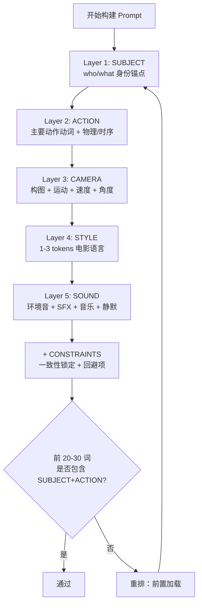
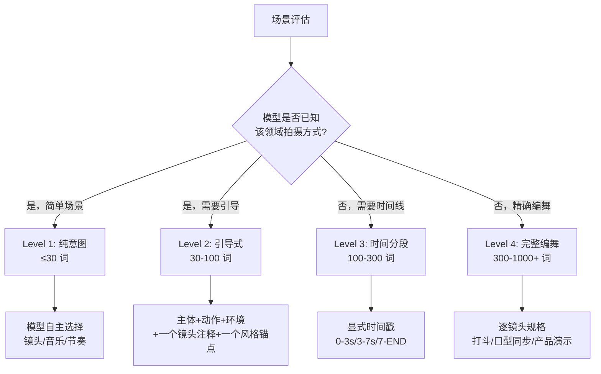
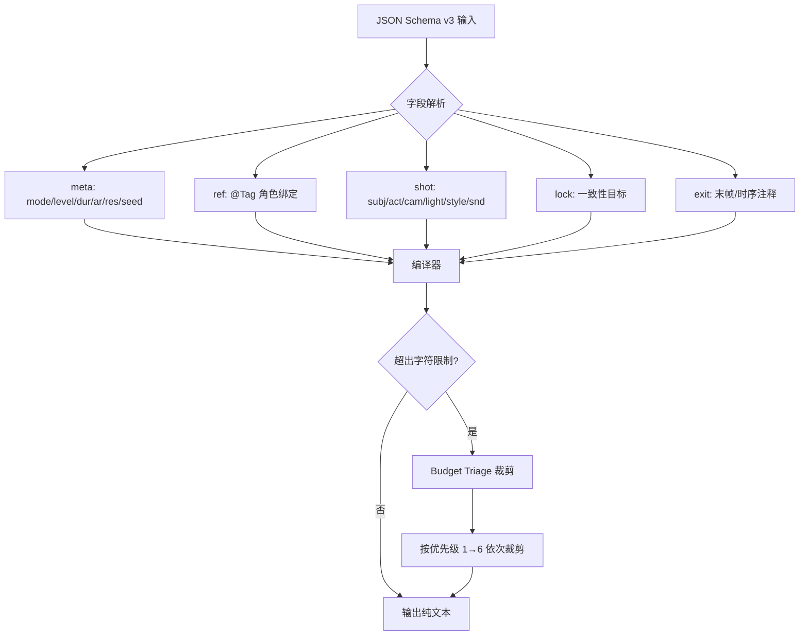

# PD-245.01 seedance-2.0 — 五层提示栈与反空话 Prompt 工程体系

> 文档编号：PD-245.01
> 来源：seedance-2.0 `skills/seedance-prompt/SKILL.md` `skills/seedance-antislop/SKILL.md` `references/json-schema.md`
> GitHub：https://github.com/Emily2040/seedance-2.0.git
> 问题域：PD-245 Prompt 工程框架 Prompt Engineering Framework
> 状态：可复用方案

---

## 第 1 章 问题与动机

### 1.1 核心问题

AI 视频生成模型（如 Seedance 2.0）对 prompt 质量极度敏感。实践者在 10,000+ 次生成中发现三个核心痛点：

1. **空话污染**：`cinematic`、`stunning`、`epic` 等不可测量词汇占据 token 预算，模型无法从中提取任何具体指令，导致输出退化为"通用模式"
2. **结构缺失**：用户倾向于写散文式 prompt，缺乏分层结构，导致主体/动作/镜头/风格/音频信息混杂，模型权重分配混乱
3. **委托粒度不匹配**：简单场景写了 300 词的过度描述，复杂编舞只给了 30 词的模糊意图——缺乏系统化的委托级别判断框架

这些问题不仅存在于视频生成领域。任何 LLM prompt 工程都面临类似挑战：如何在有限 token 预算内最大化信息密度，如何建立可复用的 prompt 结构模板，如何系统性地过滤低质量表达。

### 1.2 seedance-2.0 的解法概述

seedance-2.0 构建了一套完整的 prompt 工程体系，核心由五个互锁组件构成：

1. **五层提示栈（Five-Layer Stack）**：SUBJECT → ACTION → CAMERA → STYLE → SOUND 的固定构建顺序，确保前 20-30 词承载最高信息密度（`skills/seedance-prompt/SKILL.md:49-63`）
2. **4 级委托模式（Delegation Levels）**：从 ≤30 词的纯意图（Level 1）到 300-1000+ 词的完整编舞（Level 4），每级有明确的词数范围和适用场景判断规则（`skills/seedance-prompt/SKILL.md:66-91`）
3. **@Tag 引用系统**：多模态资产（图片/视频/音频）通过 `@Image1`、`@Video1`、`@Audio1` 标签绑定角色，每个标签必须有显式角色声明（`skills/seedance-prompt/SKILL.md:94-123`）
4. **JSON Schema v3 编译器**：结构化 JSON 用于规划，编译为纯文本后提交——JSON 是存储格式，纯文本是执行格式（`references/json-schema.md:1-3`）
5. **反空话协议（Anti-Slop Protocol）**：基于"可测量性"单一判据的词汇过滤系统，含黑名单、分解模式、密度审计三层防线（`skills/seedance-antislop/SKILL.md:17-26`）

### 1.3 设计思想

| 设计原则 | 具体实现 | 理由 | 替代方案 |
|----------|----------|------|----------|
| 可测量性优先 | "摄影机、测光表或秒表能测量吗？"作为唯一判据 | 不可测量的词汇无法转化为模型的具体指令 | 主观评分（不可复现）、人工审核（不可规模化） |
| 前置加载 | 主体+动作必须在前 20-30 词 | 模型对早期 token 赋予更高权重 | 自由格式（信息密度不可控） |
| 分层构建 | 五层栈固定顺序 | 消除层间信息混杂，每层独立可调 | 自由散文（不可复用、不可调试） |
| 编译分离 | JSON 规划 → 纯文本执行 | JSON 便于存储/版本控制/自动化，纯文本是模型原生格式 | 直接写纯文本（不可结构化管理） |
| 渐进委托 | 4 级从简到繁 | 避免简单场景过度描述、复杂场景描述不足 | 统一模板（一刀切，不适应场景差异） |

---

## 第 2 章 源码实现分析

### 2.1 架构概览

seedance-2.0 的 prompt 工程体系由 20+ 个 skill 文件和 5 个 reference 文件组成，形成一个模块化的知识图谱：

```
seedance-20 (根路由 SKILL.md)
├── seedance-interview     ← 5 阶段导演旅程，从意图到生产简报
├── seedance-prompt        ← 核心：五层栈 + @Tag + JSON Schema + 委托级别
├── seedance-antislop      ← 反空话协议：黑名单 + 分解模式 + 密度审计
├── seedance-camera        ← 镜头语言库
├── seedance-motion        ← 运动/速度控制
├── seedance-lighting      ← 灯光设计
├── seedance-characters    ← 角色身份锁定
├── seedance-style         ← 美学风格
├── seedance-vfx           ← 视觉特效
├── seedance-audio         ← 音频设计
├── seedance-copyright     ← 版权合规
├── seedance-pipeline      ← API/ComfyUI/后处理
├── seedance-recipes       ← 类型模板
├── seedance-troubleshoot  ← QA/错误修复
├── seedance-vocab-{zh,ja,ko,es,ru}  ← 多语言术语库
└── references/
    ├── json-schema.md           ← Schema v3 定义 + 编译规则
    ├── platform-constraints.md  ← 平台硬限制
    ├── prompt-examples.md       ← 编译后示例
    ├── quick-ref.md             ← 速查表
    └── storytelling-framework.md ← 叙事框架
```

核心数据流：

```
用户意图
  ↓
[seedance-interview] 5 阶段引导
  ↓
[seedance-prompt] 五层栈构建 + @Tag 绑定
  ↓
[json-schema.md] JSON Schema v3 结构化
  ↓
JSON → 纯文本编译（Budget Triage 裁剪）
  ↓
[seedance-antislop] 反空话过滤
  ↓
最终 prompt → 平台提交
```

### 2.2 核心实现

#### 2.2.1 五层提示栈（Five-Layer Stack）



对应源码 `skills/seedance-prompt/SKILL.md:49-63`：

```markdown
## The Five-Layer Stack

Build prompts in this order. The model is motion-first; subject anchor before style.

1. SUBJECT  — who/what is central (identity anchor)
2. ACTION   — primary motion verb + physics/timing
3. CAMERA   — framing + movement + speed + angle
4. STYLE    — 1–3 tokens max (film language, not adjectives)
5. SOUND    — ambient + SFX + music + silence
+ CONSTRAINTS — what must stay consistent; what to avoid

First 20–30 words carry disproportionate weight. Subject + action always first.
```

关键设计决策：
- **运动优先（motion-first）**：模型架构决定了动作信息比风格信息更关键
- **风格极简**：STYLE 层限制为 1-3 tokens，防止风格描述膨胀挤占实质内容
- **音频非可选**：10,000+ 次生成数据证实，忽略音频规格会导致输出平淡（`skills/seedance-prompt/SKILL.md:256`）

#### 2.2.2 4 级委托模式（Delegation Levels）



对应源码 `skills/seedance-prompt/SKILL.md:66-91`：

```markdown
### Level 1 — Pure Intent (≤30 words)
Use when the model knows the domain (food, brands, sports, everyday life).
生成一个精美高级的兰州拉面广告，注意分镜编排
The model selects shots, music, pacing independently.

### Level 2 — Guided Direction (30–100 words)
Subject + action + environment + one camera note + one style anchor.

### Level 3 — Time-Segmented (100–300 words)
Use explicit timestamps: 0–3s: ... 3–7s: ... 7–END: ...

### Level 4 — Full Choreography (300–1000+ words)
Per-shot specifications. Use for fight scenes, lip-sync, product demos.

Decision rule: Does the model already know how to shoot this?
Yes → Level 1–2. Novel/precise → Level 3–4.
```

Level 1 的特殊设计：中文关键词 `注意分镜编排` 作为"导演智能激活器"，让模型自主进行分镜编排（`skills/seedance-prompt/SKILL.md:255`）。

#### 2.2.3 JSON Schema v3 编译器



对应源码 `references/json-schema.md:7-33`（Schema 定义）和 `references/json-schema.md:56-66`（编译输出）：

```json
{
  "meta": { "mode": "i2v", "level": 3, "dur": 10, "ar": "16:9", "res": "1080p", "seed": 42 },
  "ref": { "char": "@Image1", "bg": "@Image2", "cam": "@Video1", "bgm": "@Audio1" },
  "shot": {
    "subj": "young woman in red coat",
    "act": "turns, looks up, smiles",
    "cam": "slow push-in, MCU",
    "light": "golden backlight, soft fill",
    "style": "cinematic",
    "snd": "wind ambience, soft piano"
  },
  "lock": ["character identity", "background"],
  "exit": "freeze on smile, 0.5s"
}
```

编译输出（纯文本）：
```
@Image1 character identity. @Image2 background lock. @Audio1 bgm.
Young woman in red coat turns, looks up, smiles.
Slow push-in to MCU.
Golden backlight, soft fill.
Cinematic.
Wind ambience, soft piano.
Maintain character identity, maintain background. Freeze on smile, 0.5 s.
```

Budget Triage 优先级表（`references/json-schema.md:68-77`）：

| 优先级 | 字段 | 裁剪规则 |
|--------|------|----------|
| 6（最后裁剪） | `shot.subj` `shot.act` | 永不裁剪 |
| 5 | `ref.*` | 永不裁剪 |
| 4 | `shot.cam` | 压缩到 3 词 |
| 3 | `shot.light` | 降到 1 短语 |
| 2 | `shot.style` | 减到 1 token |
| 1（最先裁剪） | `shot.snd` `exit` | 完全移除 |

### 2.3 实现细节

#### 反空话协议三层防线

**第一层：黑名单即删**（`skills/seedance-antislop/SKILL.md:52-78`）

六类黑名单词汇：
- 夸张增强词：`stunning` `breathtaking` `incredible` `amazing`...
- 质量断言：`masterpiece` `award-winning` `professional`...
- 分辨率戏剧：`8K` `4K ultra HD` `hyper-detailed`...
- 模糊美学：`cinematic` `epic` `dramatic` `artistic`...
- AI 自夸（Hum 层）：`certainly` `here is` `masterfully`...
- 平台安全空话：`family-friendly` `wholesome` `uplifting`...

**第二层：分解模式**（`skills/seedance-antislop/SKILL.md:82-171`）

每个被删除的空话词都有对应的"可观测组件"替换方案：

```
❌  cinematic lighting
✅  single hard key 45° camera-left, amber gel, deep shadow camera-right, no fill

❌  epic battle scene
✅  wide establishing shot, 200 soldiers clashing on a muddy plain,
    handheld low-angle, dramatic brass swell, slow-motion at impact 0.3×

❌  8K ultra-real
✅  stable exposure, no flicker, clean edge definition, no hallucinated geometry
```

**第三层：密度审计**（`skills/seedance-antislop/SKILL.md:326-335`）

提交前计数 prompt 中的空话 token：
- 0 个 → 提交
- 1-2 个 → 删除并收紧
- 3-5 个 → 从 SUBJECT 层重写
- 5+ 个 → 丢弃，从五层栈重新开始

#### 精度阶梯（Precision Ladder）

从最弱到最强的同一概念描述（`skills/seedance-antislop/SKILL.md:339-351`）：

```
Level 0 (slop):    "beautiful cinematic lighting"
Level 1 (genre):   "dramatic portrait lighting"
Level 2 (rig):     "three-point lighting setup"
Level 3 (angles):  "45° key, soft fill camera-right, hair light from above"
Level 4 (numbers): "key at 45° camera-left, 3200K, f/4 falloff; fill at 0.3× key power"
```

目标：最低 Level 3，一致性关键场景用 Level 4。

#### 导演三定律

从实践者共识和大量生成数据中提炼（`skills/seedance-antislop/SKILL.md:355-378`）：

1. **量产优于完美**：生成 10 个变体，选最好的。系统胜过灵感
2. **每镜头一个动作**：竞争性动词制造混乱。每个片段只有一个运动
3. **前置加载信息，永不前置形容词**：模型对早期 token 赋予更高权重，用实质内容占据它们

#### 时间分段编译（Level 3-4）

`references/json-schema.md:79-96` 定义了分段镜头的 JSON 结构和编译规则：

```json
{
  "seg": [
    { "t": "0-4s", "act": "stands still, wind moves coat", "cam": "static wide" },
    { "t": "4-8s", "act": "turns head slowly",             "cam": "slow push-in" },
    { "t": "8-10s","act": "direct eye contact, smiles",    "cam": "MCU, locked" }
  ]
}
```

编译为：
```
0–4 s: stands still, wind moves coat. Static wide.
4–8 s: turns head slowly. Slow push-in.
8–10 s: direct eye contact, smiles. MCU, locked.
```
