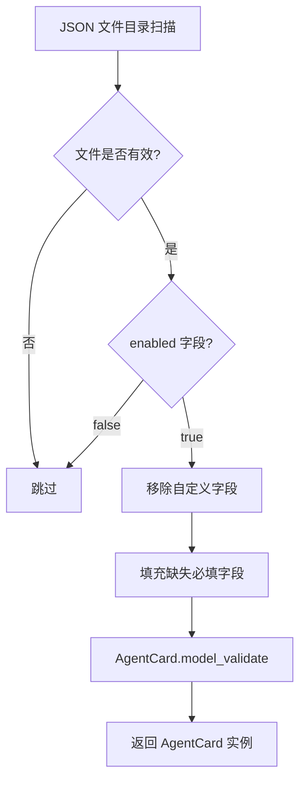
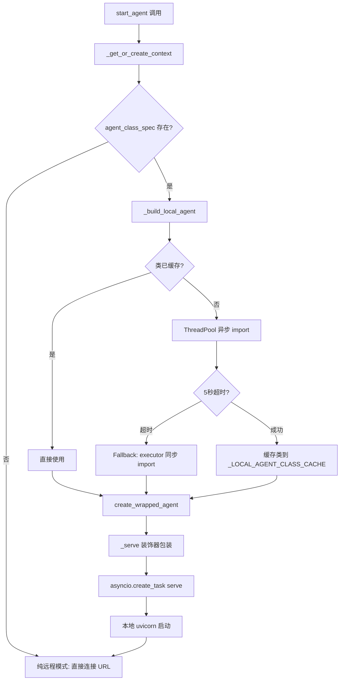
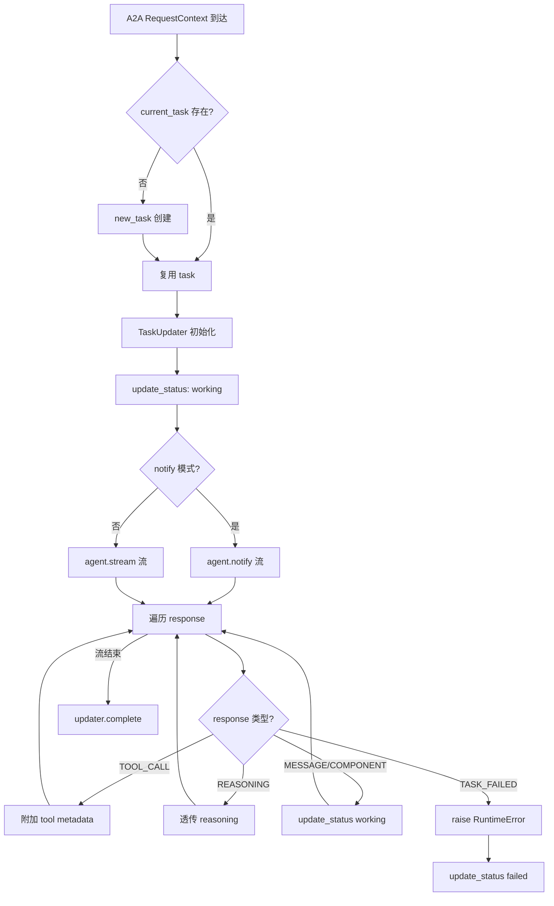

# PD-246.01 ValueCell — A2A 协议 Agent 间通信与混合部署

> 文档编号：PD-246.01
> 来源：ValueCell `python/valuecell/core/agent/`
> GitHub：https://github.com/ValueCell-ai/valuecell.git
> 问题域：PD-246 A2A 协议集成 A2A Protocol Integration
> 状态：可复用方案

---

## 第 1 章 问题与动机

### 1.1 核心问题

多 Agent 系统中，各 agent 如何发现彼此、声明能力、建立通信？当系统同时包含本地进程内 agent 和远程 HTTP agent 时，调用方如何用统一接口与它们交互，而不关心部署拓扑？

传统做法是自定义 RPC 或消息队列，但这导致：
- 每个项目重新发明通信协议，互操作性为零
- agent 能力声明缺乏标准格式，无法自动发现
- 本地/远程 agent 需要不同的调用代码，增加编排复杂度
- 推送通知（agent 主动通知客户端）缺乏标准机制

Google A2A（Agent-to-Agent）协议提供了一个开放标准：AgentCard 声明能力，HTTP+SSE 双向通信，Task 生命周期管理。但协议本身只定义了远程通信，如何将本地进程内 agent 也纳入同一套体系，是工程落地的关键挑战。

### 1.2 ValueCell 的解法概述

ValueCell 基于 Google A2A 协议 SDK（`a2a` Python 包）构建了完整的 agent 通信层，核心设计：

1. **JSON AgentCard 配置驱动** — 每个 agent 用独立 JSON 文件声明能力、技能、URL 和元数据，存放在 `python/configs/agent_cards/` 目录（`card.py:49-90`）
2. **RemoteConnections 统一管理器** — 单一入口管理所有 agent 的生命周期：发现、连接、启动、停止（`connect.py:203-684`）
3. **本地/远程透明混合部署** — 通过 `metadata.local_agent_class` 字段，同一个 AgentCard 既可以指向远程 URL，也可以懒加载本地 Python 类并启动进程内 HTTP 服务器（`connect.py:148-200`）
4. **装饰器模式注入 A2A 服务能力** — `_serve()` 装饰器自动为任何 `BaseAgent` 子类添加 uvicorn HTTP 服务器 + A2A 协议处理（`decorator.py:36-122`）
5. **GenericAgentExecutor 统一执行接口** — 将 `BaseAgent.stream()/notify()` 适配为 A2A 的 `AgentExecutor` 接口，处理 Task 生命周期和事件流（`decorator.py:125-259`）

### 1.3 设计思想

| 设计原则 | 具体实现 | 理由 | 替代方案 |
|----------|----------|------|----------|
| 配置驱动发现 | JSON AgentCard 文件 + 目录扫描 | 无需注册中心，文件即配置，git 可追踪 | etcd/Consul 服务注册 |
| 协议标准化 | 直接使用 Google A2A SDK 类型 | 避免自定义协议，天然互操作 | 自定义 gRPC/REST |
| 部署透明 | `local_agent_class` 元数据字段 | 同一 AgentCard 支持本地和远程，调用方无感知 | 分离 LocalAgent/RemoteAgent 接口 |
| 懒加载启动 | ThreadPool + asyncio.wait_for 超时 | 避免启动时阻塞事件循环，Windows 兼容 | 同步 import 阻塞主线程 |
| 装饰器注入 | `_serve()` 包装原始类 | 业务 agent 只需实现 `stream()/notify()`，无需关心 HTTP | 继承 A2A Server 基类 |

---

## 第 2 章 源码实现分析

### 2.1 架构概览

ValueCell 的 A2A 集成分为 5 层：

```
┌─────────────────────────────────────────────────────────┐
│                   调用方 / 编排器                          │
│              RemoteConnections.start_agent()              │
├─────────────────────────────────────────────────────────┤
│              AgentContext（统一上下文）                     │
│   name | url | client | agent_task | listener_task       │
├──────────────────┬──────────────────────────────────────┤
│   远程 Agent 路径  │         本地 Agent 路径                │
│                  │                                      │
│  AgentClient     │  _build_local_agent()                │
│  ├─ httpx        │  ├─ _resolve_local_agent_class()     │
│  ├─ A2ACard      │  ├─ create_wrapped_agent()           │
│  │  Resolver     │  │  ├─ _serve() 装饰器               │
│  └─ send_message │  │  │  ├─ uvicorn Server             │
│                  │  │  │  ├─ A2AStarletteApplication    │
│                  │  │  │  └─ GenericAgentExecutor        │
│                  │  │  └─ BaseAgent.stream()/notify()    │
│                  │  └─ asyncio.create_task(serve())      │
├──────────────────┴──────────────────────────────────────┤
│           NotificationListener（推送通知）                 │
│           Starlette /notify endpoint                     │
└─────────────────────────────────────────────────────────┘
```

### 2.2 核心实现

#### 2.2.1 AgentCard 配置解析



对应源码 `python/valuecell/core/agent/card.py:12-46`：

```python
def parse_local_agent_card_dict(agent_card_dict: dict) -> Optional[AgentCard]:
    if not isinstance(agent_card_dict, dict):
        return None
    # 移除 ValueCell 自定义字段（enabled, metadata, display_name）
    for field in FIELDS_UNDEFINED_IN_AGENT_CARD_MODEL:
        if field in agent_card_dict:
            del agent_card_dict[field]
    # 填充 A2A 协议必填字段的默认值
    if "description" not in agent_card_dict:
        agent_card_dict["description"] = (
            f"No description available for {agent_card_dict.get('name', 'unknown')} agent."
        )
    if "capabilities" not in agent_card_dict:
        agent_card_dict["capabilities"] = AgentCapabilities(
            streaming=True, push_notifications=False
        ).model_dump()
    # Pydantic 校验
    agent_card = AgentCard.model_validate(agent_card_dict)
    return agent_card
```

关键设计：JSON 配置中可以包含 A2A 标准字段之外的自定义字段（`enabled`、`metadata`、`display_name`），解析时先剥离再校验，实现了"超集配置 → 标准 AgentCard"的转换。

#### 2.2.2 本地 Agent 懒加载与混合部署



对应源码 `python/valuecell/core/agent/connect.py:80-200`：

```python
_LOCAL_AGENT_CLASS_CACHE: Dict[str, Type[Any]] = {}
executor = ThreadPoolExecutor(max_workers=4)

async def _resolve_local_agent_class(spec: str) -> Optional[Type[Any]]:
    """异步解析 module:Class 规格到 Python 类，import 在线程池中执行"""
    cached = _LOCAL_AGENT_CLASS_CACHE.get(spec)
    if cached is not None:
        return cached
    loop = asyncio.get_running_loop()
    agent_cls = await loop.run_in_executor(
        executor, _resolve_local_agent_class_sync, spec
    )
    return agent_cls

async def _build_local_agent(ctx: AgentContext):
    agent_cls = ctx.agent_instance_class
    if agent_cls is None and ctx.agent_class_spec:
        try:
            agent_cls = await asyncio.wait_for(
                _resolve_local_agent_class(ctx.agent_class_spec), timeout=5.0
            )
        except asyncio.TimeoutError:
            # Fallback: 直接在 executor 中同步 import
            loop = asyncio.get_running_loop()
            agent_cls = await loop.run_in_executor(
                executor, _resolve_local_agent_class_sync, ctx.agent_class_spec
            )
        ctx.agent_instance_class = agent_cls
    if agent_cls is None:
        return None
    return create_wrapped_agent(agent_cls)
```

关键设计：`module:Class` 字符串规格（如 `"valuecell.agents.news_agent.core:NewsAgent"`）允许延迟解析，避免启动时 import 所有 agent 模块。ThreadPool + 超时 + fallback 三层保护确保 Windows 上不会因 import lock 死锁。

#### 2.2.3 GenericAgentExecutor 统一执行



对应源码 `python/valuecell/core/agent/decorator.py:125-259`：

```python
class GenericAgentExecutor(AgentExecutor):
    def __init__(self, agent: BaseAgent):
        self.agent = agent

    async def execute(self, context: RequestContext, event_queue: EventQueue) -> None:
        query = context.get_user_input()
        task = context.current_task
        task_meta = context.message.metadata
        if not task:
            task = new_task(context.message)
            task.metadata = task_meta
            await event_queue.enqueue_event(task)

        updater = TaskUpdater(event_queue, task.id, task.context_id)
        await updater.update_status(TaskState.working, ...)

        try:
            # 根据 metadata 中的 notify 标志选择 stream 或 notify 模式
            query_handler = (
                self.agent.notify if task_meta and task_meta.get("notify")
                else self.agent.stream
            )
            async for response in query_handler(query, context_id, task_id, dependencies):
                if EventPredicates.is_task_failed(response.event):
                    raise RuntimeError(f"Agent reported failure: {response.content}")
                # 分类处理不同事件类型
                metadata = {"response_event": response.event.value}
                if EventPredicates.is_tool_call(response.event):
                    metadata["tool_call_id"] = response.metadata.get("tool_call_id")
                    # ...
                await updater.update_status(TaskState.working, ...)
        except Exception as e:
            await updater.update_status(TaskState.failed, ...)
        finally:
            await updater.complete()
```

### 2.3 实现细节

**AgentCard JSON 配置示例**（`python/configs/agent_cards/investment_research_agent.json`）：

```json
{
    "name": "ResearchAgent",
    "display_name": "Research Agent",
    "url": "http://localhost:10004/",
    "description": "Research Agent analyzes SEC filings...",
    "skills": [
        {
            "id": "extract_financials",
            "name": "Extract financial line items",
            "description": "Retrieve and extract numeric financial line items...",
            "examples": ["What was Apple's revenue in Q4 2024?"],
            "tags": ["10-K","10-Q","financials"]
        }
    ],
    "enabled": true,
    "metadata": {
        "local_agent_class": "valuecell.agents.research_agent.core:ResearchAgent"
    }
}
```

**数据流：从 AgentCard 到运行时**

1. `RemoteConnections._load_remote_contexts()` 扫描 `configs/agent_cards/*.json`
2. 每个 JSON 解析为 `AgentContext`，提取 `metadata.local_agent_class` 作为 `agent_class_spec`
3. `start_agent()` 时，若有 `agent_class_spec`，走本地路径：import → wrap → serve
4. 若无 `agent_class_spec`，走远程路径：`AgentClient` 连接 URL
5. 两条路径最终都通过 `AgentClient` 通信（本地 agent 也启动了 HTTP 服务器）

**推送通知机制**（`connect.py:509-538` + `listener.py:15-95`）：

- `NotificationListener` 是一个轻量 Starlette HTTP 服务器，监听 `/notify` POST 端点
- 收到通知后将 JSON 反序列化为 A2A `Task` 对象，调用回调函数
- 支持同步和异步回调（通过 `asyncio.iscoroutinefunction` 检测）
- 端口自动分配：`get_next_available_port(5000)` 从 5000 开始扫描可用端口

**并发安全**（`connect.py:220-224`）：

- 每个 agent 有独立的 `asyncio.Lock`，防止并发 `start_agent` 导致重复启动
- `_LOCAL_AGENT_CLASS_CACHE` 全局字典缓存已解析的类，避免重复 import

---

## 第 3 章 迁移指南

### 3.1 迁移清单

**阶段 1：基础协议层（必须）**

- [ ] 安装 A2A SDK：`pip install a2a-sdk`（或 `a2a`）
- [ ] 定义 `BaseAgent` 抽象基类，包含 `stream()` 和 `notify()` 两个异步生成器方法
- [ ] 创建 `configs/agent_cards/` 目录，为每个 agent 编写 JSON AgentCard 配置
- [ ] 实现 `parse_local_agent_card_dict()` 解析器，处理自定义字段剥离和默认值填充

**阶段 2：通信层（必须）**

- [ ] 实现 `AgentClient` 封装 A2A 的 `ClientFactory` + `A2ACardResolver`
- [ ] 实现 `NotificationListener` 用于接收推送通知
- [ ] 实现 `RemoteConnections` 管理器，统一 agent 生命周期

**阶段 3：本地混合部署（可选）**

- [ ] 在 AgentCard JSON 的 `metadata` 中添加 `local_agent_class` 字段
- [ ] 实现 `_resolve_local_agent_class()` 异步类解析器（ThreadPool + 缓存）
- [ ] 实现 `_serve()` 装饰器，为 BaseAgent 注入 uvicorn 服务能力
- [ ] 实现 `GenericAgentExecutor` 适配 BaseAgent → A2A AgentExecutor

**阶段 4：生产加固（推荐）**

- [ ] 添加 per-agent asyncio.Lock 防止并发启动
- [ ] 实现 `preload_local_agent_classes()` 启动时预加载避免运行时死锁
- [ ] 添加客户端初始化重试（本地 agent 3 次，远程 1 次）
- [ ] 实现 `_cleanup_agent()` 优雅关闭（shutdown → wait_for → cancel）

### 3.2 适配代码模板

**最小可运行示例：定义一个 A2A 兼容 Agent**

```python
"""minimal_agent.py — 可直接运行的 A2A Agent 示例"""
import asyncio
from abc import ABC, abstractmethod
from typing import AsyncGenerator, Dict, Optional

from pydantic import BaseModel, Field


# === 1. 响应模型（简化版） ===
class StreamResponse(BaseModel):
    content: Optional[str] = None
    event: str = "message_chunk"
    metadata: Optional[dict] = None


# === 2. Agent 基类 ===
class BaseAgent(ABC):
    @abstractmethod
    async def stream(
        self, query: str, conversation_id: str, task_id: str,
        dependencies: Optional[Dict] = None,
    ) -> AsyncGenerator[StreamResponse, None]:
        raise NotImplementedError


# === 3. 具体 Agent 实现 ===
class MyResearchAgent(BaseAgent):
    async def stream(self, query, conversation_id, task_id, dependencies=None):
        yield StreamResponse(content=f"Researching: {query}", event="message_chunk")
        # ... 实际业务逻辑 ...
        yield StreamResponse(content="Research complete.", event="task_completed")


# === 4. AgentCard JSON 配置 ===
AGENT_CARD_JSON = {
    "name": "MyResearchAgent",
    "url": "http://localhost:10010/",
    "description": "A research agent",
    "capabilities": {"streaming": True, "push_notifications": False},
    "skills": [
        {"id": "research", "name": "Research", "description": "Do research"}
    ],
    "metadata": {
        "local_agent_class": "minimal_agent:MyResearchAgent"
    }
}
```

**RemoteConnections 使用示例**

```python
"""使用 RemoteConnections 管理 agent 生命周期"""
import asyncio
from valuecell.core.agent import RemoteConnections

async def main():
    connections = RemoteConnections()
    # 从自定义目录加载 agent 配置
    connections.load_from_dir("./my_agent_cards/")

    # 启动 agent（自动判断本地/远程）
    card = await connections.start_agent(
        "MyResearchAgent",
        with_listener=True,
        notification_callback=lambda task: print(f"Notification: {task}")
    )
    print(f"Agent started: {card.name}, skills: {[s.name for s in card.skills]}")

    # 获取客户端并发送消息
    client = await connections.get_client("MyResearchAgent")
    async for task, event in await client.send_message("Analyze AAPL Q4 2024"):
        print(f"Event: {event}")

    # 优雅关闭
    await connections.stop_all()

asyncio.run(main())
```

### 3.3 适用场景

| 场景 | 适用度 | 说明 |
|------|--------|------|
| 多 Agent 协作系统 | ⭐⭐⭐ | A2A 协议天然支持 agent 间发现和通信 |
| 微服务化 Agent 部署 | ⭐⭐⭐ | 每个 agent 独立 HTTP 服务，可独立扩缩容 |
| 开发阶段单机调试 | ⭐⭐⭐ | 本地混合部署模式，所有 agent 在一个进程内 |
| 跨语言 Agent 互操作 | ⭐⭐⭐ | A2A 是 HTTP+JSON 协议，语言无关 |
| 高频低延迟通信 | ⭐ | HTTP 开销较大，不适合毫秒级通信 |
| 无状态函数式 Agent | ⭐⭐ | 可用但 Task 生命周期管理略显重量级 |

---

## 第 4 章 测试用例

```python
"""test_a2a_integration.py — 基于 ValueCell 真实接口的测试"""
import asyncio
import json
import tempfile
from pathlib import Path
from unittest.mock import AsyncMock, MagicMock, patch

import pytest

from valuecell.core.agent.card import (
    parse_local_agent_card_dict,
    find_local_agent_card_by_agent_name,
)
from valuecell.core.agent.connect import (
    AgentContext,
    RemoteConnections,
    _resolve_local_agent_class_sync,
)


class TestAgentCardParsing:
    """测试 AgentCard JSON 解析"""

    def test_parse_valid_card(self):
        """正常路径：完整 JSON 解析为 AgentCard"""
        card_dict = {
            "name": "TestAgent",
            "url": "http://localhost:10001/",
            "description": "A test agent",
            "capabilities": {"streaming": True, "push_notifications": False},
            "default_input_modes": ["text"],
            "default_output_modes": ["text"],
            "version": "1.0",
            "enabled": True,
            "metadata": {"local_agent_class": "test:TestAgent"},
        }
        card = parse_local_agent_card_dict(card_dict)
        assert card is not None
        assert card.name == "TestAgent"
        assert card.capabilities.streaming is True

    def test_parse_minimal_card_fills_defaults(self):
        """边界：缺失字段自动填充默认值"""
        card_dict = {"name": "MinimalAgent", "url": "http://localhost:10002/"}
        card = parse_local_agent_card_dict(card_dict)
        assert card is not None
        assert "No description available" in card.description
        assert card.capabilities.streaming is True
        assert card.capabilities.push_notifications is False

    def test_parse_non_dict_returns_none(self):
        """降级：非 dict 输入返回 None"""
        assert parse_local_agent_card_dict("not a dict") is None
        assert parse_local_agent_card_dict(None) is None

    def test_custom_fields_stripped(self):
        """自定义字段（enabled, metadata, display_name）被剥离后不影响解析"""
        card_dict = {
            "name": "Agent",
            "url": "http://localhost:10003/",
            "enabled": True,
            "display_name": "My Agent",
            "metadata": {"key": "value"},
        }
        card = parse_local_agent_card_dict(card_dict)
        assert card is not None
        # 这些字段不应出现在 AgentCard 模型中
        assert not hasattr(card, "enabled")
        assert not hasattr(card, "display_name")


class TestFindAgentByName:
    """测试按名称查找 AgentCard"""

    def test_find_existing_agent(self, tmp_path):
        card_data = {
            "name": "FindMe",
            "url": "http://localhost:10010/",
            "enabled": True,
        }
        (tmp_path / "find_me.json").write_text(json.dumps(card_data))
        card = find_local_agent_card_by_agent_name("FindMe", base_dir=tmp_path)
        assert card is not None
        assert card.name == "FindMe"

    def test_find_disabled_agent_returns_none(self, tmp_path):
        card_data = {
            "name": "DisabledAgent",
            "url": "http://localhost:10011/",
            "enabled": False,
        }
        (tmp_path / "disabled.json").write_text(json.dumps(card_data))
        card = find_local_agent_card_by_agent_name("DisabledAgent", base_dir=tmp_path)
        assert card is None

    def test_find_nonexistent_returns_none(self, tmp_path):
        card = find_local_agent_card_by_agent_name("Ghost", base_dir=tmp_path)
        assert card is None


class TestClassResolution:
    """测试 module:Class 规格解析"""

    def test_resolve_valid_spec(self):
        cls = _resolve_local_agent_class_sync("json:JSONDecoder")
        assert cls is not None
        assert cls.__name__ == "JSONDecoder"

    def test_resolve_invalid_spec_returns_none(self):
        cls = _resolve_local_agent_class_sync("nonexistent.module:FakeClass")
        assert cls is None

    def test_resolve_empty_spec_returns_none(self):
        cls = _resolve_local_agent_class_sync("")
        assert cls is None

    def test_cache_hit(self):
        """二次解析应命中缓存"""
        cls1 = _resolve_local_agent_class_sync("json:JSONDecoder")
        cls2 = _resolve_local_agent_class_sync("json:JSONDecoder")
        assert cls1 is cls2


class TestRemoteConnections:
    """测试 RemoteConnections 管理器"""

    def test_load_from_dir(self, tmp_path):
        card_data = {
            "name": "TestAgent",
            "url": "http://localhost:10020/",
            "enabled": True,
        }
        (tmp_path / "test.json").write_text(json.dumps(card_data))
        conn = RemoteConnections()
        conn.load_from_dir(str(tmp_path))
        assert "TestAgent" in conn.list_available_agents()

    def test_list_available_agents_empty(self, tmp_path):
        conn = RemoteConnections()
        conn.load_from_dir(str(tmp_path))
        assert conn.list_available_agents() == []

    def test_get_agent_card_from_local_config(self, tmp_path):
        card_data = {
            "name": "CardAgent",
            "url": "http://localhost:10021/",
            "enabled": True,
            "description": "Test card agent",
        }
        (tmp_path / "card.json").write_text(json.dumps(card_data))
        conn = RemoteConnections()
        conn.load_from_dir(str(tmp_path))
        card = conn.get_agent_card("CardAgent")
        assert card is not None
        assert card.description == "Test card agent"
```

---

## 第 5 章 跨域关联

| 关联域 | 关系类型 | 说明 |
|--------|----------|------|
| PD-02 多 Agent 编排 | 依赖 | A2A 协议提供 agent 间通信基础设施，编排器通过 `RemoteConnections` 发现和调度 agent |
| PD-04 工具系统 | 协同 | AgentCard 的 `skills` 字段声明 agent 能力，编排器据此路由任务到合适的 agent |
| PD-03 容错与重试 | 协同 | `_initialize_client` 内置重试机制（本地 3 次/远程 1 次），`_build_local_agent` 有 5 秒超时 + fallback |
| PD-06 记忆持久化 | 协同 | `AgentContext` 保留已关闭 agent 的上下文（不删除 metadata），支持快速重连 |
| PD-11 可观测性 | 协同 | `GenericAgentExecutor` 通过 `TaskUpdater` 发送细粒度状态事件（working/failed/complete），支持 reasoning 和 tool_call 事件透传 |
| PD-10 中间件管道 | 协同 | `_serve()` 装饰器模式可视为一种中间件注入，在业务 agent 和 A2A 协议之间插入服务层 |

---

## 第 6 章 来源文件索引

| 文件 | 行范围 | 关键实现 |
|------|--------|----------|
| `python/valuecell/core/agent/card.py` | L1-L91 | AgentCard JSON 解析、按名称查找、自定义字段剥离 |
| `python/valuecell/core/agent/connect.py` | L22-L70 | AgentContext 数据类：统一上下文存储 |
| `python/valuecell/core/agent/connect.py` | L72-L145 | 类解析器：ThreadPool 异步 import + 缓存 |
| `python/valuecell/core/agent/connect.py` | L148-L200 | `_build_local_agent()`：懒加载 + 超时 + fallback |
| `python/valuecell/core/agent/connect.py` | L203-L684 | `RemoteConnections`：agent 生命周期管理器 |
| `python/valuecell/core/agent/connect.py` | L348-L387 | `start_agent()`：统一启动入口 |
| `python/valuecell/core/agent/connect.py` | L443-L507 | `_ensure_agent_runtime()`：本地 agent 启动逻辑 |
| `python/valuecell/core/agent/connect.py` | L509-L538 | `_start_listener()`：推送通知监听器启动 |
| `python/valuecell/core/agent/connect.py` | L557-L598 | `_cleanup_agent()`：优雅关闭（shutdown → wait → cancel） |
| `python/valuecell/core/agent/decorator.py` | L36-L122 | `_serve()` 装饰器：注入 uvicorn + A2AStarletteApplication |
| `python/valuecell/core/agent/decorator.py` | L125-L259 | `GenericAgentExecutor`：BaseAgent → A2A AgentExecutor 适配 |
| `python/valuecell/core/agent/decorator.py` | L262-L285 | `create_wrapped_agent()`：查找 AgentCard + 装饰 + 实例化 |
| `python/valuecell/core/agent/client.py` | L12-L139 | `AgentClient`：HTTP 客户端封装 |
| `python/valuecell/core/agent/client.py` | L39-L70 | `_setup_client()`：A2ACardResolver + ClientFactory 初始化 |
| `python/valuecell/core/agent/listener.py` | L15-L95 | `NotificationListener`：Starlette 推送通知服务器 |
| `python/valuecell/core/agent/responses.py` | L16-L139 | `streaming` 命名空间：StreamResponse 工厂方法 |
| `python/valuecell/core/agent/responses.py` | L220-L306 | `EventPredicates`：事件类型分类谓词 |
| `python/valuecell/core/types.py` | L449-L503 | `BaseAgent` 抽象基类 + `RemoteAgentResponse` 类型 |
| `python/configs/agent_cards/investment_research_agent.json` | 全文 | AgentCard 配置示例（含 skills 和 local_agent_class） |
| `python/configs/agent_cards/news_agent.json` | 全文 | AgentCard 配置示例（含 capabilities 和 skills） |

---

## 第 7 章 横向对比维度

```json comparison_data
{
  "project": "ValueCell",
  "dimensions": {
    "协议标准": "Google A2A 协议 SDK，AgentCard + Task + Message 标准类型",
    "能力声明": "JSON 文件 AgentCard，含 skills/capabilities/metadata 扩展字段",
    "通信方式": "HTTP + SSE 流式，httpx AsyncClient + A2ACardResolver",
    "部署模式": "本地进程内 + 远程 HTTP 混合透明部署，metadata.local_agent_class 切换",
    "推送通知": "Starlette NotificationListener /notify 端点，支持同步/异步回调",
    "执行适配": "GenericAgentExecutor 将 BaseAgent.stream()/notify() 适配为 A2A AgentExecutor"
  }
}
```

### 域元数据补充

```json domain_metadata
{
  "solution_summary": "ValueCell 基于 Google A2A SDK 实现 AgentCard JSON 配置驱动的 agent 发现，RemoteConnections 统一管理本地进程内和远程 HTTP agent 的生命周期，GenericAgentExecutor 适配 BaseAgent 到 A2A 协议",
  "description": "标准协议落地时本地/远程 agent 统一抽象与生命周期管理",
  "sub_problems": [
    "agent 类懒加载与 import 死锁防护",
    "per-agent 并发启动锁与重复启动防护",
    "agent 优雅关闭与资源清理"
  ],
  "best_practices": [
    "ThreadPool + asyncio.wait_for 超时双层保护避免 import 阻塞事件循环",
    "装饰器模式注入 A2A 服务能力，业务 agent 只需实现 stream()/notify()",
    "AgentContext 关闭后保留元数据，支持快速重连而非重新发现"
  ]
}
```
