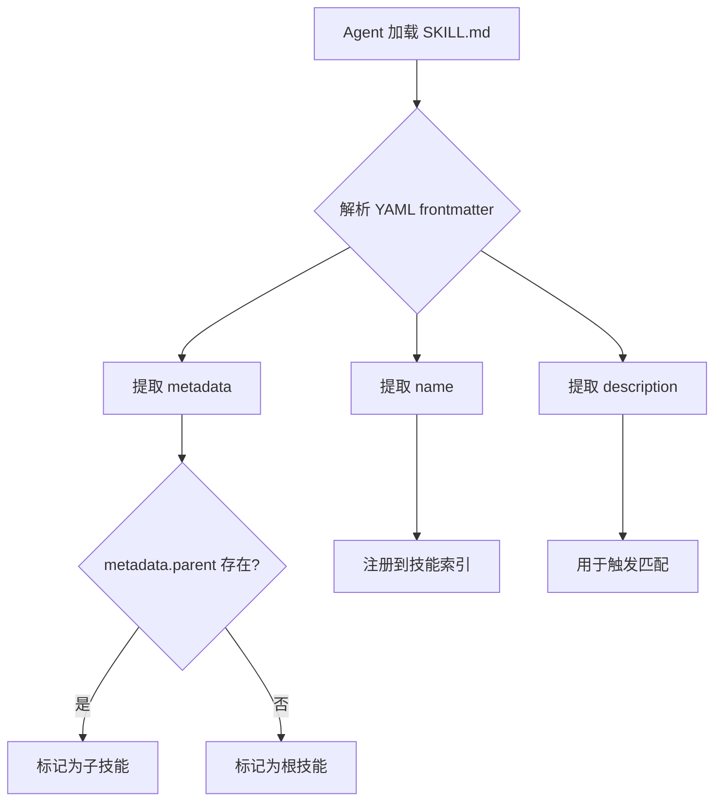
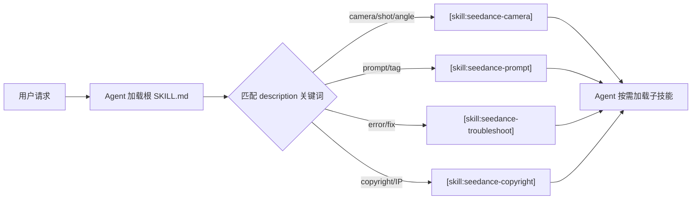

# PD-246.01 seedance-2.0 — SKILL.md 模块化技能星座架构

> 文档编号：PD-246.01
> 来源：seedance-2.0 `SKILL.md` + `skills/*/SKILL.md` (21 files, 4356 lines)
> GitHub：https://github.com/Emily2040/seedance-2.0.git
> 问题域：PD-246 模块化技能架构 Modular Skill Architecture
> 状态：可复用方案

---

## 第 1 章 问题与动机

### 1.1 核心问题

AI Agent 的知识体系如何模块化？当一个领域（如 AI 影视制作）涉及 20+ 个子领域（运镜、灯光、角色、音频、版权……），如何让 Agent 按需加载所需知识，而不是一次性灌入全部内容导致 token 浪费和注意力稀释？

传统做法是写一个巨型 prompt 或单一知识文件，但这带来三个问题：
1. **Token 预算爆炸** — 4000+ 行知识全量加载，大部分与当前任务无关
2. **注意力稀释** — LLM 在超长上下文中对关键指令的遵循度下降
3. **跨平台不兼容** — 不同 Agent 平台（Claude Code、Gemini CLI、Cursor 等）的技能加载机制各异

### 1.2 seedance-2.0 的解法概述

seedance-2.0 将 AI 影视制作的完整知识体系拆分为 1 个根技能 + 20 个子技能的"星座架构"（Skill Constellation），每个子技能是一个独立的 SKILL.md 文件，遵循 AgentSkills 开放标准：

1. **75 行根路由器** — 根 `SKILL.md` 仅 80 行（`SKILL.md:1-80`），只做技能索引和路由，不包含任何领域知识
2. **`metadata.parent` 父子绑定** — 每个子技能通过 YAML frontmatter 中的 `metadata.parent: seedance-20` 声明归属（`skills/seedance-camera/SKILL.md:8`）
3. **`[skill:name]` 跨技能路由** — 技能间通过 `[skill:seedance-camera]` 语法互相引用，Agent 按需加载目标技能（`skills/seedance-prompt/SKILL.md:26-29`）
4. **`[ref:name]` 静态资源引用** — 非技能的参考资料通过 `[ref:platform-constraints]` 引用（`SKILL.md:69`）
5. **10+ 平台兼容声明** — 每个技能在 metadata 中声明所有支持平台的安装路径和 emoji（`SKILL.md:22-33`）

### 1.3 设计思想

| 设计原则 | 具体实现 | 理由 | 替代方案 |
|----------|----------|------|----------|
| 根精简原则 | 根 SKILL.md 仅 80 行，只含路由表 | 首次加载成本最低，Agent 快速理解全局 | 根文件包含摘要（增加首次加载 token） |
| 单一职责 | 每个子技能独立可用，有明确 Scope/Out-of-scope | 避免知识耦合，支持独立加载 | 按功能分组合并（减少文件数但增加单文件体积） |
| 声明式元数据 | YAML frontmatter 统一 name/description/tags/metadata | 机器可解析，支持自动发现和注册 | JSON 配置文件（需额外解析步骤） |
| 跨技能路由 | `[skill:name]` 语法 + Out-of-scope 边界声明 | Agent 知道何时该加载另一个技能 | 全量加载所有技能（token 浪费） |
| 多平台兼容 | metadata 中声明 10 个平台的 emoji 和 homepage | 一套技能适配所有主流 Agent 平台 | 每个平台维护独立版本（维护成本 10x） |

---

## 第 2 章 源码实现分析

### 2.1 架构概览

seedance-2.0 的技能星座由 21 个 SKILL.md 文件组成，总计 4356 行，分为四个功能层：

```
                    ┌─────────────────────────┐
                    │   Root Router (80 lines) │
                    │      SKILL.md            │
                    │  [skill:*] routing table │
                    └────────┬────────────────┘
                             │
            ┌────────────────┼────────────────┐
            │                │                │
    ┌───────▼──────┐ ┌──────▼───────┐ ┌──────▼───────┐
    │ Core Pipeline │ │ Content QA   │ │ Vocabulary   │
    │ 12 skills     │ │ 2 skills     │ │ 6 skills     │
    │ interview     │ │ copyright    │ │ vocab-zh     │
    │ prompt        │ │ antislop     │ │ vocab-ja     │
    │ camera        │ │              │ │ vocab-ko     │
    │ motion        │ │              │ │ vocab-es     │
    │ lighting      │ │              │ │ vocab-ru     │
    │ characters    │ │              │ │ examples-zh  │
    │ style         │ │              │ │              │
    │ vfx           │ └──────────────┘ └──────────────┘
    │ audio         │
    │ pipeline      │        ┌──────────────┐
    │ recipes       │        │ References   │
    │ troubleshoot  │        │ 5 .md files  │
    └───────────────┘        │ [ref:*]      │
                             └──────────────┘
```

### 2.2 核心实现

#### 2.2.1 YAML Frontmatter 元数据标准



对应源码 `skills/seedance-camera/SKILL.md:1-8`：

```yaml
---
name: seedance-camera
description: 'Specify camera movement, shot framing, multi-shot sequences,
  and anti-drift locks for Seedance 2.0. Covers dolly, crane, orbit,
  push-in, one-take, and storyboard reference methods. Use when writing
  camera instructions, shooting a scene with a specific angle or movement,
  or fixing a wandering or locked camera.'
license: MIT
user-invocable: true
user-invokable: true
tags: ["camera", "cinematography", "framing", "openclaw", "antigravity",
       "gemini-cli", "codex", "cursor"]
metadata: {"version": "3.7.0", "updated": "2026-02-26",
  "openclaw": {"emoji": "🎥", "homepage": "..."},
  "parent": "seedance-20",
  "antigravity": {"emoji": "🎥", "homepage": "..."},
  "author": "Emily (@iamemily2050)"}
---
```

关键字段规范（`README.md:281-288`）：
- `name` — 小写、连字符分隔、无点无空格
- `description` — 单引号包裹、动词开头、包含 WHEN 触发短语
- `user-invocable: true` + `user-invokable: true` — 双拼写兼容
- `metadata.parent: seedance-20` — 所有 20 个子技能必须声明

#### 2.2.2 根技能路由表设计



对应源码 `SKILL.md:53-65`：

```markdown
**Core pipeline**
[skill:seedance-interview] · [skill:seedance-prompt] ·
[skill:seedance-camera] · [skill:seedance-motion] ·
[skill:seedance-lighting] · [skill:seedance-characters] ·
[skill:seedance-style] · [skill:seedance-vfx] ·
[skill:seedance-audio] · [skill:seedance-pipeline] ·
[skill:seedance-recipes] · [skill:seedance-troubleshoot]

**Content quality**
[skill:seedance-copyright] · [skill:seedance-antislop]

**Vocabulary**
[skill:seedance-vocab-zh] · [skill:seedance-vocab-ja] ·
[skill:seedance-vocab-ko] · [skill:seedance-vocab-es] ·
[skill:seedance-vocab-ru]
```

根技能的设计极其精简：80 行中包含平台兼容表、技能路由表、参考资料索引和版本历史，不包含任何领域知识内容。

#### 2.2.3 跨技能路由与边界声明

每个子技能通过 Scope / Out-of-scope 和 Routing 三段式声明自己的职责边界和路由出口。

对应源码 `skills/seedance-camera/SKILL.md:15-29`：

```markdown
## Scope
- Camera contract (framing + movement + speed + angle)
- Reliable phrasing for every camera move
- Multi-shot within one clip
- One-take (一镜到底) spatial journey technique

## Out of scope
- Motion timing and beat density — see [skill:seedance-motion]
- Character staying consistent across shots — see [skill:seedance-characters]
- Fight choreography camera — see [skill:seedance-motion]
```

对应源码 `skills/seedance-pipeline/SKILL.md:113-117`：

```markdown
## Routing
For prompt issues → [skill:seedance-prompt]
For camera/storyboard → [skill:seedance-camera]
For QA / errors → [skill:seedance-troubleshoot]
```

### 2.3 实现细节

#### 多平台兼容声明

每个技能的 metadata 中为每个支持平台声明独立的 emoji 和 homepage（`skills/seedance-pipeline/SKILL.md:8`）：

```json
{
  "openclaw": {"emoji": "🔗", "homepage": "..."},
  "antigravity": {"emoji": "🔗", "homepage": "..."},
  "gemini-cli": {"emoji": "🔗", "homepage": "..."},
  "firebase": {"emoji": "🔗", "homepage": "..."}
}
```

根 SKILL.md 中还提供了 10 个平台的安装路径表（`SKILL.md:22-33`），以及一键安装命令（`SKILL.md:37-51`）。

#### 技能体积分布

| 类别 | 技能数 | 平均行数 | 总行数 | 占比 |
|------|--------|----------|--------|------|
| Core Pipeline | 12 | 182 | 2186 | 50% |
| Content QA | 2 | 348 | 696 | 16% |
| Vocabulary | 6 | 228 | 1369 | 31% |
| Root Router | 1 | 80 | 80 | 2% |
| References | 5 | — | ~225 | 5% |

根路由器仅占总体积的 2%，Agent 首次加载只需读取 80 行即可理解全局并路由到正确的子技能。

#### 版本同步策略

所有 21 个 SKILL.md 文件统一使用 `metadata.version: "3.7.0"` 和 `metadata.updated: "2026-02-26"`（`CHANGELOG.md:26`），确保版本一致性。版本变更通过 CHANGELOG.md 追踪，遵循 SemVer 规范。
