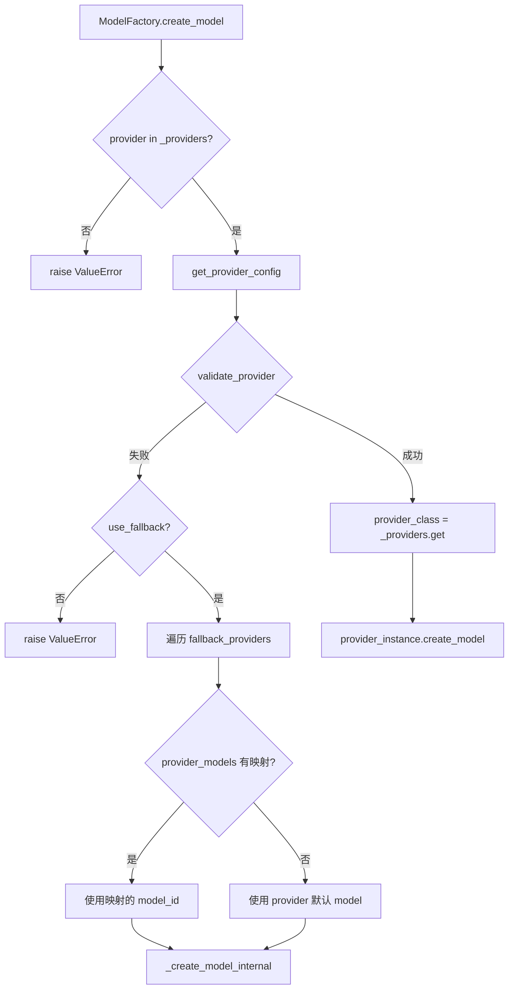

# PD-247.01 ValueCell — 9 Provider ModelFactory 统一抽象与三层配置

> 文档编号：PD-247.01
> 来源：ValueCell `python/valuecell/adapters/models/factory.py`
> GitHub：https://github.com/ValueCell-ai/valuecell.git
> 问题域：PD-247 多 LLM Provider 抽象 Multi-LLM Provider Abstraction
> 状态：可复用方案

---

## 第 1 章 问题与动机

### 1.1 核心问题

在多 Agent 系统中，不同 Agent 可能需要使用不同的 LLM 提供商（OpenAI、Google、Azure、国产模型等），且同一 Agent 在不同部署环境下可能需要切换 Provider。核心挑战包括：

1. **Provider 碎片化**：每个 Provider 的 SDK 接口不同（OpenAI 用 `api_key`，Azure 需要 `endpoint` + `deployment_name`，Ollama 无需 key），直接耦合会导致业务代码中充斥 if-else 分支
2. **配置层级冲突**：开发者预设的默认模型、用户的 API Key 偏好、CI/CD 运行时覆盖三者需要有清晰的优先级
3. **Fallback 可靠性**：主 Provider 不可用时需要自动降级到备选 Provider，且不同 Provider 的模型 ID 不通用（如 OpenRouter 用 `google/gemini-2.5-flash`，Google 原生用 `gemini-2.5-flash`）
4. **Embedding 与 LLM 双轨**：不是所有 Provider 都支持 Embedding，需要独立的 Embedding Provider 发现和 Fallback 机制

### 1.2 ValueCell 的解法概述

ValueCell 构建了一套完整的三层架构来解决上述问题：

1. **ModelProvider 抽象基类** — 定义 `create_model()` + `create_embedder()` 双接口，9 个具体 Provider 类各自封装 SDK 差异（`factory.py:19-588`）
2. **ModelFactory 注册表** — 静态字典 `_providers` 映射 provider 名到类，支持运行时 `register_provider()` 扩展（`factory.py:590-612`）
3. **三层配置系统** — YAML（开发者默认）→ .env（用户偏好）→ 环境变量（运行时覆盖），由 ConfigLoader 的 `_resolve_env_vars` + `_apply_env_overrides` 实现（`loader.py:67-173`）
4. **自动 Fallback 链** — `create_model()` 失败时遍历 `fallback_providers`，结合 `provider_models` 映射自动选择对应模型 ID（`factory.py:634-729`）
5. **Embedding Provider 自动发现** — `_find_embedding_provider()` 优先检查主 Provider 是否支持 Embedding，否则扫描所有 enabled Provider（`factory.py:1071-1098`）

### 1.3 设计思想

| 设计原则 | 具体实现 | 理由 | 替代方案 |
|----------|----------|------|----------|
| 策略模式 | ModelProvider ABC + 9 个具体类 | 每个 Provider SDK 差异大，策略模式隔离变化 | 单一类 + if-else 分支（不可维护） |
| 配置优先级链 | YAML < .env < env var 三层覆盖 | 开发/用户/运行时三种角色各有配置需求 | 单一 .env 文件（不够灵活） |
| 注册表模式 | `_providers` 静态字典 + `register_provider()` | 新 Provider 只需加一个类 + 一行注册 | 工厂方法 switch-case（扩展需改工厂） |
| 单例 + 缓存 | ConfigLoader/ConfigManager/ModelFactory 均为单例 | 避免重复加载 YAML 和创建连接 | 每次创建新实例（性能浪费） |
| per-agent 模型绑定 | agent YAML 中 `provider_models` 字段 | 不同 Provider 的模型 ID 不通用 | 全局统一模型 ID（不现实） |

---

## 第 2 章 源码实现分析

### 2.1 架构概览

ValueCell 的多 Provider 抽象分为三层：配置层（ConfigLoader → ConfigManager）、工厂层（ModelFactory）、Provider 层（9 个 ModelProvider 子类）。

```
┌─────────────────────────────────────────────────────────────┐
│                    Application Layer                         │
│  get_model() / create_model_for_agent() / get_embedder()    │
└──────────────────────────┬──────────────────────────────────┘
                           │
┌──────────────────────────▼──────────────────────────────────┐
│                    ModelFactory (Singleton)                   │
│  ┌─────────────────────────────────────────────────────┐    │
│  │ _providers: Dict[str, type[ModelProvider]]           │    │
│  │   openrouter → OpenRouterProvider                    │    │
│  │   google     → GoogleProvider                        │    │
│  │   azure      → AzureProvider                         │    │
│  │   siliconflow→ SiliconFlowProvider                   │    │
│  │   openai     → OpenAIProvider                        │    │
│  │   openai-compatible → OpenAICompatibleProvider        │    │
│  │   deepseek   → DeepSeekProvider                      │    │
│  │   dashscope  → DashScopeProvider                     │    │
│  │   ollama     → OllamaProvider                        │    │
│  └─────────────────────────────────────────────────────┘    │
│  create_model() ──→ _create_model_internal()                │
│  create_embedder() ──→ _create_embedder_internal()          │
│  create_model_for_agent() ──→ AgentConfig → create_model()  │
└──────────────────────────┬──────────────────────────────────┘
                           │
┌──────────────────────────▼──────────────────────────────────┐
│              ConfigManager (Singleton)                        │
│  primary_provider → 三级优先级自动选择                         │
│  fallback_providers → 自动排除 primary 的 enabled 列表        │
│  get_provider_config() → ProviderConfig dataclass            │
│  get_agent_config() → AgentConfig dataclass                  │
└──────────────────────────┬──────────────────────────────────┘
                           │
┌──────────────────────────▼──────────────────────────────────┐
│              ConfigLoader (Singleton)                         │
│  YAML files ← _resolve_env_vars() ← _apply_env_overrides() │
│  providers/*.yaml  agents/*.yaml  config.yaml                │
└─────────────────────────────────────────────────────────────┘
```

### 2.2 核心实现

#### 2.2.1 Provider 注册表与策略分发



对应源码 `python/valuecell/adapters/models/factory.py:590-612`：

```python
class ModelFactory:
    # Registry of provider classes
    _providers: Dict[str, type[ModelProvider]] = {
        "openrouter": OpenRouterProvider,
        "google": GoogleProvider,
        "azure": AzureProvider,
        "siliconflow": SiliconFlowProvider,
        "openai": OpenAIProvider,
        "openai-compatible": OpenAICompatibleProvider,
        "deepseek": DeepSeekProvider,
        "dashscope": DashScopeProvider,
        "ollama": OllamaProvider,
    }

    def register_provider(self, name: str, provider_class: type[ModelProvider]):
        self._providers[name] = provider_class
        logger.info(f"Registered custom provider: {name}")
```

#### 2.2.2 三层配置覆盖系统

```mermaid
graph TD
    A[load_agent_config] --> B[读取 agent YAML 文件]
    B --> C[_resolve_env_vars: 解析 YAML 中的 ${VAR:default}]
    C --> D{有 env_overrides 映射?}
    D -->|是| E[_apply_env_overrides: 按路径覆盖]
    D -->|否| F[返回配置]
    E --> F
    G[ConfigManager.get_agent_config] --> H[loader.load_agent_config]
    H --> I[提取 models.primary]
    I --> J{model_id 为空?}
    J -->|是| K[使用 provider 默认模型]
    J -->|否| L[合并 global defaults + agent params]
    K --> L
    L --> M[返回 AgentConfig]
```

对应源码 `python/valuecell/config/loader.py:67-100`（环境变量解析）：

```python
def _resolve_env_vars(self, value: Any) -> Any:
    if isinstance(value, str):
        # Pattern: ${VAR_NAME} or ${VAR_NAME:default_value}
        pattern = r"\$\{([^}:]+)(?::([^}]*))?\}"

        def replacer(match):
            var_name = match.group(1)
            default_value = match.group(2) if match.group(2) is not None else ""
            resolved = os.getenv(var_name, default_value)
            return resolved

        return re.sub(pattern, replacer, value)
    elif isinstance(value, dict):
        return {k: self._resolve_env_vars(v) for k, v in value.items()}
    elif isinstance(value, list):
        return [self._resolve_env_vars(item) for item in value]
    return value
```

对应源码 `python/valuecell/config/loader.py:130-173`（环境变量覆盖）：

```python
def _apply_env_overrides(self, config: Dict, env_overrides_map=None) -> Dict:
    if not env_overrides_map:
        env_overrides_map = config.get("env_overrides", {})
    result = config.copy()
    for env_var, config_path in env_overrides_map.items():
        env_value = os.getenv(env_var)
        if env_value is not None:
            keys = config_path.split(".")
            current = result
            for key in keys[:-1]:
                if key not in current:
                    current[key] = {}
                current = current[key]
            final_key = keys[-1]
            current[final_key] = self._convert_env_value(env_value)
    return result
```

### 2.3 实现细节

#### Provider 自动选择优先级

ConfigManager 的 `primary_provider` 属性实现了三级优先级（`manager.py:98-160`）：

1. `PRIMARY_PROVIDER` 环境变量（最高优先级）
2. 自动检测：按 `preferred_order` 列表扫描有 API Key 的 Provider
3. config.yaml 中的 `primary_provider` 默认值

自动检测的优先顺序为：openrouter → siliconflow → google → openai → openai-compatible → azure → ollama。

#### per-agent 模型映射与 Fallback

Agent YAML 中的 `provider_models` 字段解决了跨 Provider 模型 ID 不通用的问题。例如 `research_agent.yaml:14-17`：

```yaml
provider_models:
  siliconflow: "Qwen/Qwen3-235B-A22B-Thinking-2507"
  google: "gemini-2.5-flash"
```

当 OpenRouter 不可用时，`create_model_for_agent()` 会查找 `provider_models[fallback_provider]` 获取对应的模型 ID，而非盲目使用原始 model_id（`factory.py:838-877`）。

#### Embedding 双轨机制

Embedding 和 LLM 使用独立的 Fallback 链。`_find_embedding_provider()` 先检查主 Provider 是否有 `default_embedding_model`，否则扫描所有 enabled Provider（`factory.py:1071-1098`）。Agent 可以独立配置 Embedding Provider，如 research_agent 使用 SiliconFlow 做 Embedding 而用 OpenRouter 做推理。


---

## 第 3 章 迁移指南

### 3.1 迁移清单

**阶段 1：基础架构（必须）**

- [ ] 定义 `ModelProvider` 抽象基类，包含 `create_model()` 和 `create_embedder()` 两个抽象方法
- [ ] 为每个需要支持的 Provider 实现具体子类
- [ ] 创建 `ModelFactory`，内含 `_providers` 注册表字典
- [ ] 实现 `_create_model_internal()` 内部方法，封装 Provider 实例化 + 模型创建

**阶段 2：配置系统（推荐）**

- [ ] 设计 YAML 配置结构：`config.yaml`（全局）+ `providers/*.yaml`（每 Provider）+ `agents/*.yaml`（每 Agent）
- [ ] 实现 ConfigLoader 的 `_resolve_env_vars()`（支持 `${VAR:default}` 语法）
- [ ] 实现 `_apply_env_overrides()`（按 dot-path 覆盖配置值）
- [ ] 实现 ConfigManager 的 `primary_provider` 自动检测逻辑

**阶段 3：Fallback 与 Embedding（增强）**

- [ ] 实现 `fallback_providers` 自动构建（排除 primary 的 enabled 列表）
- [ ] 在 Agent YAML 中添加 `provider_models` 字段支持跨 Provider 模型映射
- [ ] 实现 `_find_embedding_provider()` 自动发现 Embedding 支持
- [ ] 实现 `create_embedder_for_agent()` 独立 Embedding Fallback 链

### 3.2 适配代码模板

以下是一个精简版的 Provider 抽象 + Factory 实现，可直接复用：

```python
"""Minimal multi-provider model factory with fallback support."""
from abc import ABC, abstractmethod
from dataclasses import dataclass, field
from typing import Any, Dict, List, Optional
import os
import yaml
import logging

logger = logging.getLogger(__name__)


@dataclass
class ProviderConfig:
    """Provider configuration resolved from YAML + env."""
    name: str
    api_key: Optional[str] = None
    base_url: Optional[str] = None
    default_model: str = ""
    parameters: Dict[str, Any] = field(default_factory=dict)
    default_embedding_model: Optional[str] = None


class ModelProvider(ABC):
    """Abstract base for all LLM providers."""
    def __init__(self, config: ProviderConfig):
        self.config = config

    @abstractmethod
    def create_model(self, model_id: Optional[str] = None, **kwargs):
        """Create a chat/completion model instance."""
        ...

    def create_embedder(self, model_id: Optional[str] = None, **kwargs):
        """Create an embedding model instance (optional)."""
        raise NotImplementedError(f"{self.config.name} does not support embeddings")

    def is_available(self) -> bool:
        return bool(self.config.api_key)


class ModelFactory:
    """Factory with provider registry and automatic fallback."""
    _providers: Dict[str, type] = {}  # Populated by register()

    def __init__(self, primary: str, fallbacks: List[str], configs: Dict[str, ProviderConfig]):
        self.primary = primary
        self.fallbacks = fallbacks
        self.configs = configs

    @classmethod
    def register(cls, name: str, provider_class: type):
        cls._providers[name] = provider_class

    def create_model(self, model_id: Optional[str] = None,
                     provider: Optional[str] = None,
                     provider_models: Optional[Dict[str, str]] = None,
                     **kwargs):
        provider = provider or self.primary
        provider_models = provider_models or {}

        # Try primary
        try:
            return self._create(model_id, provider, **kwargs)
        except Exception as e:
            logger.warning(f"Primary provider {provider} failed: {e}")

        # Try fallbacks
        for fb in self.fallbacks:
            if fb == provider:
                continue
            try:
                fb_model = provider_models.get(fb, self.configs[fb].default_model)
                return self._create(fb_model, fb, **kwargs)
            except Exception as fb_err:
                logger.warning(f"Fallback {fb} failed: {fb_err}")

        raise ValueError(f"All providers failed for model creation")

    def _create(self, model_id: Optional[str], provider: str, **kwargs):
        if provider not in self._providers:
            raise ValueError(f"Unknown provider: {provider}")
        cfg = self.configs.get(provider)
        if not cfg:
            raise ValueError(f"No config for provider: {provider}")
        instance = self._providers[provider](cfg)
        return instance.create_model(model_id or cfg.default_model, **kwargs)
```

### 3.3 适用场景

| 场景 | 适用度 | 说明 |
|------|--------|------|
| 多 Agent 系统需要不同模型 | ⭐⭐⭐ | per-agent 配置 + provider_models 映射完美匹配 |
| 需要跨云部署（国内/海外） | ⭐⭐⭐ | 三层配置让同一代码在不同环境用不同 Provider |
| 单 Provider 简单应用 | ⭐ | 架构过重，直接用 SDK 即可 |
| 需要流式响应控制 | ⭐⭐ | Factory 创建模型实例后，流式由 SDK 自身处理 |
| 需要 Embedding + LLM 双轨 | ⭐⭐⭐ | 独立的 Embedding Provider 发现和 Fallback 链 |

---

## 第 4 章 测试用例

```python
"""Tests for ModelFactory multi-provider abstraction."""
import os
import pytest
from unittest.mock import patch, MagicMock
from dataclasses import dataclass, field
from typing import Any, Dict, List, Optional


# --- Minimal stubs mirroring ValueCell's architecture ---

@dataclass
class ProviderConfig:
    name: str
    api_key: Optional[str] = None
    base_url: Optional[str] = None
    default_model: str = ""
    parameters: Dict[str, Any] = field(default_factory=dict)
    default_embedding_model: Optional[str] = None
    enabled: bool = True


class FakeModel:
    def __init__(self, model_id: str, provider: str):
        self.id = model_id
        self.provider = provider


class FakeEmbedder:
    def __init__(self, model_id: str, provider: str):
        self.id = model_id
        self.provider = provider


class TestProviderRegistry:
    """Test provider registration and lookup."""

    def test_register_and_create(self):
        """Registered provider should be discoverable."""
        from abc import ABC, abstractmethod

        class BaseProvider(ABC):
            def __init__(self, config): self.config = config
            @abstractmethod
            def create_model(self, model_id=None, **kw): ...

        class MockProvider(BaseProvider):
            def create_model(self, model_id=None, **kw):
                return FakeModel(model_id or self.config.default_model, "mock")

        registry = {"mock": MockProvider}
        cfg = ProviderConfig(name="mock", api_key="sk-test", default_model="mock-v1")
        provider = registry["mock"](cfg)
        model = provider.create_model()
        assert model.id == "mock-v1"
        assert model.provider == "mock"

    def test_unknown_provider_raises(self):
        """Accessing unregistered provider should raise."""
        registry = {}
        with pytest.raises(KeyError):
            registry["nonexistent"]


class TestThreeTierConfig:
    """Test YAML < .env < env var override chain."""

    def test_env_var_overrides_yaml(self):
        """Environment variable should override YAML default."""
        import re
        yaml_value = "${RESEARCH_AGENT_MODEL_ID:google/gemini-2.5-flash}"
        pattern = r"\$\{([^}:]+)(?::([^}]*))?\}"

        with patch.dict(os.environ, {"RESEARCH_AGENT_MODEL_ID": "openai/gpt-4o"}):
            def replacer(match):
                var_name = match.group(1)
                default = match.group(2) if match.group(2) is not None else ""
                return os.getenv(var_name, default)
            result = re.sub(pattern, replacer, yaml_value)
        assert result == "openai/gpt-4o"

    def test_default_when_env_not_set(self):
        """Should use YAML default when env var is not set."""
        import re
        yaml_value = "${MISSING_VAR:fallback-model}"
        pattern = r"\$\{([^}:]+)(?::([^}]*))?\}"

        with patch.dict(os.environ, {}, clear=True):
            os.environ.pop("MISSING_VAR", None)
            def replacer(match):
                var_name = match.group(1)
                default = match.group(2) if match.group(2) is not None else ""
                return os.getenv(var_name, default)
            result = re.sub(pattern, replacer, yaml_value)
        assert result == "fallback-model"


class TestFallbackChain:
    """Test automatic provider fallback."""

    def test_fallback_on_primary_failure(self):
        """Should try fallback provider when primary fails."""
        call_log = []

        def mock_create(model_id, provider, **kw):
            call_log.append(provider)
            if provider == "openrouter":
                raise ValueError("API key missing")
            return FakeModel(model_id, provider)

        # Simulate fallback logic
        primary = "openrouter"
        fallbacks = ["google", "siliconflow"]
        provider_models = {"google": "gemini-2.5-flash"}

        result = None
        try:
            result = mock_create("qwen/qwen3-max", primary)
        except Exception:
            for fb in fallbacks:
                try:
                    fb_model = provider_models.get(fb, "default-model")
                    result = mock_create(fb_model, fb)
                    break
                except Exception:
                    continue

        assert result is not None
        assert result.provider == "google"
        assert result.id == "gemini-2.5-flash"
        assert call_log == ["openrouter", "google"]

    def test_all_providers_fail_raises(self):
        """Should raise when all providers fail."""
        def always_fail(model_id, provider, **kw):
            raise ValueError(f"{provider} unavailable")

        primary = "openrouter"
        fallbacks = ["google"]
        with pytest.raises(ValueError, match="All providers failed"):
            try:
                always_fail("model", primary)
            except Exception:
                for fb in fallbacks:
                    try:
                        always_fail("model", fb)
                        break
                    except Exception:
                        continue
                else:
                    raise ValueError("All providers failed")


class TestEmbeddingAutoDiscovery:
    """Test embedding provider auto-selection."""

    def test_prefer_primary_with_embedding(self):
        """Should prefer primary provider if it has embedding support."""
        providers = {
            "openrouter": ProviderConfig(name="openrouter", api_key="sk-1",
                                         default_embedding_model="qwen3-emb"),
            "google": ProviderConfig(name="google", api_key="sk-2",
                                     default_embedding_model="gemini-emb"),
        }
        primary = "openrouter"
        cfg = providers[primary]
        assert cfg.default_embedding_model is not None
        selected = primary  # Primary has embedding → use it
        assert selected == "openrouter"

    def test_fallback_to_other_embedding_provider(self):
        """Should find another provider if primary lacks embedding."""
        providers = {
            "deepseek": ProviderConfig(name="deepseek", api_key="sk-1",
                                       default_embedding_model=None),
            "google": ProviderConfig(name="google", api_key="sk-2",
                                     default_embedding_model="gemini-emb"),
        }
        primary = "deepseek"
        selected = None
        if providers[primary].default_embedding_model:
            selected = primary
        else:
            for name, cfg in providers.items():
                if cfg.default_embedding_model and cfg.api_key:
                    selected = name
                    break
        assert selected == "google"
```


---

## 第 5 章 跨域关联

| 关联域 | 关系类型 | 说明 |
|--------|----------|------|
| PD-01 上下文管理 | 协同 | 不同 Provider 的 max_tokens 限制不同，模型选择直接影响上下文窗口策略 |
| PD-02 多 Agent 编排 | 依赖 | per-agent 模型绑定是编排层的基础设施，每个 Agent 通过 `create_model_for_agent()` 获取专属模型 |
| PD-03 容错与重试 | 协同 | ModelFactory 的 Fallback 链本身就是容错机制，与上层重试策略互补 |
| PD-06 记忆持久化 | 协同 | Embedding Provider 自动发现为 RAG 知识库提供向量化能力 |
| PD-11 可观测性 | 协同 | 每次 Provider 切换和 Fallback 都有 loguru 日志记录，可接入成本追踪 |

---

## 第 6 章 来源文件索引

| 文件 | 行范围 | 关键实现 |
|------|--------|----------|
| `python/valuecell/adapters/models/factory.py` | L19-81 | ModelProvider 抽象基类（create_model + create_embedder + is_available） |
| `python/valuecell/adapters/models/factory.py` | L83-588 | 9 个具体 Provider 实现（OpenRouter/Google/Azure/SiliconFlow/OpenAI/OpenAI-Compatible/DeepSeek/DashScope/Ollama） |
| `python/valuecell/adapters/models/factory.py` | L590-612 | ModelFactory 注册表 `_providers` 字典 |
| `python/valuecell/adapters/models/factory.py` | L634-729 | `create_model()` 含 Fallback 链逻辑 |
| `python/valuecell/adapters/models/factory.py` | L793-877 | `create_model_for_agent()` per-agent 模型绑定 |
| `python/valuecell/adapters/models/factory.py` | L994-1069 | `create_embedder()` 含 Embedding Fallback |
| `python/valuecell/adapters/models/factory.py` | L1071-1098 | `_find_embedding_provider()` 自动发现 |
| `python/valuecell/config/loader.py` | L38-66 | ConfigLoader 初始化与缓存 |
| `python/valuecell/config/loader.py` | L67-100 | `_resolve_env_vars()` 环境变量解析（支持 `${VAR:default}`） |
| `python/valuecell/config/loader.py` | L130-173 | `_apply_env_overrides()` 按 dot-path 覆盖配置 |
| `python/valuecell/config/loader.py` | L289-330 | `load_agent_config()` 三层覆盖完整流程 |
| `python/valuecell/config/manager.py` | L22-36 | ProviderConfig dataclass（含 embedding 字段） |
| `python/valuecell/config/manager.py` | L48-63 | AgentModelConfig dataclass（含 provider_models 映射） |
| `python/valuecell/config/manager.py` | L98-160 | `primary_provider` 三级优先级自动选择 |
| `python/valuecell/config/manager.py` | L162-190 | `fallback_providers` 自动构建 |
| `python/valuecell/config/manager.py` | L356-377 | `get_enabled_providers()` API Key 校验 |
| `python/valuecell/utils/model.py` | L32-138 | `describe_model()` + `model_should_use_json_mode()` 模型能力探测 |
| `python/valuecell/utils/model.py` | L141-199 | `get_model()` 便捷函数（env_key 覆盖） |
| `python/configs/config.yaml` | L1-67 | 全局配置：Provider 注册表 + Agent 注册表 |
| `python/configs/providers/openrouter.yaml` | L1-64 | OpenRouter Provider 配置（含 Embedding） |
| `python/configs/agents/research_agent.yaml` | L1-47 | Research Agent 配置（含 provider_models + env_overrides） |
| `python/valuecell/config/constants.py` | L7-11 | PROJECT_ROOT 和 CONFIG_DIR 路径常量 |

---

## 第 7 章 横向对比维度

```json comparison_data
{
  "project": "ValueCell",
  "dimensions": {
    "Provider 数量": "9 种（OpenRouter/Google/Azure/SiliconFlow/OpenAI/OpenAI-Compatible/DeepSeek/DashScope/Ollama）",
    "注册方式": "静态字典 _providers + register_provider() 运行时扩展",
    "配置层级": "三层：YAML（开发者默认）→ .env（用户偏好）→ 环境变量（运行时覆盖）",
    "Fallback 策略": "自动遍历 enabled providers + provider_models 跨 Provider 模型 ID 映射",
    "Embedding 支持": "独立 Embedding Provider 自动发现 + 双轨 Fallback 链",
    "per-agent 绑定": "agent YAML 中 provider_models 字段实现跨 Provider 模型映射"
  }
}
```

### 域元数据补充

```json domain_metadata
{
  "solution_summary": "ValueCell 用 ModelProvider ABC + 9 具体类注册表实现统一 Provider 抽象，三层配置（YAML+.env+env var）驱动 per-agent 模型绑定与自动 Fallback 链",
  "description": "统一 LLM/Embedding 双轨 Provider 抽象与配置驱动的自动降级",
  "sub_problems": [
    "Embedding 与 LLM 使用不同 Provider 时的独立 Fallback",
    "跨 Provider 模型 ID 不通用的映射问题",
    "OpenAI-Compatible API 的 role 兼容性处理"
  ],
  "best_practices": [
    "用 provider_models 字段为每个 Agent 预配置跨 Provider 模型映射",
    "Embedding Provider 独立于 LLM Provider 进行自动发现和 Fallback",
    "三层配置中 YAML 用 ${VAR:default} 语法支持带默认值的环境变量注入"
  ]
}
```

