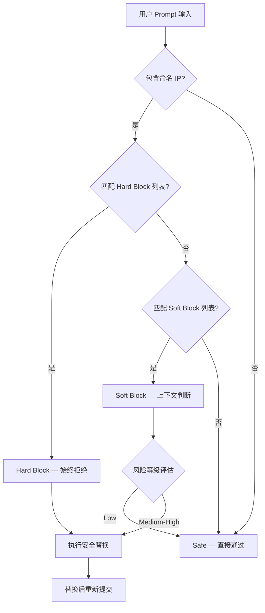
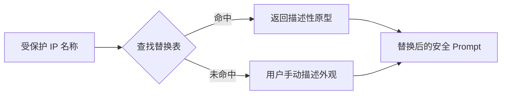
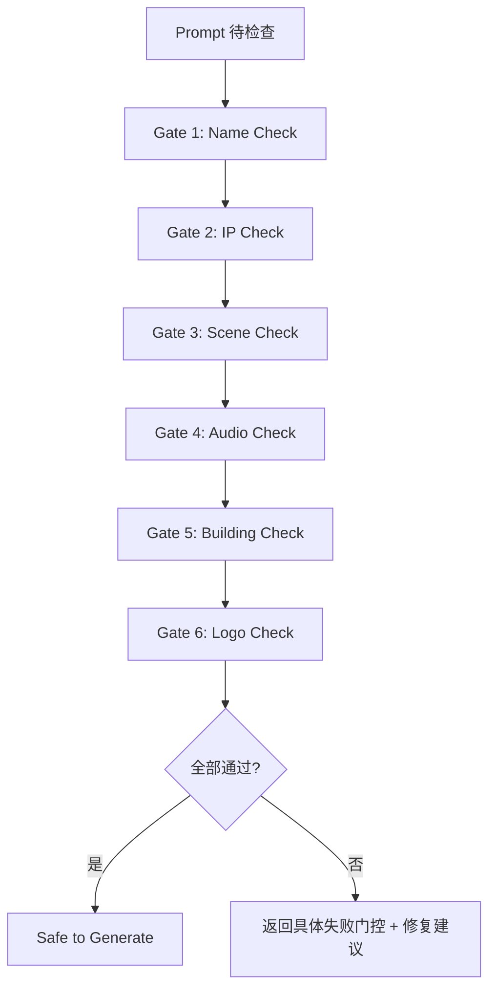

# PD-247.01 seedance-2.0 — Skill 驱动 IP 合规门控与安全替换体系

> 文档编号：PD-247.01
> 来源：seedance-2.0 `skills/seedance-copyright/SKILL.md` `skills/seedance-troubleshoot/SKILL.md`
> GitHub：https://github.com/Emily2040/seedance-2.0.git
> 问题域：PD-247 IP 合规治理 IP Compliance Governance
> 状态：可复用方案

---

## 第 1 章 问题与动机

### 1.1 核心问题

AI 视频生成模型（如 ByteDance Seedance 2.0）在 2026 年 2 月遭遇了前所未有的 IP 执法风暴：Disney、Paramount Skydance、Netflix、MPA（美国电影协会）和 SAG-AFTRA 在模型发布后数天内集体发出停止侵权函。Disney 称其为"虚拟抢劫"（virtual smash-and-grab），Netflix 称其为"高速盗版引擎"（high-speed piracy engine）。日本政府同步启动监管调查。

这一事件暴露了 AI 生成系统的核心合规缺陷：**模型本身不理解 IP 边界**。用户输入 "Spider-Man fighting Captain America" 时，模型会忠实执行——直到内容过滤器拦截。但过滤器是事后补救，不是设计时的合规架构。

seedance-2.0 项目的 `seedance-copyright` 技能提出了一种**预生成合规门控**方案：在 prompt 提交给模型之前，通过 6 道结构化检查拦截所有 IP 风险，并提供安全替换映射表将受保护 IP 转化为描述性原型。

### 1.2 seedance-2.0 的解法概述

1. **实时执法数据库**：维护 Disney/Paramount/MPA/SAG-AFTRA 等机构的活跃执法状态，标注具体被引用的侵权案例（`skills/seedance-copyright/SKILL.md:61-75`）
2. **三级内容分类**：Hard Blocks（始终拒绝）、Soft Blocks（上下文相关）、Safe（可通过），覆盖 13 个 IP 类别（`skills/seedance-copyright/SKILL.md:39-57`）
3. **安全替换映射表**：将 40+ 个受保护 IP 映射为纯描述性原型，覆盖影视/动漫/游戏/品牌/建筑/音乐 6 大类（`skills/seedance-copyright/SKILL.md:95-227`）
4. **6 道预生成门控**：Name/IP/Scene/Audio/Building/Logo 六维检查，全部通过才允许生成（`skills/seedance-copyright/SKILL.md:263-274`）
5. **跨技能联动**：copyright 检查结果路由到 troubleshoot（故障诊断）、prompt（提示词构建）、characters（角色管理）等技能（`skills/seedance-copyright/SKILL.md:288-293`）

### 1.3 设计思想

| 设计原则 | 具体实现 | 理由 | 替代方案 |
|----------|----------|------|----------|
| 描述外观而非名称 | "red-and-gold powered exoskeleton" 替代 "Iron Man" | 模型不阻止概念/美学/原型，只阻止命名的受保护身份 | 直接使用名称 + 事后过滤（不可靠） |
| 预生成门控优于事后过滤 | 6 道检查在 prompt 提交前执行 | 事后过滤浪费算力且用户体验差（生成后被拒） | 依赖平台内置过滤器（不透明、不可控） |
| 执法数据实时更新 | 记录具体法律行动日期和涉及方 | IP 执法是动态的，2 月 15 日后过滤阈值大幅提高 | 静态规则表（很快过时） |
| 美学借鉴与直接复制的边界 | 允许 "washed-out teal-orange color grade" 但禁止 "recreate the Pulp Fiction diner scene" | 视觉语法是公共领域，具体场景是受保护的 | 全面禁止任何风格参考（过度限制） |
| 模块化技能架构 | copyright 作为独立 skill 可被其他 skill 引用 | 合规逻辑集中维护，避免散落在各处 | 每个 skill 各自实现 IP 检查（重复且不一致） |

---

## 第 2 章 源码实现分析

### 2.1 架构概览

seedance-2.0 的 IP 合规体系采用**分布式技能协作**架构，以 `seedance-copyright` 为核心，通过 `[skill:xxx]` 引用机制与其他 14 个技能联动：

```
┌─────────────────────────────────────────────────────────┐
│                    用户输入 Prompt                        │
└──────────────────────┬──────────────────────────────────┘
                       ▼
┌──────────────────────────────────────────────────────────┐
│              seedance-copyright（核心门控）                │
│  ┌──────────┐ ┌──────────┐ ┌──────────┐ ┌──────────┐   │
│  │ Name     │ │ IP       │ │ Scene    │ │ Audio    │   │
│  │ Check    │ │ Check    │ │ Check    │ │ Check    │   │
│  └──────────┘ └──────────┘ └──────────┘ └──────────┘   │
│  ┌──────────┐ ┌──────────┐                              │
│  │ Building │ │ Logo     │                              │
│  │ Check    │ │ Check    │                              │
│  └──────────┘ └──────────┘                              │
│                                                          │
│  ┌──────────────────────────────────────────────────┐   │
│  │ Safe Substitution Table（40+ IP → 描述性原型）    │   │
│  └──────────────────────────────────────────────────┘   │
│                                                          │
│  ┌──────────────────────────────────────────────────┐   │
│  │ Live Enforcement DB（Disney/Paramount/MPA/SAG）   │   │
│  └──────────────────────────────────────────────────┘   │
└──────────────────────┬──────────────────────────────────┘
                       ▼
          ┌────────────┼────────────┐
          ▼            ▼            ▼
   seedance-prompt  seedance-    seedance-
   (提示词构建)     characters   troubleshoot
                   (角色管理)    (故障诊断)
```

### 2.2 核心实现

#### 2.2.1 三级内容分类体系



对应源码 `skills/seedance-copyright/SKILL.md:39-92`：

```markdown
## Hard Blocks (Always Refused)

| Category | Examples | Why blocked |
|---|---|---|
| Real human face by name | "Elon Musk", "Taylor Swift" | Right of publicity / likeness rights |
| Named franchise characters | "Iron Man", "Spider-Man", "Darth Vader" | Disney/Marvel IP (cease-and-desist active) |
| Named Pixar / Disney Animation | "Elsa", "Woody", "Wall-E" | Disney IP |
| Named anime characters | "Naruto", "Goku", "Luffy" | Studio/publisher IP + Japan gov investigation |
| Named game characters | "Mario", "Master Chief", "Geralt" | Nintendo/Microsoft/Sony/CD Projekt IP |
| Named streaming originals | "Stranger Things characters" | Netflix IP (cease-and-desist active) |
| Paramount IP | "Shrek", "SpongeBob", "Dora" | Paramount Skydance cease-and-desist active |
| Brand logo visible | Nike swoosh, Apple logo | Trademark infringement |
| Copyrighted scene recreation | Exact shot from a named film | Film studio copyright |
| Named musical composition | "Play Bohemian Rhapsody" | Music publishing rights |
| Deepfake / face-swap request | "Replace face with [celeb]" | Deepfake policy + ByteDance upload block |
```

Hard Blocks 覆盖 13 个类别，每个类别标注了具体的法律依据（如 "cease-and-desist active"），这不是静态规则而是反映了实时执法状态。

#### 2.2.2 安全替换映射表



对应源码 `skills/seedance-copyright/SKILL.md:95-157`：

```markdown
## Safe Substitution Table

### Film & Screen Characters
| ❌ Named IP | ✅ Safe descriptor |
|---|---|
| Iron Man | red-and-gold powered exoskeleton, chest reactor glow |
| Batman | dark armored vigilante, scalloped cape, bat emblem absent |
| Spider-Man | red-and-blue spandex web-shooter acrobat |
| Darth Vader | black full-helmet respirator suit, red energy blade |
| Deadpool | red-and-black tactical suit, masked mercenary, dual katanas on back |

### Anime Characters
| ❌ Named IP | ✅ Safe descriptor |
|---|---|
| Naruto | blond spiky-haired shinobi, orange jumpsuit, whisker scars |
| Goku | dark spiky-haired martial artist, orange gi, muscular |
| Sailor Moon | blonde twin-tailed girl, white sailor uniform, crescent moon |

### Brand & Logo Substitutions
| ❌ Brand reference | ✅ Safe descriptor |
|---|---|
| Nike swoosh | curved checkmark logo on athletic wear |
| Apple logo | silver bitten-fruit icon on laptop |
| Ferrari horse | rearing black horse emblem on red sports car hood |
```

替换表的核心设计原则是**描述视觉特征而非命名身份**。每个替换项提取了角色/品牌的 3-5 个最具辨识度的视觉属性（颜色、形状、材质、配件），足以让模型生成视觉上相似但法律上安全的内容。

#### 2.2.3 6 道预生成门控



对应源码 `skills/seedance-copyright/SKILL.md:263-274`：

```markdown
## The Post-Feb-15 Practical Checklist

Before every generation, run all six gates:

1. **Name check** — Does the prompt contain any real person's name? → Remove.
2. **IP check** — Does it name a franchise, character, or brand? → Substitute with descriptor.
3. **Scene check** — Is it a recreation of a specific copyrighted scene? → Reframe generically.
4. **Audio check** — Does it request a named song or composer's work? → Describe musically.
5. **Building check** — Does it name a potentially protected building? → Use architectural descriptor.
6. **Logo check** — Would the output contain a recognizable logo? → Describe geometry without brand name.

All six clear → safe to generate.
```

### 2.3 实现细节

#### 跨技能路由机制

seedance-copyright 不是孤立运行的，它通过 `[skill:xxx]` 引用机制与整个技能生态联动：

- **troubleshoot 联动**（`skills/seedance-troubleshoot/SKILL.md:94-109`）：当生成被拒时，troubleshoot 技能的 "Output: blocked / refused — IP / copyright" 条目直接引用 copyright 技能的替换表
- **prompt 联动**（`skills/seedance-prompt/SKILL.md:198-214`）：prompt 构建技能内嵌了 copyright 的核心规则摘要和替换示例
- **characters 联动**（`skills/seedance-characters/SKILL.md:158-161`）：角色管理技能要求使用 AI 生成肖像或插画角色参考，而非真人照片
- **antislop 联动**（`skills/seedance-antislop/SKILL.md:76-78`）：反 AI 废话技能识别"安全化过度"导致的平台安全废话（platform safety slop）

#### 美学借鉴边界的精确定义

`skills/seedance-copyright/SKILL.md:231-259` 定义了一个关键的灰色地带——美学借鉴 vs 直接复制：

| 行为 | 判定 | 示例 |
|------|------|------|
| 借鉴视觉语法 | Safe | "washed-out teal-orange color grade, anamorphic lens flare" |
| 重现命名场景 | Blocked | "Recreate the Pulp Fiction diner scene" |
| 使用类型语法 | Safe | "neon-drenched rain-soaked street, cyberpunk dystopia" |
| 引用流媒体世界观 | Blocked | "Stranger Things-style retro-80s supernatural horror" |

这个边界定义的核心洞察是：**视觉语法（色彩、镜头、质感）属于公共领域，但具体场景和世界观属于受保护 IP**。

#### 建筑版权的特殊处理

`skills/seedance-copyright/SKILL.md:201-213` 处理了一个常被忽视的 IP 领域——建筑版权：

- 埃菲尔铁塔白天 = 公共领域，但夜间灯光秀 = 受保护
- 悉尼歌剧院 = 受保护至 ~2067 年
- 卢浮宫金字塔 = 受保护至 2029 年
- 1900 年前建筑 = 公共领域

这种细粒度的时间敏感版权处理在其他 AI 合规方案中极为罕见。
