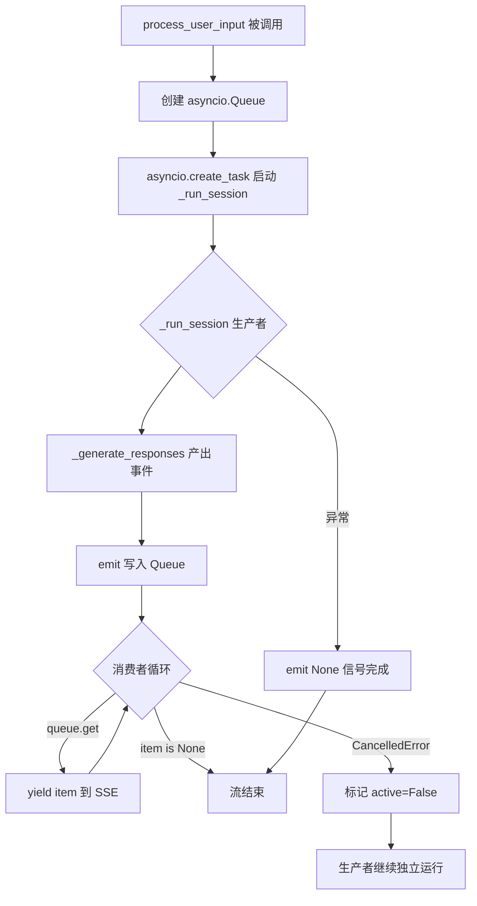
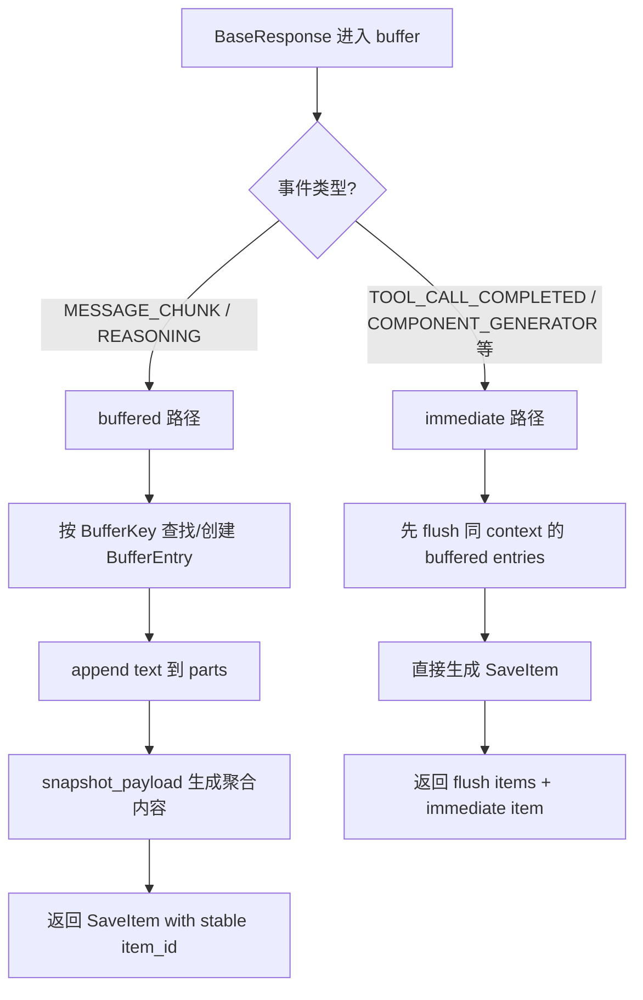
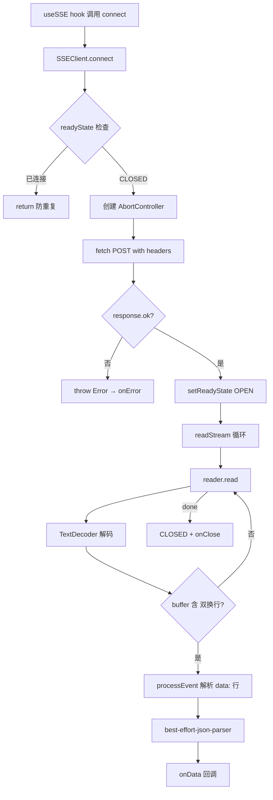

# PD-248.01 ValueCell — AsyncQueue 解耦 SSE 流式架构

> 文档编号：PD-248.01
> 来源：ValueCell `python/valuecell/core/coordinate/orchestrator.py`, `python/valuecell/core/event/buffer.py`, `frontend/src/lib/sse-client.ts`
> GitHub：https://github.com/ValueCell-ai/valuecell.git
> 问题域：PD-248 实时流式通信 Real-time Streaming
> 状态：可复用方案

---

## 第 1 章 问题与动机

### 1.1 核心问题

Agent 系统中，后端 LLM 推理和工具调用是长时间异步过程（数秒到数分钟），前端需要实时展示推理进度、工具调用状态和最终结果。核心挑战：

1. **生产者/消费者生命周期不对称** — 后端 Agent 执行可能持续数分钟，但 SSE 连接可能因网络抖动或用户切换页面而断开。如果生产者（Agent 执行）和消费者（SSE 连接）强耦合，连接断开会导致执行中断。
2. **多事件类型混合流** — 一次 Agent 交互会产生 reasoning、tool_call、message_chunk、task_status 等多种事件，需要统一的事件协议和前端分发机制。
3. **流式 chunk 的段落聚合** — LLM 输出是逐 token 的碎片，直接持久化会产生大量细粒度记录；需要在流式传输的同时做段落级聚合再持久化。

### 1.2 ValueCell 的解法概述

ValueCell 实现了一套完整的 SSE 流式架构，核心设计：

1. **asyncio.Queue 解耦** — `AgentOrchestrator.process_user_input()` 通过 `asyncio.Queue` 将后台 Agent 执行（生产者）与 SSE 连接（消费者）解耦，消费者断开不影响生产者继续执行（`orchestrator.py:98-144`）
2. **四层事件类型体系** — 定义 `SystemResponseEvent`、`StreamResponseEvent`、`TaskStatusEvent`、`CommonResponseEvent` 四个枚举，覆盖从会话创建到任务完成的全生命周期（`types.py:38-78`）
3. **ResponseBuffer 段落聚合** — `ResponseBuffer` 对 `MESSAGE_CHUNK` 和 `REASONING` 事件做内存缓冲，通过 stable `item_id` 实现 upsert 语义，immediate 事件触发 flush（`buffer.py:79-217`）
4. **Fetch-based SSEClient** — 前端用 `fetch + ReadableStream` 替代 `EventSource`，支持 POST 请求和自定义 headers，通过 `best-effort-json-parser` 容忍不完整 JSON（`sse-client.ts:39-256`）
5. **ResponseFactory 工厂模式** — 统一的响应构建工厂，确保所有事件遵循 `BaseResponse { event, data: UnifiedResponseData }` 结构（`factory.py:72-578`）

### 1.3 设计思想

| 设计原则 | 具体实现 | 理由 | 替代方案 |
|----------|----------|------|----------|
| 生产者/消费者解耦 | asyncio.Queue + background task | SSE 断开不中断 Agent 执行 | 直接 yield（连接断开即中断） |
| 统一事件协议 | 4 个 Enum + BaseResponse 基类 | 前后端类型安全，事件可扩展 | 自由格式 JSON（无类型保障） |
| 段落级聚合 | ResponseBuffer + stable item_id | 减少持久化写入，支持 upsert | 逐 chunk 持久化（写放大） |
| POST-based SSE | fetch + ReadableStream | 支持 body 传参和自定义 headers | EventSource（仅 GET，无 headers） |
| 容错 JSON 解析 | best-effort-json-parser | 流式 chunk 可能截断 JSON | JSON.parse（截断即报错） |

---

## 第 2 章 源码实现分析

### 2.1 架构概览

ValueCell 的 SSE 流式架构分为四层：

```
┌─────────────────────────────────────────────────────────────────┐
│                        Frontend Layer                           │
│  SSEClient (fetch+ReadableStream) → useSSE hook → React UI     │
└──────────────────────────┬──────────────────────────────────────┘
                           │ POST /agents/stream
                           │ text/event-stream
┌──────────────────────────▼──────────────────────────────────────┐
│                      API Layer (FastAPI)                         │
│  agent_stream.py → StreamingResponse(generate_stream())         │
└──────────────────────────┬──────────────────────────────────────┘
                           │ async for chunk
┌──────────────────────────▼──────────────────────────────────────┐
│                   Orchestration Layer                            │
│  AgentOrchestrator                                              │
│  ┌──────────┐    asyncio.Queue    ┌──────────────┐              │
│  │ Producer  │ ──── emit() ─────→ │  Consumer     │              │
│  │ _run_     │                    │  process_     │              │
│  │ session() │                    │  user_input() │              │
│  └──────────┘                    └──────────────┘              │
│       │                                                         │
│       ▼                                                         │
│  EventResponseService → ResponseFactory + ResponseBuffer        │
└──────────────────────────┬──────────────────────────────────────┘
                           │ persist
┌──────────────────────────▼──────────────────────────────────────┐
│                   Persistence Layer                              │
│  ConversationService.add_item() → DB                            │
└─────────────────────────────────────────────────────────────────┘
```

### 2.2 核心实现

#### 2.2.1 AsyncQueue 生产者/消费者解耦



对应源码 `python/valuecell/core/coordinate/orchestrator.py:98-144`：

```python
async def process_user_input(
    self, user_input: UserInput
) -> AsyncGenerator[BaseResponse, None]:
    # Per-invocation queue and active flag
    queue: asyncio.Queue[Optional[BaseResponse]] = asyncio.Queue()
    active = {"value": True}

    async def emit(item: Optional[BaseResponse]):
        # Drop emissions if the consumer has gone away
        if not active["value"]:
            return
        try:
            await queue.put(item)
        except Exception:
            pass

    # Start background producer
    asyncio.create_task(self._run_session(user_input, emit))

    try:
        while True:
            item = await queue.get()
            if item is None:
                break
            yield item
    except asyncio.CancelledError:
        active["value"] = False
        raise
    finally:
        active["value"] = False
```

关键设计点：
- `active` 字典用于跨闭包共享可变状态（`orchestrator.py:112`）
- 消费者 `CancelledError` 时标记 `active=False`，但不取消生产者 task（`orchestrator.py:138-141`）
- `emit()` 在 `active=False` 时静默丢弃，避免 Queue 无限增长（`orchestrator.py:116`）
- `_run_session` 结束时发送 `None` 作为终止信号（`orchestrator.py:172`）

#### 2.2.2 ResponseBuffer 段落聚合



对应源码 `python/valuecell/core/event/buffer.py:79-217`：

```python
class ResponseBuffer:
    def __init__(self):
        self._buffers: Dict[BufferKey, BufferEntry] = {}
        self._immediate_events = {
            StreamResponseEvent.TOOL_CALL_COMPLETED,
            CommonResponseEvent.COMPONENT_GENERATOR,
            NotifyResponseEvent.MESSAGE,
            SystemResponseEvent.PLAN_REQUIRE_USER_INPUT,
            SystemResponseEvent.THREAD_STARTED,
        }
        self._buffered_events = {
            StreamResponseEvent.MESSAGE_CHUNK,
            StreamResponseEvent.REASONING,
        }

    def ingest(self, resp: BaseResponse) -> List[SaveItem]:
        data: UnifiedResponseData = resp.data
        ev = resp.event
        ctx = (data.conversation_id, data.thread_id, data.task_id)

        # Immediate: write-through, but flush buffered first
        if ev in self._immediate_events:
            conv_id, th_id, tk_id = ctx
            keys_to_flush = self._collect_task_keys(conv_id, th_id, tk_id)
            out = self._finalize_keys(keys_to_flush)
            out.append(self._make_save_item_from_response(resp))
            return out

        # Buffered: accumulate by (ctx + event)
        if ev in self._buffered_events:
            key: BufferKey = (*ctx, ev)
            entry = self._buffers.get(key) or BufferEntry(...)
            entry.append(text)
            snap = entry.snapshot_payload()
            if snap is not None:
                out.append(self._make_save_item(..., item_id=entry.item_id))
            return out
```

关键设计点：
- `BufferKey = (conversation_id, thread_id, task_id, event)` 四元组唯一标识一个缓冲区（`buffer.py:36`）
- `BufferEntry.item_id` 在创建时生成，后续所有 chunk 共享同一 id，实现 upsert 语义（`buffer.py:58`）
- immediate 事件到达时先 flush 同 context 的 buffered entries，保证持久化顺序（`buffer.py:168-174`）
- `annotate()` 方法在 `emit()` 前调用，将 stable item_id 写入 response.data，前端可据此做增量更新（`buffer.py:107-143`）

#### 2.2.3 Fetch-based SSEClient



对应源码 `frontend/src/lib/sse-client.ts:93-224`：

```python
# TypeScript 源码
private async startConnection(): Promise<void> {
    const response = await fetch(this.options.url, {
        method: "POST",
        body: this.currentBody,
        signal: this.abortController?.signal,
        headers: {
            Accept: "text/event-stream",
            "Cache-Control": "no-cache",
            "Content-Type": "application/json",
            ...this.options.headers,
        },
    });
    // ...
    await this.readStream(response.body);
}

private async readStream(body: ReadableStream<Uint8Array>): Promise<void> {
    const reader = body.getReader();
    const decoder = new TextDecoder();
    let buffer = "";
    while (true) {
        const { done, value } = await reader.read();
        if (done) { this.setReadyState(SSEReadyState.CLOSED); break; }
        buffer += decoder.decode(value, { stream: true });
        let eventEnd = buffer.indexOf("\n\n");
        while (eventEnd !== -1) {
            const eventBlock = buffer.slice(0, eventEnd);
            buffer = buffer.slice(eventEnd + 2);
            if (eventBlock.trim()) this.processEvent(eventBlock);
            eventEnd = buffer.indexOf("\n\n");
        }
    }
}
```

关键设计点：
- 使用 `fetch` 而非 `EventSource`，支持 POST 方法和自定义 headers（`sse-client.ts:101-112`）
- `AbortController` 实现连接超时和手动关闭（`sse-client.ts:83,95-98`）
- `best-effort-json-parser` 容忍流式传输中的不完整 JSON（`sse-client.ts:6,214`）
- `useSSE` hook 用 `handlersRef` 避免 stale closure 问题（`use-sse.ts:37-42`）

### 2.3 实现细节

#### 事件类型体系

ValueCell 定义了四个事件枚举，覆盖完整的 Agent 交互生命周期（`types.py:38-78`）：

| 枚举 | 事件 | 用途 |
|------|------|------|
| SystemResponseEvent | conversation_started, thread_started, plan_require_user_input, plan_failed, system_failed, done | 系统级生命周期 |
| StreamResponseEvent | message_chunk, tool_call_started, tool_call_completed, reasoning_started, reasoning, reasoning_completed | Agent 流式输出 |
| TaskStatusEvent | task_started, task_completed, task_failed, task_cancelled | 任务状态变更 |
| CommonResponseEvent | component_generator | UI 组件生成 |

#### EventResponseService 三合一服务

`EventResponseService`（`service.py:15-81`）整合了三个职责：
1. **ResponseFactory** — 构建类型安全的响应对象
2. **ResponseBuffer** — 段落聚合和 stable item_id 分配
3. **Persistence** — 通过 `ConversationService.add_item()` 持久化

`emit()` 方法是核心入口（`service.py:36-41`）：
```python
async def emit(self, response: BaseResponse) -> BaseResponse:
    annotated = self._buffer.annotate(response)  # 分配 stable item_id
    await self._persist_from_buffer(annotated)    # 聚合 + 持久化
    return annotated                              # 返回带 item_id 的响应
```

#### ExecutionContext 中断恢复

`ExecutionContext`（`orchestrator.py:31-65`）支持 Agent 执行中断后恢复：
- 记录 stage（planning/execution）、conversation_id、user_id
- TTL 过期检查（默认 1 小时，`orchestrator.py:27`）
- 用户身份校验防止跨用户恢复（`orchestrator.py:55-57`）

---

## 第 3 章 迁移指南

### 3.1 迁移清单

#### 阶段 1：后端 SSE 基础设施

- [ ] 定义事件枚举体系（SystemEvent / StreamEvent / TaskEvent）
- [ ] 实现 `BaseResponse` 基类和 `UnifiedResponseData` 统一数据结构
- [ ] 实现 `ResponseFactory` 工厂类，为每种事件提供类型安全的构建方法
- [ ] 创建 FastAPI StreamingResponse 端点，输出 `data: {json}\n\n` 格式

#### 阶段 2：生产者/消费者解耦

- [ ] 在 Orchestrator 中引入 `asyncio.Queue` 解耦模式
- [ ] 实现 `_run_session` 后台任务 + `emit()` 闭包
- [ ] 处理 `CancelledError`：标记 `active=False` 但不取消生产者
- [ ] 实现 `None` 终止信号协议

#### 阶段 3：段落聚合缓冲

- [ ] 实现 `ResponseBuffer`，区分 immediate 和 buffered 事件
- [ ] 实现 `BufferEntry` 的 stable `item_id` 和 `snapshot_payload()`
- [ ] 在 immediate 事件到达时自动 flush 同 context 的 buffered entries
- [ ] 集成 `EventResponseService` 的 `emit()` → `annotate()` → `ingest()` → `persist()` 流水线

#### 阶段 4：前端 SSE 消费

- [ ] 实现 fetch-based SSEClient（替代 EventSource）
- [ ] 实现 `readStream` 的 `\n\n` 分割和 `data:` 行解析
- [ ] 引入 `best-effort-json-parser` 容忍不完整 JSON
- [ ] 封装 `useSSE` React hook，用 `handlersRef` 避免 stale closure

### 3.2 适配代码模板

#### 后端：AsyncQueue 解耦模式（Python/FastAPI）

```python
import asyncio
import json
from typing import AsyncGenerator, Optional
from fastapi import APIRouter
from fastapi.responses import StreamingResponse
from pydantic import BaseModel

class BaseEvent(BaseModel):
    event: str
    data: dict

class QueueDecoupledOrchestrator:
    """生产者/消费者解耦的流式编排器"""

    async def process(self, query: str) -> AsyncGenerator[BaseEvent, None]:
        queue: asyncio.Queue[Optional[BaseEvent]] = asyncio.Queue()
        active = {"value": True}

        async def emit(item: Optional[BaseEvent]):
            if not active["value"]:
                return
            await queue.put(item)

        # 后台生产者：即使 SSE 断开也继续执行
        asyncio.create_task(self._produce(query, emit))

        try:
            while True:
                item = await queue.get()
                if item is None:
                    break
                yield item
        except asyncio.CancelledError:
            active["value"] = False
            raise
        finally:
            active["value"] = False

    async def _produce(self, query: str, emit):
        try:
            # 你的 Agent 执行逻辑
            for chunk in your_agent_run(query):
                await emit(BaseEvent(event="message_chunk", data={"content": chunk}))
        finally:
            await emit(None)  # 终止信号

# FastAPI 端点
router = APIRouter()

@router.post("/stream")
async def stream(query: str):
    orchestrator = QueueDecoupledOrchestrator()

    async def generate():
        async for event in orchestrator.process(query):
            yield f"data: {json.dumps(event.model_dump())}\n\n"

    return StreamingResponse(
        generate(),
        media_type="text/event-stream",
        headers={"Cache-Control": "no-cache", "Connection": "keep-alive"},
    )
```

#### 前端：Fetch-based SSE 消费（TypeScript/React）

```typescript
// sse-client.ts — 核心 SSE 客户端
export class SimpleSSEClient {
  private abortController: AbortController | null = null;

  async connect(
    url: string,
    body: object,
    onData: (data: any) => void,
    onDone: () => void,
  ) {
    this.abortController = new AbortController();
    const response = await fetch(url, {
      method: "POST",
      body: JSON.stringify(body),
      signal: this.abortController.signal,
      headers: {
        Accept: "text/event-stream",
        "Content-Type": "application/json",
      },
    });

    const reader = response.body!.getReader();
    const decoder = new TextDecoder();
    let buffer = "";

    while (true) {
      const { done, value } = await reader.read();
      if (done) { onDone(); break; }
      buffer += decoder.decode(value, { stream: true });

      let idx = buffer.indexOf("\n\n");
      while (idx !== -1) {
        const block = buffer.slice(0, idx);
        buffer = buffer.slice(idx + 2);
        const dataLine = block.split("\n")
          .filter(l => l.startsWith("data:"))
          .map(l => l.slice(5).trim())
          .join("\n");
        if (dataLine) onData(JSON.parse(dataLine));
        idx = buffer.indexOf("\n\n");
      }
    }
  }

  close() { this.abortController?.abort(); }
}
```

### 3.3 适用场景

| 场景 | 适用度 | 说明 |
|------|--------|------|
| Agent 对话系统（长时间推理） | ⭐⭐⭐ | 核心场景：AsyncQueue 解耦保证执行不中断 |
| 多步骤任务编排（planning + execution） | ⭐⭐⭐ | ExecutionContext 支持中断恢复 |
| 实时协作编辑 | ⭐⭐ | SSE 单向推送适合，但双向需 WebSocket |
| 高并发通知推送 | ⭐⭐ | ResponseBuffer 聚合减少写入，但 Queue 内存需关注 |
| 低延迟交易系统 | ⭐ | asyncio.Queue 有 GIL 限制，不适合微秒级延迟 |

---

## 第 4 章 测试用例

```python
import asyncio
import pytest
from unittest.mock import AsyncMock, MagicMock
from dataclasses import dataclass
from typing import Optional, List


# ========== 测试 AsyncQueue 解耦 ==========

class TestAsyncQueueDecoupling:
    """测试生产者/消费者解耦机制"""

    @pytest.mark.asyncio
    async def test_normal_streaming(self):
        """正常流式传输：生产者产出 N 个事件，消费者全部接收"""
        queue: asyncio.Queue = asyncio.Queue()
        results = []

        async def producer():
            for i in range(5):
                await queue.put({"event": "chunk", "data": f"msg-{i}"})
            await queue.put(None)

        asyncio.create_task(producer())

        while True:
            item = await queue.get()
            if item is None:
                break
            results.append(item)

        assert len(results) == 5
        assert results[0]["data"] == "msg-0"
        assert results[4]["data"] == "msg-4"

    @pytest.mark.asyncio
    async def test_consumer_disconnect_producer_continues(self):
        """消费者断开后，生产者继续执行不中断"""
        queue: asyncio.Queue = asyncio.Queue()
        active = {"value": True}
        producer_completed = {"value": False}

        async def emit(item):
            if not active["value"]:
                return
            await queue.put(item)

        async def producer():
            for i in range(10):
                await emit({"data": i})
                await asyncio.sleep(0.01)
            producer_completed["value"] = True
            await emit(None)

        asyncio.create_task(producer())

        # 消费者只读 3 个就断开
        for _ in range(3):
            await queue.get()
        active["value"] = False

        # 等待生产者完成
        await asyncio.sleep(0.2)
        assert producer_completed["value"] is True

    @pytest.mark.asyncio
    async def test_none_sentinel_terminates_consumer(self):
        """None 终止信号正确结束消费者循环"""
        queue: asyncio.Queue = asyncio.Queue()
        await queue.put({"data": "hello"})
        await queue.put(None)

        items = []
        while True:
            item = await queue.get()
            if item is None:
                break
            items.append(item)

        assert len(items) == 1


# ========== 测试 ResponseBuffer ==========

class TestResponseBuffer:
    """测试段落聚合缓冲"""

    def test_buffered_events_aggregate(self):
        """MESSAGE_CHUNK 事件应聚合为段落"""
        # 模拟 BufferEntry 行为
        parts = []
        for chunk in ["Hello ", "world", "!"]:
            parts.append(chunk)
        content = "".join(parts)
        assert content == "Hello world!"

    def test_immediate_events_flush_buffer(self):
        """immediate 事件到达时应先 flush buffered entries"""
        immediate_events = {
            "tool_call_completed",
            "component_generator",
            "message",  # notify
        }
        buffered_events = {"message_chunk", "reasoning"}

        # immediate 事件不在 buffered 集合中
        for ev in immediate_events:
            assert ev not in buffered_events

    def test_stable_item_id_across_chunks(self):
        """同一段落的多个 chunk 共享相同 item_id"""
        item_id = "paragraph-001"
        chunks_ids = [item_id] * 5  # 模拟 5 个 chunk 都用同一 id
        assert all(cid == item_id for cid in chunks_ids)


# ========== 测试 SSE 格式 ==========

class TestSSEFormat:
    """测试 SSE 事件格式化"""

    def test_sse_format(self):
        """SSE 格式：data: {json}\\n\\n"""
        import json
        chunk = {"event": "message_chunk", "data": {"content": "hello"}}
        formatted = f"data: {json.dumps(chunk)}\n\n"
        assert formatted.startswith("data: ")
        assert formatted.endswith("\n\n")
        # 解析回来
        data_line = formatted.strip().removeprefix("data: ")
        parsed = json.loads(data_line)
        assert parsed["event"] == "message_chunk"

    def test_sse_event_block_splitting(self):
        """SSE 事件块以双换行分割"""
        raw = 'data: {"a":1}\n\ndata: {"b":2}\n\n'
        blocks = [b for b in raw.split("\n\n") if b.strip()]
        assert len(blocks) == 2
        assert '"a":1' in blocks[0]
        assert '"b":2' in blocks[1]
```

---

## 第 5 章 跨域关联

| 关联域 | 关系类型 | 说明 |
|--------|----------|------|
| PD-02 多 Agent 编排 | 依赖 | AgentOrchestrator 是编排层的核心，SSE 流式是其输出通道；`_handle_new_request` 中 SuperAgent triage → Planner → TaskExecutor 的多阶段编排通过 SSE 实时推送进度 |
| PD-06 记忆持久化 | 协同 | ResponseBuffer 的段落聚合直接服务于 ConversationService 的持久化；stable item_id 实现 upsert 语义，避免重复写入 |
| PD-09 Human-in-the-Loop | 协同 | `plan_require_user_input` 事件通过 SSE 推送到前端，ExecutionContext 保存中断状态，用户响应后通过同一 SSE 通道恢复执行 |
| PD-11 可观测性 | 协同 | 四层事件类型体系（System/Stream/Task/Common）天然支持事件级追踪；ResponseRouter 将 A2A TaskStatusUpdateEvent 映射为内部事件 |
| PD-03 容错与重试 | 协同 | SSEClient 的 AbortController 超时机制、生产者异常时的 system_failed 事件、ExecutionContext 的 TTL 过期清理都是容错设计 |

---

## 第 6 章 来源文件索引

| 文件 | 行范围 | 关键实现 |
|------|--------|----------|
| `python/valuecell/core/coordinate/orchestrator.py` | L31-65 | ExecutionContext 中断恢复上下文 |
| `python/valuecell/core/coordinate/orchestrator.py` | L98-144 | AsyncQueue 生产者/消费者解耦核心 |
| `python/valuecell/core/coordinate/orchestrator.py` | L150-175 | _run_session 后台生产者 |
| `python/valuecell/core/coordinate/orchestrator.py` | L176-225 | _generate_responses 事件生成管线 |
| `python/valuecell/core/coordinate/orchestrator.py` | L292-403 | _handle_new_request SuperAgent triage + Planner |
| `python/valuecell/core/coordinate/orchestrator.py` | L419-510 | _monitor_planning_task 规划监控与中断 |
| `python/valuecell/core/event/buffer.py` | L39-77 | BufferEntry 段落缓冲条目 |
| `python/valuecell/core/event/buffer.py` | L79-217 | ResponseBuffer 段落聚合核心逻辑 |
| `python/valuecell/core/event/buffer.py` | L107-143 | annotate() stable item_id 分配 |
| `python/valuecell/core/event/buffer.py` | L145-217 | ingest() immediate/buffered 分流 |
| `python/valuecell/core/event/service.py` | L15-81 | EventResponseService 三合一服务 |
| `python/valuecell/core/event/factory.py` | L72-578 | ResponseFactory 全事件类型构建 |
| `python/valuecell/core/event/router.py` | L61-169 | handle_status_update A2A 事件路由 |
| `python/valuecell/core/types.py` | L38-78 | 四层事件枚举定义 |
| `python/valuecell/core/types.py` | L81-101 | StreamResponse / NotifyResponse 模型 |
| `python/valuecell/core/types.py` | L284-321 | UnifiedResponseData / BaseResponse 基类 |
| `python/valuecell/core/types.py` | L449-474 | BaseAgent.stream() 抽象接口 |
| `python/valuecell/server/api/routers/agent_stream.py` | L18-63 | FastAPI SSE 端点 |
| `python/valuecell/server/services/agent_stream_service.py` | L44-97 | AgentStreamService 服务层 |
| `frontend/src/lib/sse-client.ts` | L39-256 | SSEClient fetch+ReadableStream 实现 |
| `frontend/src/lib/sse-client.ts` | L156-192 | readStream 事件块解析 |
| `frontend/src/hooks/use-sse.ts` | L29-91 | useSSE React hook |

---

## 第 7 章 横向对比维度

```json comparison_data
{
  "project": "ValueCell",
  "dimensions": {
    "传输协议": "SSE over POST (fetch+ReadableStream)，非 EventSource",
    "生产消费解耦": "asyncio.Queue + background task，消费者断开不中断生产者",
    "事件类型体系": "4 枚举 16 事件类型，Pydantic BaseResponse 统一信封",
    "段落聚合": "ResponseBuffer 双策略(immediate/buffered)，stable item_id upsert",
    "中断恢复": "ExecutionContext 保存 planning stage，TTL 过期 + 用户校验",
    "前端容错": "best-effort-json-parser 容忍不完整 JSON，AbortController 超时"
  }
}
```

### 域元数据补充

```json domain_metadata
{
  "solution_summary": "ValueCell 用 asyncio.Queue 解耦 Agent 执行与 SSE 连接，ResponseBuffer 双策略段落聚合，4 枚举 16 事件类型覆盖全生命周期，前端 fetch+ReadableStream 替代 EventSource",
  "description": "SSE 流式架构中生产者/消费者生命周期解耦与段落级聚合持久化",
  "sub_problems": [
    "生产者/消费者生命周期不对称导致执行中断",
    "流式 chunk 段落聚合与 stable item_id upsert",
    "POST-based SSE 替代 EventSource 的工程实现",
    "流式 JSON 不完整时的容错解析"
  ],
  "best_practices": [
    "asyncio.Queue + active flag 实现消费者断开不中断生产者",
    "immediate 事件触发 flush 保证 buffered 内容持久化顺序",
    "fetch+ReadableStream 替代 EventSource 支持 POST 和自定义 headers",
    "handlersRef 模式避免 React hook 中的 stale closure"
  ]
}
```
