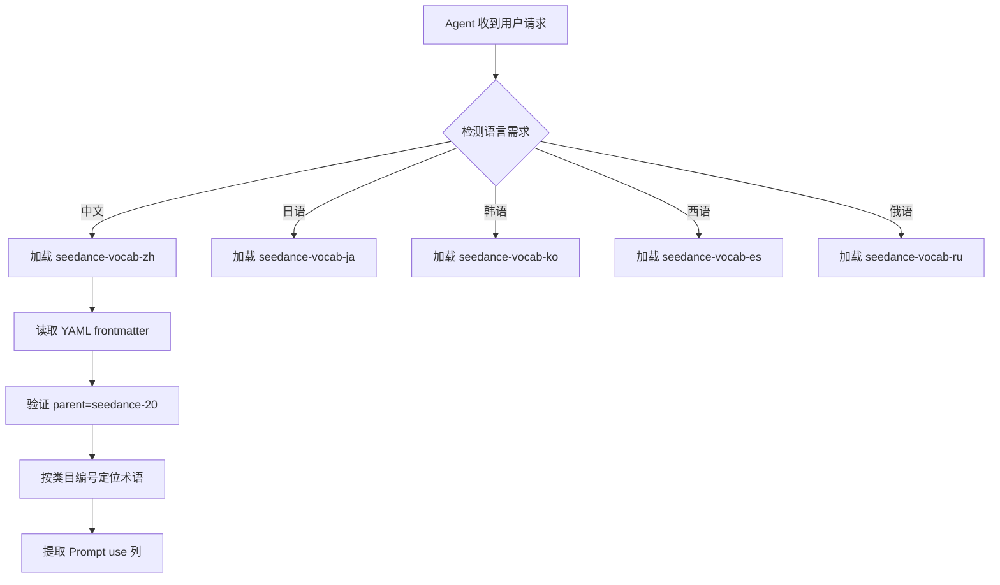

# PD-248.01 seedance-2.0 — 五语影视术语 Skill 模块化国际化

> 文档编号：PD-248.01
> 来源：seedance-2.0 `skills/seedance-vocab-zh/SKILL.md` `skills/seedance-vocab-ja/SKILL.md` `skills/seedance-vocab-ko/SKILL.md` `skills/seedance-vocab-es/SKILL.md` `skills/seedance-vocab-ru/SKILL.md`
> GitHub：https://github.com/Emily2040/seedance-2.0.git
> 问题域：PD-248 国际化 Internationalization
> 状态：可复用方案

---

## 第 1 章 问题与动机

### 1.1 核心问题

AI 视频生成（如 Seedance 2.0 / Dreamina）的 prompt 工程面临一个关键国际化挑战：**不同语言对同一影视概念的表达精度和语义密度差异巨大**。直接用英文 prompt 无法触达非英语文化圈的独特美学概念（如日语「侘び寂び」、韩语「한」、俄语「тоска」、西班牙语「duende」），而简单翻译又会丢失 prompt 工程所需的精确性。

核心矛盾：
- 中文 prompt 语义密度是英文的 2-3 倍（`skills/seedance-vocab-zh/SKILL.md:14`），但缺乏标准化术语映射
- 每种语言有独特的文化美学概念，无法用英文等价替换
- AI Agent 需要按需加载特定语言的术语模块，不能一次性加载全部 5 种语言（token 浪费）
- 术语必须是 "prompt-ready"——可直接复制粘贴到 prompt 中，而非学术性词典

### 1.2 seedance-2.0 的解法概述

seedance-2.0 采用 **"一语言一 Skill 模块"** 的架构，将 5 种语言的影视术语封装为独立可加载的 Agent Skill：

1. **模块化隔离**：每种语言是独立的 `seedance-vocab-{lang}/SKILL.md` 文件，通过 `metadata.parent: seedance-20` 关联到主 Skill（`SKILL.md:62`）
2. **四列标准表结构**：每个术语表包含 原文 | 转写/拼音 | English | Prompt use 四列，确保跨语言可比性（`skills/seedance-vocab-zh/SKILL.md:19-33`）
3. **14-16 类目分类法**：中文最全（16 类 400+ 术语），其他语言 13 类 270+ 术语，类目编号统一（D.1-D.16 / J.1-J.13 / K.1-K.13 / E.1-E.13 / R.1-R.13）
4. **文化美学专属章节**：每种语言有独特的文化概念章节——日语 J.12 日本特有の美学、韩语 K.11 한국 미학 + K.12 K-드라마、俄语 R.12 Советское кино、西班牙语 E.12 Estética Hispana
5. **委任级别短语**：每种语言提供 4 级 prompt 委任模板（从"自由发挥"到"精确控制"），格式统一但内容本地化（`skills/seedance-vocab-zh/SKILL.md:341-345`）

### 1.3 设计思想

| 设计原则 | 具体实现 | 理由 | 替代方案 |
|----------|----------|------|----------|
| 一语言一模块 | 5 个独立 SKILL.md 文件，各自有 frontmatter 元数据 | Agent 按需加载，零 token 浪费；单语言更新不影响其他 | 单文件多语言（token 膨胀）、运行时翻译 API（延迟高） |
| Prompt-Ready 设计 | 每个术语的第 4 列是可直接复制的 prompt 片段 | 消除"查到术语但不知道怎么用"的鸿沟 | 纯词典式翻译（需二次加工） |
| 文化美学独立章节 | 日语侘び寂び/間、韩语한/눈치、俄语тоска/душа、西语 duende/realismo mágico | 这些概念无英文等价物，是该语言 prompt 的核心差异化 | 忽略文化概念（丢失语言优势） |
| 统一四列表结构 | 原文 + 转写 + English + Prompt use | 跨语言可比，Agent 可结构化解析 | 自由文本描述（不可机器解析） |
| 类目编号体系 | D.1-D.16（中）/ J.1-J.13（日）/ K.1-K.13（韩）/ E.1-E.13（西）/ R.1-R.13（俄） | 同类目跨语言对齐，便于对比和路由 | 无编号（难以跨语言映射） |

---

## 第 2 章 源码实现分析

### 2.1 架构概览

seedance-2.0 的国际化架构是一个 **星型 Skill 加载模型**：根 SKILL.md 作为入口，按需引用 5 个语言子模块。

```
┌─────────────────────────────────────────────────────┐
│              seedance-20 (Root SKILL.md)             │
│  "Vocabulary" section references:                    │
│  [skill:seedance-vocab-zh] · [skill:seedance-vocab-ja]│
│  [skill:seedance-vocab-ko] · [skill:seedance-vocab-es]│
│  [skill:seedance-vocab-ru]                           │
└──────────┬──────┬──────┬──────┬──────┬──────────────┘
           │      │      │      │      │
     ┌─────▼──┐ ┌─▼────┐ ┌▼─────┐ ┌──▼───┐ ┌──▼───┐
     │vocab-zh│ │vocab-ja│ │vocab-ko│ │vocab-es│ │vocab-ru│
     │🇨🇳 400+│ │🇯🇵 280+│ │🇰🇷 270+│ │🇪🇸 270+│ │🇷🇺 270+│
     │16 类目 │ │13 类目 │ │13 类目 │ │13 类目 │ │13 类目 │
     └────────┘ └───────┘ └───────┘ └───────┘ └───────┘
```

每个语言模块的内部结构一致：

```
┌─────────────────────────────────────┐
│         vocab-{lang}/SKILL.md       │
├─────────────────────────────────────┤
│ 1. YAML Frontmatter (元数据)         │
│    - name, description, tags        │
│    - metadata.parent: seedance-20   │
│    - metadata.version: 3.7.0        │
│    - 多平台兼容声明                    │
├─────────────────────────────────────┤
│ 2. 语言特性说明 (语义密度/文化背景)     │
├─────────────────────────────────────┤
│ 3. 通用类目 (Shot/Camera/Lens/...)   │
│    × 11-14 个标准表                  │
├─────────────────────────────────────┤
│ 4. 文化美学专属类目                    │
│    (侘び寂び / 한 / тоска / duende)  │
├─────────────────────────────────────┤
│ 5. Prompt-Ready 短语集               │
│    + 4 级委任模板                     │
└─────────────────────────────────────┘
```

### 2.2 核心实现

#### 2.2.1 YAML Frontmatter 元数据协议



对应源码 `skills/seedance-vocab-zh/SKILL.md:1-8`：

```yaml
---
name: seedance-vocab-zh
description: 'Look up 400+ Chinese cinematic, photography, and production terms
  with English equivalents and prompt-ready phrases for Seedance 2.0 across 16
  categories. Use when writing prompts in Mandarin, translating a production
  concept into Chinese Seedance vocabulary, or verifying term accuracy.'
license: MIT
user-invocable: true
tags: ["vocabulary", "chinese", "i18n", "openclaw", "antigravity", "gemini-cli"]
metadata: {"version": "3.7.0", "updated": "2026-02-26",
  "parent": "seedance-20",
  "author": "Emily (@iamemily2050)",
  "repository": "https://github.com/Emily2040/seedance-2.0"}
---
```

关键设计点：
- `metadata.parent: seedance-20` 建立父子关系，Agent 可通过 parent 字段发现所有子模块
- `tags` 包含 `i18n` 标签，支持按标签搜索国际化模块
- `description` 以动词开头（"Look up"），符合 AgentSkills 开放标准（`README.md:281-288`）
- 多平台兼容：同一 SKILL.md 可被 Claude Code / Gemini CLI / Antigravity / Cursor 等 10+ 平台加载（`SKILL.md:22-33`）

#### 2.2.2 四列标准术语表


对应源码 `skills/seedance-vocab-zh/SKILL.md:19-33`（中文景别表）：

```markdown
## D.1 景别 · Shot Sizes

| 中文 | 拼音 | English | Prompt use |
|---|---|---|---|
| 大远景 | dà yuǎnjǐng | Extreme wide shot (EWS) | `大远景，天地渺小` |
| 远景 | yuǎnjǐng | Wide shot (WS) | `远景建立环境` |
| 全景 | quánjǐng | Full shot (FS) | `全景，人物全身入画` |
| 中景 | zhōngjǐng | Medium shot (MS) | `中景，腰部以上` |
| 中近景 | zhōng jìnjǐng | Medium close-up (MCU) | `中近景，胸部以上` |
| 近景 | jìnjǐng | Close-up (CU) | `近景特写面部` |
| 特写 | tèxiě | Extreme close-up (ECU) | `眼部特写` |
| 大特写 | dà tèxiě | Big close-up (BCU) | `唇部大特写` |
```

对比日语同类目 `skills/seedance-vocab-ja/SKILL.md:19-33`：

```markdown
## J.1 ショットサイズ · Shot Sizes

| 日本語 | ローマ字 | English | Prompt use |
|---|---|---|---|
| 大遠景 | dai enkei | Extreme wide shot | `大遠景で世界を映す` |
| 遠景 | enkei | Wide shot | `遠景で環境を確立` |
| 全景 | zenkei | Full shot | `全景、全身が入る` |
```

设计要点：
- 第 2 列在中文是拼音、日语是罗马字、韩语是罗马字、俄语是转写——统一为"拉丁字母转写"
- 第 4 列 Prompt use 用反引号包裹，表示可直接复制
- 类目编号对齐：D.1 = J.1 = K.1 = E.1 = R.1 都是 Shot Sizes

### 2.3 实现细节

#### 文化美学概念的差异化处理

每种语言的最大差异化在于文化美学专属章节。这些概念无法跨语言翻译，是该语言 prompt 的核心竞争力：

**日语 J.12**（`skills/seedance-vocab-ja/SKILL.md:199-211`）：
- 侘び寂び (wabi-sabi) — 不完美之美
- 間 (ma) — 有意义的空白/停顿
- もののあわれ (mono no aware) — 物哀
- 幽玄 (yūgen) — 幽深神秘之美

**韩语 K.11-K.12**（`skills/seedance-vocab-ko/SKILL.md:178-201`）：
- 한 (han) — 深沉的悲伤（韩国独有）
- 눈치 (nunchi) — 沉默中的情感感知
- K-드라마特有场景：우산 신（雨伞场景）、공항 신（机场告别）、옥상 신（天台场景）

**俄语 R.12**（`skills/seedance-vocab-ru/SKILL.md:199-211`）：
- Монтаж аттракционов — 爱森斯坦蒙太奇
- Поэтическое кино — 塔可夫斯基诗意电影
- Тоска — 不可翻译的忧郁/渴望
- Белые ночи — 白夜（圣彼得堡特有光线）

**西班牙语 E.12**（`skills/seedance-vocab-es/SKILL.md:197-208`）：
- Realismo mágico — 魔幻现实主义
- Duende — 弗拉门戈的灵魂表达
- Noir latinoamericano — 拉丁黑色电影
- Sobremesa — 餐后闲聊时光

#### 委任级别（Delegation Level）统一框架

所有 5 种语言都提供 4 级 prompt 委任模板，从低控制到高控制：

| Level | 中文模板 | 日语模板 | 控制粒度 |
|-------|---------|---------|---------|
| 1 | `营造氛围，留白给模型发挥` | `雰囲気を優先、自由に演出して` | 最低：只给氛围 |
| 2 | `[主角描述]，[动作]，[环境]` | `[主体]が[動作]、[場所]、[カメラ]` | 中：主体+动作+环境 |
| 3 | `0–4秒[A]；4–8秒[B]；8秒后[C]` | `0〜4秒：[A]；4〜8秒：[B]；8秒以降：[C]` | 高：时间轴分段 |
| 4 | `[角色A]对[角色B]，[连续动作序列]，[精确运镜]，[灯光]，[音效]` | `[キャラA]が[キャラB]に[連続動作]、[細かいカメラ指示]、[照明]、[音]` | 最高：全要素精确控制 |

