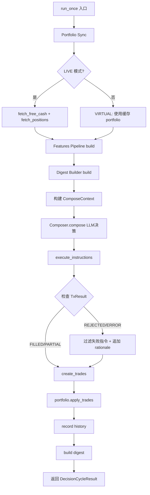
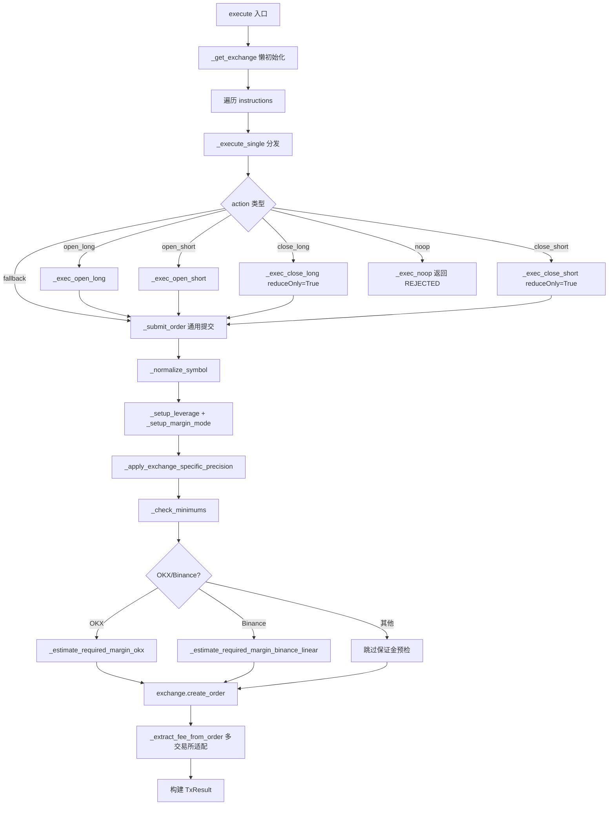

# PD-249.01 ValueCell — 交易决策-执行管道与多交易所统一网关

> 文档编号：PD-249.01
> 来源：ValueCell `python/valuecell/agents/common/trading/`
> GitHub：https://github.com/ValueCell-ai/valuecell.git
> 问题域：PD-249 交易执行引擎 Trading Execution Engine
> 状态：可复用方案

---

## 第 1 章 问题与动机

### 1.1 核心问题

AI 交易 Agent 需要一个完整的"决策→执行→记录"管道，将 LLM 的交易决策安全地转化为真实交易所订单。核心挑战包括：

1. **多交易所差异**：Binance、OKX、Bybit、Hyperliquid 等交易所的 API 参数命名、精度规则、保证金模式各不相同（如 `reduceOnly` vs `reduce_only`，OKX 需要 `tdMode`，Hyperliquid 不支持真正的市价单）
2. **决策-执行解耦**：LLM 产出的交易意图（开多/开空/平仓）需要经过数量归一化、杠杆限制、保证金预检等多层护栏才能安全下单
3. **模拟与实盘统一**：Paper Trading 和 Live Trading 需要共享同一套接口，便于策略回测和上线切换
4. **仓位生命周期管理**：开仓→持仓→平仓的完整 PnL 计算、交易配对、历史记录

### 1.2 ValueCell 的解法概述

ValueCell 构建了一个 6 阶段决策管道，由 `DefaultDecisionCoordinator` 编排：

1. **Portfolio Sync** — 从交易所同步余额和持仓（`coordinator.py:112-159`）
2. **Feature Pipeline** — 构建市场特征向量（`coordinator.py:165-167`）
3. **Compose** — LLM + 护栏产出标准化交易指令（`coordinator.py:179-186`）
4. **Execute** — 通过统一网关执行指令（`coordinator.py:195-197`）
5. **Record** — 创建交易历史并更新组合（`coordinator.py:230-241`）
6. **Digest** — 构建滚动摘要供下一轮决策参考（`coordinator.py:241`）

执行层通过 `BaseExecutionGateway` 抽象接口实现多态：
- `CCXTExecutionGateway`：CCXT 统一 API 对接 8+ 交易所（`ccxt_trading.py:31`）
- `PaperExecutionGateway`：模拟执行，含滑点和手续费模拟（`paper_trading.py:15`）

### 1.3 设计思想

| 设计原则 | 具体实现 | 理由 | 替代方案 |
|----------|----------|------|----------|
| 接口多态 | `BaseExecutionGateway` ABC 定义 `execute/test_connection/close` | Paper/Live 切换零代码改动 | 条件分支（if paper else live） |
| 交易所适配层 | 每个交易所的参数差异在 Gateway 内部消化 | 上层 Composer 不感知交易所细节 | 每个交易所独立 Gateway 类 |
| 保证金预检 | 下单前估算所需保证金并与可用余额比较 | 避免因余额不足导致的 API 错误 | 依赖交易所返回错误后重试 |
| 幂等性 | `instruction_id` + `clientOrderId` 绑定 | 网络重试不会重复下单 | 无幂等保护 |
| 渐进式降级 | 杠杆/保证金模式设置失败只 warning 不中断 | 部分交易所不支持某些设置 | 严格失败 |

---

## 第 2 章 源码实现分析

### 2.1 架构概览

ValueCell 的交易系统采用分层管道架构，每层通过 ABC 接口解耦：

```
┌──────────────────────────────────────────────────────────────────┐
│                  DefaultDecisionCoordinator                      │
│                     (coordinator.py:77)                           │
├──────────────────────────────────────────────────────────────────┤
│                                                                   │
│  ┌─────────────┐  ┌──────────────┐  ┌───────────────────────┐   │
│  │ Portfolio    │  │ Features     │  │ BaseComposer          │   │
│  │ Service      │→│ Pipeline     │→│ (LLM + Guardrails)    │   │
│  │ (get_view)   │  │ (build)      │  │ (compose)             │   │
│  └─────────────┘  └──────────────┘  └───────────┬───────────┘   │
│                                                   ↓               │
│                                      TradeInstruction[]           │
│                                                   ↓               │
│  ┌────────────────────────────────────────────────┴──────────┐   │
│  │              BaseExecutionGateway.execute()                │   │
│  ├────────────────────────┬──────────────────────────────────┤   │
│  │  CCXTExecutionGateway  │     PaperExecutionGateway        │   │
│  │  (Binance/OKX/Bybit/  │     (模拟执行 + 滑点/手续费)     │   │
│  │   Hyperliquid/Gate..)  │                                   │   │
│  └────────────────────────┴──────────────────────────────────┘   │
│                                                   ↓               │
│                                           TxResult[]              │
│                                                   ↓               │
│  ┌─────────────┐  ┌──────────────┐  ┌───────────────────────┐   │
│  │ History     │  │ Digest       │  │ Portfolio             │   │
│  │ Recorder    │  │ Builder      │  │ apply_trades()        │   │
│  └─────────────┘  └──────────────┘  └───────────────────────┘   │
│                                                                   │
└──────────────────────────────────────────────────────────────────┘
```

### 2.2 核心实现

#### 2.2.1 决策协调器 — DefaultDecisionCoordinator



对应源码 `coordinator.py:106-256`：

```python
class DefaultDecisionCoordinator(DecisionCoordinator):
    def __init__(self, *, request, strategy_id, portfolio_service,
                 features_pipeline, composer, execution_gateway,
                 history_recorder, digest_builder):
        self._request = request
        self.strategy_id = strategy_id
        self.portfolio_service = portfolio_service
        self._features_pipeline = features_pipeline
        self._composer = composer
        self._execution_gateway = execution_gateway
        self._history_recorder = history_recorder
        self._digest_builder = digest_builder
        self._symbols = list(dict.fromkeys(request.trading_config.symbols))
        self._realized_pnl: float = 0.0
        self._unrealized_pnl: float = 0.0
        self.cycle_index: int = 0

    async def run_once(self) -> DecisionCycleResult:
        # 1. Portfolio sync (LIVE: exchange balance; VIRTUAL: cached)
        portfolio = self.portfolio_service.get_view()
        if self._request.exchange_config.trading_mode == TradingMode.LIVE:
            free_cash, total_cash = await fetch_free_cash_from_gateway(
                self._execution_gateway, self._symbols)
            portfolio.account_balance = float(free_cash)
            # ... market type specific logic
        # 2. Features
        pipeline_result = await self._features_pipeline.build()
        features = list(pipeline_result.features or [])
        # 3. Compose (LLM + guardrails)
        context = ComposeContext(ts=timestamp_ms, compose_id=compose_id,
                                strategy_id=self.strategy_id,
                                features=features, portfolio=portfolio,
                                digest=digest)
        compose_result = await self._composer.compose(context)
        # 4. Execute
        tx_results = await self.execute_instructions(
            instructions, market_features=market_features)
        # 5. Record + 6. Digest
        trades = self._create_trades(tx_results, compose_id, timestamp_ms)
        self.portfolio_service.apply_trades(trades, market_features)
```

#### 2.2.2 CCXT 多交易所统一网关



对应源码 `ccxt_trading.py:729-781`（execute 主入口）和 `ccxt_trading.py:857-1221`（_submit_order 核心）：

```python
class CCXTExecutionGateway(BaseExecutionGateway):
    async def execute(self, instructions, market_features=None) -> List[TxResult]:
        exchange = await self._get_exchange()
        results = []
        for inst in instructions:
            try:
                result = await self._execute_single(inst, exchange)
                results.append(result)
            except Exception as e:
                results.append(TxResult(
                    instruction_id=inst.instruction_id,
                    instrument=inst.instrument,
                    side=side, requested_qty=float(inst.quantity),
                    filled_qty=0.0, status=TxStatus.ERROR,
                    reason=str(e), meta=inst.meta))
        return results

    async def _submit_order(self, inst, exchange, params_override=None):
        symbol = self._normalize_symbol(inst.instrument.symbol)
        # Symbol resolution against loaded markets with fallbacks
        # Setup leverage/margin for opening positions only
        # Apply exchange-specific precision
        amount, price = self._apply_exchange_specific_precision(
            symbol, amount, price, exchange)
        # Reject below minimums
        reject_reason = await self._check_minimums(exchange, symbol, amount, price)
        # OKX/Binance margin precheck
        # Build params with exchange-specific defaults
        params = self._build_order_params(inst, order_type)
        # Hyperliquid: convert market to IoC limit
        order = await exchange.create_order(
            symbol=symbol, type=order_type, side=side,
            amount=amount, price=price, params=params)
        # Parse response, extract fees, calculate slippage
        return TxResult(...)
```

### 2.3 实现细节

#### 交易所参数适配矩阵

`CCXTExecutionGateway` 在多个维度上适配不同交易所（`ccxt_trading.py:254-405`）：

| 适配点 | Binance | OKX | Bybit | Hyperliquid | Gate.io |
|--------|---------|-----|-------|-------------|---------|
| reduceOnly 参数名 | `reduceOnly` | `reduceOnly` | `reduce_only` | `reduceOnly` | `reduce_only` |
| clientOrderId 长度 | 36 | 32 | 36 | 不支持 | 28 |
| 市价单 | 原生支持 | 原生支持 | 原生支持 | IoC limit 模拟 | 原生支持 |
| defaultType 映射 | `swap`→`future` | `swap` | `swap` | `swap` | `swap` |
| 保证金预检 | USDT-M linear | 合约 ctVal 转换 | 无 | 无 | 无 |
| tdMode | 不需要 | 必须设置 | 不需要 | 不需要 | 不需要 |

#### PnL 计算与交易配对

`DefaultDecisionCoordinator._create_trades()`（`coordinator.py:258-467`）实现了完整的交易配对逻辑：

- **全平仓检测**：比较当前持仓方向与交易方向，判断是否为完全平仓
- **PnL 计算**：多头 `(exit_px - entry_px) * qty`，空头 `(entry_px - exit_px) * qty`，扣除手续费
- **部分平仓配对**：扫描历史记录找到最近的开仓交易，注入 `exit_price`、`exit_ts`、`holding_ms`
- **交易 ID 关联**：通过 `paired_exit_of:{trade_id}` 在 note 中记录配对关系

#### 手续费提取的多交易所适配

`_extract_fee_from_order()`（`ccxt_trading.py:596-727`）实现了 8 种交易所的手续费提取：

1. CCXT 统一 `fee` 字段（优先）
2. Binance `fills` 数组中的 `commission` + `commissionAsset`
3. OKX `info.fee` / `info.fillFee`（返回负值需取绝对值）
4. Bybit `info.cumExecFee`
5. Gate.io / KuCoin / MEXC / Bitget 各自的 info 字段

---

## 第 3 章 迁移指南

### 3.1 迁移清单

#### 阶段 1：核心接口层（必须）

- [ ] 定义 `BaseExecutionGateway` ABC（`execute`, `test_connection`, `close`）
- [ ] 定义 `TradeInstruction` 数据模型（含 `action`, `side`, `quantity`, `price_mode`, `leverage`）
- [ ] 定义 `TxResult` 数据模型（含 `status`, `filled_qty`, `avg_exec_price`, `fee_cost`）
- [ ] 实现 `PaperExecutionGateway`（模拟执行 + 滑点/手续费）

#### 阶段 2：CCXT 网关（按需）

- [ ] 实现 `CCXTExecutionGateway`，支持目标交易所
- [ ] 实现交易所参数适配（reduceOnly 命名、clientOrderId 长度、精度规则）
- [ ] 实现保证金预检（OKX/Binance）
- [ ] 实现 Hyperliquid 市价单 IoC 模拟（如需要）

#### 阶段 3：决策管道（完整功能）

- [ ] 实现 `DecisionCoordinator` 编排 6 阶段管道
- [ ] 实现 PnL 计算和交易配对逻辑
- [ ] 实现 `HistoryRecorder` + `DigestBuilder` 滚动摘要
- [ ] 实现 `PortfolioService` 仓位管理

### 3.2 适配代码模板

#### 最小可运行的执行网关接口 + Paper 实现

```python
from abc import ABC, abstractmethod
from dataclasses import dataclass, field
from enum import Enum
from typing import Dict, List, Optional


class TradeSide(Enum):
    BUY = "BUY"
    SELL = "SELL"


class TxStatus(Enum):
    FILLED = "filled"
    PARTIAL = "partial"
    REJECTED = "rejected"
    ERROR = "error"


class TradeAction(Enum):
    OPEN_LONG = "open_long"
    OPEN_SHORT = "open_short"
    CLOSE_LONG = "close_long"
    CLOSE_SHORT = "close_short"
    NOOP = "noop"


@dataclass
class TradeInstruction:
    instruction_id: str
    symbol: str
    action: TradeAction
    side: TradeSide
    quantity: float
    leverage: Optional[float] = None
    limit_price: Optional[float] = None
    max_slippage_bps: Optional[float] = None
    meta: Dict = field(default_factory=dict)


@dataclass
class TxResult:
    instruction_id: str
    symbol: str
    side: TradeSide
    requested_qty: float
    filled_qty: float
    avg_exec_price: Optional[float] = None
    slippage_bps: Optional[float] = None
    fee_cost: Optional[float] = None
    leverage: Optional[float] = None
    status: TxStatus = TxStatus.FILLED
    reason: Optional[str] = None


class BaseExecutionGateway(ABC):
    @abstractmethod
    async def execute(
        self, instructions: List[TradeInstruction],
        market_prices: Optional[Dict[str, float]] = None,
    ) -> List[TxResult]:
        ...

    @abstractmethod
    async def test_connection(self) -> bool:
        ...

    @abstractmethod
    async def close(self) -> None:
        ...


class PaperExecutionGateway(BaseExecutionGateway):
    """模拟执行网关，含滑点和手续费模拟。"""

    def __init__(self, fee_bps: float = 10.0):
        self._fee_bps = fee_bps
        self.executed: List[TradeInstruction] = []

    async def execute(
        self, instructions: List[TradeInstruction],
        market_prices: Optional[Dict[str, float]] = None,
    ) -> List[TxResult]:
        prices = market_prices or {}
        results = []
        for inst in instructions:
            self.executed.append(inst)
            ref_price = prices.get(inst.symbol, 0.0)
            slip = (inst.max_slippage_bps or 0.0) / 10_000.0
            exec_price = ref_price * (1 + slip) if inst.side == TradeSide.BUY \
                else ref_price * (1 - slip)
            notional = exec_price * inst.quantity
            fee = notional * (self._fee_bps / 10_000.0)
            results.append(TxResult(
                instruction_id=inst.instruction_id,
                symbol=inst.symbol, side=inst.side,
                requested_qty=inst.quantity, filled_qty=inst.quantity,
                avg_exec_price=exec_price, fee_cost=fee,
                leverage=inst.leverage, status=TxStatus.FILLED,
            ))
        return results

    async def test_connection(self) -> bool:
        return True

    async def close(self) -> None:
        pass
```

#### CCXT 网关核心骨架（含交易所适配）

```python
import ccxt.async_support as ccxt

class CCXTGateway(BaseExecutionGateway):
    """CCXT 统一网关骨架，展示交易所适配模式。"""

    REDUCE_ONLY_PARAM = {
        "gate": "reduce_only", "bybit": "reduce_only",
    }  # 其余交易所默认 "reduceOnly"

    CLIENT_ID_MAX_LEN = {
        "gate": 28, "okx": 32, "binance": 36, "bybit": 36,
    }  # 默认 32

    def __init__(self, exchange_id: str, api_key: str, secret: str, **opts):
        self._exchange_id = exchange_id.lower()
        self._config = {"apiKey": api_key, "secret": secret,
                        "enableRateLimit": True, **opts}
        self._exchange: Optional[ccxt.Exchange] = None
        self._leverage_cache: Dict[str, float] = {}

    async def _get_exchange(self) -> ccxt.Exchange:
        if self._exchange is None:
            cls = getattr(ccxt, self._exchange_id)
            self._exchange = cls(self._config)
            await self._exchange.load_markets()
        return self._exchange

    def _get_reduce_only_param(self) -> str:
        return self.REDUCE_ONLY_PARAM.get(self._exchange_id, "reduceOnly")

    async def execute(self, instructions, market_prices=None):
        exchange = await self._get_exchange()
        results = []
        for inst in instructions:
            try:
                result = await self._submit_order(inst, exchange)
                results.append(result)
            except Exception as e:
                results.append(TxResult(
                    instruction_id=inst.instruction_id,
                    symbol=inst.symbol, side=inst.side,
                    requested_qty=inst.quantity, filled_qty=0.0,
                    status=TxStatus.ERROR, reason=str(e)))
        return results

    async def _submit_order(self, inst, exchange):
        # 1. Normalize symbol
        # 2. Setup leverage (cached)
        # 3. Apply precision
        # 4. Check minimums
        # 5. Build params with exchange-specific defaults
        # 6. Create order
        # 7. Parse response
        ...  # 参考 ccxt_trading.py:857-1221 的完整实现

    async def test_connection(self) -> bool:
        try:
            ex = await self._get_exchange()
            await ex.fetch_balance()
            return True
        except Exception:
            return False

    async def close(self) -> None:
        if self._exchange:
            await self._exchange.close()
            self._exchange = None
```

### 3.3 适用场景

| 场景 | 适用度 | 说明 |
|------|--------|------|
| AI 量化交易 Agent | ⭐⭐⭐ | 完整的 LLM 决策→执行管道，直接复用 |
| 多交易所套利系统 | ⭐⭐⭐ | CCXT 统一网关 + 交易所适配矩阵 |
| 策略回测框架 | ⭐⭐⭐ | Paper/Live 接口统一，切换零成本 |
| 简单交易机器人 | ⭐⭐ | 架构偏重，可只取 Gateway 层 |
| 非加密货币交易 | ⭐ | CCXT 仅支持加密货币交易所 |

---

## 第 4 章 测试用例

```python
import pytest
from unittest.mock import AsyncMock, MagicMock, patch
from dataclasses import dataclass, field
from enum import Enum
from typing import Dict, List, Optional


# --- 使用第 3 章定义的模型 ---

class TestPaperExecutionGateway:
    """测试 PaperExecutionGateway 的模拟执行逻辑。"""

    @pytest.fixture
    def gateway(self):
        return PaperExecutionGateway(fee_bps=10.0)

    @pytest.mark.asyncio
    async def test_normal_buy_execution(self, gateway):
        """正常买入：验证滑点和手续费计算。"""
        inst = TradeInstruction(
            instruction_id="inst-001", symbol="BTC-USDT",
            action=TradeAction.OPEN_LONG, side=TradeSide.BUY,
            quantity=0.1, max_slippage_bps=50.0,
        )
        results = await gateway.execute(
            [inst], market_prices={"BTC-USDT": 50000.0})
        assert len(results) == 1
        r = results[0]
        assert r.status == TxStatus.FILLED
        assert r.filled_qty == 0.1
        # 滑点 50bps = 0.5%, 买入价 = 50000 * 1.005 = 50250
        assert abs(r.avg_exec_price - 50250.0) < 0.01
        # 手续费 10bps = 0.1%, notional = 50250 * 0.1 = 5025
        assert abs(r.fee_cost - 5.025) < 0.01

    @pytest.mark.asyncio
    async def test_sell_slippage_direction(self, gateway):
        """卖出时滑点方向：价格应低于参考价。"""
        inst = TradeInstruction(
            instruction_id="inst-002", symbol="ETH-USDT",
            action=TradeAction.CLOSE_LONG, side=TradeSide.SELL,
            quantity=1.0, max_slippage_bps=100.0,
        )
        results = await gateway.execute(
            [inst], market_prices={"ETH-USDT": 3000.0})
        r = results[0]
        # 卖出滑点 100bps = 1%, 卖出价 = 3000 * 0.99 = 2970
        assert r.avg_exec_price < 3000.0
        assert abs(r.avg_exec_price - 2970.0) < 0.01

    @pytest.mark.asyncio
    async def test_zero_price_handling(self, gateway):
        """参考价为 0 时不崩溃。"""
        inst = TradeInstruction(
            instruction_id="inst-003", symbol="UNKNOWN-USDT",
            action=TradeAction.OPEN_LONG, side=TradeSide.BUY,
            quantity=1.0,
        )
        results = await gateway.execute([inst], market_prices={})
        r = results[0]
        assert r.status == TxStatus.FILLED
        assert r.avg_exec_price == 0.0
        assert r.fee_cost == 0.0

    @pytest.mark.asyncio
    async def test_multiple_instructions(self, gateway):
        """批量指令全部执行。"""
        insts = [
            TradeInstruction(
                instruction_id=f"inst-{i}", symbol="BTC-USDT",
                action=TradeAction.OPEN_LONG, side=TradeSide.BUY,
                quantity=0.01,
            ) for i in range(5)
        ]
        results = await gateway.execute(
            insts, market_prices={"BTC-USDT": 60000.0})
        assert len(results) == 5
        assert all(r.status == TxStatus.FILLED for r in results)
        assert len(gateway.executed) == 5


class TestCCXTGatewayAdaptation:
    """测试 CCXT 网关的交易所适配逻辑。"""

    def test_reduce_only_param_name(self):
        """不同交易所使用不同的 reduceOnly 参数名。"""
        # Bybit 使用 snake_case
        gw = CCXTGateway.__new__(CCXTGateway)
        gw._exchange_id = "bybit"
        assert gw._get_reduce_only_param() == "reduce_only"
        # Binance 使用 camelCase
        gw._exchange_id = "binance"
        assert gw._get_reduce_only_param() == "reduceOnly"

    def test_client_order_id_length(self):
        """clientOrderId 长度限制因交易所而异。"""
        assert CCXTGateway.CLIENT_ID_MAX_LEN["gate"] == 28
        assert CCXTGateway.CLIENT_ID_MAX_LEN["okx"] == 32
        assert CCXTGateway.CLIENT_ID_MAX_LEN["binance"] == 36


class TestDecisionCoordinatorTrades:
    """测试 PnL 计算和交易配对逻辑。"""

    @pytest.mark.asyncio
    async def test_full_close_pnl_long(self):
        """全平多头仓位的 PnL 计算。"""
        entry_price = 50000.0
        exit_price = 55000.0
        quantity = 0.1
        fee = 5.0
        # 多头 PnL = (exit - entry) * qty - fee
        expected_pnl = (exit_price - entry_price) * quantity - fee
        assert abs(expected_pnl - 495.0) < 0.01

    @pytest.mark.asyncio
    async def test_full_close_pnl_short(self):
        """全平空头仓位的 PnL 计算。"""
        entry_price = 50000.0
        exit_price = 45000.0
        quantity = 0.1
        fee = 5.0
        # 空头 PnL = (entry - exit) * qty - fee
        expected_pnl = (entry_price - exit_price) * quantity - fee
        assert abs(expected_pnl - 495.0) < 0.01
```

---

## 第 5 章 跨域关联

| 关联域 | 关系类型 | 说明 |
|--------|----------|------|
| PD-02 多 Agent 编排 | 协同 | `DefaultDecisionCoordinator` 本身就是一个编排器，协调 Features→Composer→Gateway→Recorder 多组件管道 |
| PD-03 容错与重试 | 依赖 | `fetch_free_cash_from_gateway` 和 `fetch_positions_from_gateway` 内置指数退避重试；CCXT 网关对单指令失败不中断批量执行 |
| PD-04 工具系统 | 协同 | 执行网关可视为 Agent 的"交易工具"，通过 `BaseExecutionGateway` 接口注册到决策管道 |
| PD-06 记忆持久化 | 依赖 | `HistoryRecorder` 记录每轮决策的 features/compose/instructions/execution 四类历史；`DigestBuilder` 构建滚动摘要供 LLM 参考 |
| PD-07 质量检查 | 协同 | `BaseComposer` 内置多层护栏（数量归一化、杠杆限制、保证金预检），相当于决策质量检查 |
| PD-11 可观测性 | 协同 | 每笔交易记录 `fee_cost`、`slippage_bps`、`avg_exec_price`；`StrategySummary` 追踪 realized/unrealized PnL 和 Sharpe Ratio |

---

## 第 6 章 来源文件索引

| 文件 | 行范围 | 关键实现 |
|------|--------|----------|
| `python/valuecell/agents/common/trading/_internal/coordinator.py` | L49-L64 | `DecisionCoordinator` ABC 定义 |
| `python/valuecell/agents/common/trading/_internal/coordinator.py` | L77-L256 | `DefaultDecisionCoordinator.run_once()` 6 阶段管道 |
| `python/valuecell/agents/common/trading/_internal/coordinator.py` | L258-L467 | `_create_trades()` PnL 计算与交易配对 |
| `python/valuecell/agents/common/trading/_internal/coordinator.py` | L469-L517 | `build_summary()` 策略摘要构建 |
| `python/valuecell/agents/common/trading/_internal/coordinator.py` | L574-L672 | `close_all_positions()` 全平仓逻辑 |
| `python/valuecell/agents/common/trading/execution/interfaces.py` | L16-L53 | `BaseExecutionGateway` ABC |
| `python/valuecell/agents/common/trading/execution/ccxt_trading.py` | L31-L88 | `CCXTExecutionGateway.__init__()` 交易所配置 |
| `python/valuecell/agents/common/trading/execution/ccxt_trading.py` | L100-L168 | `_get_exchange()` 懒初始化 + 市场加载 |
| `python/valuecell/agents/common/trading/execution/ccxt_trading.py` | L170-L197 | `_normalize_symbol()` 符号格式标准化 |
| `python/valuecell/agents/common/trading/execution/ccxt_trading.py` | L254-L352 | `_normalize_reduce_only_meta()` 交易所参数适配 |
| `python/valuecell/agents/common/trading/execution/ccxt_trading.py` | L354-L405 | `_build_order_params()` 订单参数构建 |
| `python/valuecell/agents/common/trading/execution/ccxt_trading.py` | L407-L462 | `_check_minimums()` 最小数量/名义值检查 |
| `python/valuecell/agents/common/trading/execution/ccxt_trading.py` | L464-L581 | OKX/Binance 保证金预检 |
| `python/valuecell/agents/common/trading/execution/ccxt_trading.py` | L596-L727 | `_extract_fee_from_order()` 8 交易所手续费提取 |
| `python/valuecell/agents/common/trading/execution/ccxt_trading.py` | L729-L781 | `execute()` 批量执行入口 |
| `python/valuecell/agents/common/trading/execution/ccxt_trading.py` | L782-L811 | `_execute_single()` action 分发 |
| `python/valuecell/agents/common/trading/execution/ccxt_trading.py` | L857-L1221 | `_submit_order()` 核心下单逻辑 |
| `python/valuecell/agents/common/trading/execution/paper_trading.py` | L15-L77 | `PaperExecutionGateway` 模拟执行 |
| `python/valuecell/agents/common/trading/models.py` | L555-L570 | `TradeDecisionAction` 枚举 |
| `python/valuecell/agents/common/trading/models.py` | L653-L720 | `TradeInstruction` 数据模型 |
| `python/valuecell/agents/common/trading/models.py` | L731-L760 | `TxResult` 数据模型 |
| `python/valuecell/agents/common/trading/decision/interfaces.py` | L26-L569 | `BaseComposer` 护栏系统 |
| `python/valuecell/agents/common/trading/utils.py` | L22-L123 | `fetch_free_cash_from_gateway()` 余额同步 |
| `python/valuecell/agents/common/trading/utils.py` | L126-L189 | `fetch_positions_from_gateway()` 持仓同步 |

---

## 第 7 章 横向对比维度

```json comparison_data
{
  "project": "ValueCell",
  "dimensions": {
    "执行架构": "ABC 多态网关 + CCXT 统一 API，Paper/Live 零切换",
    "交易所适配": "8+ 交易所参数矩阵（reduceOnly/clientOrderId/precision/margin）",
    "保证金预检": "OKX ctVal 合约转换 + Binance USDT-M 线性预检，2% buffer",
    "PnL 计算": "全平仓/部分平仓配对，多空双向 PnL + 手续费扣除",
    "决策管道": "6 阶段 Coordinator：portfolio→features→compose→execute→record→digest",
    "模拟执行": "PaperGateway 含方向感知滑点 + 固定 bps 手续费",
    "幂等性": "instruction_id + clientOrderId 绑定，交易所级 MD5 截断"
  }
}
```

### 域元数据补充

```json domain_metadata
{
  "solution_summary": "ValueCell 用 6 阶段 DefaultDecisionCoordinator 编排 LLM 决策管道，CCXT 统一网关适配 8+ 交易所（含 Hyperliquid IoC 模拟市价单），内置保证金预检和多交易所手续费提取",
  "description": "从 LLM 决策到真实交易所下单的完整管道，含多交易所参数适配和保证金安全检查",
  "sub_problems": [
    "交易所 API 参数命名差异统一化",
    "保证金充足性预检与余额不足拒单",
    "市价单在不支持交易所的 IoC 模拟",
    "多交易所手续费字段提取与归一化",
    "全平仓/部分平仓的交易配对与 PnL 计算"
  ],
  "best_practices": [
    "杠杆/保证金模式设置失败只 warning 不中断交易",
    "clientOrderId 按交易所规则 sanitize 后绑定实现幂等",
    "开仓前预估所需保证金并与可用余额比较含 2% buffer",
    "单指令失败不中断批量执行，返回 ERROR TxResult 继续处理"
  ]
}
```
