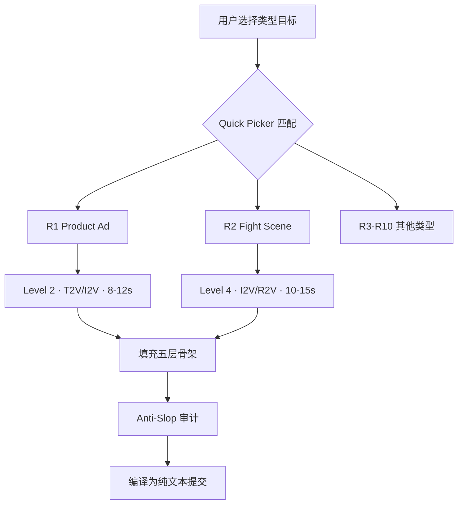
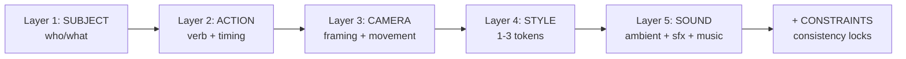
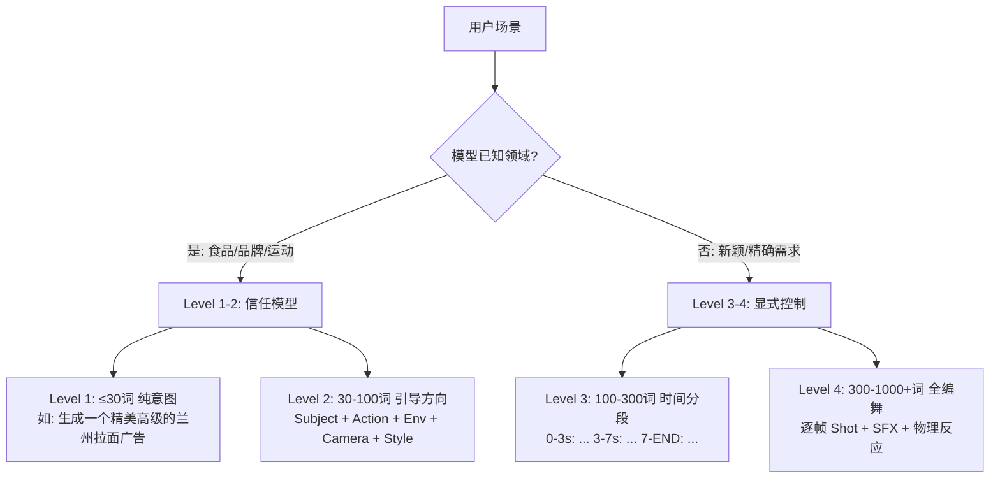

# PD-249.01 seedance-2.0 — Recipes 类型模板与五层骨架系统

> 文档编号：PD-249.01
> 来源：seedance-2.0 `skills/seedance-recipes/SKILL.md` `skills/seedance-prompt/SKILL.md`
> GitHub：https://github.com/Emily2040/seedance-2.0.git
> 问题域：PD-249 领域模板系统 Domain Template System
> 状态：可复用方案

---

## 第 1 章 问题与动机

### 1.1 核心问题

AI 视频生成（T2V/I2V/V2V/R2V）的 prompt 编写门槛极高。用户面临三重困境：

1. **认知负荷**：Seedance 2.0 支持四种模态、四级委托、五层 prompt 结构、@Tag 资产引用系统，新手无从下手
2. **类型差异**：产品广告需要静态微推镜头 + 材质描述，打斗场景需要逐帧编舞 + 冲击物理，两者的 prompt 结构完全不同
3. **质量陷阱**：用户倾向使用 "cinematic" "stunning" 等空洞词汇（AI slop），实际对模型无指导意义，导致生成质量低下

核心矛盾：**专业影视制作知识** vs **普通用户的表达能力**。

### 1.2 seedance-2.0 的解法概述

seedance-2.0 通过 20+ 个 SKILL.md 文件构建了一套完整的"AI 导演知识体系"，其中 `seedance-recipes` 是面向用户的模板入口：

1. **10 种类型模板（R1-R10）**：每种模板标准化为 Level + Mode + Duration + Skeleton + Assets + Notes 六元组（`skills/seedance-recipes/SKILL.md:17-173`）
2. **五层 Prompt 骨架**：Subject → Action → Camera → Style → Sound，强制用户按优先级填充（`skills/seedance-prompt/SKILL.md:49-60`）
3. **四级委托机制**：Level 1（≤30 词纯意图）到 Level 4（300-1000+ 词全编舞），根据场景复杂度选择控制粒度（`skills/seedance-prompt/SKILL.md:66-89`）
4. **Quick Picker 决策表**：10 行的 Goal → Recipe → Lead Skill 映射，用户按目标直接定位模板（`skills/seedance-recipes/SKILL.md:177-191`）
5. **Anti-Slop 质量门控**：内置黑名单 + 可测量性检验（"能用摄影机/测光表/秒表测量吗？"），防止空洞词汇污染 prompt（`skills/seedance-antislop/SKILL.md:32-36`）

### 1.3 设计思想

| 设计原则 | 具体实现 | 理由 | 替代方案 |
|----------|----------|------|----------|
| 类型即骨架 | 每个 Recipe 预设 Level + Mode + Duration + Skeleton | 不同类型的最佳实践差异巨大，统一模板反而有害 | 通用模板 + 参数调整（灵活但用户负担重） |
| 五层优先级 | Subject > Action > Camera > Style > Sound，前 20-30 词权重最高 | 模型 attention 机制决定了 token 位置影响权重 | 自由格式（无优先级指导，质量不稳定） |
| 委托而非控制 | Level 1 只给意图让模型自由发挥，Level 4 逐帧编舞 | 模型对常见领域（食品/品牌）已有内建知识，过度控制反而降质 | 全部 Level 4（成本高、不必要） |
| 可测量性原则 | 每个描述词必须能被摄影机/测光表/秒表测量 | "cinematic" 对模型无指导意义，"45° key light" 有明确语义 | 允许主观描述（质量不可控） |
| 技能路由 | 每个 Recipe 指向 Lead Skill，形成知识图谱 | 避免单文件膨胀，按职责拆分（导演/摄影/灯光/动作） | 单一巨型 prompt 指南（难维护） |

---

## 第 2 章 源码实现分析

### 2.1 架构概览

seedance-2.0 的模板系统是一个纯 Markdown 知识架构，没有运行时代码。其核心是 20 个 SKILL.md 文件组成的技能图谱：

```
seedance-20 (SKILL.md — 根路由)
├── seedance-interview     ← 入口：5 阶段导演之旅
├── seedance-prompt        ← 核心：五层骨架 + 四级委托 + @Tag 系统
├── seedance-recipes       ← 模板：10 种类型 Recipe
├── seedance-camera        ← 镜头语言库
├── seedance-motion        ← 动作编舞 + 视频延展
├── seedance-lighting      ← 灯光控制
├── seedance-characters    ← 角色一致性锁定
├── seedance-style         ← 风格锚点 + CGI 材质合约
├── seedance-vfx           ← 视觉特效
├── seedance-audio         ← 音频设计 + 口型同步
├── seedance-pipeline      ← API + ComfyUI + 后期链
├── seedance-troubleshoot  ← QA + 错误修复
├── seedance-copyright     ← IP 合规
├── seedance-antislop      ← 反空洞语言
├── seedance-examples-zh   ← 16+ 中文实战案例
└── seedance-vocab-*       ← 多语言影视术语（zh/ja/ko/es/ru）
```

关键数据流：

```
用户意图 → interview(5阶段) → recipes(选模板) → prompt(填骨架)
                                    ↓
                            camera/motion/style/audio(专项填充)
                                    ↓
                            antislop(质量审计) → pipeline(提交生成)
```

### 2.2 核心实现

#### 2.2.1 Recipe 六元组结构



对应源码 `skills/seedance-recipes/SKILL.md:17-28`：

```markdown
## R1 · Product Ad

**Level** 2 · **Mode** T2V / I2V · **Duration** 8–12 s

```
[Product name], hero-shot on [surface]. Camera slow push-in.
[Material quality: glass / matte / chrome]. Soft studio key light,
rim highlight. 4K detail. No text.
```

**Assets**: product photo `@Image1`
**Notes**: Turntable = add "360° orbit". Wet look = "water beads on surface, macro depth-of-field".
```

每个 Recipe 的六元组：
- **Level**：委托级别（1-4），决定 prompt 详细程度
- **Mode**：生成模态（T2V/I2V/V2V/R2V），决定输入类型
- **Duration**：推荐时长范围，与 beat density 关联
- **Skeleton**：prompt 骨架模板，用 `[placeholder]` 标记可替换部分
- **Assets**：所需资产清单（@Image/@Video/@Audio）
- **Notes**：类型特有的技巧和注意事项

#### 2.2.2 五层 Prompt 骨架与前置权重规则



对应源码 `skills/seedance-prompt/SKILL.md:49-60`：

```markdown
## The Five-Layer Stack

Build prompts in this order. The model is motion-first; subject anchor before style.

```
1. SUBJECT  — who/what is central (identity anchor)
2. ACTION   — primary motion verb + physics/timing
3. CAMERA   — framing + movement + speed + angle
4. STYLE    — 1–3 tokens max (film language, not adjectives)
5. SOUND    — ambient + SFX + music + silence
+ CONSTRAINTS — what must stay consistent; what to avoid
```

First 20–30 words carry disproportionate weight. Subject + action always first.
```

这个五层结构同时映射到 JSON Schema v3 的字段（`references/json-schema.md:8-33`）：

```json
{
  "meta": { "mode": "i2v", "level": 3, "dur": 10, "ar": "16:9", "res": "1080p" },
  "ref": { "char": "@Image1", "bg": "@Image2", "cam": "@Video1", "bgm": "@Audio1" },
  "shot": {
    "subj": "weathered woman, wool coat, rain platform",
    "act": "slow turn toward camera, breath misting",
    "cam": "dolly push MS→CU over 8s",
    "light": "overhead practical, warm key, low-fill",
    "style": ["anamorphic", "grain", "muted"],
    "snd": { "amb": "rain bed", "sfx": ["train hum at 1s"], "mx": "piano at 2s" }
  },
  "lock": ["stable exposure", "no drift"],
  "exit": "hold 0.8s"
}
```

#### 2.2.3 四级委托决策机制



对应源码 `skills/seedance-prompt/SKILL.md:66-89`：

```markdown
### Level 1 — Pure Intent (≤30 words)
Use when the model knows the domain (food, brands, sports, everyday life).
```
生成一个精美高级的兰州拉面广告，注意分镜编排
```
The model selects shots, music, pacing independently.

### Level 4 — Full Choreography (300–1000+ words)
Per-shot specifications. Use for fight scenes, lip-sync, product demos.

**Decision rule:** Does the model already know how to shoot this? Yes → Level 1–2. Novel/precise → Level 3–4.
```

### 2.3 实现细节

#### 类型模板的差异化设计

10 个 Recipe 的 Level 分布揭示了设计意图：

| Recipe | Level | 原因 |
|--------|-------|------|
| R1 Product Ad | 2 | 产品拍摄是模型熟悉领域，过度控制反而降质 |
| R2 Fight Scene | 4 | 打斗需要逐帧编舞，模型无法自行编排合理动作序列 |
| R4 Mood Piece | 1-2 | 纯氛围片几乎不需要动作指令 |
| R6 One-Take | 4 | 一镜到底需要精确的空间路径和时间控制 |
| R8 Novel Adaptation | 4 | 文学改编需要角色卡 + 场景分解 + 情绪映射 |

#### 技能路由的知识图谱

每个 Recipe 通过 `Lead skill` 字段指向专项技能，形成知识图谱（`skills/seedance-recipes/SKILL.md:179-190`）：

```
R1 Product Ad     → seedance-prompt    (核心骨架足够)
R2 Fight Scene    → seedance-motion    (需要编舞协议)
R3 Brand Film     → seedance-style     (需要风格锚点)
R5 Dialogue       → seedance-audio     (需要口型同步)
R6 One-Take       → seedance-motion    (需要延展链)
R7 Music Video    → seedance-audio     (需要卡点同步)
R8 Novel          → seedance-interview (需要角色卡生成)
R9 Architecture   → seedance-camera    (需要无人机路径)
R10 Action Transfer → seedance-motion  (需要动作迁移语法)
```

#### Anti-Slop 作为质量门控

`seedance-antislop` 定义了"可测量性检验"（`skills/seedance-antislop/SKILL.md:32-36`）：

> **"Can a camera, light meter, or stopwatch measure this?"**
> If yes → keep it. If no → delete it or replace with something measurable.

并提供了精度阶梯（`skills/seedance-antislop/SKILL.md:339-351`）：

```
Level 0 (slop):    "beautiful cinematic lighting"
Level 1 (genre):   "dramatic portrait lighting"
Level 2 (rig):     "three-point lighting setup"
Level 3 (angles):  "45° key, soft fill camera-right, hair light from above"
Level 4 (numbers): "key at 45° camera-left, 3200K, f/4 falloff; fill at 0.3× key power"
```

目标：所有 prompt 至少达到 Level 3 精度。

