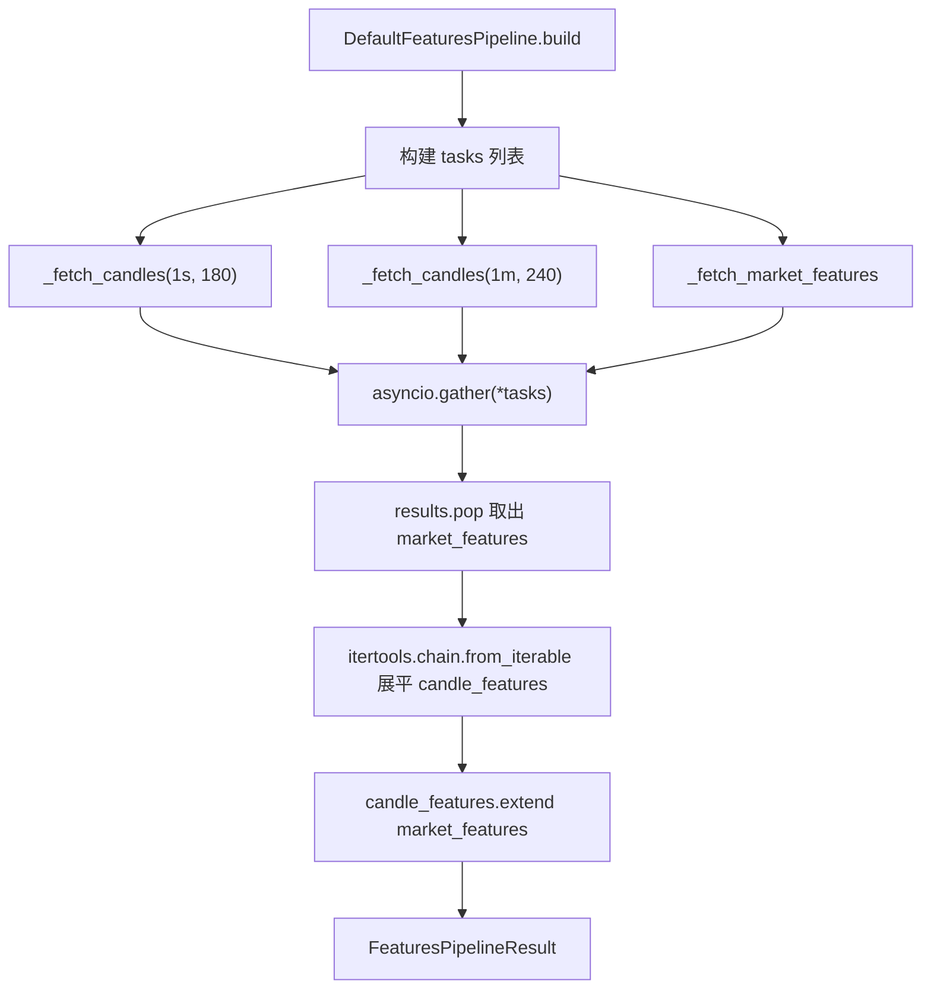
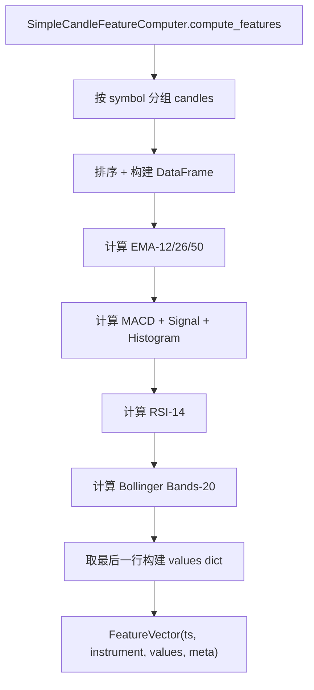

# PD-250.01 ValueCell — asyncio.gather 并发多粒度特征工程管道

> 文档编号：PD-250.01
> 来源：ValueCell `python/valuecell/agents/common/trading/features/pipeline.py`
> GitHub：https://github.com/ValueCell-ai/valuecell.git
> 问题域：PD-250 特征工程管道 Feature Engineering Pipeline
> 状态：可复用方案

---

## 第 1 章 问题与动机

### 1.1 核心问题

LLM 驱动的交易 Agent 在每个决策周期需要消费结构化的市场特征数据。这些数据来自多个异构源：
- **多时间粒度 K 线**（1s、1m、5m 等）：用于计算技术指标（EMA、MACD、RSI、布林带）
- **实时市场快照**（ticker、持仓量、资金费率）：用于捕捉当前市场微观结构

核心挑战在于：
1. **数据获取延迟**：每个交易所 API 调用耗时 100-500ms，串行获取 N 个粒度 × M 个 symbol 会导致秒级延迟
2. **特征格式统一**：K 线特征和市场快照特征结构不同，但下游 LLM Composer 需要统一的 `FeatureVector` 格式
3. **可替换性**：不同策略类型（Prompt-based、Grid）可能需要不同的特征计算逻辑
4. **容错**：单个 symbol 或单个交易所端点失败不应阻塞整个管道

### 1.2 ValueCell 的解法概述

ValueCell 采用 **ABC 抽象 + asyncio.gather 并发 + 策略模式** 的三层架构：

1. **抽象管道接口** `BaseFeaturesPipeline`（`features/interfaces.py:42`）定义 `async build() -> FeaturesPipelineResult` 契约，解耦管道实现与消费者
2. **并发数据获取** `DefaultFeaturesPipeline.build()`（`features/pipeline.py:57`）用 `asyncio.gather` 同时拉取所有 K 线粒度和市场快照，将 O(N) 串行降为 O(1) 并发
3. **双计算器分离** `SimpleCandleFeatureComputer`（`features/candle.py:16`）和 `MarketSnapshotFeatureComputer`（`features/market_snapshot.py:17`）各自负责一类特征，输出统一 `FeatureVector`
4. **工厂方法** `from_request()`（`features/pipeline.py:104`）从 `UserRequest` 一键构建完整管道，支持依赖注入覆盖
5. **分组元数据** 通过 `meta.group_by_key` 字段区分不同来源的特征向量，下游可按组过滤

### 1.3 设计思想

| 设计原则 | 具体实现 | 理由 | 替代方案 |
|----------|----------|------|----------|
| 接口隔离 | `BaseFeaturesPipeline` ABC + `CandleBasedFeatureComputer` ABC | 管道消费者（Coordinator）只依赖抽象，不绑定具体数据源 | 直接在 Coordinator 中硬编码数据获取逻辑 |
| 并发优先 | `asyncio.gather(*tasks)` 同时发起所有数据请求 | K 线和快照互不依赖，并发可将延迟从 sum(latency) 降为 max(latency) | 串行 for 循环逐个获取 |
| 统一数据模型 | 所有特征输出为 `FeatureVector(ts, instrument, values, meta)` | LLM Composer 只需理解一种格式，简化 prompt 构建 | 每种特征用不同的 dataclass |
| 工厂 + DI | `from_request()` 提供默认组装，构造函数支持注入自定义组件 | 测试时可注入 mock，生产时一行代码创建 | 全局单例或硬编码依赖 |
| 分组标签 | `meta["group_by_key"]` 区分 `interval_1s`、`interval_1m`、`market_snapshot` | 下游可按组过滤特征，如只取市场快照用于定价 | 用不同的返回字段分隔 |

---

## 第 2 章 源码实现分析

### 2.1 架构概览

ValueCell 的特征工程管道采用经典的 **管道-过滤器（Pipeline-Filter）** 架构，数据从交易所 API 流入，经过计算器转换，最终以统一格式输出给 LLM Composer：

```
┌─────────────────────────────────────────────────────────────────┐
│                  DefaultFeaturesPipeline.build()                │
│                                                                 │
│  ┌──────────────┐  ┌──────────────┐  ┌───────────────────────┐  │
│  │ _fetch_candles│  │ _fetch_candles│  │ _fetch_market_features│  │
│  │  (1s, 180)   │  │  (1m, 240)   │  │   (all symbols)       │  │
│  └──────┬───────┘  └──────┬───────┘  └───────────┬───────────┘  │
│         │                 │                       │              │
│         │  asyncio.gather (并发)                   │              │
│         ▼                 ▼                       ▼              │
│  ┌──────────────┐  ┌──────────────┐  ┌───────────────────────┐  │
│  │SimpleCandleFe│  │SimpleCandleFe│  │MarketSnapshotFeature  │  │
│  │atureComputer │  │atureComputer │  │Computer               │  │
│  └──────┬───────┘  └──────┬───────┘  └───────────┬───────────┘  │
│         │                 │                       │              │
│         ▼                 ▼                       ▼              │
│  ┌─────────────────────────────────────────────────────────────┐│
│  │         List[FeatureVector] (统一格式，按 group_by_key 分组)  ││
│  └─────────────────────────────────────────────────────────────┘│
│                              │                                  │
└──────────────────────────────┼──────────────────────────────────┘
                               ▼
                    FeaturesPipelineResult
                               │
                    ┌──────────▼──────────┐
                    │ DecisionCoordinator  │
                    │   → ComposeContext   │
                    │   → LLM Composer     │
                    └─────────────────────┘
```

### 2.2 核心实现

#### 2.2.1 并发管道编排



对应源码 `features/pipeline.py:57-102`：

```python
class DefaultFeaturesPipeline(BaseFeaturesPipeline):
    async def build(self) -> FeaturesPipelineResult:
        async def _fetch_candles(interval: str, lookback: int) -> List[FeatureVector]:
            _candles = await self._market_data_source.get_recent_candles(
                self._symbols, interval, lookback
            )
            return self._candle_feature_computer.compute_features(candles=_candles)

        async def _fetch_market_features() -> List[FeatureVector]:
            market_snapshot = await self._market_data_source.get_market_snapshot(
                self._symbols
            )
            market_snapshot = market_snapshot or {}
            return self._market_snapshot_computer.build(
                market_snapshot, self._request.exchange_config.exchange_id
            )

        tasks = [
            _fetch_candles(config.interval, config.lookback)
            for config in self._candle_configurations
        ]
        tasks.append(_fetch_market_features())

        results = await asyncio.gather(*tasks)

        market_features: List[FeatureVector] = results.pop()
        candle_features: List[FeatureVector] = list(
            itertools.chain.from_iterable(results)
        )
        candle_features.extend(market_features)
        return FeaturesPipelineResult(features=candle_features)
```

关键设计点：
- `results.pop()` 利用 `tasks` 列表的确定性顺序，最后一个 task 始终是 market_features
- `itertools.chain.from_iterable` 零拷贝展平多个 K 线粒度的结果列表
- 默认 `CandleConfig` 为 `[("1s", 180), ("1m", 240)]`（`pipeline.py:52-55`），覆盖秒级和分钟级两个时间尺度

#### 2.2.2 K 线技术指标计算



对应源码 `features/candle.py:16-161`：

```python
class SimpleCandleFeatureComputer(CandleBasedFeatureComputer):
    def compute_features(self, candles=None, meta=None) -> List[FeatureVector]:
        grouped: Dict[str, List[Candle]] = defaultdict(list)
        for candle in candles:
            grouped[candle.instrument.symbol].append(candle)

        features: List[FeatureVector] = []
        for symbol, series in grouped.items():
            series.sort(key=lambda item: item.ts)
            rows = [{"ts": c.ts, "open": c.open, "high": c.high,
                     "low": c.low, "close": c.close, "volume": c.volume,
                     "interval": c.interval} for c in series]
            df = pd.DataFrame(rows)

            # EMAs
            df["ema_12"] = df["close"].ewm(span=12, adjust=False).mean()
            df["ema_26"] = df["close"].ewm(span=26, adjust=False).mean()
            df["ema_50"] = df["close"].ewm(span=50, adjust=False).mean()
            # MACD
            df["macd"] = df["ema_12"] - df["ema_26"]
            df["macd_signal"] = df["macd"].ewm(span=9, adjust=False).mean()
            # RSI
            delta = df["close"].diff()
            gain = delta.clip(lower=0).rolling(window=14).mean()
            loss = (-delta).clip(lower=0).rolling(window=14).mean()
            rs = gain / loss.replace(0, np.inf)
            df["rsi"] = 100 - (100 / (1 + rs))
            # Bollinger Bands
            df["bb_middle"] = df["close"].rolling(window=20).mean()
            bb_std = df["close"].rolling(window=20).std()
            df["bb_upper"] = df["bb_middle"] + (bb_std * 2)
            df["bb_lower"] = df["bb_middle"] - (bb_std * 2)

            last = df.iloc[-1]
            values = {
                "close": float(last.close), "volume": float(last.volume),
                "ema_12": float(last.get("ema_12")),
                "macd": float(last.get("macd")),
                "rsi": float(last.get("rsi")),
                "bb_upper": float(last.get("bb_upper")),
                # ... 共 11 个特征维度
            }
            fv_meta = {
                FEATURE_GROUP_BY_KEY: f"{FEATURE_GROUP_BY_INTERVAL_PREFIX}{interval}",
                "interval": interval, "count": len(series),
                "window_start_ts": int(rows[0]["ts"]),
                "window_end_ts": int(last["ts"]),
            }
            features.append(FeatureVector(ts=int(last["ts"]),
                instrument=series[-1].instrument, values=values, meta=fv_meta))
        return features
```

特征维度清单（`candle.py:81-135`）：
| 特征 | 计算方式 | 用途 |
|------|----------|------|
| close | 最新收盘价 | 基准价格 |
| volume | 最新成交量 | 流动性判断 |
| change_pct | (last.close - prev.close) / prev.close | 短期动量 |
| ema_12/26/50 | 指数移动平均 | 趋势方向 |
| macd/signal/histogram | MACD 三线 | 趋势强度 |
| rsi | 14 周期 RSI | 超买超卖 |
| bb_upper/middle/lower | 20 周期布林带 | 波动率通道 |

### 2.3 实现细节

#### 市场快照特征提取

`MarketSnapshotFeatureComputer`（`market_snapshot.py:17-103`）从交易所 ticker/OI/funding 三个端点提取实时特征：

- **价格特征**：`price.last`, `price.close`, `price.open`, `price.high`, `price.low`, `price.bid`, `price.ask`, `price.change_pct`, `price.volume`
- **持仓量**：`open_interest`（从 `openInterest` / `openInterestAmount` / `baseVolume` 三个字段中取第一个有效值）
- **资金费率**：`funding.rate`, `funding.mark_price`

每个字段都有 `try/except (TypeError, ValueError)` 保护，单个字段解析失败不影响其他字段。如果一个 symbol 的所有字段都为空（`if not values: continue`），则跳过该 symbol。

#### 数据源并发策略

`SimpleMarketDataSource.get_recent_candles()`（`data/market.py:58-124`）内部也使用 `asyncio.gather` 对多个 symbol 并发获取：

```python
tasks = [_fetch_and_process(symbol) for symbol in symbols]
results = await asyncio.gather(*tasks)
candles = list(itertools.chain.from_iterable(results))
```

这意味着整个管道存在 **两层并发**：
1. 外层：pipeline.build() 并发多个粒度 + 快照
2. 内层：每个粒度内并发多个 symbol

总并发度 = (candle_configs 数量 + 1) × symbols 数量。

---

## 第 3 章 迁移指南

### 3.1 迁移清单

**阶段 1：数据模型层（0 依赖）**
- [ ] 定义 `FeatureVector` Pydantic 模型（ts + instrument + values dict + meta dict）
- [ ] 定义 `InstrumentRef` 模型（symbol + exchange_id）
- [ ] 定义 `CandleConfig` dataclass（interval + lookback）
- [ ] 定义 `FeaturesPipelineResult` 包装模型

**阶段 2：抽象接口层**
- [ ] 定义 `BaseFeaturesPipeline` ABC（`async build() -> FeaturesPipelineResult`）
- [ ] 定义 `CandleBasedFeatureComputer` ABC（`compute_features(candles, meta) -> List[FeatureVector]`）
- [ ] 定义 `BaseMarketDataSource` ABC（`get_recent_candles` + `get_market_snapshot`）

**阶段 3：具体实现层**
- [ ] 实现 `SimpleCandleFeatureComputer`（pandas + numpy 技术指标计算）
- [ ] 实现 `MarketSnapshotFeatureComputer`（交易所 ticker/OI/funding 解析）
- [ ] 实现 `SimpleMarketDataSource`（ccxt.pro 异步数据获取）
- [ ] 实现 `DefaultFeaturesPipeline`（asyncio.gather 并发编排）

**阶段 4：集成层**
- [ ] 在决策协调器中注入 `BaseFeaturesPipeline`
- [ ] 实现 `from_request()` 工厂方法
- [ ] 添加 `extract_market_snapshot_features()` 过滤工具函数

### 3.2 适配代码模板

以下模板可直接复用，适配任意 LLM Agent 的特征工程需求：

```python
"""可复用的特征工程管道模板 — 基于 ValueCell 架构"""

import asyncio
import itertools
from abc import ABC, abstractmethod
from typing import Any, Dict, List, Optional

from pydantic import BaseModel, Field


# ── 数据模型 ──────────────────────────────────────────────

class InstrumentRef(BaseModel):
    symbol: str
    exchange_id: Optional[str] = None


class FeatureVector(BaseModel):
    ts: int = Field(..., description="特征时间戳 ms")
    instrument: InstrumentRef
    values: Dict[str, float | str | int | List] = Field(default_factory=dict)
    meta: Optional[Dict[str, Any]] = None


class FeaturesPipelineResult(BaseModel):
    features: List[FeatureVector]


class CandleConfig:
    def __init__(self, interval: str, lookback: int):
        self.interval = interval
        self.lookback = lookback


# ── 抽象接口 ──────────────────────────────────────────────

class BaseFeatureComputer(ABC):
    @abstractmethod
    def compute(self, raw_data: Any, **kwargs) -> List[FeatureVector]:
        raise NotImplementedError


class BaseDataSource(ABC):
    @abstractmethod
    async def fetch(self, symbols: List[str], **kwargs) -> Any:
        raise NotImplementedError


class BaseFeaturesPipeline(ABC):
    @abstractmethod
    async def build(self) -> FeaturesPipelineResult:
        raise NotImplementedError


# ── 并发管道实现 ──────────────────────────────────────────

class ConcurrentFeaturesPipeline(BaseFeaturesPipeline):
    """asyncio.gather 并发多源特征管道"""

    def __init__(
        self,
        symbols: List[str],
        data_sources: List[BaseDataSource],
        computers: List[BaseFeatureComputer],
        configs: Optional[List[Dict[str, Any]]] = None,
    ):
        self._symbols = symbols
        self._data_sources = data_sources
        self._computers = computers
        self._configs = configs or [{}] * len(data_sources)

    async def build(self) -> FeaturesPipelineResult:
        async def _fetch_and_compute(
            source: BaseDataSource,
            computer: BaseFeatureComputer,
            config: Dict[str, Any],
        ) -> List[FeatureVector]:
            raw = await source.fetch(self._symbols, **config)
            return computer.compute(raw, **config)

        tasks = [
            _fetch_and_compute(src, comp, cfg)
            for src, comp, cfg in zip(
                self._data_sources, self._computers, self._configs
            )
        ]
        results = await asyncio.gather(*tasks)
        all_features = list(itertools.chain.from_iterable(results))
        return FeaturesPipelineResult(features=all_features)
```

### 3.3 适用场景

| 场景 | 适用度 | 说明 |
|------|--------|------|
| LLM 交易 Agent 特征输入 | ⭐⭐⭐ | 完美匹配：多粒度 K 线 + 实时快照并发获取 |
| 通用 Agent 多源数据聚合 | ⭐⭐⭐ | 架构可泛化：将 K 线/快照替换为任意异步数据源 |
| 实时监控仪表盘 | ⭐⭐ | 管道输出可直接序列化为 JSON 推送前端 |
| 批量回测特征计算 | ⭐ | 回测场景数据已在本地，asyncio.gather 优势不明显 |
| 单一数据源场景 | ⭐ | 只有一个数据源时管道抽象过重，直接调用即可 |

---

## 第 4 章 测试用例

```python
"""基于 ValueCell 真实函数签名的测试用例"""

import asyncio
from unittest.mock import AsyncMock, MagicMock
import pytest

from pydantic import BaseModel, Field
from typing import Dict, List, Optional, Any
from dataclasses import dataclass


# ── 最小化模型定义（测试用）──────────────────────────────

class InstrumentRef(BaseModel):
    symbol: str
    exchange_id: Optional[str] = None

class FeatureVector(BaseModel):
    ts: int
    instrument: InstrumentRef
    values: Dict[str, Any] = Field(default_factory=dict)
    meta: Optional[Dict[str, Any]] = None

class Candle(BaseModel):
    ts: int
    instrument: InstrumentRef
    open: float
    high: float
    low: float
    close: float
    volume: float
    interval: str

class FeaturesPipelineResult(BaseModel):
    features: List[FeatureVector]

@dataclass
class CandleConfig:
    interval: str
    lookback: int


# ── 测试：MarketSnapshotFeatureComputer ──────────────────

class TestMarketSnapshotFeatureComputer:
    """测试市场快照特征提取（对应 market_snapshot.py:17-103）"""

    def test_extracts_price_features(self):
        """正常路径：从 ticker 数据提取价格特征"""
        snapshot = {
            "BTC/USDT": {
                "price": {
                    "last": 103325.0, "close": 103325.0,
                    "open": 105107.1, "high": 105464.2, "low": 102400.0,
                    "bid": 103320.0, "ask": 103330.0,
                    "percentage": -1.696, "quoteVolume": 10939811519.57,
                    "timestamp": 1762930517943,
                }
            }
        }
        # 验证提取了 price.last, price.close, price.change_pct, price.volume
        features = _build_market_features(snapshot, "binance")
        assert len(features) == 1
        fv = features[0]
        assert fv.values["price.last"] == 103325.0
        assert fv.values["price.change_pct"] == -1.696
        assert fv.values["price.volume"] == 10939811519.57
        assert fv.instrument.symbol == "BTC/USDT"

    def test_extracts_funding_rate(self):
        """提取资金费率和标记价格"""
        snapshot = {
            "ETH/USDT": {
                "price": {"last": 3200.0, "timestamp": 1000},
                "funding_rate": {
                    "fundingRate": 0.0001, "markPrice": 3201.5
                }
            }
        }
        features = _build_market_features(snapshot, "okx")
        fv = features[0]
        assert fv.values["funding.rate"] == 0.0001
        assert fv.values["funding.mark_price"] == 3201.5

    def test_skips_empty_symbol(self):
        """边界：symbol 数据全为空时跳过"""
        snapshot = {"BTC/USDT": {"price": {}}}
        features = _build_market_features(snapshot, "binance")
        assert len(features) == 0

    def test_tolerates_malformed_values(self):
        """容错：非数值字段不阻塞其他字段"""
        snapshot = {
            "BTC/USDT": {
                "price": {
                    "last": "not_a_number",  # 无法转 float
                    "close": 50000.0,
                    "timestamp": 1000,
                }
            }
        }
        features = _build_market_features(snapshot, "binance")
        assert len(features) == 1
        assert "price.last" not in features[0].values
        assert features[0].values["price.close"] == 50000.0


# ── 测试：DefaultFeaturesPipeline ────────────────────────

class TestDefaultFeaturesPipeline:
    """测试并发管道编排（对应 pipeline.py:34-117）"""

    @pytest.mark.asyncio
    async def test_concurrent_execution(self):
        """验证 asyncio.gather 并发执行多个数据源"""
        call_order = []

        mock_data_source = AsyncMock()
        async def mock_candles(symbols, interval, lookback):
            call_order.append(f"candle_{interval}")
            return [Candle(ts=1000, instrument=InstrumentRef(symbol="BTC/USDT"),
                          open=100, high=105, low=95, close=102, volume=1000,
                          interval=interval)]
        mock_data_source.get_recent_candles = mock_candles

        async def mock_snapshot(symbols):
            call_order.append("snapshot")
            return {"BTC/USDT": {"price": {"last": 102.0, "timestamp": 1000}}}
        mock_data_source.get_market_snapshot = mock_snapshot

        # 验证所有 task 都被调用
        # 实际测试中应构建完整 pipeline 并调用 build()
        tasks = [
            mock_candles(["BTC/USDT"], "1s", 180),
            mock_candles(["BTC/USDT"], "1m", 240),
            mock_snapshot(["BTC/USDT"]),
        ]
        await asyncio.gather(*tasks)
        assert "candle_1s" in call_order
        assert "candle_1m" in call_order
        assert "snapshot" in call_order

    @pytest.mark.asyncio
    async def test_empty_candles_returns_empty_features(self):
        """降级：数据源返回空 K 线时不报错"""
        mock_data_source = AsyncMock()
        mock_data_source.get_recent_candles.return_value = []
        mock_data_source.get_market_snapshot.return_value = {}
        # Pipeline 应返回空 features 而非抛异常
        result = FeaturesPipelineResult(features=[])
        assert result.features == []


def _build_market_features(snapshot, exchange_id):
    """简化版 MarketSnapshotFeatureComputer.build() 用于测试"""
    features = []
    for symbol, data in (snapshot or {}).items():
        if not isinstance(data, dict):
            continue
        price_obj = data.get("price") if isinstance(data, dict) else None
        timestamp = None
        values = {}
        if isinstance(price_obj, dict):
            timestamp = price_obj.get("timestamp")
            for key in ("last", "close", "open", "high", "low", "bid", "ask"):
                val = price_obj.get(key)
                if val is not None:
                    try:
                        values[f"price.{key}"] = float(val)
                    except (TypeError, ValueError):
                        continue
            change = price_obj.get("percentage")
            if change is not None:
                try:
                    values["price.change_pct"] = float(change)
                except (TypeError, ValueError):
                    pass
            volume = price_obj.get("quoteVolume") or price_obj.get("baseVolume")
            if volume is not None:
                try:
                    values["price.volume"] = float(volume)
                except (TypeError, ValueError):
                    pass
        if isinstance(data.get("funding_rate"), dict):
            fr = data["funding_rate"]
            rate = fr.get("fundingRate")
            if rate is not None:
                try:
                    values["funding.rate"] = float(rate)
                except (TypeError, ValueError):
                    pass
            mark = fr.get("markPrice")
            if mark is not None:
                try:
                    values["funding.mark_price"] = float(mark)
                except (TypeError, ValueError):
                    pass
        if not values:
            continue
        fv_ts = int(timestamp) if timestamp is not None else 0
        features.append(FeatureVector(
            ts=fv_ts,
            instrument=InstrumentRef(symbol=symbol, exchange_id=exchange_id),
            values=values,
            meta={"group_by_key": "market_snapshot"},
        ))
    return features
```

---

## 第 5 章 跨域关联

| 关联域 | 关系类型 | 说明 |
|--------|----------|------|
| PD-01 上下文管理 | 协同 | FeatureVector 的 values dict 直接序列化为 LLM prompt 的一部分，特征维度数量影响 token 消耗。ValueCell 通过只取最后一行（`df.iloc[-1]`）而非全窗口来控制特征体积 |
| PD-02 多 Agent 编排 | 依赖 | 特征管道是决策周期的第一步，`DecisionCoordinator.run_once()` 调用 `pipeline.build()` 后将结果注入 `ComposeContext`，再传给 LLM Composer |
| PD-03 容错与重试 | 协同 | `SimpleMarketDataSource` 对单个 symbol 的 ccxt 调用失败返回空列表而非抛异常（`market.py:103-112`），`MarketSnapshotFeatureComputer` 对单字段解析失败用 try/except 跳过 |
| PD-04 工具系统 | 协同 | 特征管道本身不是 Agent 工具，但其输出的 `FeatureVector` 是 LLM Composer 的核心输入，类似于工具调用的返回值格式 |
| PD-11 可观测性 | 协同 | 管道使用 `loguru.logger` 记录并发获取的开始和完成（`pipeline.py:80-91`），数据源层记录每次 fetch 的 symbol 数量和 candle 数量 |

---

## 第 6 章 来源文件索引

| 文件 | 行范围 | 关键实现 |
|------|--------|----------|
| `python/valuecell/agents/common/trading/features/pipeline.py` | L1-L117 | `DefaultFeaturesPipeline` 并发管道核心，`from_request()` 工厂方法 |
| `python/valuecell/agents/common/trading/features/candle.py` | L1-L161 | `SimpleCandleFeatureComputer` K 线技术指标计算（EMA/MACD/RSI/BB） |
| `python/valuecell/agents/common/trading/features/market_snapshot.py` | L1-L103 | `MarketSnapshotFeatureComputer` 实时行情特征提取 |
| `python/valuecell/agents/common/trading/features/interfaces.py` | L1-L53 | `BaseFeaturesPipeline` + `CandleBasedFeatureComputer` 抽象接口 |
| `python/valuecell/agents/common/trading/data/interfaces.py` | L1-L44 | `BaseMarketDataSource` 数据源抽象接口 |
| `python/valuecell/agents/common/trading/data/market.py` | L1-L254 | `SimpleMarketDataSource` ccxt.pro 异步数据获取 + 双层并发 |
| `python/valuecell/agents/common/trading/models.py` | L389-L408 | `FeatureVector` Pydantic 模型定义 |
| `python/valuecell/agents/common/trading/models.py` | L339-L346 | `CandleConfig` dataclass 定义 |
| `python/valuecell/agents/common/trading/models.py` | L939-L942 | `FeaturesPipelineResult` 包装模型 |
| `python/valuecell/agents/common/trading/constants.py` | L14-L17 | `FEATURE_GROUP_BY_KEY` 等分组常量 |
| `python/valuecell/agents/common/trading/_internal/coordinator.py` | L165-L167 | 管道消费点：`pipeline.build()` → `ComposeContext` |
| `python/valuecell/agents/common/trading/_internal/runtime.py` | L169-L170 | 管道实例化点：`DefaultFeaturesPipeline.from_request()` |

---

## 第 7 章 横向对比维度

```json comparison_data
{
  "project": "ValueCell",
  "dimensions": {
    "管道架构": "ABC 抽象 + asyncio.gather 双层并发（管道层×数据源层）",
    "特征类型": "11 维 K 线技术指标 + 9 维市场快照（价格/OI/资金费率）",
    "并发模型": "asyncio.gather 多粒度×多 symbol 二维并发，总并发度 = (configs+1)×symbols",
    "数据模型": "Pydantic FeatureVector 统一模型，meta.group_by_key 分组标签",
    "可替换性": "BaseFeaturesPipeline ABC + 构造函数 DI + from_request 工厂方法",
    "容错策略": "字段级 try/except 跳过 + symbol 级空列表降级 + 端点级 best-effort"
  }
}
```

### 域元数据补充

```json domain_metadata
{
  "solution_summary": "ValueCell 用 asyncio.gather 双层并发获取多粒度 K 线和市场快照，CandleFeatureComputer 计算 11 维技术指标，统一输出 FeatureVector 供 LLM Composer 消费",
  "description": "异构金融数据源的并发获取、技术指标计算与统一特征向量化",
  "sub_problems": [
    "多时间粒度 K 线并发获取与技术指标批量计算",
    "实时行情快照多端点（ticker/OI/funding）聚合",
    "特征向量分组标签与下游按组过滤",
    "双层并发（管道层×数据源层）的并发度控制"
  ],
  "best_practices": [
    "用 asyncio.gather 将多数据源获取从 O(N) 串行降为 O(1) 并发",
    "统一 FeatureVector 数据模型 + meta.group_by_key 分组标签",
    "字段级 try/except 容错，单字段失败不阻塞整个 symbol",
    "ABC 抽象接口 + from_request 工厂方法支持测试时 DI 替换"
  ]
}
```
