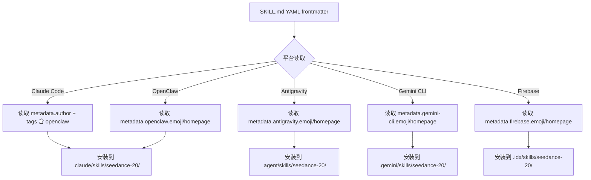
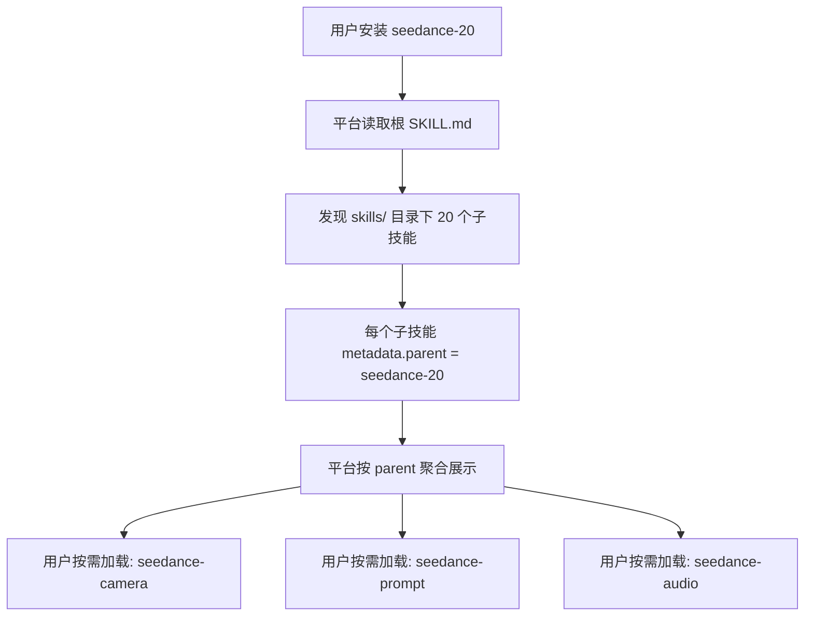

# PD-250.01 seedance-2.0 — YAML Frontmatter 多平台 Skill 分发与 AgentSkills 开放标准

> 文档编号：PD-250.01
> 来源：seedance-2.0 `SKILL.md` `README.md` `skills/*/SKILL.md`
> GitHub：https://github.com/Emily2040/seedance-2.0.git
> 问题域：PD-250 跨平台分发 Cross-Platform Distribution
> 状态：可复用方案

---

## 第 1 章 问题与动机

### 1.1 核心问题

AI Agent 技能（Skill）生态正在碎片化。2026 年初，主流 Agent 平台已超过 10 个（Claude Code、Gemini CLI、Antigravity、Firebase Studio、GitHub Copilot、Codex、Cursor、Windsurf、OpenCode、OpenClaw），每个平台有自己的技能安装路径、元数据格式和发现机制。一个技能作者如果想让自己的技能被所有平台消费，面临三个核心挑战：

1. **安装路径碎片化** — 每个平台约定不同的 `.xxx/skills/` 目录（`.claude/`、`.gemini/`、`.agent/`、`.cursor/` 等），手动维护 N 份副本不可持续
2. **元数据声明不统一** — 各平台对 frontmatter 字段的要求不同（有的需要 `metadata.openclaw`，有的需要 `tags` 数组包含平台名），缺乏统一标准
3. **安装体验割裂** — 用户需要知道自己用的是哪个平台，然后找到对应的安装命令，认知负担高

### 1.2 seedance-2.0 的解法概述

seedance-2.0 是一个 20 模块的 AI 视频制作技能库，实现了对 10+ Agent 平台的统一分发。其核心策略：

1. **单仓库多平台声明** — 在每个 `SKILL.md` 的 YAML frontmatter 中同时声明所有平台的 metadata 块（`SKILL.md:7-8`），一份源码服务所有平台
2. **tags 数组作为平台发现索引** — 将平台名（`openclaw`、`antigravity`、`gemini-cli`、`codex`、`cursor`、`windsurf`、`opencode`）写入 `tags` 数组（`SKILL.md:7`），让各平台的搜索引擎都能发现该技能
3. **README 平台矩阵** — 在 `README.md:164-176` 提供完整的 workspace + global 双路径安装表，覆盖 10 个平台
4. **一键安装命令标准化** — 在 `SKILL.md:37-51` 和 `README.md:137-158` 提供每个平台的 `<platform> skills install <repo_url>` 命令
5. **AgentSkills 开放标准合规** — 所有 21 个 SKILL.md 通过 agentskills.io 验证（`README.md:281-288`）

### 1.3 设计思想

| 设计原则 | 具体实现 | 理由 | 替代方案 |
|----------|----------|------|----------|
| 单源多目标 | 一个 SKILL.md 包含所有平台 metadata | 避免 N 份副本的同步噩梦 | 每平台一个分支（维护成本高） |
| 声明式兼容 | YAML frontmatter 中 metadata 对象嵌套平台块 | 各平台只读自己认识的字段，忽略其他 | 运行时检测平台（需要代码逻辑） |
| 标签即发现 | tags 数组包含所有平台名 | 平台搜索引擎按 tag 索引技能 | 每平台单独注册（重复劳动） |
| 双路径安装 | workspace（`.xxx/skills/`）+ global（`~/.xxx/skills/`） | 满足项目级和全局两种使用场景 | 只提供一种路径（限制灵活性） |
| 父子层级 | 子技能声明 `metadata.parent: seedance-20` | 平台可按父技能聚合展示 | 扁平列表（20 个技能淹没用户） |
| 版本同步 | 所有 21 个 SKILL.md 统一 `metadata.version` | 避免子技能版本漂移 | 各子技能独立版本（混乱） |

---

## 第 2 章 源码实现分析

### 2.1 架构概览

seedance-2.0 的跨平台分发架构是纯声明式的——没有构建脚本、没有平台适配代码，完全依赖 YAML frontmatter 的约定。

```
seedance-2.0/
├── SKILL.md                    ← 根技能入口（含 10 平台 metadata + 安装表）
├── README.md                   ← 平台矩阵 + 双路径安装表 + 一键命令
├── skills/                     ← 20 个子技能
│   ├── seedance-prompt/
│   │   └── SKILL.md           ← 子技能（含 parent + 平台 metadata）
│   ├── seedance-camera/
│   │   └── SKILL.md
│   ├── ... (18 more)
│   └── seedance-examples-zh/
│       └── SKILL.md
└── references/                 ← 5 个参考文档（平台无关）
```

平台发现与安装流程：

```
┌─────────────────────────────────────────────────────────┐
│                    技能仓库 (GitHub)                      │
│  SKILL.md frontmatter:                                   │
│  ┌─────────────────────────────────────────────────┐     │
│  │ tags: [openclaw, antigravity, gemini-cli, ...]  │     │
│  │ metadata:                                        │     │
│  │   openclaw:  {emoji, homepage}                   │     │
│  │   antigravity: {emoji, homepage}                 │     │
│  │   gemini-cli:  {emoji, homepage}                 │     │
│  │   firebase:    {emoji, homepage}                 │     │
│  └─────────────────────────────────────────────────┘     │
└──────────────┬──────────────────────────────────────────┘
               │
    ┌──────────┼──────────┬──────────┬──────────┐
    ▼          ▼          ▼          ▼          ▼
┌────────┐┌────────┐┌────────┐┌────────┐┌────────┐
│Claude  ││Gemini  ││Anti-   ││Cursor  ││Codex   │
│Code    ││CLI     ││gravity ││        ││        │
│.claude/││.gemini/││.agent/ ││.cursor/││.agents/│
│skills/ ││skills/ ││skills/ ││skills/ ││skills/ │
└────────┘└────────┘└────────┘└────────┘└────────┘
```

### 2.2 核心实现

#### 2.2.1 根技能 Frontmatter 多平台声明



对应源码 `SKILL.md:1-9`：

```yaml
---
name: seedance-20
description: 'Generate and direct cinematic AI videos with Seedance 2.0
  (ByteDance/Dreamina/Jimeng). Covers text-to-video, image-to-video,
  video-to-video, and reference-to-video workflows...'
license: MIT
user-invocable: true
user-invokable: true
tags: ["ai-video", "filmmaking", "bytedance", "seedance", "multimodal",
       "lip-sync", "openclaw", "antigravity", "gemini-cli", "firebase",
       "codex", "cursor", "windsurf", "opencode"]
metadata: {
  "version": "3.7.0",
  "updated": "2026-02-26",
  "openclaw": {"emoji": "🎬", "homepage": "https://github.com/Emily2040/seedance-2.0"},
  "antigravity": {"emoji": "🎬", "homepage": "https://github.com/Emily2040/seedance-2.0"},
  "gemini-cli": {"emoji": "🎬", "homepage": "https://github.com/Emily2040/seedance-2.0"},
  "firebase": {"emoji": "🎬", "homepage": "https://github.com/Emily2040/seedance-2.0"},
  "author": "Emily (@iamemily2050)",
  "repository": "https://github.com/Emily2040/seedance-2.0"
}
---
```

关键设计点：
- `tags` 数组同时包含**内容标签**（`ai-video`、`filmmaking`）和**平台标签**（`openclaw`、`antigravity`），实现双重索引
- `metadata` 对象中每个平台有独立的嵌套块，各平台只解析自己的字段
- `user-invocable` 和 `user-invokable` 双写兼容不同平台的拼写约定（`SKILL.md:6-7`）
- `description` 使用单引号包裹，包含 WHEN 触发短语（`Use when...`），符合 AgentSkills 标准

#### 2.2.2 子技能的 parent 层级声明



对应源码 `skills/seedance-camera/SKILL.md:1-9`：

```yaml
---
name: seedance-camera
description: 'Specify camera movement, shot framing, multi-shot sequences,
  and anti-drift locks for Seedance 2.0...'
license: MIT
user-invocable: true
user-invokable: true
tags: ["camera", "cinematography", "framing",
       "openclaw", "antigravity", "gemini-cli", "codex", "cursor"]
metadata: {
  "version": "3.7.0",
  "updated": "2026-02-26",
  "openclaw": {"emoji": "🎥", "homepage": "..."},
  "parent": "seedance-20",
  "antigravity": {"emoji": "🎥", "homepage": "..."},
  "gemini-cli": {"emoji": "🎥", "homepage": "..."},
  "author": "Emily (@iamemily2050)",
  "repository": "https://github.com/Emily2040/seedance-2.0"
}
---
```

关键设计点：
- `metadata.parent: "seedance-20"` 建立父子关系，平台可按此聚合
- 子技能的 `tags` 数组比根技能少——只包含该子技能实际支持的平台（如 `seedance-camera` 没有 `windsurf` 和 `opencode`）
- 每个子技能独立声明 `user-invocable: true`，可被单独调用

### 2.3 实现细节

#### 平台安装路径映射表

`README.md:164-176` 定义了完整的双路径映射：

| 平台 | Workspace 路径 | Global 路径 |
|------|---------------|-------------|
| Antigravity | `.agent/skills/seedance-20/` | `~/.gemini/antigravity/skills/seedance-20/` |
| Gemini CLI | `.gemini/skills/seedance-20/` | `~/.gemini/skills/seedance-20/` |
| Firebase Studio | `.idx/skills/seedance-20/` | — (无 global) |
| Claude Code | `.claude/skills/seedance-20/` | `~/.claude/skills/seedance-20/` |
| OpenClaw | `.claude/skills/seedance-20/` | `~/.claude/skills/seedance-20/` |
| GitHub Copilot | `.github/skills/seedance-20/` | `~/.copilot/skills/seedance-20/` |
| Codex | `.agents/skills/seedance-20/` | `~/.agents/skills/seedance-20/` |
| Cursor | `.cursor/skills/seedance-20/` | `~/.cursor/skills/seedance-20/` |
| Windsurf | `.windsurf/skills/seedance-20/` | `~/.codeium/windsurf/skills/seedance-20/` |
| OpenCode | `.opencode/skills/seedance-20/` | `~/.config/opencode/skills/seedance-20/` |

注意：OpenClaw 和 Claude Code 共享同一路径（`.claude/skills/`），因为 OpenClaw 是 Claude Code 生态的扩展。Firebase Studio 没有 global 路径，只支持 workspace 级安装。

#### AgentSkills 开放标准合规

`README.md:281-288` 列出了 21 个技能全部通过的验证项：

```
✅ name — lowercase, hyphen-separated, no dots or spaces
✅ description — single-quoted, verb-first, includes WHEN trigger phrases
✅ license: MIT · user-invocable: true · user-invokable: true
✅ tags: array and metadata with version, updated, author, platform blocks
✅ metadata.parent: seedance-20 on all 20 sub-skills
✅ No illegal top-level custom fields
```

这套合规清单来自 agentskills.io 开放标准。关键约束：
- `name` 字段不允许点号（`seedance-2.0` → `seedance-20`，见 `CHANGELOG.md:64`）
- 非标准顶层字段（`last-stress-tested`、`updated`）必须迁入 `metadata` JSON 块（`CHANGELOG.md:65-66`）
- `version` 不能作为顶层字段，必须放在 `metadata.version`（`CHANGELOG.md:67`）

#### 版本同步策略

`CHANGELOG.md:26` 记录了版本同步机制：

> "Universal Version Sync — All 21 SKILL.md files synchronized to v3.6.1 with updated 2026-02-26 metadata."

每次发版时，所有 21 个 SKILL.md 的 `metadata.version` 和 `metadata.updated` 同步更新，确保用户在任何子技能上看到的版本号一致。
