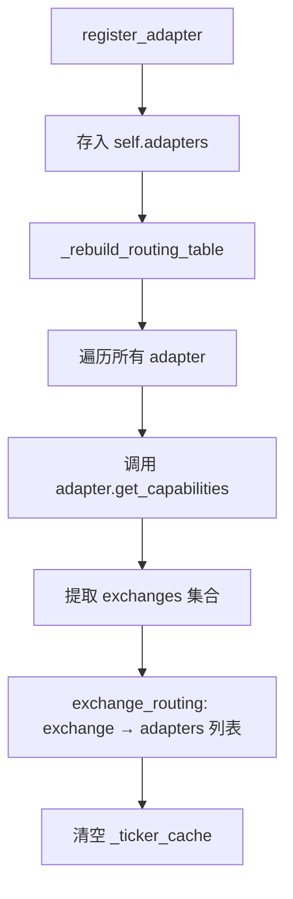
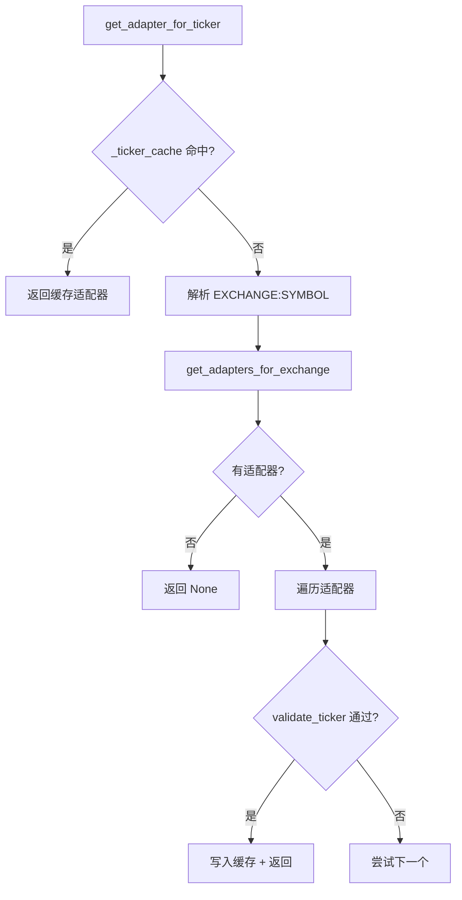
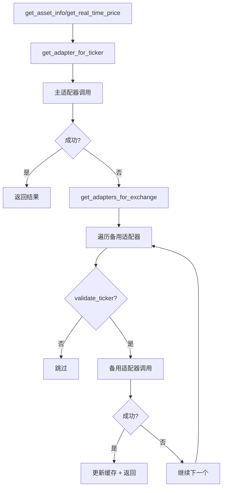

# PD-251.01 ValueCell — 多数据源统一适配与 Exchange 路由

> 文档编号：PD-251.01
> 来源：ValueCell `python/valuecell/adapters/assets/`
> GitHub：https://github.com/ValueCell-ai/valuecell.git
> 问题域：PD-251 多数据源适配器 Multi-Datasource Adapter
> 状态：可复用方案

---

## 第 1 章 问题与动机

### 1.1 核心问题

金融数据应用需要同时对接多个数据源（YFinance、AKShare、BaoStock 等），每个数据源覆盖不同的交易所和资产类型，且 ticker 格式各异（YFinance 用 `.HK` 后缀，AKShare 用 `105.AAPL` 前缀，BaoStock 用 `sh.600000` 格式）。核心挑战：

1. **格式碎片化**：同一资产在不同数据源中的标识符完全不同，需要统一的内部 ticker 格式
2. **路由决策**：给定一个 ticker，如何自动选择最合适的数据源？
3. **故障转移**：主数据源失败时，如何自动切换到备用数据源？
4. **并发效率**：批量获取多个资产价格时，如何最大化吞吐量？
5. **跨交易所去重**：同一资产可能在多个交易所上市（如 AMEX:GORO vs NASDAQ:GORO），搜索结果需要智能去重

### 1.2 ValueCell 的解法概述

ValueCell 采用 **BaseDataAdapter 抽象基类 + AdapterManager 路由管理器** 的经典策略模式：

1. **统一内部 ticker 格式** `EXCHANGE:SYMBOL`（如 `NASDAQ:AAPL`、`SSE:601398`），每个适配器负责双向转换（`base.py:167-192`）
2. **Exchange 路由表**：AdapterManager 根据适配器声明的 capabilities 自动构建 `exchange → adapters[]` 路由表（`manager.py:52-87`）
3. **Ticker 缓存 + 线程安全**：`_ticker_cache` 字典 + `threading.Lock` 避免重复路由查找（`manager.py:44-46`）
4. **自动 Failover**：每个查询方法（get_asset_info、get_real_time_price、get_historical_prices）都内置主适配器 → 备用适配器的降级链（`manager.py:499-567`）
5. **ThreadPoolExecutor 并发**：搜索和批量价格获取使用线程池并行调用多个适配器（`manager.py:329-343`）
6. **LLM Fallback 搜索**：当所有适配器搜索无结果时，用 LLM 生成候选 ticker 再逐一验证（`manager.py:360-497`）

### 1.3 设计思想

| 设计原则 | 具体实现 | 理由 | 替代方案 |
|----------|----------|------|----------|
| 策略模式 | BaseDataAdapter ABC + 具体适配器 | 新增数据源只需实现接口，不改路由逻辑 | 硬编码 if-else 分支 |
| 能力声明 | AdapterCapability(asset_type, exchanges) | 适配器自描述支持范围，路由表自动构建 | 外部配置文件映射 |
| Exchange 路由 | exchange_routing: Dict[str, List[Adapter]] | O(1) 查找，支持同一交易所多适配器 | 遍历所有适配器逐一尝试 |
| 缓存加速 | _ticker_cache + _cache_lock | 避免重复路由计算，路由表变更时自动清空 | 无缓存每次重新计算 |
| 自动降级 | 主适配器失败 → 遍历同交易所其他适配器 | 提高数据可用性，对调用方透明 | 手动指定备用源 |
| 全局单例 | get_adapter_manager() 模块级单例 | 避免重复初始化，统一管理生命周期 | 依赖注入容器 |

---

## 第 2 章 源码实现分析

### 2.1 架构概览

ValueCell 的多数据源适配架构分为三层：类型层（types.py）、适配器层（base.py + 具体适配器）、管理层（manager.py）。

```
┌─────────────────────────────────────────────────────────┐
│                    AdapterManager                        │
│  ┌──────────────────┐  ┌──────────────────────────────┐ │
│  │ exchange_routing  │  │ _ticker_cache (thread-safe)  │ │
│  │ Dict[str, List]   │  │ Dict[str, BaseDataAdapter]   │ │
│  └────────┬─────────┘  └──────────────────────────────┘ │
│           │                                              │
│  ┌────────▼──────────────────────────────────────────┐  │
│  │  register_adapter() → _rebuild_routing_table()     │  │
│  │  get_adapter_for_ticker() → cache → route → match  │  │
│  │  search_assets() → ThreadPoolExecutor → dedup      │  │
│  │  get_multiple_prices() → group by adapter → pool   │  │
│  └────────┬──────────────────────────────────────────┘  │
├───────────┼─────────────────────────────────────────────┤
│           ▼                                              │
│  ┌─────────────────┐  ┌──────────────┐  ┌────────────┐ │
│  │ YFinanceAdapter  │  │ AKShareAdapter│  │BaoStockAdpt│ │
│  │ US/HK/CN/Crypto │  │ CN/HK/US     │  │ SSE/SZSE   │ │
│  │ .HK/.SS/.SZ     │  │ 105./106.    │  │ sh./sz.    │ │
│  └────────┬────────┘  └──────┬───────┘  └─────┬──────┘ │
│           │                  │                 │         │
│  ┌────────▼──────────────────▼─────────────────▼──────┐ │
│  │              BaseDataAdapter (ABC)                   │ │
│  │  search_assets / get_asset_info / get_real_time_price│ │
│  │  get_historical_prices / get_capabilities            │ │
│  │  convert_to_source_ticker / convert_to_internal_ticker│ │
│  │  validate_ticker / get_supported_exchanges           │ │
│  └──────────────────────────────────────────────────────┘ │
├──────────────────────────────────────────────────────────┤
│  types.py: Exchange(Enum), AssetType(Enum), DataSource   │
│            Asset(Pydantic), AssetPrice(dataclass)        │
│            AdapterCapability(dataclass)                   │
└──────────────────────────────────────────────────────────┘
```

### 2.2 核心实现

#### 2.2.1 能力声明与路由表构建



对应源码 `python/valuecell/adapters/assets/manager.py:52-87`：

```python
def _rebuild_routing_table(self) -> None:
    with self.lock:
        self.exchange_routing.clear()
        for adapter in self.adapters.values():
            capabilities = adapter.get_capabilities()
            supported_exchanges = set()
            for cap in capabilities:
                for exchange in cap.exchanges:
                    exchange_key = (
                        exchange.value if isinstance(exchange, Exchange) else exchange
                    )
                    supported_exchanges.add(exchange_key)
            for exchange_key in supported_exchanges:
                if exchange_key not in self.exchange_routing:
                    self.exchange_routing[exchange_key] = []
                self.exchange_routing[exchange_key].append(adapter)
        with self._cache_lock:
            self._ticker_cache.clear()
```

每个适配器通过 `get_capabilities()` 声明自己支持的 `(AssetType, Set[Exchange])` 组合。例如 YFinanceAdapter（`yfinance_adapter.py:707-752`）声明支持 STOCK/ETF/INDEX/CRYPTO 四种资产类型，覆盖 NASDAQ/NYSE/AMEX/SSE/SZSE/HKEX/CRYPTO 七个交易所。

#### 2.2.2 Ticker 路由与缓存



对应源码 `python/valuecell/adapters/assets/manager.py:175-215`：

```python
def get_adapter_for_ticker(self, ticker: str) -> Optional[BaseDataAdapter]:
    with self._cache_lock:
        if ticker in self._ticker_cache:
            return self._ticker_cache[ticker]
    if ":" not in ticker:
        return None
    exchange, symbol = ticker.split(":", 1)
    adapters = self.get_adapters_for_exchange(exchange)
    if not adapters:
        return None
    for adapter in adapters:
        if adapter.validate_ticker(ticker):
            with self._cache_lock:
                self._ticker_cache[ticker] = adapter
            return adapter
    return None
```

#### 2.2.3 自动 Failover 机制



对应源码 `python/valuecell/adapters/assets/manager.py:535-564`：

```python
# Automatic failover: try other adapters for this exchange
exchange = ticker.split(":")[0] if ":" in ticker else ""
fallback_adapters = self.get_adapters_for_exchange(exchange)
for fallback_adapter in fallback_adapters:
    if fallback_adapter.source == adapter.source:
        continue
    if not fallback_adapter.validate_ticker(ticker):
        continue
    try:
        asset_info = fallback_adapter.get_asset_info(ticker)
        if asset_info:
            with self._cache_lock:
                self._ticker_cache[ticker] = fallback_adapter
            return asset_info
    except Exception as e:
        continue
```

关键细节：failover 成功后会**更新 ticker 缓存**，后续请求直接走成功的适配器，避免重复失败。

### 2.3 实现细节

**Ticker 格式双向转换**：每个适配器实现 `convert_to_source_ticker` 和 `convert_to_internal_ticker`。YFinance 用后缀映射（`yfinance_adapter.py:71-79`）：

| Exchange | YFinance 后缀 | AKShare 前缀 | BaoStock 前缀 |
|----------|--------------|-------------|--------------|
| NASDAQ | 无 | 105. | 不支持 |
| NYSE | 无 | 106. | 不支持 |
| SSE | .SS | 直接 symbol | sh. |
| SZSE | .SZ | 直接 symbol | sz. |
| HKEX | .HK | 直接 symbol | 不支持 |
| CRYPTO | -USD | 不支持 | 不支持 |

**智能搜索去重**（`manager.py:217-305`）：按 `(symbol, country)` 分组，使用交易所优先级表（NASDAQ:3 > NYSE:2 > AMEX:1）选择最佳结果，同优先级时比较 relevance_score。

**LLM Fallback 搜索**（`manager.py:360-497`）：当所有适配器搜索无结果时，调用 LLM（通过 agno Agent）生成候选 ticker 列表，再逐一通过 `get_adapter_for_ticker` + `get_asset_info` 验证。这是一个创新的"AI 增强数据路由"模式。

**BaoStock 全局锁**（`baostock_adapter.py:32`）：BaoStock 使用全局会话状态，因此用 `threading.Lock` 序列化所有 API 调用，避免并发冲突。

**延迟导入**（`manager.py:127`）：BaoStockAdapter 在 `configure_baostock` 中延迟导入，避免未安装 baostock 时影响其他适配器。


---

## 第 3 章 迁移指南

### 3.1 迁移清单

**阶段 1：类型基础（1 个文件）**
- [ ] 定义 `Exchange` 枚举（覆盖目标交易所）
- [ ] 定义 `DataSource` 枚举（覆盖目标数据源）
- [ ] 定义 `AssetType` 枚举
- [ ] 定义统一 ticker 格式 `EXCHANGE:SYMBOL`
- [ ] 定义 `AdapterCapability` dataclass

**阶段 2：抽象基类（1 个文件）**
- [ ] 实现 `BaseDataAdapter` ABC，包含 7 个抽象方法
- [ ] 实现 `validate_ticker` 默认逻辑（基于 capabilities 校验）
- [ ] 实现 `get_multiple_prices` 默认逻辑（逐个调用 + 异常捕获）

**阶段 3：具体适配器（每个数据源 1 个文件）**
- [ ] 实现 `_initialize`：配置超时、重试、格式映射表
- [ ] 实现 `get_capabilities`：声明支持的 (AssetType, Exchange) 组合
- [ ] 实现 `convert_to_source_ticker` / `convert_to_internal_ticker`：双向格式转换
- [ ] 实现核心数据方法：search_assets、get_asset_info、get_real_time_price、get_historical_prices

**阶段 4：管理器（1 个文件）**
- [ ] 实现 `AdapterManager`：路由表构建、ticker 缓存、自动 failover
- [ ] 实现 `ThreadPoolExecutor` 并发搜索和批量价格获取
- [ ] 实现搜索结果去重逻辑
- [ ] 实现全局单例 `get_adapter_manager()`

### 3.2 适配代码模板

以下是一个可直接运行的最小适配器框架：

```python
from abc import ABC, abstractmethod
from dataclasses import dataclass
from enum import Enum
from typing import Dict, List, Optional, Set
from concurrent.futures import ThreadPoolExecutor, as_completed
import threading


class Exchange(str, Enum):
    NASDAQ = "NASDAQ"
    NYSE = "NYSE"
    SSE = "SSE"
    SZSE = "SZSE"


class DataSource(str, Enum):
    SOURCE_A = "source_a"
    SOURCE_B = "source_b"


@dataclass
class AdapterCapability:
    asset_type: str
    exchanges: Set[Exchange]

    def supports_exchange(self, exchange: Exchange) -> bool:
        return exchange in self.exchanges


class BaseDataAdapter(ABC):
    def __init__(self, source: DataSource, **kwargs):
        self.source = source
        self.config = kwargs
        self._initialize()

    @abstractmethod
    def _initialize(self) -> None: ...

    @abstractmethod
    def get_capabilities(self) -> List[AdapterCapability]: ...

    @abstractmethod
    def convert_to_source_ticker(self, internal_ticker: str) -> str: ...

    @abstractmethod
    def convert_to_internal_ticker(self, source_ticker: str, default_exchange: Optional[str] = None) -> str: ...

    @abstractmethod
    def fetch_price(self, ticker: str) -> Optional[dict]: ...

    def validate_ticker(self, ticker: str) -> bool:
        if ":" not in ticker:
            return False
        exchange, _ = ticker.split(":", 1)
        return any(
            cap.supports_exchange(Exchange(exchange))
            for cap in self.get_capabilities()
        )


class AdapterManager:
    def __init__(self):
        self.adapters: Dict[DataSource, BaseDataAdapter] = {}
        self.exchange_routing: Dict[str, List[BaseDataAdapter]] = {}
        self._ticker_cache: Dict[str, BaseDataAdapter] = {}
        self._cache_lock = threading.Lock()
        self._lock = threading.RLock()

    def register_adapter(self, adapter: BaseDataAdapter) -> None:
        with self._lock:
            self.adapters[adapter.source] = adapter
            self._rebuild_routing_table()

    def _rebuild_routing_table(self) -> None:
        self.exchange_routing.clear()
        for adapter in self.adapters.values():
            for cap in adapter.get_capabilities():
                for exchange in cap.exchanges:
                    key = exchange.value
                    self.exchange_routing.setdefault(key, []).append(adapter)
        with self._cache_lock:
            self._ticker_cache.clear()

    def get_adapter_for_ticker(self, ticker: str) -> Optional[BaseDataAdapter]:
        with self._cache_lock:
            if ticker in self._ticker_cache:
                return self._ticker_cache[ticker]
        exchange = ticker.split(":")[0] if ":" in ticker else ""
        for adapter in self.exchange_routing.get(exchange, []):
            if adapter.validate_ticker(ticker):
                with self._cache_lock:
                    self._ticker_cache[ticker] = adapter
                return adapter
        return None

    def fetch_price_with_failover(self, ticker: str) -> Optional[dict]:
        adapter = self.get_adapter_for_ticker(ticker)
        if not adapter:
            return None
        try:
            result = adapter.fetch_price(ticker)
            if result:
                return result
        except Exception:
            pass
        # Failover
        exchange = ticker.split(":")[0]
        for fallback in self.exchange_routing.get(exchange, []):
            if fallback.source == adapter.source:
                continue
            try:
                result = fallback.fetch_price(ticker)
                if result:
                    with self._cache_lock:
                        self._ticker_cache[ticker] = fallback
                    return result
            except Exception:
                continue
        return None

    def fetch_prices_batch(self, tickers: List[str]) -> Dict[str, Optional[dict]]:
        # Group by adapter
        groups: Dict[BaseDataAdapter, List[str]] = {}
        for t in tickers:
            adapter = self.get_adapter_for_ticker(t)
            if adapter:
                groups.setdefault(adapter, []).append(t)
        results = {}
        with ThreadPoolExecutor(max_workers=len(groups) or 1) as pool:
            futures = {
                pool.submit(lambda a, ts: {t: a.fetch_price(t) for t in ts}, a, ts): a
                for a, ts in groups.items()
            }
            for future in as_completed(futures):
                try:
                    results.update(future.result(timeout=30))
                except Exception:
                    pass
        return results
```

### 3.3 适用场景

| 场景 | 适用度 | 说明 |
|------|--------|------|
| 多交易所金融数据聚合 | ⭐⭐⭐ | 核心场景，Exchange 路由表完美匹配 |
| 多 API 数据源统一接口 | ⭐⭐⭐ | 策略模式 + 能力声明可泛化到任何多源场景 |
| 需要自动故障转移的数据管道 | ⭐⭐⭐ | Failover + 缓存更新模式可直接复用 |
| 单一数据源简单查询 | ⭐ | 过度设计，直接调用即可 |
| 实时低延迟交易系统 | ⭐⭐ | 线程池 + 缓存可用，但 Python GIL 限制并发性能 |

---

## 第 4 章 测试用例

```python
import pytest
from unittest.mock import MagicMock, patch
from typing import List, Optional, Set
from dataclasses import dataclass
from enum import Enum


# --- Minimal type stubs for testing ---
class Exchange(str, Enum):
    NASDAQ = "NASDAQ"
    NYSE = "NYSE"
    SSE = "SSE"


class DataSource(str, Enum):
    SOURCE_A = "source_a"
    SOURCE_B = "source_b"


@dataclass
class AdapterCapability:
    asset_type: str
    exchanges: Set[Exchange]
    def supports_exchange(self, exchange: Exchange) -> bool:
        return exchange in self.exchanges


class MockAdapter:
    def __init__(self, source: DataSource, exchanges: Set[Exchange], fail=False):
        self.source = source
        self._exchanges = exchanges
        self._fail = fail

    def get_capabilities(self) -> List[AdapterCapability]:
        return [AdapterCapability(asset_type="stock", exchanges=self._exchanges)]

    def validate_ticker(self, ticker: str) -> bool:
        exchange = ticker.split(":")[0]
        return Exchange(exchange) in self._exchanges

    def fetch_price(self, ticker: str) -> Optional[dict]:
        if self._fail:
            raise ConnectionError("Source unavailable")
        return {"ticker": ticker, "price": 100.0, "source": self.source.value}


class TestAdapterRouting:
    """测试路由表构建与 ticker 匹配"""

    def test_routing_table_built_from_capabilities(self):
        """路由表应根据适配器能力声明自动构建"""
        from collections import defaultdict
        routing = defaultdict(list)
        adapter_a = MockAdapter(DataSource.SOURCE_A, {Exchange.NASDAQ, Exchange.NYSE})
        adapter_b = MockAdapter(DataSource.SOURCE_B, {Exchange.SSE})
        for adapter in [adapter_a, adapter_b]:
            for cap in adapter.get_capabilities():
                for ex in cap.exchanges:
                    routing[ex.value].append(adapter)
        assert len(routing["NASDAQ"]) == 1
        assert len(routing["SSE"]) == 1
        assert routing["NASDAQ"][0].source == DataSource.SOURCE_A

    def test_ticker_cache_hit(self):
        """缓存命中时应直接返回，不重新路由"""
        cache = {"NASDAQ:AAPL": MockAdapter(DataSource.SOURCE_A, {Exchange.NASDAQ})}
        assert "NASDAQ:AAPL" in cache
        assert cache["NASDAQ:AAPL"].source == DataSource.SOURCE_A

    def test_invalid_ticker_format_rejected(self):
        """无冒号的 ticker 应被拒绝"""
        adapter = MockAdapter(DataSource.SOURCE_A, {Exchange.NASDAQ})
        assert adapter.validate_ticker("AAPL") is False
        assert adapter.validate_ticker("NASDAQ:AAPL") is True


class TestFailover:
    """测试自动故障转移"""

    def test_failover_to_backup_adapter(self):
        """主适配器失败时应自动切换到备用适配器"""
        primary = MockAdapter(DataSource.SOURCE_A, {Exchange.NASDAQ}, fail=True)
        backup = MockAdapter(DataSource.SOURCE_B, {Exchange.NASDAQ}, fail=False)
        routing = {"NASDAQ": [primary, backup]}

        result = None
        for adapter in routing["NASDAQ"]:
            try:
                result = adapter.fetch_price("NASDAQ:AAPL")
                if result:
                    break
            except Exception:
                continue
        assert result is not None
        assert result["source"] == "source_b"

    def test_all_adapters_fail_returns_none(self):
        """所有适配器都失败时应返回 None"""
        a = MockAdapter(DataSource.SOURCE_A, {Exchange.NASDAQ}, fail=True)
        b = MockAdapter(DataSource.SOURCE_B, {Exchange.NASDAQ}, fail=True)
        routing = {"NASDAQ": [a, b]}

        result = None
        for adapter in routing["NASDAQ"]:
            try:
                result = adapter.fetch_price("NASDAQ:AAPL")
                if result:
                    break
            except Exception:
                continue
        assert result is None

    def test_failover_updates_cache(self):
        """Failover 成功后应更新缓存指向成功的适配器"""
        cache = {}
        primary = MockAdapter(DataSource.SOURCE_A, {Exchange.NASDAQ}, fail=True)
        backup = MockAdapter(DataSource.SOURCE_B, {Exchange.NASDAQ}, fail=False)

        for adapter in [primary, backup]:
            try:
                result = adapter.fetch_price("NASDAQ:AAPL")
                if result:
                    cache["NASDAQ:AAPL"] = adapter
                    break
            except Exception:
                continue
        assert cache.get("NASDAQ:AAPL") is backup


class TestSearchDedup:
    """测试搜索结果去重"""

    def test_cross_exchange_dedup_by_priority(self):
        """同一 symbol 在不同交易所应按优先级去重"""
        priority = {"NASDAQ": 3, "NYSE": 2, "AMEX": 1}
        results = [
            {"ticker": "AMEX:GORO", "symbol": "GORO", "country": "US"},
            {"ticker": "NASDAQ:GORO", "symbol": "GORO", "country": "US"},
        ]
        best = {}
        for r in results:
            key = (r["symbol"], r["country"])
            exchange = r["ticker"].split(":")[0]
            if key not in best or priority.get(exchange, 0) > priority.get(best[key]["ticker"].split(":")[0], 0):
                best[key] = r
        assert best[("GORO", "US")]["ticker"] == "NASDAQ:GORO"
```


---

## 第 5 章 跨域关联

| 关联域 | 关系类型 | 说明 |
|--------|----------|------|
| PD-03 容错与重试 | 依赖 | AdapterManager 的自动 failover 机制是 PD-03 容错模式的具体应用；YFinanceAdapter 内置指数退避重试（`retry_backoff_base * 2^attempt`） |
| PD-04 工具系统 | 协同 | 适配器本质上是"数据获取工具"，能力声明模式可扩展到 Agent 工具注册 |
| PD-08 搜索与检索 | 协同 | 多适配器并行搜索 + 智能去重 + LLM Fallback 搜索是 PD-08 的金融数据特化实现 |
| PD-11 可观测性 | 协同 | 每个适配器调用都有 logger 记录，failover 路径可追踪；可扩展为结构化指标 |
| PD-01 上下文管理 | 弱关联 | LLM Fallback 搜索涉及 prompt 构建和上下文管理 |

---

## 第 6 章 来源文件索引

| 文件 | 行范围 | 关键实现 |
|------|--------|----------|
| `python/valuecell/adapters/assets/types.py` | L1-L383 | Exchange/AssetType/DataSource 枚举，Asset Pydantic 模型，AssetPrice dataclass，统一 ticker 格式校验 |
| `python/valuecell/adapters/assets/base.py` | L1-L225 | BaseDataAdapter ABC（7 个抽象方法），AdapterCapability dataclass，validate_ticker 默认实现 |
| `python/valuecell/adapters/assets/manager.py` | L1-L1052 | AdapterManager 路由管理器，Exchange 路由表构建，ticker 缓存，自动 failover，ThreadPoolExecutor 并发，LLM Fallback 搜索，搜索去重，WatchlistManager，全局单例 |
| `python/valuecell/adapters/assets/yfinance_adapter.py` | L1-L903 | YFinance 适配器，exchange_mapping/suffix_mapping 双向转换，yf.Search 搜索，yf.Ticker 数据获取，批量 yf.download |
| `python/valuecell/adapters/assets/akshare_adapter.py` | L1-L1452 | AKShare 适配器，field_mappings 多市场字段映射，XQ symbol 转换，Eastmoney 分钟级/日级 API，A股/港股/美股分支处理 |
| `python/valuecell/adapters/assets/baostock_adapter.py` | L1-L400+ | BaoStock 适配器，全局锁序列化 API 调用，sh./sz. 格式转换，仅支持 SSE/SZSE |

---

## 第 7 章 横向对比维度

```json comparison_data
{
  "project": "ValueCell",
  "dimensions": {
    "适配器抽象": "BaseDataAdapter ABC + AdapterCapability 能力声明 dataclass",
    "路由机制": "Exchange 路由表自动构建，O(1) 查找 + ticker 缓存",
    "降级策略": "同交易所适配器链式 failover，成功后更新缓存",
    "并发模型": "ThreadPoolExecutor 按适配器分组并发，BaoStock 全局锁串行",
    "格式转换": "每适配器双向 convert 方法，支持 7 种交易所 × 3 种数据源格式",
    "搜索增强": "LLM Fallback 搜索：无结果时用 AI 生成候选 ticker 再验证",
    "去重机制": "交易所优先级表 + (symbol, country) 分组去重"
  }
}
```

### 域元数据补充

```json domain_metadata
{
  "solution_summary": "ValueCell 用 BaseDataAdapter ABC + Exchange 路由表 + ticker 缓存实现 YFinance/AKShare/BaoStock 三源自动路由与链式 failover，并创新性地引入 LLM Fallback 搜索",
  "description": "多数据源场景下的格式统一、智能路由与 AI 增强搜索",
  "sub_problems": [
    "跨交易所搜索结果智能去重",
    "LLM 辅助 ticker 候选生成与验证",
    "全局会话状态数据源的并发安全"
  ],
  "best_practices": [
    "Failover 成功后更新路由缓存避免重复失败",
    "延迟导入可选依赖避免影响核心功能",
    "交易所优先级表驱动搜索去重"
  ]
}
```

