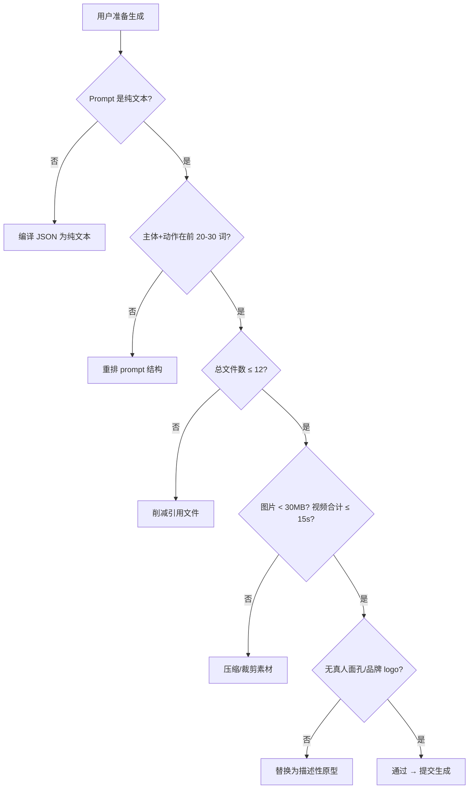
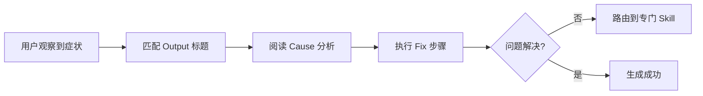
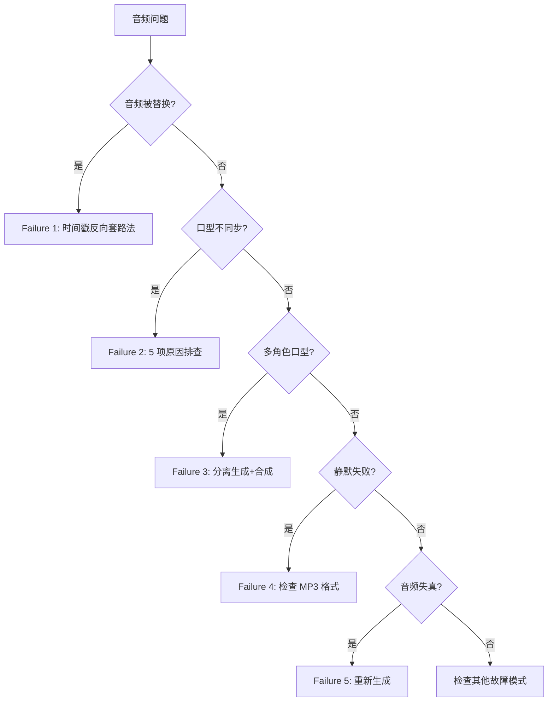

# PD-251.01 seedance-2.0 — 结构化故障诊断知识库

> 文档编号：PD-251.01
> 来源：seedance-2.0 `skills/seedance-troubleshoot/SKILL.md` `skills/seedance-audio/SKILL.md`
> GitHub：https://github.com/Emily2040/seedance-2.0.git
> 问题域：PD-251 故障诊断知识库 Troubleshooting Knowledge Base
> 状态：可复用方案

---

## 第 1 章 问题与动机（≥ 30 行）

### 1.1 核心问题

AI 视频生成系统（如 Seedance 2.0）的故障模式极其多样：运动混乱、角色漂移、音频失同步、IP 封锁、API 超时、静默失败……用户面对的不是传统软件的"报错→查日志→修 bug"流程，而是一个黑盒模型在不同输入组合下产生的不可预测退化。

核心挑战：
- **故障无错误码**：大多数生成失败不返回错误信息，表现为"输出质量差"而非"程序崩溃"
- **症状与原因多对多**：同一个"画面抖动"可能源于 prompt 过载、camera 冲突、或 motion token 竞争
- **平台约束隐性化**：文件格式限制（仅 MP3）、时长上限（15s）等硬约束违反时静默失败
- **政策动态变化**：2026 年 2 月版权执法事件导致内容过滤器持续收紧，昨天能生成的今天可能被拒

传统的"FAQ + 搜索"模式无法应对这种复杂度。需要一个结构化的故障诊断知识库，让用户（和 Agent）能快速从症状定位到原因再到修复方案。

### 1.2 seedance-2.0 的解法概述

seedance-2.0 项目构建了一个 **Skill 级故障诊断体系**，核心设计：

1. **结构化错误查找表**（`skills/seedance-troubleshoot/SKILL.md:30-146`）：15+ 故障模式，每个条目严格遵循"症状→原因→修复"三元组格式
2. **预生成检查清单**（`skills/seedance-troubleshoot/SKILL.md:16-27`）：10 项硬性检查，在生成前拦截已知问题
3. **压缩阶梯**（`skills/seedance-troubleshoot/SKILL.md:149-159`）：当 prompt 超预算时的 6 级降级策略，明确"绝不能删"的底线
4. **跨技能错误路由**（`skills/seedance-troubleshoot/SKILL.md:176-180`）：将不同类型的错误路由到专门的 Skill 处理
5. **领域专属深度诊断**（`skills/seedance-audio/SKILL.md:177-279`）：音频域 8 个故障模式的独立深度分析，含社区实测修复方案

### 1.3 设计思想

| 设计原则 | 具体实现 | 理由 | 替代方案 |
|----------|----------|------|----------|
| 症状驱动查找 | 每个条目以"Output: xxx"开头描述用户看到的现象 | 用户不知道原因，只知道看到了什么 | 按原因分类（但用户无法自行判断原因） |
| 三元组完整性 | 每个故障模式必须包含 Symptom + Cause + Fix | 缺任何一环都无法指导行动 | 仅列出常见问题（无修复方案） |
| 预防优于修复 | Pre-Generation Checklist 在生成前拦截 | 生成一次消耗算力和时间，预防成本为零 | 仅事后诊断（浪费资源） |
| 分层降级 | 压缩阶梯有明确优先级和"不可删除"底线 | 避免用户在降级时误删关键元素 | 无序删减（可能删掉核心 subject） |
| 跨技能路由 | troubleshoot 是入口，深度问题路由到专门 Skill | 保持入口简洁，深度分析不膨胀主文档 | 所有诊断集中在一个文件（过于庞大） |
| 社区实测验证 | 修复方案标注"field-tested by Douyin creators" | 区分理论建议和实际验证过的方案 | 仅提供理论修复（可能无效） |

---

## 第 2 章 源码实现分析（≥ 60 行，核心章节）

### 2.1 架构概览

seedance-2.0 的故障诊断体系采用 **三层架构**：入口层（troubleshoot）→ 路由层（跨技能引用）→ 深度层（领域专属 Skill）。

```
┌─────────────────────────────────────────────────────────┐
│                  用户遇到生成问题                          │
└──────────────────────┬──────────────────────────────────┘
                       ▼
┌─────────────────────────────────────────────────────────┐
│          seedance-troubleshoot (入口层)                   │
│  ┌──────────────┐  ┌──────────────┐  ┌───────────────┐  │
│  │ Pre-Gen      │  │ Error Lookup │  │ Compression   │  │
│  │ Checklist    │  │ Table (15+)  │  │ Ladder        │  │
│  │ (10 项检查)   │  │ 症状→原因→修复│  │ (6 级降级)     │  │
│  └──────────────┘  └──────┬───────┘  └───────────────┘  │
│                           │                              │
│  ┌────────────────────────┴────────────────────────┐     │
│  │           Quality Upgrade Checklist              │     │
│  │           (5 项质量提升建议)                       │     │
│  └─────────────────────────────────────────────────┘     │
└──────────────────────┬──────────────────────────────────┘
                       │ 路由层 (跨技能引用)
          ┌────────────┼────────────┬──────────────┐
          ▼            ▼            ▼              ▼
   seedance-audio  seedance-   seedance-     seedance-
   (音频深度诊断)   prompt     copyright     pipeline
   8 个故障模式    (prompt 构造) (IP 过滤)    (API 问题)
```

### 2.2 核心实现

#### 2.2.1 预生成检查清单



对应源码 `skills/seedance-troubleshoot/SKILL.md:16-27`：

```markdown
## Pre-Generation Checklist

- [ ] Prompt is plain text (no raw JSON)
- [ ] Subject + primary action in first 20–30 words
- [ ] Total files ≤ 12 (Rule of 12)
- [ ] Each image < 30 MB (JPG/PNG/WEBP)
- [ ] Videos: 3 clips total, **combined ≤ 15 s** (not 15 s each)
- [ ] Audio total ≤ 15 s MP3
- [ ] No real celebrity faces or brand logos
- [ ] No copyrighted character names (use archetypes)
- [ ] Duration within platform range (4–15 s; no confirmed mobile-specific cap)
- [ ] Aspect ratio declared (16:9 / 9:16 / 4:3 / 3:4 / 21:9 / 1:1)
```

这个清单的设计要点：每一项对应一个已知的静默失败模式。违反任何一项都不会报错，只会导致输出质量退化或生成失败。

#### 2.2.2 错误查找表的三元组结构



对应源码 `skills/seedance-troubleshoot/SKILL.md:32-46`，以"运动混乱"故障为例：

```markdown
### Output: chaotic / incoherent motion
**Cause**: prompt overloaded, competing actions.  
**Fix**: shorten to ≤ 50 words. Lock camera: `locked-off static camera`. One action per clip.

### Output: character drifting / inconsistent face
**Cause**: no reference image.  
**Fix**: upload character photo as `@Image1`. Add `maintain character identity from @Image1`.

### Output: camera wandering unintentionally
**Cause**: no camera instruction.  
**Fix**: add `locked-off static camera` or explicit movement (`slow push-in`, `dolly right`).

### Output: background morphing mid-clip
**Cause**: no environment anchor.  
**Fix**: add environment reference `@Image2`. Add `environment locked: [location]`.
```

每个条目的格式严格一致：`### Output: <症状>` → `**Cause**: <原因>` → `**Fix**: <修复步骤>`。这种一致性使得 Agent 可以程序化解析。

#### 2.2.3 音频域深度故障诊断



对应源码 `skills/seedance-audio/SKILL.md:181-201`，音频被替换的修复方案：

```markdown
### Failure 1: Model rewrites or replaces uploaded audio (音频被乱改)

**Fixes (field-tested by Douyin creators — 时间戳反向套路法):**
Fix A — Explicit preservation instruction:
  Add to prompt: "Audio @Audio1 plays exactly as uploaded from 0s to end.
                  Do not modify or replace the audio content."

Fix B — Remove competing audio tokens:
  Strip all ambient/SFX/music tokens from the prompt.
  Do not write: "background rain", "jazz music", "street noise"
  These invite the native audio engine to take over.

Fix C — Simplify:
  Reduce prompt to under 50 words total.
  Complex prompts increase the chance of audio substitution.
```

这段修复方案的关键特征：标注了"field-tested by Douyin creators"和中文术语"时间戳反向套路法"，表明这不是理论推测而是社区实测验证的方案。

### 2.3 实现细节

#### 压缩阶梯的优先级设计

`skills/seedance-troubleshoot/SKILL.md:149-159` 定义了 6 级压缩阶梯：

```
1. Remove filler phrases (`beautiful`, `amazing`, `stunning`)
2. Collapse environment to 3-word anchor (`misty mountain road`)
3. Cut style to 1 token (`cinematic` or `documentary`)
4. Drop SOUND layer entirely
5. Merge CAMERA + STYLE into single phrase
6. **Never cut**: SUBJECT · ACTION · @Tag assignments
```

设计逻辑：从对生成质量影响最小的元素开始删除（填充词），逐步升级到影响较大的元素（音频层、相机指令），但绝不触碰核心三要素（主体、动作、资产引用）。这个"不可删除底线"是整个阶梯的关键——它防止用户在压力下误删导致生成完全失败的核心元素。

#### 跨技能路由表

`skills/seedance-troubleshoot/SKILL.md:176-180` 的路由设计：

```
Prompt construction errors → [skill:seedance-prompt]  
Camera / storyboard issues → [skill:seedance-camera]  
API / post-processing → [skill:seedance-pipeline]  
Character consistency → [skill:seedance-characters]  
Audio issues → [skill:seedance-audio]
```

这不是简单的"参见其他文档"。每个路由目标都是一个独立的 Skill，有自己的故障模式和修复方案。troubleshoot Skill 作为统一入口，负责初步分类和路由，避免用户在 20 个 Skill 中盲目搜索。

#### 平台硬约束的静默失败模式

`skills/seedance-audio/SKILL.md:79-94` 记录了平台硬约束：

```
Format:       MP3 only.
              WAV, AAC, OGG, FLAC, M4A are accepted with no error
              but produce no lip-sync or fail silently. #1 silent failure cause.
Duration:     ≤ 15 seconds per audio file. Hard limit.
              Optimal range: 3–8 s for best lip-sync accuracy.
File budget:  Max 3 audio clips per generation (part of the Rule of 12).
```

关键洞察：平台接受非 MP3 格式上传（不报错），但生成时静默失败。这种"接受但不工作"的行为是最难诊断的故障模式，文档将其标注为"#1 silent failure cause"。

