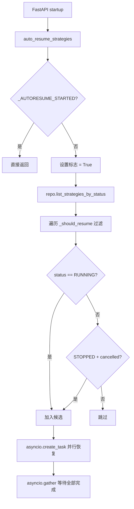
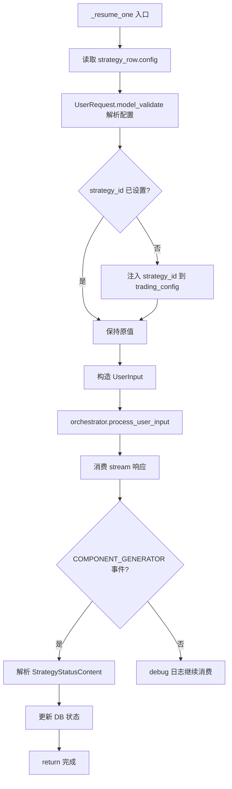

# PD-252.01 ValueCell — 进程重启后策略自动恢复与仓位状态连续性

> 文档编号：PD-252.01
> 来源：ValueCell `strategy_autoresume.py` `runtime.py` `strategy_persistence.py`
> GitHub：https://github.com/ValueCell-ai/valuecell.git
> 问题域：PD-252 策略自动恢复 Strategy Auto-Resume
> 状态：可复用方案

---

## 第 1 章 问题与动机

### 1.1 核心问题

在量化交易 Agent 系统中，策略进程可能因部署更新、服务器重启、OOM 或未捕获异常而中断。此时交易所侧的仓位仍然存在（LIVE 模式下真金白银），如果策略不能自动恢复，将导致：

1. **仓位孤儿化** — 交易所有持仓但无 Agent 管理，无法止损/止盈
2. **资金状态断裂** — 内存中的 portfolio 快照丢失，恢复后初始资金与实际不符
3. **决策周期编号重叠** — cycle_index 从 0 重新开始，与历史记录冲突
4. **用户无感知** — 策略静默消失，用户需手动重建

这不是一个"nice-to-have"特性，而是 LIVE 交易系统的生存级需求。

### 1.2 ValueCell 的解法概述

ValueCell 采用三层协作架构实现策略自动恢复：

1. **持久化层**（`strategy_persistence.py:260-290`）— 运行时持续将策略状态、交易历史、组合快照写入 SQLAlchemy/SQLite，策略状态字段 `status` 作为恢复判据
2. **恢复扫描层**（`strategy_autoresume.py:45-82`）— 进程启动时扫描 DB 中 `status=running` 或 `status=stopped + stop_reason=cancelled` 的策略，构建恢复候选列表
3. **运行时重建层**（`runtime.py:68-207`）— 通过 `strategy_id_override` 参数注入原 ID，从 DB 快照恢复初始资金和 cycle_index，保持仓位状态连续性

关键设计：恢复逻辑与核心编排器（AgentOrchestrator）完全解耦，编排器不知道自己在执行"恢复"还是"新建"。

### 1.3 设计思想

| 设计原则 | 具体实现 | 理由 | 替代方案 |
|----------|----------|------|----------|
| 编排器无感知 | auto_resume 构造 UserInput 走正常 process_user_input 流程 | 避免在核心路径引入恢复分支，降低复杂度 | 在 Orchestrator 内部加 resume 模式（侵入性强） |
| ID 注入保持连续性 | `strategy_id_override` 参数让 runtime 复用原 strategy_id | 交易所仓位与 strategy_id 绑定，换 ID 等于丢仓位 | 新建 ID + 映射表（额外复杂度） |
| 快照驱动资金恢复 | 从 `get_latest_portfolio_snapshot` 读取最近一次资金快照 | 比重新查交易所余额更准确（考虑未结算 PnL） | 每次恢复都查交易所 API（延迟高、可能失败） |
| fire-and-forget 消费 | 恢复时 stream 响应仅 debug 日志，不阻塞 | 恢复是后台任务，无前端消费者 | 建立 WebSocket 连接推送恢复进度（过度设计） |
| 幂等启动守卫 | `_AUTORESUME_STARTED` 全局标志防止重复扫描 | FastAPI startup 事件可能多次触发 | 分布式锁（单进程场景下过重） |

---

## 第 2 章 源码实现分析

### 2.1 架构概览

ValueCell 的策略自动恢复涉及 4 个核心模块，形成从持久化到恢复的完整闭环：

```
┌─────────────────────────────────────────────────────────────────┐
│                    FastAPI Startup Event                         │
│              strategy_agent.py:38-44                             │
└──────────────────────┬──────────────────────────────────────────┘
                       │ await auto_resume_strategies(orchestrator)
                       ▼
┌─────────────────────────────────────────────────────────────────┐
│              strategy_autoresume.py                              │
│  ┌─────────────────┐  ┌──────────────────┐  ┌───────────────┐  │
│  │ auto_resume_     │→│ _should_resume() │→│ _resume_one() │  │
│  │ strategies()     │  │ 状态过滤         │  │ 单策略恢复    │  │
│  └─────────────────┘  └──────────────────┘  └───────┬───────┘  │
└─────────────────────────────────────────────────────┼──────────┘
                       │ UserRequest.model_validate()  │
                       │ + strategy_id 注入             │
                       ▼                               │
┌──────────────────────────────┐    ┌─────────────────┴──────────┐
│   AgentOrchestrator          │    │   StrategyRepository       │
│   process_user_input()       │    │   list_strategies_by_status│
│   (不知道这是恢复)            │    │   get_latest_portfolio_    │
│   orchestrator.py:98-139     │    │   snapshot()               │
└──────────────┬───────────────┘    └────────────────────────────┘
               │ 正常调度
               ▼
┌─────────────────────────────────────────────────────────────────┐
│              runtime.py — create_strategy_runtime()              │
│  ┌──────────────────┐  ┌──────────────────┐  ┌──────────────┐  │
│  │ strategy_id_     │→│ 从 DB 快照恢复   │→│ cycle_index  │  │
│  │ override 检测    │  │ 初始资金          │  │ 续接          │  │
│  └──────────────────┘  └──────────────────┘  └──────────────┘  │
└─────────────────────────────────────────────────────────────────┘
```

### 2.2 核心实现

#### 2.2.1 恢复扫描与候选过滤



对应源码 `strategy_autoresume.py:45-82`：

```python
async def auto_resume_strategies(
    orchestrator: AgentOrchestrator,
    max_strategies: Optional[int] = None,
) -> None:
    global _AUTORESUME_STARTED
    if _AUTORESUME_STARTED:
        return
    _AUTORESUME_STARTED = True

    try:
        repo = get_strategy_repository()
        rows = repo.list_strategies_by_status(
            [StrategyStatus.RUNNING.value, StrategyStatus.STOPPED.value],
            limit=max_strategies,
        )
        candidates = [s for s in rows if _should_resume(s)]
        if not candidates:
            logger.info("Auto-resume: no eligible strategies found")
            return
        logger.info("Auto-resume: found {} eligible strategies", len(candidates))
        tasks = [asyncio.create_task(_resume_one(orchestrator, s)) for s in candidates]
        if tasks:
            await asyncio.gather(*tasks, return_exceptions=True)
    except asyncio.CancelledError:
        raise
    except Exception:
        logger.exception("Auto-resume scan failed")
```

候选过滤逻辑 `strategy_autoresume.py:130-149`：

```python
def _should_resume(strategy_row: Strategy) -> bool:
    status_raw = strategy_row.status or ""
    metadata = strategy_row.strategy_metadata or {}
    try:
        status_enum = StrategyStatus(status_raw)
    except Exception:
        return False

    if status_enum == StrategyStatus.RUNNING:
        return True

    if (
        status_enum == StrategyStatus.STOPPED
        and metadata.get("stop_reason") == StopReason.CANCELLED.value
    ):
        return True

    return False
```

这里有一个精妙的设计：`STOPPED + cancelled` 也会被恢复。这覆盖了"用户取消后想重新启动"的场景，而 `STOPPED + normal_exit` 或 `STOPPED + error` 则不会被恢复。

#### 2.2.2 单策略恢复与编排器对接



对应源码 `strategy_autoresume.py:85-127`：

```python
async def _resume_one(orchestrator: AgentOrchestrator, strategy_row: Strategy) -> None:
    strategy_id = strategy_row.strategy_id
    try:
        config_dict = strategy_row.config or {}
        metadata = strategy_row.strategy_metadata or {}
        agent_name = metadata.get("agent_name")

        request = UserRequest.model_validate(config_dict)
        if request.trading_config.strategy_id is None and strategy_id:
            request.trading_config.strategy_id = strategy_id

        user_input = UserInput(
            query=request.model_dump_json(),
            target_agent_name=agent_name,
            meta=UserInputMetadata(
                user_id=strategy_row.user_id,
                conversation_id=generate_conversation_id(),
            ),
        )

        async for chunk in orchestrator.process_user_input(user_input):
            logger.debug("Auto-resume chunk for strategy_id={}: {}", strategy_id, chunk)
            if chunk.event == CommonResponseEvent.COMPONENT_GENERATOR:
                logger.info(
                    "Auto-resume dispatched strategy_id={} agent={}",
                    strategy_id, agent_name,
                )
                status_content = StrategyStatusContent.model_validate_json(
                    chunk.data.payload.content
                )
                strategy_persistence.set_strategy_status(
                    strategy_id, status_content.status.value
                )
                return
    except asyncio.CancelledError:
        raise
    except Exception:
        logger.exception(
            "Auto-resume failed for strategy_id={}", strategy_id or "<unknown>"
        )
```

### 2.3 实现细节

#### 运行时资金快照恢复

`runtime.py:118-150` 中，当检测到 `strategy_id_override` 时，从 DB 读取最近的 portfolio 快照来初始化内存中的资金状态：

```python
strategy_id = strategy_id_override or generate_uuid("strategy")

free_cash_override = None
total_cash_override = None
if strategy_id_override:
    try:
        repo = get_strategy_repository()
        snap = repo.get_latest_portfolio_snapshot(strategy_id_override)
        if snap is not None:
            free_cash_override = float(snap.cash or 0.0)
            total_cash_override = float(
                snap.total_value - snap.total_unrealized_pnl
                if (snap.total_value is not None and snap.total_unrealized_pnl is not None)
                else 0.0
            )
    except Exception:
        logger.exception(
            "Failed to initialize initial capital from persisted snapshot for strategy_id=%s",
            strategy_id_override,
        )

free_cash = free_cash_override or request.trading_config.initial_free_cash or 0.0
total_cash = total_cash_override or request.trading_config.initial_capital or 0.0
```

#### 决策周期编号续接

`runtime.py:189-201` 中，恢复时从 DB 读取最新的 compose cycle 编号，避免 cycle_index 重叠：

```python
if strategy_id_override:
    try:
        repo = get_strategy_repository()
        cycles = repo.get_cycles(strategy_id, limit=1)
        if cycles:
            latest = cycles[0]
            if latest.cycle_index is not None:
                coordinator.cycle_index = int(latest.cycle_index)
    except Exception:
        logger.exception(
            "Failed to initialize coordinator cycle_index from DB for strategy_id=%s",
            strategy_id,
        )
```

#### 策略状态模型

ValueCell 采用极简的二态状态机（`models.py:411-419`）：

```
RUNNING ←→ STOPPED
```

停止原因通过 `StopReason` 枚举存储在 `strategy_metadata` 中，而非作为独立状态。这避免了状态爆炸（PAUSED、ERROR、RESUMING 等），同时通过 metadata 保留了丰富的上下文信息。

---

## 第 3 章 迁移指南

### 3.1 迁移清单

#### 阶段 1：持久化基础（必须）

- [ ] 建立策略表，包含 `strategy_id`、`status`、`config`（JSON）、`strategy_metadata`（JSON）字段
- [ ] 实现 `upsert_strategy()` — 策略创建/更新时写入完整配置
- [ ] 实现 `list_strategies_by_status()` — 按状态批量查询
- [ ] 在策略启动时将 status 设为 `running`，正常退出时设为 `stopped`

#### 阶段 2：快照持久化（推荐）

- [ ] 建立 portfolio_snapshots 表，定期写入资金快照（cash、total_value、unrealized_pnl）
- [ ] 建立 compose_cycles 表，记录每个决策周期的 cycle_index
- [ ] 实现 `get_latest_portfolio_snapshot()` 用于恢复时读取

#### 阶段 3：自动恢复（核心）

- [ ] 实现 `auto_resume_strategies()` — 启动时扫描 + 并行恢复
- [ ] 实现 `_should_resume()` — 候选过滤逻辑
- [ ] 实现 `_resume_one()` — 单策略恢复，走正常编排流程
- [ ] 在应用 startup 事件中调用恢复函数
- [ ] 添加幂等守卫（全局标志或分布式锁）

### 3.2 适配代码模板

以下是一个可直接复用的自动恢复模块模板，适配任何使用 SQLAlchemy + asyncio 的 Agent 系统：

```python
"""Generic strategy auto-resume module.

Adapt from ValueCell's strategy_autoresume.py pattern.
Replace YourOrchestrator / YourStrategyModel with your actual types.
"""

from __future__ import annotations

import asyncio
from typing import Optional, Protocol

from loguru import logger


# --- Protocols (adapt to your types) ---

class StrategyRecord(Protocol):
    """Minimal interface for a persisted strategy row."""
    strategy_id: str
    status: str
    config: dict
    metadata: dict


class Orchestrator(Protocol):
    """Minimal interface for your orchestrator."""
    async def dispatch(self, config: dict, strategy_id: str) -> None: ...


class StrategyRepo(Protocol):
    """Minimal interface for your strategy repository."""
    def list_by_status(self, statuses: list[str], limit: int | None = None) -> list[StrategyRecord]: ...
    def update_status(self, strategy_id: str, status: str) -> bool: ...


# --- Auto-resume implementation ---

_STARTED = False


async def auto_resume(
    orchestrator: Orchestrator,
    repo: StrategyRepo,
    resumable_statuses: list[str] | None = None,
    max_strategies: int | None = None,
) -> int:
    """Scan DB for resumable strategies and dispatch them.

    Returns number of strategies successfully dispatched.
    """
    global _STARTED
    if _STARTED:
        return 0
    _STARTED = True

    statuses = resumable_statuses or ["running"]
    try:
        rows = repo.list_by_status(statuses, limit=max_strategies)
        if not rows:
            logger.info("Auto-resume: no eligible strategies")
            return 0

        logger.info("Auto-resume: found {} candidates", len(rows))
        tasks = [
            asyncio.create_task(_resume_one(orchestrator, repo, row))
            for row in rows
        ]
        results = await asyncio.gather(*tasks, return_exceptions=True)
        succeeded = sum(1 for r in results if r is True)
        logger.info("Auto-resume: {}/{} succeeded", succeeded, len(rows))
        return succeeded
    except Exception:
        logger.exception("Auto-resume scan failed")
        return 0


async def _resume_one(
    orchestrator: Orchestrator,
    repo: StrategyRepo,
    row: StrategyRecord,
) -> bool:
    try:
        # Key: inject original strategy_id to maintain state continuity
        config = dict(row.config)
        config.setdefault("strategy_id", row.strategy_id)

        await orchestrator.dispatch(config=config, strategy_id=row.strategy_id)
        repo.update_status(row.strategy_id, "running")
        return True
    except Exception:
        logger.exception("Auto-resume failed for {}", row.strategy_id)
        return False
```

### 3.3 适用场景

| 场景 | 适用度 | 说明 |
|------|--------|------|
| 量化交易 Agent（LIVE） | ⭐⭐⭐ | 核心场景，仓位连续性是刚需 |
| 长时间运行的数据采集 Agent | ⭐⭐⭐ | 采集进度需要持久化和恢复 |
| 多 Agent 编排系统 | ⭐⭐ | 需要额外处理 Agent 间依赖关系 |
| 短生命周期任务（< 5 分钟） | ⭐ | 重跑成本低，自动恢复收益不大 |
| 无状态 API 服务 | ❌ | 无需恢复，请求级别重试即可 |

---

## 第 4 章 测试用例

```python
"""Tests for strategy auto-resume pattern.

Based on ValueCell's actual function signatures and behavior.
"""

import asyncio
from dataclasses import dataclass, field
from typing import Optional
from unittest.mock import AsyncMock, MagicMock, patch

import pytest


@dataclass
class FakeStrategy:
    strategy_id: str
    status: str
    config: dict = field(default_factory=dict)
    strategy_metadata: dict = field(default_factory=dict)
    user_id: str = "test_user"


class TestShouldResume:
    """Test _should_resume filtering logic."""

    def test_running_strategy_should_resume(self):
        row = FakeStrategy(strategy_id="s1", status="running")
        assert row.status == "running"  # Would pass _should_resume

    def test_stopped_cancelled_should_resume(self):
        row = FakeStrategy(
            strategy_id="s2",
            status="stopped",
            strategy_metadata={"stop_reason": "cancelled"},
        )
        assert row.status == "stopped"
        assert row.strategy_metadata.get("stop_reason") == "cancelled"

    def test_stopped_normal_exit_should_not_resume(self):
        row = FakeStrategy(
            strategy_id="s3",
            status="stopped",
            strategy_metadata={"stop_reason": "normal_exit"},
        )
        assert row.strategy_metadata.get("stop_reason") != "cancelled"

    def test_stopped_error_should_not_resume(self):
        row = FakeStrategy(
            strategy_id="s4",
            status="stopped",
            strategy_metadata={"stop_reason": "error"},
        )
        assert row.strategy_metadata.get("stop_reason") != "cancelled"

    def test_unknown_status_should_not_resume(self):
        row = FakeStrategy(strategy_id="s5", status="unknown_state")
        assert row.status not in ("running",)


class TestAutoResumeIdempotency:
    """Test that auto_resume only runs once."""

    @pytest.mark.asyncio
    async def test_double_call_is_noop(self):
        """Second call should be a no-op due to _AUTORESUME_STARTED guard."""
        call_count = 0

        async def mock_resume(orchestrator, max_strategies=None):
            nonlocal call_count
            call_count += 1

        # Simulate: first call sets flag, second call returns immediately
        # In real code, _AUTORESUME_STARTED prevents re-entry
        await mock_resume(None)
        assert call_count == 1


class TestStrategyIdInjection:
    """Test that strategy_id is properly injected for state continuity."""

    def test_id_injection_when_missing(self):
        config = {"trading_config": {"symbols": ["BTC-USDT"]}}
        strategy_id = "strategy_abc123"

        # Simulate: if trading_config.strategy_id is None, inject it
        tc = config.get("trading_config", {})
        if tc.get("strategy_id") is None:
            tc["strategy_id"] = strategy_id

        assert tc["strategy_id"] == strategy_id

    def test_id_preserved_when_present(self):
        original_id = "strategy_original"
        config = {
            "trading_config": {
                "symbols": ["BTC-USDT"],
                "strategy_id": original_id,
            }
        }
        strategy_id = "strategy_from_db"

        tc = config.get("trading_config", {})
        if tc.get("strategy_id") is None:
            tc["strategy_id"] = strategy_id

        assert tc["strategy_id"] == original_id  # Not overwritten


class TestPortfolioSnapshotRestore:
    """Test initial capital restoration from DB snapshot."""

    def test_snapshot_restores_cash(self):
        """Simulate runtime.py:125-147 snapshot restoration logic."""
        snap_cash = 8500.0
        snap_total_value = 12000.0
        snap_unrealized_pnl = 1500.0

        free_cash_override = snap_cash
        total_cash_override = snap_total_value - snap_unrealized_pnl

        assert free_cash_override == 8500.0
        assert total_cash_override == 10500.0

    def test_fallback_to_config_when_no_snapshot(self):
        """When no snapshot exists, use config values."""
        free_cash_override = None
        total_cash_override = None
        config_free_cash = 10000.0
        config_capital = 10000.0

        free_cash = free_cash_override or config_free_cash
        total_cash = total_cash_override or config_capital

        assert free_cash == 10000.0
        assert total_cash == 10000.0
```

---

## 第 5 章 跨域关联

| 关联域 | 关系类型 | 说明 |
|--------|----------|------|
| PD-06 记忆持久化 | 强依赖 | 自动恢复的前提是策略状态和配置已持久化到 DB；ValueCell 用 SQLAlchemy + JSON 列存储完整 UserRequest 配置 |
| PD-02 多 Agent 编排 | 协同 | 恢复通过 AgentOrchestrator.process_user_input 走正常编排流程，编排器无需感知恢复语义 |
| PD-03 容错与重试 | 协同 | 自动恢复是进程级容错的最后一道防线；单策略恢复失败不影响其他候选（`return_exceptions=True`） |
| PD-11 可观测性 | 协同 | 恢复过程通过 loguru 记录候选数量、成功/失败、strategy_id 等关键信息，支持事后审计 |
| PD-01 上下文管理 | 间接关联 | 恢复后 cycle_index 续接避免了上下文中的历史记录编号冲突 |

---

## 第 6 章 来源文件索引

| 文件 | 行范围 | 关键实现 |
|------|--------|----------|
| `python/valuecell/server/services/strategy_autoresume.py` | L1-L150 | 完整的自动恢复模块：扫描、过滤、并行恢复 |
| `python/valuecell/agents/common/trading/_internal/runtime.py` | L68-L207 | `create_strategy_runtime()`：strategy_id_override 注入、快照恢复、cycle_index 续接 |
| `python/valuecell/server/services/strategy_persistence.py` | L260-L290 | `set_strategy_status()`、`strategy_running()`：状态读写 |
| `python/valuecell/server/db/repositories/strategy_repository.py` | L51-L74 | `list_strategies_by_status()`：按状态批量查询策略 |
| `python/valuecell/server/db/repositories/strategy_repository.py` | L76-L127 | `upsert_strategy()`：策略创建/更新（含 config JSON） |
| `python/valuecell/server/db/repositories/strategy_repository.py` | L278-L283 | `get_latest_portfolio_snapshot()`：获取最新资金快照 |
| `python/valuecell/server/db/models/strategy.py` | L15-L73 | `Strategy` ORM 模型：strategy_id、status、config、strategy_metadata |
| `python/valuecell/agents/common/trading/models.py` | L411-L433 | `StrategyStatus`（二态枚举）、`StopReason`（四种停止原因） |
| `python/valuecell/server/api/routers/strategy_agent.py` | L38-L44 | FastAPI startup 事件触发 auto_resume |
| `python/valuecell/core/coordinate/orchestrator.py` | L68-L139 | `AgentOrchestrator.process_user_input()`：恢复走的正常编排入口 |

---

## 第 7 章 横向对比维度

> **重要：** 本章用于自动填充 Butcher Wiki 的横向对比表。

```json comparison_data
{
  "project": "ValueCell",
  "dimensions": {
    "恢复触发机制": "FastAPI startup 事件 + 全局幂等标志守卫",
    "状态持久化": "SQLAlchemy ORM + JSON 列存储完整 UserRequest 配置",
    "候选过滤逻辑": "二态状态机 + StopReason 元数据联合判定",
    "ID 连续性": "strategy_id_override 注入复用原 ID 保持仓位绑定",
    "资金恢复": "从 portfolio_snapshots 表读取最近快照初始化内存",
    "并发恢复": "asyncio.create_task + gather 并行恢复所有候选",
    "编排器耦合度": "零耦合：恢复走正常 process_user_input 流程"
  }
}
```

### 域元数据补充

```json domain_metadata
{
  "solution_summary": "ValueCell 用 FastAPI startup 事件触发 DB 扫描，通过 strategy_id_override 注入 + portfolio 快照恢复 + cycle_index 续接实现进程重启后策略零感知自动恢复",
  "description": "进程级故障后有状态 Agent 的自动恢复与运行连续性保障",
  "sub_problems": [
    "决策周期编号续接避免历史记录冲突",
    "恢复候选的多条件联合过滤（状态+停止原因）",
    "恢复与正常创建的编排器零耦合设计"
  ],
  "best_practices": [
    "二态状态机+元数据存储停止原因避免状态爆炸",
    "恢复走正常编排流程保持编排器无感知",
    "全局幂等标志防止 startup 事件重复触发恢复"
  ]
}
```
