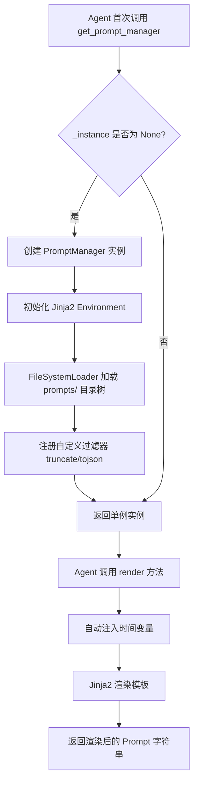
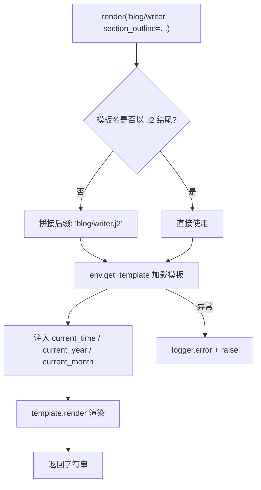
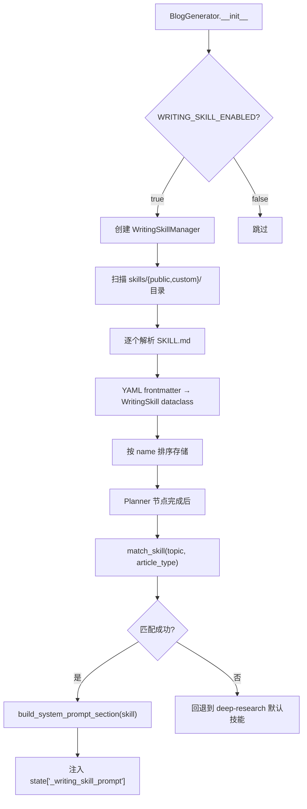

# PD-253.01 vibe-blog — Jinja2 单例 PromptManager 与 SKILL.md 写作技能注入

> 文档编号：PD-253.01
> 来源：vibe-blog `backend/infrastructure/prompts/prompt_manager.py`
> GitHub：https://github.com/datawhalechina/vibe-blog.git
> 问题域：PD-253 Prompt模板工程 Prompt Template Engineering
> 状态：可复用方案

---

## 第 1 章 问题与动机

### 1.1 核心问题

多 Agent 博客生成系统中，每个 Agent（Researcher、Planner、Writer、Reviewer、Artist、Humanizer 等 15+ 角色）都需要独立的系统提示词。这些提示词存在三个工程难题：

1. **散落在代码中的硬编码 Prompt** — 修改一个提示词需要改 Python 代码、重新部署，无法让非开发者（如内容运营）参与 Prompt 调优
2. **跨 Agent 变量不一致** — 多个 Agent 都需要注入 `current_time`、`audience_adaptation`、`verbatim_data` 等上下文变量，手动拼接容易遗漏或格式不统一
3. **写作方法论无法复用** — 不同主题（深度研究、技术教程、问题解决）需要不同的写作策略，但这些策略以自然语言描述，无法用传统代码抽象

vibe-blog 的解法是将 Prompt 管理拆成两层：底层用 Jinja2 模板引擎统一渲染所有 Agent 的 Prompt，上层用 SKILL.md 声明式文件管理写作方法论，运行时按主题匹配后注入系统提示词。

### 1.2 vibe-blog 的解法概述

1. **PromptManager 单例** — 基于 Jinja2 的 `FileSystemLoader` 加载整个 `infrastructure/prompts/` 目录树，支持 `blog/`、`reviewer/`、`image_styles/`、`shared/` 四个子目录，70+ 模板文件统一管理（`prompt_manager.py:20-54`）
2. **自动变量注入** — 每次 `render()` 自动注入 `current_time`、`current_year`、`current_month`，消除时间相关的幻觉问题（`prompt_manager.py:101-105`）
3. **自定义过滤器** — 注册 `truncate` 和 `tojson` 过滤器，模板中可直接 `{{ section_outline | tojson(indent=2) }}` 序列化复杂对象（`prompt_manager.py:50-52`）
4. **便捷方法层** — 为每个 Agent 提供类型安全的 `render_xxx()` 方法（30+ 个），参数有默认值和类型提示，调用方无需记忆模板路径（`prompt_manager.py:112-577`）
5. **WritingSkillManager** — 扫描 `skills/{public,custom}/` 目录下的 SKILL.md 文件，解析 YAML frontmatter + Markdown 正文，按主题匹配后以 XML 标签包裹注入 Writer 的系统提示词（`writing_skill_manager.py:77-137`）

### 1.3 设计思想

| 设计原则 | 具体实现 | 理由 | 替代方案 |
|----------|----------|------|----------|
| 模板与代码分离 | `.j2` 文件独立于 Python 代码 | 非开发者可直接编辑 Prompt，无需改代码 | 硬编码字符串（不可维护） |
| 单例 + 目录树加载 | `PromptManager._instance` + `FileSystemLoader` | 避免重复初始化 Jinja2 环境，子目录前缀路由 | 每个 Agent 独立加载（重复开销） |
| 声明式技能文件 | SKILL.md = YAML frontmatter + Markdown 正文 | 写作方法论用自然语言描述，Git 可追踪 | 数据库存储（不利于版本控制） |
| 多态 PromptFamily | 按模型家族（Claude/OpenAI/Qwen）适配格式 | 不同 LLM 对上下文注入有不同最优格式 | 统一格式（牺牲效果） |
| 便捷方法封装 | `render_writer()`、`render_planner()` 等 30+ 方法 | 类型安全 + IDE 自动补全 + 参数默认值 | 直接调用 `render("blog/writer", ...)` |

---

## 第 2 章 源码实现分析

### 2.1 架构概览

vibe-blog 的 Prompt 管理体系分为三层：

```
┌─────────────────────────────────────────────────────────┐
│                    Agent 调用层                          │
│  WriterAgent / PlannerAgent / ReviewerAgent / ...       │
│  调用 pm.render_writer(...) 或 pm.render("blog/xxx")    │
├─────────────────────────────────────────────────────────┤
│                  PromptManager 单例                      │
│  Jinja2 Environment + FileSystemLoader                  │
│  自动注入: current_time / current_year / current_month  │
│  自定义过滤器: truncate / tojson                         │
├─────────────────────────────────────────────────────────┤
│                  模板文件系统                             │
│  infrastructure/prompts/                                │
│  ├── blog/          (50 个 .j2 模板)                    │
│  ├── reviewer/      (6 个 .j2 模板)                     │
│  ├── image_styles/  (10 个 .j2 模板)                    │
│  └── shared/        (2 个 .j2 模板)                     │
├─────────────────────────────────────────────────────────┤
│              WritingSkillManager (可选层)                 │
│  扫描 skills/{public,custom}/*/SKILL.md                 │
│  YAML frontmatter 解析 → 主题匹配 → XML 标签注入        │
├─────────────────────────────────────────────────────────┤
│              PromptFamily (可选层)                        │
│  按模型家族适配: Claude=XML / OpenAI=Markdown / Qwen=文本│
└─────────────────────────────────────────────────────────┘
```

### 2.2 核心实现

#### 2.2.1 PromptManager 单例与 Jinja2 环境初始化



对应源码 `backend/infrastructure/prompts/prompt_manager.py:20-54`：

```python
class PromptManager:
    _instance: Optional['PromptManager'] = None

    def __init__(self, base_dir: str = None):
        self.base_dir = base_dir or BASE_DIR
        # 初始化 Jinja2 环境，加载整个目录树
        self.env = Environment(
            loader=FileSystemLoader(self.base_dir),
            autoescape=select_autoescape(['html', 'xml']),
            trim_blocks=True,
            lstrip_blocks=True,
        )
        # 添加自定义过滤器
        self.env.filters['truncate'] = self._truncate
        self.env.filters['tojson'] = self._tojson

    @classmethod
    def get_instance(cls, base_dir: str = None) -> 'PromptManager':
        if cls._instance is None:
            cls._instance = cls(base_dir)
        return cls._instance
```

关键设计点：`trim_blocks=True` 和 `lstrip_blocks=True` 消除 Jinja2 控制语句产生的多余空行，保证生成的 Prompt 格式整洁。`FileSystemLoader` 以 `infrastructure/prompts/` 为根，模板引用使用子目录前缀（如 `blog/writer`），Jinja2 自动解析为 `blog/writer.j2`。

#### 2.2.2 模板渲染与自动变量注入



对应源码 `backend/infrastructure/prompts/prompt_manager.py:84-108`：

```python
def render(self, template_name: str, **kwargs) -> str:
    if not template_name.endswith('.j2'):
        template_name = f"{template_name}.j2"
    try:
        template = self.env.get_template(template_name)
        # 自动注入当前时间戳
        kwargs['current_time'] = datetime.now().strftime('%Y年%m月%d日')
        kwargs['current_year'] = datetime.now().year
        kwargs['current_month'] = datetime.now().month
        return template.render(**kwargs)
    except Exception as e:
        logger.error(f"模板渲染失败 [{template_name}]: {e}")
        raise
```

自动注入 `current_time` 的设计解决了一个常见的 LLM 幻觉问题：模板 `blog/writer.j2:13` 中使用 `**当前时间：{{ current_time }}（{{ current_year }} 年）**` 明确告知 LLM 当前日期，避免模型输出过时的时间信息。`blog/planner.j2:9` 中更进一步用 `❗❗❗ 极其重要的时间约束 ❗❗❗` 强调时间边界。

#### 2.2.3 WritingSkillManager — SKILL.md 声明式技能加载



对应源码 `backend/services/blog_generator/skills/writing_skill_manager.py:35-74`：

```python
def parse_skill_md(skill_file: Path, category: str) -> Optional[WritingSkill]:
    """解析 SKILL.md（YAML frontmatter + Markdown 正文）"""
    if not skill_file.exists() or skill_file.name != "SKILL.md":
        return None
    raw = skill_file.read_text(encoding="utf-8")
    fm_match = re.match(r"^---\s*\n(.*?)\n---\s*\n", raw, re.DOTALL)
    if not fm_match:
        return None
    metadata = {}
    for line in fm_match.group(1).split("\n"):
        line = line.strip()
        if ":" in line:
            key, value = line.split(":", 1)
            metadata[key.strip()] = value.strip()
    name = metadata.get("name")
    description = metadata.get("description")
    if not name or not description:
        return None
    body = raw[fm_match.end():]
    return WritingSkill(
        name=name, description=description,
        license=metadata.get("license"),
        skill_dir=skill_file.parent, skill_file=skill_file,
        category=category,
        allowed_tools=[t.strip() for t in metadata.get("allowed-tools", "").split(",") if t.strip()],
        content=body,
    )
```

技能匹配逻辑 `writing_skill_manager.py:117-129` 采用两级匹配：先按 `article_type` 匹配 description，再按 `topic` 关键词匹配 skill name，最后回退到 `deep-research` 默认技能。匹配成功后，`build_system_prompt_section()` 将技能内容包裹在 `<writing-skill name="xxx">` XML 标签中注入系统提示词。

### 2.3 实现细节

**模板目录组织** — 70+ 个 `.j2` 模板按 Agent 角色分为 4 个子目录：

| 子目录 | 模板数 | 用途 | 典型模板 |
|--------|--------|------|----------|
| `blog/` | 50 | 博客生成全流程 Agent | writer.j2, planner.j2, researcher.j2, humanizer.j2 |
| `reviewer/` | 6 | 内容评审 Agent | quality_review.j2, depth_check.j2, readability_check.j2 |
| `image_styles/` | 10 | 图片风格定义 | cartoon.j2, academic.j2, minimalist.j2 + types/ 子目录 |
| `shared/` | 2 | 跨 Agent 共享 | document_summary.j2, image_caption.j2 |

**便捷方法设计** — PromptManager 为每个 Agent 提供专用的 `render_xxx()` 方法（30+ 个），这些方法的价值在于：
- 参数有类型提示和默认值（如 `search_results: list = None`）
- 自动处理 None → 空列表的转换（`search_results or []`）
- 调用方无需知道模板路径，只需 `pm.render_writer(section_outline=...)`

**PromptFamily 多态适配** — `prompt_family.py:22-125` 定义了 4 个家族类（BlogPromptFamily、ClaudePromptFamily、OpenAIPromptFamily、QwenPromptFamily），通过 `detect_family()` 根据模型名自动选择。Claude 用 XML 标签 `<context>...</context>`，OpenAI 用 Markdown `### context`，Qwen 用中文括号 `【context】`。该层通过环境变量 `PROMPT_FAMILY_ENABLED` 控制开关，默认关闭。

**双层技能系统** — vibe-blog 有两套互补的技能机制：
1. `SkillRegistry`（`skills/registry.py`）— 装饰器注册的后处理技能（mindmap、flashcard、study_note），在博客生成完成后执行
2. `WritingSkillManager`（`skills/writing_skill_manager.py`）— SKILL.md 声明式写作方法论技能，在写作前注入系统提示词指导写作过程

---

## 第 3 章 迁移指南

### 3.1 迁移清单

**阶段 1：基础 Prompt 模板化（1-2 天）**

- [ ] 创建 `prompts/` 目录，按 Agent 角色建子目录
- [ ] 将硬编码 Prompt 字符串提取为 `.j2` 模板文件
- [ ] 实现 PromptManager 单例，配置 Jinja2 Environment
- [ ] 注册 `truncate` 和 `tojson` 自定义过滤器
- [ ] 为每个 Agent 添加 `render_xxx()` 便捷方法

**阶段 2：自动变量注入（0.5 天）**

- [ ] 在 `render()` 中注入 `current_time`、`current_year` 等全局变量
- [ ] 在模板中添加时间约束提示（防止 LLM 时间幻觉）

**阶段 3：写作技能系统（1 天，可选）**

- [ ] 创建 `skills/{public,custom}/` 目录结构
- [ ] 编写 SKILL.md 文件（YAML frontmatter + Markdown 正文）
- [ ] 实现 WritingSkillManager 的 `load()` / `match_skill()` / `build_system_prompt_section()`
- [ ] 在编排层（Planner 节点后）注入匹配的技能到 state

**阶段 4：模型家族适配（0.5 天，可选）**

- [ ] 实现 PromptFamily 基类和各家族子类
- [ ] 添加 `detect_family()` 自动检测逻辑
- [ ] 通过环境变量控制开关

### 3.2 适配代码模板

以下是一个可直接复用的最小化 PromptManager 实现：

```python
"""最小化 PromptManager — 可直接复用到任何多 Agent 系统"""

import os
import json
from datetime import datetime
from typing import Any, Optional
from jinja2 import Environment, FileSystemLoader, select_autoescape


class PromptManager:
    """Jinja2 模板驱动的 Prompt 管理器（单例模式）"""

    _instance: Optional['PromptManager'] = None

    def __init__(self, template_dir: str):
        self.env = Environment(
            loader=FileSystemLoader(template_dir),
            autoescape=select_autoescape(['html', 'xml']),
            trim_blocks=True,
            lstrip_blocks=True,
        )
        # 自定义过滤器
        self.env.filters['truncate'] = lambda text, length=500: (
            text[:length] + '...' if text and len(text) > length else (text or '')
        )
        self.env.filters['tojson'] = lambda obj, indent=None: (
            json.dumps(obj, ensure_ascii=False, indent=indent)
        )

    @classmethod
    def get_instance(cls, template_dir: str = None) -> 'PromptManager':
        if cls._instance is None:
            if template_dir is None:
                raise ValueError("首次调用必须提供 template_dir")
            cls._instance = cls(template_dir)
        return cls._instance

    def render(self, template_name: str, **kwargs) -> str:
        """渲染模板，自动注入时间变量"""
        if not template_name.endswith('.j2'):
            template_name = f"{template_name}.j2"
        template = self.env.get_template(template_name)
        # 自动注入全局变量
        kwargs.setdefault('current_time', datetime.now().strftime('%Y年%m月%d日'))
        kwargs.setdefault('current_year', datetime.now().year)
        return template.render(**kwargs)


# 使用示例
# pm = PromptManager.get_instance("./prompts")
# prompt = pm.render("agents/writer", section_outline=outline, topic="RAG")
```

以下是 WritingSkillManager 的最小化实现：

```python
"""最小化 WritingSkillManager — SKILL.md 声明式技能加载"""

import re
from dataclasses import dataclass, field
from pathlib import Path
from typing import List, Optional


@dataclass
class WritingSkill:
    name: str
    description: str
    content: str  # Markdown 正文（方法论部分）
    category: str = "public"
    allowed_tools: List[str] = field(default_factory=list)


class WritingSkillManager:
    def __init__(self, skills_root: Path):
        self._root = skills_root
        self._skills: List[WritingSkill] = []

    def load(self) -> List[WritingSkill]:
        self._skills = []
        for category in ("public", "custom"):
            cat_dir = self._root / category
            if not cat_dir.is_dir():
                continue
            for skill_dir in sorted(cat_dir.iterdir()):
                skill_file = skill_dir / "SKILL.md"
                if not skill_file.exists():
                    continue
                skill = self._parse(skill_file, category)
                if skill:
                    self._skills.append(skill)
        return self._skills

    def _parse(self, path: Path, category: str) -> Optional[WritingSkill]:
        raw = path.read_text(encoding="utf-8")
        fm = re.match(r"^---\s*\n(.*?)\n---\s*\n", raw, re.DOTALL)
        if not fm:
            return None
        meta = dict(
            line.split(":", 1) for line in fm.group(1).split("\n")
            if ":" in line.strip()
        )
        meta = {k.strip(): v.strip() for k, v in meta.items()}
        if not meta.get("name") or not meta.get("description"):
            return None
        return WritingSkill(
            name=meta["name"], description=meta["description"],
            content=raw[fm.end():], category=category,
            allowed_tools=[t.strip() for t in meta.get("allowed-tools", "").split(",") if t.strip()],
        )

    def match_skill(self, topic: str, article_type: str = "") -> Optional[WritingSkill]:
        for skill in self._skills:
            if article_type and article_type.lower() in skill.description.lower():
                return skill
            if any(kw in topic.lower() for kw in skill.name.split("-") if len(kw) > 2):
                return skill
        return next((s for s in self._skills if s.name == "deep-research"), None)

    def inject(self, skill: WritingSkill) -> str:
        return f'<writing-skill name="{skill.name}">\n{skill.content}\n</writing-skill>'
```

### 3.3 适用场景

| 场景 | 适用度 | 说明 |
|------|--------|------|
| 多 Agent LLM 应用（5+ Agent） | ⭐⭐⭐ | 模板数量多时收益最大，统一管理 + 便捷方法 |
| 需要非开发者参与 Prompt 调优 | ⭐⭐⭐ | .j2 文件可独立编辑，无需改 Python 代码 |
| 多模型供应商切换 | ⭐⭐⭐ | PromptFamily 层按模型家族适配格式 |
| 写作/内容生成类应用 | ⭐⭐⭐ | WritingSkillManager 的方法论注入特别适合 |
| 单 Agent 简单应用 | ⭐ | 过度工程，直接用 f-string 即可 |
| Prompt 需要频繁 A/B 测试 | ⭐⭐ | 模板文件支持 Git 版本控制，但缺少运行时切换机制 |

---

## 第 4 章 测试用例

```python
"""PD-253 vibe-blog Prompt 模板工程测试用例"""

import json
import tempfile
import os
from pathlib import Path
import pytest


class TestPromptManager:
    """PromptManager 核心功能测试"""

    @pytest.fixture
    def template_dir(self, tmp_path):
        """创建临时模板目录"""
        blog_dir = tmp_path / "blog"
        blog_dir.mkdir()
        # 创建测试模板
        (blog_dir / "writer.j2").write_text(
            "当前时间：{{ current_time }}\n"
            "主题：{{ topic }}\n"
            "搜索结果数：{{ search_results | length }}"
        )
        (blog_dir / "planner.j2").write_text(
            "大纲：{{ outline | tojson(indent=2) }}\n"
            "截断测试：{{ long_text | truncate(10) }}"
        )
        return str(tmp_path)

    def test_singleton_pattern(self, template_dir):
        """测试单例模式"""
        from infrastructure.prompts.prompt_manager import PromptManager
        PromptManager._instance = None  # 重置
        pm1 = PromptManager.get_instance(template_dir)
        pm2 = PromptManager.get_instance()
        assert pm1 is pm2

    def test_auto_time_injection(self, template_dir):
        """测试自动时间变量注入"""
        from infrastructure.prompts.prompt_manager import PromptManager
        PromptManager._instance = None
        pm = PromptManager(template_dir)
        result = pm.render("blog/writer", topic="RAG")
        assert "年" in result
        assert "RAG" in result

    def test_tojson_filter(self, template_dir):
        """测试 tojson 自定义过滤器"""
        from infrastructure.prompts.prompt_manager import PromptManager
        PromptManager._instance = None
        pm = PromptManager(template_dir)
        outline = {"title": "测试", "sections": [1, 2]}
        result = pm.render("blog/planner", outline=outline, long_text="a" * 20)
        parsed = json.loads(result.split("大纲：")[1].split("\n截断")[0])
        assert parsed["title"] == "测试"

    def test_truncate_filter(self, template_dir):
        """测试 truncate 自定义过滤器"""
        from infrastructure.prompts.prompt_manager import PromptManager
        PromptManager._instance = None
        pm = PromptManager(template_dir)
        result = pm.render("blog/planner", outline={}, long_text="a" * 20)
        assert "aaaaaaaaaa..." in result

    def test_none_to_empty_list(self, template_dir):
        """测试 None 参数自动转为空列表"""
        from infrastructure.prompts.prompt_manager import PromptManager
        PromptManager._instance = None
        pm = PromptManager(template_dir)
        # search_results=None 时不应渲染搜索结果块
        result = pm.render("blog/writer", topic="test", search_results=None)
        assert "搜索结果数" not in result


class TestWritingSkillManager:
    """WritingSkillManager 技能加载与匹配测试"""

    @pytest.fixture
    def skills_dir(self, tmp_path):
        """创建临时技能目录"""
        public_dir = tmp_path / "public" / "deep-research"
        public_dir.mkdir(parents=True)
        (public_dir / "SKILL.md").write_text(
            "---\nname: deep-research\n"
            "description: 深度研究技能，适用于研究报告\n"
            "license: MIT\nallowed-tools: search, arxiv\n---\n"
            "# 深度研究\n## 方法论\n多角度调研..."
        )
        tutorial_dir = tmp_path / "public" / "tech-tutorial"
        tutorial_dir.mkdir(parents=True)
        (tutorial_dir / "SKILL.md").write_text(
            "---\nname: tech-tutorial\n"
            "description: 技术教程技能，适用于 tutorial 类型\n"
            "license: MIT\nallowed-tools: search\n---\n"
            "# 技术教程\n## 步骤化写作..."
        )
        return tmp_path

    def test_load_skills(self, skills_dir):
        """测试技能加载"""
        from services.blog_generator.skills.writing_skill_manager import WritingSkillManager
        mgr = WritingSkillManager(skills_dir)
        skills = mgr.load()
        assert len(skills) == 2
        names = {s.name for s in skills}
        assert "deep-research" in names
        assert "tech-tutorial" in names

    def test_match_by_article_type(self, skills_dir):
        """测试按文章类型匹配"""
        from services.blog_generator.skills.writing_skill_manager import WritingSkillManager
        mgr = WritingSkillManager(skills_dir)
        mgr.load()
        skill = mgr.match_skill("Python 入门", article_type="tutorial")
        assert skill is not None
        assert skill.name == "tech-tutorial"

    def test_match_fallback_to_default(self, skills_dir):
        """测试无匹配时回退到 deep-research"""
        from services.blog_generator.skills.writing_skill_manager import WritingSkillManager
        mgr = WritingSkillManager(skills_dir)
        mgr.load()
        skill = mgr.match_skill("完全不相关的主题", article_type="unknown")
        assert skill is not None
        assert skill.name == "deep-research"

    def test_build_system_prompt_section(self, skills_dir):
        """测试技能内容注入格式"""
        from services.blog_generator.skills.writing_skill_manager import WritingSkillManager
        mgr = WritingSkillManager(skills_dir)
        mgr.load()
        skill = mgr.match_skill("AI 研究", article_type="research")
        section = mgr.build_system_prompt_section(skill)
        assert '<writing-skill name="deep-research">' in section
        assert '</writing-skill>' in section
        assert "多角度调研" in section
```

---

## 第 5 章 跨域关联

| 关联域 | 关系类型 | 说明 |
|--------|----------|------|
| PD-02 多 Agent 编排 | 协同 | PromptManager 为编排层中的每个 Agent 节点提供模板化 Prompt，WritingSkillManager 在 Planner 节点后注入技能到 state，供下游 Writer 节点消费 |
| PD-04 工具系统 | 协同 | SKILL.md 的 `allowed-tools` 字段声明该技能可用的工具列表（如 `zhipu-search, serper-google`），与工具注册系统联动 |
| PD-01 上下文管理 | 依赖 | 模板中的 `truncate` 过滤器和 `verbatim_data` 机制直接服务于上下文窗口管理，`current_time` 注入防止时间幻觉也是上下文质量的一部分 |
| PD-07 质量检查 | 协同 | `reviewer/` 子目录下的 6 个模板（quality_review.j2、depth_check.j2 等）为 Reviewer Agent 提供结构化评审 Prompt，评审维度和评分标准都在模板中定义 |
| PD-10 中间件管道 | 协同 | Writer Agent 的 `_apply_template_and_style()` 方法（writer.py:88-105）在 PromptManager 渲染后再叠加 PromptComposer 的模板和风格，形成 Prompt 后处理管道 |
| PD-12 推理增强 | 协同 | PromptFamily 的 `get_system_preamble()` 为 Claude 注入 "Think step by step" 指令（prompt_family.py:53），属于推理增强的 Prompt 层面实现 |

---

## 第 6 章 来源文件索引

| 文件 | 行范围 | 关键实现 |
|------|--------|----------|
| `backend/infrastructure/prompts/prompt_manager.py` | L20-L54 | PromptManager 类定义、Jinja2 Environment 初始化、单例模式 |
| `backend/infrastructure/prompts/prompt_manager.py` | L84-L108 | `render()` 方法、自动时间变量注入、模板名后缀处理 |
| `backend/infrastructure/prompts/prompt_manager.py` | L112-L577 | 30+ 个 Agent 便捷渲染方法（render_writer、render_planner 等） |
| `backend/infrastructure/prompts/__init__.py` | L1-L16 | 模块导出、子目录说明 |
| `backend/services/blog_generator/skills/writing_skill_manager.py` | L22-L33 | WritingSkill dataclass 定义 |
| `backend/services/blog_generator/skills/writing_skill_manager.py` | L35-L74 | `parse_skill_md()` — YAML frontmatter 解析 |
| `backend/services/blog_generator/skills/writing_skill_manager.py` | L77-L143 | WritingSkillManager 类 — load/match_skill/build_system_prompt_section |
| `backend/services/blog_generator/prompt_family.py` | L22-L125 | PromptFamily 多态层 — 4 个家族类 + detect_family + 注册表 |
| `backend/services/blog_generator/skills/registry.py` | L1-L71 | SkillRegistry — 装饰器注册的后处理技能系统 |
| `backend/services/blog_generator/generator.py` | L174-L183 | WritingSkillManager 初始化与环境变量控制 |
| `backend/services/blog_generator/generator.py` | L378-L388 | 技能匹配与 state 注入逻辑 |
| `backend/infrastructure/prompts/blog/writer.j2` | L1-L311 | Writer Agent 模板 — 叙事策略、反幻觉规则、受众适配 |
| `backend/infrastructure/prompts/blog/planner.j2` | L1-L468 | Planner Agent 模板 — 叙事模式设计、字数分配、素材预分配 |
| `backend/infrastructure/prompts/reviewer/quality_review.j2` | L1-L123 | Reviewer 质量评审模板 — 三维度评分 |
| `backend/skills/public/deep-research/SKILL.md` | L1-L35 | 深度研究写作技能定义 |

---

## 第 7 章 横向对比维度

```json comparison_data
{
  "project": "vibe-blog",
  "dimensions": {
    "模板引擎": "Jinja2 FileSystemLoader 加载 70+ .j2 模板，4 子目录按角色分组",
    "变量注入": "render() 自动注入 current_time/year/month，消除时间幻觉",
    "模板组织": "blog/reviewer/image_styles/shared 四子目录，子目录前缀路由",
    "技能系统": "SKILL.md 声明式写作方法论，YAML frontmatter + Markdown 正文，按主题匹配注入",
    "模型适配": "PromptFamily 多态层按 Claude/OpenAI/Qwen 家族适配上下文格式",
    "便捷封装": "30+ render_xxx() 类型安全方法，参数默认值 + None→空列表自动转换"
  }
}
```

### 域元数据补充

```json domain_metadata
{
  "solution_summary": "vibe-blog 用 Jinja2 单例 PromptManager 管理 70+ 模板文件，配合 WritingSkillManager 从 SKILL.md 声明式文件按主题匹配写作方法论注入系统提示词，PromptFamily 多态层按模型家族适配上下文格式",
  "description": "Prompt 模板工程还需解决模型家族间的格式差异和写作方法论的声明式管理",
  "sub_problems": [
    "模型家族格式适配（Claude XML vs OpenAI Markdown vs Qwen 文本）",
    "写作方法论的声明式管理与运行时匹配注入",
    "时间幻觉防护（自动注入当前时间到模板）"
  ],
  "best_practices": [
    "render() 自动注入时间变量防止 LLM 时间幻觉",
    "便捷方法层封装模板路径和参数默认值提供类型安全调用",
    "SKILL.md 用 YAML frontmatter 声明元数据 + Markdown 正文描述方法论"
  ]
}
```
