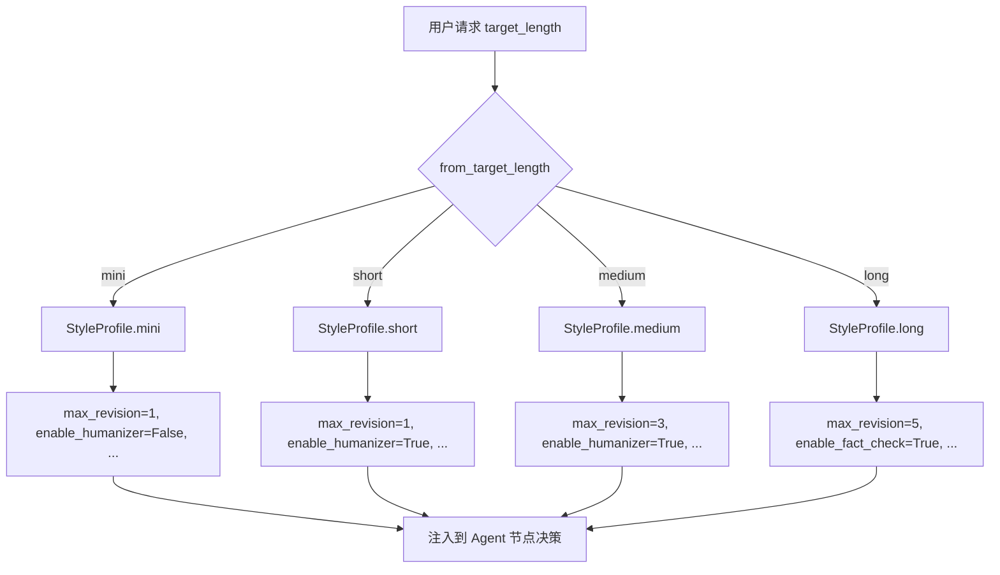
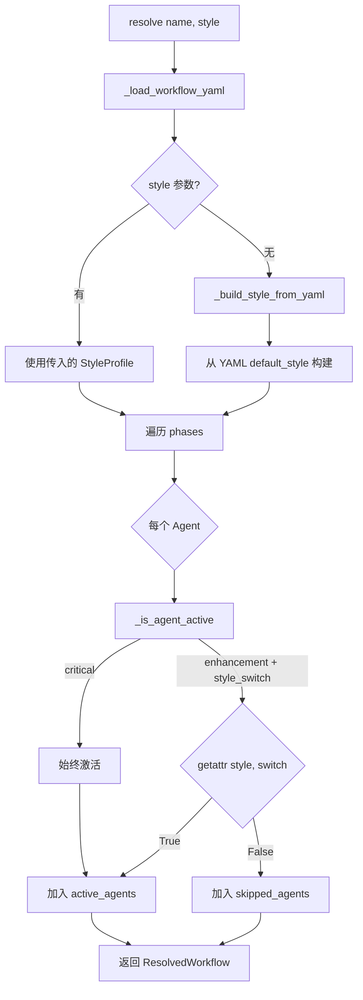

# PD-254.01 vibe-blog — YAML 声明式工作流引擎与 StyleProfile 双层配置

> 文档编号：PD-254.01
> 来源：vibe-blog `backend/services/blog_generator/orchestrator/declarative_engine.py`
> GitHub：https://github.com/datawhalechina/vibe-blog.git
> 问题域：PD-254 声明式工作流配置 Declarative Workflow Configuration
> 状态：可复用方案

---

## 第 1 章 问题与动机

### 1.1 核心问题

多 Agent 博客生成系统中，不同篇幅（mini/short/medium/long/deep/science）的工作流差异巨大：参与的 Agent 不同、修订轮数不同、增强功能开关不同。如果把这些差异硬编码在 Python 代码中，会导致：

1. **散落的条件分支** — 原始代码中有 44 处 `if target_length == ...` 分支（`style_profile.py:4` 注释明确记录），每新增一种篇幅模式就要改几十处代码
2. **Agent 组合不可配置** — 新增/移除一个 Agent 需要修改 LangGraph 图构建代码，而非简单编辑配置
3. **风格与流程耦合** — 文风（tone/complexity）、行为参数（max_revision_rounds）、Agent 开关（enable_humanizer）混在一起，无法独立调整

### 1.2 vibe-blog 的解法概述

vibe-blog 实现了三层声明式配置体系，将工作流行为从代码中完全剥离：

1. **YAML 工作流模板**（6 套预设）— 每个 YAML 文件声明 phases → agents 列表 + default_style，新增工作流只需加一个 YAML 文件（`workflow_configs/medium.yaml:1-47`）
2. **StyleProfile dataclass**（预设套餐 + 运行时覆盖）— 用 `@dataclass` 收拢 44 处散落的行为参数为 20+ 个字段，提供 `mini()/short()/medium()/long()` 等工厂方法（`style_profile.py:93-168`）
3. **DeclarativeEngine**（继承解析 + $style.* 引用）— 支持 `extends` 继承父配置、`$style.*` 动态引用风格字段，实现配置复用（`orchestrator/declarative_engine.py:28-77`）
4. **WorkflowEngine**（YAML 加载 + Agent 过滤）— 从 YAML 加载配置，根据 StyleProfile 的 `enable_*` 开关自动过滤增强 Agent，返回 `ResolvedWorkflow`（`workflow_engine.py:51-191`）
5. **双重开关机制** — 环境变量作为全局开关，StyleProfile 作为运行时开关，两者 AND 逻辑决定 Agent 是否激活（`generator.py:1006-1008`）

### 1.3 设计思想

| 设计原则 | 具体实现 | 理由 | 替代方案 |
|----------|----------|------|----------|
| 配置与代码分离 | 6 套 YAML 工作流模板 + agent_registry.yaml | 新增 Agent/工作流无需改代码 | 硬编码 if/else（原始方案，44 处分支） |
| 预设套餐模式 | StyleProfile.mini()/medium()/long() 工厂方法 | 一行代码切换完整行为参数集 | 逐字段手动配置（易遗漏） |
| 双层开关 | 环境变量(全局) AND StyleProfile(运行时) | 运维可全局禁用，用户可按需开关 | 单层开关（缺乏运维控制） |
| 继承复用 | DeclarativeEngine.resolve_extends() 递归合并 | 减少 YAML 重复，子配置只写差异 | 每套配置完整独立（大量重复） |
| Agent 注册表 | agent_registry.yaml 声明 type + style_switch | critical Agent 始终激活，enhancement 按开关过滤 | 代码中硬编码 Agent 列表 |

---

## 第 2 章 源码实现分析

### 2.1 架构概览

vibe-blog 的声明式工作流配置由四个核心组件构成：

```
┌─────────────────────────────────────────────────────────┐
│                    BlogGenerator                         │
│  generator.py:68                                        │
│  ┌──────────────┐  ┌──────────────┐  ┌───────────────┐ │
│  │ _get_style() │→ │ StyleProfile │→ │ _is_enabled() │ │
│  │  :983-988    │  │ :12-193      │  │  :1006-1008   │ │
│  └──────────────┘  └──────────────┘  └───────────────┘ │
└────────────────────────────┬────────────────────────────┘
                             │ 消费
┌────────────────────────────▼────────────────────────────┐
│                   WorkflowEngine                         │
│  workflow_engine.py:51                                   │
│  ┌──────────────┐  ┌──────────────┐  ┌───────────────┐ │
│  │ YAML Loader  │→ │ Agent Filter │→ │ResolvedWorkflow│ │
│  │  :89-102     │  │  :165-182    │  │  :40-48       │ │
│  └──────────────┘  └──────────────┘  └───────────────┘ │
└────────────────────────────┬────────────────────────────┘
                             │ 加载
┌────────────────────────────▼────────────────────────────┐
│              workflow_configs/ (YAML 层)                  │
│  ┌──────┐ ┌───────┐ ┌────────┐ ┌──────┐ ┌─────────┐   │
│  │ mini │ │ short │ │ medium │ │ long │ │ science │   │
│  └──────┘ └───────┘ └────────┘ └──────┘ └─────────┘   │
│  ┌──────────────────┐  ┌──────────────────────────┐    │
│  │agent_registry.yaml│  │ DeclarativeEngine        │    │
│  │ (Agent 元数据)    │  │ (extends + $style.* 解析)│    │
│  └──────────────────┘  └──────────────────────────┘    │
└─────────────────────────────────────────────────────────┘
```

### 2.2 核心实现

#### 2.2.1 StyleProfile — 行为参数收拢

StyleProfile 将 44 处散落的 `if target_length` 条件分支收拢为一个 dataclass，每个字段对应一个行为维度。



对应源码 `style_profile.py:12-193`：

```python
@dataclass
class StyleProfile:
    """用户风格配置 — 工作流是"骨架"，风格是"皮肤" """

    # === 行为参数（收拢 44 处 if/else）===
    max_revision_rounds: int = 3
    max_questioning_rounds: int = 2
    revision_strategy: Literal["correct_only", "full_revise"] = "full_revise"
    revision_severity_filter: Literal["high_only", "all"] = "all"
    depth_requirement: Literal["minimal", "shallow", "medium", "deep"] = "medium"
    enable_knowledge_refinement: bool = True
    image_generation_mode: Literal["mini_section", "full"] = "full"

    # === 风格参数 ===
    tone: str = "professional"
    complexity: str = "intermediate"
    verbosity: str = "balanced"

    # === 增强 Agent 开关 ===
    enable_fact_check: bool = False
    enable_thread_check: bool = True
    enable_voice_check: bool = True
    enable_humanizer: bool = True
    enable_text_cleanup: bool = True
    enable_summary_gen: bool = True
    enable_parallel: bool = True

    @classmethod
    def from_target_length(cls, target_length: str) -> 'StyleProfile':
        """从 target_length 映射到预设（向后兼容）"""
        presets = {
            'mini': cls.mini, 'short': cls.short,
            'medium': cls.medium, 'long': cls.long, 'custom': cls.medium,
        }
        return presets.get(target_length, cls.medium)()
```

#### 2.2.2 WorkflowEngine — YAML 加载与 Agent 过滤

WorkflowEngine 是声明式配置的运行时解析器，核心是 `resolve()` 方法：加载 YAML → 构建 StyleProfile → 按 style_switch 过滤 Agent。



对应源码 `workflow_engine.py:121-191`：

```python
def resolve(self, name: str, style: Optional[StyleProfile] = None) -> ResolvedWorkflow:
    config = self._load_workflow_yaml(name)
    final_style = style or self._build_style_from_yaml(config)

    phases = config.get('phases', {})
    active_phases: Dict[str, List[str]] = {}
    active_agents: List[str] = []
    skipped_agents: List[str] = []

    for phase_name, agents in phases.items():
        phase_active = []
        for agent_name in agents:
            if self._is_agent_active(agent_name, final_style):
                phase_active.append(agent_name)
            else:
                skipped_agents.append(agent_name)
        if phase_active:
            active_phases[phase_name] = phase_active
            active_agents.extend(phase_active)

    return ResolvedWorkflow(
        name=config.get('name', name),
        description=config.get('description', ''),
        default_style=config.get('default_style', {}),
        phases=active_phases,
        active_agents=active_agents,
        skipped_agents=skipped_agents,
    )

def _is_agent_active(self, agent_name: str, style: StyleProfile) -> bool:
    meta = self._agent_registry.get(agent_name)
    if not meta:
        return True  # 未注册 agent 默认激活（向前兼容）
    if meta.agent_type == "critical":
        return True  # critical 始终激活
    if meta.style_switch:
        return getattr(style, meta.style_switch, True)
    return True
```

### 2.3 实现细节

#### Agent 注册表与 style_switch 映射

`agent_registry.yaml` 为每个增强 Agent 声明 `style_switch` 字段，指向 StyleProfile 的 `enable_*` 属性名。这是一个字符串级的反射绑定：

| Agent | type | style_switch | StyleProfile 字段 |
|-------|------|-------------|-------------------|
| researcher | critical | — | 始终激活 |
| writer | critical | — | 始终激活 |
| thread_checker | enhancement | `enable_thread_check` | `StyleProfile.enable_thread_check` |
| humanizer | enhancement | `enable_humanizer` | `StyleProfile.enable_humanizer` |
| factcheck | enhancement | `enable_fact_check` | `StyleProfile.enable_fact_check` |

#### DeclarativeEngine — extends 继承与 $style.* 引用

DeclarativeEngine 提供两个高级配置能力：

1. **extends 继承**（`declarative_engine.py:37-77`）— 递归解析父配置，`default_style` 浅合并，`phases` 和 `layers` 按 key 覆盖
2. **$style.* 引用解析**（`declarative_engine.py:16-25`）— 递归遍历 JSON 树，将 `"$style.tone"` 替换为 StyleProfile 中 `tone` 字段的实际值

```python
def resolve_style_refs(config: Any, style: Dict[str, Any]) -> Any:
    """递归解析 JSON 中的 $style.* 引用"""
    if isinstance(config, str) and config.startswith("$style."):
        field = config[7:]
        return style.get(field, config)
    elif isinstance(config, dict):
        return {k: resolve_style_refs(v, style) for k, v in config.items()}
    elif isinstance(config, list):
        return [resolve_style_refs(item, style) for item in config]
    return config
```

#### 双重开关机制

`generator.py:1006-1008` 实现环境变量 AND StyleProfile 的双重开关：

```python
def _is_enabled(self, env_flag: bool, style_flag: bool) -> bool:
    """环境变量 AND StyleProfile 双重开关"""
    return env_flag and style_flag
```

环境变量在 `__init__` 时读取一次（`generator.py:119-124`），StyleProfile 在每次节点执行时动态获取（`generator.py:983-988`）。这意味着运维可以通过环境变量全局禁用某个 Agent，而用户仍可通过 StyleProfile 在运行时按需开关。

#### YAML 工作流模板差异对比

| 预设 | 字数 | phases 数 | Agent 数 | 修订轮数 | 特殊 Agent |
|------|------|-----------|----------|----------|------------|
| mini | 800 | 5 | 7 | 1 | 无 questioner/coder |
| short | 1500 | 5 | 8 | 1 | 无 questioner/coder/validate |
| medium | 3500 | 6 | 11 | 3 | 含 validate phase |
| long | 6000 | 6 | 12 | 5 | 含 factcheck |
| deep | 6000 | 6 | 12 | 5 | 学术风格 + factcheck |
| science | 3500 | 6 | 10 | 3 | 水彩配图风格 |

---

## 第 3 章 迁移指南

### 3.1 迁移清单

#### 阶段 1：StyleProfile 收拢（1-2 天）

- [ ] 盘点现有代码中所有 `if mode == ...` / `if config.xxx` 条件分支，统计散落点数量
- [ ] 创建 `StyleProfile` dataclass，将所有行为参数收拢为字段
- [ ] 为每种模式创建工厂方法（`mini()`/`medium()`/`long()` 等）
- [ ] 添加 `from_xxx()` 向后兼容方法，将旧参数映射到新 StyleProfile
- [ ] 逐步替换散落的 if/else 为 `style.field_name` 读取

#### 阶段 2：YAML 工作流模板（1-2 天）

- [ ] 创建 `workflow_configs/` 目录
- [ ] 编写 `agent_registry.yaml`，声明所有 Agent 的 type（critical/enhancement）和 style_switch
- [ ] 为每种预设创建独立 YAML 文件，声明 phases → agents + default_style
- [ ] 实现 `WorkflowEngine`：YAML 加载 + 缓存 + Agent 过滤逻辑

#### 阶段 3：高级配置能力（可选）

- [ ] 实现 `extends` 继承解析（适用于有大量相似工作流的场景）
- [ ] 实现 `$style.*` 引用解析（适用于配置中需要动态引用风格参数的场景）
- [ ] 实现 JSON Schema 校验（`validate_workflow_config`）

### 3.2 适配代码模板

#### 模板 1：StyleProfile dataclass

```python
from dataclasses import dataclass
from typing import Literal, Optional, List

@dataclass
class StyleProfile:
    """工作流风格配置 — 收拢散落的条件分支"""

    # 行为参数
    max_rounds: int = 3
    strategy: Literal["minimal", "standard", "thorough"] = "standard"
    enable_feature_a: bool = True
    enable_feature_b: bool = False

    # 风格参数
    tone: str = "professional"
    verbosity: str = "balanced"

    # 预设套餐
    @classmethod
    def light(cls) -> 'StyleProfile':
        return cls(max_rounds=1, strategy="minimal",
                   enable_feature_a=False, enable_feature_b=False)

    @classmethod
    def standard(cls) -> 'StyleProfile':
        return cls(max_rounds=3, strategy="standard",
                   enable_feature_a=True, enable_feature_b=False)

    @classmethod
    def full(cls) -> 'StyleProfile':
        return cls(max_rounds=5, strategy="thorough",
                   enable_feature_a=True, enable_feature_b=True)

    @classmethod
    def from_preset(cls, name: str) -> 'StyleProfile':
        presets = {'light': cls.light, 'standard': cls.standard, 'full': cls.full}
        return presets.get(name, cls.standard)()
```

#### 模板 2：WorkflowEngine（YAML 加载 + Agent 过滤）

```python
import yaml
from dataclasses import dataclass
from pathlib import Path
from typing import Dict, List, Optional

@dataclass
class AgentMeta:
    name: str
    agent_type: str  # "critical" | "enhancement"
    style_switch: str = ""  # 对应 StyleProfile 的 enable_* 字段

@dataclass
class ResolvedWorkflow:
    name: str
    phases: Dict[str, List[str]]
    active_agents: List[str]
    skipped_agents: List[str]

class WorkflowEngine:
    def __init__(self, configs_dir: str):
        self.configs_dir = Path(configs_dir)
        self._registry: Dict[str, AgentMeta] = {}
        self._cache: Dict[str, dict] = {}
        self._load_registry()

    def _load_registry(self):
        path = self.configs_dir / "agent_registry.yaml"
        with open(path, 'r') as f:
            data = yaml.safe_load(f)
        for name, meta in data.get('agents', {}).items():
            self._registry[name] = AgentMeta(
                name=name,
                agent_type=meta.get('type', 'enhancement'),
                style_switch=meta.get('style_switch', ''),
            )

    def resolve(self, name: str, style: StyleProfile = None) -> ResolvedWorkflow:
        config = self._load_yaml(name)
        style = style or StyleProfile()
        active, skipped = [], []
        active_phases = {}

        for phase, agents in config.get('phases', {}).items():
            phase_active = []
            for agent in agents:
                if self._is_active(agent, style):
                    phase_active.append(agent)
                else:
                    skipped.append(agent)
            if phase_active:
                active_phases[phase] = phase_active
                active.extend(phase_active)

        return ResolvedWorkflow(name=name, phases=active_phases,
                                active_agents=active, skipped_agents=skipped)

    def _is_active(self, agent_name: str, style: StyleProfile) -> bool:
        meta = self._registry.get(agent_name)
        if not meta or meta.agent_type == "critical":
            return True
        if meta.style_switch:
            return getattr(style, meta.style_switch, True)
        return True

    def _load_yaml(self, name: str) -> dict:
        if name not in self._cache:
            with open(self.configs_dir / f"{name}.yaml", 'r') as f:
                self._cache[name] = yaml.safe_load(f)
        return self._cache[name]
```

### 3.3 适用场景

| 场景 | 适用度 | 说明 |
|------|--------|------|
| 多 Agent 编排系统 | ⭐⭐⭐ | 不同模式需要不同 Agent 组合时，YAML 声明式配置最有价值 |
| 多租户 SaaS | ⭐⭐⭐ | 不同客户/套餐对应不同 StyleProfile 预设 |
| 可配置 LLM Pipeline | ⭐⭐⭐ | 将 prompt 参数、模型选择、后处理步骤声明在配置中 |
| 单一固定工作流 | ⭐ | 只有一种执行路径时，声明式配置是过度设计 |
| 高频变更的实验系统 | ⭐⭐ | 适合 A/B 测试不同工作流配置，但需注意配置版本管理 |

---

## 第 4 章 测试用例

```python
import pytest
from dataclasses import asdict

# === StyleProfile 测试 ===

class TestStyleProfile:
    def test_from_target_length_mini(self):
        """mini 预设应禁用大部分增强功能"""
        style = StyleProfile.from_target_length('mini')
        assert style.max_revision_rounds == 1
        assert style.max_questioning_rounds == 1
        assert style.revision_strategy == "correct_only"
        assert style.enable_humanizer is False
        assert style.enable_fact_check is False
        assert style.enable_thread_check is False

    def test_from_target_length_long(self):
        """long 预设应启用全部增强功能"""
        style = StyleProfile.from_target_length('long')
        assert style.max_revision_rounds == 5
        assert style.revision_strategy == "full_revise"
        assert style.enable_fact_check is True
        assert style.enable_humanizer is True
        assert style.depth_requirement == "deep"

    def test_from_target_length_unknown_fallback(self):
        """未知 target_length 应降级到 medium"""
        style = StyleProfile.from_target_length('unknown_preset')
        medium = StyleProfile.medium()
        assert style.max_revision_rounds == medium.max_revision_rounds
        assert style.tone == medium.tone

    def test_science_preset_watercolor(self):
        """science 预设应使用水彩配图风格"""
        style = StyleProfile.science_popular()
        assert style.image_style == "watercolor"
        assert style.tone == "casual"
        assert style.complexity == "beginner"


# === DeclarativeEngine 测试 ===

class TestDeclarativeEngine:
    def test_resolve_extends_merges_parent(self):
        """extends 应递归合并父配置"""
        registry = {
            "base": {
                "name": "base",
                "default_style": {"tone": "professional", "verbosity": "balanced"},
                "phases": {"plan": ["researcher"], "write": ["writer"]},
            }
        }
        child = {
            "name": "custom",
            "extends": "base",
            "default_style": {"tone": "casual"},
            "phases": {"write": ["writer", "coder"]},
        }
        engine = DeclarativeEngine(child)
        merged = engine.resolve_extends(registry)

        assert merged["name"] == "custom"
        assert merged["default_style"]["tone"] == "casual"       # 子覆盖
        assert merged["default_style"]["verbosity"] == "balanced" # 父保留
        assert merged["phases"]["plan"] == ["researcher"]         # 父保留
        assert merged["phases"]["write"] == ["writer", "coder"]   # 子覆盖

    def test_resolve_extends_missing_parent(self):
        """引用不存在的父配置应返回自身"""
        child = {"name": "orphan", "extends": "nonexistent"}
        engine = DeclarativeEngine(child)
        result = engine.resolve_extends({})
        assert result["name"] == "orphan"

    def test_resolve_style_refs(self):
        """$style.* 引用应被替换为实际值"""
        config = {
            "prompt": "Write in $style.tone style",
            "settings": {"depth": "$style.depth_requirement"},
            "tags": ["$style.complexity", "fixed_tag"],
        }
        style = {"tone": "academic", "depth_requirement": "deep", "complexity": "advanced"}
        result = resolve_style_refs(config, style)

        assert result["prompt"] == "Write in academic style"
        assert result["settings"]["depth"] == "deep"
        assert result["tags"] == ["advanced", "fixed_tag"]


# === WorkflowEngine 测试 ===

class TestWorkflowEngine:
    def test_resolve_filters_disabled_agents(self, tmp_path):
        """StyleProfile 禁用的增强 Agent 应被过滤"""
        # 准备测试 YAML
        (tmp_path / "agent_registry.yaml").write_text("""
agents:
  writer:
    type: critical
  humanizer:
    type: enhancement
    style_switch: enable_humanizer
""")
        (tmp_path / "test.yaml").write_text("""
name: test
phases:
  write: [writer]
  polish: [humanizer]
""")
        engine = WorkflowEngine(str(tmp_path))
        style = StyleProfile(enable_humanizer=False)
        result = engine.resolve("test", style=style)

        assert "writer" in result.active_agents
        assert "humanizer" in result.skipped_agents
        assert "humanizer" not in result.active_agents

    def test_critical_agent_always_active(self, tmp_path):
        """critical Agent 无论 StyleProfile 如何都应激活"""
        (tmp_path / "agent_registry.yaml").write_text("""
agents:
  writer:
    type: critical
    style_switch: enable_humanizer
""")
        (tmp_path / "test.yaml").write_text("""
name: test
phases:
  write: [writer]
""")
        engine = WorkflowEngine(str(tmp_path))
        style = StyleProfile(enable_humanizer=False)
        result = engine.resolve("test", style=style)
        assert "writer" in result.active_agents


# === validate_workflow_config 测试 ===

class TestWorkflowSchema:
    def test_valid_config(self):
        config = {"name": "test", "phases": {"plan": ["researcher"]}}
        errors = validate_workflow_config(config)
        assert errors == []

    def test_missing_name(self):
        errors = validate_workflow_config({"phases": {}})
        assert any("name" in e for e in errors)

    def test_pipeline_parallel_conflict(self):
        config = {
            "name": "test",
            "layers": {"layer1": {"pipeline": [], "parallel": []}},
        }
        errors = validate_workflow_config(config)
        assert any("pipeline" in e and "parallel" in e for e in errors)
```

---

## 第 5 章 跨域关联

| 关联域 | 关系类型 | 说明 |
|--------|----------|------|
| PD-02 多 Agent 编排 | 依赖 | YAML phases 定义的 Agent 列表直接驱动 LangGraph 图构建，WorkflowEngine 的 ResolvedWorkflow 是编排引擎的输入 |
| PD-04 工具系统 | 协同 | agent_registry.yaml 的 `class` 字段指向 Agent 实现类路径，与工具注册表形成互补的声明式体系 |
| PD-10 中间件管道 | 协同 | StyleProfile 的 `enable_*` 开关同时控制中间件管道中的增强步骤（如 ContextPrefetchMiddleware 受 enable_knowledge_refinement 影响） |
| PD-11 可观测性 | 协同 | ResolvedWorkflow 的 active_agents/skipped_agents 可直接用于日志追踪，记录每次执行实际激活了哪些 Agent |
| PD-03 容错与重试 | 协同 | agent_registry.yaml 的 `type: enhancement` 声明意味着该 Agent 失败可降级跳过，与容错策略天然配合 |

---

## 第 6 章 来源文件索引

| 文件 | 行范围 | 关键实现 |
|------|--------|----------|
| `backend/services/blog_generator/style_profile.py` | L1-L193 | StyleProfile dataclass 定义、6 种预设工厂方法、from_target_length 映射 |
| `backend/services/blog_generator/orchestrator/declarative_engine.py` | L1-L78 | DeclarativeEngine 类、resolve_extends 继承解析、resolve_style_refs $style.* 引用 |
| `backend/services/blog_generator/orchestrator/workflow_schema.py` | L1-L49 | validate_workflow_config JSON Schema 校验（phases/layers/default_style 结构检查） |
| `backend/services/blog_generator/workflow_engine.py` | L1-L191 | WorkflowEngine 类、YAML 加载缓存、Agent 过滤、ResolvedWorkflow 数据结构 |
| `backend/services/blog_generator/workflow_configs/agent_registry.yaml` | L1-L82 | 13 个 Agent 元数据声明（type + phase + style_switch） |
| `backend/services/blog_generator/workflow_configs/medium.yaml` | L1-L47 | medium 预设工作流模板（6 phases, 11 agents） |
| `backend/services/blog_generator/workflow_configs/mini.yaml` | L1-L41 | mini 预设工作流模板（5 phases, 7 agents，最精简） |
| `backend/services/blog_generator/workflow_configs/deep.yaml` | L1-L50 | deep 预设工作流模板（学术风格，含 factcheck） |
| `backend/services/blog_generator/workflow_configs/science.yaml` | L1-L40 | science 预设工作流模板（科普风格，水彩配图） |
| `backend/services/blog_generator/generator.py` | L983-L988 | _get_style() 三级优先级：实例级 > state 级 > target_length 推断 |
| `backend/services/blog_generator/generator.py` | L1006-L1008 | _is_enabled() 环境变量 AND StyleProfile 双重开关 |
| `backend/services/blog_generator/generator.py` | L118-L124 | 环境变量全局开关读取（HUMANIZER_ENABLED 等 6 个） |
| `backend/services/blog_generator/workflow_registry.py` | L1-L63 | WorkflowRegistry 装饰器模式注册（代码级注册，与 YAML 互补） |

---

## 第 7 章 横向对比维度

```json comparison_data
{
  "project": "vibe-blog",
  "dimensions": {
    "配置格式": "YAML 工作流模板 + Python dataclass StyleProfile 双层配置",
    "继承机制": "DeclarativeEngine.resolve_extends() 递归合并，default_style 浅合并 + phases 按 key 覆盖",
    "校验方式": "手写 Python 校验函数（validate_workflow_config），检查 phases/layers/default_style 结构",
    "引用解析": "$style.* 前缀递归替换，将配置中的风格引用解析为 StyleProfile 实际值",
    "Agent 过滤": "agent_registry.yaml 声明 style_switch，WorkflowEngine 按 StyleProfile enable_* 字段动态过滤",
    "开关层级": "环境变量(全局) AND StyleProfile(运行时) 双重开关，运维与用户各控一层"
  }
}
```

### 域元数据补充

```json domain_metadata
{
  "solution_summary": "vibe-blog 用 YAML 工作流模板 + StyleProfile dataclass 双层配置，将 44 处散落的 if/else 收拢为 6 套预设套餐，通过 agent_registry.yaml 的 style_switch 字段实现 Agent 动态过滤",
  "description": "声明式配置不仅定义流程结构，还需要与运行时参数（风格/开关）解耦并支持动态过滤",
  "sub_problems": [
    "$style.* 引用解析：配置中动态引用风格参数",
    "Agent 注册表与动态过滤：按 style_switch 字段自动启停增强 Agent",
    "双重开关机制：环境变量全局开关与运行时 StyleProfile 开关的 AND 逻辑"
  ],
  "best_practices": [
    "用 dataclass 工厂方法提供预设套餐，from_xxx() 保持向后兼容",
    "Agent 注册表区分 critical/enhancement 类型，critical 始终激活不受配置影响",
    "环境变量控制全局开关（运维层），StyleProfile 控制运行时开关（用户层），两层 AND 逻辑"
  ]
}
```
