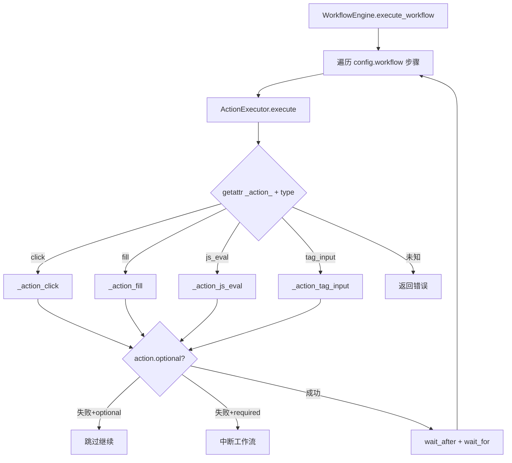
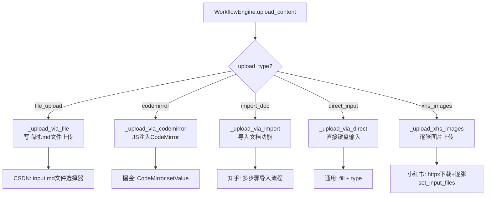

# PD-255.01 vibe-blog — YAML 驱动 Playwright 多平台发布引擎

> 文档编号：PD-255.01
> 来源：vibe-blog `backend/services/publishers/`
> GitHub：https://github.com/datawhalechina/vibe-blog.git
> 问题域：PD-255 多平台内容发布 Multi-Platform Content Publishing
> 状态：可复用方案

---

## 第 1 章 问题与动机

### 1.1 核心问题

技术博客作者面临"一次写作、多处发布"的痛点：CSDN、知乎、掘金、小红书等平台各有不同的编辑器、内容格式和发布流程。传统做法要么手动逐平台复制粘贴，要么为每个平台编写独立的 API 集成代码。前者效率低下，后者维护成本高——平台 API 变更频繁，且部分平台（如小红书）根本不提供公开发布 API。

核心矛盾：**平台发布流程的多样性** vs **发布逻辑的统一性需求**。

### 1.2 vibe-blog 的解法概述

vibe-blog 采用"配置驱动 + 浏览器自动化"的架构，将平台差异完全外化到 YAML 配置文件中：

1. **WorkflowEngine 工作流引擎** (`workflow_engine.py:313`) — 从 YAML 加载平台配置，驱动 ActionExecutor 按步骤执行浏览器操作
2. **ActionExecutor 动作执行器** (`workflow_engine.py:42`) — 实现 12 种原子动作（click、fill、js_eval、tag_input 等），通过 `getattr` 反射分派
3. **Publisher 统一入口** (`publisher.py:33`) — 封装 Playwright 浏览器生命周期、Cookie 注入、登录检测、内容上传、工作流执行的完整管道
4. **YAML 平台配置** (`configs/*.yaml`) — 每个平台一个 YAML 文件，声明式描述编辑器 URL、内容上传方式、发布工作流步骤、结果 URL 获取策略
5. **多平台同步发布** (`publish_routes.py:276`) — `/api/publish/sync` 端点支持一次请求发布到多个平台，结果逐平台记录到数据库

### 1.3 设计思想

| 设计原则 | 具体实现 | 理由 | 替代方案 |
|----------|----------|------|----------|
| 配置驱动 | 每平台一个 YAML 文件描述完整发布流程 | 新增平台只需加 YAML，不改代码 | 硬编码 if-else 分支 |
| 浏览器自动化 | Playwright 模拟真实用户操作 | 绕过平台 API 限制，兼容无 API 平台 | 逆向平台私有 API |
| 原子动作组合 | 12 种基础动作通过 YAML 编排组合 | 动作可复用，工作流可声明式定义 | 每平台写独立脚本 |
| Cookie 认证 | 客户端传入 Cookie，服务端注入浏览器上下文 | 避免存储用户密码，安全性更高 | OAuth / 账密登录 |
| 可选动作容错 | `optional: true` 标记非关键步骤 | 封面图选择等步骤失败不阻断发布 | 全部步骤强制成功 |
| 模板变量注入 | `{{title}}`/`{{content}}` 占位符运行时替换 | YAML 中引用上下文数据 | 硬编码参数传递 |

---

## 第 2 章 源码实现分析

### 2.1 架构概览

```
┌─────────────────────────────────────────────────────────┐
│                    Flask API Layer                        │
│  /api/publish  /api/publish/stream  /api/publish/sync    │
└──────────────────────┬──────────────────────────────────┘
                       │
                       ▼
┌─────────────────────────────────────────────────────────┐
│                    Publisher                              │
│  · Playwright 浏览器生命周期管理                           │
│  · Cookie 归一化 & 注入                                   │
│  · 登录状态检测                                           │
│  · Header/Footer 注入                                    │
│  · 标签自动提取                                           │
└──────────────────────┬──────────────────────────────────┘
                       │
          ┌────────────┼────────────┐
          ▼            ▼            ▼
┌──────────────┐ ┌──────────┐ ┌──────────────┐
│WorkflowEngine│ │  YAML    │ │ActionExecutor│
│ · load_config│←│ Configs  │ │ · 12种原子动作│
│ · upload_*   │ │ csdn.yaml│ │ · 变量替换    │
│ · execute_wf │ │ zhihu... │ │ · 可选容错    │
│ · get_result │ └──────────┘ └──────────────┘
└──────────────┘
```

### 2.2 核心实现

#### 2.2.1 ActionExecutor 反射分派机制



对应源码 `workflow_engine.py:60-88`：

```python
async def execute(self, action: dict) -> ActionResult:
    """执行单个动作"""
    action_type = action.get('action')
    name = action.get('name', action_type)
    
    try:
        handler = getattr(self, f'_action_{action_type}', None)
        if not handler:
            return ActionResult(False, f"未知动作类型: {action_type}")
        
        result = await handler(action)
        
        wait_after = action.get('wait_after', 0)
        if wait_after:
            await self.page.wait_for_timeout(wait_after)
        
        wait_for = action.get('wait_for')
        if wait_for:
            await self.page.wait_for_selector(wait_for, state='visible', timeout=10000)
        
        logger.info(f"[{name}] 执行成功")
        return result
        
    except Exception as e:
        if action.get('optional', False):
            logger.warning(f"[{name}] 可选动作失败: {e}")
            return ActionResult(True, f"可选动作跳过: {e}")
        logger.error(f"[{name}] 执行失败: {e}")
        return ActionResult(False, str(e))
```

关键设计：`getattr(self, f'_action_{action_type}')` 实现了动作类型到处理函数的反射映射，新增动作只需添加 `_action_xxx` 方法。`optional` 标志让非关键步骤（如封面图选择）失败时不阻断整个发布流程。

#### 2.2.2 五种内容上传策略



对应源码 `workflow_engine.py:360-381`：

```python
async def upload_content(self, page: Page, config: dict, context: PublishContext) -> ActionResult:
    """上传内容"""
    upload_config = config.get('content_upload', {})
    upload_type = upload_config.get('type')
    
    if upload_type == 'file_upload':
        return await self._upload_via_file(page, upload_config, context)
    elif upload_type == 'codemirror':
        return await self._upload_via_codemirror(page, upload_config, context)
    elif upload_type == 'import_doc':
        return await self._upload_via_import(page, upload_config, context)
    elif upload_type == 'direct_input':
        return await self._upload_via_direct(page, upload_config, context)
    elif upload_type == 'xhs_images':
        return await self._upload_xhs_images(page, upload_config, context)
    else:
        return ActionResult(False, f"未知上传类型: {upload_type}")
```

每种上传策略对应不同平台的编辑器特性：CSDN 支持 `.md` 文件上传、掘金用 CodeMirror 编辑器可通过 JS API 注入、知乎需要走"导入文档"多步骤流程、小红书是图片优先需要逐张上传。

### 2.3 实现细节

#### Cookie 归一化处理

`publisher.py:136-158` 实现了 Cookie 格式归一化，支持两种输入格式：

- **字典格式**：`{"name": "xxx", "value": "yyy", "domain": ".csdn.net"}`
- **字符串格式**：`"name=value"`（自动解析并补充 domain/path）

Cookie domain 从 YAML 配置的 `platform.cookie_domain` 读取，确保每个平台使用正确的域。

#### 模板变量替换

`workflow_engine.py:50-58` 的 `_replace_variables` 方法用正则 `\{\{(\w+)\}\}` 匹配 `{{variable}}` 占位符，从 `PublishContext` 的属性中取值。这让 YAML 配置可以引用运行时数据：

```yaml
- action: fill
  selector: '.title-input'
  value: "{{title}}"    # 运行时替换为实际标题
```

#### 小红书远程图片处理

`workflow_engine.py:466-479` 对远程 URL 图片先用 `httpx.AsyncClient` 下载到临时文件，再通过 Playwright 的 `set_input_files` 上传。临时文件在 `finally` 块中清理，防止磁盘泄漏。

#### 发布结果 URL 获取

`workflow_engine.py:522-549` 支持三种结果获取策略：
- `element_attribute`：从 DOM 元素属性读取（CSDN 用 `a[href*="article/details"]`）
- `js_eval`：执行 JS 脚本获取（掘金拼接 `juejin.cn` + href）
- `current_url`：直接取当前页面 URL（知乎发布后自动跳转）

#### 多平台同步发布与状态持久化

`publish_routes.py:276-418` 的 `/api/publish/sync` 端点实现一次请求发布到多个平台。每个平台发布成功后，调用 `db_service.update_publish_platforms()` 将状态（`published`/URL/时间戳）写入 SQLite 的 `publish_platforms` JSON 字段（`database_service.py:810-834`）。

---

## 第 3 章 迁移指南

### 3.1 迁移清单

**阶段 1：核心引擎（1 个平台可用）**
- [ ] 安装依赖：`playwright`、`pyyaml`、`httpx`
- [ ] 复制 `PublishContext` 和 `ActionResult` 数据类
- [ ] 实现 `ActionExecutor`，至少包含 `click`、`fill`、`js_eval`、`type` 四种基础动作
- [ ] 实现 `WorkflowEngine`，包含 `load_config`、`execute_workflow`、`upload_content`
- [ ] 编写第一个平台的 YAML 配置（建议从 CSDN 开始，流程最简单）
- [ ] 实现 `Publisher` 封装浏览器生命周期和 Cookie 注入

**阶段 2：多平台扩展**
- [ ] 为每个目标平台编写 YAML 配置
- [ ] 按需添加平台特有动作（如 `tag_input_csdn`、`xhs_add_tags`）
- [ ] 实现 `upload_content` 的多种策略（file_upload/codemirror/import_doc/direct_input）

**阶段 3：API 集成**
- [ ] 实现 REST API 端点（单平台发布 + 多平台同步）
- [ ] 添加 SSE 流式进度推送
- [ ] 集成数据库记录发布状态

### 3.2 适配代码模板

以下是可直接复用的最小化发布引擎骨架：

```python
"""最小化多平台发布引擎 — 可直接运行"""
from dataclasses import dataclass, field
from typing import Any, Optional
from playwright.async_api import async_playwright, Page
import yaml, re, os, logging

logger = logging.getLogger(__name__)

@dataclass
class ActionResult:
    success: bool
    message: str = ""

@dataclass
class PublishContext:
    title: str
    content: str
    tags: list[str] = field(default_factory=list)
    category: str = ""
    
    def get_variable(self, name: str) -> Any:
        return getattr(self, name, "")

class ActionExecutor:
    def __init__(self, page: Page, context: PublishContext):
        self.page = page
        self.context = context
    
    def _replace_variables(self, value: str) -> str:
        if not isinstance(value, str):
            return value
        return re.sub(r'\{\{(\w+)\}\}', 
                      lambda m: str(self.context.get_variable(m.group(1))), value)
    
    async def execute(self, action: dict) -> ActionResult:
        handler = getattr(self, f'_action_{action["action"]}', None)
        if not handler:
            return ActionResult(False, f"未知动作: {action['action']}")
        try:
            result = await handler(action)
            if wait := action.get('wait_after', 0):
                await self.page.wait_for_timeout(wait)
            return result
        except Exception as e:
            if action.get('optional'):
                return ActionResult(True, f"跳过: {e}")
            return ActionResult(False, str(e))
    
    async def _action_click(self, action: dict) -> ActionResult:
        await self.page.click(self._replace_variables(action['selector']))
        return ActionResult(True)
    
    async def _action_fill(self, action: dict) -> ActionResult:
        await self.page.fill(
            self._replace_variables(action['selector']),
            self._replace_variables(action['value']))
        return ActionResult(True)
    
    async def _action_js_eval(self, action: dict) -> ActionResult:
        await self.page.evaluate(action['script'])
        return ActionResult(True)

class WorkflowPublisher:
    def __init__(self, config_dir: str):
        self.config_dir = config_dir
    
    def load_config(self, platform_id: str) -> dict:
        path = os.path.join(self.config_dir, f'{platform_id}.yaml')
        with open(path, 'r', encoding='utf-8') as f:
            return yaml.safe_load(f)
    
    async def publish(self, platform_id: str, cookies: list[dict],
                      title: str, content: str, **kwargs) -> dict:
        config = self.load_config(platform_id)
        context = PublishContext(title=title, content=content, **kwargs)
        
        async with async_playwright() as p:
            browser = await p.chromium.launch(headless=True)
            ctx = await browser.new_context(viewport={"width": 1920, "height": 1080})
            domain = config['platform'].get('cookie_domain', '')
            await ctx.add_cookies([
                {"name": c["name"], "value": c["value"],
                 "domain": c.get("domain", domain), "path": "/"}
                for c in cookies
            ])
            page = await ctx.new_page()
            await page.goto(config['platform']['editor_url'], timeout=60000)
            
            executor = ActionExecutor(page, context)
            for step in config.get('workflow', []):
                result = await executor.execute(step)
                if not result.success:
                    await browser.close()
                    return {"success": False, "message": result.message}
            
            await browser.close()
            return {"success": True, "platform": config['platform']['name']}
```

### 3.3 适用场景

| 场景 | 适用度 | 说明 |
|------|--------|------|
| 技术博客多平台分发 | ⭐⭐⭐ | 核心场景，CSDN/知乎/掘金/小红书全覆盖 |
| 内容营销自动化 | ⭐⭐⭐ | 配合 CMS 系统实现一键多平台发布 |
| 社交媒体运营 | ⭐⭐ | 小红书等图片平台需要额外的图片生成流程 |
| 企业内部知识分发 | ⭐⭐ | 需要适配企业内部平台的编辑器 |
| 高频实时发布 | ⭐ | 浏览器自动化速度较慢，不适合高并发场景 |

---

## 第 4 章 测试用例

```python
"""基于 vibe-blog 真实函数签名的测试用例"""
import pytest
from unittest.mock import AsyncMock, MagicMock, patch
from dataclasses import dataclass

# 复用源项目的数据结构
@dataclass
class ActionResult:
    success: bool
    message: str = ""
    data: object = None

@dataclass 
class PublishContext:
    title: str = "测试标题"
    content: str = "测试内容"
    tags: list = None
    category: str = ""
    article_type: str = "original"
    pub_type: str = "public"
    images: list = None
    
    def __post_init__(self):
        self.tags = self.tags or []
        self.images = self.images or []
    
    def get_variable(self, name: str):
        return getattr(self, name, "")


class TestExtractTagsFromContent:
    """测试标签自动提取 — publisher.py:14"""
    
    def test_normal_tags(self):
        content = "## AI · 机器学习 · 深度学习 · NLP\n正文内容"
        from re import sub
        # 模拟 extract_tags_from_content 逻辑
        lines = content.split('\n')
        for line in lines:
            if '·' in line and len(line.split('·')) >= 2:
                tags = [sub(r'^[#*`\[\]]+\s*', '', t.strip()) for t in line.split('·')]
                tags = [t for t in tags if t and len(t) < 20]
                assert len(tags) >= 2
                assert tags[0] == "AI"
                break
    
    def test_no_tags(self):
        content = "普通文章内容，没有标签行"
        lines = content.split('\n')
        found = any('·' in line and len(line.split('·')) >= 2 for line in lines)
        assert not found
    
    def test_max_five_tags(self):
        content = "a · b · c · d · e · f · g"
        tags = [t.strip() for t in content.split('·')][:5]
        assert len(tags) == 5


class TestActionExecutorVariableReplace:
    """测试模板变量替换 — workflow_engine.py:50"""
    
    def test_replace_title(self):
        import re
        context = PublishContext(title="Hello World")
        value = "文章标题: {{title}}"
        result = re.sub(r'\{\{(\w+)\}\}', 
                        lambda m: str(context.get_variable(m.group(1))), value)
        assert result == "文章标题: Hello World"
    
    def test_no_variable(self):
        import re
        context = PublishContext()
        value = "纯文本无变量"
        result = re.sub(r'\{\{(\w+)\}\}',
                        lambda m: str(context.get_variable(m.group(1))), value)
        assert result == "纯文本无变量"
    
    def test_unknown_variable(self):
        import re
        context = PublishContext()
        value = "{{unknown_var}}"
        result = re.sub(r'\{\{(\w+)\}\}',
                        lambda m: str(context.get_variable(m.group(1))), value)
        assert result == ""  # get_variable 返回空字符串


class TestActionExecutorDispatch:
    """测试动作反射分派 — workflow_engine.py:60"""
    
    @pytest.mark.asyncio
    async def test_unknown_action_type(self):
        page = AsyncMock()
        context = PublishContext()
        # 模拟 ActionExecutor.execute
        action = {"action": "nonexistent_action"}
        handler = getattr(page, f'_action_{action["action"]}', None)
        assert handler is None  # 未知动作应返回 None
    
    @pytest.mark.asyncio
    async def test_optional_action_failure(self):
        """可选动作失败应返回 success=True"""
        action = {"action": "click", "selector": "#missing", "optional": True}
        # 模拟 optional 逻辑
        try:
            raise Exception("Element not found")
        except Exception as e:
            if action.get('optional', False):
                result = ActionResult(True, f"可选动作跳过: {e}")
        assert result.success is True


class TestWorkflowEngineLoadConfig:
    """测试 YAML 配置加载 — workflow_engine.py:322"""
    
    def test_config_caching(self):
        """配置应被缓存"""
        configs = {}
        platform_id = "csdn"
        configs[platform_id] = {"platform": {"name": "CSDN"}}
        # 第二次读取应命中缓存
        assert platform_id in configs
        assert configs[platform_id]["platform"]["name"] == "CSDN"


class TestCookieNormalization:
    """测试 Cookie 归一化 — publisher.py:136"""
    
    def test_dict_cookie(self):
        cookie = {"name": "token", "value": "abc123", "domain": ".csdn.net"}
        c = {"name": cookie.get("name"), "value": cookie.get("value"),
             "domain": cookie.get("domain", ".csdn.net"), "path": "/"}
        assert c["name"] == "token"
        assert c["domain"] == ".csdn.net"
    
    def test_string_cookie(self):
        cookie = "session_id=xyz789"
        eq_idx = cookie.index('=')
        c = {"name": cookie[:eq_idx].strip(), "value": cookie[eq_idx+1:].strip(),
             "domain": ".csdn.net", "path": "/"}
        assert c["name"] == "session_id"
        assert c["value"] == "xyz789"
    
    def test_invalid_cookie_skipped(self):
        cookie = "invalid_no_equals"
        assert '=' not in cookie or isinstance(cookie, str)
```

---

## 第 5 章 跨域关联

| 关联域 | 关系类型 | 说明 |
|--------|----------|------|
| PD-10 中间件管道 | 协同 | WorkflowEngine 的 action 链本质上是一个中间件管道，每个 action 是一个中间件节点，`wait_after`/`wait_for` 是节点间的同步机制 |
| PD-03 容错与重试 | 协同 | `optional: true` 实现了动作级别的优雅降级；Cookie 过期检测是登录态容错；但缺少步骤级重试机制 |
| PD-04 工具系统 | 协同 | ActionExecutor 的 12 种动作类型等价于工具注册表，`getattr` 反射分派等价于工具路由 |
| PD-06 记忆持久化 | 依赖 | 发布状态通过 `update_publish_platforms()` 持久化到 SQLite，支持发布历史查询和断点续发 |
| PD-11 可观测性 | 协同 | 每个动作执行后有 `logger.info` 日志，SSE 流式推送发布进度到前端，但缺少结构化指标采集 |

---

## 第 6 章 来源文件索引

| 文件 | 行范围 | 关键实现 |
|------|--------|----------|
| `backend/services/publishers/publisher.py` | L1-271 | Publisher 类：浏览器生命周期、Cookie 注入、多平台批量发布 |
| `backend/services/publishers/publisher.py` | L14-30 | `extract_tags_from_content`：正则提取 `·` 分隔标签 |
| `backend/services/publishers/publisher.py` | L43-223 | `Publisher.publish`：单平台发布完整管道 |
| `backend/services/publishers/publisher.py` | L136-158 | Cookie 归一化：字典/字符串双格式支持 |
| `backend/services/publishers/workflow_engine.py` | L18-40 | `ActionResult` + `PublishContext` 数据类定义 |
| `backend/services/publishers/workflow_engine.py` | L42-310 | `ActionExecutor`：12 种原子动作实现 |
| `backend/services/publishers/workflow_engine.py` | L60-88 | `execute`：反射分派 + optional 容错 |
| `backend/services/publishers/workflow_engine.py` | L313-549 | `WorkflowEngine`：配置加载、5 种上传策略、工作流执行 |
| `backend/services/publishers/workflow_engine.py` | L455-520 | `_upload_xhs_images`：远程图片下载 + 逐张上传 |
| `backend/services/publishers/configs/csdn.yaml` | L1-92 | CSDN 配置：file_upload + 标签选择 + 封面图 |
| `backend/services/publishers/configs/juejin.yaml` | L1-60 | 掘金配置：codemirror + 分类选择 + 标签输入 |
| `backend/services/publishers/configs/zhihu.yaml` | L1-56 | 知乎配置：import_doc 多步骤导入 |
| `backend/services/publishers/configs/xiaohongshu.yaml` | L1-115 | 小红书配置：xhs_images + 话题标签 + 弹窗处理 |
| `backend/routes/publish_routes.py` | L37-87 | SSE 流式发布端点 |
| `backend/routes/publish_routes.py` | L276-418 | 多平台同步发布 + 数据库状态记录 |
| `backend/services/database_service.py` | L810-844 | `update_publish_platforms` + `update_xhs_publish_url` |

---

## 第 7 章 横向对比维度

```json comparison_data
{
  "project": "vibe-blog",
  "dimensions": {
    "平台适配架构": "YAML 配置驱动 + Playwright 浏览器自动化，每平台一个 YAML 文件",
    "认证方式": "客户端传入 Cookie 注入浏览器上下文，URL 模式检测登录态",
    "内容上传策略": "5 种策略按平台分派：file_upload/codemirror/import_doc/direct_input/xhs_images",
    "工作流引擎": "ActionExecutor 12 种原子动作 + getattr 反射分派 + optional 容错",
    "多平台同步": "串行逐平台发布，每平台结果独立记录到 SQLite JSON 字段",
    "图片处理": "httpx 远程下载 + 临时文件 + Playwright set_input_files 逐张上传"
  }
}
```

### 域元数据补充

```json domain_metadata
{
  "solution_summary": "vibe-blog 用 YAML 配置驱动 Playwright 浏览器自动化，WorkflowEngine 编排 12 种原子动作实现 CSDN/知乎/掘金/小红书四平台一键发布",
  "description": "浏览器自动化绕过平台 API 限制，配置文件外化平台差异",
  "sub_problems": [
    "编辑器类型适配（CodeMirror/文件上传/文档导入/直接输入）",
    "远程图片下载与逐张上传",
    "标签智能提取与平台特定标签输入"
  ],
  "best_practices": [
    "用 getattr 反射分派实现动作类型到处理函数的映射",
    "optional 标志实现非关键步骤的优雅降级",
    "模板变量 {{var}} 让 YAML 配置引用运行时上下文"
  ]
}
```
