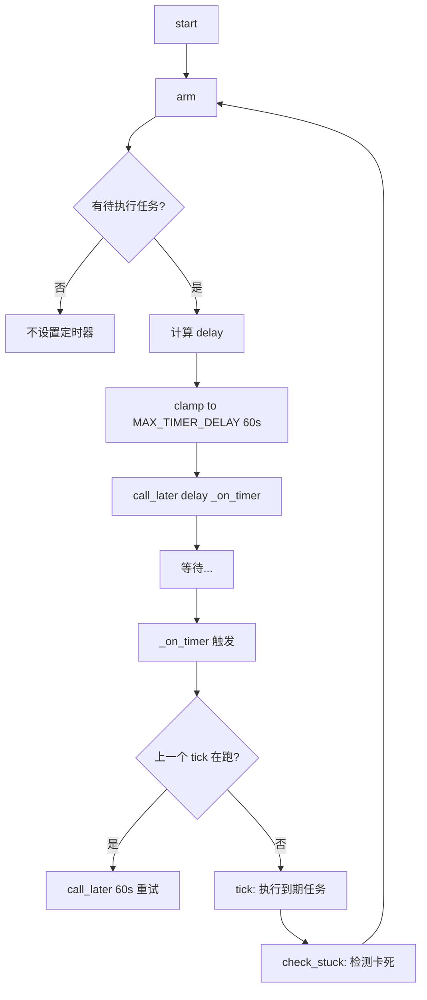
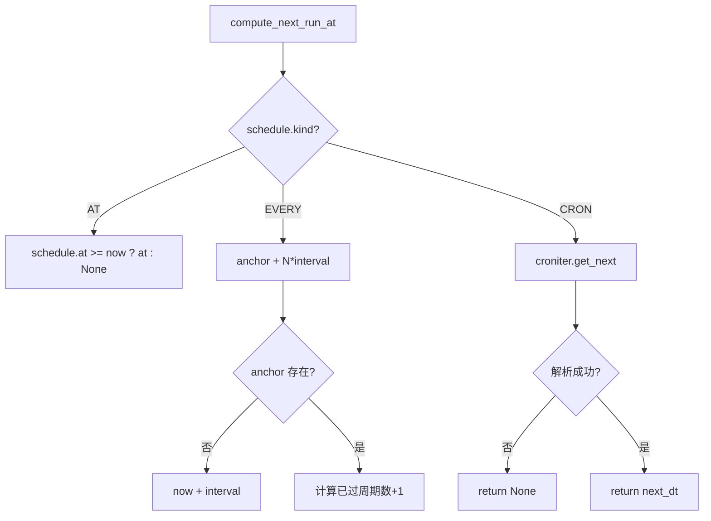
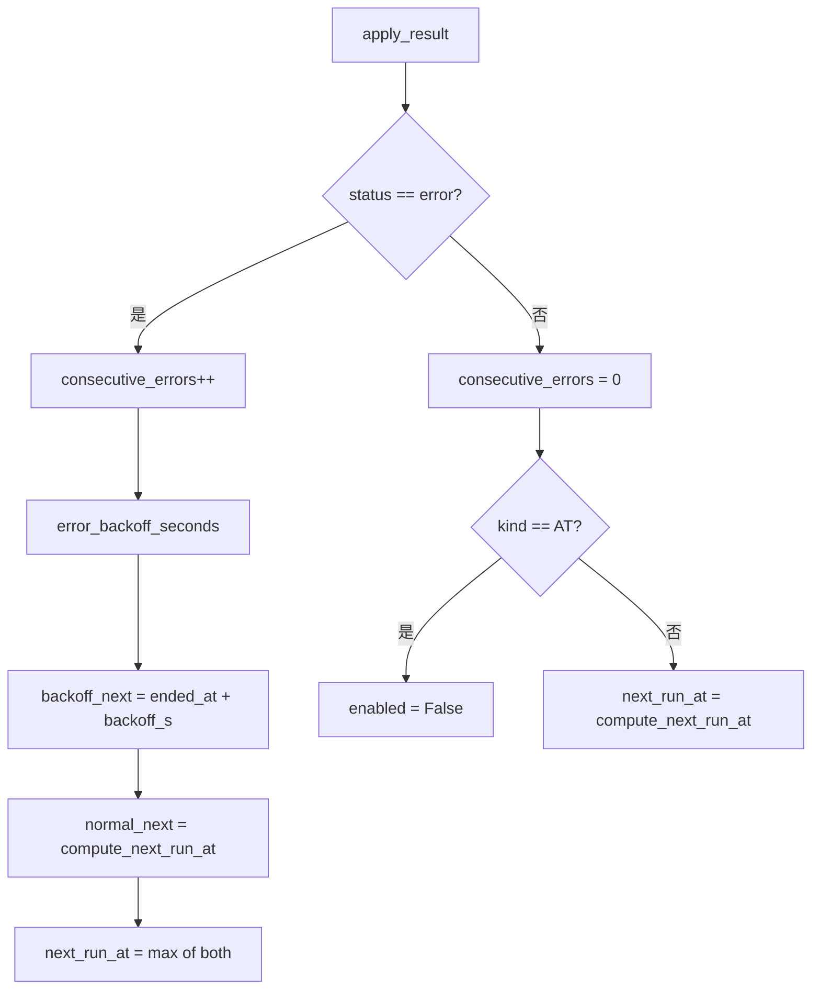

# PD-256.01 vibe-blog — asyncio.call_later 自驱动 CronScheduler 调度器

> 文档编号：PD-256.01
> 来源：vibe-blog `backend/services/task_queue/cron_scheduler.py`
> GitHub：https://github.com/datawhalechina/vibe-blog.git
> 问题域：PD-256 定时任务调度 Task Scheduling
> 状态：可复用方案

---

## 第 1 章 问题与动机

### 1.1 核心问题

定时任务调度是后端系统的基础设施需求。传统方案依赖外部组件（Celery Beat + Redis、APScheduler、系统 crontab），引入额外运维复杂度和进程间通信开销。对于中小型 Python 异步应用，需要一种零外部依赖、进程内自驱动的调度方案，同时具备：

- **多调度模式**：一次性定时（AT）、固定间隔（EVERY）、cron 表达式（CRON）
- **故障恢复**：进程重启后自动补执行错过的任务、清除残留运行状态
- **退避保护**：连续失败时指数退避，防止 retry storm 压垮下游
- **卡死检测**：长时间运行的任务自动标记为失败并释放

### 1.2 vibe-blog 的解法概述

vibe-blog 移植了 OpenClaw（TypeScript）的 CronService 设计，用纯 Python asyncio 重新实现：

1. **asyncio.call_later 自驱动循环**：CronTimer 通过 `call_later` 设置下一次唤醒，触发后执行到期任务再重新 arm，形成无外部依赖的自驱动循环（`cron_timer.py:59-84`）
2. **croniter 解析 cron 表达式**：替代 TypeScript 的 croner 库，支持标准 5 字段 cron 语法（`cron_scheduler.py:59-67`）
3. **SQLite 持久化全部状态**：任务配置 + 运行时状态（next_run_at、running_at、consecutive_errors）全部落盘，进程重启无损（`db.py:189-228`）
4. **5 级指数退避表**：30s → 1min → 5min → 15min → 60min，连续失败时逐级增大间隔（`backoff.py:8-14`）
5. **启动恢复三步曲**：清除残留 running_at → 补执行错过任务 → 重算所有 next_run_at（`cron_scheduler.py:311-411`）

### 1.3 设计思想

| 设计原则 | 具体实现 | 理由 | 替代方案 |
|----------|----------|------|----------|
| 零外部依赖 | asyncio.call_later + SQLite | 不引入 Redis/RabbitMQ，部署即用 | Celery Beat + Redis |
| 自驱动循环 | arm() → call_later → _on_timer() → tick() → arm() | 无需外部 cron 触发，进程内闭环 | APScheduler / 系统 crontab |
| 状态全持久化 | CronJobState 每次变更都 save_cron_job | 进程崩溃后可完整恢复 | 内存状态 + 定期快照 |
| 防 retry storm | ERROR_BACKOFF_SCHEDULE 5 级退避 | 下游故障时自动降频，避免雪崩 | 固定间隔重试 |
| 防时钟漂移 | MAX_TIMER_DELAY=60s 钳位 | call_later 最多 60s，到期后重新计算 | 信任系统时钟 |

---

## 第 2 章 源码实现分析

### 2.1 架构概览

```
┌─────────────────────────────────────────────────────────┐
│                    CronScheduler                         │
│  ┌──────────┐  ┌──────────┐  ┌──────────┐  ┌────────┐  │
│  │ CronTimer│  │CronExec- │  │ TaskDB   │  │backoff │  │
│  │          │  │  utor    │  │(aiosqlite│  │        │  │
│  │call_later│  │          │  │  CRUD)   │  │5-level │  │
│  │自驱动循环│  │execute() │  │          │  │schedule│  │
│  └────┬─────┘  └────┬─────┘  └────┬─────┘  └───┬────┘  │
│       │             │             │             │        │
│       ▼             ▼             ▼             ▼        │
│  arm()→call_later  execute()   save/get     backoff_s   │
│  →_on_timer()      →wait_for   cron_job()  (30s~60m)   │
│  →tick()→arm()     →apply_result                        │
└─────────────────────────────────────────────────────────┘
         │                              │
         ▼                              ▼
   TaskQueueManager              SQLite (cron_jobs)
   (博客生成入队)                 (持久化全部状态)
```

四个核心组件的职责分离：
- **CronTimer**（`cron_timer.py`）：纯定时器，只负责"什么时候唤醒"
- **CronScheduler**（`cron_scheduler.py`）：调度核心，CRUD + tick + 恢复
- **CronExecutor**（`cron_executor.py`）：执行器，负责"怎么跑"和"结果怎么处理"
- **backoff**（`backoff.py`）：退避策略，纯函数无状态

### 2.2 核心实现

#### 2.2.1 自驱动定时器循环



对应源码 `cron_timer.py:59-110`：
```python
class CronTimer:
    async def arm(self):
        """设置下一次唤醒 — 对应 OpenClaw armTimer()"""
        if self._timer_handle:
            self._timer_handle.cancel()
            self._timer_handle = None

        if not self._enabled or not self._loop:
            return

        next_at = await self._get_next_wake_at()
        if not next_at:
            return

        now = datetime.now()
        delay = max((next_at - now).total_seconds(), 0)
        clamped_delay = min(delay, MAX_TIMER_DELAY)

        self._timer_handle = self._loop.call_later(
            clamped_delay,
            lambda: asyncio.ensure_future(self._on_timer()),
        )

    async def _on_timer(self):
        """定时器触发 — 防重入 + 自动重新 arm"""
        if self._ticking:
            if self._loop:
                self._timer_handle = self._loop.call_later(
                    MAX_TIMER_DELAY,
                    lambda: asyncio.ensure_future(self._on_timer()),
                )
            return

        self._ticking = True
        try:
            await self._tick()
            await self._check_stuck()
        except Exception as e:
            logger.error(f"[CronTimer] tick 失败: {e}")
        finally:
            self._ticking = False
            await self.arm()
```

关键设计点：
- `MAX_TIMER_DELAY = 60.0`（`cron_timer.py:19`）：call_later 最多 60 秒，防止系统休眠/时钟跳变导致错过任务
- `_ticking` 防重入标志（`cron_timer.py:93-100`）：上一个 tick 未完成时不叠加执行，而是重新排队 60s 后重试（修复 OpenClaw #12025）
- `finally: await self.arm()`（`cron_timer.py:110`）：无论成功失败，tick 结束后必定重新 arm，保证循环不断裂

#### 2.2.2 三模式调度计算



对应源码 `cron_scheduler.py:32-69`：
```python
def compute_next_run_at(
    schedule: CronSchedule, now: datetime
) -> Optional[datetime]:
    kind = schedule.kind

    if kind == CronScheduleKind.AT:
        if schedule.at is None:
            return None
        return schedule.at if schedule.at >= now else None

    elif kind == CronScheduleKind.EVERY:
        if not schedule.every_seconds:
            return None
        interval = schedule.every_seconds
        anchor = schedule.anchor_at
        if anchor is None:
            return now + timedelta(seconds=interval)
        if now < anchor:
            return anchor
        elapsed = (now - anchor).total_seconds()
        periods = int(elapsed / interval) + 1
        return anchor + timedelta(seconds=periods * interval)

    elif kind == CronScheduleKind.CRON:
        if not schedule.expr:
            return None
        try:
            cron = croniter(schedule.expr, now)
            next_dt = cron.get_next(datetime)
            return next_dt
        except (ValueError, KeyError):
            return None
```

EVERY 模式的锚点对齐算法（`cron_scheduler.py:50-57`）确保即使进程重启，间隔任务也能对齐到原始锚点时间，不会因重启产生漂移。

#### 2.2.3 指数退避与结果应用



对应源码 `cron_executor.py:72-133` 和 `backoff.py:8-22`：
```python
ERROR_BACKOFF_SCHEDULE = [
    30,        # 1st error  →  30 秒
    60,        # 2nd error  →   1 分钟
    5 * 60,    # 3rd error  →   5 分钟
    15 * 60,   # 4th error  →  15 分钟
    60 * 60,   # 5th+ error →  60 分钟
]

def error_backoff_seconds(consecutive_errors: int) -> int:
    if consecutive_errors <= 0:
        return 0
    idx = min(consecutive_errors - 1, len(ERROR_BACKOFF_SCHEDULE) - 1)
    return ERROR_BACKOFF_SCHEDULE[idx]
```

退避与正常调度取 max（`cron_executor.py:119-121`）：`next_run_at = max(normal_next or backoff_next, backoff_next)`，确保退避间隔不会被正常调度覆盖。

### 2.3 实现细节

**启动恢复三步曲**（`cron_scheduler.py:311-411`）：

1. **清除残留 running_at**（L316-325）：进程崩溃时可能有任务处于 running 状态，启动时全部清除
2. **补执行错过的任务**（L329-344）：`next_run_at < now` 且未在运行的任务立即执行
3. **重算所有 next_run_at**（L374-411）：重新计算所有 enabled 任务的下次执行时间，含调度计算失败保护（连续失败 `MAX_SCHEDULE_ERRORS=3` 次自动禁用）

**卡死检测**（`cron_scheduler.py:348-370`）：
- 阈值 `STUCK_RUN_SECONDS = 7200`（2 小时，`cron_timer.py:20`）
- 每次 tick 后检查，超时任务清除 running_at 并标记为 ERROR
- 递增 consecutive_errors 触发退避

**asyncio.Lock 保护**（`cron_scheduler.py:88`）：
- 所有状态变更操作（add/update/remove/pause/resume/retry/execute）都在 `self._lock` 下执行
- 防止并发 tick 和 CRUD 操作导致状态不一致

**Pydantic v2 模型层**（`models.py:132-190`）：
- `CronScheduleKind` 三值枚举：AT/EVERY/CRON
- `CronJobState` 分离运行时状态与配置，便于独立更新
- `CronJob` 聚合配置 + 状态 + 元数据，是 SQLite 行的 ORM 映射

---

## 第 3 章 迁移指南

### 3.1 迁移清单

**阶段 1：核心调度器（最小可用）**

- [ ] 复制 `backoff.py`（23 行，零依赖纯函数）
- [ ] 复制 `cron_timer.py`（111 行），修改回调签名适配你的业务
- [ ] 实现 `compute_next_run_at()` 函数，按需裁剪调度模式（如只保留 CRON）
- [ ] 实现调度器主类，包含 `start()` / `stop()` / `_tick()` / `_execute_job()`
- [ ] 安装依赖：`pip install croniter aiosqlite pydantic>=2.0`

**阶段 2：持久化层**

- [ ] 创建 SQLite schema（参考 `schema.sql:67-104` 的 cron_jobs 表）
- [ ] 实现 `save_cron_job()` / `get_cron_job()` / `get_cron_jobs()` / `delete_cron_job()`
- [ ] 实现 `_row_to_cron_job()` 反序列化（注意 datetime 和 JSON 字段）

**阶段 3：容错增强**

- [ ] 实现 `_startup_recovery()`：清除残留 running_at + 补执行错过任务
- [ ] 实现 `_check_stuck_jobs()`：卡死检测（阈值可配置）
- [ ] 实现 `_recompute_next_runs()`：调度计算失败保护（连续 N 次失败自动禁用）

### 3.2 适配代码模板

以下是一个可直接运行的最小调度器骨架，剥离了 vibe-blog 的博客生成业务逻辑：

```python
"""最小可用 CronScheduler — 从 vibe-blog 迁移"""
import asyncio
import logging
from datetime import datetime, timedelta
from typing import Optional, Callable, Awaitable

from croniter import croniter

logger = logging.getLogger(__name__)

# ── 退避表（可自定义）──
BACKOFF_SCHEDULE = [30, 60, 300, 900, 3600]

def backoff_seconds(errors: int) -> int:
    if errors <= 0:
        return 0
    return BACKOFF_SCHEDULE[min(errors - 1, len(BACKOFF_SCHEDULE) - 1)]

# ── 自驱动定时器 ──
MAX_TIMER_DELAY = 60.0

class SelfDrivingTimer:
    def __init__(
        self,
        get_next_wake: Callable[[], Awaitable[Optional[datetime]]],
        on_tick: Callable[[], Awaitable[None]],
    ):
        self._get_next_wake = get_next_wake
        self._on_tick = on_tick
        self._handle: Optional[asyncio.TimerHandle] = None
        self._ticking = False
        self._loop: Optional[asyncio.AbstractEventLoop] = None

    def start(self):
        self._loop = asyncio.get_running_loop()
        self._loop.call_soon(lambda: asyncio.ensure_future(self.arm()))

    def stop(self):
        if self._handle:
            self._handle.cancel()

    async def arm(self):
        if self._handle:
            self._handle.cancel()
            self._handle = None
        if not self._loop:
            return
        next_at = await self._get_next_wake()
        if not next_at:
            return
        delay = min(max((next_at - datetime.now()).total_seconds(), 0), MAX_TIMER_DELAY)
        self._handle = self._loop.call_later(
            delay, lambda: asyncio.ensure_future(self._fire())
        )

    async def _fire(self):
        if self._ticking:
            if self._loop:
                self._handle = self._loop.call_later(
                    MAX_TIMER_DELAY, lambda: asyncio.ensure_future(self._fire())
                )
            return
        self._ticking = True
        try:
            await self._on_tick()
        finally:
            self._ticking = False
            await self.arm()

# ── 使用示例 ──
class MyScheduler:
    def __init__(self):
        self._jobs: dict[str, dict] = {}  # 替换为你的持久化层
        self._timer = SelfDrivingTimer(
            get_next_wake=self._next_wake,
            on_tick=self._tick,
        )

    async def start(self):
        self._timer.start()

    async def _next_wake(self) -> Optional[datetime]:
        candidates = [
            j['next_run_at'] for j in self._jobs.values()
            if j.get('next_run_at') and j.get('enabled')
        ]
        return min(candidates) if candidates else None

    async def _tick(self):
        now = datetime.now()
        for job_id, job in list(self._jobs.items()):
            if job.get('next_run_at') and job['next_run_at'] <= now:
                await self._execute(job_id, job)

    async def _execute(self, job_id: str, job: dict):
        try:
            await your_task_function(job)  # 替换为你的业务逻辑
            job['consecutive_errors'] = 0
            job['next_run_at'] = croniter(
                job['cron_expr'], datetime.now()
            ).get_next(datetime)
        except Exception:
            job['consecutive_errors'] = job.get('consecutive_errors', 0) + 1
            bs = backoff_seconds(job['consecutive_errors'])
            job['next_run_at'] = datetime.now() + timedelta(seconds=bs)
```

### 3.3 适用场景

| 场景 | 适用度 | 说明 |
|------|--------|------|
| 单进程 Python 异步应用 | ⭐⭐⭐ | 完美匹配，零外部依赖 |
| 中小规模定时任务（<100 个） | ⭐⭐⭐ | SQLite 足够，无需分布式 |
| 需要进程重启恢复的场景 | ⭐⭐⭐ | 启动恢复三步曲保证无损 |
| 多进程/分布式调度 | ⭐ | 不适用，SQLite 不支持多写 |
| 高频调度（秒级） | ⭐⭐ | 60s 钳位限制了最小粒度 |
| 需要精确到毫秒的调度 | ⭐ | asyncio.call_later 精度有限 |

---

## 第 4 章 测试用例

```python
"""PD-256 vibe-blog CronScheduler 测试用例"""
import asyncio
import pytest
from datetime import datetime, timedelta
from unittest.mock import AsyncMock, MagicMock

# ── 退避函数测试 ──

from backoff import error_backoff_seconds, ERROR_BACKOFF_SCHEDULE

class TestErrorBackoff:
    def test_zero_errors_returns_zero(self):
        assert error_backoff_seconds(0) == 0

    def test_negative_errors_returns_zero(self):
        assert error_backoff_seconds(-1) == 0

    def test_first_error_30s(self):
        assert error_backoff_seconds(1) == 30

    def test_second_error_60s(self):
        assert error_backoff_seconds(2) == 60

    def test_fifth_error_3600s(self):
        assert error_backoff_seconds(5) == 3600

    def test_overflow_clamps_to_last(self):
        """第 100 次错误仍然返回 3600s，不越界"""
        assert error_backoff_seconds(100) == 3600

    def test_schedule_is_monotonic(self):
        """退避表单调递增"""
        for i in range(len(ERROR_BACKOFF_SCHEDULE) - 1):
            assert ERROR_BACKOFF_SCHEDULE[i] < ERROR_BACKOFF_SCHEDULE[i + 1]


# ── 调度计算测试 ──

from cron_scheduler import compute_next_run_at
from models import CronSchedule, CronScheduleKind

class TestComputeNextRunAt:
    def test_at_future(self):
        future = datetime.now() + timedelta(hours=1)
        schedule = CronSchedule(kind=CronScheduleKind.AT, at=future)
        assert compute_next_run_at(schedule, datetime.now()) == future

    def test_at_past_returns_none(self):
        past = datetime.now() - timedelta(hours=1)
        schedule = CronSchedule(kind=CronScheduleKind.AT, at=past)
        assert compute_next_run_at(schedule, datetime.now()) is None

    def test_every_no_anchor(self):
        now = datetime.now()
        schedule = CronSchedule(
            kind=CronScheduleKind.EVERY, every_seconds=300
        )
        result = compute_next_run_at(schedule, now)
        assert abs((result - now).total_seconds() - 300) < 1

    def test_every_with_anchor_alignment(self):
        """锚点对齐：即使 now 在锚点之后，也对齐到整数倍"""
        anchor = datetime(2025, 1, 1, 0, 0, 0)
        now = datetime(2025, 1, 1, 0, 7, 30)  # 锚点后 450s
        schedule = CronSchedule(
            kind=CronScheduleKind.EVERY,
            every_seconds=300,
            anchor_at=anchor,
        )
        result = compute_next_run_at(schedule, now)
        # 450s / 300s = 1.5 → periods = 2 → anchor + 600s
        expected = anchor + timedelta(seconds=600)
        assert result == expected

    def test_cron_expression(self):
        schedule = CronSchedule(
            kind=CronScheduleKind.CRON, expr="0 9 * * *"
        )
        now = datetime(2025, 6, 15, 8, 0, 0)
        result = compute_next_run_at(schedule, now)
        assert result == datetime(2025, 6, 15, 9, 0, 0)

    def test_invalid_cron_returns_none(self):
        schedule = CronSchedule(
            kind=CronScheduleKind.CRON, expr="invalid"
        )
        assert compute_next_run_at(schedule, datetime.now()) is None


# ── CronTimer 防重入测试 ──

class TestCronTimerReentrancy:
    @pytest.mark.asyncio
    async def test_ticking_flag_prevents_overlap(self):
        """tick 执行中再次触发 _on_timer 不会叠加"""
        tick_count = 0
        tick_event = asyncio.Event()

        async def slow_tick():
            nonlocal tick_count
            tick_count += 1
            await asyncio.sleep(0.5)
            tick_event.set()

        async def get_next():
            return datetime.now()

        from cron_timer import CronTimer
        timer = CronTimer(
            get_next_wake_at=get_next,
            tick=slow_tick,
            check_stuck=AsyncMock(),
        )
        timer._loop = asyncio.get_running_loop()
        timer._enabled = True

        # 手动触发两次
        asyncio.ensure_future(timer._on_timer())
        await asyncio.sleep(0.1)
        asyncio.ensure_future(timer._on_timer())  # 应被防重入拦截

        await tick_event.wait()
        assert tick_count == 1  # 只执行了一次


# ── apply_result 退避逻辑测试 ──

class TestApplyResult:
    def test_error_triggers_backoff(self):
        from cron_executor import CronExecutor
        from models import (
            CronJob, CronSchedule, CronScheduleKind,
            CronJobState, BlogGenerationConfig,
        )
        executor = CronExecutor(queue_manager=MagicMock())
        job = CronJob(
            id="test",
            name="test",
            schedule=CronSchedule(
                kind=CronScheduleKind.EVERY, every_seconds=60
            ),
            generation=BlogGenerationConfig(topic="test"),
        )
        now = datetime.now()
        result = {
            'status': 'error',
            'error': 'timeout',
            'started_at': now,
            'ended_at': now,
        }
        executor.apply_result(job, result, compute_next_run_at)
        assert job.state.consecutive_errors == 1
        # 退避 30s，next_run_at 应在 now + 30s 附近
        assert job.state.next_run_at >= now + timedelta(seconds=29)

    def test_success_resets_errors(self):
        from cron_executor import CronExecutor
        from models import (
            CronJob, CronSchedule, CronScheduleKind,
            CronJobState, BlogGenerationConfig,
        )
        executor = CronExecutor(queue_manager=MagicMock())
        job = CronJob(
            id="test",
            name="test",
            schedule=CronSchedule(
                kind=CronScheduleKind.EVERY, every_seconds=60
            ),
            generation=BlogGenerationConfig(topic="test"),
        )
        job.state.consecutive_errors = 5
        now = datetime.now()
        result = {
            'status': 'ok',
            'started_at': now,
            'ended_at': now,
            'summary': 'https://example.com',
        }
        executor.apply_result(job, result, compute_next_run_at)
        assert job.state.consecutive_errors == 0
```

---

## 第 5 章 跨域关联

| 关联域 | 关系类型 | 说明 |
|--------|----------|------|
| PD-03 容错与重试 | 协同 | 指数退避表（backoff.py）是 PD-03 容错策略在调度层的具体应用；卡死检测是超时保护的调度层实现 |
| PD-06 记忆持久化 | 依赖 | CronJobState 通过 SQLite 持久化，依赖 PD-06 的存储模式；启动恢复依赖持久化状态完整性 |
| PD-11 可观测性 | 协同 | CronScheduler 的 logger.info/warning/error 日志链为可观测性提供调度层事件流；last_duration_ms 提供执行耗时指标 |
| PD-02 多 Agent 编排 | 协同 | CronScheduler 通过 TaskQueueManager.enqueue() 将定时任务注入编排队列，是编排系统的时间触发入口 |
| PD-10 中间件管道 | 互补 | CronExecutor 的 execute → apply_result 是一个微型管道；可扩展为 pre_execute / post_execute 钩子 |

---

## 第 6 章 来源文件索引

| 文件 | 行范围 | 关键实现 |
|------|--------|----------|
| `backend/services/task_queue/cron_scheduler.py` | L1-448 | CronScheduler 主类：CRUD + tick + 启动恢复 + 卡死检测 |
| `backend/services/task_queue/cron_timer.py` | L1-111 | CronTimer 自驱动定时器：arm/call_later/防重入 |
| `backend/services/task_queue/cron_executor.py` | L1-134 | CronExecutor 执行器：execute + apply_result + 退避计算 |
| `backend/services/task_queue/backoff.py` | L1-23 | 5 级指数退避表 + backoff_seconds 纯函数 |
| `backend/services/task_queue/models.py` | L132-190 | CronJob/CronSchedule/CronJobState Pydantic v2 模型 |
| `backend/services/task_queue/db.py` | L189-297 | TaskDB.save_cron_job/get_cron_job 等 aiosqlite CRUD |
| `backend/services/task_queue/schema.sql` | L67-114 | cron_jobs 表 DDL + 索引定义 |
| `backend/services/task_queue/__init__.py` | L1-24 | 模块导出：零外部依赖声明 |

---

## 第 7 章 横向对比维度

```json comparison_data
{
  "project": "vibe-blog",
  "dimensions": {
    "调度引擎": "asyncio.call_later 自驱动循环，60s 钳位防漂移",
    "调度模式": "AT/EVERY/CRON 三模式，EVERY 支持锚点对齐",
    "退避策略": "5 级固定退避表 30s~60min，取 max(正常, 退避)",
    "持久化方式": "aiosqlite 单表 cron_jobs，状态每次变更即落盘",
    "故障恢复": "启动三步曲：清残留→补错过→重算 next_run_at",
    "卡死检测": "running_at 超 2h 自动清除并标记 ERROR",
    "防重入机制": "_ticking 标志位 + 60s 重排队",
    "调度计算容错": "连续 3 次计算失败自动禁用任务"
  }
}
```

### 域元数据补充

```json domain_metadata
{
  "solution_summary": "vibe-blog 用 asyncio.call_later 自驱动循环 + croniter + aiosqlite 实现零外部依赖 CronScheduler，支持 AT/EVERY/CRON 三模式、5 级退避、启动恢复三步曲",
  "description": "进程内自驱动调度的零依赖实现范式",
  "sub_problems": [
    "调度计算连续失败的自动禁用保护",
    "EVERY 模式锚点对齐防漂移",
    "定时器防重入与重排队机制"
  ],
  "best_practices": [
    "MAX_TIMER_DELAY 钳位防止系统休眠导致错过任务",
    "退避与正常调度取 max 确保退避不被覆盖",
    "启动恢复三步曲：清残留→补错过→重算 next_run_at"
  ]
}
```
