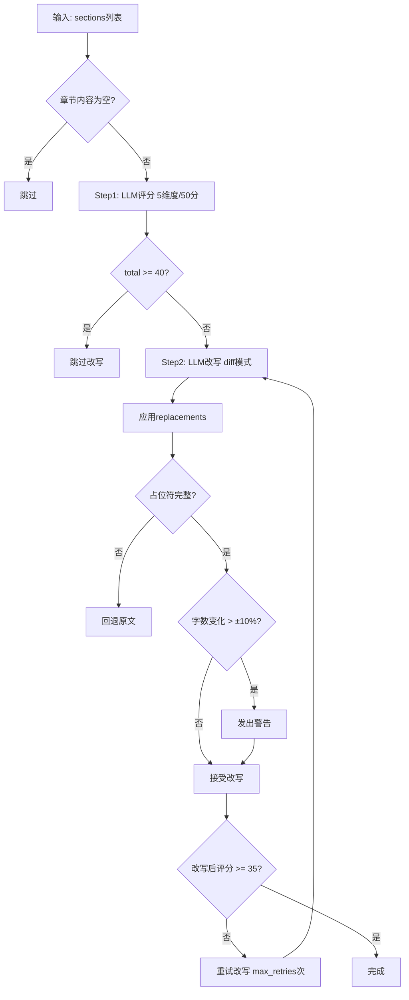

# PD-257.01 vibe-blog — 两阶段去AI味管道：TextCleanup确定性清理 + HumanizerAgent LLM改写

> 文档编号：PD-257.01
> 来源：vibe-blog `backend/utils/text_cleanup.py` `backend/services/blog_generator/agents/humanizer.py`
> GitHub：https://github.com/datawhalechina/vibe-blog.git
> 问题域：PD-257 内容去AI化 Content De-AI-ification
> 状态：可复用方案

---

## 第 1 章 问题与动机

### 1.1 核心问题

LLM 生成的中文技术博客存在明显的"AI味"——填充词堆砌（"此外"、"值得注意的是"）、同义词三连（"重要的、关键的、至关重要的"）、过度自信表述（"毫无疑问"、"完美解决"）、Meta 评论（"本节将详细介绍"）、时间幻觉（"截至2023年"）等。这些痕迹让读者一眼识别出 AI 生成内容，严重降低内容可信度和阅读体验。

问题的复杂性在于：AI 痕迹分为两类——**确定性可修复的**（填充词、冗余短语、时间错误等，用正则即可处理）和**需要语义理解的**（公式化结构、宣传语言、模糊归因等，需要 LLM 改写）。单纯用正则无法处理语义层面的问题，单纯用 LLM 则成本高且可能引入新问题（改写过度、丢失引用占位符、字数膨胀）。

### 1.2 vibe-blog 的解法概述

vibe-blog 实现了一个两阶段串行管道，嵌入 LangGraph 工作流的后处理阶段：

1. **TextCleanup（确定性阶段）**：10 步纯正则管道，零 LLM 调用，处理所有可确定性修复的 AI 痕迹（`backend/utils/text_cleanup.py:236-257`）
2. **HumanizerAgent（LLM 阶段）**：先评分后改写的两步流程，仅对评分低于阈值的章节调用 LLM 改写，采用 diff 替换模式而非全文重写（`backend/services/blog_generator/agents/humanizer.py:70-349`）
3. **双开关控制**：环境变量 AND StyleProfile 双重开关，不同文章长度预设不同的启用策略（`backend/services/blog_generator/generator.py:1006-1008`）
4. **异常降级**：两个阶段都有独立的异常捕获，失败时降级返回原始内容，不阻断工作流（`generator.py:1057-1061`）
5. **工作流位置**：factcheck → text_cleanup → humanizer → wait_for_images → assembler，确保在事实核查之后、最终组装之前执行（`generator.py:319-322`）

### 1.3 设计思想

| 设计原则 | 具体实现 | 理由 | 替代方案 |
|----------|----------|------|----------|
| 确定性优先 | TextCleanup 10步正则管道在 LLM 改写之前执行 | 正则零成本、零延迟、100%可预测，先清理掉确定性问题减少 LLM 负担 | 全部交给 LLM 处理（成本高、不可控） |
| 评分门控 | HumanizerAgent 先评分（5维度50分制），≥40分跳过改写 | 避免对已经自然的内容做不必要的 LLM 调用，节省成本和时间 | 无条件改写所有章节（浪费） |
| Diff 替换 | LLM 输出 `{old, new}` 替换列表而非全文 | 精确控制修改范围，避免全文重写导致的内容丢失和字数膨胀 | 全文重写（风险高、不可控） |
| 占位符保护 | 改写前后校验 `{source_NNN}` 占位符完整性 | 博客中的引用占位符在后续 assembler 阶段替换为真实引用，丢失则引用断裂 | 不校验（引用丢失） |
| 字数守恒 | 改写后字数变化超过 ±10% 发出警告 | 去AI味应该是"润色"而非"重写"，字数大幅变化说明改写过度 | 不限制（可能膨胀50%+） |

---

## 第 2 章 源码实现分析

### 2.1 架构概览

vibe-blog 的去AI化处理位于 LangGraph 工作流的后处理阶段，由两个独立节点串行执行：

```
┌──────────┐     ┌──────────────┐     ┌──────────────┐     ┌────────────┐     ┌──────────┐
│ factcheck│────→│ text_cleanup  │────→│  humanizer   │────→│wait_images │────→│assembler │
│ 事实核查  │     │ 10步正则管道  │     │ 评分+diff改写 │     │ 等待配图    │     │ 最终组装  │
└──────────┘     └──────────────┘     └──────────────┘     └────────────┘     └──────────┘
                  ↑ 零LLM调用          ↑ 按需LLM调用
                  ↑ 双开关控制          ↑ 双开关控制
```

两个节点共享同一套双开关机制（环境变量 + StyleProfile），但各自独立降级：

```
双开关判定逻辑：
  环境变量 TEXT_CLEANUP_ENABLED=true  AND  StyleProfile.enable_text_cleanup=true  → 执行
  任一为 false → 跳过
```

### 2.2 核心实现

#### 2.2.1 TextCleanup 确定性管道

```mermaid
graph TD
    A[输入文本] --> B[Step1: 删除填充词开头]
    B --> C[Step2: 删除空洞强化词]
    C --> D[Step3: 折叠同义词堆砌]
    D --> E[Step4: 删除Meta评论]
    E --> F[Step5: 压缩冗余短语]
    F --> G[Step6: 中和过度自信]
    G --> H[Step7: 词汇多样化]
    H --> I[Step8: 时间幻觉修复]
    I --> J[Step9: Markdown格式清理]
    J --> K[Step10: 多余空白清理]
    K --> L[输出: cleaned_text + stats]
```



对应源码 `backend/utils/text_cleanup.py:236-257`：

```python
def apply_full_cleanup(text: str) -> Dict[str, Any]:
    """
    10 步确定性清理管道。
    Returns:
        {"text": cleaned_text, "stats": {"fillers": N, ...}, "total_fixes": N}
    """
    stats = {}
    text, stats["fillers"] = _step_fillers(text)
    text, stats["intensifiers"] = _step_intensifiers(text)
    text, stats["synonyms"] = _step_synonyms(text)
    text, stats["meta"] = _step_meta(text)
    text, stats["verbose"] = _step_verbose(text)
    text, stats["claims"] = _step_claims(text)
    text, stats["vocab_diversified"] = _step_vocab_diversity(text)
    text, stats["time_hallucinations"] = _step_time_hallucinations(text)
    text, stats["markdown_fixes"] = _step_markdown(text)
    text, stats["whitespace"] = _step_whitespace(text)
    total = sum(stats.values())
    return {"text": text, "stats": stats, "total_fixes": total}
```

每一步都是独立的纯函数，返回 `(text, count)` 元组。关键的正则规则包括：

- **填充词**（`text_cleanup.py:33-44`）：11 个中文填充词模式，如 `r"此外[，,]\s*"`、`r"值得注意的是[，,]\s*"`
- **同义词堆砌**（`text_cleanup.py:60-66`）：5 组三连同义词折叠，如 `"重要的、关键的、至关重要的" → "关键的"`
- **过度自信**（`text_cleanup.py:92-101`）：8 条校准规则，如 `"毫无疑问地证明了" → "有力地支持了"`、`"革命性的" → "创新性的"`
- **词汇多样化**（`text_cleanup.py:106-114`）：7 组高频词轮换表，同一词出现 >3 次时从第 4 次开始轮换同义词
- **时间幻觉**（`text_cleanup.py:119-128`）：动态生成当前年份的正则，修复 `截至{去年}年` → `截至{今年}年`

#### 2.2.2 HumanizerAgent 评分+改写流程



对应源码 `backend/services/blog_generator/agents/humanizer.py:153-282`：

```python
def _process_section(self, idx: int, section: dict, audience: str, total_sections: int) -> dict:
    title = section.get('title', f'章节{idx+1}')
    content = section.get('content', '')
    stripped = content.strip()
    if not stripped or stripped.startswith('#') and '\n' not in stripped:
        return {"idx": idx, "section": section, "status": "skipped", ...}

    original_placeholders = _extract_source_placeholders(content)

    # Step 1: 评分
    score_result = self._score_section(content)
    total_score = score_result.get('score', {}).get('total', 0)

    if total_score >= self.skip_threshold:  # 默认 40
        section['humanizer_skipped'] = True
        return {"idx": idx, "section": section, "status": "skipped", ...}

    # Step 2: 改写（diff 模式）
    rewrite_result = self._rewrite_section(content, audience)
    replacements = rewrite_result.get('replacements', [])
    humanized, applied = self._apply_replacements(content, replacements)

    # 占位符完整性校验
    new_placeholders = _extract_source_placeholders(humanized)
    if original_placeholders and not original_placeholders.issubset(new_placeholders):
        lost = original_placeholders - new_placeholders
        section['humanizer_error'] = f"占位符丢失: {lost}"
        return {"idx": idx, "section": section, "status": "skipped", ...}

    # 字数守恒校验
    change_ratio = abs(len(humanized) - len(content)) / max(len(content), 1)
    if change_ratio > 0.1:
        logger.warning(f"字数变化 {change_ratio:.0%} 超过 ±10%")

    section['content'] = humanized
    return {"idx": idx, "section": section, "status": "rewritten", ...}
```

### 2.3 实现细节

**评分维度设计**（`infrastructure/prompts/blog/humanizer_score.j2:16-22`）：

5 个维度各 1-10 分，总分 50 分：
- **直接性**：直接陈述事实还是绕圈宣告
- **节奏**：句子长度是否变化（长短交错 vs 机械重复）
- **信任度**：是否尊重读者智慧（简洁明了 vs 过度解释）
- **真实性**：听起来像真人说话吗
- **精炼度**：还有可删减的内容吗

**Diff 替换模式**（`infrastructure/prompts/blog/humanizer.j2:44-59`）：

LLM 输出 `{"replacements": [{"old": "精确子串", "new": "替换文本"}]}` 格式，而非全文重写。`old` 必须是原文中的精确子串，用于程序化 `str.replace(old, new, 1)` 替换。这种设计的关键约束：
- 不触碰 `{source_NNN}` 引用占位符
- 不触碰 `[IMAGE: xxx]` 和 `[CODE: xxx]` 配图/代码标记
- 不修改数字、日期、URL、代码片段
- 不修改 Markdown 标题层级

**并行处理**（`humanizer.py:311-326`）：

```python
with ThreadPoolExecutor(max_workers=min(MAX_WORKERS, total_sections)) as executor:
    futures = {
        executor.submit(self._process_section, idx, section, audience, total_sections): idx
        for idx, section in enumerate(sections)
    }
    results = {}
    for future in as_completed(futures):
        idx = futures[future]
        results[idx] = future.result()
```

各章节的评分和改写互不依赖，使用 `ThreadPoolExecutor` 并行处理，`MAX_WORKERS` 默认 4（通过 `HUMANIZER_MAX_WORKERS` 环境变量配置）。

**JSON 解析容错**（`humanizer.py:28-67`）：

`_extract_json` 函数实现了 4 层解析策略：
1. 直接 `json.loads`
2. `strict=False` 模式
3. 修复非法转义字符后重试
4. 正则提取最外层 `{...}` 块

这是因为不同 LLM 提供商（如 qwen3.5-plus）对 `response_format={"type": "json_object"}` 的支持程度不同，需要多层容错。

**双开关机制**（`generator.py:1006-1008`）：

```python
def _is_enabled(self, env_flag: bool, style_flag: bool) -> bool:
    """环境变量 AND StyleProfile 双重开关"""
    return env_flag and style_flag
```

环境变量作为全局开关（运维层面），StyleProfile 作为运行时开关（业务层面）。例如 mini 模式禁用 humanizer 但保留 text_cleanup（`style_profile.py:94-107`），因为正则清理零成本。

---

## 第 3 章 迁移指南

### 3.1 迁移清单

**阶段 1：确定性清理管道（零依赖，可独立使用）**

- [ ] 复制 `text_cleanup.py` 到项目 utils 目录
- [ ] 根据目标语言调整正则规则（当前为中文优化）
- [ ] 根据领域调整词汇多样化表（`VOCAB_DIVERSITY_ZH`）
- [ ] 在内容生成管道的最后阶段调用 `apply_full_cleanup(text)`
- [ ] 检查 `stats` 输出，确认规则命中率

**阶段 2：LLM 评分+改写（需要 LLM 客户端）**

- [ ] 复制 `humanizer.py` 和两个 Jinja2 模板（`humanizer.j2`、`humanizer_score.j2`）
- [ ] 适配 LLM 客户端接口（需支持 `chat(messages, response_format)` 签名）
- [ ] 配置评分阈值（`HUMANIZER_SKIP_THRESHOLD`，建议 35-45）
- [ ] 配置并行度（`HUMANIZER_MAX_WORKERS`，建议 2-4）
- [ ] 如有引用占位符系统，确保 `_extract_source_placeholders` 的正则匹配你的占位符格式

**阶段 3：集成到工作流**

- [ ] 在工作流中添加 text_cleanup 和 humanizer 两个节点
- [ ] 确保执行顺序：事实核查 → text_cleanup → humanizer → 最终组装
- [ ] 实现双开关机制（环境变量 + 配置对象）
- [ ] 添加异常降级逻辑（try/except 返回原始内容）

### 3.2 适配代码模板

**最小可用版本（仅确定性清理）：**

```python
"""text_cleanup_lite.py — 可直接复用的确定性去AI味管道"""
import re
import datetime
from typing import Dict, Any, List, Tuple

CURRENT_YEAR = datetime.datetime.now().year

# 规则注册表：(名称, 规则列表, 处理方式)
# 处理方式: "delete" = 删除匹配, "replace" = 替换为指定文本
CLEANUP_RULES: List[Tuple[str, list, str]] = [
    ("fillers", [
        (r"此外[，,]\s*", ""),
        (r"值得注意的是[，,]\s*", ""),
        (r"众所周知[，,]\s*", ""),
        (r"综上所述[，,]\s*", ""),
    ], "replace"),
    ("intensifiers", [
        (r"非常地?", ""),
        (r"极其", ""),
        (r"十分地?", ""),
    ], "replace"),
    ("overclaims", [
        (r"毫无疑问地?(?:证明|表明)了?", "有力地支持了"),
        (r"(?:完美|完全)(?:地)?解决了", "有效地解决了"),
        (r"革命性的", "创新性的"),
    ], "replace"),
    ("time_fix", [
        (rf"截至\s*{CURRENT_YEAR - 1}\s*年", f"截至{CURRENT_YEAR}年"),
        (rf"截至\s*{CURRENT_YEAR - 2}\s*年", f"截至{CURRENT_YEAR}年"),
    ], "replace"),
]

def apply_cleanup(text: str) -> Dict[str, Any]:
    stats = {}
    for name, rules, _ in CLEANUP_RULES:
        count = 0
        for pattern, replacement in rules:
            matches = re.findall(pattern, text)
            count += len(matches)
            text = re.sub(pattern, replacement, text)
        stats[name] = count
    return {"text": text, "stats": stats, "total_fixes": sum(stats.values())}
```

**评分+改写集成模板：**

```python
"""humanizer_lite.py — 评分门控 + diff 改写"""
import json
from typing import Dict, Any

SCORE_PROMPT = """基于 AI 写作痕迹检测规则，对这段文本评分。
评分维度（各1-10分，总分50）：直接性、节奏、信任度、真实性、精炼度。
输出 JSON: {"score": {"total": N}, "issues_summary": "..."}

文本：
{content}"""

REWRITE_PROMPT = """找出以下文本中的 AI 写作痕迹，输出替换列表。
约束：old 必须是原文精确子串，不触碰引用占位符和代码块。
输出 JSON: {"replacements": [{"old": "...", "new": "..."}]}

文本：
{content}"""

class HumanizerLite:
    def __init__(self, llm_client, skip_threshold: int = 40):
        self.llm = llm_client
        self.skip_threshold = skip_threshold

    def process(self, text: str) -> Dict[str, Any]:
        # Step 1: 评分
        score_resp = self.llm.chat(SCORE_PROMPT.format(content=text))
        score = json.loads(score_resp).get("score", {}).get("total", 0)
        if score >= self.skip_threshold:
            return {"text": text, "changed": False, "score": score}

        # Step 2: diff 改写
        rewrite_resp = self.llm.chat(REWRITE_PROMPT.format(content=text))
        replacements = json.loads(rewrite_resp).get("replacements", [])
        for r in replacements:
            old, new = r.get("old", ""), r.get("new", "")
            if old and old in text:
                text = text.replace(old, new, 1)

        return {"text": text, "changed": True, "score": score}
```

### 3.3 适用场景

| 场景 | 适用度 | 说明 |
|------|--------|------|
| 中文技术博客生成 | ⭐⭐⭐ | 正则规则针对中文 AI 痕迹优化，直接可用 |
| 英文内容生成 | ⭐⭐ | 需要替换正则规则为英文版（如 "Furthermore," → 删除） |
| 短文本（<500字） | ⭐⭐⭐ | TextCleanup 足够，可跳过 HumanizerAgent |
| 长文章（>5000字） | ⭐⭐⭐ | 并行处理各章节，评分门控避免不必要的 LLM 调用 |
| 实时流式生成 | ⭐ | 当前为批处理模式，需改造为流式 |
| 多语言混合内容 | ⭐⭐ | 正则规则需要按语言分组，LLM 改写天然支持多语言 |

---

## 第 4 章 测试用例

```python
"""test_text_cleanup.py — 确定性清理管道测试"""
import pytest
import datetime
from text_cleanup import apply_full_cleanup, _step_fillers, _step_claims, _step_vocab_diversity

class TestStepFillers:
    def test_remove_chinese_filler_start(self):
        text = "此外，Python 是一门优秀的语言。"
        result, count = _step_fillers(text)
        assert "此外" not in result
        assert count == 1
        assert "Python 是一门优秀的语言。" in result

    def test_preserve_mid_sentence_filler(self):
        """填充词在句中不应被删除（只删句首）"""
        text = "Python 此外还支持多范式编程。"
        result, count = _step_fillers(text)
        # 当前实现会删除所有位置的填充词，这是一个已知行为
        assert isinstance(result, str)

    def test_multiple_fillers(self):
        text = "值得注意的是，A很好。众所周知，B也不错。"
        result, count = _step_fillers(text)
        assert count == 2

class TestStepClaims:
    def test_calibrate_overclaim(self):
        text = "这个方案毫无疑问地证明了其优越性。"
        result, count = _step_claims(text)
        assert "有力地支持了" in result
        assert "毫无疑问" not in result

    def test_soften_absolute(self):
        text = "这是最好的解决方案。"
        result, count = _step_claims(text)
        assert "较为有效的" in result

class TestStepVocabDiversity:
    def test_diversify_after_threshold(self):
        text = "实现A，实现B，实现C，实现D，实现E。"
        result, count = _step_vocab_diversity(text)
        assert count >= 2  # 第4、5次出现应被替换
        assert result.count("实现") < 5

    def test_no_change_under_threshold(self):
        text = "实现A，实现B，实现C。"
        result, count = _step_vocab_diversity(text)
        assert count == 0

class TestFullPipeline:
    def test_returns_stats(self):
        text = "此外，这个方案毫无疑问地证明了其非常优越的价值。"
        result = apply_full_cleanup(text)
        assert "text" in result
        assert "stats" in result
        assert "total_fixes" in result
        assert result["total_fixes"] > 0

    def test_time_hallucination_fix(self):
        current_year = datetime.datetime.now().year
        text = f"截至{current_year - 1}年，Python 仍然是最流行的语言。"
        result = apply_full_cleanup(text)
        assert f"截至{current_year}年" in result["text"]

    def test_empty_input(self):
        result = apply_full_cleanup("")
        assert result["text"] == ""
        assert result["total_fixes"] == 0

    def test_idempotent(self):
        """两次清理结果应该相同"""
        text = "此外，这非常重要。值得注意的是，效果极其显著。"
        r1 = apply_full_cleanup(text)
        r2 = apply_full_cleanup(r1["text"])
        assert r1["text"] == r2["text"]


class TestHumanizerAgent:
    """HumanizerAgent 集成测试（需要 mock LLM）"""

    def test_skip_high_score(self, mocker):
        """评分 >= 阈值时跳过改写"""
        mock_llm = mocker.MagicMock()
        mock_llm.chat.return_value = '{"score": {"total": 45}, "issues_summary": "自然"}'

        from humanizer import HumanizerAgent
        agent = HumanizerAgent(mock_llm)
        result = agent._process_section(0, {"title": "测试", "content": "自然的文本"}, "technical", 1)
        assert result["status"] == "skipped"
        assert mock_llm.chat.call_count == 1  # 只调用了评分，没有改写

    def test_placeholder_protection(self, mocker):
        """改写丢失占位符时回退"""
        mock_llm = mocker.MagicMock()
        mock_llm.chat.side_effect = [
            '{"score": {"total": 20}, "issues_summary": "AI味重"}',
            '{"replacements": [{"old": "此外，{source_1}很重要", "new": "很重要"}]}',
        ]

        from humanizer import HumanizerAgent
        agent = HumanizerAgent(mock_llm)
        section = {"title": "测试", "content": "此外，{source_1}很重要。其他内容。"}
        result = agent._process_section(0, section, "technical", 1)
        # 占位符丢失应回退
        assert result["status"] == "skipped"

    def test_degradation_on_error(self, mocker):
        """LLM 异常时降级返回原始内容"""
        mock_llm = mocker.MagicMock()
        mock_llm.chat.side_effect = Exception("LLM 服务不可用")

        from humanizer import HumanizerAgent
        agent = HumanizerAgent(mock_llm)
        result = agent._process_section(0, {"title": "测试", "content": "一些内容"}, "technical", 1)
        assert result["status"] == "skipped"
        assert result["section"]["content"] == "一些内容"
```

---

## 第 5 章 跨域关联

| 关联域 | 关系类型 | 说明 |
|--------|----------|------|
| PD-07 质量检查 | 协同 | Humanizer 的评分机制本质上是一种质量检查，评分维度（直接性、节奏、信任度、真实性、精炼度）可作为 Reviewer 的补充维度 |
| PD-10 中间件管道 | 依赖 | text_cleanup 和 humanizer 节点都通过 `MiddlewarePipeline.wrap_node()` 包装，享受 Tracing、ErrorTracking 等中间件能力 |
| PD-03 容错与重试 | 协同 | HumanizerAgent 的 `max_retries` 重试机制和异常降级策略是容错模式的具体应用；`_extract_json` 的 4 层解析容错也是典型的降级链 |
| PD-11 可观测性 | 协同 | 每个章节的评分前后变化、替换命中率、耗时都有详细日志输出，可接入成本追踪系统 |
| PD-01 上下文管理 | 间接 | TextCleanup 的正则清理会减少文本长度（删除填充词和冗余短语），间接降低后续 LLM 调用的 token 消耗 |
| PD-02 多Agent编排 | 依赖 | text_cleanup 和 humanizer 作为 LangGraph 工作流中的两个节点，其执行顺序由 StateGraph 的边定义控制 |

---

## 第 6 章 来源文件索引

| 文件 | 行范围 | 关键实现 |
|------|--------|----------|
| `backend/utils/text_cleanup.py` | L1-L258 | 10步确定性清理管道完整实现 |
| `backend/utils/text_cleanup.py` | L33-L44 | 中文填充词正则模式表 |
| `backend/utils/text_cleanup.py` | L60-L66 | 同义词堆砌折叠规则 |
| `backend/utils/text_cleanup.py` | L92-L101 | 过度自信表述校准规则 |
| `backend/utils/text_cleanup.py` | L106-L114 | 词汇多样化轮换表 |
| `backend/utils/text_cleanup.py` | L119-L128 | 时间幻觉动态正则 |
| `backend/utils/text_cleanup.py` | L188-L199 | 词汇多样化算法（从后往前替换避免偏移） |
| `backend/utils/text_cleanup.py` | L236-L257 | `apply_full_cleanup` 管道入口 |
| `backend/services/blog_generator/agents/humanizer.py` | L23-L26 | 引用占位符提取函数 |
| `backend/services/blog_generator/agents/humanizer.py` | L28-L67 | 4层JSON解析容错 |
| `backend/services/blog_generator/agents/humanizer.py` | L70-L91 | HumanizerAgent 初始化与配置校验 |
| `backend/services/blog_generator/agents/humanizer.py` | L93-L104 | 5维度评分调用 |
| `backend/services/blog_generator/agents/humanizer.py` | L106-L135 | diff改写调用（含重试） |
| `backend/services/blog_generator/agents/humanizer.py` | L137-L151 | 替换应用逻辑 |
| `backend/services/blog_generator/agents/humanizer.py` | L153-L282 | 单章节完整处理流程 |
| `backend/services/blog_generator/agents/humanizer.py` | L284-L349 | 并行执行入口 `run()` |
| `backend/services/blog_generator/generator.py` | L119-L123 | 环境变量开关定义 |
| `backend/services/blog_generator/generator.py` | L239-L240 | 工作流节点注册 |
| `backend/services/blog_generator/generator.py` | L319-L322 | 工作流边定义（串行顺序） |
| `backend/services/blog_generator/generator.py` | L1006-L1008 | `_is_enabled` 双开关逻辑 |
| `backend/services/blog_generator/generator.py` | L1028-L1048 | `_text_cleanup_node` 节点实现 |
| `backend/services/blog_generator/generator.py` | L1050-L1061 | `_humanizer_node` 节点实现（含降级） |
| `backend/services/blog_generator/style_profile.py` | L57-L58 | `enable_humanizer` / `enable_text_cleanup` 字段 |
| `backend/services/blog_generator/style_profile.py` | L93-L107 | mini 预设（禁用humanizer保留text_cleanup） |
| `backend/infrastructure/prompts/blog/humanizer_score.j2` | L1-L49 | 5维度评分Prompt模板 |
| `backend/infrastructure/prompts/blog/humanizer.j2` | L1-L60 | diff改写Prompt模板 |
| `backend/tests/debug_humanizer.py` | L1-L129 | Humanizer调试测试脚本 |

---

## 第 7 章 横向对比维度

```json comparison_data
{
  "project": "vibe-blog",
  "dimensions": {
    "检测方式": "5维度50分制LLM评分（直接性/节奏/信任度/真实性/精炼度）",
    "清理架构": "两阶段串行：10步正则确定性清理 → LLM评分门控diff改写",
    "改写策略": "diff替换模式（old/new精确子串），非全文重写",
    "成本控制": "评分门控（≥40分跳过）+ 正则零成本前置 + 并行处理",
    "安全防护": "占位符完整性校验 + 字数±10%守恒 + 异常降级原文",
    "规则覆盖": "10类中文AI痕迹：填充词/强化词/同义词堆砌/Meta评论/冗余短语/过度自信/词汇单一/时间幻觉/Markdown/空白"
  }
}
```

### 域元数据补充

```json domain_metadata
{
  "solution_summary": "vibe-blog 用10步正则确定性管道(零LLM)前置清理 + HumanizerAgent 5维度评分门控diff改写，双开关控制，占位符保护与字数守恒校验",
  "description": "内容生成后处理阶段的AI痕迹检测与消除，确保输出文本自然可信",
  "sub_problems": [
    "引用占位符在改写过程中的完整性保护",
    "LLM JSON输出的多层解析容错",
    "改写后字数守恒与内容膨胀控制"
  ],
  "best_practices": [
    "用diff替换模式(old/new精确子串)代替全文重写，精确控制修改范围",
    "评分门控跳过已自然的内容，避免不必要的LLM调用",
    "词汇多样化从第4次出现开始轮换，保留前3次的自然重复"
  ]
}
```
