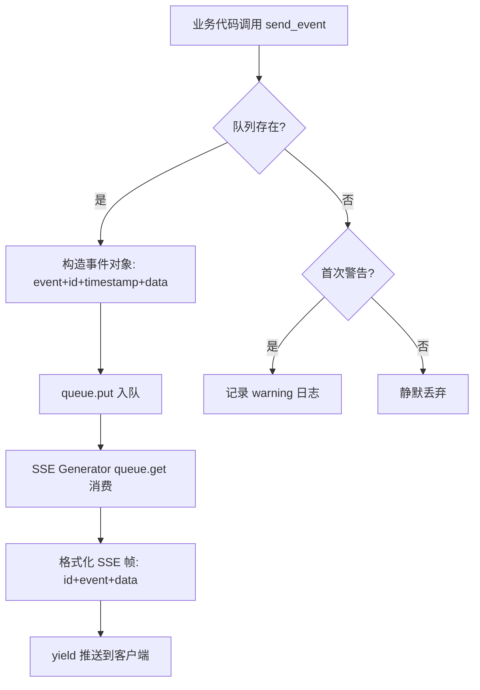
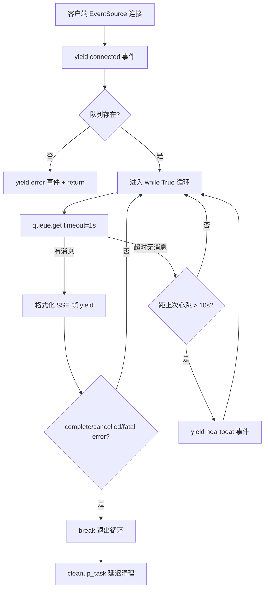
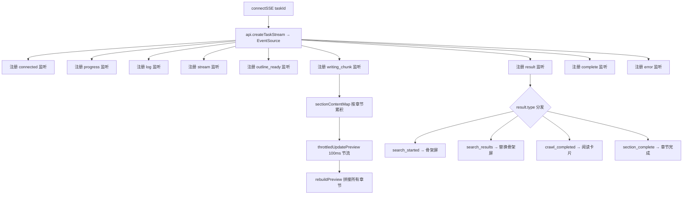

# PD-258.01 vibe-blog — Flask SSE + TaskManager 单例队列与 Vue Composable 事件分发

> 文档编号：PD-258.01
> 来源：vibe-blog `backend/services/task_service.py` `backend/routes/task_routes.py` `frontend/src/composables/useTaskStream.ts`
> GitHub：https://github.com/datawhalechina/vibe-blog.git
> 问题域：PD-258 SSE实时进度推送
> 状态：可复用方案

---

## 第 1 章 问题与动机

### 1.1 核心问题

博客/绘本生成是一个多阶段长时任务（研究 → 大纲 → 写作 → 审阅 → 组装），单次生成耗时 30 秒到数分钟。用户在等待期间需要：

1. **实时感知进度** — 当前处于哪个阶段、完成百分比
2. **流式预览内容** — 写作阶段的文章内容逐字出现
3. **交互式确认** — 大纲生成后暂停等待用户确认再继续
4. **错误即时反馈** — 某个阶段失败时立即通知，区分可恢复/不可恢复
5. **主动取消** — 用户可随时中断正在执行的任务

传统轮询方案（每秒 GET /status）延迟高、服务端压力大，WebSocket 对 Flask 生态侵入性强。SSE（Server-Sent Events）是单向推送的最佳平衡点：HTTP 原生、自动重连、浏览器原生支持。

### 1.2 vibe-blog 的解法概述

vibe-blog 构建了一套完整的 SSE 实时进度体系，核心由三层组成：

1. **后端 TaskManager 单例** — 线程安全的任务状态机 + 每任务独立 Queue，所有业务代码通过 `send_event()` 投递事件（`backend/services/task_service.py:34-223`）
2. **SSE 端点生成器** — Flask `stream_with_context()` 从 Queue 消费事件，格式化为 SSE 协议帧，10 秒心跳保活（`backend/routes/task_routes.py:79-142`）
3. **前端 Composable 事件分发** — `useTaskStream` 封装 EventSource 生命周期，按事件类型分发到 15+ 处理器，支持章节级流式预览和节流更新（`frontend/src/composables/useTaskStream.ts:24-441`）

### 1.3 设计思想

| 设计原则 | 具体实现 | 理由 | 替代方案 |
|----------|----------|------|----------|
| 单例 + 每任务队列 | TaskManager 双重检查锁单例，每个 task_id 独立 Queue | 多线程安全，任务间完全隔离 | Redis Pub/Sub（引入外部依赖） |
| 事件类型化 | 12 种事件类型（connected/progress/log/stream/outline_ready/writing_chunk/result/complete/error/cancelled/heartbeat） | 前端可精确分发，不同事件不同 UI 渲染 | 统一 message 类型（前端需自行解析） |
| 心跳保活 | 10 秒无消息自动发 heartbeat | 防止代理/CDN 超时断连 | 客户端定时 ping（增加复杂度） |
| 延迟清理 | 任务完成后 5 分钟延迟清理 Queue | 允许断线重连后补拉事件 | 立即清理（断线即丢失） |
| Composable 封装 | useTaskStream 返回响应式状态 + 方法 | Vue 3 组合式 API 最佳实践，多页面复用 | Vuex/Pinia store（过重） |

---

## 第 2 章 源码实现分析

### 2.1 架构概览

```
┌─────────────────────────────────────────────────────────────────┐
│                        Frontend (Vue 3)                         │
│                                                                 │
│  ┌──────────────┐    ┌─────────────────┐    ┌───────────────┐  │
│  │  Home.vue /  │───→│ useTaskStream() │───→│ProgressDrawer │  │
│  │ Generate.vue │    │  (composable)   │    │ProgressPanel  │  │
│  └──────┬───────┘    └────────┬────────┘    └───────────────┘  │
│         │ POST /api/blog/     │ EventSource                     │
│         │ generate            │ /api/tasks/{id}/stream           │
├─────────┼─────────────────────┼─────────────────────────────────┤
│         ▼                     ▼                                 │
│  ┌──────────────┐    ┌─────────────────┐                       │
│  │ task_routes  │    │  SSE Generator  │←── stream_with_context │
│  │ POST handler │    │  (while True)   │                       │
│  └──────┬───────┘    └────────┬────────┘                       │
│         │ create_task()       │ queue.get(timeout=1)            │
│         ▼                     ▼                                 │
│  ┌─────────────────────────────────────┐                       │
│  │         TaskManager (Singleton)      │                       │
│  │  ┌─────────┐  ┌─────────┐          │                       │
│  │  │ tasks{} │  │queues{} │          │                       │
│  │  │ id→Prog │  │ id→Queue│          │                       │
│  │  └─────────┘  └─────────┘          │                       │
│  └──────────────────┬──────────────────┘                       │
│                     ▲ send_event() / send_progress()            │
│  ┌──────────────────┴──────────────────┐                       │
│  │     PipelineService (async thread)   │                       │
│  │  research → outline → write → review │                       │
│  └─────────────────────────────────────┘                       │
│                        Backend (Flask)                           │
└─────────────────────────────────────────────────────────────────┘
```

### 2.2 核心实现

#### 2.2.1 TaskManager 单例与事件队列



对应源码 `backend/services/task_service.py:34-102`：

```python
class TaskManager:
    """任务管理器 - 管理任务状态和 SSE 消息队列"""
    
    _instance = None
    _lock = Lock()
    
    def __new__(cls):
        if cls._instance is None:
            with cls._lock:
                if cls._instance is None:
                    cls._instance = super().__new__(cls)
                    cls._instance._initialized = False
        return cls._instance
    
    def __init__(self):
        if self._initialized:
            return
        self._initialized = True
        self.tasks: Dict[str, TaskProgress] = {}
        self.queues: Dict[str, Queue] = {}
        self.task_lock = Lock()

    def send_event(self, task_id: str, event: str, data: Dict[str, Any]):
        """发送 SSE 事件（带唯一 ID 和时间戳）"""
        queue = self.queues.get(task_id)
        if queue:
            queue.put({
                'event': event,
                'id': uuid.uuid4().hex[:12],
                'timestamp': time.time(),
                'data': data,
            })
```

关键设计点：
- **双重检查锁单例**（`task_service.py:37-46`）：`_lock` + `_instance` 确保多线程下只创建一个实例
- **每事件唯一 ID**（`task_service.py:91`）：`uuid.uuid4().hex[:12]` 用于 SSE `id:` 字段，支持客户端 `Last-Event-ID` 断线续传
- **日志洪泛防护**（`task_service.py:98-102`）：队列不存在时只记录一次 warning，避免高频事件打爆日志

#### 2.2.2 SSE 端点与心跳保活



对应源码 `backend/routes/task_routes.py:79-142`：

```python
@task_bp.route('/api/tasks/<task_id>/stream')
def stream_task_progress(task_id: str):
    """SSE 进度推送端点"""
    def generate():
        task_manager = get_task_manager()
        yield f"event: connected\ndata: {json.dumps({'task_id': task_id, 'status': 'connected'})}\n\n"

        queue = task_manager.get_queue(task_id)
        if not queue:
            yield f"event: error\ndata: {json.dumps({'message': '任务不存在', 'recoverable': False})}\n\n"
            return

        last_heartbeat = time.time()
        while True:
            try:
                try:
                    message = queue.get(timeout=1)
                except Empty:
                    message = None

                if message:
                    event_type = message.get('event', 'progress')
                    data = message.get('data', {})
                    event_id = message.get('id', '')
                    timestamp = message.get('timestamp')
                    if timestamp:
                        data['_ts'] = timestamp
                    lines = []
                    if event_id:
                        lines.append(f"id: {event_id}")
                    lines.append(f"event: {event_type}")
                    lines.append(f"data: {json.dumps(data, ensure_ascii=False)}")
                    yield "".join(line + "\n" for line in lines) + "\n"

                    if event_type in ('complete', 'cancelled'):
                        break
                    if event_type == 'error' and not data.get('recoverable'):
                        break

                if time.time() - last_heartbeat > 10:
                    yield f"event: heartbeat\ndata: {json.dumps({'timestamp': time.time()})}\n\n"
                    last_heartbeat = time.time()
            except GeneratorExit:
                break

        task_manager.cleanup_task(task_id)

    return Response(
        stream_with_context(generate()),
        mimetype='text/event-stream',
        headers={
            'Cache-Control': 'no-cache',
            'Connection': 'keep-alive',
            'X-Accel-Buffering': 'no',
            'Access-Control-Allow-Origin': '*'
        }
    )
```

关键设计点：
- **`X-Accel-Buffering: no`**（`task_routes.py:139`）：禁用 Nginx 缓冲，确保事件即时推送
- **终止条件三重判断**（`task_routes.py:115-118`）：complete、cancelled 直接退出；error 仅在 `recoverable=False` 时退出
- **GeneratorExit 优雅处理**（`task_routes.py:124-126`）：客户端断开时 Flask 抛出 GeneratorExit，捕获后安静退出

### 2.3 实现细节

#### 前端 useTaskStream Composable 事件分发

`useTaskStream`（`frontend/src/composables/useTaskStream.ts:24-441`）是前端 SSE 的核心封装，管理 15+ 种事件类型的分发：



章节级流式预览的核心逻辑（`useTaskStream.ts:155-171`）：

```typescript
es.addEventListener('writing_chunk', (e: MessageEvent) => {
  const d = JSON.parse(e.data)
  const sectionTitle = d.section_title || '_default'
  // 注册新章节（保持出现顺序）
  if (!sectionContentMap.has(sectionTitle)) {
    sectionContentMap.set(sectionTitle, '')
    sectionOrder.push(sectionTitle)
    sectionCount++
    activeSectionIndex.value = sectionCount - 1
  }
  if (d.accumulated) {
    sectionContentMap.set(sectionTitle, d.accumulated)
  } else if (d.delta) {
    sectionContentMap.set(sectionTitle, (sectionContentMap.get(sectionTitle) || '') + d.delta)
  }
  throttledUpdatePreview()
})
```

关键设计点：
- **Map + 有序数组双结构**（`useTaskStream.ts:42-43`）：`sectionContentMap` 存内容，`sectionOrder` 保顺序，支持并行写作时章节乱序到达
- **delta/accumulated 双模式**（`useTaskStream.ts:165-169`）：优先用 `accumulated` 全量替换，fallback 到 `delta` 增量拼接
- **100ms 节流预览**（`useTaskStream.ts:57-63`）：避免高频 writing_chunk 事件导致 DOM 抖动
- **骨架屏 → 结果替换**（`useTaskStream.ts:179-215`）：搜索开始时显示 6 个 Skeleton 方块，结果到达后原地替换为真实卡片

#### 智能自动滚动

`useSmartAutoScroll`（`frontend/src/composables/useSmartAutoScroll.ts:16-49`）实现了"用户滚动时暂停自动滚动"的智能行为：

```typescript
const { scrollTop, scrollHeight, clientHeight } = container
const distanceToBottom = scrollHeight - scrollTop - clientHeight
isFollowing.value = distanceToBottom < threshold  // 默认 200px

if (isFollowing.value) {
  container.scrollTo({ top: scrollHeight, behavior })
}
```

当用户手动上滚超过 200px 时，`isFollowing` 变为 false，停止自动滚动；底部出现"回到底部"按钮。

#### 加权进度计算

`TaskManager.send_progress()`（`task_service.py:104-134`）实现了基于阶段权重的总体进度计算：

```python
stage_weights = {
    'analyze': 10, 'metaphor': 15, 'outline': 20,
    'content': 30, 'image': 25
}
completed_weight = sum(
    w for s, w in stage_weights.items()
    if s in task.results and task.results[s].get('completed')
)
current_weight = stage_weights.get(stage, 0) * progress / 100
task.overall_progress = int(completed_weight + current_weight)
```


---

## 第 3 章 迁移指南

### 3.1 迁移清单

**阶段 1：后端 TaskManager（1 个文件）**
- [ ] 复制 `TaskProgress` dataclass 和 `TaskManager` 类
- [ ] 根据业务调整 `stage_weights` 权重表
- [ ] 添加 `get_task_manager()` 全局访问函数

**阶段 2：SSE 端点（1 个路由文件）**
- [ ] 创建 `/api/tasks/<task_id>/stream` SSE 端点
- [ ] 配置 `stream_with_context()` + 正确的 Response headers
- [ ] 实现心跳保活（10 秒间隔）
- [ ] 处理终止条件（complete/cancelled/fatal error）

**阶段 3：业务集成**
- [ ] 在异步任务中注入 `task_manager`，各阶段调用 `send_progress()` / `send_result()`
- [ ] 任务完成时调用 `send_complete()`，失败时调用 `send_error()`
- [ ] 支持 `is_cancelled()` 检查，允许用户中断

**阶段 4：前端 Composable**
- [ ] 创建 `useTaskStream` composable，封装 EventSource 生命周期
- [ ] 按事件类型注册 `addEventListener`
- [ ] 实现 `onUnmounted` 自动关闭连接
- [ ] 如需流式预览，实现 `sectionContentMap` + 节流更新

### 3.2 适配代码模板

#### 后端：最小化 TaskManager

```python
"""task_manager.py — 最小化 SSE 任务管理器"""
import json, time, uuid
from queue import Queue, Empty
from threading import Lock
from dataclasses import dataclass, field
from typing import Dict, Any, Optional
from datetime import datetime

@dataclass
class TaskProgress:
    task_id: str
    status: str = "pending"
    current_stage: str = ""
    overall_progress: int = 0
    message: str = ""
    error: Optional[str] = None

class TaskManager:
    _instance = None
    _lock = Lock()

    def __new__(cls):
        if cls._instance is None:
            with cls._lock:
                if cls._instance is None:
                    cls._instance = super().__new__(cls)
                    cls._instance._initialized = False
        return cls._instance

    def __init__(self):
        if self._initialized:
            return
        self._initialized = True
        self.tasks: Dict[str, TaskProgress] = {}
        self.queues: Dict[str, Queue] = {}
        self._lock = Lock()

    def create_task(self) -> str:
        task_id = f"task_{uuid.uuid4().hex[:12]}"
        with self._lock:
            self.tasks[task_id] = TaskProgress(task_id=task_id)
            self.queues[task_id] = Queue()
        return task_id

    def send_event(self, task_id: str, event: str, data: dict):
        queue = self.queues.get(task_id)
        if queue:
            queue.put({
                'event': event,
                'id': uuid.uuid4().hex[:12],
                'timestamp': time.time(),
                'data': data,
            })

    def send_complete(self, task_id: str, outputs: dict):
        task = self.tasks.get(task_id)
        if task:
            task.status = "completed"
            task.overall_progress = 100
        self.send_event(task_id, 'complete', {'outputs': outputs})

    def send_error(self, task_id: str, message: str, recoverable: bool = False):
        task = self.tasks.get(task_id)
        if task and not recoverable:
            task.status = "failed"
            task.error = message
        self.send_event(task_id, 'error', {'message': message, 'recoverable': recoverable})

    def cancel_task(self, task_id: str) -> bool:
        task = self.tasks.get(task_id)
        if task and task.status in ("running", "pending"):
            task.status = "cancelled"
            self.send_event(task_id, 'cancelled', {'task_id': task_id})
            return True
        return False

    def is_cancelled(self, task_id: str) -> bool:
        task = self.tasks.get(task_id)
        return task is not None and task.status == "cancelled"

    def cleanup_task(self, task_id: str, delay: int = 300):
        from threading import Thread
        def _cleanup():
            time.sleep(delay)
            with self._lock:
                self.tasks.pop(task_id, None)
                self.queues.pop(task_id, None)
        Thread(target=_cleanup, daemon=True).start()

_tm: Optional[TaskManager] = None
def get_task_manager() -> TaskManager:
    global _tm
    if _tm is None:
        _tm = TaskManager()
    return _tm
```

#### 后端：SSE 端点

```python
"""sse_routes.py — SSE 推送端点"""
from flask import Blueprint, Response, stream_with_context
import json, time
from queue import Empty

sse_bp = Blueprint('sse', __name__)

@sse_bp.route('/api/tasks/<task_id>/stream')
def stream_task(task_id: str):
    def generate():
        from task_manager import get_task_manager
        tm = get_task_manager()
        yield f"event: connected\ndata: {json.dumps({'task_id': task_id})}\n\n"

        queue = tm.queues.get(task_id)
        if not queue:
            yield f"event: error\ndata: {json.dumps({'message': 'Task not found'})}\n\n"
            return

        last_hb = time.time()
        while True:
            try:
                msg = None
                try:
                    msg = queue.get(timeout=1)
                except Empty:
                    pass

                if msg:
                    lines = []
                    if msg.get('id'):
                        lines.append(f"id: {msg['id']}")
                    lines.append(f"event: {msg['event']}")
                    lines.append(f"data: {json.dumps(msg['data'], ensure_ascii=False)}")
                    yield "".join(l + "\n" for l in lines) + "\n"

                    if msg['event'] in ('complete', 'cancelled'):
                        break
                    if msg['event'] == 'error' and not msg['data'].get('recoverable'):
                        break

                if time.time() - last_hb > 10:
                    yield f"event: heartbeat\ndata: {json.dumps({'ts': time.time()})}\n\n"
                    last_hb = time.time()
            except GeneratorExit:
                break

        tm.cleanup_task(task_id)

    return Response(
        stream_with_context(generate()),
        mimetype='text/event-stream',
        headers={'Cache-Control': 'no-cache', 'X-Accel-Buffering': 'no'}
    )
```

#### 前端：Vue 3 Composable

```typescript
// useTaskStream.ts — 最小化 SSE composable
import { ref, onUnmounted } from 'vue'

export interface ProgressItem {
  time: string; message: string; type: string
}

export function useTaskStream() {
  const isLoading = ref(false)
  const progressItems = ref<ProgressItem[]>([])
  const progressText = ref('')
  let es: EventSource | null = null

  const addItem = (msg: string, type = 'info') => {
    progressItems.value.push({ time: new Date().toLocaleTimeString(), message: msg, type })
  }

  const connect = (taskId: string, onComplete?: (data: any) => void) => {
    es = new EventSource(`/api/tasks/${taskId}/stream`)
    isLoading.value = true

    es.addEventListener('connected', () => addItem('已连接'))
    es.addEventListener('progress', (e) => {
      const d = JSON.parse((e as MessageEvent).data)
      addItem(d.message)
      progressText.value = d.message
    })
    es.addEventListener('complete', (e) => {
      const d = JSON.parse((e as MessageEvent).data)
      addItem('生成完成', 'success')
      isLoading.value = false
      es?.close()
      onComplete?.(d)
    })
    es.addEventListener('error', (e) => {
      if ((e as MessageEvent).data) {
        const d = JSON.parse((e as MessageEvent).data)
        addItem(`错误: ${d.message}`, 'error')
      }
      isLoading.value = false
    })
  }

  const stop = async (taskId: string) => {
    await fetch(`/api/tasks/${taskId}/cancel`, { method: 'POST' })
    es?.close()
    isLoading.value = false
  }

  onUnmounted(() => { es?.close() })

  return { isLoading, progressItems, progressText, connect, stop }
}
```

### 3.3 适用场景

| 场景 | 适用度 | 说明 |
|------|--------|------|
| 多阶段长时任务（博客/报告生成） | ⭐⭐⭐ | 完美匹配，阶段进度 + 流式预览 |
| 单阶段流式输出（聊天对话） | ⭐⭐ | 可用但偏重，直接 SSE 更简单 |
| 需要双向通信（协同编辑） | ⭐ | SSE 单向推送不够，需 WebSocket |
| 高并发场景（>1000 并发任务） | ⭐⭐ | 内存 Queue 有上限，需换 Redis |
| 需要断线恢复的场景 | ⭐⭐⭐ | 5 分钟延迟清理 + EventSource 自动重连 |

---

## 第 4 章 测试用例

```python
"""test_task_manager.py — TaskManager 核心功能测试"""
import time
import json
import pytest
from queue import Empty
from threading import Thread
from unittest.mock import patch

# 假设 TaskManager 已按迁移模板实现
from task_manager import TaskManager, TaskProgress, get_task_manager


class TestTaskManagerSingleton:
    """单例模式测试"""

    def test_singleton_returns_same_instance(self):
        tm1 = TaskManager()
        tm2 = TaskManager()
        assert tm1 is tm2

    def test_singleton_thread_safe(self):
        instances = []
        def create():
            instances.append(TaskManager())
        threads = [Thread(target=create) for _ in range(10)]
        for t in threads:
            t.start()
        for t in threads:
            t.join()
        assert all(inst is instances[0] for inst in instances)


class TestTaskLifecycle:
    """任务生命周期测试"""

    def setup_method(self):
        self.tm = get_task_manager()
        self.task_id = self.tm.create_task()

    def test_create_task_returns_unique_id(self):
        id2 = self.tm.create_task()
        assert self.task_id != id2
        assert self.task_id.startswith("task_")

    def test_task_initial_status_is_pending(self):
        task = self.tm.get_task(self.task_id)
        assert task is not None
        assert task.status == "pending"

    def test_send_event_enqueues_message(self):
        self.tm.send_event(self.task_id, 'progress', {'message': 'test'})
        queue = self.tm.get_queue(self.task_id)
        msg = queue.get(timeout=1)
        assert msg['event'] == 'progress'
        assert msg['data']['message'] == 'test'
        assert 'id' in msg
        assert 'timestamp' in msg

    def test_send_event_to_nonexistent_task_no_crash(self):
        # 不应抛异常，只记录 warning
        self.tm.send_event('nonexistent_task', 'progress', {'message': 'test'})

    def test_cancel_running_task(self):
        self.tm.set_running(self.task_id)
        assert self.tm.cancel_task(self.task_id) is True
        assert self.tm.is_cancelled(self.task_id) is True

    def test_cancel_completed_task_fails(self):
        self.tm.send_complete(self.task_id, {})
        assert self.tm.cancel_task(self.task_id) is False

    def test_send_complete_sets_progress_100(self):
        self.tm.send_complete(self.task_id, {'markdown': '# Hello'})
        task = self.tm.get_task(self.task_id)
        assert task.status == "completed"
        assert task.overall_progress == 100

    def test_send_error_non_recoverable_sets_failed(self):
        self.tm.send_error(self.task_id, 'outline', 'LLM timeout', recoverable=False)
        task = self.tm.get_task(self.task_id)
        assert task.status == "failed"
        assert task.error == "LLM timeout"

    def test_send_error_recoverable_keeps_status(self):
        self.tm.set_running(self.task_id)
        self.tm.send_error(self.task_id, 'search', 'Rate limited', recoverable=True)
        task = self.tm.get_task(self.task_id)
        assert task.status == "running"  # 未变为 failed


class TestSSEEventFormat:
    """SSE 事件格式测试"""

    def test_event_has_required_fields(self):
        tm = get_task_manager()
        task_id = tm.create_task()
        tm.send_event(task_id, 'progress', {'stage': 'write', 'message': 'Writing...'})
        queue = tm.get_queue(task_id)
        msg = queue.get(timeout=1)

        # 验证 SSE 帧所需字段
        assert 'event' in msg
        assert 'id' in msg
        assert 'timestamp' in msg
        assert 'data' in msg
        assert isinstance(msg['timestamp'], float)
        assert len(msg['id']) == 12  # uuid hex[:12]

    def test_progress_calculates_overall(self):
        tm = get_task_manager()
        task_id = tm.create_task()
        # 模拟 analyze 阶段完成
        task = tm.get_task(task_id)
        task.results['analyze'] = {'completed': True}
        tm.send_progress(task_id, 'outline', 50, 'Generating outline...')
        assert task.overall_progress == 20  # analyze(10) + outline(20*50%)
```


---

## 第 5 章 跨域关联

| 关联域 | 关系类型 | 说明 |
|--------|----------|------|
| PD-02 多 Agent 编排 | 协同 | SSE 进度推送是多 Agent 编排的可视化层，每个 Agent 阶段（researcher/planner/writer/reviewer）通过 `send_progress()` 报告进度 |
| PD-06 记忆持久化 | 协同 | TaskProgress dataclass 记录任务状态和中间结果（`results` 字典），是短期任务记忆的载体 |
| PD-09 Human-in-the-Loop | 依赖 | `outline_ready` 事件实现了 HITL 暂停：后端发送大纲后等待前端 `confirmOutline()` 调用 `/api/tasks/{id}/resume` 恢复执行 |
| PD-10 中间件管道 | 协同 | SSE 事件流本身是一个中间件管道的输出端，PipelineService 的每个阶段都是管道中的一环 |
| PD-11 可观测性 | 依赖 | SSE 事件携带 `token_usage` 字段，前端 `updateTokenUsage()` 实时追踪 LLM 调用成本；事件的 `_ts` 时间戳支持耗时分析 |
| PD-03 容错与重试 | 协同 | `send_error(recoverable=True)` 区分可恢复/不可恢复错误，前端据此决定是否显示重试按钮；心跳保活防止连接意外断开 |

---

## 第 6 章 来源文件索引

| 文件 | 行范围 | 关键实现 |
|------|--------|----------|
| `backend/services/task_service.py` | L18-L31 | TaskProgress dataclass 定义 |
| `backend/services/task_service.py` | L34-L102 | TaskManager 单例 + send_event 核心 |
| `backend/services/task_service.py` | L104-L134 | send_progress 加权进度计算 |
| `backend/services/task_service.py` | L160-L173 | send_complete 完成事件 |
| `backend/services/task_service.py` | L175-L189 | send_error 错误事件（recoverable 区分） |
| `backend/services/task_service.py` | L198-L223 | cancel_task + cleanup_task 延迟清理 |
| `backend/routes/task_routes.py` | L22-L76 | POST /api/generate 创建任务端点 |
| `backend/routes/task_routes.py` | L79-L142 | SSE stream 端点（心跳 + 终止条件） |
| `backend/routes/task_routes.py` | L168-L187 | POST /api/tasks/{id}/cancel 取消端点 |
| `frontend/src/services/api.ts` | L132-L134 | createTaskStream EventSource 工厂 |
| `frontend/src/composables/useTaskStream.ts` | L24-L441 | SSE composable 完整实现 |
| `frontend/src/composables/useTaskStream.ts` | L102-L345 | connectSSE 15+ 事件监听器注册 |
| `frontend/src/composables/useTaskStream.ts` | L155-L171 | writing_chunk 章节级流式预览 |
| `frontend/src/composables/useTaskStream.ts` | L46-L63 | rebuildPreview + 100ms 节流 |
| `frontend/src/composables/useSmartAutoScroll.ts` | L16-L49 | 智能自动滚动（阈值检测 + 手动暂停） |
| `frontend/src/components/home/ProgressDrawer.vue` | L1-L1073 | 终端风格进度面板（搜索卡片/骨架屏/大纲确认） |
| `frontend/src/components/home/ProgressDrawer.vue` | L284-L344 | Props/Emits TypeScript 接口定义 |
| `frontend/src/components/home/ProgressDrawer.vue` | L330-L343 | useSmartAutoScroll 集成 |
| `frontend/src/components/ProgressPanel.vue` | L1-L394 | 轻量级进度面板（计划列表 + 执行状态） |

---

## 第 7 章 横向对比维度

```json comparison_data
{
  "project": "vibe-blog",
  "dimensions": {
    "传输协议": "Flask SSE + stream_with_context，单向推送",
    "事件类型化": "12 种命名事件（connected/progress/log/stream/outline_ready/writing_chunk/result/complete/error/cancelled/heartbeat），前端按类型精确分发",
    "队列架构": "TaskManager 单例 + 每任务独立 threading.Queue，内存级",
    "心跳保活": "10 秒间隔 heartbeat 事件 + X-Accel-Buffering: no 禁用 Nginx 缓冲",
    "进度粒度": "阶段加权百分比（analyze 10% / outline 20% / content 30%）+ 章节级流式预览",
    "前端封装": "Vue 3 Composable（useTaskStream）封装 EventSource 生命周期 + 100ms 节流预览",
    "断线处理": "5 分钟延迟清理 Queue + EventSource 原生自动重连 + 事件唯一 ID",
    "交互能力": "outline_ready 事件实现 HITL 暂停确认，cancel 端点支持用户主动中断"
  }
}
```

### 域元数据补充

```json domain_metadata
{
  "solution_summary": "vibe-blog 用 Flask stream_with_context + TaskManager 单例每任务 Queue 实现 12 种类型化 SSE 事件推送，前端 useTaskStream composable 按事件类型分发到 15+ 处理器，支持章节级流式预览和大纲 HITL 确认",
  "description": "SSE 事件类型化设计与前端 Composable 封装的工程实践",
  "sub_problems": [
    "多阶段加权进度计算",
    "章节级并行写作流式预览",
    "搜索骨架屏到结果卡片的原地替换",
    "智能自动滚动与手动暂停检测"
  ],
  "best_practices": [
    "每事件携带 uuid ID 支持 Last-Event-ID 断线续传",
    "X-Accel-Buffering: no 头禁用反向代理缓冲",
    "send_error 区分 recoverable 控制 SSE 连接是否终止",
    "sectionContentMap + sectionOrder 双结构支持乱序章节到达"
  ]
}
```

