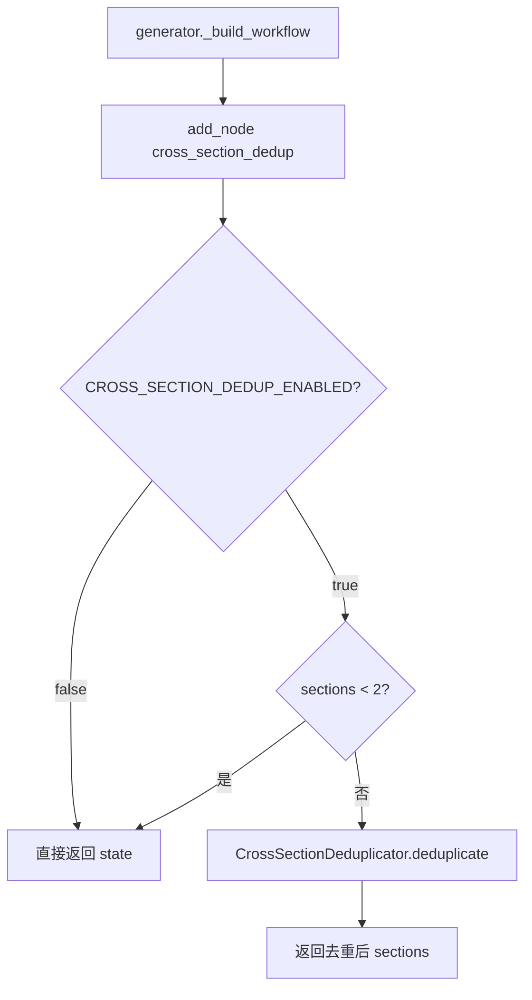
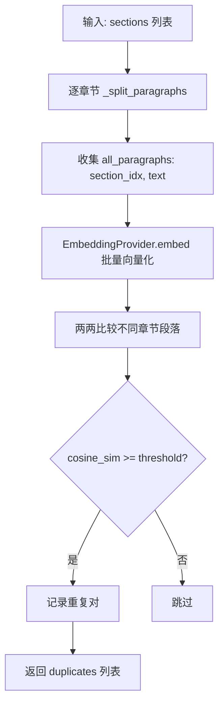
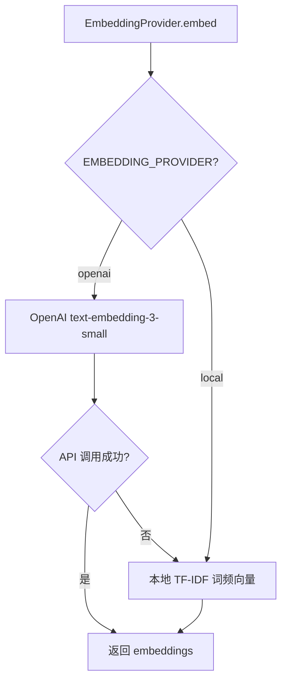

# PD-259.01 vibe-blog — CrossSectionDeduplicator 跨章节 Embedding 语义去重

> 文档编号：PD-259.01
> 来源：vibe-blog `backend/services/blog_generator/cross_section_dedup.py`
> GitHub：https://github.com/datawhalechina/vibe-blog.git
> 问题域：PD-259 跨章节语义去重 Cross-Section Deduplication
> 状态：可复用方案

---

## 第 1 章 问题与动机

### 1.1 核心问题

多 Agent 协作生成长文时，不同 Agent（或同一 Agent 的不同调用）各自独立撰写章节，缺乏全局视角。这导致一个高频问题：**不同章节之间出现语义重复**——不是逐字相同，而是用不同措辞表达了相同的观点或知识点。

典型场景：
- Writer Agent 为"安装配置"和"快速开始"两个章节分别生成内容，两者都详细描述了环境准备步骤
- 多轮深化（Deepen）后，追问补充的内容与原有章节产生交叉覆盖
- Reviewer 修订时为某章节补充的背景知识，与另一章节的引言段落高度相似

简单的文本匹配（如字符串包含、编辑距离）无法捕捉这类语义级重复，因为措辞完全不同但含义相同。

### 1.2 vibe-blog 的解法概述

vibe-blog 在 LangGraph 工作流中插入了一个专门的 `cross_section_dedup` 节点（`generator.py:232`），位于 Writer + Coder/Artist 之后、Reviewer 之前：

1. **段落级切分**：将每个章节按空行切分为段落，跳过代码块和标题行（`cross_section_dedup.py:35-65`）
2. **Embedding 向量化**：通过 `EmbeddingProvider` 将所有段落转为向量，支持 OpenAI API 和本地 TF-IDF 两种后端（`semantic_compressor.py:33-83`）
3. **余弦相似度两两比较**：只比较不同章节的段落对，相似度超过阈值（默认 0.85）标记为重复（`cross_section_dedup.py:96-116`）
4. **保留首现、删除后续**：保留先出现的段落，从后续章节中删除重复段落，并清理多余空行（`cross_section_dedup.py:118-155`）

### 1.3 设计思想

| 设计原则 | 具体实现 | 理由 | 替代方案 |
|----------|----------|------|----------|
| 段落粒度而非句子粒度 | 按空行切分段落，最小 50 字符 | 段落是语义完整单元，句子级去重会破坏上下文连贯性 | 句子级切分（过细，误删风险高） |
| Embedding 语义匹配 | 余弦相似度 + 可配阈值 0.85 | 捕捉措辞不同但含义相同的重复 | 纯文本 diff / 编辑距离（只能检测字面重复） |
| 双后端降级 | OpenAI embedding 失败自动回退本地 TF-IDF | 保证离线/无 API key 场景也能工作 | 仅依赖 OpenAI（无网络时完全失效） |
| 保留首现策略 | section_a（先出现）保留，section_b 删除 | 简单确定性规则，避免 LLM 改写引入新问题 | LLM 改写合并（成本高、不确定性大） |
| 环境变量开关 | `CROSS_SECTION_DEDUP_ENABLED` 默认 false | 去重是可选增强，不影响核心流程 | 硬编码启用（无法按需关闭） |

---

## 第 2 章 源码实现分析

### 2.1 架构概览

CrossSectionDeduplicator 在 LangGraph 工作流中的位置：

```
┌──────────┐    ┌──────────────┐    ┌───────────────────┐    ┌──────────────────┐    ┌──────────┐
│  Writer   │───→│ Coder+Artist │───→│ cross_section_dedup│───→│ consistency_check │───→│ Reviewer │
│ (撰写)    │    │ (代码+配图)   │    │  (语义去重)        │    │  (一致性检查)      │    │ (审核)   │
└──────────┘    └──────────────┘    └───────────────────┘    └──────────────────┘    └──────────┘
```

关键组件关系：

```
CrossSectionDeduplicator
  ├── _split_paragraphs()          # 段落切分（跳过代码块/标题/短段落）
  ├── detect_duplicates()          # 检测重复对
  │     └── EmbeddingProvider      # 向量化（OpenAI / 本地 TF-IDF）
  │           ├── _embed_openai()  # OpenAI text-embedding-3-small
  │           └── _embed_local()   # TF-IDF 词频向量
  │     └── _cosine_similarity()   # 余弦相似度计算
  └── deduplicate()                # 执行去重（删除后续重复段落）
```

### 2.2 核心实现

#### 2.2.1 工作流节点注册与触发



对应源码 `generator.py:924-938`：
```python
def _cross_section_dedup_node(self, state: SharedState) -> SharedState:
    """41.09 跨章节语义去重节点"""
    if os.environ.get('CROSS_SECTION_DEDUP_ENABLED', 'false').lower() != 'true':
        return state
    sections = state.get('sections', [])
    if len(sections) < 2:
        return state
    logger.info("=== Step 5.5: 跨章节语义去重 ===")
    try:
        from .cross_section_dedup import CrossSectionDeduplicator
        dedup = CrossSectionDeduplicator(llm_client=self.llm)
        state['sections'] = dedup.deduplicate(sections)
    except Exception as e:
        logger.warning(f"[Dedup] 异常，跳过去重: {e}")
    return state
```

节点在工作流中的边定义（`generator.py:305-306`）：
```python
workflow.add_edge("coder_and_artist", "cross_section_dedup")
workflow.add_edge("cross_section_dedup", "consistency_check")
```

#### 2.2.2 段落切分与重复检测



对应源码 `cross_section_dedup.py:35-116`：
```python
def _split_paragraphs(self, content: str) -> List[str]:
    """将内容按段落切分（跳过代码块和短段落）"""
    paragraphs = []
    in_code_block = False
    current = []

    for line in content.split('\n'):
        stripped = line.strip()
        if stripped.startswith('```'):
            in_code_block = not in_code_block
            continue
        if in_code_block:
            continue
        if not stripped:
            if current:
                text = '\n'.join(current).strip()
                if len(text) >= self.min_paragraph_len:
                    paragraphs.append(text)
                current = []
        else:
            if stripped.startswith('#'):
                continue
            current.append(line)

    if current:
        text = '\n'.join(current).strip()
        if len(text) >= self.min_paragraph_len:
            paragraphs.append(text)
    return paragraphs

def detect_duplicates(self, sections: List[Dict[str, Any]]) -> List[Dict]:
    from .services.semantic_compressor import _cosine_similarity, EmbeddingProvider

    all_paragraphs: List[Tuple[int, str]] = []
    for idx, section in enumerate(sections):
        content = section.get('content', '')
        for para in self._split_paragraphs(content):
            all_paragraphs.append((idx, para))

    if len(all_paragraphs) < 2:
        return []

    try:
        provider = EmbeddingProvider()
        texts = [p[1] for p in all_paragraphs]
        embeddings = provider.embed(texts)
    except Exception as e:
        logger.warning(f"[Dedup] Embedding 生成失败: {e}")
        return []

    duplicates = []
    for i in range(len(all_paragraphs)):
        for j in range(i + 1, len(all_paragraphs)):
            sec_i, _ = all_paragraphs[i]
            sec_j, _ = all_paragraphs[j]
            if sec_i == sec_j:
                continue
            sim = _cosine_similarity(embeddings[i], embeddings[j])
            if sim >= self.threshold:
                duplicates.append({
                    'section_a': sec_i,
                    'para_a': all_paragraphs[i][1],
                    'section_b': sec_j,
                    'para_b': all_paragraphs[j][1],
                    'similarity': round(sim, 4),
                })
    return duplicates
```

#### 2.2.3 Embedding 双后端与降级



对应源码 `semantic_compressor.py:33-83`：
```python
class EmbeddingProvider:
    """Embedding 提供商抽象层"""

    def __init__(self):
        self._provider = os.environ.get('EMBEDDING_PROVIDER', 'local')
        self._model = None

    def embed(self, texts: List[str]) -> List[List[float]]:
        if self._provider == 'openai':
            return self._embed_openai(texts)
        return self._embed_local(texts)

    def _embed_openai(self, texts: List[str]) -> List[List[float]]:
        try:
            from langchain_openai import OpenAIEmbeddings
            if self._model is None:
                self._model = OpenAIEmbeddings(
                    model=os.environ.get('EMBEDDING_MODEL', 'text-embedding-3-small'),
                )
            return self._model.embed_documents(texts)
        except Exception as e:
            logger.warning(f"OpenAI embedding 失败，回退到本地: {e}")
            return self._embed_local(texts)

    def _embed_local(self, texts: List[str]) -> List[List[float]]:
        """本地 TF-IDF 近似 embedding（零依赖降级方案）"""
        vocab = {}
        for text in texts:
            for word in text.lower().split():
                if word not in vocab:
                    vocab[word] = len(vocab)
        if not vocab:
            return [[0.0] for _ in texts]
        dim = len(vocab)
        embeddings = []
        for text in texts:
            vec = [0.0] * dim
            words = text.lower().split()
            if not words:
                embeddings.append(vec)
                continue
            for word in words:
                if word in vocab:
                    vec[vocab[word]] += 1.0 / len(words)
            embeddings.append(vec)
        return embeddings
```

### 2.3 实现细节

**去重执行策略**（`cross_section_dedup.py:118-155`）：

去重采用"保留首现、删除后续"的确定性策略：
- 遍历所有重复对，`section_a`（索引更小 = 先出现）保留，`section_b` 中的重复段落被删除
- 删除方式是简单的 `str.replace()`，然后用正则清理连续空行（`\n{3,}` → `\n\n`）
- 这种策略的优势是零 LLM 调用、确定性结果、不引入新内容

**O(n²) 复杂度与实际约束**：
- 两两比较的时间复杂度为 O(n²)，n 为总段落数
- 实际场景中，一篇长文通常 5-10 个章节、每章节 3-8 个段落，总段落数 < 80
- 80 个段落的两两比较 = 3160 对，embedding 计算是主要瓶颈而非比较本身

**环境变量配置体系**：

| 变量 | 默认值 | 说明 |
|------|--------|------|
| `CROSS_SECTION_DEDUP_ENABLED` | `false` | 总开关 |
| `DEDUP_SIMILARITY_THRESHOLD` | `0.85` | 相似度阈值 |
| `DEDUP_MIN_PARAGRAPH_LENGTH` | `50` | 最小段落长度（字符） |
| `EMBEDDING_PROVIDER` | `local` | embedding 后端 |
| `EMBEDDING_MODEL` | `text-embedding-3-small` | OpenAI 模型名 |

---

## 第 3 章 迁移指南

### 3.1 迁移清单

**阶段 1：核心去重器（1 个文件）**
- [ ] 复制 `CrossSectionDeduplicator` 类到目标项目
- [ ] 实现或引入 `EmbeddingProvider`（可复用 vibe-blog 的双后端设计）
- [ ] 实现 `_cosine_similarity` 工具函数

**阶段 2：工作流集成**
- [ ] 在内容生成完成后、质量审核前插入去重节点
- [ ] 添加环境变量开关（默认关闭）
- [ ] 添加 try/except 降级保护（去重失败不阻断主流程）

**阶段 3：调优**
- [ ] 根据实际内容调整相似度阈值（中文内容建议 0.80-0.85，英文 0.85-0.90）
- [ ] 根据段落长度分布调整 `min_paragraph_len`
- [ ] 评估是否需要 LLM 改写替代简单删除

### 3.2 适配代码模板

以下是一个可直接运行的最小化去重器实现：

```python
"""跨章节语义去重器 — 可独立使用的最小化版本"""
import math
import re
from typing import List, Dict, Tuple


def cosine_similarity(a: List[float], b: List[float]) -> float:
    dot = sum(x * y for x, y in zip(a, b))
    norm_a = math.sqrt(sum(x * x for x in a))
    norm_b = math.sqrt(sum(x * x for x in b))
    if norm_a == 0 or norm_b == 0:
        return 0.0
    return dot / (norm_a * norm_b)


def tfidf_embed(texts: List[str]) -> List[List[float]]:
    """零依赖 TF-IDF 向量化"""
    vocab = {}
    for text in texts:
        for word in text.lower().split():
            if word not in vocab:
                vocab[word] = len(vocab)
    dim = max(len(vocab), 1)
    embeddings = []
    for text in texts:
        vec = [0.0] * dim
        words = text.lower().split()
        for word in words:
            if word in vocab:
                vec[vocab[word]] += 1.0 / max(len(words), 1)
        embeddings.append(vec)
    return embeddings


def split_paragraphs(content: str, min_len: int = 50) -> List[str]:
    """按空行切分段落，跳过代码块和标题"""
    paragraphs, current, in_code = [], [], False
    for line in content.split('\n'):
        s = line.strip()
        if s.startswith('```'):
            in_code = not in_code
            continue
        if in_code or s.startswith('#'):
            continue
        if not s:
            if current:
                text = '\n'.join(current).strip()
                if len(text) >= min_len:
                    paragraphs.append(text)
                current = []
        else:
            current.append(line)
    if current:
        text = '\n'.join(current).strip()
        if len(text) >= min_len:
            paragraphs.append(text)
    return paragraphs


def deduplicate_sections(
    sections: List[Dict],
    threshold: float = 0.85,
    embed_fn=None,
) -> List[Dict]:
    """
    跨章节语义去重。

    Args:
        sections: [{'content': str, ...}, ...]
        threshold: 相似度阈值
        embed_fn: 自定义 embedding 函数，默认用 TF-IDF

    Returns:
        去重后的 sections（原地修改）
    """
    embed = embed_fn or tfidf_embed

    # 1. 收集所有段落
    all_paras: List[Tuple[int, str]] = []
    for idx, sec in enumerate(sections):
        for para in split_paragraphs(sec.get('content', '')):
            all_paras.append((idx, para))

    if len(all_paras) < 2:
        return sections

    # 2. 向量化
    embeddings = embed([p[1] for p in all_paras])

    # 3. 检测跨章节重复
    to_remove: Dict[int, List[str]] = {}
    for i in range(len(all_paras)):
        for j in range(i + 1, len(all_paras)):
            if all_paras[i][0] == all_paras[j][0]:
                continue
            if cosine_similarity(embeddings[i], embeddings[j]) >= threshold:
                sec_b = all_paras[j][0]
                to_remove.setdefault(sec_b, []).append(all_paras[j][1])

    # 4. 删除重复段落
    for sec_idx, paras in to_remove.items():
        content = sections[sec_idx].get('content', '')
        for para in paras:
            content = content.replace(para, '')
        sections[sec_idx]['content'] = re.sub(r'\n{3,}', '\n\n', content).strip()

    return sections
```

### 3.3 适用场景

| 场景 | 适用度 | 说明 |
|------|--------|------|
| 多 Agent 协作长文生成 | ⭐⭐⭐ | 核心场景，不同 Agent 独立写作最易产生跨章节重复 |
| 单 Agent 多轮迭代写作 | ⭐⭐⭐ | 多轮深化/修订后内容膨胀，章节间交叉覆盖 |
| RAG 增强内容生成 | ⭐⭐ | 多个章节引用相同检索结果时可能产生重复 |
| 短文（< 3 章节） | ⭐ | 章节少时重复概率低，收益有限 |
| 代码文档/API 文档 | ⭐ | 代码块已被跳过，主要针对叙述性内容 |

---

## 第 4 章 测试用例

```python
import pytest
from typing import List, Dict


# 复用第 3 章的最小化实现
from cross_section_dedup_minimal import (
    cosine_similarity, tfidf_embed, split_paragraphs, deduplicate_sections
)


class TestCosineSimlarity:
    def test_identical_vectors(self):
        assert cosine_similarity([1, 0, 0], [1, 0, 0]) == pytest.approx(1.0)

    def test_orthogonal_vectors(self):
        assert cosine_similarity([1, 0], [0, 1]) == pytest.approx(0.0)

    def test_zero_vector(self):
        assert cosine_similarity([0, 0], [1, 1]) == 0.0


class TestSplitParagraphs:
    def test_basic_split(self):
        content = "First paragraph with enough text to pass the minimum length filter.\n\nSecond paragraph also long enough to be included in the results."
        result = split_paragraphs(content, min_len=20)
        assert len(result) == 2

    def test_skip_code_blocks(self):
        content = "Normal paragraph text.\n\n```python\ncode inside block\n```\n\nAnother normal paragraph text."
        result = split_paragraphs(content, min_len=10)
        assert all('code inside' not in p for p in result)

    def test_skip_headings(self):
        content = "# Heading\n\nParagraph content that is long enough.\n\n## Another heading"
        result = split_paragraphs(content, min_len=10)
        assert all(not p.startswith('#') for p in result)

    def test_min_length_filter(self):
        content = "Short.\n\nThis is a longer paragraph that should pass the filter."
        result = split_paragraphs(content, min_len=50)
        assert len(result) == 1


class TestDeduplicateSections:
    def test_no_duplicates(self):
        sections = [
            {"content": "Python is a programming language used for web development."},
            {"content": "JavaScript runs in the browser and handles DOM manipulation."},
        ]
        result = deduplicate_sections(sections, threshold=0.85)
        assert result[0]["content"] != ""
        assert result[1]["content"] != ""

    def test_identical_paragraphs_removed(self):
        shared = "Machine learning models require large datasets for training and validation."
        sections = [
            {"content": shared},
            {"content": f"Introduction text.\n\n{shared}\n\nConclusion text."},
        ]
        result = deduplicate_sections(sections, threshold=0.99)
        # section_a 保留，section_b 中的重复被删除
        assert shared in result[0]["content"]

    def test_single_section_no_crash(self):
        sections = [{"content": "Only one section here."}]
        result = deduplicate_sections(sections)
        assert len(result) == 1

    def test_empty_sections(self):
        sections = [{"content": ""}, {"content": ""}]
        result = deduplicate_sections(sections)
        assert len(result) == 2

    def test_custom_embed_fn(self):
        """验证自定义 embedding 函数接口"""
        def dummy_embed(texts):
            return [[1.0, 0.0] for _ in texts]

        sections = [
            {"content": "Paragraph A is about topic X in detail."},
            {"content": "Paragraph B is about topic Y in detail."},
        ]
        # 所有向量相同 → 全部被判为重复
        result = deduplicate_sections(sections, threshold=0.99, embed_fn=dummy_embed)
        assert isinstance(result, list)

    def test_degradation_on_embedding_failure(self):
        """embedding 失败时应返回原始 sections 不崩溃"""
        def failing_embed(texts):
            raise RuntimeError("Embedding service down")

        sections = [
            {"content": "Content A with sufficient length for testing."},
            {"content": "Content B with sufficient length for testing."},
        ]
        # 应该不抛异常（实际实现中 detect_duplicates 有 try/except）
        # 这里测试最小化版本的行为
        with pytest.raises(RuntimeError):
            deduplicate_sections(sections, embed_fn=failing_embed)
```

---

## 第 5 章 跨域关联

| 关联域 | 关系类型 | 说明 |
|--------|----------|------|
| PD-01 上下文管理 | 协同 | 去重减少总 token 数，间接缓解上下文窗口压力 |
| PD-02 多 Agent 编排 | 依赖 | 多 Agent 独立写作是跨章节重复的根本原因，去重是编排后的修复手段 |
| PD-07 质量检查 | 协同 | 去重在 Reviewer 之前运行，减少 Reviewer 需要处理的冗余问题 |
| PD-08 搜索与检索 | 协同 | 复用 `EmbeddingProvider` 和 `_cosine_similarity`，与语义压缩共享基础设施 |
| PD-10 中间件管道 | 依赖 | 去重节点通过 `pipeline.wrap_node()` 接入中间件管道，享受 tracing/error tracking |

---

## 第 6 章 来源文件索引

| 文件 | 行范围 | 关键实现 |
|------|--------|----------|
| `backend/services/blog_generator/cross_section_dedup.py` | L1-L156 | CrossSectionDeduplicator 完整实现 |
| `backend/services/blog_generator/cross_section_dedup.py` | L35-L65 | `_split_paragraphs` 段落切分逻辑 |
| `backend/services/blog_generator/cross_section_dedup.py` | L67-L116 | `detect_duplicates` 重复检测核心 |
| `backend/services/blog_generator/cross_section_dedup.py` | L118-L155 | `deduplicate` 去重执行与清理 |
| `backend/services/blog_generator/generator.py` | L232 | 工作流节点注册 |
| `backend/services/blog_generator/generator.py` | L305-L306 | 工作流边定义（coder_and_artist → dedup → consistency_check） |
| `backend/services/blog_generator/generator.py` | L924-L938 | `_cross_section_dedup_node` 节点实现 |
| `backend/services/blog_generator/services/semantic_compressor.py` | L23-L30 | `_cosine_similarity` 余弦相似度 |
| `backend/services/blog_generator/services/semantic_compressor.py` | L33-L83 | `EmbeddingProvider` 双后端 embedding |

---

## 第 7 章 横向对比维度

```json comparison_data
{
  "project": "vibe-blog",
  "dimensions": {
    "检测粒度": "段落级切分，跳过代码块/标题，最小50字符过滤",
    "相似度算法": "Embedding余弦相似度，双后端（OpenAI + 本地TF-IDF降级）",
    "去重策略": "保留首现段落，后续章节中直接删除重复段落",
    "触发位置": "Writer+Coder后、Reviewer前，LangGraph独立节点",
    "降级保护": "环境变量开关默认关闭，异常时跳过不阻断主流程"
  }
}
```

### 域元数据补充

```json domain_metadata
{
  "solution_summary": "vibe-blog 用 Embedding 余弦相似度检测跨章节段落级语义重复，双后端（OpenAI/TF-IDF）降级，保留首现删除后续",
  "description": "多Agent长文生成后的段落级语义重复检测与消除",
  "sub_problems": [
    "代码块与标题行的切分排除",
    "Embedding后端不可用时的零依赖降级"
  ],
  "best_practices": [
    "去重节点放在代码生成后、质量审核前，避免审核冗余内容",
    "默认关闭开关，按需启用，异常时静默降级不阻断主流程"
  ]
}
```
