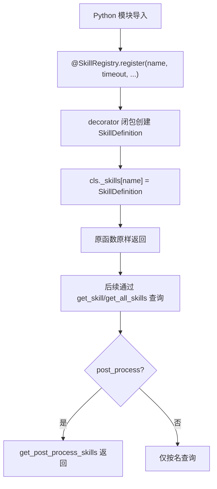
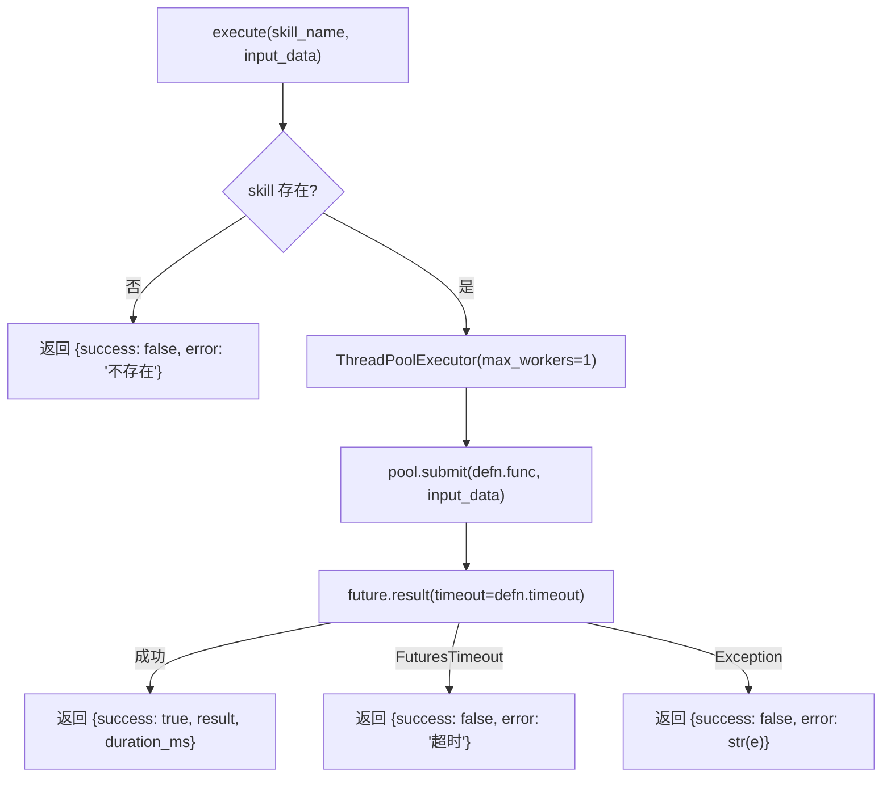
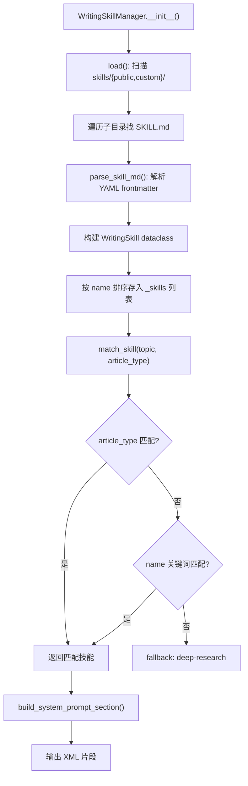

# PD-260.01 vibe-blog — 双层 Skill 注册与声明式方法论注入

> 文档编号：PD-260.01
> 来源：vibe-blog `backend/services/blog_generator/skills/`
> GitHub：https://github.com/datawhalechina/vibe-blog.git
> 问题域：PD-260 Skill 扩展系统 Skill Extension System
> 状态：可复用方案

---

## 第 1 章 问题与动机

### 1.1 核心问题

博客生成系统需要在核心写作流程之外，支持可扩展的能力增强：

1. **后处理衍生物**：博客写完后，自动生成思维导图、闪卡、学习笔记等衍生内容。这些衍生物的种类会随需求增长，不能硬编码在主流程中。
2. **写作方法论注入**：不同类型的文章（深度研究、技术教程、问题解决）需要不同的写作方法论指导 LLM。方法论由非开发者（内容运营）维护，不能写在代码里。
3. **隔离性**：新增一个技能不应修改主流程代码，技能之间互不影响，单个技能失败不能拖垮整个生成流程。

传统做法是在 generator 里堆 if-else 分支，每加一个衍生物就改一次主流程。这导致主流程膨胀、测试困难、非开发者无法参与技能扩展。

### 1.2 vibe-blog 的解法概述

vibe-blog 设计了**双层技能系统**，两层互补、职责分离：

1. **SkillRegistry（装饰器层）**：用 `@SkillRegistry.register()` 装饰器注册 Python 函数为后处理技能，`SkillExecutor` 统一执行，含 ThreadPoolExecutor 超时保护（`registry.py:31-55`, `executor.py:21-42`）
2. **WritingSkillManager（声明式层）**：扫描 `skills/{public,custom}/` 目录下的 SKILL.md 文件，解析 YAML frontmatter + Markdown 正文，按主题匹配后注入系统提示词（`writing_skill_manager.py:77-142`）
3. **环境变量开关**：`WRITING_SKILL_ENABLED` 和 `SKILL_DERIVATIVES_ENABLED` 分别控制两层的启停（`generator.py:176`, `generator.py:1166`）
4. **导入即注册**：装饰器技能通过 Python 模块导入触发注册，无需显式调用注册函数（`generator.py:1172`）
5. **批量执行**：`SkillExecutor.execute_batch()` 顺序执行多个技能，每个独立捕获异常（`executor.py:44-49`）

### 1.3 设计思想

| 设计原则 | 具体实现 | 理由 | 替代方案 |
|----------|----------|------|----------|
| 双层分离 | 装饰器层处理代码技能，SKILL.md 层处理方法论技能 | 代码技能需要 Python 运行时，方法论技能只需文本注入，两者生命周期不同 | 统一用代码注册（非开发者无法维护方法论） |
| 装饰器注册 | `@SkillRegistry.register(name, timeout, ...)` | 零侵入，函数定义即注册，IDE 可跳转 | 配置文件注册（需要额外解析，函数和配置分离） |
| 声明式 SKILL.md | YAML frontmatter 元数据 + Markdown 方法论正文 | 非开发者可用 Markdown 编辑器维护，Git 友好 | JSON/YAML 纯配置（不适合长文本方法论） |
| 环境变量门控 | `WRITING_SKILL_ENABLED` / `SKILL_DERIVATIVES_ENABLED` | 生产环境可按需开关，不改代码 | 配置文件开关（需要重新部署） |
| 线程池超时 | `ThreadPoolExecutor(max_workers=1)` + `future.result(timeout=)` | 防止单个技能阻塞整个流程，超时可配置 | asyncio.wait_for（需要技能函数全部异步化） |

---

## 第 2 章 源码实现分析

### 2.1 架构概览

vibe-blog 的技能系统由三个核心组件和两条执行路径组成：

```
┌─────────────────────────────────────────────────────────────┐
│                    BlogGenerator (generator.py)              │
│                                                              │
│  ┌──────────────────────┐    ┌───────────────────────────┐  │
│  │  写作阶段 (L378-388) │    │  后处理阶段 (L1164-1189) │  │
│  │                      │    │                           │  │
│  │  WritingSkillManager │    │  SkillRegistry            │  │
│  │  .match_skill()      │    │  .get_post_process_skills │  │
│  │  → prompt 注入       │    │  → SkillExecutor.execute  │  │
│  └──────────┬───────────┘    └─────────┬─────────────────┘  │
│             │                          │                     │
└─────────────┼──────────────────────────┼─────────────────────┘
              │                          │
    ┌─────────▼──────────┐    ┌──────────▼──────────────┐
    │  skills/{public,    │    │  skills/                 │
    │   custom}/          │    │   ├── mindmap.py         │
    │   ├── deep-research │    │   ├── flashcard.py       │
    │   │   └── SKILL.md  │    │   └── study_note.py      │
    │   ├── tech-tutorial  │    │  (@register 装饰器)      │
    │   │   └── SKILL.md  │    └─────────────────────────┘
    │   └── problem-solution│
    │       └── SKILL.md  │
    └─────────────────────┘
```

### 2.2 核心实现

#### 2.2.1 SkillRegistry — 装饰器注册中心



对应源码 `backend/services/blog_generator/skills/registry.py:13-71`：

```python
@dataclass
class SkillDefinition:
    name: str
    description: str
    func: Callable
    input_type: str
    output_type: str
    post_process: bool = False
    auto_run: bool = False
    timeout: int = 60


class SkillRegistry:
    """Skill 注册中心"""
    _skills: Dict[str, SkillDefinition] = {}

    @classmethod
    def register(cls, name: str, description: str, input_type: str,
                 output_type: str, post_process: bool = False,
                 auto_run: bool = False, timeout: int = 60):
        """装饰器：注册一个 Skill"""
        def decorator(func: Callable) -> Callable:
            cls._skills[name] = SkillDefinition(
                name=name, description=description, func=func,
                input_type=input_type, output_type=output_type,
                post_process=post_process, auto_run=auto_run, timeout=timeout,
            )
            logger.debug(f"Skill 已注册: {name}")
            return func
        return decorator
```

关键设计点：
- 类变量 `_skills: Dict` 作为全局注册表，所有实例共享（`registry.py:29`）
- `post_process` 标记区分后处理技能和普通技能（`registry.py:20`）
- `auto_run` 控制是否在批量执行时自动包含（`registry.py:21`）
- `timeout` 每个技能独立配置超时秒数（`registry.py:22`）

#### 2.2.2 SkillExecutor — 超时保护执行器



对应源码 `backend/services/blog_generator/skills/executor.py:14-49`：

```python
class SkillExecutor:
    """Skill 统一执行器"""
    def __init__(self, registry, task_log=None):
        self.registry = registry
        self.task_log = task_log

    def execute(self, skill_name: str, input_data: Any) -> Dict[str, Any]:
        defn = self.registry.get_skill(skill_name)
        if not defn:
            return {"success": False, "error": f"Skill 不存在: {skill_name}", "result": None}
        start = time.monotonic()
        try:
            with ThreadPoolExecutor(max_workers=1) as pool:
                future = pool.submit(defn.func, input_data)
                result = future.result(timeout=defn.timeout)
            duration_ms = int((time.monotonic() - start) * 1000)
            return {"success": True, "result": result, "duration_ms": duration_ms}
        except FuturesTimeout:
            duration_ms = int((time.monotonic() - start) * 1000)
            return {"success": False, "error": f"超时 ({defn.timeout}s)", "result": None, "duration_ms": duration_ms}
        except Exception as e:
            duration_ms = int((time.monotonic() - start) * 1000)
            return {"success": False, "error": str(e), "result": None, "duration_ms": duration_ms}

    def execute_batch(self, skill_names: List[str], blog_state: Any) -> Dict[str, Dict]:
        results: Dict[str, Dict] = {}
        for name in skill_names:
            results[name] = self.execute(name, blog_state)
        return results
```

关键设计点：
- 每次执行创建新的 `ThreadPoolExecutor(max_workers=1)`，隔离性强但有线程创建开销（`executor.py:29`）
- 统一返回结构 `{success, result, error, duration_ms}`，调用方无需 try-catch（`executor.py:34`）
- `execute_batch` 是顺序执行，非并行——简单可靠，避免资源竞争（`executor.py:44-49`）

#### 2.2.3 WritingSkillManager — 声明式方法论加载



对应源码 `backend/services/blog_generator/skills/writing_skill_manager.py:35-137`：

```python
def parse_skill_md(skill_file: Path, category: str) -> Optional[WritingSkill]:
    """解析 SKILL.md（YAML frontmatter + Markdown 正文）"""
    raw = skill_file.read_text(encoding="utf-8")
    fm_match = re.match(r"^---\s*\n(.*?)\n---\s*\n", raw, re.DOTALL)
    if not fm_match:
        return None
    metadata = {}
    for line in fm_match.group(1).split("\n"):
        if ":" in line:
            key, value = line.split(":", 1)
            metadata[key.strip()] = value.strip()
    return WritingSkill(
        name=metadata.get("name"),
        description=metadata.get("description"),
        skill_dir=skill_file.parent,
        skill_file=skill_file,
        category=category,
        allowed_tools=[t.strip() for t in metadata.get("allowed-tools", "").split(",") if t.strip()],
        content=raw[fm_match.end():],
    )
```

关键设计点：
- 手写 YAML frontmatter 解析器，不依赖 PyYAML（`writing_skill_manager.py:41-51`）
- `public/custom` 双目录分类，支持内置技能和用户自定义技能（`writing_skill_manager.py:97`）
- `match_skill` 三级匹配：article_type → name 关键词 → fallback 到 deep-research（`writing_skill_manager.py:117-129`）
- 输出为 XML 标签包裹的 prompt 片段，直接拼接到系统提示词（`writing_skill_manager.py:131-137`）

### 2.3 实现细节

**导入即注册模式**（`generator.py:1172`）：

```python
# 确保 skills 已注册（导入触发 @register 装饰器）
from .skills import mindmap, flashcard, study_note  # noqa: F401
```

这行 import 的副作用是触发三个模块中的 `@SkillRegistry.register()` 装饰器执行，将技能函数注册到全局 `_skills` 字典。`# noqa: F401` 告诉 linter 这不是未使用的导入。

**写作技能匹配与注入**（`generator.py:378-388`）：

在大纲确认后、正式写作前，`match_skill(topic, article_type)` 匹配最佳写作方法论，通过 `build_system_prompt_section()` 生成 `<writing-skill name="...">` XML 片段注入到 LLM 系统提示词中，指导写作过程。

**衍生物执行**（`generator.py:1164-1189`）：

在博客生成完成后，`_run_derivative_skills()` 遍历所有 `post_process=True` 的技能，逐个执行并收集结果。每个技能独立 try-catch，单个失败不影响其他。

---

## 第 3 章 迁移指南

### 3.1 迁移清单

**阶段 1：装饰器注册层（1 天可完成）**

- [ ] 创建 `skills/registry.py`，实现 `SkillDefinition` dataclass 和 `SkillRegistry` 类
- [ ] 创建 `skills/executor.py`，实现 `SkillExecutor`（含 ThreadPoolExecutor 超时）
- [ ] 创建第一个技能模块（如 `skills/summary.py`），用 `@SkillRegistry.register()` 注册
- [ ] 在主流程中添加导入触发注册 + 批量执行调用

**阶段 2：声明式方法论层（1 天可完成）**

- [ ] 创建 `skills/writing_skill_manager.py`，实现 SKILL.md 解析和匹配
- [ ] 创建 `skills/public/` 目录，编写第一个 SKILL.md 方法论文件
- [ ] 在主流程中添加技能匹配和 prompt 注入逻辑
- [ ] 添加 `WRITING_SKILL_ENABLED` 环境变量开关

**阶段 3：生产化（可选）**

- [ ] 添加 `skills/custom/` 目录支持用户自定义技能
- [ ] 添加技能执行指标采集（duration_ms 已内置）
- [ ] 考虑 `execute_batch` 并行化（当前为顺序执行）

### 3.2 适配代码模板

#### 模板 1：最小化 SkillRegistry + Executor

```python
"""skill_registry.py — 可直接复用的技能注册与执行框架"""
import time
import logging
from concurrent.futures import ThreadPoolExecutor, TimeoutError as FuturesTimeout
from dataclasses import dataclass
from typing import Any, Callable, Dict, List, Optional

logger = logging.getLogger(__name__)


@dataclass
class SkillDefinition:
    name: str
    func: Callable
    description: str = ""
    timeout: int = 60
    post_process: bool = False
    auto_run: bool = False


class SkillRegistry:
    _skills: Dict[str, SkillDefinition] = {}

    @classmethod
    def register(cls, name: str, description: str = "", timeout: int = 60,
                 post_process: bool = False, auto_run: bool = False):
        def decorator(func: Callable) -> Callable:
            cls._skills[name] = SkillDefinition(
                name=name, func=func, description=description,
                timeout=timeout, post_process=post_process, auto_run=auto_run,
            )
            return func
        return decorator

    @classmethod
    def get(cls, name: str) -> Optional[SkillDefinition]:
        return cls._skills.get(name)

    @classmethod
    def post_process_skills(cls) -> List[SkillDefinition]:
        return [s for s in cls._skills.values() if s.post_process and s.auto_run]


class SkillExecutor:
    def execute(self, skill_name: str, data: Any) -> Dict[str, Any]:
        defn = SkillRegistry.get(skill_name)
        if not defn:
            return {"success": False, "error": f"Unknown skill: {skill_name}"}
        start = time.monotonic()
        try:
            with ThreadPoolExecutor(max_workers=1) as pool:
                result = pool.submit(defn.func, data).result(timeout=defn.timeout)
            ms = int((time.monotonic() - start) * 1000)
            return {"success": True, "result": result, "duration_ms": ms}
        except FuturesTimeout:
            return {"success": False, "error": f"Timeout ({defn.timeout}s)"}
        except Exception as e:
            return {"success": False, "error": str(e)}

    def execute_all_post_process(self, data: Any) -> Dict[str, Dict]:
        return {s.name: self.execute(s.name, data) for s in SkillRegistry.post_process_skills()}


# --- 使用示例 ---
@SkillRegistry.register(name="summary", description="生成摘要", timeout=30, post_process=True, auto_run=True)
def summary_skill(data: Dict) -> Dict:
    text = data.get("text", "")
    return {"summary": text[:200] + "..." if len(text) > 200 else text}
```

#### 模板 2：声明式 SKILL.md 管理器

```python
"""writing_skill_manager.py — SKILL.md 声明式技能加载器"""
import re
from dataclasses import dataclass, field
from pathlib import Path
from typing import List, Optional


@dataclass
class WritingSkill:
    name: str
    description: str
    content: str
    category: str
    allowed_tools: List[str] = field(default_factory=list)


def parse_skill_md(path: Path, category: str) -> Optional[WritingSkill]:
    if not path.exists() or path.name != "SKILL.md":
        return None
    raw = path.read_text(encoding="utf-8")
    m = re.match(r"^---\s*\n(.*?)\n---\s*\n", raw, re.DOTALL)
    if not m:
        return None
    meta = {}
    for line in m.group(1).split("\n"):
        if ":" in line:
            k, v = line.split(":", 1)
            meta[k.strip()] = v.strip()
    if not meta.get("name"):
        return None
    return WritingSkill(
        name=meta["name"], description=meta.get("description", ""),
        content=raw[m.end():], category=category,
        allowed_tools=[t.strip() for t in meta.get("allowed-tools", "").split(",") if t.strip()],
    )


class WritingSkillManager:
    def __init__(self, root: Path):
        self._root = root
        self._skills: List[WritingSkill] = []

    def load(self) -> List[WritingSkill]:
        self._skills = []
        for cat in ("public", "custom"):
            cat_dir = self._root / cat
            if not cat_dir.is_dir():
                continue
            for d in sorted(cat_dir.iterdir()):
                skill = parse_skill_md(d / "SKILL.md", cat) if d.is_dir() else None
                if skill:
                    self._skills.append(skill)
        return self._skills

    def match(self, topic: str, article_type: str = "") -> Optional[WritingSkill]:
        for s in self._skills:
            if article_type and article_type.lower() in s.description.lower():
                return s
            if any(kw in topic.lower() for kw in s.name.split("-") if len(kw) > 2):
                return s
        return next((s for s in self._skills if s.name == "deep-research"), None)

    def to_prompt(self, skill: WritingSkill) -> str:
        return f'<writing-skill name="{skill.name}">\n{skill.content}\n</writing-skill>'
```

### 3.3 适用场景

| 场景 | 适用度 | 说明 |
|------|--------|------|
| LLM 应用的后处理扩展 | ⭐⭐⭐ | 博客→闪卡/导图，对话→摘要/标签，完美匹配 |
| 写作/生成类应用的方法论管理 | ⭐⭐⭐ | SKILL.md 让非开发者维护写作指南，Git 版本控制 |
| 需要超时保护的插件系统 | ⭐⭐⭐ | ThreadPoolExecutor 超时简单有效 |
| 高并发场景 | ⭐ | 当前 execute_batch 是顺序执行，需改造为并行 |
| 技能间有依赖关系 | ⭐ | 当前无依赖管理，需自行扩展拓扑排序 |

---

## 第 4 章 测试用例

```python
"""test_skill_system.py — 双层技能系统测试"""
import time
import pytest
from pathlib import Path
from unittest.mock import MagicMock

# ---- SkillRegistry 测试 ----

class TestSkillRegistry:
    def setup_method(self):
        """每个测试前清空注册表"""
        from backend.services.blog_generator.skills.registry import SkillRegistry
        SkillRegistry._skills.clear()
        self.registry = SkillRegistry

    def test_register_decorator(self):
        """装饰器注册后可通过 get_skill 查询"""
        @self.registry.register(name="test_skill", description="测试",
                                input_type="text", output_type="json", timeout=10)
        def my_skill(data):
            return {"ok": True}

        defn = self.registry.get_skill("test_skill")
        assert defn is not None
        assert defn.name == "test_skill"
        assert defn.timeout == 10
        assert defn.func is my_skill

    def test_get_post_process_skills(self):
        """post_process + auto_run 的技能被批量查询返回"""
        @self.registry.register(name="pp1", description="", input_type="", output_type="",
                                post_process=True, auto_run=True)
        def pp1(data): return {}

        @self.registry.register(name="pp2", description="", input_type="", output_type="",
                                post_process=True, auto_run=False)
        def pp2(data): return {}

        @self.registry.register(name="normal", description="", input_type="", output_type="")
        def normal(data): return {}

        auto_skills = self.registry.get_post_process_skills(auto_only=True)
        assert len(auto_skills) == 1
        assert auto_skills[0].name == "pp1"

    def test_nonexistent_skill(self):
        assert self.registry.get_skill("nonexistent") is None


# ---- SkillExecutor 测试 ----

class TestSkillExecutor:
    def setup_method(self):
        from backend.services.blog_generator.skills.registry import SkillRegistry
        from backend.services.blog_generator.skills.executor import SkillExecutor
        SkillRegistry._skills.clear()
        self.registry = SkillRegistry
        self.executor = SkillExecutor(registry=SkillRegistry)

    def test_execute_success(self):
        @self.registry.register(name="echo", description="", input_type="any",
                                output_type="any", timeout=5)
        def echo(data): return {"echo": data}

        result = self.executor.execute("echo", "hello")
        assert result["success"] is True
        assert result["result"]["echo"] == "hello"
        assert "duration_ms" in result

    def test_execute_timeout(self):
        @self.registry.register(name="slow", description="", input_type="any",
                                output_type="any", timeout=1)
        def slow(data):
            time.sleep(10)
            return {}

        result = self.executor.execute("slow", {})
        assert result["success"] is False
        assert "超时" in result["error"] or "Timeout" in result["error"]

    def test_execute_error(self):
        @self.registry.register(name="broken", description="", input_type="any",
                                output_type="any", timeout=5)
        def broken(data): raise ValueError("boom")

        result = self.executor.execute("broken", {})
        assert result["success"] is False
        assert "boom" in result["error"]

    def test_execute_nonexistent(self):
        result = self.executor.execute("ghost", {})
        assert result["success"] is False
        assert "不存在" in result["error"]


# ---- WritingSkillManager 测试 ----

class TestWritingSkillManager:
    def test_parse_skill_md(self, tmp_path):
        from backend.services.blog_generator.skills.writing_skill_manager import parse_skill_md
        skill_dir = tmp_path / "public" / "test-skill"
        skill_dir.mkdir(parents=True)
        (skill_dir / "SKILL.md").write_text(
            "---\nname: test-skill\ndescription: 测试技能\n"
            "allowed-tools: search, reader\n---\n\n# 方法论\n\n## Phase 1\n内容",
            encoding="utf-8",
        )
        skill = parse_skill_md(skill_dir / "SKILL.md", "public")
        assert skill is not None
        assert skill.name == "test-skill"
        assert skill.allowed_tools == ["search", "reader"]
        assert "Phase 1" in skill.content

    def test_match_skill_by_type(self, tmp_path):
        from backend.services.blog_generator.skills.writing_skill_manager import WritingSkillManager
        mgr = WritingSkillManager(tmp_path)
        for name, desc in [("tutorial", "技术教程 tutorial"), ("research", "深度研究 research")]:
            d = tmp_path / "public" / name
            d.mkdir(parents=True)
            (d / "SKILL.md").write_text(
                f"---\nname: {name}\ndescription: {desc}\n---\n\n# Content", encoding="utf-8"
            )
        mgr.load()
        matched = mgr.match_skill("任意主题", article_type="tutorial")
        assert matched is not None
        assert matched.name == "tutorial"

    def test_build_system_prompt_section(self, tmp_path):
        from backend.services.blog_generator.skills.writing_skill_manager import (
            WritingSkillManager, WritingSkill,
        )
        skill = WritingSkill(
            name="test", description="", license=None,
            skill_dir=tmp_path, skill_file=tmp_path / "SKILL.md",
            category="public", content="# 方法论内容",
        )
        mgr = WritingSkillManager(tmp_path)
        prompt = mgr.build_system_prompt_section(skill)
        assert '<writing-skill name="test">' in prompt
        assert "方法论内容" in prompt
```

---

## 第 5 章 跨域关联

| 关联域 | 关系类型 | 说明 |
|--------|----------|------|
| PD-04 工具系统 | 协同 | SkillRegistry 的装饰器注册模式与工具注册高度相似，WritingSkill 的 `allowed_tools` 字段直接关联工具系统 |
| PD-10 中间件管道 | 协同 | WritingSkillManager 的 prompt 注入本质上是一个写作阶段的中间件，在主流程和 LLM 之间插入方法论指导 |
| PD-03 容错与重试 | 依赖 | SkillExecutor 的 ThreadPoolExecutor 超时保护是容错的具体实现，execute_batch 的逐个 try-catch 是降级策略 |
| PD-11 可观测性 | 协同 | SkillExecutor 返回的 `duration_ms` 为技能执行提供了基础指标，可接入可观测性系统 |
| PD-06 记忆持久化 | 互补 | 衍生物（闪卡、思维导图）可作为结构化记忆存储，供后续对话检索 |

---

## 第 6 章 来源文件索引

| 文件 | 行范围 | 关键实现 |
|------|--------|----------|
| `backend/services/blog_generator/skills/registry.py` | L13-71 | SkillDefinition dataclass + SkillRegistry 装饰器注册中心 |
| `backend/services/blog_generator/skills/executor.py` | L14-49 | SkillExecutor 统一执行器（ThreadPoolExecutor 超时保护） |
| `backend/services/blog_generator/skills/writing_skill_manager.py` | L21-142 | WritingSkill dataclass + parse_skill_md + WritingSkillManager |
| `backend/services/blog_generator/skills/mindmap.py` | L11-55 | MindMap 衍生物技能（Markdown 标题→节点/边 JSON） |
| `backend/services/blog_generator/skills/flashcard.py` | L11-60 | Flashcard 衍生物技能（标题+段落→Q&A 闪卡） |
| `backend/services/blog_generator/skills/study_note.py` | L11-55 | StudyNote 衍生物技能（标题+首句→精简笔记） |
| `backend/services/blog_generator/generator.py` | L174-183 | WritingSkillManager 初始化与环境变量门控 |
| `backend/services/blog_generator/generator.py` | L378-388 | 写作技能匹配与 prompt 注入 |
| `backend/services/blog_generator/generator.py` | L1164-1189 | 衍生物技能批量执行入口 |
| `backend/skills/public/deep-research/SKILL.md` | 全文 | 深度研究方法论（4 阶段：广度→深度→验证→综合） |
| `backend/skills/public/tech-tutorial/SKILL.md` | 全文 | 技术教程方法论（4 阶段：受众→大纲→写作→质检） |

---

## 第 7 章 横向对比维度

> 本章用于自动填充 Butcher Wiki 的横向对比表。

```json comparison_data
{
  "project": "vibe-blog",
  "dimensions": {
    "注册方式": "双层：@register 装饰器（代码技能）+ SKILL.md YAML frontmatter（方法论技能）",
    "执行模型": "ThreadPoolExecutor 单线程隔离执行，per-skill 超时配置",
    "技能分类": "后处理衍生物（mindmap/flashcard/study_note）+ 写作方法论（deep-research/tech-tutorial）",
    "扩展机制": "代码技能：新建 .py + @register；方法论技能：新建 SKILL.md 目录",
    "超时保护": "ThreadPoolExecutor + future.result(timeout=defn.timeout)，每技能独立配置",
    "批量执行": "execute_batch 顺序执行，逐个 try-catch 隔离失败"
  }
}
```

### 域元数据补充

```json domain_metadata
{
  "solution_summary": "vibe-blog 用双层技能架构：@register 装饰器注册 Python 后处理技能（mindmap/flashcard/study_note）+ SKILL.md 声明式方法论注入（deep-research/tech-tutorial），ThreadPoolExecutor 超时隔离执行",
  "description": "代码技能与声明式方法论技能的分层协作模式",
  "sub_problems": [
    "方法论技能的主题匹配与 fallback 策略",
    "声明式技能的 YAML frontmatter 解析与目录发现",
    "环境变量门控的分层启停控制"
  ],
  "best_practices": [
    "SKILL.md（YAML frontmatter + Markdown 正文）让非开发者维护方法论技能",
    "导入即注册：Python 模块导入副作用触发装饰器，无需显式注册调用",
    "public/custom 双目录分类支持内置与用户自定义技能共存"
  ]
}
```
