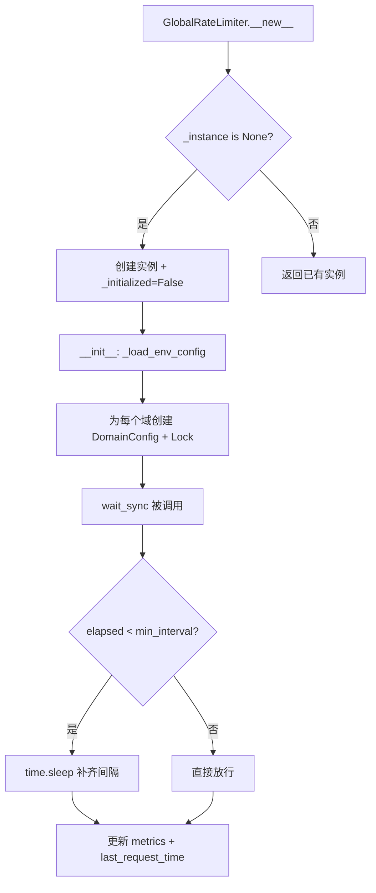
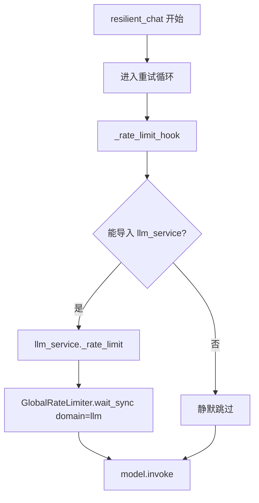

# PD-261.01 vibe-blog — GlobalRateLimiter 多域令牌桶限流与查询去重

> 文档编号：PD-261.01
> 来源：vibe-blog `backend/utils/rate_limiter.py` `backend/utils/resilient_llm_caller.py` `backend/utils/query_deduplicator.py`
> GitHub：https://github.com/datawhalechina/vibe-blog.git
> 问题域：PD-261 限流与速率控制 Rate Limiting & Throttle
> 状态：可复用方案

---

## 第 1 章 问题与动机

### 1.1 核心问题

在多 Agent 并行搜索 + LLM 调用的博客生成系统中，不同外部 API（LLM、Serper Google 搜索、搜狗搜索、arXiv）有各自的速率限制。如果不加控制：

1. **429 风暴**：并行线程同时发起请求，瞬间触发 API 速率限制，导致大量 429 错误和指数退避重试，整体延迟反而更高
2. **域间干扰**：LLM 调用的限流不应影响搜索 API 的吞吐，反之亦然。统一限流会造成不必要的等待
3. **重复查询浪费**：多轮搜索中同一查询可能被重复发送，浪费 API 配额和时间
4. **成本不可见**：限流等待时间是隐性成本，不聚合指标就无法优化

### 1.2 vibe-blog 的解法概述

vibe-blog 构建了三层限流体系：

1. **GlobalRateLimiter 单例**（`backend/utils/rate_limiter.py:41`）：按 domain 分组的最小间隔限流器，支持同步/异步双模式，通过环境变量配置每个域的 `min_interval`
2. **_rate_limit_hook 自动注入**（`backend/utils/resilient_llm_caller.py:268`）：在 `resilient_chat()` 的每次 LLM 调用前自动调用限流钩子，无需调用方感知
3. **QueryDeduplicator 查询去重**（`backend/utils/query_deduplicator.py:16`）：按 Agent 隔离的 LRU 缓存 + 连续回滚上限保护，在搜索入口拦截重复查询
4. **CostTracker 指标聚合**（`backend/utils/cost_tracker.py:73`）：从 GlobalRateLimiter 拉取等待指标，纳入成本摘要

### 1.3 设计思想

| 设计原则 | 具体实现 | 理由 | 替代方案 |
|----------|----------|------|----------|
| 域隔离 | 每个 API 域独立 `DomainConfig` + 独立 `threading.Lock` | 不同 API 速率限制差异大（arXiv 3s vs 搜狗 0.5s），统一限流浪费吞吐 | 全局单一限流器 |
| 透明注入 | `_rate_limit_hook()` 在 `resilient_chat` 内部自动调用 | 调用方无需关心限流逻辑，降低耦合 | 要求每个调用方手动调用 `wait_sync()` |
| 同步/异步双模式 | `wait_sync()` 用 `threading.Lock`，`wait_async()` 用 `asyncio.Lock` | 项目同时有同步线程池和异步上下文 | 只支持一种模式 |
| 环境变量驱动 | `_load_env_config()` 从环境变量读取每个域的间隔 | 不同部署环境 API 配额不同，无需改代码 | 硬编码间隔值 |
| 查询级去重 | `QueryDeduplicator` 按 Agent 隔离 + LRU 淘汰 | 多轮搜索中同一查询不应重复发送 | 全局去重（跨 Agent 误判） |

---

## 第 2 章 源码实现分析

### 2.1 架构概览

```
┌─────────────────────────────────────────────────────────────┐
│                    LLMService.chat()                         │
│                 llm_service.py:352                            │
└──────────────┬──────────────────────────────────────────────┘
               │ 调用
               ▼
┌─────────────────────────────────────────────────────────────┐
│              resilient_chat()                                 │
│           resilient_llm_caller.py:147                         │
│  ┌─────────────────────────────────────────────────────┐    │
│  │  _rate_limit_hook()  ← 每次 invoke 前自动调用        │    │
│  │       ↓                                              │    │
│  │  llm_service._rate_limit()                           │    │
│  │       ↓                                              │    │
│  │  GlobalRateLimiter.wait_sync(domain='llm')           │    │
│  └─────────────────────────────────────────────────────┘    │
└─────────────────────────────────────────────────────────────┘

┌─────────────────────────────────────────────────────────────┐
│           SmartSearchService.search()                        │
│        smart_search_service.py:186                           │
│  ┌──────────────────────┐  ┌──────────────────────────┐    │
│  │ QueryDeduplicator    │  │ ThreadPoolExecutor       │    │
│  │  .is_duplicate()     │  │  _search_arxiv()         │    │
│  │  .record()           │  │    → wait_sync('arxiv')  │    │
│  │  .rollback()         │  │  _search_google()        │    │
│  └──────────────────────┘  │    → wait_sync('serper') │    │
│                            │  _search_sogou()         │    │
│                            │    → wait_sync('sogou')  │    │
│                            │  _search_general()       │    │
│                            │    → wait_sync('general')│    │
│                            └──────────────────────────┘    │
└─────────────────────────────────────────────────────────────┘

┌─────────────────────────────────────────────────────────────┐
│           GlobalRateLimiter (单例)                            │
│         rate_limiter.py:41                                    │
│  ┌──────────┐ ┌──────────┐ ┌──────────┐ ┌──────────┐      │
│  │ llm      │ │ serper   │ │ sogou    │ │ arxiv    │      │
│  │ 1.0s     │ │ 1.0s     │ │ 0.5s     │ │ 3.0s     │      │
│  │ Lock+Met │ │ Lock+Met │ │ Lock+Met │ │ Lock+Met │      │
│  └──────────┘ └──────────┘ └──────────┘ └──────────┘      │
└─────────────────────────────────────────────────────────────┘
```

### 2.2 核心实现

#### 2.2.1 GlobalRateLimiter 单例与域隔离



对应源码 `backend/utils/rate_limiter.py:41-102`：

```python
class GlobalRateLimiter:
    _instance: ClassVar[Optional['GlobalRateLimiter']] = None
    _sync_lock: ClassVar[threading.Lock] = threading.Lock()

    def __new__(cls):
        with cls._sync_lock:
            if cls._instance is None:
                cls._instance = super().__new__(cls)
                cls._instance._initialized = False
            return cls._instance

    def __init__(self):
        if self._initialized:
            return
        self._domains: Dict[str, DomainConfig] = {}
        self._domain_locks: Dict[str, threading.Lock] = {}
        self._async_locks: Dict[str, asyncio.Lock] = {}
        self._initialized = True
        self._load_env_config()

    def wait_sync(self, domain: str = 'llm'):
        config = self._domains.get(domain)
        if not config or config.min_interval <= 0:
            return
        lock = self._domain_locks[domain]
        with lock:
            now = time.monotonic()
            elapsed = now - config.last_request_time
            if elapsed < config.min_interval:
                sleep_time = config.min_interval - elapsed
                time.sleep(sleep_time)
                config.metrics.total_waits += 1
                config.metrics.total_wait_seconds += sleep_time
                config.metrics.last_wait_time = sleep_time
            config.last_request_time = time.monotonic()
```

关键设计点：
- **线程安全单例**：`_sync_lock` 保护 `__new__`，`_initialized` 标志防止重复初始化（`rate_limiter.py:48-56`）
- **per-domain Lock**：每个域有独立的 `threading.Lock`，域间互不阻塞（`rate_limiter.py:83`）
- **monotonic 时钟**：使用 `time.monotonic()` 而非 `time.time()`，避免系统时钟调整导致的计算错误（`rate_limiter.py:94`）
- **指标内嵌**：每次等待自动累加 `RateLimitMetrics`，无需额外埋点（`rate_limiter.py:99-101`）

#### 2.2.2 _rate_limit_hook 透明注入



对应源码 `backend/utils/resilient_llm_caller.py:267-274` 和 `backend/utils/resilient_llm_caller.py:178`：

```python
# resilient_llm_caller.py:267-274
def _rate_limit_hook():
    """调用全局限流器"""
    try:
        from services.llm_service import _rate_limit
        _rate_limit()
    except ImportError:
        pass

# resilient_llm_caller.py:178 (在 resilient_chat 内部)
with timeout_guard(timeout):
    _rate_limit_hook()          # ← 每次调用前自动限流
    response = current_model.invoke(messages)
```

设计亮点：
- **延迟导入 + ImportError 静默**：`_rate_limit_hook` 通过 `try/except ImportError` 实现松耦合，即使 `llm_service` 不存在也不影响 `resilient_chat` 正常工作（`resilient_llm_caller.py:271-273`）
- **双路径覆盖**：主线程路径（`signal.SIGALRM`）和非主线程路径（`ThreadPoolExecutor`）都在 `invoke` 前调用 hook（`resilient_llm_caller.py:178,182`）

### 2.3 实现细节

#### 搜索域限流的分散注入

与 LLM 限流的集中 hook 不同，搜索域限流分散在各搜索方法入口处手动调用：

- `smart_search_service.py:444-445`：`_search_arxiv` → `wait_sync(domain='search_arxiv')`
- `smart_search_service.py:497`：`_search_google` → `wait_sync(domain='search_serper')`
- `smart_search_service.py:506`：`_search_sogou` → `wait_sync(domain='search_sogou')`
- `smart_search_service.py:477`：`_search_general` → `wait_sync(domain='search_general')`
- `retriever_registry.py:144-145`：`SerperRetriever.search` → `wait_sync(domain='search_serper')`
- `retriever_registry.py:167-168`：`SogouRetriever.search` → `wait_sync(domain='search_sogou')`

#### QueryDeduplicator 的 Agent 隔离与回滚保护

`QueryDeduplicator`（`query_deduplicator.py:16`）不仅做查询去重，还提供连续回滚上限保护：

- **Agent 隔离**：每个 Agent 有独立的 `OrderedDict` 缓存，避免跨 Agent 误判（`query_deduplicator.py:29`）
- **LRU 淘汰**：缓存超过 `max_cache_per_agent`（默认 1000）时淘汰最旧条目（`query_deduplicator.py:58-59`）
- **回滚熔断**：连续回滚超过 `max_consecutive_rollbacks`（默认 5）时拒绝回滚，防止无限循环（`query_deduplicator.py:69-73`）
- **成功重置**：正常执行成功后重置回滚计数（`query_deduplicator.py:80-86`）

#### CostTracker 的限流指标聚合

`CostTracker.get_summary()`（`cost_tracker.py:73-88`）在生成成本报告时，主动从 `GlobalRateLimiter` 拉取所有域的等待指标：

```python
# cost_tracker.py:75-78
rate_limiter_metrics = {}
try:
    from utils.rate_limiter import get_global_rate_limiter
    rate_limiter_metrics = get_global_rate_limiter().get_metrics()
except Exception:
    pass
```

这使得限流等待时间成为成本报告的一部分，运维可以据此调整各域的 `min_interval`。


---

## 第 3 章 迁移指南

### 3.1 迁移清单

**Phase 1：核心限流器（1 个文件）**
- [ ] 复制 `GlobalRateLimiter` 类 + `RateLimitMetrics` + `DomainConfig` 数据类
- [ ] 根据项目实际 API 修改 `_load_env_config()` 中的域列表和默认间隔
- [ ] 添加对应环境变量（`XXX_RATE_LIMIT_INTERVAL`）

**Phase 2：LLM 调用注入（改造已有 LLM 调用层）**
- [ ] 在 LLM 调用函数中添加 `_rate_limit_hook()` 或直接调用 `wait_sync(domain='llm')`
- [ ] 如果有 `resilient_chat` 类似的重试包装器，在 `invoke` 前注入

**Phase 3：搜索域限流（改造搜索服务）**
- [ ] 在每个搜索方法入口添加 `wait_sync(domain='search_xxx')`
- [ ] 为每个搜索 API 配置合理的 `min_interval`

**Phase 4：查询去重（可选）**
- [ ] 复制 `QueryDeduplicator` 类
- [ ] 在搜索入口调用 `is_duplicate()` + `record()`
- [ ] 配置 `max_consecutive_rollbacks` 防止无限循环

**Phase 5：指标聚合（可选）**
- [ ] 在成本/监控模块中调用 `get_global_rate_limiter().get_metrics()` 获取等待统计

### 3.2 适配代码模板

#### 最小可用限流器

```python
"""rate_limiter.py — 可直接复用的多域限流器"""
import asyncio
import os
import threading
import time
from dataclasses import dataclass, field
from typing import ClassVar, Dict, Optional


@dataclass
class RateLimitMetrics:
    total_waits: int = 0
    total_wait_seconds: float = 0.0
    last_wait_time: float = 0.0


@dataclass
class DomainConfig:
    min_interval: float = 1.0
    last_request_time: float = 0.0
    metrics: RateLimitMetrics = field(default_factory=RateLimitMetrics)


class GlobalRateLimiter:
    _instance: ClassVar[Optional['GlobalRateLimiter']] = None
    _sync_lock: ClassVar[threading.Lock] = threading.Lock()

    def __new__(cls):
        with cls._sync_lock:
            if cls._instance is None:
                cls._instance = super().__new__(cls)
                cls._instance._initialized = False
            return cls._instance

    def __init__(self):
        if self._initialized:
            return
        self._domains: Dict[str, DomainConfig] = {}
        self._domain_locks: Dict[str, threading.Lock] = {}
        self._initialized = True
        # 按需修改域列表和默认间隔
        self._configure_defaults()

    def _configure_defaults(self):
        """根据项目实际 API 配置域"""
        defaults = {
            'llm': float(os.environ.get('LLM_RATE_LIMIT_INTERVAL', '1.0')),
            # 添加你的 API 域...
        }
        for domain, interval in defaults.items():
            self.configure(domain, interval)

    def configure(self, domain: str, min_interval: float):
        if domain not in self._domains:
            self._domains[domain] = DomainConfig(min_interval=min_interval)
            self._domain_locks[domain] = threading.Lock()
        else:
            self._domains[domain].min_interval = min_interval

    def wait_sync(self, domain: str = 'llm'):
        config = self._domains.get(domain)
        if not config or config.min_interval <= 0:
            return
        with self._domain_locks[domain]:
            now = time.monotonic()
            elapsed = now - config.last_request_time
            if elapsed < config.min_interval:
                sleep_time = config.min_interval - elapsed
                time.sleep(sleep_time)
                config.metrics.total_waits += 1
                config.metrics.total_wait_seconds += sleep_time
            config.last_request_time = time.monotonic()

    def get_metrics(self, domain: str = None) -> Dict:
        if domain:
            cfg = self._domains.get(domain)
            return {'min_interval': cfg.min_interval, **cfg.metrics.__dict__} if cfg else {}
        return {d: {'min_interval': c.min_interval, **c.metrics.__dict__}
                for d, c in self._domains.items()}


_limiter: Optional[GlobalRateLimiter] = None

def get_rate_limiter() -> GlobalRateLimiter:
    global _limiter
    if _limiter is None:
        _limiter = GlobalRateLimiter()
    return _limiter
```

#### LLM 调用注入示例

```python
def call_llm(model, messages):
    """在 LLM 调用前自动限流"""
    get_rate_limiter().wait_sync(domain='llm')
    return model.invoke(messages)
```

### 3.3 适用场景

| 场景 | 适用度 | 说明 |
|------|--------|------|
| 多 API 并行调用系统 | ⭐⭐⭐ | 核心场景：不同 API 有不同速率限制 |
| 单一 LLM API 调用 | ⭐⭐ | 可简化为单域，但仍有价值（防 429） |
| 高并发微服务 | ⭐ | 需改为分布式限流（Redis 令牌桶），单进程方案不适用 |
| 批量数据处理 | ⭐⭐⭐ | 批量调用外部 API 时防止触发速率限制 |
| 实时流式应用 | ⭐⭐ | `wait_sync` 会阻塞，需评估延迟影响 |

---

## 第 4 章 测试用例

```python
"""test_rate_limiter.py — 基于 vibe-blog 真实接口的测试"""
import asyncio
import threading
import time
import pytest


class TestGlobalRateLimiter:
    """测试 GlobalRateLimiter 核心功能"""

    def setup_method(self):
        from utils.rate_limiter import GlobalRateLimiter
        GlobalRateLimiter._reset_singleton()
        self.limiter = GlobalRateLimiter()

    def test_singleton_pattern(self):
        """单例模式：多次实例化返回同一对象"""
        from utils.rate_limiter import GlobalRateLimiter
        a = GlobalRateLimiter()
        b = GlobalRateLimiter()
        assert a is b

    def test_domain_isolation(self):
        """域隔离：不同域的限流互不影响"""
        self.limiter.configure('fast', 0.1)
        self.limiter.configure('slow', 1.0)

        start = time.monotonic()
        self.limiter.wait_sync('fast')
        self.limiter.wait_sync('fast')  # 应等待 ~0.1s
        fast_elapsed = time.monotonic() - start

        start = time.monotonic()
        self.limiter.wait_sync('slow')
        self.limiter.wait_sync('slow')  # 应等待 ~1.0s
        slow_elapsed = time.monotonic() - start

        assert fast_elapsed < 0.3  # fast 域等待短
        assert slow_elapsed >= 0.9  # slow 域等待长

    def test_metrics_accumulation(self):
        """指标聚合：等待次数和时间正确累加"""
        self.limiter.configure('test', 0.05)
        self.limiter.wait_sync('test')
        self.limiter.wait_sync('test')
        self.limiter.wait_sync('test')

        metrics = self.limiter.get_metrics('test')
        assert metrics['total_waits'] >= 2
        assert metrics['total_wait_seconds'] > 0

    def test_no_wait_when_interval_elapsed(self):
        """间隔已过时不等待"""
        self.limiter.configure('nodelay', 0.01)
        self.limiter.wait_sync('nodelay')
        time.sleep(0.02)  # 等待超过 min_interval

        start = time.monotonic()
        self.limiter.wait_sync('nodelay')
        elapsed = time.monotonic() - start
        assert elapsed < 0.01  # 不应等待

    def test_reset(self):
        """重置后指标清零"""
        self.limiter.configure('reset_test', 0.05)
        self.limiter.wait_sync('reset_test')
        self.limiter.wait_sync('reset_test')
        self.limiter.reset('reset_test')

        metrics = self.limiter.get_metrics('reset_test')
        assert metrics['total_waits'] == 0
        assert metrics['total_wait_seconds'] == 0.0


class TestQueryDeduplicator:
    """测试 QueryDeduplicator 查询去重"""

    def setup_method(self):
        from utils.query_deduplicator import QueryDeduplicator
        self.dedup = QueryDeduplicator(max_consecutive_rollbacks=3, max_cache_per_agent=5)

    def test_duplicate_detection(self):
        """重复查询检测"""
        self.dedup.record("hello world", agent="a")
        assert self.dedup.is_duplicate("hello world", agent="a") is True
        assert self.dedup.is_duplicate("hello world", agent="b") is False  # Agent 隔离

    def test_case_insensitive(self):
        """大小写不敏感"""
        self.dedup.record("Hello World", agent="a")
        assert self.dedup.is_duplicate("hello world", agent="a") is True

    def test_lru_eviction(self):
        """LRU 淘汰：超过 max_cache 时淘汰最旧条目"""
        for i in range(6):  # max_cache=5，第 6 个会淘汰第 1 个
            self.dedup.record(f"query_{i}", agent="a")
        assert self.dedup.is_duplicate("query_0", agent="a") is False  # 已被淘汰
        assert self.dedup.is_duplicate("query_5", agent="a") is True   # 仍在缓存

    def test_rollback_limit(self):
        """连续回滚上限保护"""
        for _ in range(3):
            assert self.dedup.rollback() is True
        assert self.dedup.rollback() is False  # 达到上限

    def test_rollback_reset_on_success(self):
        """成功执行后重置回滚计数"""
        self.dedup.rollback()
        self.dedup.rollback()
        self.dedup.reset_rollback_count()
        # 重置后可以继续回滚
        for _ in range(3):
            assert self.dedup.rollback() is True


class TestRateLimitHook:
    """测试 _rate_limit_hook 注入机制"""

    def test_hook_calls_global_limiter(self, monkeypatch):
        """hook 正确委托给 GlobalRateLimiter"""
        called = []
        import utils.rate_limiter as rl_mod
        orig = rl_mod.GlobalRateLimiter._reset_singleton
        rl_mod.GlobalRateLimiter._reset_singleton()
        limiter = rl_mod.get_global_rate_limiter()
        original_wait = limiter.wait_sync
        def mock_wait(domain='llm'):
            called.append(domain)
        monkeypatch.setattr(limiter, 'wait_sync', mock_wait)

        from services.llm_service import _rate_limit
        _rate_limit()
        assert 'llm' in called
```


---

## 第 5 章 跨域关联

| 关联域 | 关系类型 | 说明 |
|--------|----------|------|
| PD-03 容错与重试 | 协同 | `resilient_chat` 的 429 指数退避是限流的下游防线；限流减少 429 发生频率，退避处理漏网之鱼 |
| PD-08 搜索与检索 | 依赖 | 搜索服务的每个搜索方法入口依赖 `GlobalRateLimiter.wait_sync()` 控制请求速率 |
| PD-11 可观测性 | 协同 | `CostTracker.get_summary()` 聚合限流指标，使等待时间成为成本报告的一部分 |
| PD-02 多 Agent 编排 | 协同 | 多 Agent 并行搜索时，域隔离限流确保不同搜索源互不干扰 |
| PD-04 工具系统 | 协同 | `RetrieverRegistry` 中的检索器适配器在 `search()` 入口调用限流 |

---

## 第 6 章 来源文件索引

| 文件 | 行范围 | 关键实现 |
|------|--------|----------|
| `backend/utils/rate_limiter.py` | L1-L171 | GlobalRateLimiter 单例、DomainConfig、RateLimitMetrics、wait_sync/wait_async |
| `backend/utils/resilient_llm_caller.py` | L147-L274 | resilient_chat 重试循环、_rate_limit_hook 透明注入 |
| `backend/utils/query_deduplicator.py` | L1-L103 | QueryDeduplicator、Agent 隔离 LRU 缓存、回滚上限保护 |
| `backend/services/llm_service.py` | L50-L61 | _rate_limit() 桥接函数，委托给 GlobalRateLimiter |
| `backend/services/llm_service.py` | L292 | _chat_with_thinking 中的 _rate_limit() 调用 |
| `backend/services/llm_service.py` | L565 | chat_stream 中的 _rate_limit() 调用 |
| `backend/services/blog_generator/services/smart_search_service.py` | L186-L214 | QueryDeduplicator 在搜索入口的去重逻辑 |
| `backend/services/blog_generator/services/smart_search_service.py` | L442-L512 | 各搜索方法中的 wait_sync 域限流调用 |
| `backend/services/blog_generator/retriever_registry.py` | L136-L178 | SerperRetriever/SogouRetriever 中的域限流调用 |
| `backend/utils/cost_tracker.py` | L73-L88 | CostTracker.get_summary() 聚合限流指标 |

---

## 第 7 章 横向对比维度

```json comparison_data
{
  "project": "vibe-blog",
  "dimensions": {
    "限流算法": "最小间隔（min_interval）时间窗口，非令牌桶",
    "域隔离": "5 域独立配置（llm/serper/sogou/general/arxiv），per-domain Lock",
    "注入方式": "LLM 层透明 hook + 搜索层手动调用双模式",
    "同步异步": "threading.Lock 同步 + asyncio.Lock 异步双模式",
    "查询去重": "Agent 隔离 LRU 缓存 + 连续回滚上限熔断",
    "指标暴露": "RateLimitMetrics 内嵌 + CostTracker 聚合输出",
    "配置方式": "环境变量驱动，运行时可 configure() 动态调整"
  }
}
```

### 域元数据补充

```json domain_metadata
{
  "solution_summary": "vibe-blog 用 GlobalRateLimiter 单例实现 5 域独立最小间隔限流，配合 _rate_limit_hook 在 resilient_chat 中透明注入 LLM 限流，QueryDeduplicator 提供 Agent 隔离 LRU 去重与回滚熔断",
  "description": "限流不仅防 429，更是成本可观测性的数据源",
  "sub_problems": [
    "同步/异步双模式限流适配",
    "限流指标与成本追踪的聚合联动",
    "连续回滚上限熔断保护"
  ],
  "best_practices": [
    "用 time.monotonic 替代 time.time 避免时钟漂移",
    "限流 hook 用延迟导入+静默 ImportError 实现松耦合",
    "将限流等待指标纳入成本报告实现可观测闭环"
  ]
}
```

