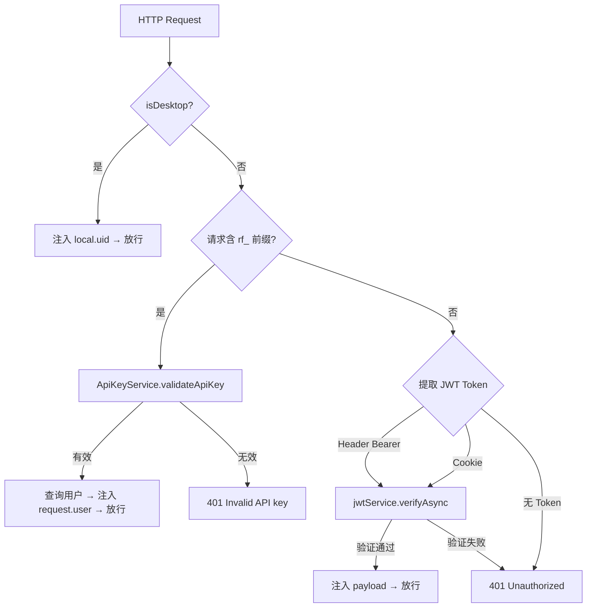
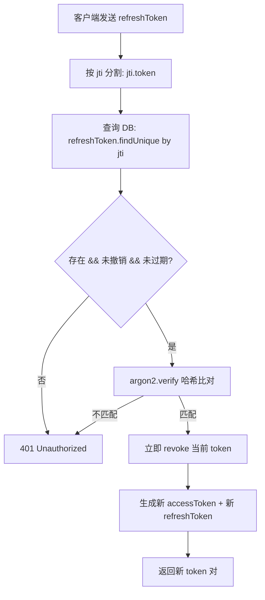
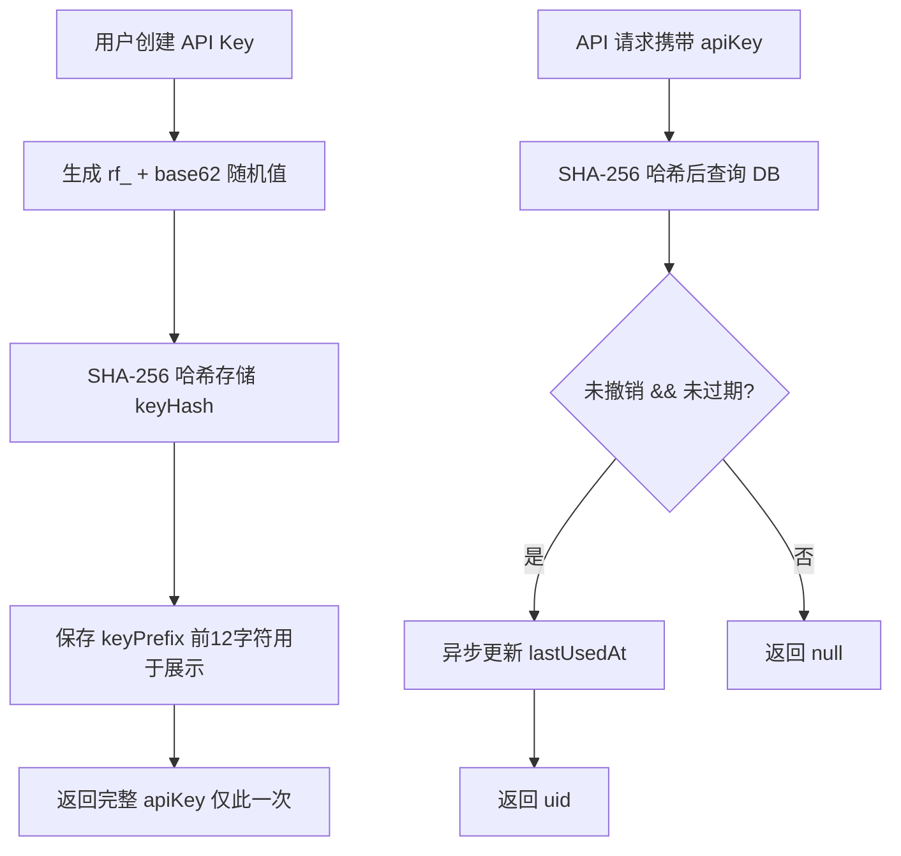

# PD-262.01 Refly — 多策略认证与设备授权体系

> 文档编号：PD-262.01
> 来源：Refly `apps/api/src/modules/auth/`
> GitHub：https://github.com/refly-ai/refly.git
> 问题域：PD-262 认证授权 Auth & Authorization
> 状态：可复用方案

---

## 第 1 章 问题与动机

### 1.1 核心问题

现代 AI 应用需要同时服务 Web 端、CLI 端和 API 调用三种场景，每种场景的认证需求截然不同：

- **Web 端**：需要 OAuth 社交登录 + 邮箱密码登录，Cookie 传递令牌
- **CLI 端**：无浏览器环境，需要 Device Authorization Flow 或本地回调服务器
- **API 调用**：需要长期有效的 API Key，支持程序化访问

传统单一认证方案无法覆盖这三种场景。Refly 构建了一套 NestJS Guard 分层鉴权体系，在单个 `JwtAuthGuard` 中统一处理 JWT、API Key、桌面模式三种认证路径，同时通过 Passport Strategy 模式支持 4 种 OAuth 提供商。

### 1.2 Refly 的解法概述

1. **三层令牌体系**：JWT Access Token（短期）+ Refresh Token（长期，argon2 哈希存储）+ API Key（SHA-256 哈希存储），每层有独立的安全策略（`auth.service.ts:92-134`）
2. **统一 Guard 多路分发**：`JwtAuthGuard` 按优先级依次尝试桌面模式 → API Key → JWT，一个 Guard 覆盖所有场景（`jwt-auth.guard.ts:30-73`）
3. **Device Authorization Flow**：CLI 通过 4 态状态机（pending → authorized/cancelled/expired）实现无浏览器登录，令牌一次性交付后立即清除（`device-auth.service.ts:46-300`）
4. **OAuth State 加密防 CSRF**：CLI OAuth 流程使用 AES-256-CBC 加密 state 参数，内含 port + timestamp + nonce，10 分钟过期（`auth.service.ts:190-258`）
5. **AES-256-GCM 通用加密服务**：独立的 `EncryptionService` 处理敏感数据加密，IV + AuthTag + 密文拼接存储（`encryption.service.ts:40-112`）

### 1.3 设计思想

| 设计原则 | 具体实现 | 理由 | 替代方案 |
|----------|----------|------|----------|
| 单 Guard 多策略 | `JwtAuthGuard` 内部按优先级分发 Desktop/ApiKey/JWT | 避免多 Guard 组合的复杂性，路由只需一个装饰器 | 多 Guard 链式组合（NestJS 原生方式） |
| Refresh Token 一次性使用 | 刷新后立即 revoke 旧 token，生成新 token 对 | 防止 token 重放攻击 | 滑动窗口过期（安全性较低） |
| API Key 前缀识别 | `rf_` 前缀 + SHA-256 哈希存储 | Guard 可快速区分 API Key 和 JWT，无需尝试解析 | 统一 Bearer token 格式（需额外查询判断） |
| OAuth 账户合并 | 同 email 自动关联已有用户，scope 增量合并 | 用户可能先邮箱注册再 OAuth 登录 | 强制新建账户（用户体验差） |
| 设备授权令牌一次性交付 | CLI 轮询获取 token 后立即从 DB 清除 | 防止令牌在数据库中长期暴露 | 保留令牌直到过期（安全风险） |

---

## 第 2 章 源码实现分析

### 2.1 架构概览

Refly 的认证系统基于 NestJS + Passport + Prisma 构建，核心架构如下：

```
┌─────────────────────────────────────────────────────────────┐
│                      AuthModule (@Global)                    │
│                                                              │
│  ┌──────────────┐  ┌──────────────┐  ┌───────────────────┐  │
│  │  AuthService  │  │ ApiKeyService│  │ DeviceAuthService │  │
│  │  (JWT+OAuth)  │  │  (API Key)   │  │  (CLI Device)     │  │
│  └──────┬───────┘  └──────┬───────┘  └────────┬──────────┘  │
│         │                  │                    │             │
│  ┌──────┴──────────────────┴────────────────────┴──────────┐ │
│  │                    JwtAuthGuard                          │ │
│  │  Desktop? → API Key (rf_*)? → JWT (Bearer) → Cookie     │ │
│  └─────────────────────────────────────────────────────────┘ │
│                                                              │
│  ┌─────────────────── Passport Strategies ─────────────────┐ │
│  │ GoogleOauth │ GithubOauth │ TwitterOauth │ NotionOauth  │ │
│  │ GoogleTool  │             │              │              │ │
│  └─────────────────────────────────────────────────────────┘ │
│                                                              │
│  ┌──────────────┐  ┌──────────────┐                         │
│  │TurnstileServ │  │EncryptionServ│  (common module)        │
│  └──────────────┘  └──────────────┘                         │
└─────────────────────────────────────────────────────────────┘
```

### 2.2 核心实现

#### 2.2.1 JwtAuthGuard 多路分发



对应源码 `apps/api/src/modules/auth/guard/jwt-auth.guard.ts:30-73`：

```typescript
async canActivate(context: ExecutionContext): Promise<boolean> {
  const request: Request = context.switchToHttp().getRequest();

  // 桌面模式：直接注入本地 uid，跳过所有认证
  if (isDesktop()) {
    request.user = { uid: this.configService.get('local.uid') };
    return true;
  }

  // 优先尝试 API Key（rf_ 前缀快速识别）
  const apiKey = this.extractApiKeyFromRequest(request);
  if (apiKey) {
    const uid = await this.apiKeyService.validateApiKey(apiKey);
    if (uid) {
      const user = await this.prismaService.user.findUnique({ where: { uid } });
      if (user) {
        request.user = { uid: user.uid, email: user.email, name: user.name };
        return true;
      }
    }
    throw new UnauthorizedException('Invalid API key');
  }

  // 最后尝试 JWT（Header Bearer 或 Cookie）
  const token = this.extractTokenFromRequest(request);
  if (!token) { throw new UnauthorizedException(); }
  const payload = await this.jwtService.verifyAsync(token, {
    secret: this.configService.get('auth.jwt.secret'),
  });
  request.user = payload;
  return true;
}
```

API Key 提取支持两种方式（`jwt-auth.guard.ts:80-97`）：
- `X-API-Key: rf_xxx` 自定义头
- `Authorization: Bearer rf_xxx` 标准 Bearer 头（通过 `rf_` 前缀区分 JWT）

#### 2.2.2 Refresh Token 一次性轮转



对应源码 `apps/api/src/modules/auth/auth.service.ts:118-175`：

```typescript
// 生成 Refresh Token：jti（索引）+ token（验证）双段结构
private async generateRefreshToken(uid: string): Promise<string> {
  const jti = randomBytes(32).toString('hex');
  const token = randomBytes(64).toString('hex');
  const hashedToken = await argon2.hash(token);

  await this.prisma.refreshToken.create({
    data: {
      jti, uid, hashedToken,
      expiresAt: new Date(Date.now() + ms(this.configService.get('auth.jwt.refreshExpiresIn'))),
    },
  });
  return `${jti}.${token}`;  // jti 用于快速查找，token 用于 argon2 验证
}

// 刷新：验证后立即撤销，生成全新 token 对
async refreshAccessToken(refreshToken: string) {
  const [jti, token] = refreshToken.split('.');
  const storedToken = await this.prisma.refreshToken.findUnique({ where: { jti } });

  if (!storedToken || storedToken.revoked || storedToken.expiresAt < new Date()) {
    throw new UnauthorizedException();
  }
  const isValid = await argon2.verify(storedToken.hashedToken, token);
  if (!isValid) { throw new UnauthorizedException(); }

  // 一次性使用：立即撤销
  await this.prisma.refreshToken.update({
    where: { jti }, data: { revoked: true },
  });
  const user = await this.prisma.user.findUnique({ where: { uid: storedToken.uid } });
  return this.login(user);  // 生成全新 token 对
}
```

关键设计：Refresh Token 采用 `jti.token` 双段格式。`jti` 是数据库主键用于 O(1) 查找，`token` 是 argon2 哈希验证的原始值。这避免了全表扫描哈希比对。

#### 2.2.3 API Key 生命周期



对应源码 `apps/api/src/modules/auth/api-key.service.ts:36-72, 201-264`：

```typescript
// 生成：rf_ 前缀 + 24字节 base62 编码
private generateApiKey(): string {
  const randomBytes = crypto.randomBytes(24);
  const base62 = this.toBase62(randomBytes);
  return `rf_${base62}`;
}

// 存储：SHA-256 哈希（快速查找，不可逆）
private hashApiKey(apiKey: string): string {
  return crypto.createHash('sha256').update(apiKey).digest('hex');
}

// 验证：哈希后精确匹配 + 撤销/过期检查
private async findValidApiKeyRecord(apiKey: string) {
  if (!apiKey || !apiKey.startsWith('rf_')) { return null; }
  const keyHash = this.hashApiKey(apiKey);
  return this.prisma.userApiKey.findFirst({
    where: {
      keyHash, revokedAt: null,
      OR: [{ expiresAt: null }, { expiresAt: { gt: new Date() } }],
    },
  });
}
```

### 2.3 实现细节

#### Device Authorization Flow（CLI 无浏览器登录）

Refly 实现了完整的 RFC 8628 Device Authorization Grant 变体，4 态状态机管理设备会话：

```
pending ──→ authorized（用户在 Web 端确认）
   │──→ cancelled（用户在 Web 端取消）
   │──→ expired（10 分钟超时）
```

核心流程（`device-auth.service.ts:46-300`）：
1. CLI 调用 `POST /v1/auth/cli/device/init` 获取 `deviceId` + 6 位 `userCode`
2. CLI 展示 userCode，引导用户在浏览器打开授权页面
3. 用户在 Web 端输入 userCode 并点击授权
4. CLI 轮询 `GET /v1/auth/cli/device/status`，获取 token 后 DB 立即清除令牌

安全设计：令牌在 `pollDeviceStatus` 中一次性交付后立即从数据库清除（`device-auth.service.ts:287-294`），防止令牌在数据库中长期暴露。

#### OAuth Scope 增量合并

当用户重复 OAuth 登录时，新 scope 与已有 scope 合并而非覆盖（`auth.service.ts:406-413`）：

```typescript
const existingScopes = account.scope ? safeParseJSON(account.scope) : [];
const mergedScopes = [...new Set([...existingScopes, ...scopes])];
```

这支持了 Tool OAuth 场景：用户先用基础 scope 登录，后续工具需要额外权限时增量授权。

#### Cloudflare Turnstile 人机验证

`TurnstileService`（`turnstile.service.ts:10-50`）集成 Cloudflare Turnstile 作为注册/登录的人机验证层，通过配置开关控制启用状态，未配置时优雅降级为放行。


---

## 第 3 章 迁移指南

### 3.1 迁移清单

**阶段 1：基础 JWT 认证（1-2 天）**
- [ ] 安装依赖：`@nestjs/jwt`, `@nestjs/passport`, `argon2`, `passport`
- [ ] 创建 `AuthModule`，注册 `JwtModule.registerAsync` 全局模块
- [ ] 实现 `AuthService.login()` 生成 JWT Access Token
- [ ] 实现 `generateRefreshToken()` + `refreshAccessToken()` 双令牌轮转
- [ ] 创建 Prisma `RefreshToken` 模型（jti, uid, hashedToken, expiresAt, revoked）
- [ ] 实现 `JwtAuthGuard` 基础版（仅 JWT 验证）

**阶段 2：API Key 系统（1 天）**
- [ ] 创建 `ApiKeyService`，实现 `rf_` 前缀 + SHA-256 哈希存储
- [ ] 创建 Prisma `UserApiKey` 模型（keyId, keyHash, keyPrefix, uid, revokedAt, expiresAt）
- [ ] 在 `JwtAuthGuard` 中添加 API Key 优先检测分支
- [ ] 实现 CRUD 端点：create / list / revoke / update

**阶段 3：OAuth 集成（按需）**
- [ ] 安装 Passport 策略包：`passport-google-oauth20`, `passport-github2` 等
- [ ] 为每个 OAuth 提供商创建 Strategy + Guard
- [ ] 实现 `oauthValidate()` 统一 OAuth 处理逻辑（账户合并 + scope 合并）
- [ ] 配置 OAuth redirect URL 白名单

**阶段 4：CLI Device Auth（可选）**
- [ ] 创建 `DeviceAuthService`，实现 4 态状态机
- [ ] 创建 Prisma `CliDeviceSession` 模型
- [ ] 实现 CLI 端点：init / authorize / cancel / poll

### 3.2 适配代码模板

#### 最小可用的 JwtAuthGuard（支持 JWT + API Key 双路）

```typescript
import { Injectable, CanActivate, ExecutionContext, UnauthorizedException } from '@nestjs/common';
import { JwtService } from '@nestjs/jwt';
import { ConfigService } from '@nestjs/config';
import { Request } from 'express';

@Injectable()
export class JwtAuthGuard implements CanActivate {
  constructor(
    private jwtService: JwtService,
    private configService: ConfigService,
    private apiKeyService: ApiKeyService,  // 你的 API Key 服务
    private prisma: PrismaService,
  ) {}

  async canActivate(context: ExecutionContext): Promise<boolean> {
    const request: Request = context.switchToHttp().getRequest();

    // 1. API Key 优先（通过前缀快速识别）
    const apiKey = this.extractApiKey(request);
    if (apiKey) {
      const uid = await this.apiKeyService.validateApiKey(apiKey);
      if (!uid) throw new UnauthorizedException('Invalid API key');
      const user = await this.prisma.user.findUnique({ where: { uid } });
      if (!user) throw new UnauthorizedException();
      request.user = { uid: user.uid, email: user.email };
      return true;
    }

    // 2. JWT 验证（Header 或 Cookie）
    const token = this.extractJwt(request);
    if (!token) throw new UnauthorizedException();
    try {
      request.user = await this.jwtService.verifyAsync(token, {
        secret: this.configService.get('auth.jwt.secret'),
      });
      return true;
    } catch {
      throw new UnauthorizedException();
    }
  }

  private extractApiKey(req: Request): string | undefined {
    const header = req.headers['x-api-key'];
    if (typeof header === 'string' && header.startsWith('rf_')) return header;
    const auth = req.headers.authorization;
    if (auth) {
      const [type, token] = auth.split(' ');
      if (type === 'Bearer' && token?.startsWith('rf_')) return token;
    }
    return undefined;
  }

  private extractJwt(req: Request): string | undefined {
    const auth = req.headers.authorization;
    if (auth) {
      const [type, token] = auth.split(' ');
      if (type === 'Bearer' && !token?.startsWith('rf_')) return token;
    }
    return req.cookies?.['access_token'];
  }
}
```

#### Refresh Token 双段格式生成模板

```typescript
import { randomBytes } from 'node:crypto';
import argon2 from 'argon2';

async function generateRefreshToken(uid: string, prisma: PrismaService): Promise<string> {
  const jti = randomBytes(32).toString('hex');   // DB 索引键
  const token = randomBytes(64).toString('hex'); // 验证用原始值
  const hashedToken = await argon2.hash(token);

  await prisma.refreshToken.create({
    data: { jti, uid, hashedToken, expiresAt: new Date(Date.now() + 7 * 24 * 3600 * 1000) },
  });

  return `${jti}.${token}`;  // 客户端持有完整值
}

async function refreshAccessToken(refreshToken: string, prisma: PrismaService) {
  const [jti, token] = refreshToken.split('.');
  const stored = await prisma.refreshToken.findUnique({ where: { jti } });
  if (!stored || stored.revoked || stored.expiresAt < new Date()) throw new Error('Invalid');

  if (!(await argon2.verify(stored.hashedToken, token))) throw new Error('Invalid');

  // 一次性使用：立即撤销
  await prisma.refreshToken.update({ where: { jti }, data: { revoked: true } });

  // 生成新 token 对
  const user = await prisma.user.findUnique({ where: { uid: stored.uid } });
  return login(user);  // 返回新 accessToken + 新 refreshToken
}
```

### 3.3 适用场景

| 场景 | 适用度 | 说明 |
|------|--------|------|
| SaaS 产品（Web + API） | ⭐⭐⭐ | JWT + API Key 双路是标配 |
| 有 CLI 工具的产品 | ⭐⭐⭐ | Device Auth Flow 完美适配无浏览器场景 |
| 多 OAuth 提供商集成 | ⭐⭐⭐ | Passport Strategy 模式可无限扩展 |
| 纯内部 API 服务 | ⭐⭐ | API Key 即可，JWT 可简化 |
| 微服务间认证 | ⭐ | 建议用 mTLS 或服务网格，非本方案目标 |

---

## 第 4 章 测试用例

```typescript
import { Test, TestingModule } from '@nestjs/testing';
import { JwtService } from '@nestjs/jwt';
import { ConfigService } from '@nestjs/config';
import * as crypto from 'node:crypto';
import argon2 from 'argon2';

describe('AuthService', () => {
  // --- Refresh Token 双段格式 ---
  describe('generateRefreshToken', () => {
    it('should generate jti.token format', async () => {
      const token = 'abc123.def456';
      const [jti, raw] = token.split('.');
      expect(jti).toBe('abc123');
      expect(raw).toBe('def456');
    });

    it('should hash token with argon2 and verify correctly', async () => {
      const raw = crypto.randomBytes(64).toString('hex');
      const hashed = await argon2.hash(raw);
      expect(await argon2.verify(hashed, raw)).toBe(true);
      expect(await argon2.verify(hashed, 'wrong')).toBe(false);
    });
  });

  // --- Refresh Token 一次性使用 ---
  describe('refreshAccessToken', () => {
    it('should reject revoked token', async () => {
      const storedToken = { jti: 'abc', revoked: true, expiresAt: new Date(Date.now() + 10000) };
      expect(storedToken.revoked).toBe(true);
      // 实际实现中会抛出 UnauthorizedException
    });

    it('should reject expired token', async () => {
      const storedToken = { jti: 'abc', revoked: false, expiresAt: new Date(Date.now() - 10000) };
      expect(storedToken.expiresAt < new Date()).toBe(true);
    });
  });

  // --- API Key ---
  describe('ApiKeyService', () => {
    it('should generate key with rf_ prefix', () => {
      const key = `rf_${crypto.randomBytes(24).toString('hex').slice(0, 32)}`;
      expect(key.startsWith('rf_')).toBe(true);
      expect(key.length).toBeGreaterThan(10);
    });

    it('should hash key with SHA-256 for storage', () => {
      const key = 'rf_testkey123';
      const hash = crypto.createHash('sha256').update(key).digest('hex');
      expect(hash).toHaveLength(64);
      // 相同输入产生相同哈希
      const hash2 = crypto.createHash('sha256').update(key).digest('hex');
      expect(hash).toBe(hash2);
    });

    it('should reject key without rf_ prefix', () => {
      const key = 'invalid_key';
      expect(key.startsWith('rf_')).toBe(false);
    });
  });

  // --- JwtAuthGuard 多路分发 ---
  describe('JwtAuthGuard', () => {
    it('should extract API key from X-API-Key header', () => {
      const headers = { 'x-api-key': 'rf_abc123' };
      const apiKey = headers['x-api-key'];
      expect(apiKey).toBe('rf_abc123');
      expect(apiKey.startsWith('rf_')).toBe(true);
    });

    it('should extract API key from Bearer header with rf_ prefix', () => {
      const auth = 'Bearer rf_abc123';
      const [type, token] = auth.split(' ');
      expect(type).toBe('Bearer');
      expect(token.startsWith('rf_')).toBe(true);
    });

    it('should extract JWT from Bearer header without rf_ prefix', () => {
      const auth = 'Bearer eyJhbGciOiJIUzI1NiJ9.xxx';
      const [type, token] = auth.split(' ');
      expect(type).toBe('Bearer');
      expect(token.startsWith('rf_')).toBe(false);
    });
  });

  // --- AES-256-GCM 加密服务 ---
  describe('EncryptionService', () => {
    it('should encrypt and decrypt correctly', () => {
      const algorithm = 'aes-256-gcm';
      const key = crypto.scryptSync('test-key', 'salt', 32);
      const iv = crypto.randomBytes(16);

      const cipher = crypto.createCipheriv(algorithm, key, iv);
      const encrypted = Buffer.concat([cipher.update('hello', 'utf8'), cipher.final()]);
      const authTag = cipher.getAuthTag();

      const decipher = crypto.createDecipheriv(algorithm, key, iv);
      decipher.setAuthTag(authTag);
      const decrypted = Buffer.concat([decipher.update(encrypted), decipher.final()]);
      expect(decrypted.toString('utf8')).toBe('hello');
    });

    it('should return null for null/undefined input', () => {
      expect(null).toBeNull();
      expect(undefined).toBeUndefined();
    });
  });

  // --- Device Auth 状态机 ---
  describe('DeviceAuthService', () => {
    it('should transition from pending to authorized', () => {
      const states: Record<string, string[]> = {
        pending: ['authorized', 'cancelled', 'expired'],
        authorized: [],
        cancelled: [],
        expired: [],
      };
      expect(states['pending']).toContain('authorized');
      expect(states['authorized']).toHaveLength(0); // 终态
    });

    it('should generate 6-digit user code', () => {
      const code = Math.floor(100000 + Math.random() * 900000).toString();
      expect(code).toHaveLength(6);
      expect(Number(code)).toBeGreaterThanOrEqual(100000);
      expect(Number(code)).toBeLessThan(1000000);
    });
  });
});
```


---

## 第 5 章 跨域关联

| 关联域 | 关系类型 | 说明 |
|--------|----------|------|
| PD-06 记忆持久化 | 协同 | Refresh Token 和 API Key 的持久化存储依赖数据库层设计，与记忆持久化共享 Prisma 基础设施 |
| PD-11 可观测性 | 协同 | `logEvent(user, 'login_success', provider)` 在认证关键路径埋点，为可观测性提供认证事件流 |
| PD-09 Human-in-the-Loop | 协同 | Device Auth Flow 本质是 HITL 模式：CLI 发起请求，等待人类在 Web 端确认授权 |
| PD-04 工具系统 | 依赖 | Tool OAuth（`toolOAuthValidate`）为工具系统提供第三方 API 访问凭证，工具需要额外 OAuth scope 时触发增量授权 |
| PD-10 中间件管道 | 协同 | `JwtAuthGuard` 作为 NestJS Guard 是请求管道的第一层中间件，决定后续中间件是否执行 |

---

## 第 6 章 来源文件索引

| 文件 | 行范围 | 关键实现 |
|------|--------|----------|
| `apps/api/src/modules/auth/auth.service.ts` | L44-L988 | 核心认证服务：JWT 签发、Refresh Token 轮转、OAuth 验证、邮箱登录、OAuth State 加密 |
| `apps/api/src/modules/auth/guard/jwt-auth.guard.ts` | L19-L117 | 统一 Guard：Desktop → API Key → JWT 三路分发 |
| `apps/api/src/modules/auth/api-key.service.ts` | L25-L265 | API Key 全生命周期：生成（rf_ + base62）、SHA-256 哈希存储、验证、撤销 |
| `apps/api/src/modules/auth/device-auth.service.ts` | L25-L321 | Device Authorization Flow：4 态状态机、6 位 userCode、令牌一次性交付 |
| `apps/api/src/modules/auth/auth-cli.controller.ts` | L36-L744 | CLI 认证端点：OAuth init/callback、API Key CRUD、Device Auth 端点 |
| `apps/api/src/modules/common/encryption.service.ts` | L10-L113 | AES-256-GCM 加密服务：IV + AuthTag + 密文拼接、开发环境降级密钥 |
| `apps/api/src/modules/auth/strategy/google-oauth.strategy.ts` | L10-L48 | Google OAuth Passport Strategy：scope 提取、state 中 uid 解析 |
| `apps/api/src/modules/auth/guard/optional-jwt-auth.guard.ts` | L9-L69 | 可选认证 Guard：无 token 时 user=null 但放行 |
| `apps/api/src/modules/auth/auth.module.ts` | L23-L59 | 模块注册：5 个 Strategy + 4 个 Service，@Global 全局导出 |
| `apps/api/src/modules/auth/turnstile.service.ts` | L5-L51 | Cloudflare Turnstile 人机验证集成 |
| `apps/api/src/modules/auth/auth.dto.ts` | L1-L19 | TokenData 接口定义、Account PO→DTO 转换 |

---

## 第 7 章 横向对比维度

```json comparison_data
{
  "project": "Refly",
  "dimensions": {
    "认证策略": "JWT + Refresh Token + API Key + 4 OAuth + Device Auth 六路并行",
    "令牌存储": "Refresh Token argon2 哈希 + API Key SHA-256 哈希，双哈希策略",
    "Guard 架构": "单 JwtAuthGuard 内部按 rf_ 前缀多路分发",
    "OAuth 集成": "Passport Strategy 模式，5 策略含 Google Tool OAuth 增量授权",
    "CLI 认证": "Device Authorization Flow 4 态状态机 + 令牌一次性交付",
    "加密服务": "AES-256-GCM 独立 EncryptionService + AES-256-CBC OAuth State 加密",
    "人机验证": "Cloudflare Turnstile 集成，配置开关优雅降级"
  }
}
```

### 域元数据补充

```json domain_metadata
{
  "solution_summary": "Refly 用 NestJS Guard 单入口多路分发实现 JWT/API Key/Device Auth 六策略认证，Refresh Token 采用 jti.token 双段格式 + argon2 一次性轮转",
  "description": "CLI 和桌面端的无浏览器认证流程设计",
  "sub_problems": [
    "Device Authorization Flow 状态机设计",
    "CLI OAuth 本地回调服务器与 State 加密防 CSRF",
    "Tool OAuth 增量 scope 授权",
    "Cloudflare Turnstile 人机验证集成"
  ],
  "best_practices": [
    "Refresh Token 用 jti.token 双段格式避免全表哈希扫描",
    "API Key 用 rf_ 前缀让 Guard 零成本区分 JWT 和 API Key",
    "Device Auth 令牌一次性交付后立即从 DB 清除"
  ]
}
```
