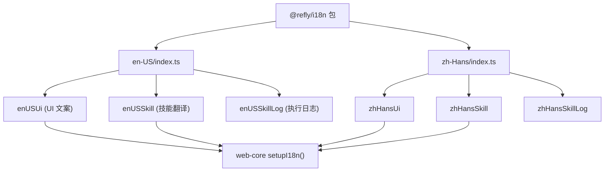
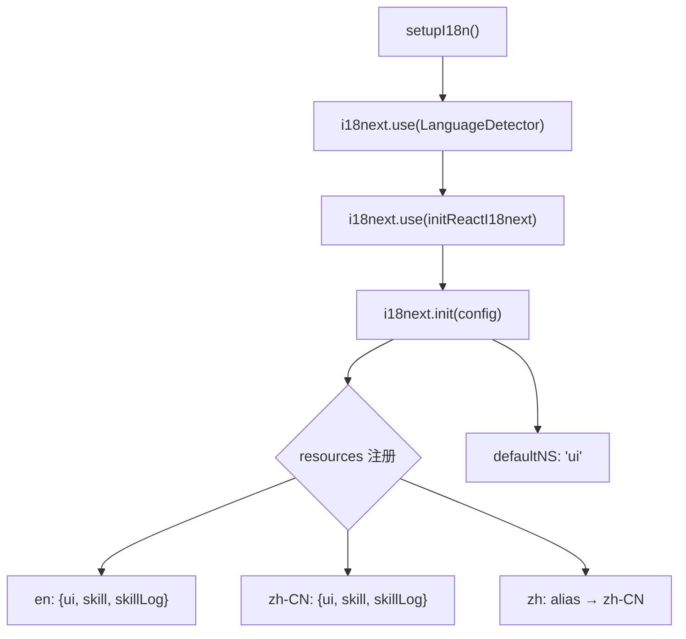
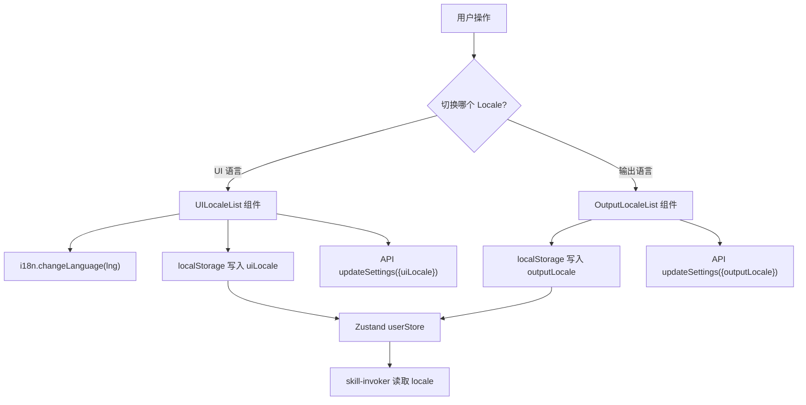
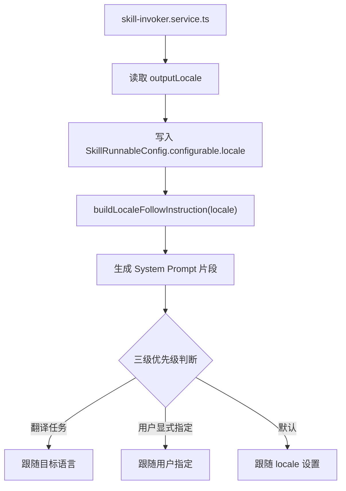

# PD-263.01 Refly — 独立 i18n 包与双层 Locale 分离架构

> 文档编号：PD-263.01
> 来源：Refly `packages/i18n/`, `packages/web-core/src/effect/i18n.ts`, `packages/skill-template/src/scheduler/module/common/locale-follow.ts`
> GitHub：https://github.com/refly-ai/refly.git
> 问题域：PD-263 国际化 Internationalization
> 状态：可复用方案

---

## 第 1 章 问题与动机

### 1.1 核心问题

AI 产品的国际化面临双重挑战：不仅需要传统的 UI 文案翻译（按钮、标签、提示语），还需要控制 LLM 输出的语言。用户可能希望界面显示中文，但让 AI 用英文回答问题——这两个维度的语言偏好是独立的。

传统 i18n 方案（如 react-i18next）只解决了 UI 层的翻译问题，无法覆盖 AI 输出语言的控制。Refly 作为一个 AI 知识工作台，需要同时处理：
- 前端 UI 的中英文切换
- Skill（AI 技能）执行步骤的日志翻译
- LLM 输出语言跟随用户偏好
- 20 种输出语言的选择

### 1.2 Refly 的解法概述

1. **独立 `@refly/i18n` 包**：翻译资源从业务代码中完全剥离，作为 monorepo 中的独立包发布，通过 `exports` 字段按语言暴露子路径（`packages/i18n/package.json:7-18`）
2. **三命名空间拆分**：翻译文件按功能域拆分为 `ui`（界面文案）、`skill`（技能名称/描述/步骤）、`skillLog`（技能执行日志），而非按页面拆分（`packages/web-core/src/effect/i18n.ts:15-19`）
3. **双层 Locale 分离**：`uiLocale`（界面语言，zh-CN/en 二选一）与 `outputLocale`（AI 输出语言，支持 20 种语言 + auto）完全独立存储和传递（`packages/stores/src/stores/user.ts:9-10`）
4. **Prompt 注入式 LLM 语言控制**：通过 `buildLocaleFollowInstruction` 将 locale 编译为 System Prompt 指令，注入 LLM 调用链，实现三级优先级语言跟随（`packages/skill-template/src/scheduler/module/common/locale-follow.ts:1-14`）
5. **浏览器语言自动检测 + 服务端持久化**：前端通过 `i18next-browser-languagedetector` 自动检测，登录用户的偏好通过 API 同步到服务端（`packages/ai-workspace-common/src/components/ui-locale-list/index.tsx:46-48`）

### 1.3 设计思想

| 设计原则 | 具体实现 | 理由 | 替代方案 |
|----------|----------|------|----------|
| 翻译资源独立包 | `@refly/i18n` 作为 monorepo 独立包 | 多个消费方（web-core、skill-template）共享同一份翻译 | 每个包内嵌翻译文件（重复维护） |
| 按功能域拆分命名空间 | ui / skill / skillLog 三个 namespace | AI 产品的翻译不只是 UI，技能名称和执行日志也需要翻译 | 按页面拆分（AI 技能跨页面使用，难以归属） |
| 双层 Locale 分离 | uiLocale（界面）+ outputLocale（AI 输出） | 用户可能要中文界面但英文 AI 输出 | 单一 locale 控制所有（无法满足 AI 场景） |
| Prompt 注入式语言控制 | buildLocaleFollowInstruction 生成 System Prompt 片段 | LLM 不受 i18n 框架控制，只能通过 Prompt 指导 | 后处理翻译 AI 输出（延迟高、成本翻倍） |
| 三级优先级语言跟随 | 翻译任务 > 用户显式指定 > locale 设置 | 翻译场景下目标语言必须覆盖 locale | 固定跟随 locale（翻译任务会输出错误语言） |

---

## 第 2 章 源码实现分析

### 2.1 架构概览

Refly 的 i18n 架构分为三层：翻译资源层、前端运行时层、后端 Skill 执行层。

```
┌─────────────────────────────────────────────────────────────┐
│                    @refly/i18n 包                            │
│  ┌──────────┐  ┌──────────┐  ┌──────────┐                  │
│  │  en-US/   │  │ zh-Hans/ │  │  (扩展)   │                  │
│  │  ui.ts    │  │  ui.ts   │  │          │                  │
│  │  skill.ts │  │  skill.ts│  │          │                  │
│  │ skillLog  │  │ skillLog │  │          │                  │
│  └────┬─────┘  └────┬─────┘  └──────────┘                  │
│       │              │                                       │
│       └──────┬───────┘                                       │
│              │ exports: ./en-US, ./zh-Hans                   │
└──────────────┼───────────────────────────────────────────────┘
               │
    ┌──────────┴──────────┐
    │                     │
    ▼                     ▼
┌─────────────┐   ┌──────────────────┐
│  web-core   │   │  skill-template  │
│  i18next +  │   │  locale-follow   │
│  React i18n │   │  Prompt 注入     │
│  3 namespace│   │  SkillRunnableConfig │
└──────┬──────┘   └────────┬─────────┘
       │                   │
       ▼                   ▼
┌─────────────┐   ┌──────────────────┐
│  前端 UI    │   │  LLM 输出语言    │
│  uiLocale   │   │  outputLocale    │
│  (zh-CN/en) │   │  (20 种语言)     │
└─────────────┘   └──────────────────┘
```

### 2.2 核心实现

#### 2.2.1 翻译资源包结构



对应源码 `packages/i18n/package.json:1-19`：
```json
{
  "name": "@refly/i18n",
  "version": "0.8.0",
  "description": "Refly product translations",
  "exports": {
    "./en-US": {
      "import": "./src/en-US/index.ts",
      "require": "./src/en-US/index.ts",
      "types": "./src/en-US/index.ts"
    },
    "./zh-Hans": {
      "import": "./src/zh-Hans/index.ts",
      "require": "./src/zh-Hans/index.ts",
      "types": "./src/zh-Hans/index.ts"
    }
  }
}
```

每个语言目录通过 barrel export 暴露三个命名空间（`packages/i18n/src/en-US/index.ts:1-3`）：
```typescript
export { default as enUSUi } from './ui';
export { default as enUSSkill } from './skill';
export { default as enUSSkillLog } from './skill-log';
```

#### 2.2.2 前端 i18n 初始化与三命名空间注册



对应源码 `packages/web-core/src/effect/i18n.ts:1-33`：
```typescript
import i18next from 'i18next';
import { initReactI18next } from 'react-i18next';
import LanguageDetector from 'i18next-browser-languagedetector';
import { enUSUi, enUSSkill, enUSSkillLog } from '@refly/i18n/en-US';
import { zhHansUi, zhHansSkill, zhHansSkillLog } from '@refly/i18n/zh-Hans';

export const setupI18n = () => {
  return i18next
    .use(LanguageDetector)
    .use(initReactI18next)
    .init({
      debug: process.env.NODE_ENV === 'development',
      defaultNS: 'ui',
      resources: {
        en: {
          ui: enUSUi,
          skill: enUSSkill,
          skillLog: enUSSkillLog,
        },
        'zh-CN': {
          ui: zhHansUi,
          skill: zhHansSkill,
          skillLog: zhHansSkillLog,
        },
        zh: {
          ui: zhHansUi,
          skill: zhHansSkill,
          skillLog: zhHansSkillLog,
        },
      },
    });
};
```

关键设计：`zh` 作为 `zh-CN` 的别名注册，确保 `navigator.language` 返回 `zh` 时也能正确匹配。`defaultNS: 'ui'` 使得组件中 `t('common.confirm')` 默认从 ui 命名空间查找。

#### 2.2.3 双层 Locale 存储与切换



对应源码 `packages/ai-workspace-common/src/components/ui-locale-list/index.tsx:29-58`：
```typescript
const changeLang = async (lng: LOCALE) => {
  const { localSettings, userProfile } = useUserStore.getState();

  // Always change i18n language
  if (i18n.isInitialized) {
    i18n.changeLanguage(lng);
  }

  // Only update local storage and states if not on landing page or user is logged in
  if (!isLandingPage || userStore.isLogin) {
    userStore.setLocalSettings({ ...localSettings, uiLocale: lng });
    userStore.setUserProfile({ ...userProfile, uiLocale: lng });
    localStorage.setItem(
      'refly-local-settings',
      safeStringifyJSON({ ...localSettings, uiLocale: lng }),
    );

    if (userStore.isLogin) {
      const { data: res, error } = await getClient().updateSettings({
        body: { uiLocale: lng, outputLocale: localSettings.outputLocale },
      });
    }
  }
  props.onChange?.(lng);
};
```

#### 2.2.4 LLM 输出语言 Prompt 注入



对应源码 `packages/skill-template/src/scheduler/module/common/locale-follow.ts:1-14`：
```typescript
export const buildLocaleFollowInstruction = (locale: string) => {
  return `
  ## Important: Response's Language/Locale Rules
Follow these response's language rules in order of priority:
1. If this is a translation task, follow the target language requirement regardless of locale
2. If the user explicitly specifies an output language in their query, use that language
3. Otherwise, generate all content in ${locale} while preserving technical terms

### Examples:
- When translating "你好" to English, output in English even if locale is "zh-CN"
- If user asks "explain in Spanish", output in Spanish regardless of locale
- In normal cases, follow the locale setting (${locale})
`;
};
```

服务端 Skill 调用时，locale 从用户设置流入 `SkillRunnableConfig`（`apps/api/src/modules/skill/skill-invoker.service.ts:327-338`）：
```typescript
const outputLocale = data?.locale || userPo?.outputLocale;

const config: SkillRunnableConfig = {
  configurable: {
    user,
    context,
    locale: outputLocale,
    uiLocale: userPo.uiLocale,
    // ...
  },
};
```

### 2.3 实现细节

**翻译键的层级结构设计**：Skill 翻译文件采用 `skillName.steps.stepName.{name,description}` 的嵌套结构，每个 Skill 的步骤都有独立的翻译键。例如 `skill:agent.steps.analyzeQuery.name` 对应"查询分析"。这种结构使得新增 Skill 只需在翻译文件中添加一个顶层键，不影响其他 Skill 的翻译。

**20 种输出语言的双向映射**：`packages/common-types/src/i18n.ts:60-105` 维护了 `languageNameToLocale` 和 `localeToLanguageName` 两个双向映射表，每个映射表都有 `en` 和 `zh-CN` 两个版本，确保语言选择器在不同 UI 语言下都能正确显示语言名称。

**浏览器语言归一化**：`packages/ai-workspace-common/src/utils/locale.ts:3-9` 中的 `mapDefaultLocale` 将所有 `zh` 开头的浏览器语言统一映射为 `zh-CN`，其余归为 `en`，避免 `zh-TW`、`zh-HK` 等变体导致的匹配失败。

**Zustand 状态初始化**：`packages/stores/src/stores/user.ts:42-54` 中 `getDefaultLocale()` 在应用启动时从 `navigator.language` 推断默认 UI 语言，`outputLocale` 则直接使用 `navigator.language` 原始值（保留完整的 locale code 如 `zh-TW`）。


---

## 第 3 章 迁移指南

### 3.1 迁移清单

**阶段 1：翻译资源包搭建**
- [ ] 创建独立 i18n 包，按语言目录组织翻译文件
- [ ] 按功能域拆分命名空间（ui / skill / skillLog 或自定义）
- [ ] 配置 `package.json` 的 `exports` 字段，按语言暴露子路径
- [ ] 编写 barrel export（每个语言目录的 `index.ts`）

**阶段 2：前端 i18n 运行时集成**
- [ ] 安装 `i18next` + `react-i18next` + `i18next-browser-languagedetector`
- [ ] 编写 `setupI18n()` 初始化函数，注册所有语言和命名空间
- [ ] 为常见浏览器语言变体添加别名（如 `zh` → `zh-CN`）
- [ ] 在 Zustand/Redux 中定义 `LocalSettings` 类型，包含 `uiLocale` 和 `outputLocale`

**阶段 3：双层 Locale 切换 UI**
- [ ] 实现 UI 语言切换组件（调用 `i18n.changeLanguage` + 持久化到 localStorage）
- [ ] 实现输出语言选择组件（独立于 UI 语言，支持更多语言选项）
- [ ] 登录用户的语言偏好通过 API 同步到服务端

**阶段 4：LLM 输出语言控制**
- [ ] 实现 `buildLocaleFollowInstruction(locale)` 函数
- [ ] 在 Skill 调用链中将 `outputLocale` 注入 `configurable.locale`
- [ ] 将 locale 指令拼接到 System Prompt 中

### 3.2 适配代码模板

#### 独立 i18n 包结构

```
packages/i18n/
├── package.json
├── src/
│   ├── en/
│   │   ├── index.ts      # barrel export
│   │   ├── ui.ts          # UI 文案
│   │   └── skill.ts       # AI 技能翻译
│   └── zh-CN/
│       ├── index.ts
│       ├── ui.ts
│       └── skill.ts
```

```json
// package.json
{
  "name": "@myapp/i18n",
  "exports": {
    "./en": { "import": "./src/en/index.ts" },
    "./zh-CN": { "import": "./src/zh-CN/index.ts" }
  }
}
```

#### 前端初始化模板

```typescript
// effect/i18n.ts
import i18next from 'i18next';
import { initReactI18next } from 'react-i18next';
import LanguageDetector from 'i18next-browser-languagedetector';
import { enUi, enSkill } from '@myapp/i18n/en';
import { zhCNUi, zhCNSkill } from '@myapp/i18n/zh-CN';

export const setupI18n = () =>
  i18next
    .use(LanguageDetector)
    .use(initReactI18next)
    .init({
      defaultNS: 'ui',
      fallbackLng: 'en',
      resources: {
        en: { ui: enUi, skill: enSkill },
        'zh-CN': { ui: zhCNUi, skill: zhCNSkill },
        zh: { ui: zhCNUi, skill: zhCNSkill }, // 别名
      },
    });
```

#### 双层 Locale 状态管理模板

```typescript
// stores/locale.ts
import { create } from 'zustand';

interface LocaleState {
  uiLocale: 'en' | 'zh-CN';
  outputLocale: string; // 支持 20+ 种语言
  setUiLocale: (locale: 'en' | 'zh-CN') => void;
  setOutputLocale: (locale: string) => void;
}

export const useLocaleStore = create<LocaleState>((set) => ({
  uiLocale: navigator.language.startsWith('zh') ? 'zh-CN' : 'en',
  outputLocale: 'auto',
  setUiLocale: (locale) => set({ uiLocale: locale }),
  setOutputLocale: (locale) => set({ outputLocale: locale }),
}));
```

#### LLM 语言跟随 Prompt 模板

```typescript
// prompts/locale-follow.ts
export const buildLocaleFollowInstruction = (locale: string) => `
## Response Language Rules
Follow these rules in priority order:
1. Translation tasks: use the target language regardless of locale
2. User explicitly specifies output language: follow user instruction
3. Default: generate all content in ${locale}, preserve technical terms
`;
```

### 3.3 适用场景

| 场景 | 适用度 | 说明 |
|------|--------|------|
| AI 产品（LLM + UI 双语言需求） | ⭐⭐⭐ | 核心场景，双层 Locale 分离是关键差异化 |
| Monorepo 多包共享翻译 | ⭐⭐⭐ | 独立 i18n 包 + exports 子路径是最佳实践 |
| 纯前端 SaaS 产品 | ⭐⭐ | 可简化为单层 Locale，但包结构仍有参考价值 |
| 移动端 App | ⭐ | 需要替换 i18next-browser-languagedetector |

---

## 第 4 章 测试用例

```typescript
import { describe, it, expect, vi, beforeEach } from 'vitest';

// 测试 buildLocaleFollowInstruction
describe('buildLocaleFollowInstruction', () => {
  const buildLocaleFollowInstruction = (locale: string) => {
    return `
  ## Important: Response's Language/Locale Rules
Follow these response's language rules in order of priority:
1. If this is a translation task, follow the target language requirement regardless of locale
2. If the user explicitly specifies an output language in their query, use that language
3. Otherwise, generate all content in ${locale} while preserving technical terms
`;
  };

  it('should inject locale into prompt template', () => {
    const result = buildLocaleFollowInstruction('zh-CN');
    expect(result).toContain('generate all content in zh-CN');
  });

  it('should include three priority rules', () => {
    const result = buildLocaleFollowInstruction('en');
    expect(result).toContain('translation task');
    expect(result).toContain('explicitly specifies');
    expect(result).toContain('generate all content in en');
  });

  it('should handle non-standard locale codes', () => {
    const result = buildLocaleFollowInstruction('ja');
    expect(result).toContain('generate all content in ja');
  });
});

// 测试 mapDefaultLocale
describe('mapDefaultLocale', () => {
  const mapDefaultLocale = (locale: string) => {
    if (locale?.toLocaleLowerCase()?.startsWith('zh')) return 'zh-CN';
    return 'en';
  };

  it('should map zh variants to zh-CN', () => {
    expect(mapDefaultLocale('zh')).toBe('zh-CN');
    expect(mapDefaultLocale('zh-TW')).toBe('zh-CN');
    expect(mapDefaultLocale('zh-HK')).toBe('zh-CN');
    expect(mapDefaultLocale('zh-Hans')).toBe('zh-CN');
  });

  it('should map non-zh locales to en', () => {
    expect(mapDefaultLocale('en')).toBe('en');
    expect(mapDefaultLocale('en-US')).toBe('en');
    expect(mapDefaultLocale('ja')).toBe('en');
    expect(mapDefaultLocale('fr')).toBe('en');
  });

  it('should handle edge cases', () => {
    expect(mapDefaultLocale('')).toBe('en');
    expect(mapDefaultLocale('ZH-CN')).toBe('zh-CN'); // 大写
  });
});

// 测试 setupI18n 命名空间注册
describe('setupI18n namespace registration', () => {
  it('should register three namespaces per language', () => {
    const resources = {
      en: { ui: {}, skill: {}, skillLog: {} },
      'zh-CN': { ui: {}, skill: {}, skillLog: {} },
      zh: { ui: {}, skill: {}, skillLog: {} },
    };

    expect(Object.keys(resources.en)).toEqual(['ui', 'skill', 'skillLog']);
    expect(Object.keys(resources['zh-CN'])).toEqual(['ui', 'skill', 'skillLog']);
  });

  it('should have zh as alias for zh-CN', () => {
    const zhHansUi = { language: '简体中文' };
    const resources = {
      'zh-CN': { ui: zhHansUi },
      zh: { ui: zhHansUi },
    };

    expect(resources.zh.ui).toBe(resources['zh-CN'].ui); // 同一引用
  });
});

// 测试双层 Locale 独立性
describe('dual locale independence', () => {
  it('should allow different uiLocale and outputLocale', () => {
    const settings = {
      uiLocale: 'zh-CN' as const,
      outputLocale: 'en',
      isLocaleInitialized: true,
    };

    expect(settings.uiLocale).toBe('zh-CN');
    expect(settings.outputLocale).toBe('en');
    expect(settings.uiLocale).not.toBe(settings.outputLocale);
  });

  it('should support auto as outputLocale', () => {
    const settings = { uiLocale: 'en' as const, outputLocale: 'auto' };
    expect(settings.outputLocale).toBe('auto');
  });
});
```


---

## 第 5 章 跨域关联

| 关联域 | 关系类型 | 说明 |
|--------|----------|------|
| PD-04 工具系统 | 协同 | Skill 翻译（skill namespace）为工具系统提供多语言名称和描述，SkillRunnableConfig 同时传递 locale 和工具配置 |
| PD-06 记忆持久化 | 协同 | 用户语言偏好通过 API 持久化到服务端 UserSettings，登录后自动恢复 |
| PD-10 中间件管道 | 协同 | buildLocaleFollowInstruction 作为 Prompt 管道的一个模块，与其他 System Prompt 模块组合注入 |
| PD-11 可观测性 | 协同 | skill-invoker 将 locale 和 uiLocale 写入 metadata，用于追踪不同语言用户的使用模式 |

---

## 第 6 章 来源文件索引

| 文件 | 行范围 | 关键实现 |
|------|--------|----------|
| `packages/i18n/package.json` | L1-19 | i18n 包定义，exports 子路径配置 |
| `packages/i18n/src/en-US/index.ts` | L1-3 | 英文 barrel export（ui/skill/skillLog） |
| `packages/i18n/src/zh-Hans/index.ts` | L1-3 | 中文 barrel export |
| `packages/i18n/src/en-US/skill.ts` | L1-284 | 技能翻译（agent/commonQnA/webSearch 等 12 个技能） |
| `packages/i18n/src/en-US/skill-log.ts` | L1-225 | 技能执行日志翻译（含 {{duration}} 插值） |
| `packages/web-core/src/effect/i18n.ts` | L1-33 | i18next 初始化，三命名空间注册，zh 别名 |
| `packages/common-types/src/i18n.ts` | L1-162 | LOCALE 枚举、20 种语言双向映射表、OutputLocale 类型 |
| `packages/stores/src/stores/user.ts` | L1-80 | Zustand 用户状态，LocalSettings 含 uiLocale/outputLocale |
| `packages/ai-workspace-common/src/utils/locale.ts` | L1-15 | mapDefaultLocale 归一化、getLocale 从 localStorage 读取 |
| `packages/ai-workspace-common/src/utils/i18n.ts` | L1-107 | 前端侧语言映射表（含 auto 选项） |
| `packages/ai-workspace-common/src/components/ui-locale-list/index.tsx` | L1-92 | UI 语言切换组件，i18n.changeLanguage + API 同步 |
| `packages/ai-workspace-common/src/components/output-locale-list/index.tsx` | L1-83 | 输出语言选择组件，20 种语言下拉 |
| `packages/ai-workspace-common/src/components/settings/language-setting/index.tsx` | L1-65 | 设置页语言面板，uiLocale + outputLocale 双栏 |
| `packages/skill-template/src/scheduler/module/common/locale-follow.ts` | L1-14 | buildLocaleFollowInstruction，三级优先级 Prompt 模板 |
| `packages/skill-template/src/base.ts` | L304-339 | SkillRunnableConfig 类型定义，含 locale/uiLocale 字段 |
| `apps/api/src/modules/skill/skill-invoker.service.ts` | L327-381 | 服务端 locale 注入，outputLocale 写入 config 和 metadata |

---

## 第 7 章 横向对比维度

> **重要：** 本章用于自动填充 Butcher Wiki 的横向对比表。

```json comparison_data
{
  "project": "Refly",
  "dimensions": {
    "翻译架构": "独立 @refly/i18n 包 + exports 子路径按语言暴露",
    "命名空间策略": "三命名空间 ui/skill/skillLog 按功能域拆分",
    "Locale 分层": "双层分离：uiLocale（界面 2 种）+ outputLocale（AI 输出 20 种）",
    "LLM 语言控制": "Prompt 注入式，buildLocaleFollowInstruction 三级优先级",
    "语言检测": "i18next-browser-languagedetector + navigator.language 归一化",
    "持久化方式": "localStorage + 服务端 API 双写，登录用户自动同步"
  }
}
```

### 域元数据补充

```json domain_metadata
{
  "solution_summary": "Refly 通过独立 @refly/i18n 包 + 双层 Locale 分离（uiLocale/outputLocale）+ buildLocaleFollowInstruction 三级优先级 Prompt 注入，实现 UI 翻译与 LLM 输出语言的独立控制",
  "description": "AI 产品需要同时控制 UI 界面语言和 LLM 输出语言，两者偏好可能不同",
  "sub_problems": [
    "UI 语言与 AI 输出语言的独立控制",
    "浏览器语言变体归一化（zh-TW/zh-HK → zh-CN）",
    "Skill 执行日志的多语言翻译与插值"
  ],
  "best_practices": [
    "独立 i18n 包通过 exports 子路径按语言暴露，支持 monorepo 多消费方",
    "LLM 输出语言通过 Prompt 注入而非后处理翻译控制",
    "为常见浏览器语言变体注册别名避免匹配失败"
  ]
}
```

