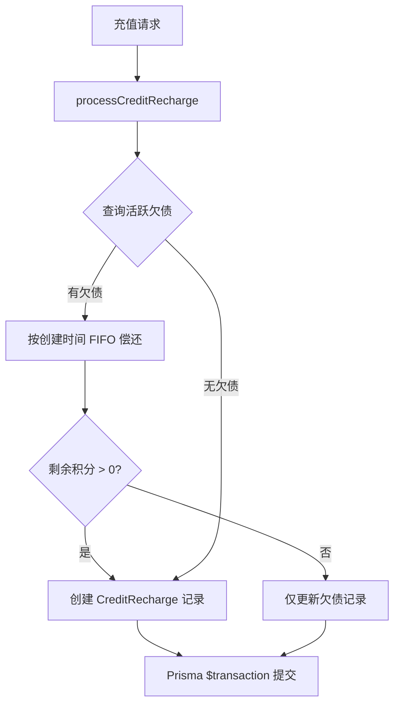
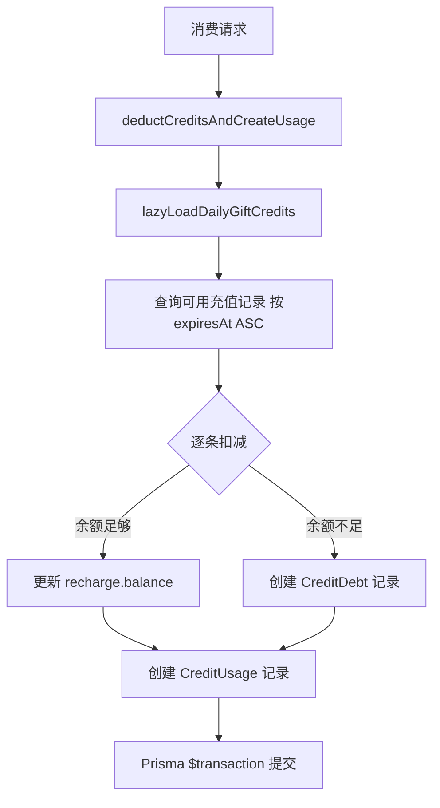
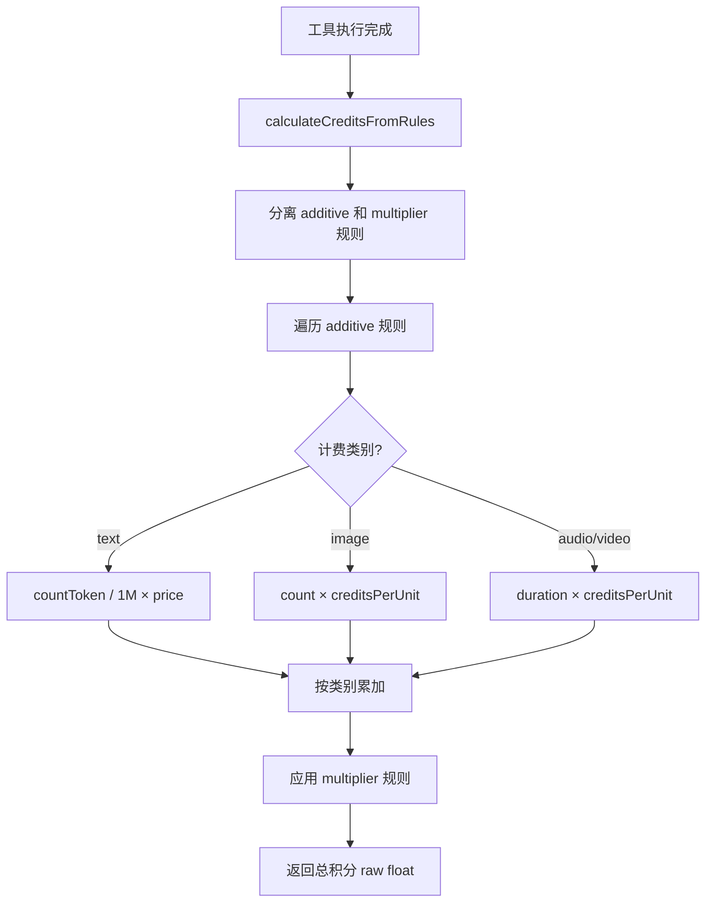

# PD-264.01 Refly — 积分经济与多维计费系统

> 文档编号：PD-264.01
> 来源：Refly `apps/api/src/modules/credit/credit.service.ts`
> GitHub：https://github.com/refly-ai/refly.git
> 问题域：PD-264 积分与计费 Credit & Billing
> 状态：可复用方案

---

## 第 1 章 问题与动机

### 1.1 核心问题

AI SaaS 产品需要一套灵活的计费系统来应对多种消费场景：LLM token 调用、工具执行、媒体生成等。传统的"按次计费"或"按月订阅"模式无法精确反映不同操作的真实成本差异。同时，系统需要处理多种充值来源（订阅、礼品、佣金、邀请奖励、积分包购买），每种来源有不同的过期策略和优先级。

更复杂的是，用户可能在余额不足时仍需继续使用服务（欠债场景），且新充值时需要自动偿还历史欠债。这要求计费系统具备完整的三向流转能力：充值 → 消费 → 欠债 → 偿还。

### 1.2 Refly 的解法概述

Refly 构建了一套完整的积分经济系统，核心设计包括：

1. **三表分离架构**：`CreditRecharge`（充值）、`CreditUsage`（消费）、`CreditDebt`（欠债）三张表独立管理，通过 Prisma 事务保证一致性（`credit.service.ts:826-872`）
2. **先偿债后入账**：所有充值操作统一走 `processCreditRecharge()`，自动按 FIFO 偿还历史欠债（`credit.service.ts:52-139`）
3. **过期优先扣减**：消费时按 `expiresAt ASC` 排序，优先消耗即将过期的积分（`credit.service.ts:786-800`）
4. **BullMQ 异步计费**：三类 Processor 分别处理 token/media/tool 的异步计费同步（`credit.processor.ts:16-71`）
5. **动态工具计费引擎**：`calculateCreditsFromRules()` 支持 text/image/audio/video 四类计费维度，含分层定价和乘数规则（`billing-calculation.ts:45-244`）

### 1.3 设计思想

| 设计原则 | 具体实现 | 理由 | 替代方案 |
|----------|----------|------|----------|
| 先偿债后入账 | `processCreditRecharge()` 先查 `creditDebt` 再创建 recharge | 防止用户欠债后充值不还，保证财务一致性 | 充值时不管欠债，消费时再扣（会导致余额虚高） |
| 过期优先消费 | `deductCreditsAndCreateUsage()` 按 `expiresAt ASC` 扣减 | 减少积分过期浪费，提升用户体验 | 按充值时间 FIFO 扣减（可能浪费快过期的积分） |
| 异步计费同步 | BullMQ 队列解耦 LLM 调用与计费 | 不阻塞主请求链路，允许批量聚合 | 同步扣费（增加请求延迟） |
| 分布式锁防并发 | Redis `acquireLock` 保护每日礼品积分创建 | 防止并发请求重复发放积分 | 数据库唯一约束（无法覆盖所有竞态场景） |
| 多维度计费规则 | `ToolBillingConfig` 支持 additive + multiplier 规则组合 | 不同工具的计费维度差异大（文本按 token、图片按张、音频按时长） | 统一按次计费（无法反映真实成本） |

---

## 第 2 章 源码实现分析

### 2.1 架构概览

Refly 的积分系统由四层组成：API 层（Controller）、服务层（CreditService + SubscriptionService）、队列层（BullMQ Processors）、存储层（Prisma + Redis）。

```
┌─────────────────────────────────────────────────────────────────┐
│                        API Layer                                 │
│  CreditController          SubscriptionWebhooks                  │
│  GET /credit/balance       checkout.session.completed             │
│  GET /credit/usage         customer.subscription.*                │
│  GET /credit/recharge                                            │
└──────────┬──────────────────────────┬────────────────────────────┘
           │                          │
           ▼                          ▼
┌──────────────────────┐   ┌──────────────────────────┐
│    CreditService     │   │  SubscriptionService     │
│  processCreditRecharge│   │  createSubscription      │
│  deductCreditsAndUsage│   │  expireAndRechargeCredits│
│  checkRequestCredit  │   │  createCheckoutSession   │
│  syncBatchToken      │   │  (Stripe integration)    │
│  syncToolCredit      │   │                          │
│  syncMediaCredit     │   │                          │
└──────────┬───────────┘   └──────────┬───────────────┘
           │                          │
           ▼                          ▼
┌──────────────────────────────────────────────────────┐
│              BullMQ Queue Layer                       │
│  SyncTokenCreditUsageProcessor                        │
│  SyncMediaCreditUsageProcessor                        │
│  SyncToolCreditUsageProcessor                         │
│  CheckCanceledSubscriptionsQueue                      │
│  ExpireAndRechargeCreditsQueue                        │
└──────────────────────┬───────────────────────────────┘
                       │
                       ▼
┌──────────────────────────────────────────────────────┐
│              Storage Layer                            │
│  Prisma: CreditRecharge | CreditUsage | CreditDebt   │
│  Redis: Distributed Locks + Cache                     │
│  Stripe: Payment + Subscription                       │
└──────────────────────────────────────────────────────┘
```

### 2.2 核心实现

#### 2.2.1 充值与偿债流程



对应源码 `apps/api/src/modules/credit/credit.service.ts:52-139`：

```typescript
private async processCreditRecharge(
  uid: string,
  creditAmount: number,
  rechargeData: {
    rechargeId: string;
    source: 'gift' | 'subscription' | 'commission' | 'invitation' | 'purchase';
    description?: string;
    createdAt: Date;
    expiresAt: Date;
  },
  now: Date = new Date(),
  extraData?: CreditRechargeExtraData,
  appId?: string,
): Promise<void> {
  // 查询所有活跃欠债，按创建时间升序（先还最老的）
  const activeDebts = await this.prisma.creditDebt.findMany({
    where: { uid, enabled: true, balance: { gt: 0 } },
    orderBy: { createdAt: 'asc' },
  });

  let remainingCredits = creditAmount;
  const debtPaymentOperations = [];

  // 先偿还欠债
  for (const debt of activeDebts) {
    if (remainingCredits <= 0) break;
    const paymentAmount = Math.min(debt.balance, remainingCredits);
    const newDebtBalance = debt.balance - paymentAmount;
    debtPaymentOperations.push(
      this.prisma.creditDebt.update({
        where: { pk: debt.pk },
        data: { balance: newDebtBalance, enabled: newDebtBalance > 0, updatedAt: now },
      }),
    );
    remainingCredits -= paymentAmount;
  }

  const operations = [...debtPaymentOperations];
  // 仅当偿债后仍有剩余时才创建充值记录
  if (remainingCredits > 0) {
    operations.push(
      this.prisma.creditRecharge.createMany({
        data: [{ rechargeId: rechargeData.rechargeId, uid, amount: remainingCredits,
                 balance: remainingCredits, enabled: true, source: rechargeData.source,
                 createdAt: rechargeData.createdAt, expiresAt: rechargeData.expiresAt,
                 extraData: JSON.stringify(extraData) }],
        skipDuplicates: true,
      }),
    );
  }
  await this.prisma.$transaction(operations);
}
```

#### 2.2.2 消费与欠债创建流程



对应源码 `apps/api/src/modules/credit/credit.service.ts:762-875`：

```typescript
private async deductCreditsAndCreateUsage(
  uid: string, creditCost: number, usageData: { ... }, dueAmount?: number,
): Promise<boolean> {
  await this.lazyLoadDailyGiftCredits(uid);

  // 按过期时间升序获取可用充值记录（优先消耗即将过期的）
  const creditRecharges = await this.prisma.creditRecharge.findMany({
    where: { uid, enabled: true, expiresAt: { gte: new Date() }, balance: { gt: 0 } },
    orderBy: { expiresAt: 'asc' },
  });

  const deductionOperations = [];
  let remainingCost = creditCost;

  for (const recharge of creditRecharges) {
    if (remainingCost <= 0) break;
    const deductAmount = Math.min(recharge.balance, remainingCost);
    deductionOperations.push(
      this.prisma.creditRecharge.update({
        where: { pk: recharge.pk },
        data: { balance: recharge.balance - deductAmount },
      }),
    );
    remainingCost -= deductAmount;
  }

  const transactionOperations = [
    this.prisma.creditUsage.create({ data: { uid, amount: creditCost, dueAmount, ... } }),
    ...deductionOperations,
  ];

  // 余额不足时创建欠债记录
  if (remainingCost > 0) {
    transactionOperations.push(
      this.prisma.creditDebt.create({
        data: { debtId: genCreditDebtId(), uid, amount: remainingCost,
                balance: remainingCost, enabled: true, source: 'usage_overdraft' },
      }),
    );
  }
  await this.prisma.$transaction(transactionOperations);
  return remainingCost > 0;
}
```

#### 2.2.3 动态工具计费引擎



对应源码 `apps/api/src/modules/tool/utils/billing-calculation.ts:45-244`：

```typescript
export async function calculateCreditsFromRules(
  config: ToolBillingConfig, input: Record<string, unknown>,
  output: Record<string, unknown>, requestSchema: string,
  responseSchema: string, logger?: Logger,
): Promise<number> {
  const additiveRules = rules.filter((r) => !r.isMultiplier) as AdditiveBillingRule[];
  const multiplierRules = rules.filter((r) => r.isMultiplier) as MultiplierBillingRule[];

  const creditsByCategory: Record<BillingCategory, number> = { text: 0, image: 0, audio: 0, video: 0 };

  for (const rule of additiveRules) {
    const value = extractAndAggregateValue(source, rule.fieldPath, rule.category);
    let credits: number;
    if (tokenPricing && rule.category === 'text') {
      // USD 定价: (tokens / 1M) × pricePer1MUsd × USD_TO_CREDITS_RATE(120)
      credits = units * pricePer1MUsd * USD_TO_CREDITS_RATE;
    } else {
      credits = units * creditsPerUnit;
    }
    creditsByCategory[rule.category] += credits;
  }

  // 应用乘数规则
  for (const multiplier of multiplierRules) {
    creditsByCategory[multiplier.applyTo] *= Number(get(source, multiplier.fieldPath));
  }

  return Object.values(creditsByCategory).reduce((sum, c) => sum + c, 0);
}
```

### 2.3 实现细节

**懒加载每日礼品积分**（`credit.service.ts:582-695`）：系统不在每天凌晨批量发放礼品积分，而是在用户首次查询余额或消费时按需创建。通过 Redis 分布式锁 `gift_credit_lock:{uid}` 防止并发重复发放。这种设计避免了为不活跃用户创建无用记录。

**BullMQ 三队列异步计费**（`credit.processor.ts:16-71`）：LLM 调用完成后，token 用量通过 `QUEUE_SYNC_TOKEN_CREDIT_USAGE` 队列异步同步到计费系统。媒体生成和工具调用分别走独立队列。这种解耦确保计费失败不会阻塞主请求。

**Stripe Webhook 双路径处理**：`checkout.session.completed` 事件根据 `metadata.purpose` 区分订阅购买和积分包购买，走不同的充值路径。订阅购买触发 `createSubscriptionCreditRecharge()`，积分包购买触发 `createCreditPackRecharge()`。

**USD 到积分的转换率**：`billing-calculation.ts:25-31` 定义了 `USD_TO_CREDITS_RATE = 120`（可通过环境变量覆盖），用于将 LLM 供应商的 USD 定价转换为内部积分单位。

**微积分累加器**：`CreditAccumulatorSnapshot` 表使用 `remainderMicroCredits` 字段（1 credit = 1,000,000 micro-credits）追踪小数积分，避免频繁的 ceil 操作导致积分膨胀。


---

## 第 3 章 迁移指南

### 3.1 迁移清单

**阶段 1：数据模型（1-2 天）**
- [ ] 创建 `credit_recharge` 表（含 `balance`、`expiresAt`、`source` 字段）
- [ ] 创建 `credit_usage` 表（含 `amount`、`dueAmount`、`usageType` 字段）
- [ ] 创建 `credit_debt` 表（含 `balance`、`source` 字段）
- [ ] 添加索引：`(uid, enabled, expiresAt)` 和 `(uid, source, enabled)`

**阶段 2：核心服务（2-3 天）**
- [ ] 实现 `processCreditRecharge()` — 先偿债后入账逻辑
- [ ] 实现 `deductCreditsAndCreateUsage()` — 过期优先扣减 + 欠债创建
- [ ] 实现 `getCreditBalance()` — 余额查询（含欠债净值计算）
- [ ] 集成分布式锁（Redis）防止并发充值

**阶段 3：异步计费（1-2 天）**
- [ ] 配置 BullMQ 队列（token/media/tool 三队列）
- [ ] 实现 Processor 消费者
- [ ] 在 LLM 调用链路中添加队列投递

**阶段 4：支付集成（2-3 天）**
- [ ] 集成 Stripe Checkout Session（订阅 + 积分包）
- [ ] 实现 Webhook 处理器
- [ ] 配置 Stripe Portal Session（用户自助管理）

### 3.2 适配代码模板

以下是一个可直接复用的 TypeScript/NestJS 积分扣减服务模板：

```typescript
import { Injectable } from '@nestjs/common';
import { PrismaService } from './prisma.service';

interface DeductResult {
  success: boolean;
  hasDebt: boolean;
  debtAmount: number;
}

@Injectable()
export class CreditDeductionService {
  constructor(private readonly prisma: PrismaService) {}

  /**
   * 扣减积分并创建消费记录
   * 核心逻辑：按过期时间升序扣减，余额不足时创建欠债
   */
  async deductCredits(
    uid: string,
    cost: number,
    usageType: string,
    description: string,
  ): Promise<DeductResult> {
    // 1. 获取可用充值记录（按过期时间升序）
    const recharges = await this.prisma.creditRecharge.findMany({
      where: {
        uid,
        enabled: true,
        expiresAt: { gte: new Date() },
        balance: { gt: 0 },
      },
      orderBy: { expiresAt: 'asc' },
    });

    // 2. 逐条扣减
    const ops = [];
    let remaining = cost;

    for (const r of recharges) {
      if (remaining <= 0) break;
      const deduct = Math.min(r.balance, remaining);
      ops.push(
        this.prisma.creditRecharge.update({
          where: { id: r.id },
          data: { balance: r.balance - deduct },
        }),
      );
      remaining -= deduct;
    }

    // 3. 创建消费记录
    ops.push(
      this.prisma.creditUsage.create({
        data: { uid, amount: cost, usageType, description, createdAt: new Date() },
      }),
    );

    // 4. 余额不足时创建欠债
    if (remaining > 0) {
      ops.push(
        this.prisma.creditDebt.create({
          data: { uid, amount: remaining, balance: remaining, enabled: true, source: 'overdraft' },
        }),
      );
    }

    // 5. 事务提交
    await this.prisma.$transaction(ops);

    return { success: true, hasDebt: remaining > 0, debtAmount: remaining };
  }

  /**
   * 充值并自动偿债
   */
  async rechargeWithDebtPayment(
    uid: string,
    amount: number,
    source: string,
    expiresAt: Date,
  ): Promise<void> {
    const debts = await this.prisma.creditDebt.findMany({
      where: { uid, enabled: true, balance: { gt: 0 } },
      orderBy: { createdAt: 'asc' },
    });

    let remaining = amount;
    const ops = [];

    for (const debt of debts) {
      if (remaining <= 0) break;
      const payment = Math.min(debt.balance, remaining);
      ops.push(
        this.prisma.creditDebt.update({
          where: { id: debt.id },
          data: { balance: debt.balance - payment, enabled: debt.balance - payment > 0 },
        }),
      );
      remaining -= payment;
    }

    if (remaining > 0) {
      ops.push(
        this.prisma.creditRecharge.create({
          data: { uid, amount: remaining, balance: remaining, enabled: true, source, expiresAt },
        }),
      );
    }

    await this.prisma.$transaction(ops);
  }
}
```

### 3.3 适用场景

| 场景 | 适用度 | 说明 |
|------|--------|------|
| AI SaaS 多模型计费 | ⭐⭐⭐ | 完美匹配：多种 LLM 调用 + 工具调用 + 媒体生成的混合计费 |
| 订阅制 + 按量付费混合 | ⭐⭐⭐ | 订阅提供月度积分配额，超出部分按量扣减或产生欠债 |
| 积分商城/虚拟货币系统 | ⭐⭐⭐ | 多来源充值 + 过期管理 + 欠债偿还的完整积分经济 |
| 简单按次计费 | ⭐ | 过度设计：如果只需要简单的按次扣费，不需要这套复杂架构 |
| 实时竞价/高频交易 | ⭐ | 不适合：Prisma 事务 + BullMQ 异步的延迟不满足毫秒级要求 |

---

## 第 4 章 测试用例

```typescript
import { Test, TestingModule } from '@nestjs/testing';
import { PrismaService } from './prisma.service';
import { CreditDeductionService } from './credit-deduction.service';

describe('CreditDeductionService', () => {
  let service: CreditDeductionService;
  let prisma: PrismaService;

  beforeEach(async () => {
    const module: TestingModule = await Test.createTestingModule({
      providers: [CreditDeductionService, PrismaService],
    }).compile();
    service = module.get(CreditDeductionService);
    prisma = module.get(PrismaService);
  });

  describe('deductCredits', () => {
    it('should deduct from earliest-expiring recharge first', async () => {
      // Setup: 两条充值记录，一条明天过期，一条下月过期
      const tomorrow = new Date(); tomorrow.setDate(tomorrow.getDate() + 1);
      const nextMonth = new Date(); nextMonth.setMonth(nextMonth.getMonth() + 1);

      await prisma.creditRecharge.createMany({
        data: [
          { uid: 'u1', amount: 100, balance: 100, enabled: true, expiresAt: tomorrow, source: 'gift' },
          { uid: 'u1', amount: 200, balance: 200, enabled: true, expiresAt: nextMonth, source: 'subscription' },
        ],
      });

      // Act: 扣减 150 积分
      const result = await service.deductCredits('u1', 150, 'model_call', 'test');

      // Assert: 先扣完明天过期的 100，再从下月过期的扣 50
      expect(result.success).toBe(true);
      expect(result.hasDebt).toBe(false);

      const recharges = await prisma.creditRecharge.findMany({
        where: { uid: 'u1' }, orderBy: { expiresAt: 'asc' },
      });
      expect(recharges[0].balance).toBe(0);   // 明天过期的已扣完
      expect(recharges[1].balance).toBe(150);  // 下月过期的剩 150
    });

    it('should create debt when insufficient balance', async () => {
      await prisma.creditRecharge.create({
        data: { uid: 'u1', amount: 50, balance: 50, enabled: true,
                expiresAt: new Date(Date.now() + 86400000), source: 'gift' },
      });

      const result = await service.deductCredits('u1', 80, 'tool_call', 'test');

      expect(result.hasDebt).toBe(true);
      expect(result.debtAmount).toBe(30);

      const debt = await prisma.creditDebt.findFirst({ where: { uid: 'u1' } });
      expect(debt.balance).toBe(30);
      expect(debt.source).toBe('overdraft');
    });
  });

  describe('rechargeWithDebtPayment', () => {
    it('should pay off debts before creating recharge', async () => {
      // Setup: 用户有 30 积分欠债
      await prisma.creditDebt.create({
        data: { uid: 'u1', amount: 30, balance: 30, enabled: true, source: 'overdraft' },
      });

      // Act: 充值 100 积分
      const expiresAt = new Date(); expiresAt.setMonth(expiresAt.getMonth() + 1);
      await service.rechargeWithDebtPayment('u1', 100, 'subscription', expiresAt);

      // Assert: 欠债清零，充值记录只有 70
      const debt = await prisma.creditDebt.findFirst({ where: { uid: 'u1' } });
      expect(debt.balance).toBe(0);
      expect(debt.enabled).toBe(false);

      const recharge = await prisma.creditRecharge.findFirst({ where: { uid: 'u1' } });
      expect(recharge.balance).toBe(70);
    });

    it('should fully consume recharge when debt exceeds amount', async () => {
      await prisma.creditDebt.create({
        data: { uid: 'u1', amount: 200, balance: 200, enabled: true, source: 'overdraft' },
      });

      const expiresAt = new Date(); expiresAt.setMonth(expiresAt.getMonth() + 1);
      await service.rechargeWithDebtPayment('u1', 50, 'gift', expiresAt);

      // 欠债减少 50，无新充值记录
      const debt = await prisma.creditDebt.findFirst({ where: { uid: 'u1' } });
      expect(debt.balance).toBe(150);

      const rechargeCount = await prisma.creditRecharge.count({ where: { uid: 'u1' } });
      expect(rechargeCount).toBe(0);
    });
  });

  describe('calculateCreditsFromRules', () => {
    it('should calculate text billing with USD pricing', async () => {
      const config = {
        rules: [{ fieldPath: 'prompt', phase: 'input', category: 'text',
                  defaultCreditsPerUnit: 0, isMultiplier: false }],
        tokenPricing: { inputPer1MUsd: 3.0, outputPer1MUsd: 15.0 },
      };
      // 假设 "hello world" ≈ 2 tokens → 2/1M × 3.0 × 120 ≈ 0.00072
      const credits = await calculateCreditsFromRules(
        config, { prompt: 'hello world' }, {}, '{"properties":{"prompt":{"type":"string"}}}',
        '{}',
      );
      expect(credits).toBeGreaterThan(0);
      expect(credits).toBeLessThan(1);
    });
  });
});
```


---

## 第 5 章 跨域关联

| 关联域 | 关系类型 | 说明 |
|--------|----------|------|
| PD-11 可观测性 | 协同 | `CreditUsage` 记录的 `modelUsageDetails` 字段存储了每次调用的 token 明细（input/output/cacheRead/cacheWrite），可作为成本追踪的数据源。`dueAmount` vs `amount` 的差值反映了 Early Bird 折扣的实际成本 |
| PD-03 容错与重试 | 依赖 | BullMQ Processor 配置了 `attempts: 3` + 指数退避重试策略（`subscription.service.ts:129-133`），确保计费同步任务在临时故障后能恢复。`expireAndRechargeCredits` 使用分布式锁防止重复执行 |
| PD-06 记忆持久化 | 协同 | 积分余额通过 `getCreditBalance()` 实时计算而非缓存，但每日礼品积分使用懒加载 + Redis 锁的模式，类似记忆系统的按需加载策略 |
| PD-02 多 Agent 编排 | 依赖 | 工作流执行（`workflowExecution`）的积分统计通过 `countExecutionCreditUsageByExecutionId()` 聚合所有子步骤的消费，反映了多 Agent 编排场景下的成本归因需求 |
| PD-04 工具系统 | 依赖 | `ToolBillingConfig` 与工具注册系统深度集成，每个工具可定义独立的计费规则（additive + multiplier），通过 `fieldPath` 从工具输入/输出中提取计费维度 |

---

## 第 6 章 来源文件索引

| 文件 | 行范围 | 关键实现 |
|------|--------|----------|
| `apps/api/src/modules/credit/credit.service.ts` | L52-L139 | `processCreditRecharge()` 先偿债后入账核心逻辑 |
| `apps/api/src/modules/credit/credit.service.ts` | L582-L695 | `lazyLoadDailyGiftCredits()` 懒加载 + Redis 分布式锁 |
| `apps/api/src/modules/credit/credit.service.ts` | L762-L875 | `deductCreditsAndCreateUsage()` 过期优先扣减 + 欠债创建 |
| `apps/api/src/modules/credit/credit.service.ts` | L987-L1107 | `syncBatchTokenCreditUsage()` 批量 token 计费同步 |
| `apps/api/src/modules/credit/credit.service.ts` | L1314-L1388 | `getCreditBalance()` 余额查询含欠债净值 |
| `apps/api/src/modules/credit/credit.processor.ts` | L16-L71 | 三类 BullMQ Processor（token/media/tool） |
| `apps/api/src/modules/tool/utils/billing-calculation.ts` | L45-L244 | `calculateCreditsFromRules()` 动态工具计费引擎 |
| `apps/api/src/modules/tool/utils/billing-calculation.ts` | L253-L287 | `calculateUnits()` 四类计费维度单位计算 |
| `apps/api/src/modules/subscription/subscription.service.ts` | L172-L328 | `createCheckoutSession()` Stripe 订阅结账 |
| `apps/api/src/modules/subscription/subscription.service.ts` | L455-L542 | `createSubscription()` 订阅创建 + 积分充值 + 首订礼品 |
| `apps/api/src/modules/subscription/subscription.service.ts` | L620-L791 | `expireAndRechargeCredits()` 过期续充定时任务 |
| `apps/api/src/utils/credit-billing.ts` | L1-L57 | `normalizeCreditBilling()` 兼容旧版计费格式 |

---

## 第 7 章 横向对比维度

```json comparison_data
{
  "project": "Refly",
  "dimensions": {
    "积分模型": "三表分离（Recharge/Usage/Debt）+ 过期优先扣减 + 先偿债后入账",
    "计费粒度": "四维度动态规则引擎（text/image/audio/video）+ additive/multiplier 组合",
    "支付集成": "Stripe Checkout Session + Webhook 双路径（订阅/积分包）+ Portal 自助管理",
    "异步架构": "BullMQ 三队列（token/media/tool）+ 定时任务（过期续充/取消检查）",
    "并发控制": "Redis 分布式锁（礼品积分/过期续充/Meter 创建）防重复",
    "多来源归因": "5 种充值来源（subscription/gift/commission/invitation/purchase）独立追踪",
    "微积分精度": "CreditAccumulatorSnapshot 微积分（1:1M）防 ceil 膨胀"
  }
}
```

### 域元数据补充

```json domain_metadata
{
  "solution_summary": "Refly 用三表分离（Recharge/Usage/Debt）+ BullMQ 三队列异步计费 + 四维度动态规则引擎实现完整积分经济系统，支持先偿债后入账和过期优先扣减",
  "description": "AI SaaS 产品的虚拟积分经济系统，覆盖充值/消费/欠债全生命周期",
  "sub_problems": [
    "每日礼品积分懒加载与分布式锁防并发",
    "微积分累加器防 ceil 精度膨胀",
    "订阅过期自动续充定时任务",
    "佣金分成与模板创作者激励"
  ],
  "best_practices": [
    "按过期时间升序扣减积分减少浪费",
    "BullMQ 异步解耦计费与主请求链路",
    "Redis 分布式锁保护所有积分写入操作",
    "USD_TO_CREDITS_RATE 环境变量化便于调价"
  ]
}
```

